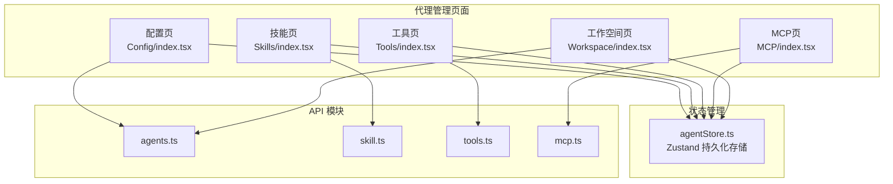
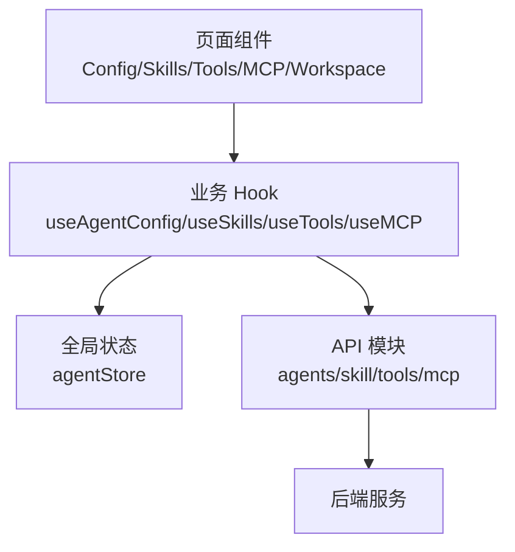
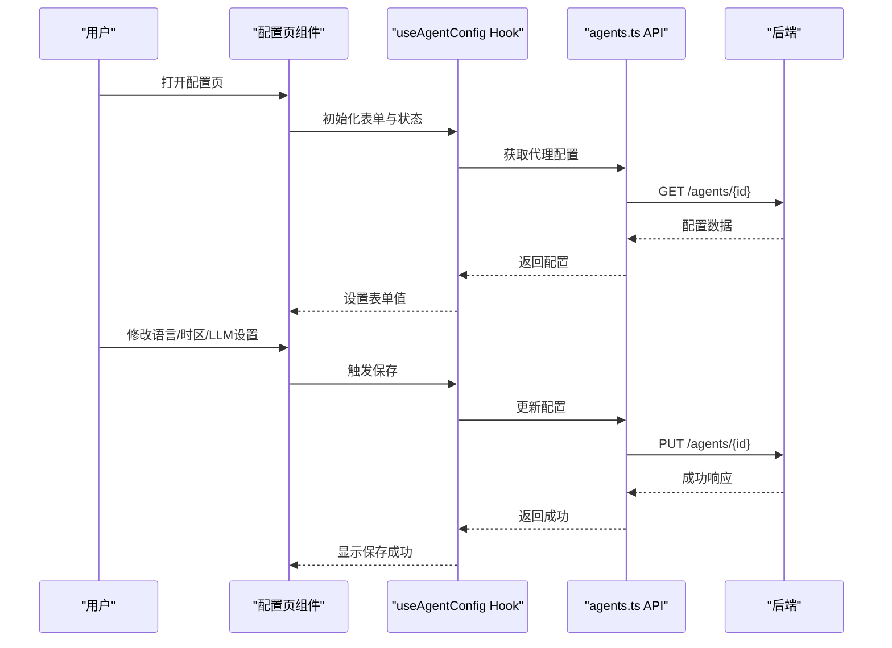
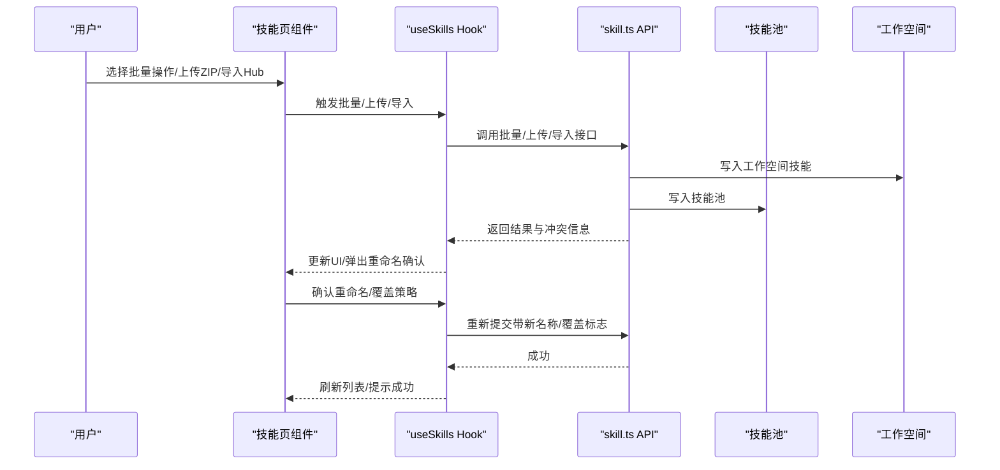
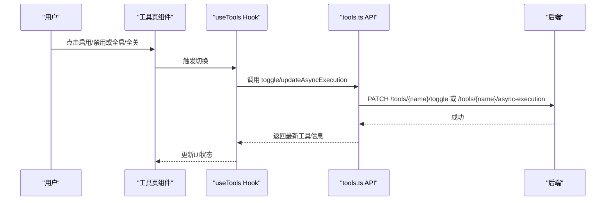
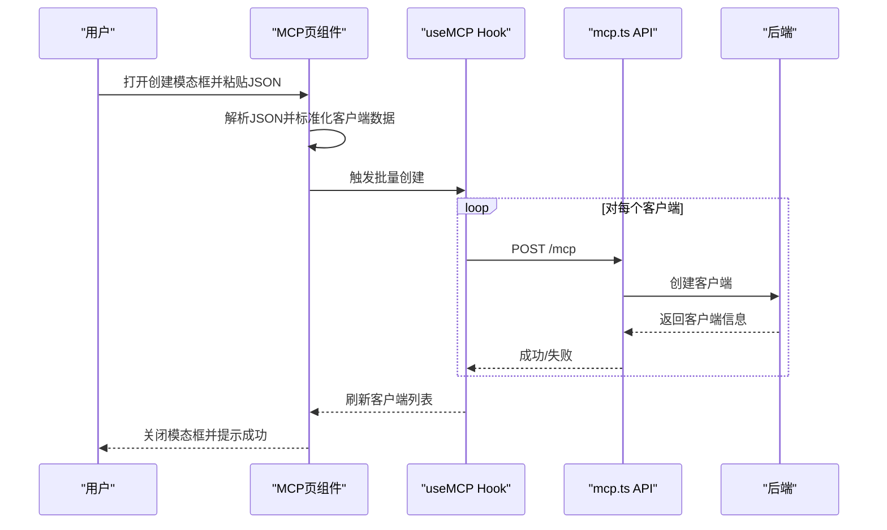
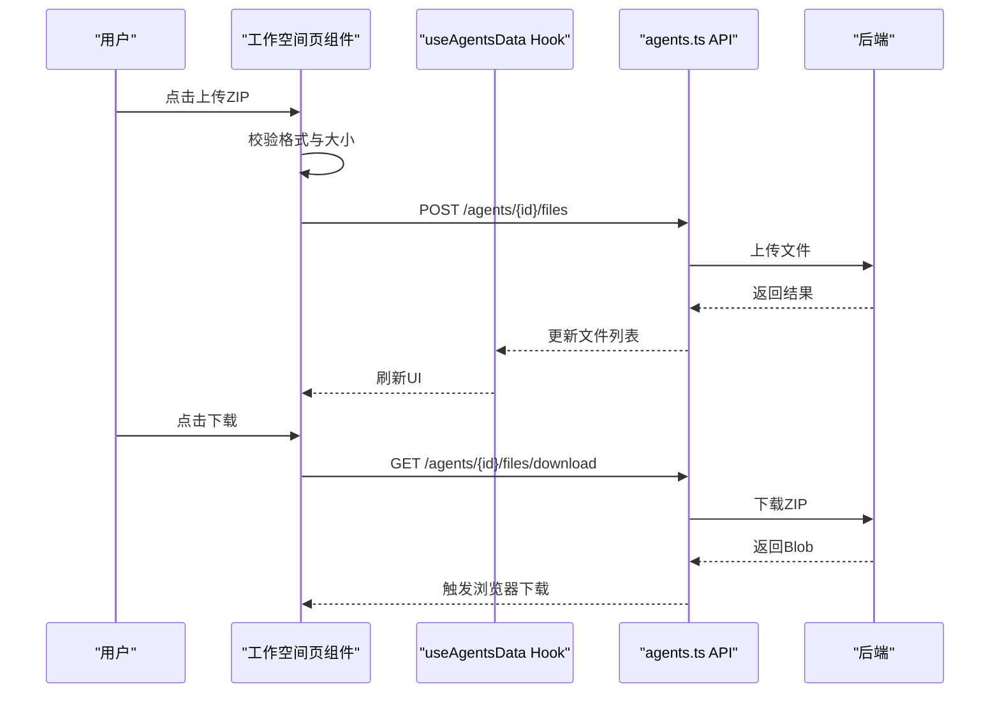
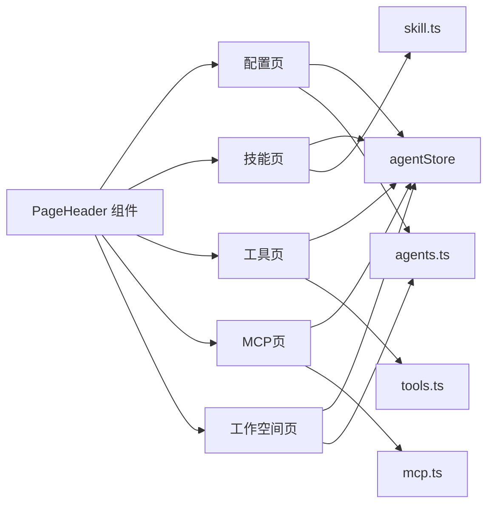

# 代理管理页面

<cite>
**本文档引用的文件**
- [console/src/pages/Agent/Config/index.tsx](file://console/src/pages/Agent/Config/index.tsx)
- [console/src/pages/Agent/Skills/index.tsx](file://console/src/pages/Agent/Skills/index.tsx)
- [console/src/pages/Agent/Tools/index.tsx](file://console/src/pages/Agent/Tools/index.tsx)
- [console/src/pages/Agent/MCP/index.tsx](file://console/src/pages/Agent/MCP/index.tsx)
- [console/src/pages/Agent/Workspace/index.tsx](file://console/src/pages/Agent/Workspace/index.tsx)
- [console/src/stores/agentStore.ts](file://console/src/stores/agentStore.ts)
- [console/src/api/modules/agents.ts](file://console/src/api/modules/agents.ts)
- [console/src/api/modules/skill.ts](file://console/src/api/modules/skill.ts)
- [console/src/api/modules/tools.ts](file://console/src/api/modules/tools.ts)
- [console/src/api/modules/mcp.ts](file://console/src/api/modules/mcp.ts)
- [console/src/components/PageHeader/index.tsx](file://console/src/components/PageHeader/index.tsx)
- [console/src/hooks/useProgressiveRender.ts](file://console/src/hooks/useProgressiveRender.ts)
- [console/src/utils/error.ts](file://console/src/utils/error.ts)
- [console/src/utils/skill.ts](file://console/src/utils/skill.ts)
</cite>

## 目录
1. [简介](#简介)
2. [项目结构](#项目结构)
3. [核心组件](#核心组件)
4. [架构总览](#架构总览)
5. [详细组件分析](#详细组件分析)
6. [依赖关系分析](#依赖关系分析)
7. [性能考虑](#性能考虑)
8. [故障排除指南](#故障排除指南)
9. [结论](#结论)
10. [附录](#附录)

## 简介
本文件面向代理管理页面，系统性阐述代理配置、技能管理、工具管理、MCP 客户端管理与工作空间管理等子页面的实现细节。内容涵盖代理创建流程、配置选项、技能池操作、工具注册与异步执行开关、MCP 客户端管理（创建/更新/删除/启用禁用）、工作空间文件上传下载与编辑、页面状态管理、表单验证、数据持久化与实时更新机制，并补充代理生命周期管理、配置导入导出与批量操作的实现方式。

## 项目结构
代理管理页面位于前端控制台的 Agent 子模块中，采用按页面拆分的组织方式：每个子页面独立目录包含页面入口、样式与业务逻辑 Hook；全局状态通过 Zustand 的 agentStore 管理；API 层封装在 modules 下，分别对应 agents、skills、tools、mcp 等模块。

**图表来源**
- [console/src/pages/Agent/Config/index.tsx:1-106](file://console/src/pages/Agent/Config/index.tsx#L1-L106)
- [console/src/pages/Agent/Skills/index.tsx:1-876](file://console/src/pages/Agent/Skills/index.tsx#L1-L876)
- [console/src/pages/Agent/Tools/index.tsx:1-124](file://console/src/pages/Agent/Tools/index.tsx#L1-L124)
- [console/src/pages/Agent/MCP/index.tsx:1-245](file://console/src/pages/Agent/MCP/index.tsx#L1-L245)
- [console/src/pages/Agent/Workspace/index.tsx:1-186](file://console/src/pages/Agent/Workspace/index.tsx#L1-L186)
- [console/src/stores/agentStore.ts:1-89](file://console/src/stores/agentStore.ts#L1-L89)
- [console/src/api/modules/agents.ts:1-79](file://console/src/api/modules/agents.ts#L1-L79)
- [console/src/api/modules/skill.ts:1-551](file://console/src/api/modules/skill.ts#L1-L551)
- [console/src/api/modules/tools.ts:1-37](file://console/src/api/modules/tools.ts#L1-L37)
- [console/src/api/modules/mcp.ts:1-61](file://console/src/api/modules/mcp.ts#L1-L61)

**章节来源**
- [console/src/pages/Agent/Config/index.tsx:1-106](file://console/src/pages/Agent/Config/index.tsx#L1-L106)
- [console/src/pages/Agent/Skills/index.tsx:1-876](file://console/src/pages/Agent/Skills/index.tsx#L1-L876)
- [console/src/pages/Agent/Tools/index.tsx:1-124](file://console/src/pages/Agent/Tools/index.tsx#L1-L124)
- [console/src/pages/Agent/MCP/index.tsx:1-245](file://console/src/pages/Agent/MCP/index.tsx#L1-L245)
- [console/src/pages/Agent/Workspace/index.tsx:1-186](file://console/src/pages/Agent/Workspace/index.tsx#L1-L186)
- [console/src/stores/agentStore.ts:1-89](file://console/src/stores/agentStore.ts#L1-L89)

## 核心组件
- 页面容器与面包屑：使用 PageHeader 组件提供导航与标题展示，统一风格与交互。
- 状态管理：agentStore 提供当前选中代理、代理列表与聊天上下文记忆，支持持久化到 sessionStorage。
- API 封装：各模块 API 负责与后端交互，提供缓存与错误处理能力。
- Hook 与工具：useProgressiveRender 实现长列表渐进渲染，parseErrorDetail 统一解析错误详情，isSkillBuiltin 判断内置技能来源。

**章节来源**
- [console/src/components/PageHeader/index.tsx](file://console/src/components/PageHeader/index.tsx)
- [console/src/stores/agentStore.ts:1-89](file://console/src/stores/agentStore.ts#L1-L89)
- [console/src/hooks/useProgressiveRender.ts](file://console/src/hooks/useProgressiveRender.ts)
- [console/src/utils/error.ts](file://console/src/utils/error.ts)
- [console/src/utils/skill.ts](file://console/src/utils/skill.ts)

## 架构总览
代理管理页面采用“页面组件 + Hook + API 模块 + 全局状态”的分层架构。页面组件负责 UI 与交互编排，Hook 抽象业务逻辑与副作用，API 模块封装网络请求与缓存，全局状态管理跨页面共享代理上下文。

**图表来源**
- [console/src/pages/Agent/Config/index.tsx:1-106](file://console/src/pages/Agent/Config/index.tsx#L1-L106)
- [console/src/pages/Agent/Skills/index.tsx:1-876](file://console/src/pages/Agent/Skills/index.tsx#L1-L876)
- [console/src/pages/Agent/Tools/index.tsx:1-124](file://console/src/pages/Agent/Tools/index.tsx#L1-L124)
- [console/src/pages/Agent/MCP/index.tsx:1-245](file://console/src/pages/Agent/MCP/index.tsx#L1-L245)
- [console/src/pages/Agent/Workspace/index.tsx:1-186](file://console/src/pages/Agent/Workspace/index.tsx#L1-L186)
- [console/src/stores/agentStore.ts:1-89](file://console/src/stores/agentStore.ts#L1-L89)
- [console/src/api/modules/agents.ts:1-79](file://console/src/api/modules/agents.ts#L1-L79)
- [console/src/api/modules/skill.ts:1-551](file://console/src/api/modules/skill.ts#L1-L551)
- [console/src/api/modules/tools.ts:1-37](file://console/src/api/modules/tools.ts#L1-L37)
- [console/src/api/modules/mcp.ts:1-61](file://console/src/api/modules/mcp.ts#L1-L61)

## 详细组件分析

### 代理配置页面（AgentConfigPage）
- 功能概述
  - 展示并编辑代理的语言、时区、LLM 重试、速率限制、上下文压缩、工具结果压缩、内存摘要与嵌入配置等卡片式设置。
  - 支持加载失败重试、保存状态反馈与语言/时区变更的即时保存提示。
- 状态与交互
  - 使用 useAgentConfig Hook 管理表单、加载、保存与错误状态；通过 Form.useWatch 监听字段变化以驱动卡片行为。
  - 语言与时区变更通过独立保存流程避免频繁写入。
- 数据流
  - 读取配置 → 表单初始化 → 用户修改 → 保存到后端 → 缓存失效与刷新。

**图表来源**
- [console/src/pages/Agent/Config/index.tsx:1-106](file://console/src/pages/Agent/Config/index.tsx#L1-L106)
- [console/src/api/modules/agents.ts:1-79](file://console/src/api/modules/agents.ts#L1-L79)

**章节来源**
- [console/src/pages/Agent/Config/index.tsx:1-106](file://console/src/pages/Agent/Config/index.tsx#L1-L106)
- [console/src/api/modules/agents.ts:1-79](file://console/src/api/modules/agents.ts#L1-L79)

### 技能管理页面（SkillsPage）
- 功能概述
  - 技能的增删改查、启用/禁用、批量操作、搜索过滤、视图切换（网格/列表）。
  - 支持从本地 ZIP 导入、从 Hub 安装、上传至技能池、从技能池下载。
  - 冲突处理（重命名建议）、标签与渠道管理、AI 优化流式处理。
- 状态与交互
  - 使用 useSkills Hook 管理技能列表、上传/导入状态、筛选与排序；useSkillFilter 提供搜索与标签过滤。
  - 渐进渲染 useProgressiveRender 优化长列表性能。
  - 冲突重命名通过 useConflictRenameModal 弹窗处理。
- 数据流
  - 列表获取 → 缓存命中/未命中 → 用户操作（创建/编辑/删除/启用/导入/上传/下载）→ 并发侧更新（渠道/标签）→ 缓存失效与刷新。

**图表来源**
- [console/src/pages/Agent/Skills/index.tsx:1-876](file://console/src/pages/Agent/Skills/index.tsx#L1-L876)
- [console/src/api/modules/skill.ts:1-551](file://console/src/api/modules/skill.ts#L1-L551)

**章节来源**
- [console/src/pages/Agent/Skills/index.tsx:1-876](file://console/src/pages/Agent/Skills/index.tsx#L1-L876)
- [console/src/api/modules/skill.ts:1-551](file://console/src/api/modules/skill.ts#L1-L551)
- [console/src/hooks/useProgressiveRender.ts](file://console/src/hooks/useProgressiveRender.ts)
- [console/src/utils/error.ts](file://console/src/utils/error.ts)
- [console/src/utils/skill.ts](file://console/src/utils/skill.ts)

### 工具管理页面（ToolsPage）
- 功能概述
  - 展示所有内置工具，支持启用/禁用、一键全启/全关、Shell 工具的异步执行模式切换。
  - 工具状态实时更新，支持批量加载状态。
- 状态与交互
  - 使用 useTools Hook 管理工具列表与批量状态；根据 enabled/disabled 计算全启/全关按钮状态。
  - Shell 工具提供异步执行开关，仅在启用状态下可切换。
- 数据流
  - 加载工具列表 → 用户点击切换 → 调用工具 API → 后端持久化 → 前端刷新状态。

**图表来源**
- [console/src/pages/Agent/Tools/index.tsx:1-124](file://console/src/pages/Agent/Tools/index.tsx#L1-L124)
- [console/src/api/modules/tools.ts:1-37](file://console/src/api/modules/tools.ts#L1-L37)

**章节来源**
- [console/src/pages/Agent/Tools/index.tsx:1-124](file://console/src/pages/Agent/Tools/index.tsx#L1-L124)
- [console/src/api/modules/tools.ts:1-37](file://console/src/api/modules/tools.ts#L1-L37)

### MCP 客户端管理页面（MCPPage）
- 功能概述
  - 支持创建/更新/删除/启用/禁用 MCP 客户端；支持多种传输协议（stdio、streamable_http、sse）。
  - JSON 导入支持三种格式：标准 mcpServers、直接对象、单个客户端对象。
- 状态与交互
  - 使用 useMCP Hook 管理客户端列表与状态；normalizeTransport 与 normalizeClientData 标准化输入。
  - 创建时解析 JSON，支持多客户端批量创建；失败时提示无效格式。
- 数据流
  - 用户输入 JSON → 解析与标准化 → 调用创建接口 → 成功则清空表单并刷新列表。

**图表来源**
- [console/src/pages/Agent/MCP/index.tsx:1-245](file://console/src/pages/Agent/MCP/index.tsx#L1-L245)
- [console/src/api/modules/mcp.ts:1-61](file://console/src/api/modules/mcp.ts#L1-L61)

**章节来源**
- [console/src/pages/Agent/MCP/index.tsx:1-245](file://console/src/pages/Agent/MCP/index.tsx#L1-L245)
- [console/src/api/modules/mcp.ts:1-61](file://console/src/api/modules/mcp.ts#L1-L61)

### 工作空间管理页面（WorkspacePage）
- 功能概述
  - 文件列表与编辑器分离布局；支持 ZIP 包上传与下载；每日记忆与文件启用/禁用、重排序。
- 状态与交互
  - 使用 useAgentsData Hook 管理文件列表、选中文件、内容、变更状态与路径；上传/下载通过 workspaceApi 调用。
  - 上传前校验 ZIP 格式与大小；下载返回 Blob 并触发浏览器下载。
- 数据流
  - 获取文件列表 → 用户选择文件 → 编辑器加载内容 → 保存/重置 → 后端持久化。

**图表来源**
- [console/src/pages/Agent/Workspace/index.tsx:1-186](file://console/src/pages/Agent/Workspace/index.tsx#L1-L186)
- [console/src/api/modules/agents.ts:1-79](file://console/src/api/modules/agents.ts#L1-L79)

**章节来源**
- [console/src/pages/Agent/Workspace/index.tsx:1-186](file://console/src/pages/Agent/Workspace/index.tsx#L1-L186)
- [console/src/api/modules/agents.ts:1-79](file://console/src/api/modules/agents.ts#L1-L79)

## 依赖关系分析
- 组件耦合
  - 页面组件对 Hook 与 API 模块存在直接依赖；Hook 依赖全局状态与工具函数。
  - PageHeader 组件被多个页面复用，保持一致的导航体验。
- 外部依赖
  - 设计库 @agentscope-ai/design 与图标库 @ant-design/icons 提供 UI 组件与图标。
  - dayjs 用于相对时间显示，sessionStorage 用于 agentStore 的持久化。
- 循环依赖
  - 当前结构未发现循环依赖；API 模块仅向上游提供请求方法，不反向依赖页面。

**图表来源**
- [console/src/components/PageHeader/index.tsx](file://console/src/components/PageHeader/index.tsx)
- [console/src/stores/agentStore.ts:1-89](file://console/src/stores/agentStore.ts#L1-L89)
- [console/src/api/modules/agents.ts:1-79](file://console/src/api/modules/agents.ts#L1-L79)
- [console/src/api/modules/skill.ts:1-551](file://console/src/api/modules/skill.ts#L1-L551)
- [console/src/api/modules/tools.ts:1-37](file://console/src/api/modules/tools.ts#L1-L37)
- [console/src/api/modules/mcp.ts:1-61](file://console/src/api/modules/mcp.ts#L1-L61)

**章节来源**
- [console/src/components/PageHeader/index.tsx](file://console/src/components/PageHeader/index.tsx)
- [console/src/stores/agentStore.ts:1-89](file://console/src/stores/agentStore.ts#L1-L89)
- [console/src/api/modules/agents.ts:1-79](file://console/src/api/modules/agents.ts#L1-L79)
- [console/src/api/modules/skill.ts:1-551](file://console/src/api/modules/skill.ts#L1-L551)
- [console/src/api/modules/tools.ts:1-37](file://console/src/api/modules/tools.ts#L1-L37)
- [console/src/api/modules/mcp.ts:1-61](file://console/src/api/modules/mcp.ts#L1-L61)

## 性能考虑
- 渐进渲染：技能页使用 useProgressiveRender 优化长列表渲染性能，减少首屏压力。
- 请求缓存：技能 API 提供基于 TTL 的内存缓存，减少重复请求；invalidateSkillCache 支持按需清理。
- 批量操作：工具页与技能页支持批量启用/禁用与批量删除，降低网络往返次数。
- 本地持久化：agentStore 使用 sessionStorage 持久化代理选择与聊天上下文，提升切换体验。

**章节来源**
- [console/src/hooks/useProgressiveRender.ts](file://console/src/hooks/useProgressiveRender.ts)
- [console/src/api/modules/skill.ts:16-61](file://console/src/api/modules/skill.ts#L16-L61)
- [console/src/stores/agentStore.ts:61-88](file://console/src/stores/agentStore.ts#L61-L88)

## 故障排除指南
- 技能导入冲突
  - 现象：导入/上传/下载时出现冲突或版本升级提示。
  - 处理：通过冲突重命名弹窗提供建议名称；支持覆盖内置升级场景的二次确认。
- ZIP 文件限制
  - 现象：上传 ZIP 大小超限或非 ZIP 格式。
  - 处理：前端校验并提示；清空 input 值以便重新选择。
- 工具异步执行
  - 现象：Shell 工具无法切换异步执行。
  - 处理：仅在启用状态下允许切换；先启用再切换。
- MCP JSON 格式
  - 现象：创建 MCP 客户端时提示无效 JSON。
  - 处理：检查 JSON 结构是否符合标准/直接/单个客户端格式之一。

**章节来源**
- [console/src/pages/Agent/Skills/index.tsx:155-197](file://console/src/pages/Agent/Skills/index.tsx#L155-L197)
- [console/src/pages/Agent/Skills/index.tsx:414-478](file://console/src/pages/Agent/Skills/index.tsx#L414-L478)
- [console/src/pages/Agent/Tools/index.tsx:88-105](file://console/src/pages/Agent/Tools/index.tsx#L88-L105)
- [console/src/pages/Agent/MCP/index.tsx:91-161](file://console/src/pages/Agent/MCP/index.tsx#L91-L161)

## 结论
代理管理页面通过清晰的分层架构与完善的 Hook 抽象，实现了配置、技能、工具、MCP 与工作空间的统一管理。页面具备良好的扩展性与可维护性，结合缓存、批量操作与渐进渲染等性能优化手段，能够满足复杂代理场景下的高效管理需求。

## 附录

### 代理生命周期管理
- 创建：调用 agentsApi.createAgent 创建新代理，返回代理标识。
- 更新：agentsApi.updateAgent 更新代理配置；agentsApi.reorderAgents 持久化排序。
- 启用/禁用：agentsApi.toggleAgentEnabled 切换代理可用状态。
- 删除：agentsApi.deleteAgent 删除代理并清理相关资源。

**章节来源**
- [console/src/api/modules/agents.ts:20-55](file://console/src/api/modules/agents.ts#L20-L55)

### 配置导入导出与批量操作
- 技能导入导出
  - 本地 ZIP：skillApi.uploadSkill / uploadSkillPoolZip。
  - Hub 安装：startHubSkillInstall / getHubSkillInstallStatus / cancelHubSkillInstall。
  - 技能池：uploadWorkspaceSkillToPool / downloadSkillPoolSkill。
- 批量操作
  - 技能：batchEnableSkills / batchDeleteSkills / batchDeletePoolSkills。
  - 工具：批量启用/禁用由工具页统一处理。
- 缓存与失效
  - invalidateSkillCache 支持按代理、工作空间或技能池维度清理缓存，确保数据一致性。

**章节来源**
- [console/src/api/modules/skill.ts:112-551](file://console/src/api/modules/skill.ts#L112-L551)
- [console/src/pages/Agent/Skills/index.tsx:480-524](file://console/src/pages/Agent/Skills/index.tsx#L480-L524)