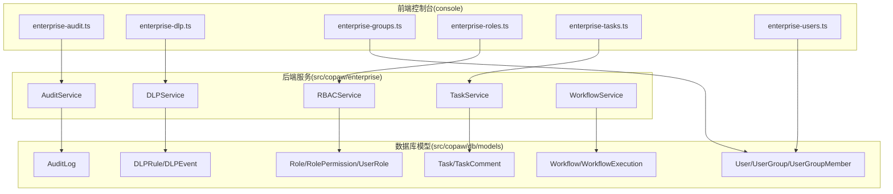
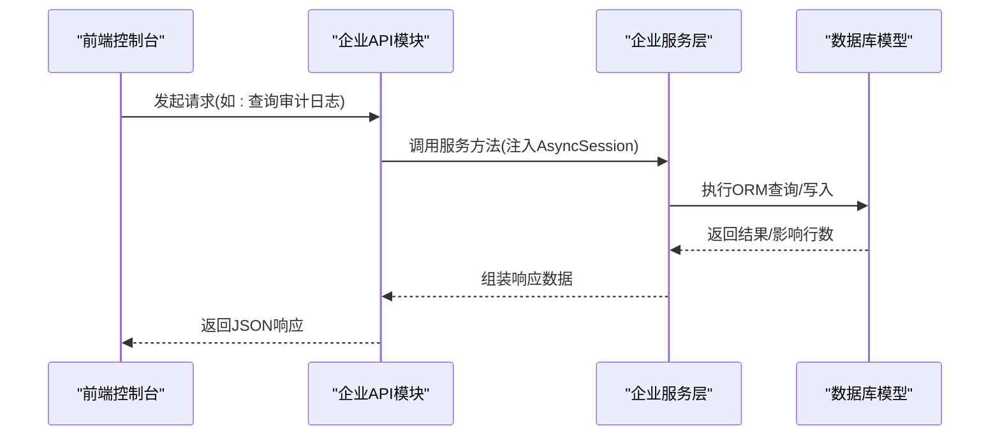
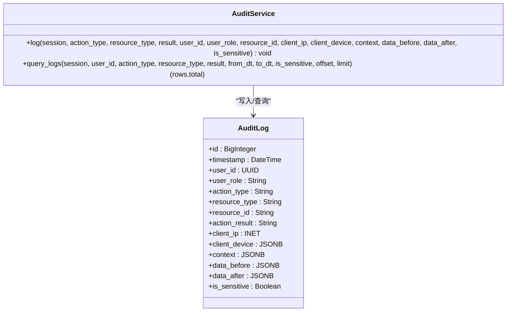
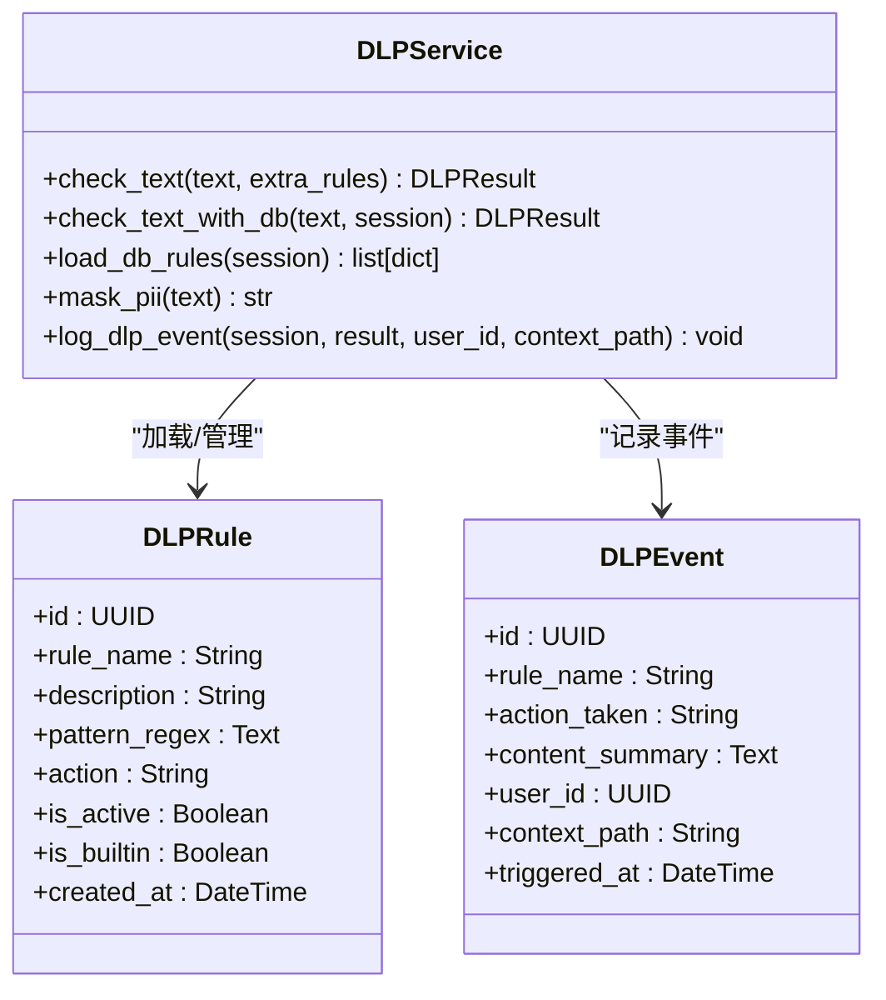
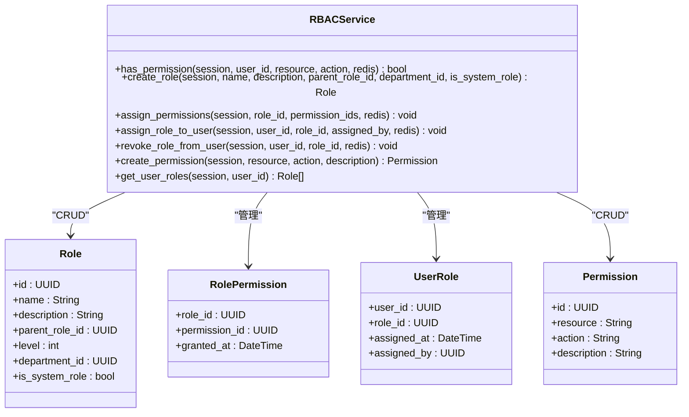
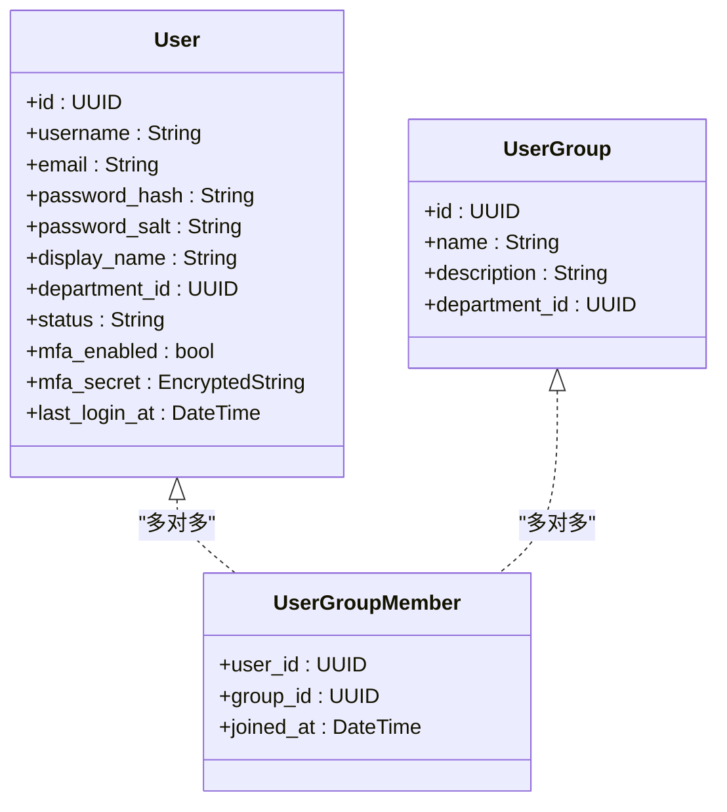
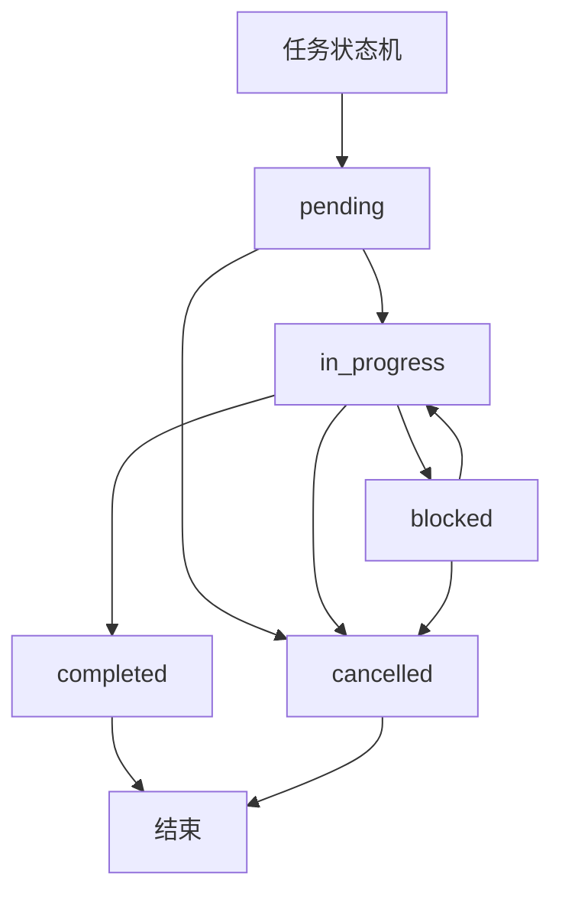
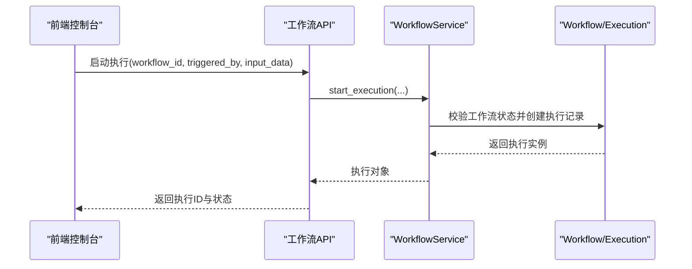
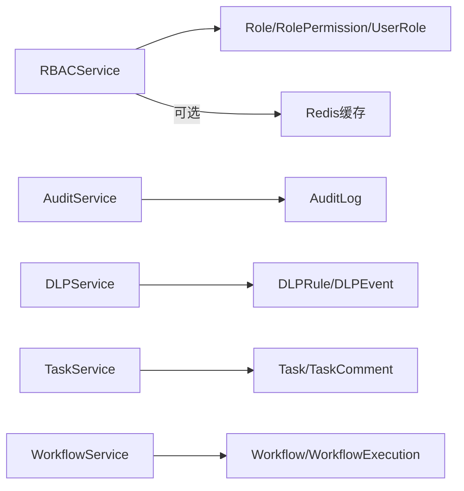

# 企业功能页面

<cite>
**本文引用的文件**
- [audit_service.py](file://src/copaw/enterprise/audit_service.py)
- [dlp_service.py](file://src/copaw/enterprise/dlp_service.py)
- [rbac_service.py](file://src/copaw/enterprise/rbac_service.py)
- [task_service.py](file://src/copaw/enterprise/task_service.py)
- [workflow_service.py](file://src/copaw/enterprise/workflow_service.py)
- [audit_log.py](file://src/copaw/db/models/audit_log.py)
- [dlp.py](file://src/copaw/db/models/dlp.py)
- [role.py](file://src/copaw/db/models/role.py)
- [user.py](file://src/copaw/db/models/user.py)
- [task.py](file://src/copaw/db/models/task.py)
- [workflow.py](file://src/copaw/db/models/workflow.py)
- [enterprise-audit.ts](file://console/src/api/modules/enterprise-audit.ts)
- [enterprise-dlp.ts](file://console/src/api/modules/enterprise-dlp.ts)
- [enterprise-groups.ts](file://console/src/api/modules/enterprise-groups.ts)
- [enterprise-roles.ts](file://console/src/api/modules/enterprise-roles.ts)
- [enterprise-tasks.ts](file://console/src/api/modules/enterprise-tasks.ts)
- [enterprise-users.ts](file://console/src/api/modules/enterprise-users.ts)
- [dlp.py](file://src/copaw/app/routers/dlp.py)
</cite>

## 更新摘要
**所做更改**
- 新增DLP（数据防泄漏）规则配置模块的详细文档
- 更新审计日志管理功能的前端API接口说明
- 完善任务看板模块的功能描述和状态机说明
- 增强用户和角色管理的前端接口文档
- 添加DLP服务架构和内置规则配置说明

## 目录
1. [简介](#简介)
2. [项目结构](#项目结构)
3. [核心组件](#核心组件)
4. [架构总览](#架构总览)
5. [详细组件分析](#详细组件分析)
6. [依赖分析](#依赖分析)
7. [性能考虑](#性能考虑)
8. [故障排除指南](#故障排除指南)
9. [结论](#结论)
10. [附录](#附录)

## 简介
本文件面向企业功能页面，系统化阐述审计日志、DLP规则配置、Dify连接器、用户组、角色管理、安全规则、任务看板、用户管理和工作流等企业级能力的实现细节。重点覆盖权限控制（RBAC）、审计追踪（ISO 27001合规）、数据防泄漏（DLP）策略与工作流管理，并解释企业配置、用户管理、安全监控与任务调度的实现方式。文档同时提供数据模型、访问控制与合规性要求说明，以及可视化图表帮助理解。

## 项目结构
企业功能由后端服务模块与前端API模块协同构成：
- 后端服务层：审计服务、DLP服务、RBAC服务、任务服务、工作流服务
- 数据模型层：审计日志、DLP规则/事件、角色/权限/用户、任务/评论、工作流/执行
- 前端API层：企业审计、DLP规则配置、用户组、角色权限、任务、用户等模块接口

**图表来源**
- [enterprise-audit.ts:1-44](file://console/src/api/modules/enterprise-audit.ts#L1-L44)
- [enterprise-dlp.ts:1-66](file://console/src/api/modules/enterprise-dlp.ts#L1-L66)
- [enterprise-groups.ts:1-64](file://console/src/api/modules/enterprise-groups.ts#L1-L64)
- [enterprise-roles.ts:1-74](file://console/src/api/modules/enterprise-roles.ts#L1-L74)
- [enterprise-tasks.ts:1-86](file://console/src/api/modules/enterprise-tasks.ts#L1-L86)
- [enterprise-users.ts:1-86](file://console/src/api/modules/enterprise-users.ts#L1-L86)
- [audit_service.py:51-135](file://src/copaw/enterprise/audit_service.py#L51-L135)
- [dlp_service.py:1-231](file://src/copaw/enterprise/dlp_service.py#L1-L231)
- [rbac_service.py:30-262](file://src/copaw/enterprise/rbac_service.py#L30-L262)
- [task_service.py:25-131](file://src/copaw/enterprise/task_service.py#L25-L131)
- [workflow_service.py:20-146](file://src/copaw/enterprise/workflow_service.py#L20-L146)
- [audit_log.py:18-106](file://src/copaw/db/models/audit_log.py#L18-L106)
- [dlp.py:18-107](file://src/copaw/db/models/dlp.py#L18-L107)
- [role.py:24-150](file://src/copaw/db/models/role.py#L24-L150)
- [user.py:25-158](file://src/copaw/db/models/user.py#L25-L158)
- [task.py:23-151](file://src/copaw/db/models/task.py#L23-L151)
- [workflow.py:19-149](file://src/copaw/db/models/workflow.py#L19-L149)

**章节来源**
- [audit_service.py:1-135](file://src/copaw/enterprise/audit_service.py#L1-L135)
- [dlp_service.py:1-231](file://src/copaw/enterprise/dlp_service.py#L1-L231)
- [rbac_service.py:1-262](file://src/copaw/enterprise/rbac_service.py#L1-L262)
- [task_service.py:1-131](file://src/copaw/enterprise/task_service.py#L1-L131)
- [workflow_service.py:1-146](file://src/copaw/enterprise/workflow_service.py#L1-L146)
- [audit_log.py:1-106](file://src/copaw/db/models/audit_log.py#L1-L106)
- [dlp.py:1-107](file://src/copaw/db/models/dlp.py#L1-L107)
- [role.py:1-150](file://src/copaw/db/models/role.py#L1-L150)
- [user.py:1-158](file://src/copaw/db/models/user.py#L1-L158)
- [task.py:1-151](file://src/copaw/db/models/task.py#L1-L151)
- [workflow.py:1-149](file://src/copaw/db/models/workflow.py#L1-L149)
- [enterprise-audit.ts:1-44](file://console/src/api/modules/enterprise-audit.ts#L1-L44)
- [enterprise-dlp.ts:1-66](file://console/src/api/modules/enterprise-dlp.ts#L1-L66)
- [enterprise-groups.ts:1-64](file://console/src/api/modules/enterprise-groups.ts#L1-L64)
- [enterprise-roles.ts:1-74](file://console/src/api/modules/enterprise-roles.ts#L1-L74)
- [enterprise-tasks.ts:1-86](file://console/src/api/modules/enterprise-tasks.ts#L1-L86)
- [enterprise-users.ts:1-86](file://console/src/api/modules/enterprise-users.ts#L1-L86)

## 核心组件
- 审计服务：提供ISO 27001合规的审计日志写入与查询能力，支持敏感操作前后数据记录与过滤聚合。
- DLP服务：提供数据防泄漏规则配置与检测能力，支持内置敏感信息识别和自定义规则管理。
- RBAC服务：基于角色的权限控制，支持层级角色继承、Redis缓存、权限匹配与用户角色分配。
- 任务服务：任务生命周期管理（创建、状态流转、列表查询、评论），确保状态机合法转换。
- 工作流服务：工作流定义与执行管理，支持Dify工作流类别与内部工作流，提供执行启动与完成闭环。
- 数据模型：围绕用户、角色权限、任务、工作流、审计日志、DLP规则/事件建立完整的企业级数据模型，满足合规与审计需求。

**章节来源**
- [audit_service.py:51-135](file://src/copaw/enterprise/audit_service.py#L51-L135)
- [dlp_service.py:1-231](file://src/copaw/enterprise/dlp_service.py#L1-L231)
- [rbac_service.py:30-262](file://src/copaw/enterprise/rbac_service.py#L30-L262)
- [task_service.py:25-131](file://src/copaw/enterprise/task_service.py#L25-L131)
- [workflow_service.py:20-146](file://src/copaw/enterprise/workflow_service.py#L20-L146)
- [audit_log.py:18-106](file://src/copaw/db/models/audit_log.py#L18-L106)
- [dlp.py:18-107](file://src/copaw/db/models/dlp.py#L18-L107)
- [role.py:24-150](file://src/copaw/db/models/role.py#L24-L150)
- [user.py:25-158](file://src/copaw/db/models/user.py#L25-L158)
- [task.py:23-151](file://src/copaw/db/models/task.py#L23-L151)
- [workflow.py:19-149](file://src/copaw/db/models/workflow.py#L19-L149)

## 架构总览
企业功能采用"前端API模块 + 后端服务模块 + 数据模型"的分层设计。前端通过REST接口调用后端服务，后端服务通过SQLAlchemy异步会话与数据库交互，确保事务一致性与并发安全。

**图表来源**
- [enterprise-audit.ts:25-43](file://console/src/api/modules/enterprise-audit.ts#L25-L43)
- [audit_service.py:88-135](file://src/copaw/enterprise/audit_service.py#L88-L135)
- [audit_log.py:18-106](file://src/copaw/db/models/audit_log.py#L18-L106)

## 详细组件分析

### 审计日志模块
- 功能要点
  - 行为类型常量覆盖用户、角色、任务、工作流、代理运行、密钥访问、配置变更等关键动作。
  - 写入接口支持敏感操作前后数据记录，便于合规审计。
  - 查询接口支持按用户、动作、资源、结果、时间范围、敏感标记等条件过滤与分页统计。
- 合规性
  - 遵循ISO 27001要求，记录Who/What/When/Where/Result/Context/Diff要素。
  - 提供索引优化与只追加写入约定，保障长期留存与查询效率。
- 前端对接
  - 提供统一查询参数与响应结构，支持分页与筛选。

**图表来源**
- [audit_service.py:51-135](file://src/copaw/enterprise/audit_service.py#L51-L135)
- [audit_log.py:18-106](file://src/copaw/db/models/audit_log.py#L18-L106)

**章节来源**
- [audit_service.py:23-135](file://src/copaw/enterprise/audit_service.py#L23-L135)
- [audit_log.py:18-106](file://src/copaw/db/models/audit_log.py#L18-L106)
- [enterprise-audit.ts:4-43](file://console/src/api/modules/enterprise-audit.ts#L4-L43)

### DLP（数据防泄漏）规则配置模块
- 功能要点
  - 内置敏感信息识别规则：中国身份证、手机号、银行卡号、邮箱、IP地址、API密钥等。
  - 自定义规则管理：支持创建、更新、删除自定义规则，正则表达式验证。
  - 三种处理动作：mask（脱敏）、alert（告警）、block（阻断）。
  - 事件记录：记录所有违规事件，包含规则名称、采取动作、内容摘要、用户ID、上下文路径。
- 架构设计
  - 前端API模块提供规则CRUD和事件查询接口。
  - 后端服务层实现规则加载、文本检测、事件记录功能。
  - 数据模型支持规则和事件的持久化存储。
- 前端对接
  - 提供内置规则列表、规则管理、事件查询等完整API接口。

**图表来源**
- [dlp_service.py:1-231](file://src/copaw/enterprise/dlp_service.py#L1-L231)
- [dlp.py:18-107](file://src/copaw/db/models/dlp.py#L18-L107)

**章节来源**
- [dlp_service.py:1-231](file://src/copaw/enterprise/dlp_service.py#L1-L231)
- [dlp.py:18-107](file://src/copaw/db/models/dlp.py#L18-L107)
- [enterprise-dlp.ts:1-66](file://console/src/api/modules/enterprise-dlp.ts#L1-L66)
- [dlp.py:1-229](file://src/copaw/app/routers/dlp.py#L1-L229)

### RBAC角色权限模块
- 功能要点
  - 权限检查：支持Redis缓存，用户→角色→权限链路展开（最多5级）。
  - 角色管理：创建角色、设置层级、父子关系校验；系统角色不可删除。
  - 权限管理：创建权限、批量替换角色权限；权限变更时失效相关用户缓存。
  - 用户角色：分配/撤销角色，记录分配者与时间，自动清理缓存。
- 匹配策略
  - 支持精确匹配、资源通配、动作通配与全局通配，满足灵活授权场景。
- 前端对接
  - 提供角色、权限的增删改查与批量赋权接口。

**图表来源**
- [rbac_service.py:30-262](file://src/copaw/enterprise/rbac_service.py#L30-L262)
- [role.py:24-150](file://src/copaw/db/models/role.py#L24-L150)

**章节来源**
- [rbac_service.py:30-262](file://src/copaw/enterprise/rbac_service.py#L30-L262)
- [role.py:24-150](file://src/copaw/db/models/role.py#L24-L150)
- [enterprise-roles.ts:22-73](file://console/src/api/modules/enterprise-roles.ts#L22-L73)

### 用户组与用户管理
- 用户组
  - 支持按部门分组，成员管理（加入/移除），查询组内成员。
- 用户
  - 基本信息、部门归属、状态、MFA、密码哈希与盐值、会话关联。
  - 提供用户列表、创建、更新、禁用、角色分配等接口。
- 前端对接
  - 用户与用户组的CRUD与成员管理API。

**图表来源**
- [user.py:25-158](file://src/copaw/db/models/user.py#L25-L158)
- [enterprise-groups.ts:18-63](file://console/src/api/modules/enterprise-groups.ts#L18-L63)
- [enterprise-users.ts:39-85](file://console/src/api/modules/enterprise-users.ts#L39-L85)

**章节来源**
- [user.py:25-158](file://src/copaw/db/models/user.py#L25-L158)
- [enterprise-groups.ts:1-64](file://console/src/api/modules/enterprise-groups.ts#L1-L64)
- [enterprise-users.ts:1-86](file://console/src/api/modules/enterprise-users.ts#L1-L86)

### 任务看板模块
- 状态机
  - 支持的状态：pending、in_progress、blocked、completed、cancelled。
  - 严格的状态转换约束，防止非法跳转。
- 功能
  - 创建任务（支持指派给用户/用户组/部门、截止日期、工作流关联、元数据）。
  - 更新状态（自动记录完成时间）。
  - 列表查询（按多种维度过滤）。
  - 评论功能（任务评论）。
- 前端对接
  - 提供列表、创建、更新、状态变更、删除、评论查询与新增接口。

**图表来源**
- [task_service.py:16-22](file://src/copaw/enterprise/task_service.py#L16-L22)
- [task.py:40-42](file://src/copaw/db/models/task.py#L40-L42)

**章节来源**
- [task_service.py:25-131](file://src/copaw/enterprise/task_service.py#L25-L131)
- [task.py:23-151](file://src/copaw/db/models/task.py#L23-L151)
- [enterprise-tasks.ts:26-85](file://console/src/api/modules/enterprise-tasks.ts#L26-L85)

### 工作流管理模块
- 类别
  - 支持Dify工作流类别：dify、dify_chatflow、dify_agent、internal。
- 功能
  - 创建/更新工作流（名称、描述、类别、定义、状态、版本递增）。
  - 列表查询（按类别、状态、创建者过滤）。
  - 执行管理：启动执行（校验状态为active）、完成执行（记录输出/错误）。
- 前端对接
  - 提供工作流CRUD与执行启停接口。

**图表来源**
- [workflow_service.py:107-128](file://src/copaw/enterprise/workflow_service.py#L107-L128)
- [workflow.py:85-149](file://src/copaw/db/models/workflow.py#L85-L149)

**章节来源**
- [workflow_service.py:20-146](file://src/copaw/enterprise/workflow_service.py#L20-L146)
- [workflow.py:19-149](file://src/copaw/db/models/workflow.py#L19-L149)

## 依赖分析
- 组件耦合
  - 服务层通过SQLAlchemy异步会话与模型交互，保持低耦合与高内聚。
  - RBAC服务依赖角色/权限/用户关系模型，提供权限判定入口。
  - 审计服务与各业务服务解耦，仅通过传入会话写入审计日志。
  - DLP服务独立于其他业务模块，通过中间件集成到认证流程中。
- 外部依赖
  - Redis用于RBAC权限缓存（可选）。
  - PostgreSQL作为持久化存储，使用JSONB存储上下文与元数据。
- 潜在循环依赖
  - 企业包初始化文件为空，避免模型导入引起的循环依赖。

**图表来源**
- [rbac_service.py:30-63](file://src/copaw/enterprise/rbac_service.py#L30-L63)
- [audit_service.py:51-86](file://src/copaw/enterprise/audit_service.py#L51-L86)
- [dlp_service.py:174-197](file://src/copaw/enterprise/dlp_service.py#L174-L197)
- [task_service.py:25-58](file://src/copaw/enterprise/task_service.py#L25-L58)
- [workflow_service.py:20-46](file://src/copaw/enterprise/workflow_service.py#L20-L46)

**章节来源**
- [rbac_service.py:30-63](file://src/copaw/enterprise/rbac_service.py#L30-L63)
- [audit_service.py:51-86](file://src/copaw/enterprise/audit_service.py#L51-L86)
- [dlp_service.py:174-197](file://src/copaw/enterprise/dlp_service.py#L174-L197)
- [task_service.py:25-58](file://src/copaw/enterprise/task_service.py#L25-L58)
- [workflow_service.py:20-46](file://src/copaw/enterprise/workflow_service.py#L20-L46)

## 性能考虑
- 缓存策略
  - RBAC权限使用Redis缓存，TTL默认5分钟，降低频繁权限检查的数据库压力。
  - DLP规则预编译正则表达式，提高检测性能。
- 查询优化
  - 审计日志表建立时间、用户、动作、资源类型索引，支持高频过滤查询。
  - DLP事件表建立规则名、用户ID、触发时间索引，提升事件查询性能。
  - 任务与工作流执行表建立状态与时间索引，提升分页与筛选性能。
- 异步与批处理
  - 审计写入采用异步会话，避免阻塞主业务流程。
  - DLP检测使用预编译正则表达式，减少重复编译开销。
- 数据类型选择
  - JSONB用于上下文与元数据，兼顾灵活性与查询能力。

## 故障排除指南
- 权限不足
  - 使用RBAC服务的权限检查方法确认用户是否具备目标资源/动作权限。
  - 若权限刚变更仍不生效，检查Redis缓存是否被正确失效。
- DLP规则问题
  - 正则表达式无效：检查规则模式是否符合正则语法。
  - 内置规则修改：内置规则不可删除或修改，需创建自定义规则替代。
  - 性能问题：检查正则表达式的复杂度，避免过于复杂的模式。
- 状态转换异常
  - 任务状态转换需遵循状态机约束，非法转换会抛出异常。
  - 检查当前任务状态与允许的下一状态集合。
- 工作流执行失败
  - 确认工作流状态为active再启动执行。
  - 完成执行时提供错误信息将导致状态标记为failed。
- 审计日志缺失
  - 确认业务流程中调用了审计服务的日志写入方法。
  - 检查敏感操作是否正确传入data_before/data_after。

**章节来源**
- [rbac_service.py:36-63](file://src/copaw/enterprise/rbac_service.py#L36-L63)
- [dlp_service.py:114-164](file://src/copaw/enterprise/dlp_service.py#L114-L164)
- [task_service.py:61-77](file://src/copaw/enterprise/task_service.py#L61-L77)
- [workflow_service.py:107-145](file://src/copaw/enterprise/workflow_service.py#L107-L145)
- [audit_service.py:55-86](file://src/copaw/enterprise/audit_service.py#L55-L86)

## 结论
企业功能页面以服务化架构为核心，结合ISO 27001合规的审计日志、DLP数据防泄漏规则配置、可扩展的RBAC权限体系、严谨的任务状态机与灵活的工作流管理，形成完整的安全与治理能力。新增的DLP模块提供了强大的敏感信息检测与防护能力，前端API模块清晰映射后端服务，配合数据库模型与索引优化，满足企业级性能与合规要求。

## 附录
- 术语
  - ISO 27001：国际信息安全管理体系标准。
  - RBAC：基于角色的访问控制。
  - DLP：数据防泄漏（Data Loss Prevention）。
  - 通配符：支持resource:*、*:action、*:*
- 最佳实践
  - 对敏感操作强制记录data_before/data_after。
  - 定期清理与归档审计日志，遵守数据保留策略。
  - 使用系统角色隔离关键权限，避免误删。
  - 在高并发场景下启用Redis缓存并合理设置TTL。
  - DLP规则应定期审查和更新，确保覆盖最新的敏感信息模式。
  - 内置规则提供基础保护，建议根据企业实际需求添加自定义规则。