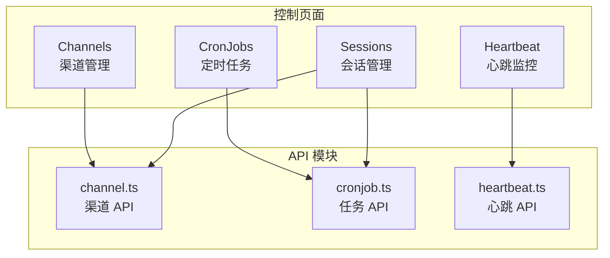
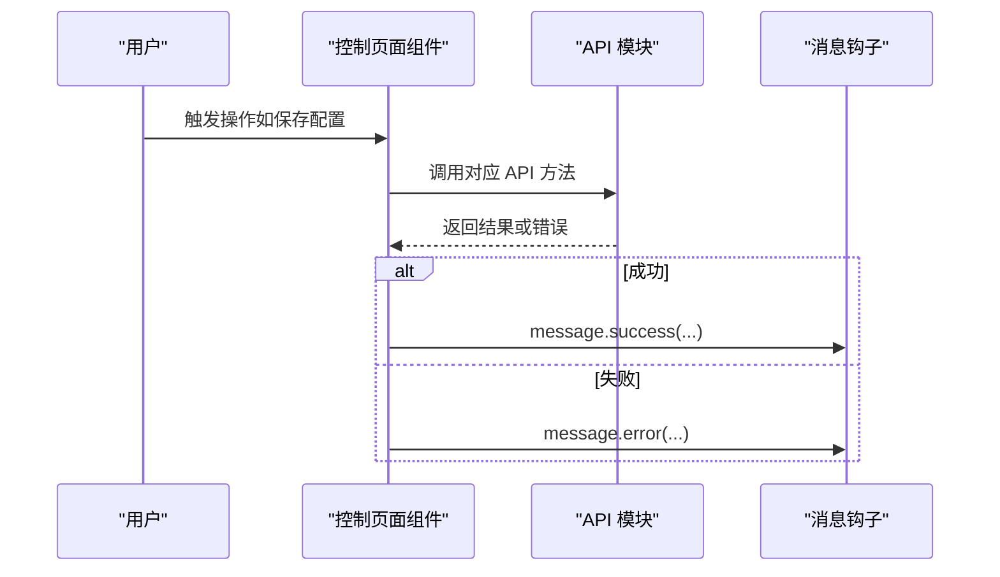
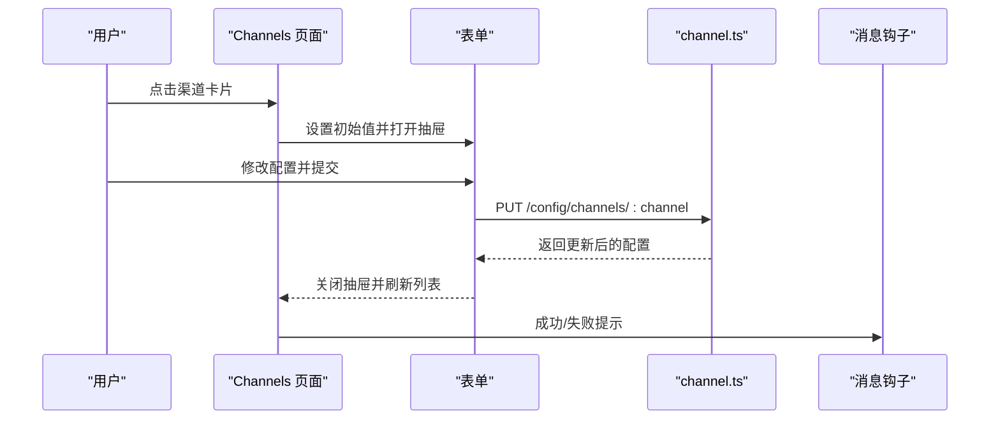
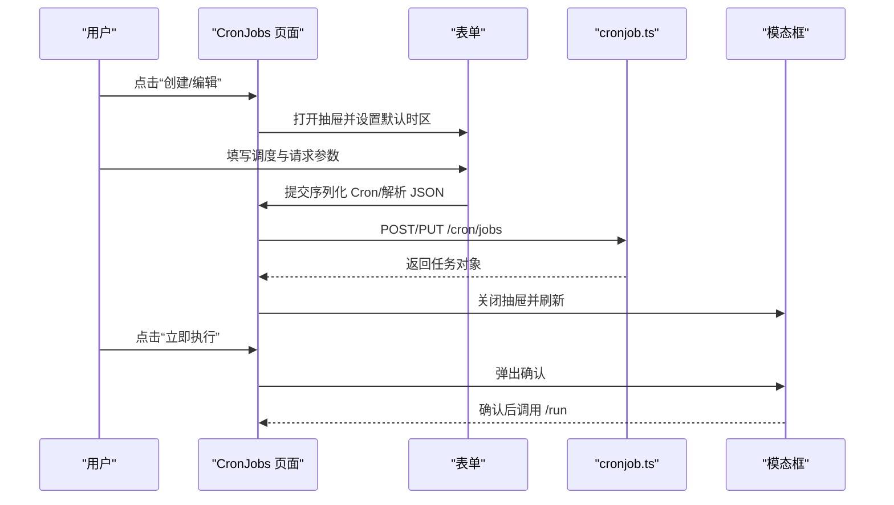
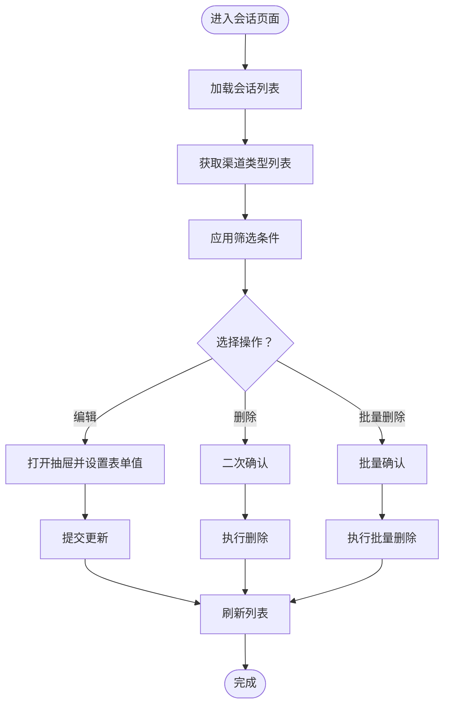
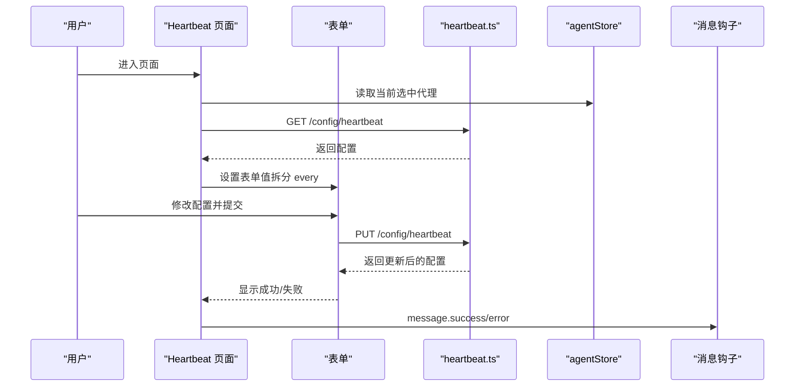
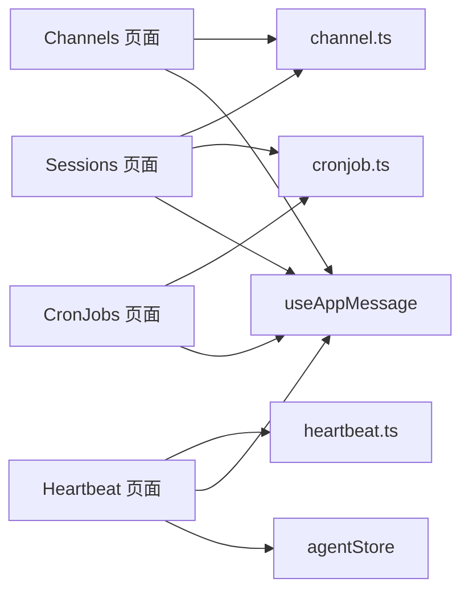

# 控制页面

<cite>
**本文引用的文件**
- [console/src/pages/Control/Channels/index.tsx](file://console/src/pages/Control/Channels/index.tsx)
- [console/src/pages/Control/CronJobs/index.tsx](file://console/src/pages/Control/CronJobs/index.tsx)
- [console/src/pages/Control/Sessions/index.tsx](file://console/src/pages/Control/Sessions/index.tsx)
- [console/src/pages/Control/Heartbeat/index.tsx](file://console/src/pages/Control/Heartbeat/index.tsx)
- [console/src/api/modules/channel.ts](file://console/src/api/modules/channel.ts)
- [console/src/api/modules/cronjob.ts](file://console/src/api/modules/cronjob.ts)
- [console/src/api/modules/heartbeat.ts](file://console/src/api/modules/heartbeat.ts)
- [console/src/hooks/useAppMessage.ts](file://console/src/hooks/useAppMessage.ts)
- [console/src/stores/agentStore.ts](file://console/src/stores/agentStore.ts)
- [console/src/constants/channel.ts](file://console/src/constants/channel.ts)
</cite>

## 目录
1. [简介](#简介)
2. [项目结构](#项目结构)
3. [核心组件](#核心组件)
4. [架构总览](#架构总览)
5. [详细组件分析](#详细组件分析)
6. [依赖关系分析](#依赖关系分析)
7. [性能考虑](#性能考虑)
8. [故障排查指南](#故障排查指南)
9. [结论](#结论)
10. [附录](#附录)

## 简介
本文件面向控制页面的功能与实现，围绕四大核心能力展开：渠道管理、定时任务、会话管理、心跳监控。内容涵盖数据展示、操作按钮、状态指示与实时更新机制，并解释控制命令的执行、结果反馈与错误处理流程。读者无需深入前端或后端即可理解各模块职责与交互方式。

## 项目结构
控制页面位于前端控制台（console）中，采用按功能分页的组织方式：
- 渠道管理：Channels 页面负责列出、筛选、编辑各渠道配置，并支持二维码登录等扩展能力。
- 定时任务：CronJobs 页面提供任务的增删改查、启停、立即执行与可视化调度编辑。
- 会话管理：Sessions 页面用于查看、筛选、批量删除与重命名会话。
- 心跳监控：Heartbeat 页面用于配置心跳周期、目标代理与活跃时段等参数。

图表来源
- [console/src/pages/Control/Channels/index.tsx:18-161](file://console/src/pages/Control/Channels/index.tsx#L18-L161)
- [console/src/pages/Control/CronJobs/index.tsx:19-235](file://console/src/pages/Control/CronJobs/index.tsx#L19-L235)
- [console/src/pages/Control/Sessions/index.tsx:16-199](file://console/src/pages/Control/Sessions/index.tsx#L16-L199)
- [console/src/pages/Control/Heartbeat/index.tsx:71-269](file://console/src/pages/Control/Heartbeat/index.tsx#L71-L269)
- [console/src/api/modules/channel.ts:4-43](file://console/src/api/modules/channel.ts#L4-L43)
- [console/src/api/modules/cronjob.ts:8-53](file://console/src/api/modules/cronjob.ts#L8-L53)
- [console/src/api/modules/heartbeat.ts:4-12](file://console/src/api/modules/heartbeat.ts#L4-L12)

章节来源
- [console/src/pages/Control/Channels/index.tsx:18-161](file://console/src/pages/Control/Channels/index.tsx#L18-L161)
- [console/src/pages/Control/CronJobs/index.tsx:19-235](file://console/src/pages/Control/CronJobs/index.tsx#L19-L235)
- [console/src/pages/Control/Sessions/index.tsx:16-199](file://console/src/pages/Control/Sessions/index.tsx#L16-L199)
- [console/src/pages/Control/Heartbeat/index.tsx:71-269](file://console/src/pages/Control/Heartbeat/index.tsx#L71-L269)

## 核心组件
- 渠道管理页面：提供渠道卡片列表、过滤器、抽屉式表单编辑、保存与错误提示。
- 定时任务页面：提供表格视图、列操作（启用/禁用、立即执行、编辑、删除）、抽屉式表单与JSON输入解析。
- 会话管理页面：提供筛选条（用户ID、渠道类型）、批量选择与批量删除、抽屉式表单编辑。
- 心跳监控页面：提供开关、间隔数值与单位、目标选择、可选活跃时段、提交保存与加载状态。

章节来源
- [console/src/pages/Control/Channels/index.tsx:18-161](file://console/src/pages/Control/Channels/index.tsx#L18-L161)
- [console/src/pages/Control/CronJobs/index.tsx:19-235](file://console/src/pages/Control/CronJobs/index.tsx#L19-L235)
- [console/src/pages/Control/Sessions/index.tsx:16-199](file://console/src/pages/Control/Sessions/index.tsx#L16-L199)
- [console/src/pages/Control/Heartbeat/index.tsx:71-269](file://console/src/pages/Control/Heartbeat/index.tsx#L71-L269)

## 架构总览
控制页面通过统一的请求封装调用后端 API，使用本地状态与持久化存储管理用户交互与应用状态，配合消息通知组件进行成功/失败反馈。

图表来源
- [console/src/pages/Control/Channels/index.tsx:70-100](file://console/src/pages/Control/Channels/index.tsx#L70-L100)
- [console/src/pages/Control/CronJobs/index.tsx:131-191](file://console/src/pages/Control/CronJobs/index.tsx#L131-L191)
- [console/src/pages/Control/Sessions/index.tsx:119-134](file://console/src/pages/Control/Sessions/index.tsx#L119-L134)
- [console/src/pages/Control/Heartbeat/index.tsx:106-138](file://console/src/pages/Control/Heartbeat/index.tsx#L106-L138)
- [console/src/hooks/useAppMessage.ts:12-15](file://console/src/hooks/useAppMessage.ts#L12-L15)

## 详细组件分析

### 渠道管理（Channels）
- 数据来源与展示
  - 使用自定义 Hook 获取渠道列表与排序键，支持内置/自定义过滤。
  - 列表按“启用优先、禁用次之”的顺序展示，保持原始顺序稳定。
- 编辑与保存
  - 抽屉式表单支持字段切换（如工具消息过滤、思考内容过滤），提交时进行布尔取反处理。
  - 保存成功后刷新列表并提示成功；异常时提示失败。
- QR 登录（扩展能力）
  - 提供二维码生成与轮询状态查询接口，便于无密钥场景的认证配置。

图表来源
- [console/src/pages/Control/Channels/index.tsx:54-100](file://console/src/pages/Control/Channels/index.tsx#L54-L100)
- [console/src/api/modules/channel.ts:15-27](file://console/src/api/modules/channel.ts#L15-L27)
- [console/src/hooks/useAppMessage.ts:12-15](file://console/src/hooks/useAppMessage.ts#L12-L15)

章节来源
- [console/src/pages/Control/Channels/index.tsx:18-161](file://console/src/pages/Control/Channels/index.tsx#L18-L161)
- [console/src/api/modules/channel.ts:4-43](file://console/src/api/modules/channel.ts#L4-L43)
- [console/src/constants/channel.ts:1-32](file://console/src/constants/channel.ts#L1-L32)

### 定时任务（CronJobs）
- 数据来源与展示
  - 表格展示任务列表，列包含启用/禁用、立即执行、编辑、删除等操作。
  - 支持分页与横向滚动以适配较多列。
- 调度表达式编辑
  - 提供“每日/每周/自定义”三种模式，时间选择器与星期多选联动。
  - 将表单字段序列化为标准 Cron 表达式，同时支持 JSON 输入字符串解析。
- 操作流程
  - 创建/更新：提交前统一序列化 Cron 并解析请求输入 JSON。
  - 删除：二次确认弹窗。
  - 启用/禁用：直接调用暂停/恢复接口。
  - 立即执行：二次确认后触发执行接口。

图表来源
- [console/src/pages/Control/CronJobs/index.tsx:45-191](file://console/src/pages/Control/CronJobs/index.tsx#L45-L191)
- [console/src/api/modules/cronjob.ts:11-49](file://console/src/api/modules/cronjob.ts#L11-L49)

章节来源
- [console/src/pages/Control/CronJobs/index.tsx:19-235](file://console/src/pages/Control/CronJobs/index.tsx#L19-L235)
- [console/src/api/modules/cronjob.ts:8-53](file://console/src/api/modules/cronjob.ts#L8-L53)

### 会话管理（Sessions）
- 数据来源与筛选
  - 加载全部会话并支持按用户ID与渠道类型筛选。
  - 首次渲染时异步拉取可用渠道类型，确保筛选下拉项完整。
- 批量操作
  - 支持勾选多行并批量删除，删除前二次确认。
  - 单条编辑仅允许修改名称，提交后关闭抽屉并刷新。
- 表格与交互
  - 行选择样式高亮，分页与横向滚动提升大数据量体验。

图表来源
- [console/src/pages/Control/Sessions/index.tsx:16-199](file://console/src/pages/Control/Sessions/index.tsx#L16-L199)

章节来源
- [console/src/pages/Control/Sessions/index.tsx:16-199](file://console/src/pages/Control/Sessions/index.tsx#L16-L199)

### 心跳监控（Heartbeat）
- 配置加载与保存
  - 首次渲染或代理切换时加载当前心跳配置，解析“每 N 单位”为独立字段以便表单编辑。
  - 提交时将表单字段序列化为后端期望格式，支持可选活跃时段。
- 表单与校验
  - 开关、数值与单位、目标选择、活跃时段开关与时间选择器组合。
  - 数值必填且最小为 1，单位支持分钟/小时两种。
- 实时性
  - 代理切换时重新加载配置，确保不同代理的心跳策略独立生效。

图表来源
- [console/src/pages/Control/Heartbeat/index.tsx:79-138](file://console/src/pages/Control/Heartbeat/index.tsx#L79-L138)
- [console/src/api/modules/heartbeat.ts:4-12](file://console/src/api/modules/heartbeat.ts#L4-L12)
- [console/src/stores/agentStore.ts:19-60](file://console/src/stores/agentStore.ts#L19-L60)

章节来源
- [console/src/pages/Control/Heartbeat/index.tsx:71-269](file://console/src/pages/Control/Heartbeat/index.tsx#L71-L269)
- [console/src/api/modules/heartbeat.ts:4-12](file://console/src/api/modules/heartbeat.ts#L4-L12)
- [console/src/stores/agentStore.ts:19-60](file://console/src/stores/agentStore.ts#L19-L60)

## 依赖关系分析
- 组件到 API 的依赖
  - Channels 依赖 channel.ts 的单个/批量配置更新接口。
  - CronJobs 依赖 cronjob.ts 的任务生命周期接口。
  - Sessions 依赖 channel.ts 的渠道类型列表与 cronjob.ts 的任务状态接口（间接）。
  - Heartbeat 依赖 heartbeat.ts 的配置读取与更新接口。
- 通用依赖
  - useAppMessage 提供统一的消息提示能力。
  - agentStore 在心跳页面中用于感知代理切换并触发重新加载。

图表来源
- [console/src/pages/Control/Channels/index.tsx:1-14](file://console/src/pages/Control/Channels/index.tsx#L1-L14)
- [console/src/pages/Control/CronJobs/index.tsx:1-15](file://console/src/pages/Control/CronJobs/index.tsx#L1-L15)
- [console/src/pages/Control/Sessions/index.tsx:1-14](file://console/src/pages/Control/Sessions/index.tsx#L1-L14)
- [console/src/pages/Control/Heartbeat/index.tsx:1-20](file://console/src/pages/Control/Heartbeat/index.tsx#L1-L20)
- [console/src/api/modules/channel.ts:4-43](file://console/src/api/modules/channel.ts#L4-L43)
- [console/src/api/modules/cronjob.ts:8-53](file://console/src/api/modules/cronjob.ts#L8-L53)
- [console/src/api/modules/heartbeat.ts:4-12](file://console/src/api/modules/heartbeat.ts#L4-L12)
- [console/src/hooks/useAppMessage.ts:12-15](file://console/src/hooks/useAppMessage.ts#L12-L15)
- [console/src/stores/agentStore.ts:19-60](file://console/src/stores/agentStore.ts#L19-L60)

章节来源
- [console/src/pages/Control/Channels/index.tsx:1-14](file://console/src/pages/Control/Channels/index.tsx#L1-L14)
- [console/src/pages/Control/CronJobs/index.tsx:1-15](file://console/src/pages/Control/CronJobs/index.tsx#L1-L15)
- [console/src/pages/Control/Sessions/index.tsx:1-14](file://console/src/pages/Control/Sessions/index.tsx#L1-L14)
- [console/src/pages/Control/Heartbeat/index.tsx:1-20](file://console/src/pages/Control/Heartbeat/index.tsx#L1-L20)

## 性能考虑
- 列表渲染优化
  - Channels 与 CronJobs 使用分页与横向滚动，避免一次性渲染过多节点。
  - Sessions 使用行选择高亮与固定列宽，减少重排成本。
- 请求与状态
  - 使用 loading 状态避免重复提交与闪烁。
  - 保存/提交阶段设置 saving 标志，防止并发操作。
- 数据获取
  - 心跳配置在代理切换时才重新加载，避免频繁请求。
  - 会话筛选在内存中进行，首次加载渠道类型后复用。

## 故障排查指南
- 保存失败
  - Channels：检查网络与权限，查看错误提示；必要时重试。
  - CronJobs：确认 Cron 表达式是否合法；请求输入 JSON 是否有效。
  - Heartbeat：确认数值与单位组合是否满足校验规则。
- 删除确认
  - Sessions 与 CronJobs 删除均需二次确认，避免误删。
- 二维码登录（扩展）
  - 若二维码登录未生效，检查轮询令牌与后端状态接口返回。
- 代理切换
  - 心跳配置未更新：确认 agentStore 中选中代理是否正确，页面是否重新加载。

章节来源
- [console/src/pages/Control/Channels/index.tsx:70-100](file://console/src/pages/Control/Channels/index.tsx#L70-L100)
- [console/src/pages/Control/CronJobs/index.tsx:96-124](file://console/src/pages/Control/CronJobs/index.tsx#L96-L124)
- [console/src/pages/Control/Sessions/index.tsx:78-112](file://console/src/pages/Control/Sessions/index.tsx#L78-L112)
- [console/src/pages/Control/Heartbeat/index.tsx:106-138](file://console/src/pages/Control/Heartbeat/index.tsx#L106-L138)

## 结论
控制页面以清晰的分页结构与一致的交互范式，覆盖了渠道、任务、会话与心跳等关键运维能力。通过统一的 API 封装与消息提示，实现了稳定的用户反馈与可预期的操作流程。建议在后续迭代中进一步增强：
- 实时订阅与增量刷新（WebSocket 或 SSE）以降低轮询成本。
- 更细粒度的权限控制与审计日志。
- 可视化调度编辑器与模板库，降低 Cron 编写门槛。

## 附录
- 术语
  - 渠道：消息通道抽象，如微信、钉钉、Telegram 等。
  - 定时任务：基于 Cron 的计划任务，支持立即执行与状态查询。
  - 会话：用户与代理之间的对话上下文记录。
  - 心跳：周期性健康上报或唤醒机制，可限定活跃时段与目标代理。