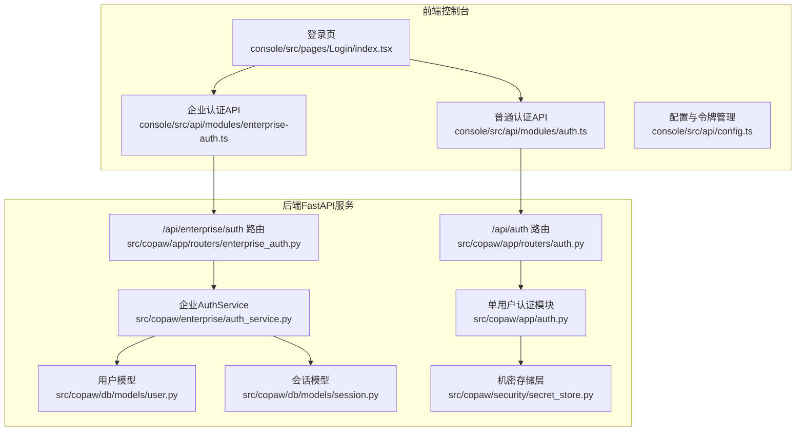
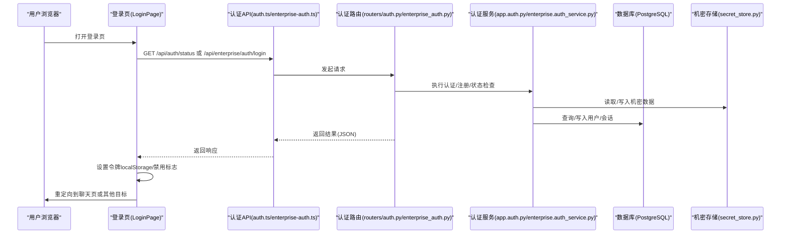
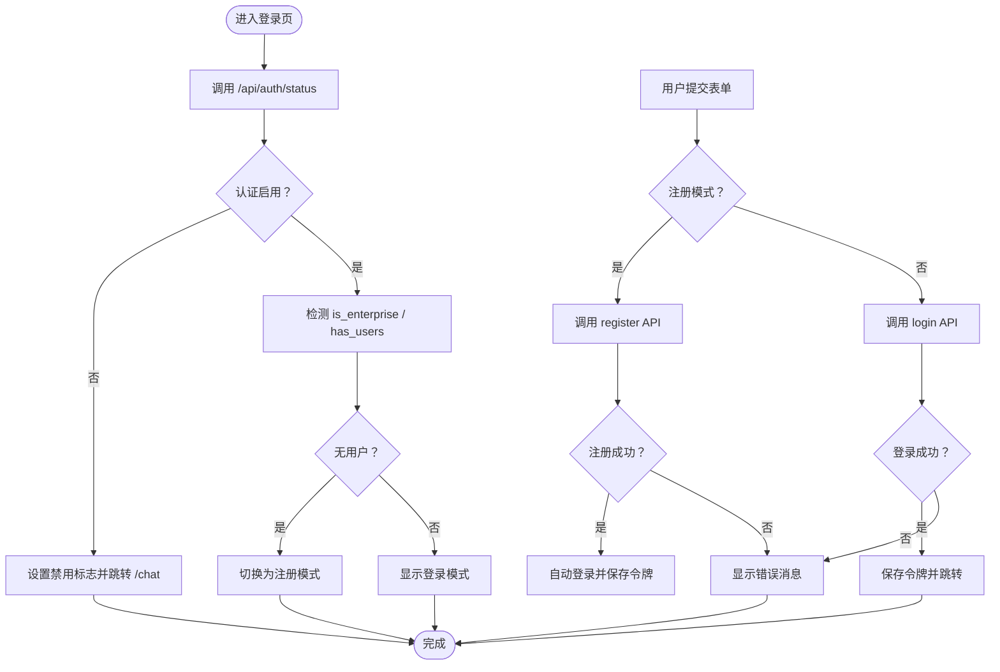
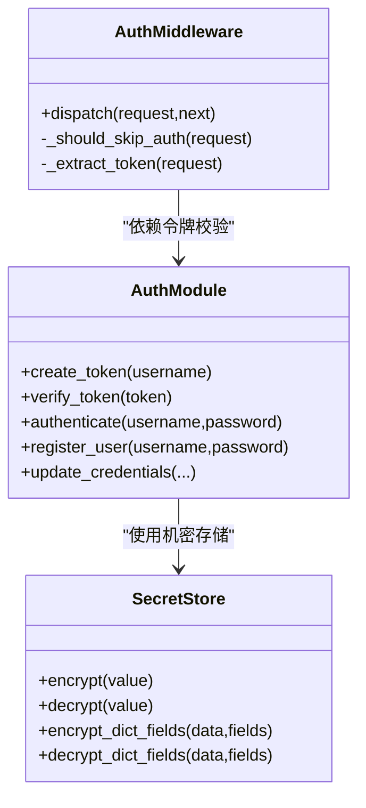
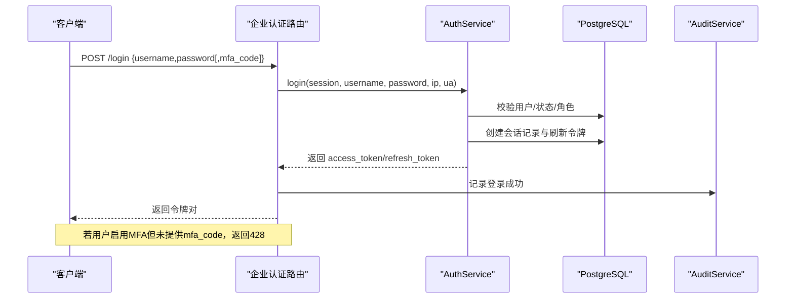
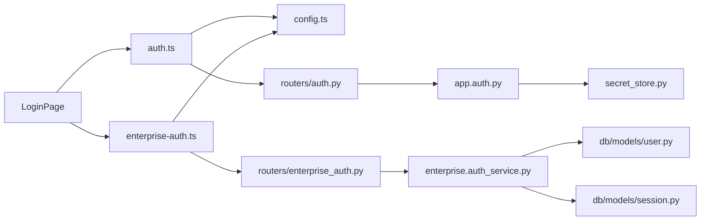

# 登录页面

<cite>
**本文引用的文件**
- [console/src/pages/Login/index.tsx](file://console/src/pages/Login/index.tsx)
- [console/src/api/modules/auth.ts](file://console/src/api/modules/auth.ts)
- [console/src/api/modules/enterprise-auth.ts](file://console/src/api/modules/enterprise-auth.ts)
- [console/src/api/config.ts](file://console/src/api/config.ts)
- [src/copaw/app/routers/auth.py](file://src/copaw/app/routers/auth.py)
- [src/copaw/app/routers/enterprise_auth.py](file://src/copaw/app/routers/enterprise_auth.py)
- [src/copaw/app/auth.py](file://src/copaw/app/auth.py)
- [src/copaw/enterprise/auth_service.py](file://src/copaw/enterprise/auth_service.py)
- [src/copaw/db/models/user.py](file://src/copaw/db/models/user.py)
- [src/copaw/db/models/session.py](file://src/copaw/db/models/session.py)
- [src/copaw/security/secret_store.py](file://src/copaw/security/secret_store.py)
</cite>

## 目录
1. [简介](#简介)
2. [项目结构](#项目结构)
3. [核心组件](#核心组件)
4. [架构总览](#架构总览)
5. [详细组件分析](#详细组件分析)
6. [依赖分析](#依赖分析)
7. [性能考虑](#性能考虑)
8. [故障排除指南](#故障排除指南)
9. [结论](#结论)

## 简介
本文件面向登录页面（前端）与后端认证体系，系统性阐述用户身份验证、登录表单、认证流程与会话管理的实现细节。内容覆盖：
- 登录验证逻辑与错误处理
- 密码安全策略（单用户与企业版差异）
- 多因素认证（MFA）能力与流程
- 登录状态管理、路由守卫与权限验证机制
- 登录失败处理、账户锁定与安全审计的实现方式

## 项目结构
登录页面位于前端控制台（console），通过 API 模块调用后端认证接口；后端提供两类认证模式：
- 单用户轻量认证（本地 auth.json 文件 + HMAC-JWT）
- 企业版多用户认证（PostgreSQL + bcrypt + JWT + Redis 会话镜像）

**图表来源**
- [console/src/pages/Login/index.tsx:12-234](file://console/src/pages/Login/index.tsx#L12-L234)
- [console/src/api/modules/auth.ts:15-76](file://console/src/api/modules/auth.ts#L15-L76)
- [console/src/api/modules/enterprise-auth.ts:36-74](file://console/src/api/modules/enterprise-auth.ts#L36-L74)
- [console/src/api/config.ts:11-68](file://console/src/api/config.ts#L11-L68)
- [src/copaw/app/routers/auth.py:19-123](file://src/copaw/app/routers/auth.py#L19-L123)
- [src/copaw/app/routers/enterprise_auth.py:26-122](file://src/copaw/app/routers/enterprise_auth.py#L26-L122)
- [src/copaw/app/auth.py:44-441](file://src/copaw/app/auth.py#L44-L441)
- [src/copaw/enterprise/auth_service.py:107-367](file://src/copaw/enterprise/auth_service.py#L107-L367)
- [src/copaw/db/models/user.py:25-94](file://src/copaw/db/models/user.py#L25-L94)
- [src/copaw/db/models/session.py:21-74](file://src/copaw/db/models/session.py#L21-L74)
- [src/copaw/security/secret_store.py:148-204](file://src/copaw/security/secret_store.py#L148-L204)

**章节来源**
- [console/src/pages/Login/index.tsx:12-234](file://console/src/pages/Login/index.tsx#L12-L234)
- [console/src/api/modules/auth.ts:15-76](file://console/src/api/modules/auth.ts#L15-L76)
- [console/src/api/modules/enterprise-auth.ts:36-74](file://console/src/api/modules/enterprise-auth.ts#L36-L74)
- [console/src/api/config.ts:11-68](file://console/src/api/config.ts#L11-L68)
- [src/copaw/app/routers/auth.py:19-123](file://src/copaw/app/routers/auth.py#L19-L123)
- [src/copaw/app/routers/enterprise_auth.py:26-122](file://src/copaw/app/routers/enterprise_auth.py#L26-L122)
- [src/copaw/app/auth.py:44-441](file://src/copaw/app/auth.py#L44-L441)
- [src/copaw/enterprise/auth_service.py:107-367](file://src/copaw/enterprise/auth_service.py#L107-L367)
- [src/copaw/db/models/user.py:25-94](file://src/copaw/db/models/user.py#L25-L94)
- [src/copaw/db/models/session.py:21-74](file://src/copaw/db/models/session.py#L21-L74)
- [src/copaw/security/secret_store.py:148-204](file://src/copaw/security/secret_store.py#L148-L204)

## 核心组件
- 前端登录页：负责表单渲染、参数校验、调用认证 API、设置令牌与重定向、检测认证模式与首次注册场景。
- 普通认证 API：封装 /api/auth/* 接口，支持登录、注册、状态查询、令牌校验与资料更新。
- 企业认证 API：封装 /api/enterprise/auth/* 接口，支持登录/注册/注销、当前用户信息、修改密码、MFA 设置与验证。
- 后端认证路由：对接前端 API，执行业务逻辑（单用户或企业版）。
- 单用户认证模块：密码哈希、JWT 签发与校验、令牌有效期、机密存储。
- 企业认证服务：bcrypt 密码、JWT 签发与校验、会话生命周期、MFA、审计日志。
- 数据模型：用户、会话与刷新令牌，支撑企业版会话与审计。

**章节来源**
- [console/src/pages/Login/index.tsx:12-234](file://console/src/pages/Login/index.tsx#L12-L234)
- [console/src/api/modules/auth.ts:15-76](file://console/src/api/modules/auth.ts#L15-L76)
- [console/src/api/modules/enterprise-auth.ts:36-74](file://console/src/api/modules/enterprise-auth.ts#L36-L74)
- [src/copaw/app/routers/auth.py:19-123](file://src/copaw/app/routers/auth.py#L19-L123)
- [src/copaw/app/routers/enterprise_auth.py:26-122](file://src/copaw/app/routers/enterprise_auth.py#L26-L122)
- [src/copaw/app/auth.py:44-441](file://src/copaw/app/auth.py#L44-L441)
- [src/copaw/enterprise/auth_service.py:107-367](file://src/copaw/enterprise/auth_service.py#L107-L367)
- [src/copaw/db/models/user.py:25-94](file://src/copaw/db/models/user.py#L25-L94)
- [src/copaw/db/models/session.py:21-74](file://src/copaw/db/models/session.py#L21-L74)

## 架构总览
登录流程在前后端之间的交互如下：

**图表来源**
- [console/src/pages/Login/index.tsx:24-116](file://console/src/pages/Login/index.tsx#L24-L116)
- [console/src/api/modules/auth.ts:45-49](file://console/src/api/modules/auth.ts#L45-L49)
- [console/src/api/modules/enterprise-auth.ts:37-47](file://console/src/api/modules/enterprise-auth.ts#L37-L47)
- [src/copaw/app/routers/auth.py:88-123](file://src/copaw/app/routers/auth.py#L88-L123)
- [src/copaw/app/routers/enterprise_auth.py:61-122](file://src/copaw/app/routers/enterprise_auth.py#L61-L122)
- [src/copaw/app/auth.py:223-441](file://src/copaw/app/auth.py#L223-L441)
- [src/copaw/enterprise/auth_service.py:107-367](file://src/copaw/enterprise/auth_service.py#L107-L367)
- [src/copaw/security/secret_store.py:148-204](file://src/copaw/security/secret_store.py#L148-L204)

## 详细组件分析

### 前端登录页（LoginPage）
- 初始化与认证模式探测
  - 首次挂载时调用 /api/auth/status，根据返回的 enabled、has_users、is_enterprise 决定展示“登录”或“注册”，以及是否切换到企业认证路径。
  - 若后端返回未启用认证，则设置全局禁用标志并直接跳转至聊天页。
- 表单与提交
  - 表单字段：用户名、密码；初始聚焦用户名。
  - 提交时解析 redirect 参数（默认 /chat），并根据 isRegister 与 isEnterprise 分支调用相应 API。
- 成功与失败处理
  - 成功：保存 access_token（或 legacy token），提示成功消息，按 redirect 跳转。
  - 失败：根据是注册还是登录分支，提示对应错误消息；最终统一设置 loading=false。
- 会话与主题
  - 使用暗/亮主题背景样式；根据 isDark 切换卡片与阴影风格。

**图表来源**
- [console/src/pages/Login/index.tsx:24-116](file://console/src/pages/Login/index.tsx#L24-L116)

**章节来源**
- [console/src/pages/Login/index.tsx:12-234](file://console/src/pages/Login/index.tsx#L12-L234)

### 普通认证（单用户）
- 登录/注册/状态
  - /api/auth/login：当认证启用且凭据正确时返回 token。
  - /api/auth/register：仅允许一次注册，返回 token。
  - /api/auth/status：返回 enabled、has_users、is_enterprise=False。
- 令牌与安全
  - 使用 HMAC-SHA256 签名的 JWT，7 天有效期。
  - 密码采用 salted SHA-256 哈希，机密存储于 SECRET_DIR/auth.json，并进行透明加解密。
- 中间件
  - AuthMiddleware 对受保护路径进行 Bearer 校验，跳过公共路径与静态资源。

**图表来源**
- [src/copaw/app/auth.py:121-166](file://src/copaw/app/auth.py#L121-L166)
- [src/copaw/security/secret_store.py:207-236](file://src/copaw/security/secret_store.py#L207-L236)
- [src/copaw/app/auth.py:371-441](file://src/copaw/app/auth.py#L371-L441)

**章节来源**
- [src/copaw/app/routers/auth.py:43-123](file://src/copaw/app/routers/auth.py#L43-L123)
- [src/copaw/app/auth.py:44-441](file://src/copaw/app/auth.py#L44-L441)
- [src/copaw/security/secret_store.py:148-204](file://src/copaw/security/secret_store.py#L148-L204)

### 企业认证（多用户）
- 登录/注册/注销/当前用户/改密/MFA
  - /api/enterprise/auth/login：支持 MFA（若用户启用则要求提供 mfa_code）。
  - /api/enterprise/auth/register：创建新用户（唯一性约束）。
  - /api/enterprise/auth/logout：基于 jti 撤销会话。
  - /api/enterprise/auth/me：从令牌负载返回当前用户信息。
  - /api/enterprise/auth/password：修改密码并撤销所有会话。
  - /api/enterprise/auth/mfa/setup/verify：生成并启用 MFA。
- 会话与审计
  - 会话记录（JTI、过期、撤销）与刷新令牌（哈希存储）持久化至 PostgreSQL。
  - 审计服务记录登录/注册/登出/改密/MFA 启用等事件。
- 密码与令牌
  - bcrypt 哈希；HS256 JWT；可配置过期时间与刷新周期。

**图表来源**
- [src/copaw/app/routers/enterprise_auth.py:61-122](file://src/copaw/app/routers/enterprise_auth.py#L61-L122)
- [src/copaw/enterprise/auth_service.py:151-230](file://src/copaw/enterprise/auth_service.py#L151-L230)
- [src/copaw/db/models/session.py:21-74](file://src/copaw/db/models/session.py#L21-L74)

**章节来源**
- [src/copaw/app/routers/enterprise_auth.py:26-234](file://src/copaw/app/routers/enterprise_auth.py#L26-L234)
- [src/copaw/enterprise/auth_service.py:107-367](file://src/copaw/enterprise/auth_service.py#L107-L367)
- [src/copaw/db/models/user.py:25-94](file://src/copaw/db/models/user.py#L25-L94)
- [src/copaw/db/models/session.py:21-116](file://src/copaw/db/models/session.py#L21-L116)

### 登录验证逻辑与错误处理
- 前端
  - 表单必填校验；提交前解析 redirect；根据 isRegister 与 isEnterprise 分支调用不同 API。
  - 统一错误提示：注册失败或登录失败；成功后设置令牌并跳转。
- 后端
  - 普通认证：/api/auth/login 返回 401 时前端提示无效凭据；/api/auth/register 在已注册或未启用时返回 403/409。
  - 企业认证：/api/enterprise/auth/login 在凭据无效或账户非 active 时返回 401；若用户启用 MFA 且未提供验证码返回 428；异常时记录失败审计并触发告警检查。

**章节来源**
- [console/src/pages/Login/index.tsx:59-116](file://console/src/pages/Login/index.tsx#L59-L116)
- [src/copaw/app/routers/auth.py:43-85](file://src/copaw/app/routers/auth.py#L43-L85)
- [src/copaw/app/routers/enterprise_auth.py:61-122](file://src/copaw/app/routers/enterprise_auth.py#L61-L122)

### 密码安全
- 单用户（legacy）
  - 密码以 salted SHA-256 哈希存储于 auth.json，机密字段透明加密/解密。
- 企业版
  - 密码以 bcrypt 哈希存储，轮转时撤销所有会话，保障凭据变更生效。

**章节来源**
- [src/copaw/app/auth.py:88-103](file://src/copaw/app/auth.py#L88-L103)
- [src/copaw/enterprise/auth_service.py:54-63](file://src/copaw/enterprise/auth_service.py#L54-L63)
- [src/copaw/db/models/user.py:42-49](file://src/copaw/db/models/user.py#L42-L49)

### 多因素认证（MFA）
- 生成与启用
  - /api/enterprise/auth/mfa/setup 返回 secret 与 otpauth_url（二维码数据源）。
  - /api/enterprise/auth/mfa/verify 校验验证码并启用 MFA。
- 登录流程
  - 登录时若用户已启用 MFA 且未提供验证码，返回 428，要求补充验证码。

**章节来源**
- [src/copaw/enterprise/auth_service.py:299-328](file://src/copaw/enterprise/auth_service.py#L299-L328)
- [src/copaw/app/routers/enterprise_auth.py:205-233](file://src/copaw/app/routers/enterprise_auth.py#L205-L233)

### 登录状态管理、路由守卫与权限验证
- 前端
  - 通过 /api/auth/status 判断认证是否启用与是否存在用户，决定是否显示注册或登录。
  - 登录成功后将令牌存入 localStorage，并在请求拦截器中携带 Authorization: Bearer。
  - 当认证被禁用时，设置 sessionStorage 标记，避免重复 401 跳转循环。
- 后端中间件
  - AuthMiddleware 对受保护 API 进行 Bearer 校验；跳过公共路径、静态资源与本地回环请求。
  - 企业版路由依赖 get_current_user 获取当前用户上下文，实现基于 JWT 的权限验证。

**章节来源**
- [console/src/pages/Login/index.tsx:24-57](file://console/src/pages/Login/index.tsx#L24-L57)
- [console/src/api/config.ts:11-68](file://console/src/api/config.ts#L11-L68)
- [src/copaw/app/auth.py:371-441](file://src/copaw/app/auth.py#L371-L441)
- [src/copaw/app/routers/enterprise_auth.py:170-173](file://src/copaw/app/routers/enterprise_auth.py#L170-L173)

### 登录失败处理、账户锁定与安全审计
- 登录失败处理
  - 企业版登录失败时记录审计日志（result=failure），并调用告警服务检查异常登录。
- 账户状态
  - 企业版用户状态字段支持 active/disabled/vacation，登录时会校验状态。
- 安全审计
  - 记录登录/注册/登出/改密/MFA 启用等操作，便于合规与追踪。

**章节来源**
- [src/copaw/app/routers/enterprise_auth.py:90-122](file://src/copaw/app/routers/enterprise_auth.py#L90-L122)
- [src/copaw/db/models/user.py:60-63](file://src/copaw/db/models/user.py#L60-L63)

## 依赖分析
- 前端依赖
  - LoginPage 依赖 auth.ts 与 enterprise-auth.ts；两者均依赖 config.ts 的 getApiUrl/setAuthToken/isAuthDisabled。
- 后端依赖
  - 普通认证路由依赖 app.auth.py；企业认证路由依赖 enterprise.auth_service.py 与数据库模型。
  - 企业认证服务依赖 PostgreSQL 与 Redis（会话镜像与审计），并使用 passlib/bcrypt 与 python-jose/jwt。

**图表来源**
- [console/src/pages/Login/index.tsx:7-10](file://console/src/pages/Login/index.tsx#L7-L10)
- [console/src/api/modules/auth.ts:1-76](file://console/src/api/modules/auth.ts#L1-L76)
- [console/src/api/modules/enterprise-auth.ts:1-74](file://console/src/api/modules/enterprise-auth.ts#L1-L74)
- [console/src/api/config.ts:1-68](file://console/src/api/config.ts#L1-L68)
- [src/copaw/app/routers/auth.py:10-17](file://src/copaw/app/routers/auth.py#L10-L17)
- [src/copaw/app/routers/enterprise_auth.py:20-25](file://src/copaw/app/routers/enterprise_auth.py#L20-L25)
- [src/copaw/app/auth.py:32-38](file://src/copaw/app/auth.py#L32-L38)
- [src/copaw/enterprise/auth_service.py:20-28](file://src/copaw/enterprise/auth_service.py#L20-L28)
- [src/copaw/db/models/user.py:25-94](file://src/copaw/db/models/user.py#L25-L94)
- [src/copaw/db/models/session.py:21-74](file://src/copaw/db/models/session.py#L21-L74)

**章节来源**
- [console/src/pages/Login/index.tsx:1-234](file://console/src/pages/Login/index.tsx#L1-L234)
- [console/src/api/modules/auth.ts:1-76](file://console/src/api/modules/auth.ts#L1-L76)
- [console/src/api/modules/enterprise-auth.ts:1-74](file://console/src/api/modules/enterprise-auth.ts#L1-L74)
- [console/src/api/config.ts:1-68](file://console/src/api/config.ts#L1-L68)
- [src/copaw/app/routers/auth.py:1-123](file://src/copaw/app/routers/auth.py#L1-L123)
- [src/copaw/app/routers/enterprise_auth.py:1-234](file://src/copaw/app/routers/enterprise_auth.py#L1-L234)
- [src/copaw/app/auth.py:1-441](file://src/copaw/app/auth.py#L1-L441)
- [src/copaw/enterprise/auth_service.py:1-367](file://src/copaw/enterprise/auth_service.py#L1-L367)
- [src/copaw/db/models/user.py:1-158](file://src/copaw/db/models/user.py#L1-L158)
- [src/copaw/db/models/session.py:1-116](file://src/copaw/db/models/session.py#L1-L116)

## 性能考虑
- 前端
  - 避免重复执行认证状态探测（useRef 控制只执行一次）。
  - 登录/注册请求并发控制，loading 状态避免重复提交。
- 后端
  - 企业版会话在 PostgreSQL 与 Redis 双向维护，注意会话查询与撤销的事务一致性。
  - JWT 解析与哈希计算为轻量操作，瓶颈通常在网络与数据库 IO。

## 故障排除指南
- 登录页无法显示或反复跳转
  - 检查 /api/auth/status 是否可达；若返回未启用认证，前端会设置禁用标志并跳转。
  - 确认前端是否正确设置与读取 copaw_auth_disabled 标记。
- 登录失败
  - 普通认证：确认 COPAW_AUTH_ENABLED 已启用，且用户名/密码正确。
  - 企业认证：确认用户状态为 active，若启用 MFA 需提供验证码；查看审计日志定位失败原因。
- 令牌无效或过期
  - 普通认证：令牌有效期 7 天；企业认证：access_token 与 refresh_token 可配置过期时间。
- 密码更改后仍无法登录
  - 企业版更改密码会撤销所有会话，请重新登录并获取新的 access_token/refresh_token。

**章节来源**
- [console/src/pages/Login/index.tsx:24-57](file://console/src/pages/Login/index.tsx#L24-L57)
- [console/src/api/config.ts:11-25](file://console/src/api/config.ts#L11-L25)
- [src/copaw/app/routers/auth.py:43-53](file://src/copaw/app/routers/auth.py#L43-L53)
- [src/copaw/app/routers/enterprise_auth.py:61-122](file://src/copaw/app/routers/enterprise_auth.py#L61-L122)
- [src/copaw/enterprise/auth_service.py:329-367](file://src/copaw/enterprise/auth_service.py#L329-L367)

## 结论
该登录页面与认证体系在单用户与企业版之间实现了清晰的分离：前者强调简单与安全（本地机密存储、HMAC-JWT），后者强调可扩展与合规（多用户、bcrypt、MFA、审计）。前端通过统一的 API 抽象屏蔽差异，后端通过路由与服务层实现一致的认证与会话管理。建议在生产环境：
- 企业版启用 HTTPS 与强密码策略；
- 定期轮换 JWT 秘钥与数据库凭据；
- 开启并监控审计日志与异常告警。