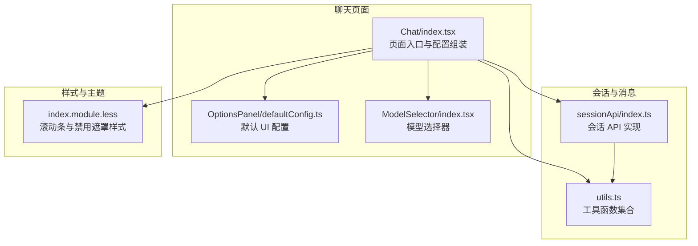
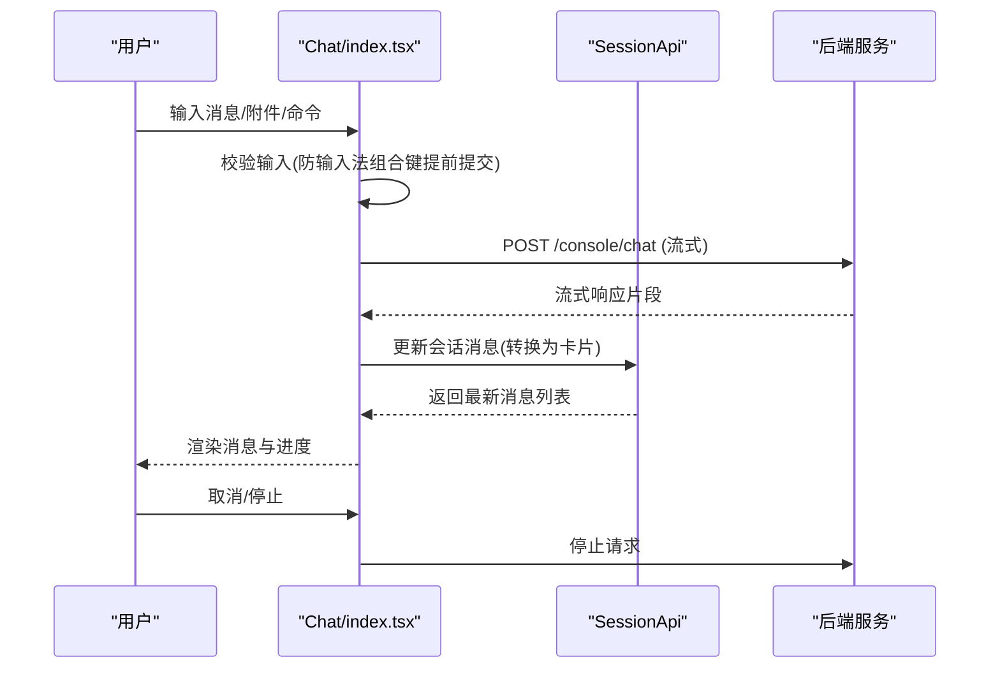
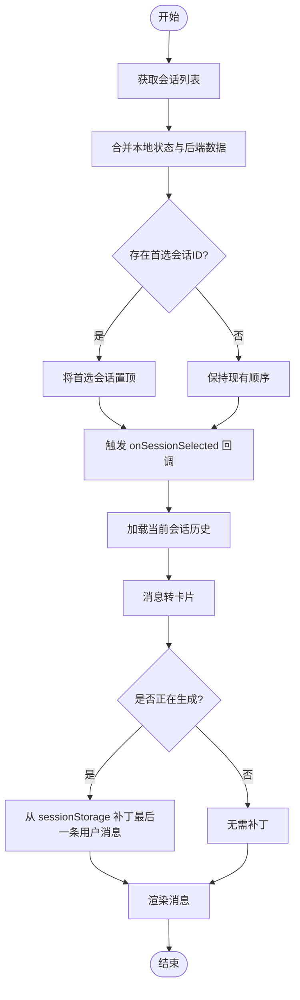
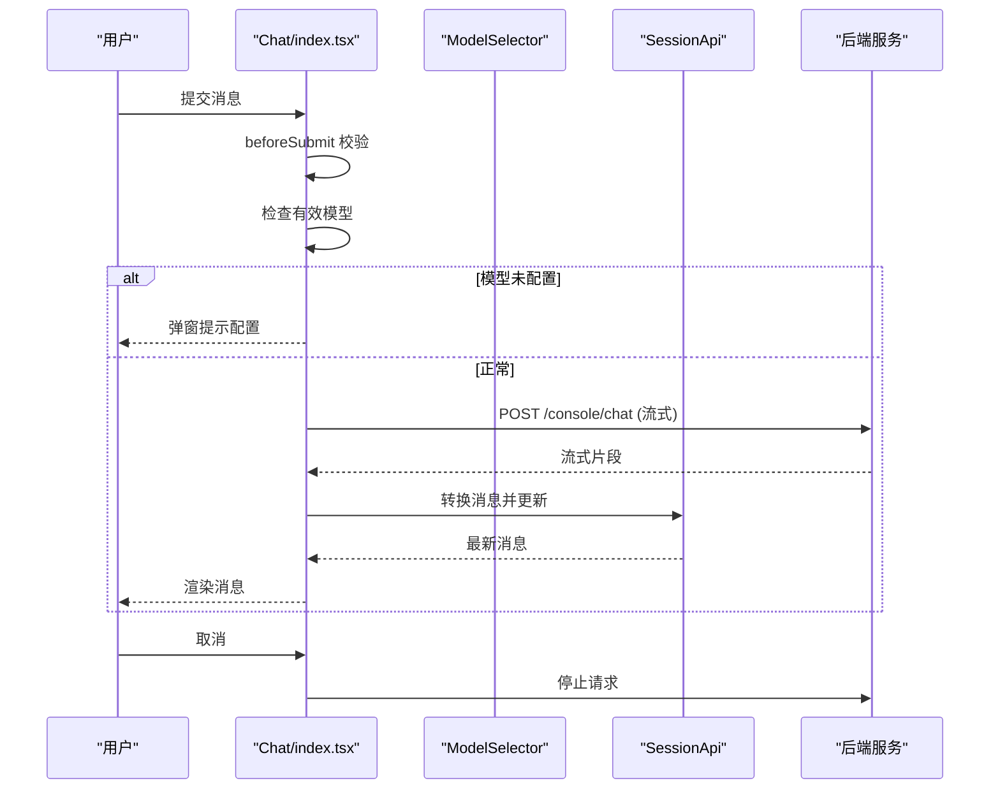
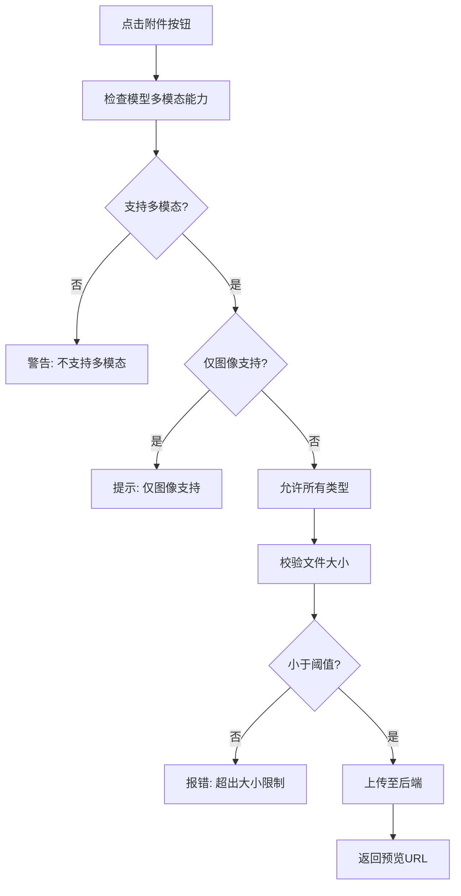
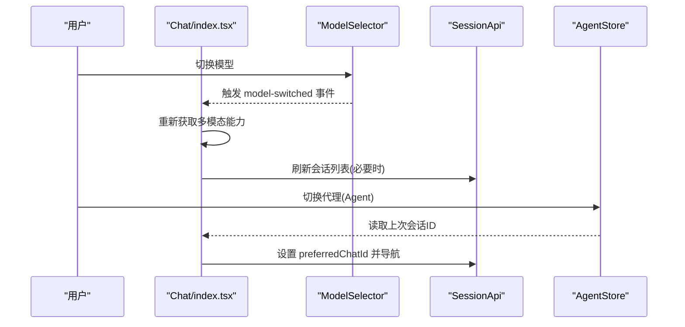
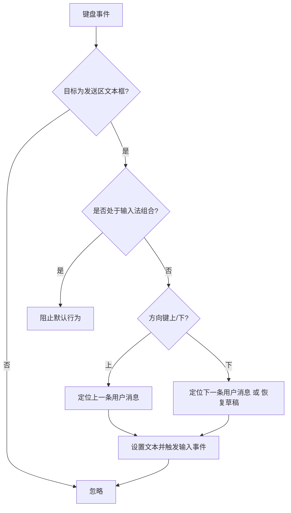
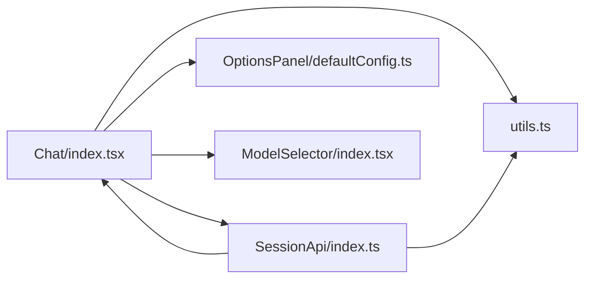

# 聊天界面页面

<cite>
**本文引用的文件**
- [index.tsx](file://console/src/pages/Chat/index.tsx)
- [index.module.less](file://console/src/pages/Chat/index.module.less)
- [utils.ts](file://console/src/pages/Chat/utils.ts)
- [sessionApi/index.ts](file://console/src/pages/Chat/sessionApi/index.ts)
- [OptionsPanel/defaultConfig.ts](file://console/src/pages/Chat/OptionsPanel/defaultConfig.ts)
- [ModelSelector/index.tsx](file://console/src/pages/Chat/ModelSelector/index.tsx)
</cite>

## 目录
1. [简介](#简介)
2. [项目结构](#项目结构)
3. [核心组件](#核心组件)
4. [架构总览](#架构总览)
5. [详细组件分析](#详细组件分析)
6. [依赖关系分析](#依赖关系分析)
7. [性能考量](#性能考量)
8. [故障排查指南](#故障排查指南)
9. [结论](#结论)
10. [附录](#附录)

## 简介
本文件面向“聊天界面页面”的实现，系统性阐述会话管理、消息展示、模型选择与会话配置等关键能力。重点覆盖以下方面：
- 会话列表渲染与 URL 同步、会话选择与创建、删除与重连
- 消息历史显示、实时消息处理与流式输出
- 会话搜索与命令建议（如清屏、紧凑模式、审批）
- 聊天选项面板、模型切换、会话抽屉与标题组件的交互
- 消息发送与接收处理、附件上传与多模态能力提示、错误状态与用户提示
- 用户体验优化：输入防抖、粘贴与复制、滚动条样式、暗色主题适配

## 项目结构
聊天页面采用“外部 UI 组件库 + 自定义会话 API + 工具函数”的分层设计：
- 页面入口负责组装 UI 配置、事件回调与全局状态联动
- 会话 API 将后端聊天数据转换为 UI 所需的消息卡片格式，并维护会话列表与窗口上下文
- 工具模块提供文本提取、剪贴板、URL 规范化、加载桥接等通用能力
- 选项面板与模型选择器作为可插拔 UI 组件参与主题与行为定制

图表来源
- [index.tsx:400-827](file://console/src/pages/Chat/index.tsx#L400-L827)
- [OptionsPanel/defaultConfig.ts:1-57](file://console/src/pages/Chat/OptionsPanel/defaultConfig.ts#L1-L57)
- [ModelSelector/index.tsx:23-23](file://console/src/pages/Chat/ModelSelector/index.tsx#L23-L23)
- [sessionApi/index.ts:339-735](file://console/src/pages/Chat/sessionApi/index.ts#L339-L735)
- [utils.ts:1-208](file://console/src/pages/Chat/utils.ts#L1-L208)
- [index.module.less:1-134](file://console/src/pages/Chat/index.module.less#L1-L134)

章节来源
- [index.tsx:1-894](file://console/src/pages/Chat/index.tsx#L1-L894)
- [sessionApi/index.ts:1-735](file://console/src/pages/Chat/sessionApi/index.ts#L1-L735)
- [utils.ts:1-208](file://console/src/pages/Chat/utils.ts#L1-L208)
- [OptionsPanel/defaultConfig.ts:1-57](file://console/src/pages/Chat/OptionsPanel/defaultConfig.ts#L1-L57)
- [index.module.less:1-134](file://console/src/pages/Chat/index.module.less#L1-L134)

## 核心组件
- 页面入口与配置
  - 组装 UI 选项：主题、欢迎语、发送器、会话 API、动作按钮等
  - 注册会话事件回调：选中、创建、移除、ID 解析
  - 处理模型未配置错误提示与导航
  - 提供自定义 fetch 以支持流式对话与会话上下文注入
- 会话 API
  - 将后端消息扁平结构转换为 UI 卡片消息
  - 维护会话列表、本地临时会话与真实会话 ID 的映射
  - 支持并发请求去重、生成状态检测与最后一条用户消息补丁
- 工具函数
  - 文本提取与复制、URL 规范化、内容 URL 归一化、加载状态桥接
- 选项面板与模型选择器
  - 默认配置与国际化文案注入
  - 模型切换事件监听与多模态能力提示

章节来源
- [index.tsx:400-827](file://console/src/pages/Chat/index.tsx#L400-L827)
- [sessionApi/index.ts:339-735](file://console/src/pages/Chat/sessionApi/index.ts#L339-L735)
- [utils.ts:1-208](file://console/src/pages/Chat/utils.ts#L1-L208)
- [OptionsPanel/defaultConfig.ts:1-57](file://console/src/pages/Chat/OptionsPanel/defaultConfig.ts#L1-L57)
- [ModelSelector/index.tsx:23-23](file://console/src/pages/Chat/ModelSelector/index.tsx#L23-L23)

## 架构总览
聊天页面通过外部 UI 组件库渲染消息与输入区域，内部通过会话 API 与后端交互，同时利用工具模块完成消息格式转换、URL 规范化与剪贴板操作。

图表来源
- [index.tsx:566-642](file://console/src/pages/Chat/index.tsx#L566-L642)
- [sessionApi/index.ts:233-252](file://console/src/pages/Chat/sessionApi/index.ts#L233-L252)
- [utils.ts:144-185](file://console/src/pages/Chat/utils.ts#L144-L185)

## 详细组件分析

### 会话管理与消息展示
- 会话列表渲染与 URL 同步
  - 使用会话 API 的 getSessionList 获取后端聊天列表，按时间倒序并合并本地状态
  - 通过 preferredChatId 强制将目标会话置顶，避免默认选择第一个
  - 注册 onSessionSelected/onSessionIdResolved/onSessionRemoved/onSessionCreated 回调，驱动路由更新与状态同步
- 消息历史显示
  - 将后端消息数组转换为 UI 卡片消息：用户消息映射为请求卡；连续非用户消息聚合为响应卡
  - 对图片/音频/视频/文件等内容 URL 进行显示前归一化
- 实时消息处理
  - 通过自定义 fetch 发起流式请求，结合 UI 组件的流式渲染能力逐步展示
  - 在 reconnect 场景下，若后端尚未持久化最新用户消息，则从 sessionStorage 补丁到前端消息列表
- 会话搜索与命令建议
  - 提供命令建议列表（清屏、紧凑模式、审批/拒绝），增强快捷操作体验

图表来源
- [sessionApi/index.ts:522-535](file://console/src/pages/Chat/sessionApi/index.ts#L522-L535)
- [sessionApi/index.ts:540-560](file://console/src/pages/Chat/sessionApi/index.ts#L540-L560)
- [sessionApi/index.ts:562-661](file://console/src/pages/Chat/sessionApi/index.ts#L562-L661)
- [sessionApi/index.ts:410-442](file://console/src/pages/Chat/sessionApi/index.ts#L410-L442)
- [sessionApi/index.ts:233-252](file://console/src/pages/Chat/sessionApi/index.ts#L233-L252)

章节来源
- [sessionApi/index.ts:339-735](file://console/src/pages/Chat/sessionApi/index.ts#L339-L735)
- [index.tsx:447-522](file://console/src/pages/Chat/index.tsx#L447-L522)

### 消息发送与接收处理
- 发送流程
  - beforeSubmit 阶段检查输入法组合状态，避免误触回车
  - 校验当前激活模型是否存在，不存在则弹出配置提示
  - 构造请求体：包含会话 ID、用户 ID、通道、流式标志与业务参数
  - 将内容中的媒体 URL 归一化为后端可识别路径
- 接收与渲染
  - 后端返回流式片段，UI 组件逐步渲染
  - 响应内容统一进行 URL 显示化处理
  - 支持取消当前会话的生成
- 错误状态与用户提示
  - 当模型未配置时返回特定错误响应，页面弹窗引导前往模型配置页
  - 附件上传失败或超出大小时给出明确提示

图表来源
- [index.tsx:713-716](file://console/src/pages/Chat/index.tsx#L713-L716)
- [index.tsx:566-642](file://console/src/pages/Chat/index.tsx#L566-L642)
- [index.tsx:783-791](file://console/src/pages/Chat/index.tsx#L783-L791)
- [sessionApi/index.ts:233-252](file://console/src/pages/Chat/sessionApi/index.ts#L233-L252)

章节来源
- [index.tsx:566-642](file://console/src/pages/Chat/index.tsx#L566-L642)
- [index.tsx:783-791](file://console/src/pages/Chat/index.tsx#L783-L791)
- [sessionApi/index.ts:233-252](file://console/src/pages/Chat/sessionApi/index.ts#L233-L252)

### 附件上传与多模态能力
- 附件上传
  - 限制最大尺寸，超限时提示并中断上传
  - 根据模型多模态能力显示不同提示（不支持多模态、仅图像支持等）
  - 成功后返回预览 URL
- 多模态能力检测
  - 通过 Provider/ActiveModels 查询当前模型的能力标记
  - 在模型切换事件后刷新能力状态

图表来源
- [index.tsx:644-686](file://console/src/pages/Chat/index.tsx#L644-L686)
- [index.tsx:144-227](file://console/src/pages/Chat/index.tsx#L144-L227)

章节来源
- [index.tsx:644-686](file://console/src/pages/Chat/index.tsx#L644-L686)
- [index.tsx:144-227](file://console/src/pages/Chat/index.tsx#L144-L227)

### 聊天选项面板、模型切换与会话抽屉
- 选项面板
  - 默认配置包含主题色、欢迎语、输入长度限制、免责声明等
  - 国际化文案注入，支持动态替换
- 模型切换
  - 监听来自 ModelSelector 的切换事件，重新拉取多模态能力并刷新 UI
  - 切换代理时保存/恢复上次活跃会话 ID，提升上下文连续性
- 会话抽屉与标题
  - 会话抽屉由会话 API 驱动，隐藏内置列表，使用自定义 API
  - 标题组件在右侧头部区域渲染，配合初始化器与加载桥接

图表来源
- [index.tsx:216-224](file://console/src/pages/Chat/index.tsx#L216-L224)
- [index.tsx:526-552](file://console/src/pages/Chat/index.tsx#L526-L552)
- [OptionsPanel/defaultConfig.ts:38-52](file://console/src/pages/Chat/OptionsPanel/defaultConfig.ts#L38-L52)

章节来源
- [index.tsx:216-224](file://console/src/pages/Chat/index.tsx#L216-L224)
- [index.tsx:526-552](file://console/src/pages/Chat/index.tsx#L526-L552)
- [OptionsPanel/defaultConfig.ts:1-57](file://console/src/pages/Chat/OptionsPanel/defaultConfig.ts#L1-L57)

### 输入法组合键与消息历史导航
- 输入法组合键抑制
  - 监听 compositionstart/compositionend 与 keydown/keypress，防止在输入法组合过程中误触发回车
- 消息历史导航
  - 在发送区文本框中使用上下箭头遍历历史用户消息
  - 支持光标位置判断与草稿保留，避免破坏当前编辑

图表来源
- [index.tsx:84-141](file://console/src/pages/Chat/index.tsx#L84-L141)
- [index.tsx:229-364](file://console/src/pages/Chat/index.tsx#L229-L364)

章节来源
- [index.tsx:84-141](file://console/src/pages/Chat/index.tsx#L84-L141)
- [index.tsx:229-364](file://console/src/pages/Chat/index.tsx#L229-L364)

### 样式与用户体验优化
- 滚动条样式
  - 自定义 WebKit 与 Firefox 滚动条颜色与悬停效果，适配明/暗主题
- 禁用遮罩
  - 在输入被禁用时对输入控件与按钮施加半透明与不可交互样式
- 复制与提示
  - 支持在安全上下文与非安全上下文中复制文本
  - 成功/失败提示通过应用消息组件反馈

章节来源
- [index.module.less:1-134](file://console/src/pages/Chat/index.module.less#L1-L134)
- [utils.ts:82-108](file://console/src/pages/Chat/utils.ts#L82-L108)
- [index.tsx:554-564](file://console/src/pages/Chat/index.tsx#L554-L564)

## 依赖关系分析
- 页面入口依赖
  - 会话 API：提供会话列表、获取/创建/删除会话与消息转换
  - 工具模块：文本提取、URL 规范化、剪贴板、加载桥接
  - 选项面板：默认配置与国际化文案
  - 模型选择器：事件监听与多模态能力刷新
- 会话 API 依赖
  - 后端聊天接口：列出会话、获取历史、删除会话
  - 工具模块：URL 规范化与消息转换辅助

图表来源
- [index.tsx:1-41](file://console/src/pages/Chat/index.tsx#L1-L41)
- [sessionApi/index.ts:1-13](file://console/src/pages/Chat/sessionApi/index.ts#L1-L13)
- [utils.ts:1-5](file://console/src/pages/Chat/utils.ts#L1-L5)
- [OptionsPanel/defaultConfig.ts:1-2](file://console/src/pages/Chat/OptionsPanel/defaultConfig.ts#L1-L2)
- [ModelSelector/index.tsx:23-23](file://console/src/pages/Chat/ModelSelector/index.tsx#L23-L23)

章节来源
- [index.tsx:1-41](file://console/src/pages/Chat/index.tsx#L1-L41)
- [sessionApi/index.ts:1-13](file://console/src/pages/Chat/sessionApi/index.ts#L1-L13)

## 性能考量
- 并发请求去重
  - 会话列表与单个会话请求均采用去重策略，避免重复网络往返
- 本地缓存与补丁
  - 使用 sessionStorage 缓存最后一条用户消息，在生成期间补丁到前端，减少等待时间
- 渲染优化
  - 消息转换采用分组聚合策略，降低 UI 卡片数量与重排成本
- 主题与样式
  - 滚动条样式与暗色主题适配，减少额外计算开销

章节来源
- [sessionApi/index.ts:364-374](file://console/src/pages/Chat/sessionApi/index.ts#L364-L374)
- [sessionApi/index.ts:410-442](file://console/src/pages/Chat/sessionApi/index.ts#L410-L442)
- [sessionApi/index.ts:233-252](file://console/src/pages/Chat/sessionApi/index.ts#L233-L252)

## 故障排查指南
- 模型未配置
  - 现象：发送消息时返回错误响应并弹出配置提示
  - 处理：跳转至模型配置页完成配置后重试
- 附件上传失败
  - 症状：超出大小限制或上传异常
  - 处理：检查文件类型与大小，确认模型多模态能力
- 输入法组合键导致误提交
  - 症状：在中文输入法组合过程中按下回车
  - 处理：确保使用最新浏览器版本，组合结束后再提交
- 会话 URL 不同步
  - 症状：新建/删除/切换会话后地址栏未更新
  - 处理：确认已注册 onSessionCreated/onSessionRemoved/onSessionSelected 回调

章节来源
- [index.tsx:586-592](file://console/src/pages/Chat/index.tsx#L586-L592)
- [index.tsx:667-676](file://console/src/pages/Chat/index.tsx#L667-L676)
- [index.tsx:103-116](file://console/src/pages/Chat/index.tsx#L103-L116)
- [index.tsx:447-522](file://console/src/pages/Chat/index.tsx#L447-L522)

## 结论
该聊天界面通过清晰的分层设计实现了稳定的会话管理、流畅的消息渲染与良好的用户体验。会话 API 将后端数据转换为 UI 友好的卡片消息，页面入口负责配置与事件编排，工具模块提供跨场景的通用能力。未来可在以下方面持续优化：进一步细化并发控制策略、增强错误恢复与重试机制、扩展命令建议与快捷操作面板。

## 附录
- 关键实现路径参考
  - 页面入口与配置组装：[index.tsx:400-827](file://console/src/pages/Chat/index.tsx#L400-L827)
  - 会话 API 实现与消息转换：[sessionApi/index.ts:339-735](file://console/src/pages/Chat/sessionApi/index.ts#L339-L735)
  - 工具函数集合：[utils.ts:1-208](file://console/src/pages/Chat/utils.ts#L1-L208)
  - 默认配置与国际化：[OptionsPanel/defaultConfig.ts:1-57](file://console/src/pages/Chat/OptionsPanel/defaultConfig.ts#L1-L57)
  - 模型选择器事件监听：[index.tsx:216-224](file://console/src/pages/Chat/index.tsx#L216-L224)