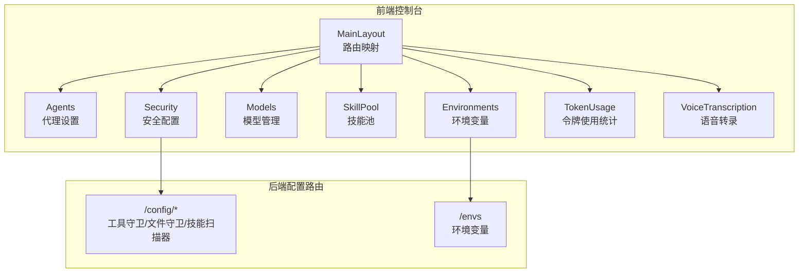
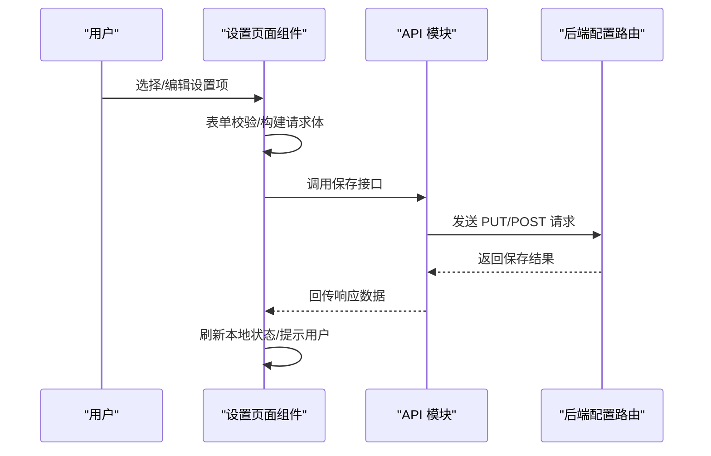
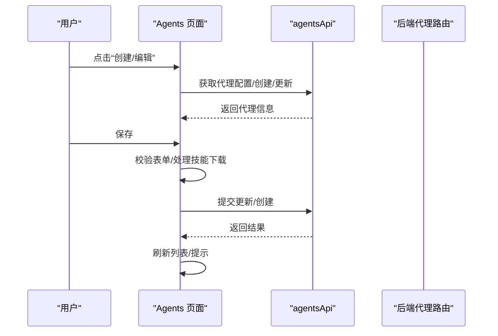
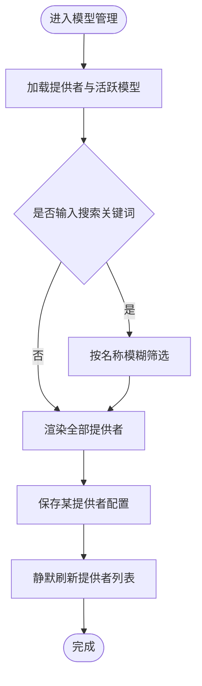
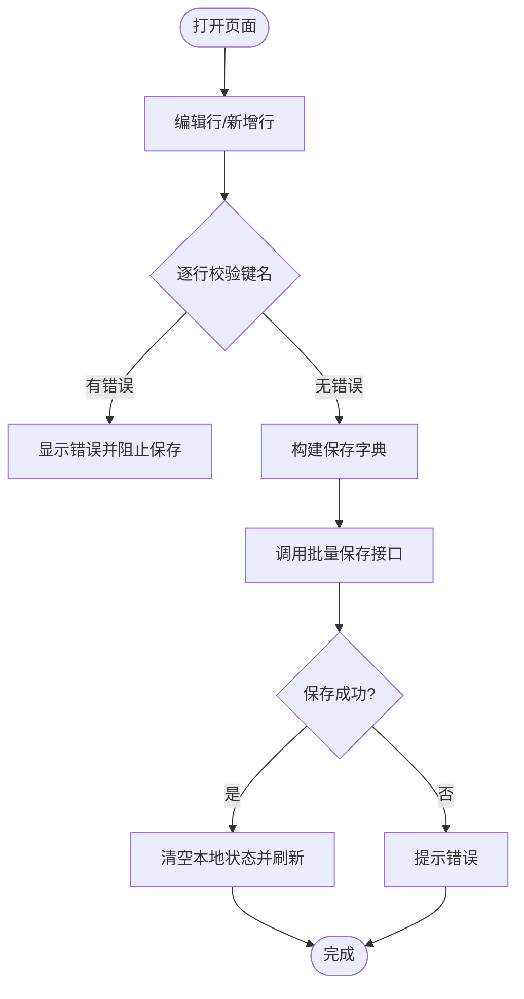
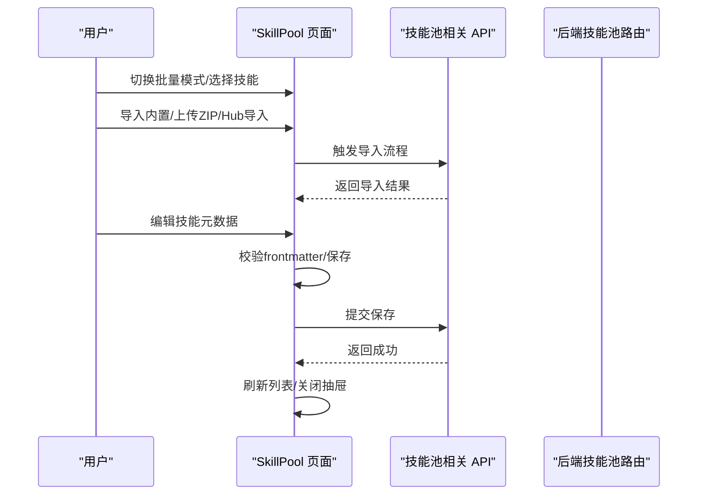
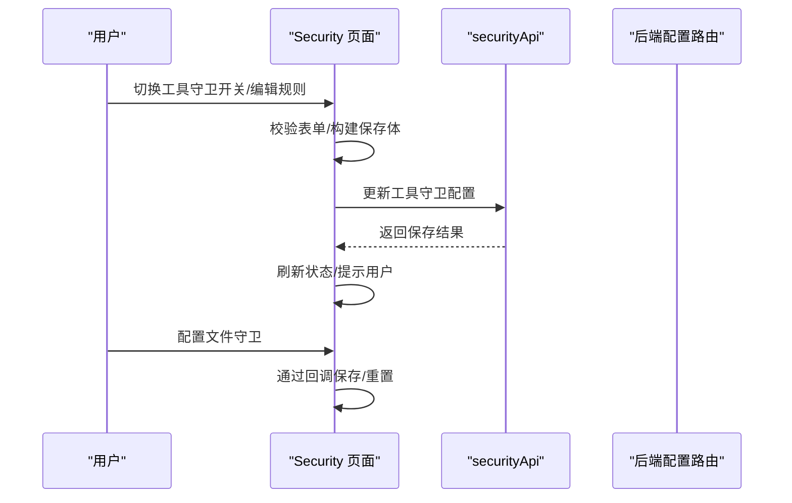
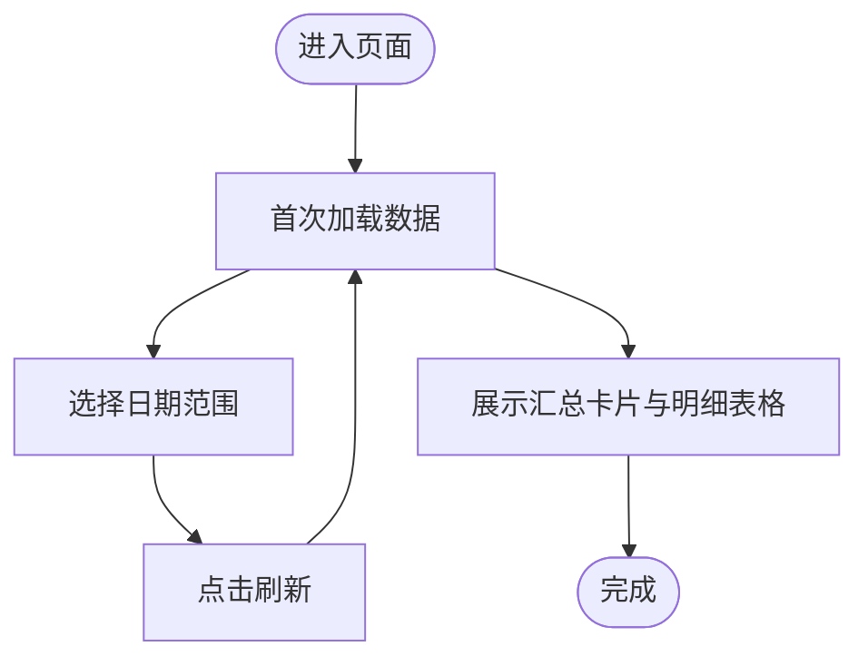
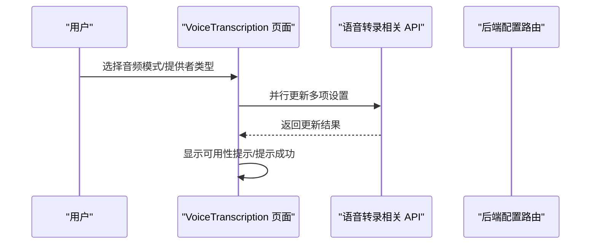
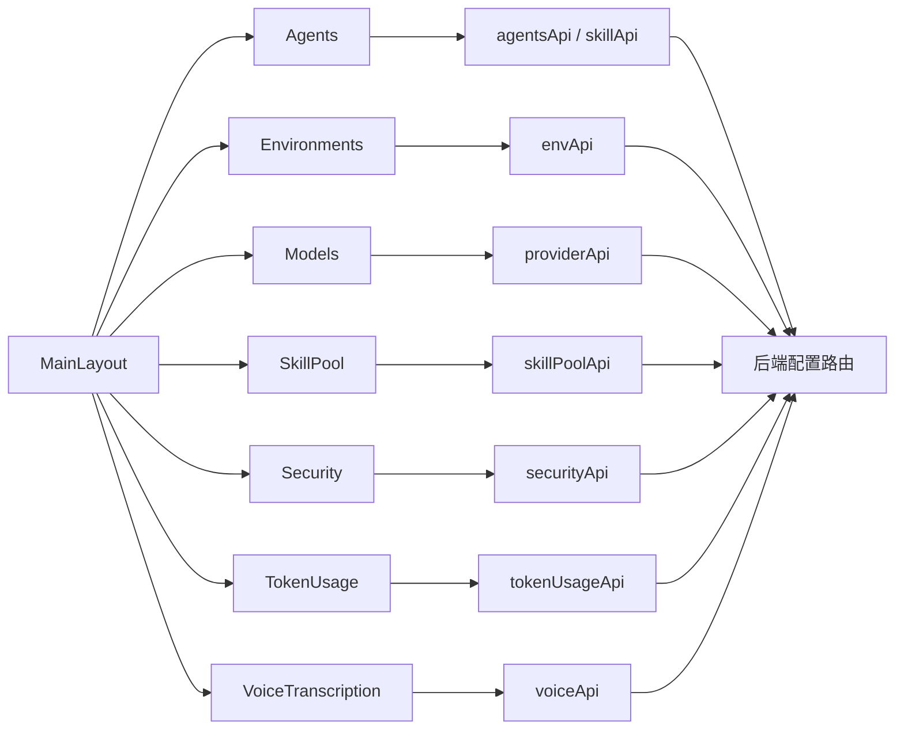

# 设置页面

<cite>
**本文档引用的文件**
- [Agents/index.tsx](file://console/src/pages/Settings/Agents/index.tsx)
- [Environments/index.tsx](file://console/src/pages/Settings/Environments/index.tsx)
- [Models/index.tsx](file://console/src/pages/Settings/Models/index.tsx)
- [SkillPool/index.tsx](file://console/src/pages/Settings/SkillPool/index.tsx)
- [Security/index.tsx](file://console/src/pages/Settings/Security/index.tsx)
- [TokenUsage/index.tsx](file://console/src/pages/Settings/TokenUsage/index.tsx)
- [VoiceTranscription/index.tsx](file://console/src/pages/Settings/VoiceTranscription/index.tsx)
- [MainLayout/index.tsx](file://console/src/layouts/MainLayout/index.tsx)
- [env.ts](file://console/src/api/modules/env.ts)
- [security.ts](file://console/src/api/modules/security.ts)
- [config.py](file://src/copaw/app/routers/config.py)
</cite>

## 目录
1. [简介](#简介)
2. [项目结构](#项目结构)
3. [核心组件](#核心组件)
4. [架构总览](#架构总览)
5. [详细组件分析](#详细组件分析)
6. [依赖关系分析](#依赖关系分析)
7. [性能考虑](#性能考虑)
8. [故障排除指南](#故障排除指南)
9. [结论](#结论)

## 简介
本文件系统性梳理 Copaw 控制台设置页面的实现与工作机制，覆盖以下子页面：代理设置（通过环境变量）、模型管理、环境变量、技能池、安全配置（工具守卫/文件守卫/技能扫描器）、令牌使用统计、语音转录。内容涵盖数据绑定、验证规则、保存机制、实时预览、状态管理、权限控制与配置同步，并补充设置导入导出、重置恢复与批量配置的实现思路。

## 项目结构
设置页面位于前端控制台的 Settings 目录下，采用按功能分页的组织方式；后端通过统一的配置路由提供读写能力。主布局负责路由映射与页面懒加载。

**图表来源**
- [MainLayout/index.tsx:38-50](file://console/src/layouts/MainLayout/index.tsx#L38-L50)
- [config.py:404-498](file://src/copaw/app/routers/config.py#L404-L498)
- [env.ts:4-18](file://console/src/api/modules/env.ts#L4-L18)

**章节来源**
- [MainLayout/index.tsx:38-50](file://console/src/layouts/MainLayout/index.tsx#L38-L50)

## 核心组件
- 数据获取与缓存：各页面通过自定义 Hook 或直接调用 API 模块拉取初始配置，部分页面支持“静默刷新”以避免阻塞用户操作。
- 表单与校验：使用 Ant Design 表单组件进行字段绑定与校验，结合本地状态维护编辑态与脏值。
- 保存与同步：保存时对表单进行验证，构造请求体并调用后端接口；成功后刷新本地状态并提示用户。
- 批量与选择：环境变量与技能池支持多选、全选、批量删除等操作，减少重复交互。
- 实时预览：部分页面在切换选项或输入时即时反馈状态（如语音转录的可用性提示）。

**章节来源**
- [Agents/index.tsx:16-186](file://console/src/pages/Settings/Agents/index.tsx#L16-L186)
- [Environments/index.tsx:30-326](file://console/src/pages/Settings/Environments/index.tsx#L30-L326)
- [Models/index.tsx:20-152](file://console/src/pages/Settings/Models/index.tsx#L20-L152)
- [SkillPool/index.tsx:30-290](file://console/src/pages/Settings/SkillPool/index.tsx#L30-L290)
- [Security/index.tsx:40-438](file://console/src/pages/Settings/Security/index.tsx#L40-L438)
- [TokenUsage/index.tsx:21-224](file://console/src/pages/Settings/TokenUsage/index.tsx#L21-L224)
- [VoiceTranscription/index.tsx:22-288](file://console/src/pages/Settings/VoiceTranscription/index.tsx#L22-L288)

## 架构总览
设置页面的前后端交互遵循“页面组件 → API 模块 → 后端路由”的链路。页面组件负责渲染与用户交互，API 模块封装请求方法，后端路由处理业务逻辑与持久化。

**图表来源**
- [Security/index.tsx:90-115](file://console/src/pages/Settings/Security/index.tsx#L90-L115)
- [security.ts:80-86](file://console/src/api/modules/security.ts#L80-L86)
- [config.py:412-430](file://src/copaw/app/routers/config.py#L412-L430)

## 详细组件分析

### 代理设置（Agents）
- 功能要点
  - 支持创建、编辑、启用/禁用、拖拽排序代理。
  - 编辑时从后端拉取配置并回填表单。
  - 新增代理时可同时选择技能包并触发下载到目标工作空间。
- 数据绑定与校验
  - 使用 Ant Design Form 进行字段绑定与校验。
  - 保存前对必填字段与格式进行验证。
- 保存机制
  - 更新代理时先为新增技能执行下载任务，再提交更新请求。
  - 成功后刷新列表并提示用户。
- 排序与同步
  - 本地维护排序状态并在成功后调用后端重排接口。
- 权限控制
  - 页面入口与操作按钮受路由与权限控制，具体权限策略由后端鉴权决定。

**图表来源**
- [Agents/index.tsx:83-119](file://console/src/pages/Settings/Agents/index.tsx#L83-L119)
- [Agents/index.tsx:121-141](file://console/src/pages/Settings/Agents/index.tsx#L121-L141)

**章节来源**
- [Agents/index.tsx:16-186](file://console/src/pages/Settings/Agents/index.tsx#L16-L186)

### 模型管理（Models）
- 功能要点
  - 展示远程与本地模型提供者卡片，支持搜索过滤。
  - 提供添加自定义提供者的弹窗。
- 数据绑定与校验
  - 通过 ProviderCard 组件内部处理各自配置项的绑定与校验。
- 保存机制
  - 保存后调用“静默刷新”以避免闪烁，随后整体刷新提供者列表。
- 实时预览
  - 搜索框支持输入即查，列表按名称模糊匹配。

**图表来源**
- [Models/index.tsx:26-48](file://console/src/pages/Settings/Models/index.tsx#L26-L48)
- [Models/index.tsx:50-58](file://console/src/pages/Settings/Models/index.tsx#L50-L58)

**章节来源**
- [Models/index.tsx:20-152](file://console/src/pages/Settings/Models/index.tsx#L20-L152)

### 环境变量（Environments）
- 功能要点
  - 支持新增、插入、删除、批量删除、全选/反选、重置与保存。
  - 键名格式校验（字母下划线开头、仅含字母数字下划线且唯一）。
- 数据绑定与校验
  - 本地维护 rows 与 keyErrors，逐行校验键名格式与唯一性。
- 保存机制
  - 将本地 rows 转换为字典后调用批量保存接口，成功后清空本地状态并重新拉取。
- 实时预览
  - 删除新行不发请求，直接本地移除；已持久化的行需二次确认后删除并同步刷新。

**图表来源**
- [Environments/index.tsx:212-228](file://console/src/pages/Settings/Environments/index.tsx#L212-L228)
- [Environments/index.tsx:230-251](file://console/src/pages/Settings/Environments/index.tsx#L230-L251)

**章节来源**
- [Environments/index.tsx:30-326](file://console/src/pages/Settings/Environments/index.tsx#L30-L326)
- [env.ts:4-18](file://console/src/api/modules/env.ts#L4-L18)

### 技能池（SkillPool）
- 功能要点
  - 支持刷新、广播、导入内置、上传 ZIP、Hub 导入、批量操作、视图切换与搜索过滤。
  - 支持抽屉式编辑技能元数据与配置文本。
- 数据绑定与校验
  - 抽屉内容变更时校验 frontmatter 结构，保存前汇总表单数据。
- 保存机制
  - 保存后关闭抽屉并刷新技能列表；冲突时弹出重命名模态框。
- 批量配置
  - 批量模式下支持全选、清空、批量删除与退出批量。

**图表来源**
- [SkillPool/index.tsx:244-282](file://console/src/pages/Settings/SkillPool/index.tsx#L244-L282)

**章节来源**
- [SkillPool/index.tsx:30-290](file://console/src/pages/Settings/SkillPool/index.tsx#L30-L290)

### 安全配置（Security）
- 功能要点
  - 工具守卫：启用开关、受保护工具与禁止工具的选择、自定义规则增删改与预览。
  - 文件守卫：通过回调暴露保存/重置方法，支持独立保存。
  - 技能扫描器：展示扫描结果与白名单配置。
- 数据绑定与校验
  - 表单字段与规则表单分别绑定，规则编辑时对 ID 唯一性进行校验。
- 保存机制
  - 工具守卫保存时合并启用状态、受保护/禁止工具、自定义规则与禁用规则集合。
  - 文件守卫保存通过回调执行，避免与工具守卫共享状态。
- 实时预览
  - 规则表格支持预览与启用/禁用切换。

**图表来源**
- [Security/index.tsx:90-115](file://console/src/pages/Settings/Security/index.tsx#L90-L115)
- [security.ts:80-86](file://console/src/api/modules/security.ts#L80-L86)
- [config.py:412-430](file://src/copaw/app/routers/config.py#L412-L430)

**章节来源**
- [Security/index.tsx:40-438](file://console/src/pages/Settings/Security/index.tsx#L40-L438)
- [security.ts:77-92](file://console/src/api/modules/security.ts#L77-L92)
- [config.py:404-498](file://src/copaw/app/routers/config.py#L404-L498)

### 令牌使用统计（TokenUsage）
- 功能要点
  - 支持日期范围筛选，按模型与按日期维度展示统计卡片与表格。
- 数据绑定与校验
  - 使用日期选择器绑定起止时间，保存时格式化为 YYYY-MM-DD。
- 保存机制
  - 刷新按钮触发重新拉取统计数据，失败时提示并保留上次数据。

**图表来源**
- [TokenUsage/index.tsx:32-54](file://console/src/pages/Settings/TokenUsage/index.tsx#L32-L54)
- [TokenUsage/index.tsx:139-221](file://console/src/pages/Settings/TokenUsage/index.tsx#L139-L221)

**章节来源**
- [TokenUsage/index.tsx:21-224](file://console/src/pages/Settings/TokenUsage/index.tsx#L21-L224)

### 语音转录（VoiceTranscription）
- 功能要点
  - 支持音频模式（自动/原生）与转录提供者类型（禁用/Whisper API/本地 Whisper）。
  - 原生模式下检测 FFmpeg 与 Whisper 可用性并给出提示。
- 数据绑定与校验
  - 单选组绑定当前模式与提供者类型，必要时联动可用提供者列表。
- 保存机制
  - 并行发送多个更新请求（音频模式、提供者类型、可选提供者），成功后统一提示。

**图表来源**
- [VoiceTranscription/index.tsx:34-54](file://console/src/pages/Settings/VoiceTranscription/index.tsx#L34-L54)
- [VoiceTranscription/index.tsx:60-78](file://console/src/pages/Settings/VoiceTranscription/index.tsx#L60-L78)

**章节来源**
- [VoiceTranscription/index.tsx:22-288](file://console/src/pages/Settings/VoiceTranscription/index.tsx#L22-L288)

## 依赖关系分析
- 前端路由与页面
  - MainLayout 将设置子页面注册为懒加载路由，确保按需加载与性能优化。
- API 模块与后端路由
  - 各设置页面通过 API 模块调用后端配置路由，实现统一的读写协议。
- 状态管理
  - 页面内使用 useState/useEffect 管理本地状态；部分页面通过 Hook 封装复用逻辑（如 useToolGuard）。

**图表来源**
- [MainLayout/index.tsx:38-50](file://console/src/layouts/MainLayout/index.tsx#L38-L50)
- [security.ts:77-92](file://console/src/api/modules/security.ts#L77-L92)
- [env.ts:4-18](file://console/src/api/modules/env.ts#L4-L18)
- [config.py:404-498](file://src/copaw/app/routers/config.py#L404-L498)

**章节来源**
- [MainLayout/index.tsx:38-50](file://console/src/layouts/MainLayout/index.tsx#L38-L50)

## 性能考虑
- 懒加载与分页：设置页面均采用懒加载，减少首屏负担。
- 静默刷新：模型管理使用“静默刷新”避免频繁重绘。
- 并行请求：语音转录保存时并行更新多项设置，缩短等待时间。
- 分页渲染：技能池使用渐进渲染以提升大列表性能。

## 故障排除指南
- 通用问题
  - 加载失败：多数页面在错误状态下提供“重试”按钮，点击后重新拉取数据。
  - 保存失败：保存接口捕获异常并提示错误信息，建议检查网络与权限。
- 环境变量
  - 键名校验失败：检查键名是否为空、格式是否符合规范以及是否存在重复。
- 安全配置
  - 工具守卫规则 ID 冲突：自定义规则 ID 必须唯一，避免与内置规则重复。
- 语音转录
  - 原生模式不可用：检查 FFmpeg 与 Whisper 是否安装，按提示修复后重试。

**章节来源**
- [Environments/index.tsx:212-228](file://console/src/pages/Settings/Environments/index.tsx#L212-L228)
- [Security/index.tsx:181-184](file://console/src/pages/Settings/Security/index.tsx#L181-L184)
- [VoiceTranscription/index.tsx:145-162](file://console/src/pages/Settings/VoiceTranscription/index.tsx#L145-L162)

## 结论
设置页面围绕“表单驱动 + API 交互 + 状态管理”的模式构建，覆盖代理、模型、环境变量、技能池、安全、统计与语音转录等关键领域。通过统一的路由与 API 设计，实现了清晰的职责分离与良好的用户体验。后续可在以下方面持续优化：统一的错误处理与国际化提示、更细粒度的权限控制、配置导入导出的标准化格式与批量应用能力。