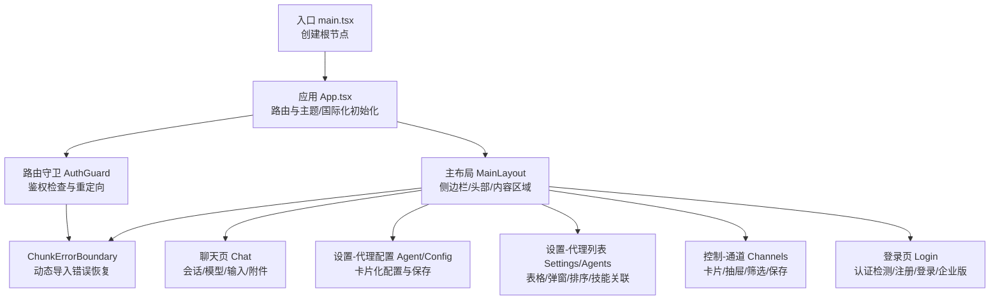
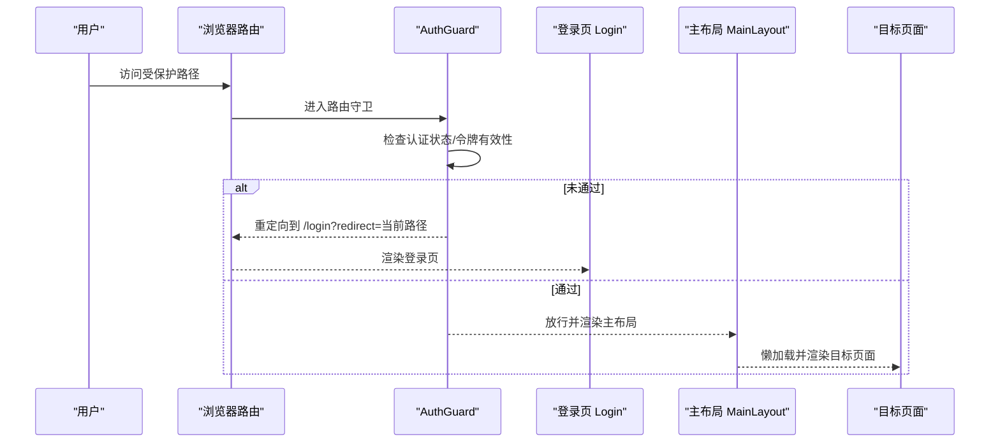
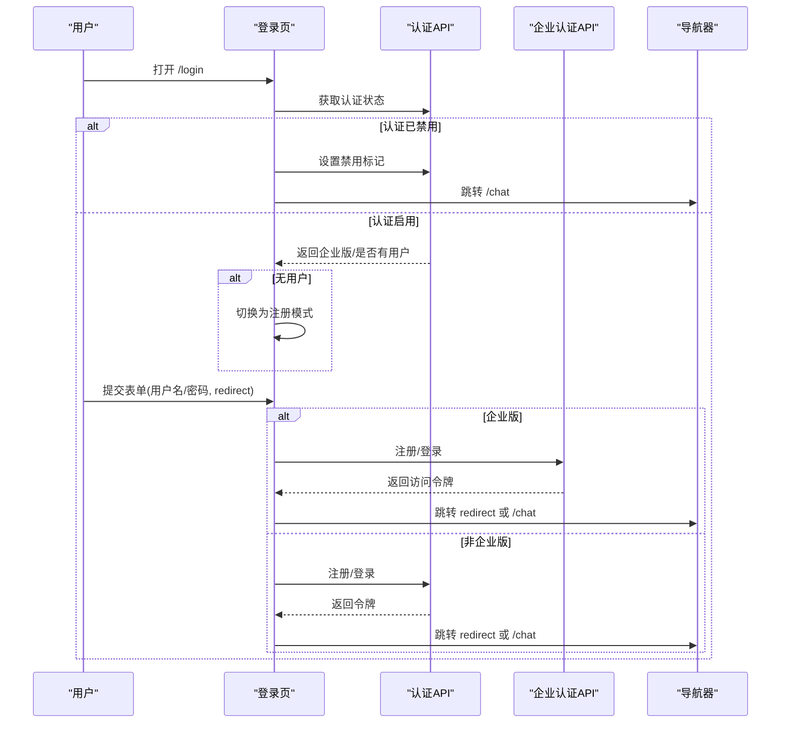
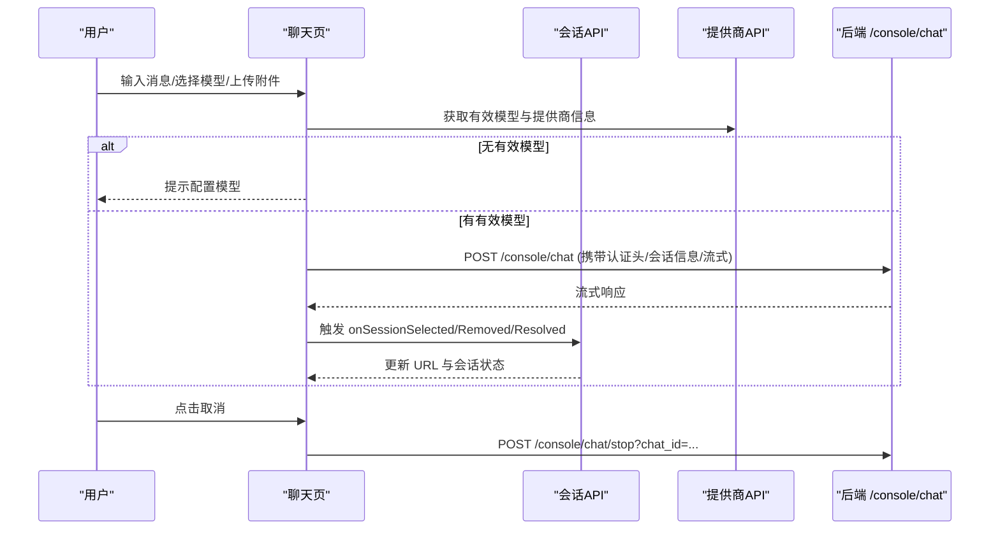
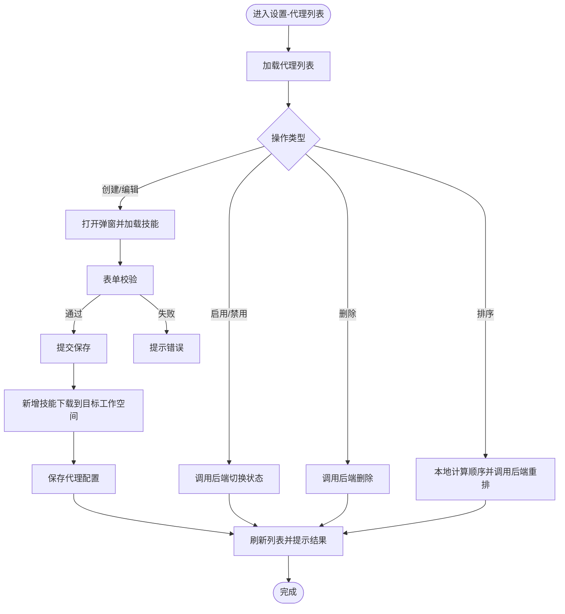
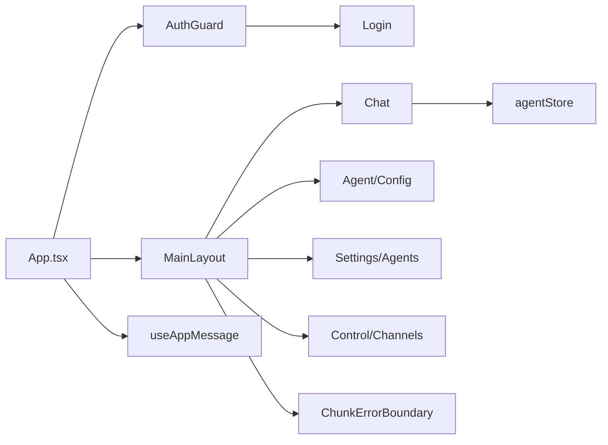

# 页面组件

<cite>
**本文引用的文件**
- [App.tsx](file://console/src/App.tsx)
- [main.tsx](file://console/src/main.tsx)
- [MainLayout/index.tsx](file://console/src/layouts/MainLayout/index.tsx)
- [Login/index.tsx](file://console/src/pages/Login/index.tsx)
- [Chat/index.tsx](file://console/src/pages/Chat/index.tsx)
- [Settings/Agents/index.tsx](file://console/src/pages/Settings/Agents/index.tsx)
- [Agent/Config/index.tsx](file://console/src/pages/Agent/Config/index.tsx)
- [Control/Channels/index.tsx](file://console/src/pages/Control/Channels/index.tsx)
- [ChunkErrorBoundary.tsx](file://console/src/components/ChunkErrorBoundary.tsx)
- [agentStore.ts](file://console/src/stores/agentStore.ts)
- [auth.ts](file://console/src/api/modules/auth.ts)
- [chat.ts](file://console/src/api/modules/chat.ts)
- [agent.ts](file://console/src/api/types/agent.ts)
- [useAppMessage.ts](file://console/src/hooks/useAppMessage.ts)
</cite>

## 目录
1. [简介](#简介)
2. [项目结构](#项目结构)
3. [核心组件](#核心组件)
4. [架构总览](#架构总览)
5. [详细组件分析](#详细组件分析)
6. [依赖关系分析](#依赖关系分析)
7. [性能考量](#性能考量)
8. [故障排查指南](#故障排查指南)
9. [结论](#结论)
10. [附录](#附录)

## 简介
本文件面向 CoPaw 前端控制台的页面组件，系统性梳理各功能页面的组件结构、数据流与用户交互模式。重点覆盖以下页面：
- 登录页面：认证检测、注册/登录流程、企业版适配与重定向
- 聊天界面：会话管理、模型选择、多模态附件上传、输入历史导航、运行时加载桥接
- 设置页面（代理管理）：代理配置卡片化展示与保存、语言/时区变更、运行配置项
- 控制页面（代理管理）：代理列表、启用/禁用、排序、创建/编辑弹窗、技能关联
- 控制页面（通道管理）：通道配置卡片、筛选、抽屉式编辑与保存

同时阐述页面级状态管理（Zustand）、表单处理、数据验证与错误处理机制，并给出页面间导航逻辑、参数传递与路由守卫的实现方式。

## 项目结构
控制台前端采用 React + Vite 构建，使用 Ant Design 与自研设计库组合，路由基于 React Router，布局由主框架包裹，页面按需懒加载并带自动重试与错误边界保护。

图表来源
- [main.tsx:1-31](file://console/src/main.tsx#L1-L31)
- [App.tsx:142-228](file://console/src/App.tsx#L142-L228)
- [MainLayout/index.tsx:94-156](file://console/src/layouts/MainLayout/index.tsx#L94-L156)
- [ChunkErrorBoundary.tsx:41-85](file://console/src/components/ChunkErrorBoundary.tsx#L41-L85)

章节来源
- [main.tsx:1-31](file://console/src/main.tsx#L1-L31)
- [App.tsx:142-228](file://console/src/App.tsx#L142-L228)
- [MainLayout/index.tsx:94-156](file://console/src/layouts/MainLayout/index.tsx#L94-L156)

## 核心组件
- 应用入口与全局配置：初始化 Ant Design 国际化与主题、设置路由基础路径、注入全局样式
- 路由守卫：统一鉴权检查，支持企业版与传统版双路径校验，未通过则重定向至登录页
- 主布局：侧边栏导航、顶部头部、内容区懒加载与错误边界
- 页面级状态：Zustand 代理存储，持久化到 sessionStorage，支持选中代理与最近会话记忆
- 通知钩子：通过 Ant Design App 上下文获取消息实例，确保与 ConfigProvider 前缀一致

章节来源
- [App.tsx:142-228](file://console/src/App.tsx#L142-L228)
- [agentStore.ts:19-89](file://console/src/stores/agentStore.ts#L19-L89)
- [useAppMessage.ts:12-16](file://console/src/hooks/useAppMessage.ts#L12-L16)

## 架构总览
控制台采用“应用层（App）→ 路由层（AuthGuard）→ 布局层（MainLayout）→ 页面层”的分层架构。页面间通过路由切换，懒加载组件以降低首屏体积；错误边界对动态导入失败进行恢复提示；状态管理在页面内通过 Zustand 与 Hooks 组合实现。

图表来源
- [App.tsx:49-136](file://console/src/App.tsx#L49-L136)
- [MainLayout/index.tsx:119-147](file://console/src/layouts/MainLayout/index.tsx#L119-L147)

## 详细组件分析

### 登录页面（Login）
- 功能要点
  - 首次挂载检测认证状态，若认证关闭则直接跳转聊天页
  - 判断是否为企业版与是否存在用户，决定显示注册或登录表单
  - 支持企业版注册/登录后自动设置令牌并跳转
  - 使用 Antd 表单进行必填校验，提交时根据 redirect 参数或默认值跳转
- 数据流与交互
  - 读取 URL 查询参数 redirect，校验相对路径合法性
  - 企业版与非企业版分别调用对应 API，成功后写入令牌并导航
  - 失败时通过 useAppMessage 显示错误提示
- 错误处理
  - 认证状态查询失败时回退为显示登录表单
  - 提交异常捕获并提示

图表来源
- [Login/index.tsx:24-116](file://console/src/pages/Login/index.tsx#L24-L116)
- [auth.ts:15-49](file://console/src/api/modules/auth.ts#L15-L49)

章节来源
- [Login/index.tsx:12-234](file://console/src/pages/Login/index.tsx#L12-L234)
- [auth.ts:15-76](file://console/src/api/modules/auth.ts#L15-L76)

### 聊天界面（Chat）
- 功能要点
  - 集成第三方运行时组件，提供会话列表、发送器、欢迎语等
  - 会话 URL 同步：新建/删除/选择会话时自动更新地址栏
  - 代理切换：记录每个代理的最近会话，切换时恢复上次会话
  - 输入增强：IME 组合键抑制、上下方向键浏览历史消息
  - 多模态附件：上传限制、能力检测、预览链接生成
  - 运行时加载桥接：与第三方运行时同步加载状态
- 数据流与交互
  - 自定义 fetch 包装：构建认证头、校验有效模型、规范化内容 URL、记录最后用户消息
  - 会话 API 事件回调：onSessionIdResolved/onSessionSelected/onSessionRemoved/onSessionCreated
  - 文件上传：调用 chatApi.uploadFile，成功后返回可预览 URL
- 错误处理
  - 无有效模型时返回错误响应并提示
  - 上传超限/失败时提示并回调错误
  - 取消会话：调用 chatApi.stopChat

图表来源
- [Chat/index.tsx:449-522](file://console/src/pages/Chat/index.tsx#L449-L522)
- [Chat/index.tsx:566-642](file://console/src/pages/Chat/index.tsx#L566-L642)
- [Chat/index.tsx:644-686](file://console/src/pages/Chat/index.tsx#L644-L686)
- [chat.ts:21-97](file://console/src/api/modules/chat.ts#L21-L97)

章节来源
- [Chat/index.tsx:400-800](file://console/src/pages/Chat/index.tsx#L400-L800)
- [chat.ts:21-137](file://console/src/api/modules/chat.ts#L21-L137)

### 设置页面（代理管理：Agent/Config）
- 功能要点
  - 卡片化配置：ReactAgent/LlmRetry/LlmRateLimiter/ContextCompact/ToolResultCompact/MemorySummary/EmbeddingConfig
  - 语言与时区变更：独立保存，避免影响整体配置
  - 加载/保存状态：统一 loading/saving 状态，失败时提供重试按钮
- 数据流与交互
  - 使用 useAgentConfig 管理表单与配置，保存时合并变更并调用后端接口
  - 语言与时区变更通过独立接口保存，不触发整体配置保存
- 错误处理
  - 加载失败显示错误与重试按钮
  - 保存失败通过消息提示反馈

章节来源
- [Agent/Config/index.tsx:16-106](file://console/src/pages/Agent/Config/index.tsx#L16-L106)

### 设置页面（代理管理：Settings/Agents）
- 功能要点
  - 代理表格：展示、启用/禁用、删除、排序
  - 创建/编辑弹窗：表单校验、工作空间目录处理、技能下载与绑定
  - 技能关联：安装新技能到目标工作空间后再保存代理
  - 选中代理切换：删除/禁用当前选中代理时自动切回默认代理
- 数据流与交互
  - useAgents 管理列表与 CRUD 操作
  - 排序：本地计算新顺序，调用后端重排接口，失败回滚
  - 表单：validateFields 校验后提交，成功提示并刷新列表
- 错误处理
  - 删除/切换/保存异常均通过消息提示反馈

图表来源
- [Settings/Agents/index.tsx:16-186](file://console/src/pages/Settings/Agents/index.tsx#L16-L186)

章节来源
- [Settings/Agents/index.tsx:16-186](file://console/src/pages/Settings/Agents/index.tsx#L16-L186)

### 控制页面（通道管理：Control/Channels）
- 功能要点
  - 通道卡片：内置/自定义分类，启用优先展示
  - 抽屉编辑：表单字段映射、过滤工具消息/思考内容的布尔反转
  - 保存：调用更新接口，成功后刷新卡片列表并提示
- 数据流与交互
  - useChannels 管理通道配置与加载
  - 筛选：all/builtin/custom 三态切换
  - 提交：合并已有配置与表单值，调用更新接口
- 错误处理
  - 更新失败提示并保留原配置

章节来源
- [Control/Channels/index.tsx:18-164](file://console/src/pages/Control/Channels/index.tsx#L18-L164)

## 依赖关系分析
- 路由与守卫
  - App.tsx 定义 /login 与通配路由，通配路由外层包裹 AuthGuard
  - AuthGuard 内部先检查认证状态，再校验令牌（企业版优先，失败回退传统版），未通过则重定向
- 页面懒加载与错误恢复
  - MainLayout 对除聊天页外的页面采用懒加载与自动重试
  - ChunkErrorBoundary 对动态导入失败进行恢复提示，支持 resetKey 自动清除错误状态
- 状态管理
  - agentStore 提供选中代理与每代理最近会话 ID 的持久化存储
- 通知与国际化
  - useAppMessage 获取 Ant Design 消息实例，确保与 ConfigProvider 前缀一致
  - App.tsx 初始化 Antd 语言环境与 dayjs 本地化

图表来源
- [App.tsx:202-216](file://console/src/App.tsx#L202-L216)
- [MainLayout/index.tsx:119-147](file://console/src/layouts/MainLayout/index.tsx#L119-L147)
- [ChunkErrorBoundary.tsx:41-85](file://console/src/components/ChunkErrorBoundary.tsx#L41-L85)
- [agentStore.ts:19-89](file://console/src/stores/agentStore.ts#L19-L89)
- [useAppMessage.ts:12-16](file://console/src/hooks/useAppMessage.ts#L12-L16)

章节来源
- [App.tsx:49-136](file://console/src/App.tsx#L49-L136)
- [MainLayout/index.tsx:94-156](file://console/src/layouts/MainLayout/index.tsx#L94-L156)
- [ChunkErrorBoundary.tsx:41-85](file://console/src/components/ChunkErrorBoundary.tsx#L41-L85)
- [agentStore.ts:19-89](file://console/src/stores/agentStore.ts#L19-L89)
- [useAppMessage.ts:12-16](file://console/src/hooks/useAppMessage.ts#L12-L16)

## 性能考量
- 懒加载与重试：非聊天页面采用动态导入并带自动重试，减少首屏负担，提升稳定性
- 错误边界：对动态导入失败进行恢复，避免整页崩溃
- 会话 URL 同步：减少重复请求与状态漂移
- 代理切换记忆：避免频繁重新加载会话，提升切换体验
- 上传限制与能力检测：防止大文件与不支持的媒体类型导致后端压力

## 故障排查指南
- 登录页
  - 若认证状态查询失败：页面回退为登录表单，检查后端 /auth/status 是否可达
  - 企业版注册/登录失败：确认企业认证接口可用，查看返回错误信息
- 聊天页
  - 无有效模型：检查提供商与模型配置，确保 active_llm 存在
  - 上传失败：检查文件大小与类型，确认 chatApi.uploadFile 返回
  - 取消会话无效：确认 /console/chat/stop 接口可访问且传参正确
- 设置-代理配置
  - 语言/时区保存失败：确认对应接口可用，查看网络面板错误
  - 配置加载失败：点击重试或检查后端配置接口
- 设置-代理列表
  - 排序失败：回滚本地状态，检查后端重排接口
  - 技能下载失败：确认技能池接口与目标工作空间权限
- 控制-通道
  - 保存失败：检查通道配置接口，确认字段映射与布尔反转逻辑

章节来源
- [Login/index.tsx:52-57](file://console/src/pages/Login/index.tsx#L52-L57)
- [Chat/index.tsx:586-592](file://console/src/pages/Chat/index.tsx#L586-L592)
- [Chat/index.tsx:667-684](file://console/src/pages/Chat/index.tsx#L667-L684)
- [Settings/Agents/index.tsx:134-141](file://console/src/pages/Settings/Agents/index.tsx#L134-L141)
- [Control/Channels/index.tsx:94-100](file://console/src/pages/Control/Channels/index.tsx#L94-L100)

## 结论
本控制台页面组件围绕“路由守卫 + 主布局 + 页面懒加载 + 错误边界 + 状态管理”的架构组织，实现了认证、会话、代理与通道等核心功能。登录页负责认证检测与重定向；聊天页提供会话与多模态交互；设置与控制页面分别承担代理配置与通道管理。通过统一的通知与国际化初始化、Zustand 状态持久化以及完善的错误处理，整体具备良好的可用性与可维护性。

## 附录
- API 类型参考
  - 代理运行配置类型：包含 LLM 重试、速率限制、上下文压缩、工具结果压缩、内存摘要与嵌入配置等字段
- 入口与初始化
  - main.tsx 中对 console.error/warn 的轻量过滤，避免无意义的伪类警告刷屏

章节来源
- [agent.ts:48-67](file://console/src/api/types/agent.ts#L48-L67)
- [main.tsx:5-28](file://console/src/main.tsx#L5-L28)