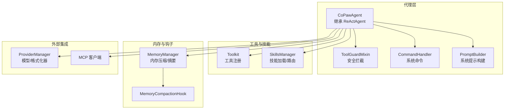
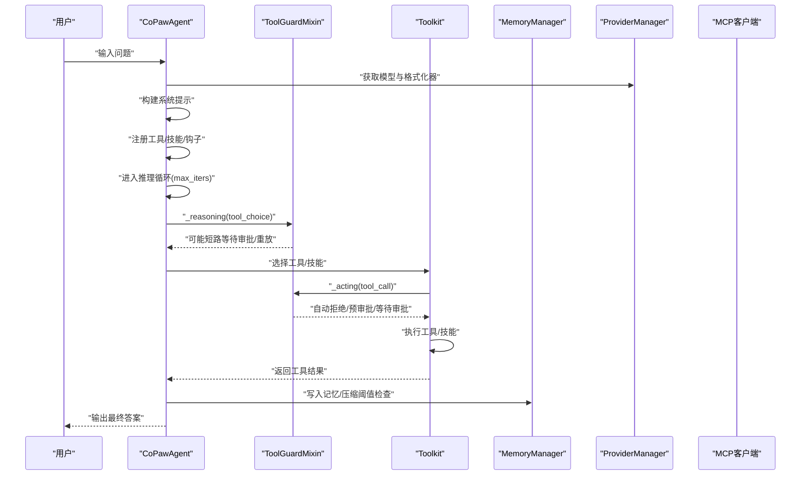
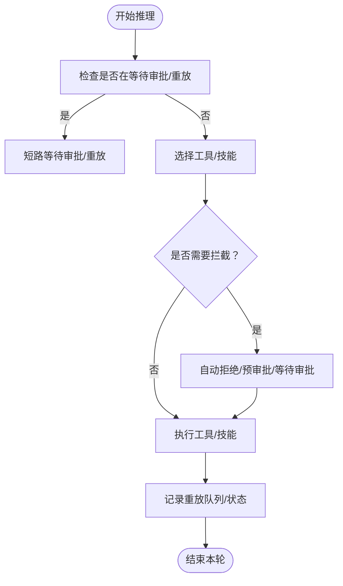
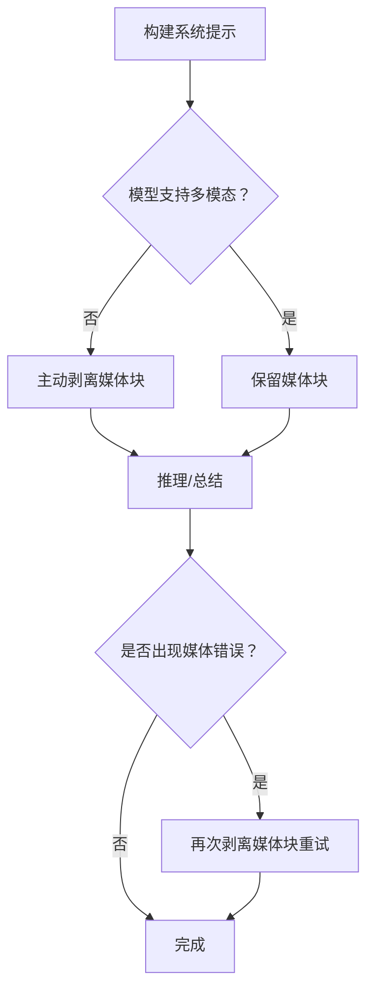
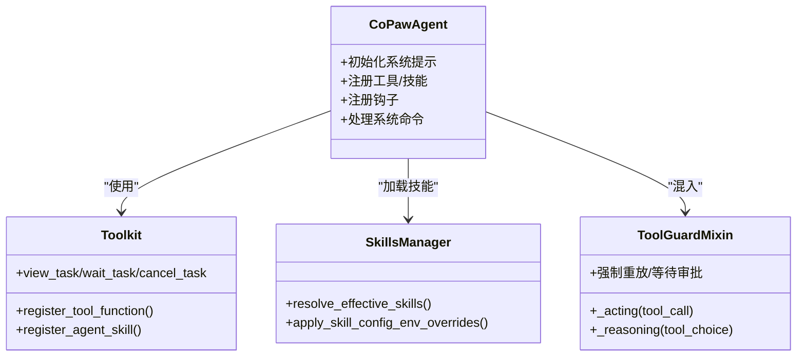
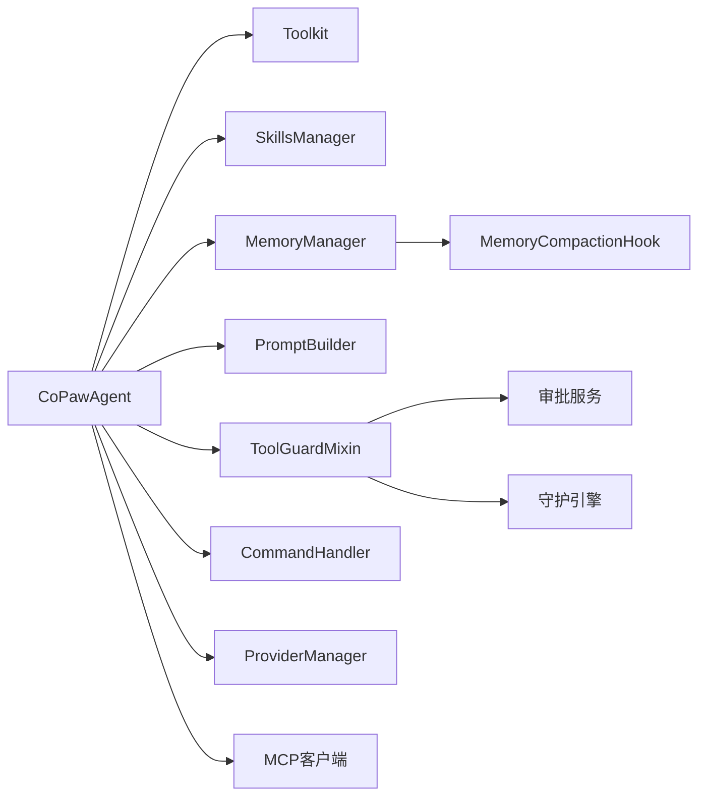

# ReAct 代理实现

<cite>
**本文引用的文件**
- [react_agent.py](file://src/copaw/agents/react_agent.py)
- [prompt.py](file://src/copaw/agents/prompt.py)
- [tool_guard_mixin.py](file://src/copaw/agents/tool_guard_mixin.py)
- [memory_compaction.py](file://src/copaw/agents/hooks/memory_compaction.py)
- [command_handler.py](file://src/copaw/agents/command_handler.py)
- [__init__.py](file://src/copaw/agents/tools/__init__.py)
- [skills_manager.py](file://src/copaw/agents/skills_manager.py)
- [agent.json](file://working/workspaces/default/agent.json)
- [schema.py](file://src/copaw/agents/schema.py)
</cite>

## 目录
1. [引言](#引言)
2. [项目结构](#项目结构)
3. [核心组件](#核心组件)
4. [架构总览](#架构总览)
5. [详细组件分析](#详细组件分析)
6. [依赖分析](#依赖分析)
7. [性能考虑](#性能考虑)
8. [故障排查指南](#故障排查指南)
9. [结论](#结论)
10. [附录](#附录)

## 引言
本文件面向 ReAct 代理在 CoPaw 中的实现，系统化阐述其在真实工程中的落地方式与扩展点。重点覆盖：
- 推理-行动循环的设计原理与实现细节
- 用户输入解析、思考过程生成、工具选择与执行、结果评估与回放
- 提示词工程与上下文管理策略
- 工具调用序列与并发控制
- 安全拦截与审批流程
- 可扩展性与自定义能力

## 项目结构
CoPaw 将 ReAct 框架与工具、技能、内存、安全等模块整合，形成“智能体即服务”的可配置代理。关键目录与职责如下：
- agents：ReAct 代理主类、工具、技能、提示词构建、命令处理、钩子
- agents/tools：内置工具集合（文件、搜索、浏览器、截图、时间、令牌用量等）
- agents/hooks：内存压缩、引导等钩子
- agents/utils：消息与媒体块处理等辅助
- working/workspaces/default：默认工作空间配置与技能清单
- console/src/pages/Agent/...：前端配置界面（语言、时区、运行参数等）

图表来源
- [react_agent.py:69-182](file://src/copaw/agents/react_agent.py#L69-L182)
- [tool_guard_mixin.py:45-800](file://src/copaw/agents/tool_guard_mixin.py#L45-L800)
- [prompt.py:41-181](file://src/copaw/agents/prompt.py#L41-L181)
- [memory_compaction.py:27-214](file://src/copaw/agents/hooks/memory_compaction.py#L27-L214)
- [command_handler.py:62-530](file://src/copaw/agents/command_handler.py#L62-L530)
- [__init__.py:1-48](file://src/copaw/agents/tools/__init__.py#L1-L48)
- [skills_manager.py:131-148](file://src/copaw/agents/skills_manager.py#L131-L148)

章节来源
- [react_agent.py:1-182](file://src/copaw/agents/react_agent.py#L1-L182)
- [prompt.py:1-264](file://src/copaw/agents/prompt.py#L1-L264)
- [memory_compaction.py:1-214](file://src/copaw/agents/hooks/memory_compaction.py#L1-L214)
- [command_handler.py:1-530](file://src/copaw/agents/command_handler.py#L1-L530)
- [__init__.py:1-48](file://src/copaw/agents/tools/__init__.py#L1-L48)
- [skills_manager.py:1-200](file://src/copaw/agents/skills_manager.py#L1-L200)

## 核心组件
- CoPawAgent：基于 ReActAgent 的增强型代理，负责系统提示构建、工具注册、技能加载、内存管理、命令处理与钩子注册。
- ToolGuardMixin：在推理与行动阶段插入安全拦截，支持自动拒绝、预审批、等待审批与强制重放。
- PromptBuilder：从工作空间的 AGENTS.md/SOUL.md/PROFILE.md 构建系统提示，支持心跳段落过滤与多模态提示注入。
- MemoryCompactionHook：在推理前检查上下文长度，按阈值触发内存压缩与摘要任务。
- CommandHandler：处理 /compact、/new、/clear、/history 等系统命令。
- Toolkit：统一注册内置工具与技能，支持异步任务管理工具的自动挂载。
- SkillsManager：解析工作空间技能目录，动态加载技能并进行环境变量注入与冲突处理。

章节来源
- [react_agent.py:69-182](file://src/copaw/agents/react_agent.py#L69-L182)
- [tool_guard_mixin.py:45-800](file://src/copaw/agents/tool_guard_mixin.py#L45-L800)
- [prompt.py:41-264](file://src/copaw/agents/prompt.py#L41-L264)
- [memory_compaction.py:27-214](file://src/copaw/agents/hooks/memory_compaction.py#L27-L214)
- [command_handler.py:62-530](file://src/copaw/agents/command_handler.py#L62-L530)
- [__init__.py:1-48](file://src/copaw/agents/tools/__init__.py#L1-L48)
- [skills_manager.py:131-148](file://src/copaw/agents/skills_manager.py#L131-L148)

## 架构总览
ReAct 在 CoPaw 中通过“推理-行动-反思”闭环实现，结合安全拦截与上下文压缩，确保在复杂任务场景下的可控性与稳定性。

图表来源
- [react_agent.py:143-182](file://src/copaw/agents/react_agent.py#L143-L182)
- [tool_guard_mixin.py:261-314](file://src/copaw/agents/tool_guard_mixin.py#L261-L314)
- [memory_compaction.py:62-214](file://src/copaw/agents/hooks/memory_compaction.py#L62-L214)

## 详细组件分析

### 推理-行动循环与安全拦截
- 推理阶段：CoPawAgent 覆盖 _reasoning 以支持多模态媒体块主动剥离与被动回退；同时 ToolGuardMixin 在推理前短路等待审批或强制重放。
- 行动阶段：ToolGuardMixin 在 _acting 中拦截敏感工具调用，执行自动拒绝、预审批消费、或进入审批队列；成功后执行工具并记录重放状态。
- 重放机制：当审批通过后，系统会发出“强制重放”的工具调用链，确保对话历史干净且审批痕迹不污染。

图表来源
- [tool_guard_mixin.py:621-774](file://src/copaw/agents/tool_guard_mixin.py#L621-L774)

章节来源
- [tool_guard_mixin.py:261-774](file://src/copaw/agents/tool_guard_mixin.py#L261-L774)
- [react_agent.py:665-775](file://src/copaw/agents/react_agent.py#L665-L775)

### 提示词工程与上下文管理
- 系统提示构建：PromptBuilder 从工作空间读取 AGENTS.md/SOUL.md/PROFILE.md，移除未启用的心跳段落，注入多模态能力提示与环境上下文。
- 多模态适配：当模型不支持多模态时，推理/总结阶段会主动剥离媒体块并回退重试；若模型标记为多模态但仍拒绝媒体，记录警告。
- 上下文压缩：MemoryCompactionHook 在推理前估算上下文长度，超过阈值则触发压缩与摘要任务，保留最近消息与系统提示。

图表来源
- [prompt.py:183-264](file://src/copaw/agents/prompt.py#L183-L264)
- [react_agent.py:665-775](file://src/copaw/agents/react_agent.py#L665-L775)
- [memory_compaction.py:62-214](file://src/copaw/agents/hooks/memory_compaction.py#L62-L214)

章节来源
- [prompt.py:183-264](file://src/copaw/agents/prompt.py#L183-L264)
- [react_agent.py:665-775](file://src/copaw/agents/react_agent.py#L665-L775)
- [memory_compaction.py:62-214](file://src/copaw/agents/hooks/memory_compaction.py#L62-L214)

### 工具与技能注册与调用
- 工具注册：CoPawAgent 基于 agent.json 的 tools.builtin_tools 配置，按启用状态与多模态能力筛选注册内置工具；若存在异步工具，则自动注册后台任务管理工具。
- 技能加载：从工作空间 skills 目录解析有效技能，按通道路由规则注册为工具函数；支持环境变量注入与签名校验。
- 工具调用：Toolkit 统一调度，支持并行工具调用与重放队列；ToolGuardMixin 在拦截后通过“强制重放”保证对话历史整洁。

图表来源
- [react_agent.py:183-341](file://src/copaw/agents/react_agent.py#L183-L341)
- [__init__.py:1-48](file://src/copaw/agents/tools/__init__.py#L1-L48)
- [skills_manager.py:682-711](file://src/copaw/agents/skills_manager.py#L682-L711)
- [tool_guard_mixin.py:261-314](file://src/copaw/agents/tool_guard_mixin.py#L261-L314)

章节来源
- [react_agent.py:183-341](file://src/copaw/agents/react_agent.py#L183-L341)
- [__init__.py:1-48](file://src/copaw/agents/tools/__init__.py#L1-L48)
- [skills_manager.py:682-711](file://src/copaw/agents/skills_manager.py#L682-L711)
- [tool_guard_mixin.py:261-314](file://src/copaw/agents/tool_guard_mixin.py#L261-L314)

### 系统命令与上下文维护
- 支持命令：/compact、/new、/clear、/history、/compact_str、/await_summary、/message、/dump_history、/load_history、/long_term_memory。
- 交互体验：命令处理器根据当前内存状态与配置生成响应消息，必要时启动后台摘要任务。

章节来源
- [command_handler.py:62-530](file://src/copaw/agents/command_handler.py#L62-L530)

### 数据模型与消息结构
- 文件块类型：用于向用户发送文件的结构定义，包含类型、来源与文件名等字段。

章节来源
- [schema.py:11-22](file://src/copaw/agents/schema.py#L11-L22)

## 依赖分析
- 组件耦合
  - CoPawAgent 依赖 Toolkit、SkillsManager、MemoryManager、PromptBuilder、ToolGuardMixin、CommandHandler。
  - ToolGuardMixin 依赖审批服务与守护引擎，通过锁保证并行工具调用时的状态一致性。
  - MemoryCompactionHook 依赖 MemoryManager 与配置，按阈值触发压缩与摘要。
- 外部依赖
  - ProviderManager：提供模型与格式化器工厂方法。
  - MCP 客户端：通过 register_mcp_client 注册远程工具。
  - 前端配置：通过 agent.json 控制语言、时区、运行参数、工具开关与安全策略。

图表来源
- [react_agent.py:143-182](file://src/copaw/agents/react_agent.py#L143-L182)
- [tool_guard_mixin.py:57-70](file://src/copaw/agents/tool_guard_mixin.py#L57-L70)
- [memory_compaction.py:27-42](file://src/copaw/agents/hooks/memory_compaction.py#L27-L42)

章节来源
- [react_agent.py:143-182](file://src/copaw/agents/react_agent.py#L143-L182)
- [tool_guard_mixin.py:57-70](file://src/copaw/agents/tool_guard_mixin.py#L57-L70)
- [memory_compaction.py:27-42](file://src/copaw/agents/hooks/memory_compaction.py#L27-L42)

## 性能考虑
- 并发与锁：ToolGuardMixin 使用 asyncio.Lock 保护拦截决策，实际工具执行在锁外并行，兼顾安全性与吞吐。
- 上下文压缩：MemoryCompactionHook 在推理前估算上下文长度，避免超出模型上下文窗口；支持后台摘要任务，减少阻塞。
- 工具异步：内置工具可通过 async_execution 开启后台任务管理工具，提升长耗时操作的用户体验。
- 多模态优化：在模型不支持多模态时主动剥离媒体块，减少无效请求与错误重试。

## 故障排查指南
- 媒体块导致的推理失败
  - 现象：模型报错或拒绝媒体内容
  - 处理：系统会主动剥离媒体块并重试；若模型标记为多模态仍拒绝，记录警告
  - 参考路径：[react_agent.py:665-775](file://src/copaw/agents/react_agent.py#L665-L775)
- 审批等待与重放
  - 现象：出现“等待审批/批准”提示
  - 处理：使用 /approve 批准或发送任意消息拒绝；审批完成后系统会强制重放剩余工具调用
  - 参考路径：[tool_guard_mixin.py:497-616](file://src/copaw/agents/tool_guard_mixin.py#L497-L616)
- 内存上下文溢出
  - 现象：上下文超限导致压缩触发
  - 处理：使用 /compact 或 /new 清理历史；必要时调整运行参数
  - 参考路径：[memory_compaction.py:62-214](file://src/copaw/agents/hooks/memory_compaction.py#L62-L214)
- 工具不可用或被禁用
  - 现象：工具未出现在可用列表
  - 处理：检查 agent.json 中 tools.builtin_tools 的 enabled 与 async_execution 配置
  - 参考路径：[agent.json:323-438](file://working/workspaces/default/agent.json#L323-L438)

章节来源
- [react_agent.py:665-775](file://src/copaw/agents/react_agent.py#L665-L775)
- [tool_guard_mixin.py:497-616](file://src/copaw/agents/tool_guard_mixin.py#L497-L616)
- [memory_compaction.py:62-214](file://src/copaw/agents/hooks/memory_compaction.py#L62-L214)
- [agent.json:323-438](file://working/workspaces/default/agent.json#L323-L438)

## 结论
CoPaw 的 ReAct 代理通过“系统提示工程 + 工具/技能注册 + 安全拦截 + 上下文压缩 + 命令维护”的完整链路，实现了可控、可观测、可扩展的智能体行为。其设计既满足通用推理-行动循环，又针对企业级需求提供了安全与可运维性保障。开发者可在此基础上灵活扩展工具与技能，定制提示词与上下文策略，并通过配置文件与前端界面实现快速迭代。

## 附录
- 代码示例路径（仅列出路径，不展示具体代码）
  - 推理-行动拦截与重放：[tool_guard_mixin.py:261-774](file://src/copaw/agents/tool_guard_mixin.py#L261-L774)
  - 系统提示构建与多模态注入：[prompt.py:183-264](file://src/copaw/agents/prompt.py#L183-L264)
  - 工具注册与异步任务管理：[react_agent.py:183-304](file://src/copaw/agents/react_agent.py#L183-L304)
  - 技能加载与环境变量注入：[skills_manager.py:667-711](file://src/copaw/agents/skills_manager.py#L667-L711)
  - 内存压缩与摘要任务：[memory_compaction.py:62-214](file://src/copaw/agents/hooks/memory_compaction.py#L62-L214)
  - 系统命令处理：[command_handler.py:499-530](file://src/copaw/agents/command_handler.py#L499-L530)
  - 文件块数据模型：[schema.py:11-22](file://src/copaw/agents/schema.py#L11-L22)