# 代理引擎

<cite>
**本文引用的文件**
- [react_agent.py](file://src/copaw/agents/react_agent.py)
- [command_handler.py](file://src/copaw/agents/command_handler.py)
- [multi_agent_manager.py](file://src/copaw/app/multi_agent_manager.py)
- [skills_manager.py](file://src/copaw/agents/skills_manager.py)
- [tool_guard_mixin.py](file://src/copaw/agents/tool_guard_mixin.py)
- [base_memory_manager.py](file://src/copaw/agents/memory/base_memory_manager.py)
- [workspace.py](file://src/copaw/app/workspace/workspace.py)
- [bootstrap.py](file://src/copaw/agents/hooks/bootstrap.py)
- [memory_compaction.py](file://src/copaw/agents/hooks/memory_compaction.py)
- [model_factory.py](file://src/copaw/agents/model_factory.py)
</cite>

## 目录
1. [引言](#引言)
2. [项目结构](#项目结构)
3. [核心组件](#核心组件)
4. [架构总览](#架构总览)
5. [详细组件分析](#详细组件分析)
6. [依赖分析](#依赖分析)
7. [性能考虑](#性能考虑)
8. [故障排查指南](#故障排查指南)
9. [结论](#结论)
10. [附录](#附录)

## 引言
本文件面向 CoPaw 代理引擎，系统化阐述其高层设计、ReAct 框架实现、多代理协作机制，以及代理生命周期管理、内存管理、命令处理系统的工作原理。文档还覆盖代理与技能系统、工具系统的交互模式，代理配置管理与热重载机制、异步处理能力，并提供架构图与数据流图，最后总结状态管理、错误处理与性能优化策略。

## 项目结构
CoPaw 将“单代理”能力以“工作空间（Workspace）”的形式组合为“多代理”运行时，每个 Workspace 独立封装 Runner、通道管理、内存管理、MCP 客户端、定时任务等组件。多代理管理器（MultiAgentManager）负责懒加载、零停机热重载与生命周期管理。

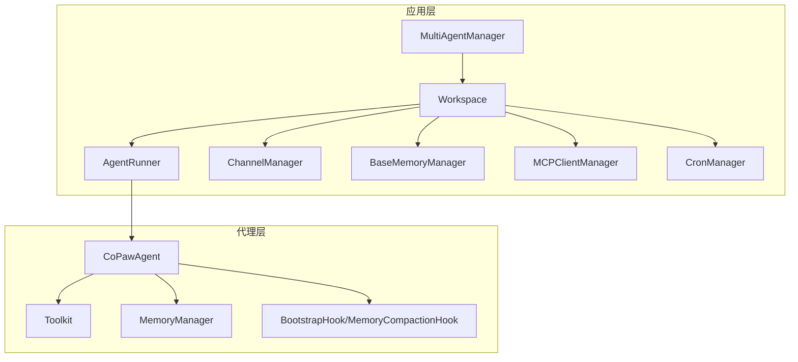

图表来源
- [multi_agent_manager.py:21-370](file://src/copaw/app/multi_agent_manager.py#L21-L370)
- [workspace.py:50-392](file://src/copaw/app/workspace/workspace.py#L50-L392)
- [react_agent.py:69-182](file://src/copaw/agents/react_agent.py#L69-L182)

章节来源
- [multi_agent_manager.py:21-370](file://src/copaw/app/multi_agent_manager.py#L21-L370)
- [workspace.py:50-392](file://src/copaw/app/workspace/workspace.py#L50-L392)

## 核心组件
- CoPawAgent：基于 ReActAgent 的主代理，集成工具、技能、内存管理、引导钩子与工具守卫拦截。
- CommandHandler：系统命令处理器，支持紧凑、新建会话、清空历史、查看历史、等待摘要完成、导出/导入历史、长程记忆展示等。
- MultiAgentManager：多代理管理器，提供懒加载、零停机热重载、并发启动、后台清理任务管理。
- SkillsManager：技能注册与清单管理，支持内置技能、工作区技能、池化技能、环境变量注入、冲突检测与签名校验。
- BaseMemoryManager：内存管理抽象，定义紧凑、摘要、搜索、异步摘要任务等接口。
- ToolGuardMixin：工具调用拦截与审批流程，支持预批准、守护规则、并行工具调用下的串行决策。
- Workspace：单代理工作空间，统一装配 Runner、Channel、Memory、MCP、Cron 等服务。
- Hooks：BootstrapHook（首次交互引导）、MemoryCompactionHook（上下文紧凑）。
- ModelFactory：模型与格式化工厂，统一创建 ChatModel 与 Formatter，支持重试、限流、令牌统计包装。

章节来源
- [react_agent.py:69-182](file://src/copaw/agents/react_agent.py#L69-L182)
- [command_handler.py:62-530](file://src/copaw/agents/command_handler.py#L62-L530)
- [multi_agent_manager.py:21-370](file://src/copaw/app/multi_agent_manager.py#L21-L370)
- [skills_manager.py:1-200](file://src/copaw/agents/skills_manager.py#L1-L200)
- [base_memory_manager.py:21-226](file://src/copaw/agents/memory/base_memory_manager.py#L21-L226)
- [tool_guard_mixin.py:45-800](file://src/copaw/agents/tool_guard_mixin.py#L45-L800)
- [workspace.py:50-392](file://src/copaw/app/workspace/workspace.py#L50-L392)
- [bootstrap.py:20-104](file://src/copaw/agents/hooks/bootstrap.py#L20-L104)
- [memory_compaction.py:27-214](file://src/copaw/agents/hooks/memory_compaction.py#L27-L214)
- [model_factory.py:698-800](file://src/copaw/agents/model_factory.py#L698-L800)

## 架构总览
下图展示从请求进入 Workspace 到代理执行、工具调用、内存管理与 MCP 客户端的完整数据流。

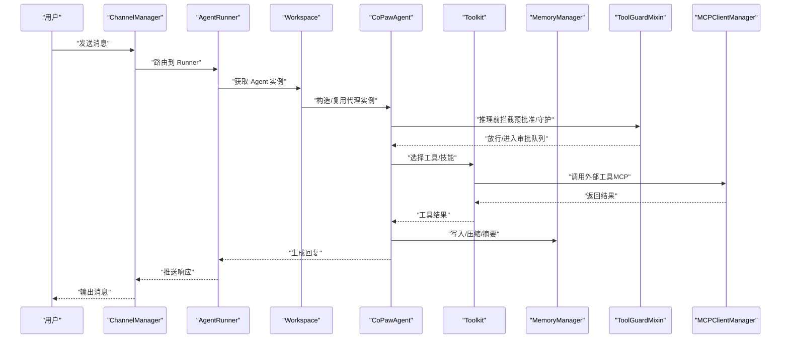

图表来源
- [workspace.py:325-392](file://src/copaw/app/workspace/workspace.py#L325-L392)
- [react_agent.py:665-775](file://src/copaw/agents/react_agent.py#L665-L775)
- [tool_guard_mixin.py:261-314](file://src/copaw/agents/tool_guard_mixin.py#L261-L314)
- [command_handler.py:499-530](file://src/copaw/agents/command_handler.py#L499-L530)

## 详细组件分析

### CoPawAgent：ReAct 代理与工具/技能/内存集成
- 初始化阶段：构建系统提示、创建模型与格式化器、注册内置工具与技能、初始化内存管理与命令处理器、注册引导与紧凑钩子。
- 工具注册：根据配置启用/禁用内置工具；支持异步工具的任务管理工具自动注册；按策略处理命名冲突。
- 技能注册：从工作区解析有效技能集合，按通道过滤后注册到 Toolkit。
- 内存管理：可选启用内存管理器，动态注入“内存检索”工具；在推理前后进行媒体块过滤与被动回退。
- MCP 集成：延迟注册 MCP 客户端，支持断线恢复与重建，保证会话稳定性。
- 命令处理：通过 CommandHandler 支持 /compact、/new、/clear、/history、/await_summary、/message、/dump_history、/load_history、/long_term_memory 等。

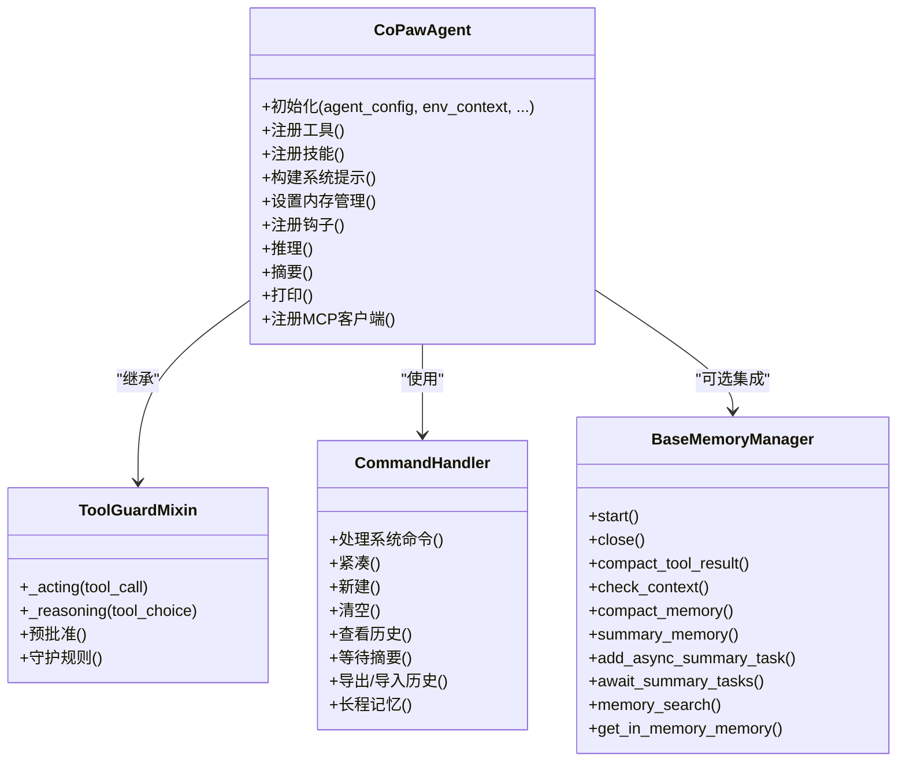

图表来源
- [react_agent.py:69-182](file://src/copaw/agents/react_agent.py#L69-L182)
- [tool_guard_mixin.py:45-800](file://src/copaw/agents/tool_guard_mixin.py#L45-L800)
- [command_handler.py:62-530](file://src/copaw/agents/command_handler.py#L62-L530)
- [base_memory_manager.py:21-226](file://src/copaw/agents/memory/base_memory_manager.py#L21-L226)

章节来源
- [react_agent.py:69-182](file://src/copaw/agents/react_agent.py#L69-L182)
- [tool_guard_mixin.py:261-314](file://src/copaw/agents/tool_guard_mixin.py#L261-L314)
- [command_handler.py:116-218](file://src/copaw/agents/command_handler.py#L116-L218)

### 多代理协作与热重载：MultiAgentManager
- 懒加载：首次访问才创建 Workspace 并启动。
- 零停机热重载：先创建新实例并启动，原子替换旧实例，再优雅停止旧实例（若存在活动任务则延后清理）。
- 并发启动：批量启动已启用的代理，失败不影响其他代理。
- 资源回收：统一取消待执行清理任务，确保关闭时无孤儿实例。

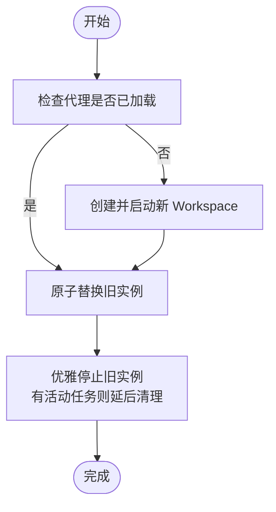

图表来源
- [multi_agent_manager.py:208-318](file://src/copaw/app/multi_agent_manager.py#L208-L318)

章节来源
- [multi_agent_manager.py:21-370](file://src/copaw/app/multi_agent_manager.py#L21-L370)

### 技能系统：注册、清单与环境注入
- 渠道路由：内置渠道白名单，按渠道筛选有效技能。
- 清单与签名：维护工作区与池化技能清单，计算内容签名用于冲突检测与同步。
- 环境注入：按技能声明的 require_envs 注入环境变量，支持 JSON 全量配置变量。
- 安全扫描：导入/保存时进行安全扫描，防止危险内容进入工作区。

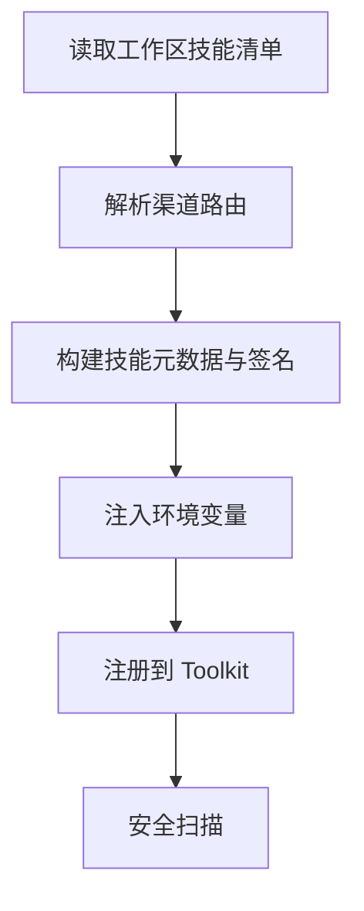

图表来源
- [skills_manager.py:47-168](file://src/copaw/agents/skills_manager.py#L47-L168)
- [skills_manager.py:667-711](file://src/copaw/agents/skills_manager.py#L667-L711)

章节来源
- [skills_manager.py:1-200](file://src/copaw/agents/skills_manager.py#L1-L200)
- [skills_manager.py:667-711](file://src/copaw/agents/skills_manager.py#L667-L711)

### 内存管理：紧凑、摘要与异步任务
- 接口抽象：定义紧凑工具结果、上下文检查、紧凑记忆、摘要记忆、异步摘要任务、内存检索、获取内存对象等。
- 后台摘要：添加摘要任务并清理已完成任务，等待所有摘要任务完成后返回汇总信息。
- 工作区集成：Workspace 在启动时按配置选择内存后端类并注入 Runner。

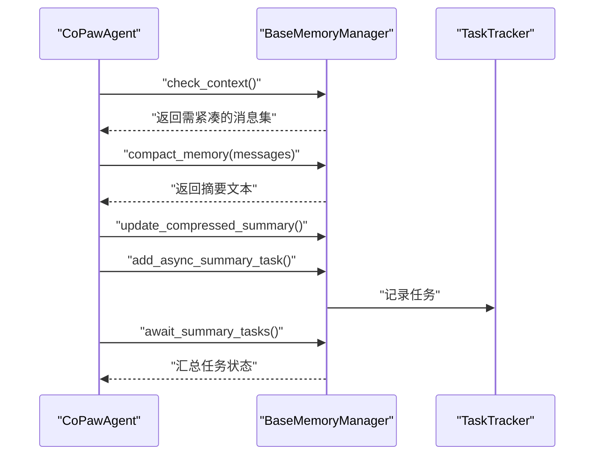

图表来源
- [base_memory_manager.py:84-196](file://src/copaw/agents/memory/base_memory_manager.py#L84-L196)
- [workspace.py:172-194](file://src/copaw/app/workspace/workspace.py#L172-L194)

章节来源
- [base_memory_manager.py:21-226](file://src/copaw/agents/memory/base_memory_manager.py#L21-L226)
- [workspace.py:172-194](file://src/copaw/app/workspace/workspace.py#L172-L194)

### 工具守卫与审批：安全拦截与并行工具调用
- 决策流程：deny 列表直接拒绝；受保护工具先尝试一次性预批准，否则运行守护规则；发现风险则进入审批队列。
- 并发安全：决策在锁内完成，实际执行在锁外以保持并行工具调用的吞吐。
- 追加回放：强制回放队列与兄弟工具调用队列，确保审批后顺序执行且不遗留痕迹。

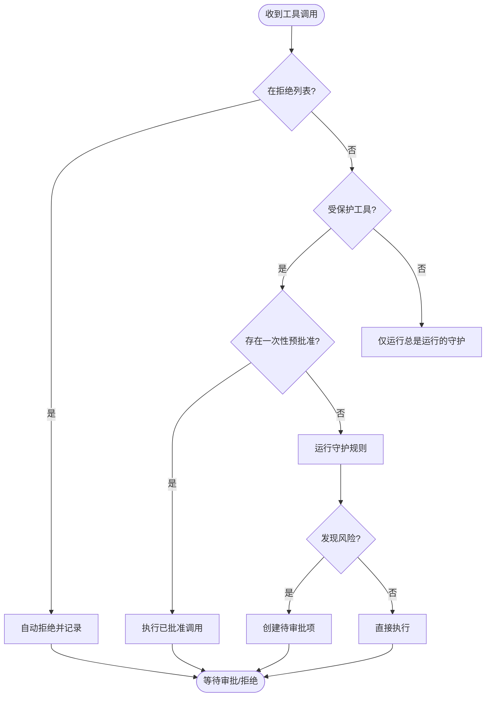

图表来源
- [tool_guard_mixin.py:316-396](file://src/copaw/agents/tool_guard_mixin.py#L316-L396)
- [tool_guard_mixin.py:497-615](file://src/copaw/agents/tool_guard_mixin.py#L497-L615)

章节来源
- [tool_guard_mixin.py:261-314](file://src/copaw/agents/tool_guard_mixin.py#L261-L314)
- [tool_guard_mixin.py:316-396](file://src/copaw/agents/tool_guard_mixin.py#L316-L396)

### 命令处理系统：系统命令与调试辅助
- 命令识别：以“/”开头的命令，支持 compact/new/clear/history/await_summary/message/dump_history/load_history/long_term_memory。
- 功能实现：紧凑对话历史、新建会话并后台摘要、清空历史、显示历史与索引、等待摘要完成、导出/导入历史、展示长程记忆。
- 热重载配置：通过 CommandHandler 获取当前代理配置，实现命令级热重载。

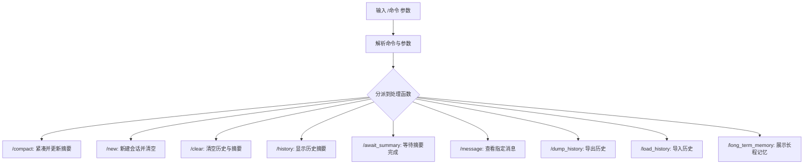

图表来源
- [command_handler.py:499-530](file://src/copaw/agents/command_handler.py#L499-L530)
- [command_handler.py:116-218](file://src/copaw/agents/command_handler.py#L116-L218)

章节来源
- [command_handler.py:62-530](file://src/copaw/agents/command_handler.py#L62-L530)

### 生命周期与钩子：引导与上下文紧凑
- 引导钩子：首次用户交互时检查 BOOTSTRAP.md，向首条用户消息追加引导内容，并标记完成。
- 上下文紧凑钩子：在推理前检查 token 阈值，必要时对旧消息进行摘要并保留近期消息与系统提示。

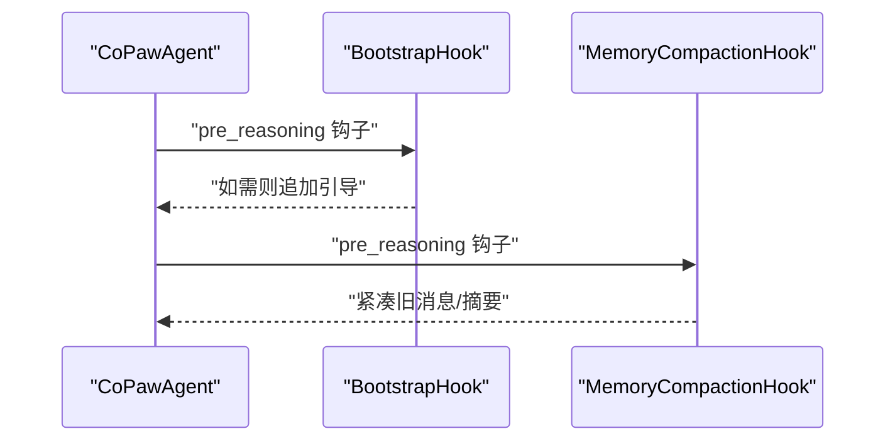

图表来源
- [bootstrap.py:42-104](file://src/copaw/agents/hooks/bootstrap.py#L42-L104)
- [memory_compaction.py:62-214](file://src/copaw/agents/hooks/memory_compaction.py#L62-L214)

章节来源
- [bootstrap.py:20-104](file://src/copaw/agents/hooks/bootstrap.py#L20-L104)
- [memory_compaction.py:27-214](file://src/copaw/agents/hooks/memory_compaction.py#L27-L214)

### 模型工厂：统一模型与格式化器
- 统一入口：根据代理配置或全局配置创建 ChatModel 与 Formatter，支持 OpenAI、Anthropic、Gemini 等。
- 增强格式化：支持文件块、视频占位符替换、思考块保留、工具结果提升等。
- 包装增强：令牌统计包装、重试与限流配置。

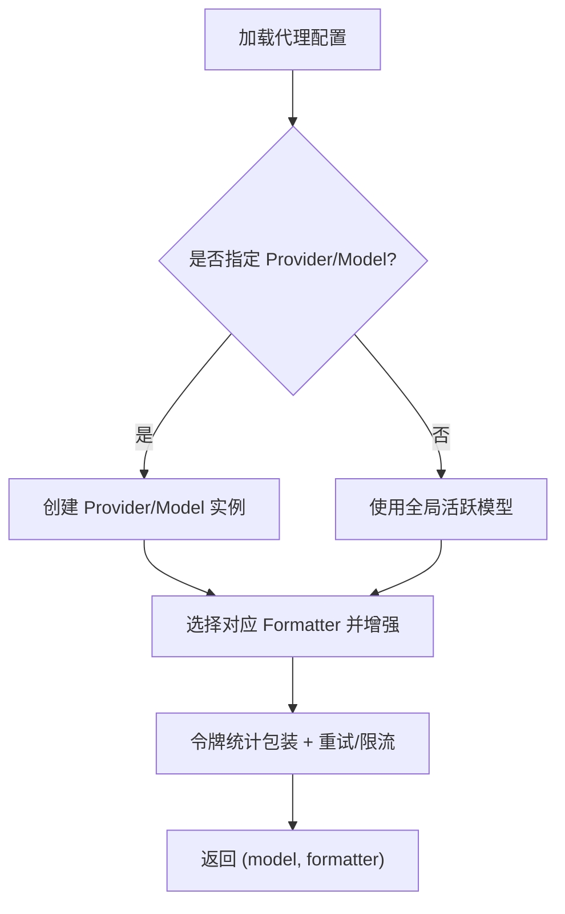

图表来源
- [model_factory.py:698-800](file://src/copaw/agents/model_factory.py#L698-L800)

章节来源
- [model_factory.py:698-800](file://src/copaw/agents/model_factory.py#L698-L800)

## 依赖分析
- 组件耦合：CoPawAgent 与 ToolGuardMixin 通过 MRO 组合，确保拦截逻辑贯穿推理与行动；CommandHandler 与 MemoryManager 解耦，通过 Workspace 注入。
- 外部依赖：AgentScope 的 ReActAgent、Toolkit、Msg；ProviderManager 提供模型与限流；MCP 客户端通过管理器统一接入。
- 循环依赖：未见直接循环；Workspace 通过 ServiceManager 管理服务，避免循环引用。

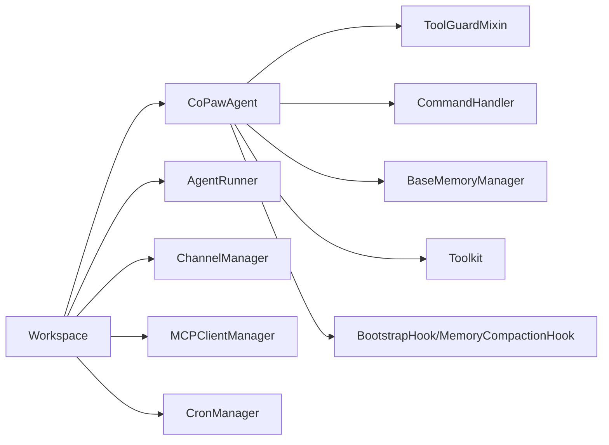

图表来源
- [react_agent.py:69-182](file://src/copaw/agents/react_agent.py#L69-L182)
- [workspace.py:145-291](file://src/copaw/app/workspace/workspace.py#L145-L291)

章节来源
- [react_agent.py:69-182](file://src/copaw/agents/react_agent.py#L69-L182)
- [workspace.py:145-291](file://src/copaw/app/workspace/workspace.py#L145-L291)

## 性能考虑
- 异步摘要：内存管理器后台异步摘要，避免阻塞主线推理。
- 并行工具：工具守卫在锁内做决策，在锁外执行工具以保持并行度。
- 媒体块过滤：主动/被动双层过滤减少无效请求与重试成本。
- 零停机热重载：最小化锁持有时间，后台清理旧实例，保障高可用。
- 令牌计数与阈值：钩子在推理前评估上下文，提前紧凑降低超限概率。

## 故障排查指南
- 工具被拦截：检查 ToolGuard 审批队列与守护规则；确认是否存在一次性预批准；查看 denied 标记消息并清理。
- 模型多媒体错误：当模型不支持多媒体时，代理会主动剥离媒体块并重试；若仍失败，检查能力标注与媒体类型。
- 历史导出/导入失败：确认历史文件路径与权限；检查最大加载数量限制；查看日志异常堆栈。
- 内存摘要任务异常：使用 /await_summary 查看任务状态；检查任务异常并清理；必要时使用 /clear 重置上下文。
- MCP 客户端中断：代理具备断线恢复与重建能力；若持续失败，检查客户端配置与网络。

章节来源
- [tool_guard_mixin.py:497-615](file://src/copaw/agents/tool_guard_mixin.py#L497-L615)
- [react_agent.py:665-775](file://src/copaw/agents/react_agent.py#L665-L775)
- [command_handler.py:343-473](file://src/copaw/agents/command_handler.py#L343-L473)
- [base_memory_manager.py:140-196](file://src/copaw/agents/memory/base_memory_manager.py#L140-L196)
- [react_agent.py:468-532](file://src/copaw/agents/react_agent.py#L468-L532)

## 结论
CoPaw 代理引擎以 Workspace 为单位整合多组件，以 MultiAgentManager 实现零停机热重载与并发启动；以 CoPawAgent 为核心，结合工具守卫、技能系统、内存管理与命令处理，形成可扩展、可观测、可热重载的代理运行时。ReAct 框架与钩子机制确保上下文可控，异步与并行策略兼顾吞吐与稳定性。

## 附录
- 关键流程图与类图已在相应章节提供，建议结合源码路径进一步查阅具体实现细节。
- 如需了解特定功能（如 MCP 集成、安全扫描、本地模型下载），请参考对应模块的源文件与注释。