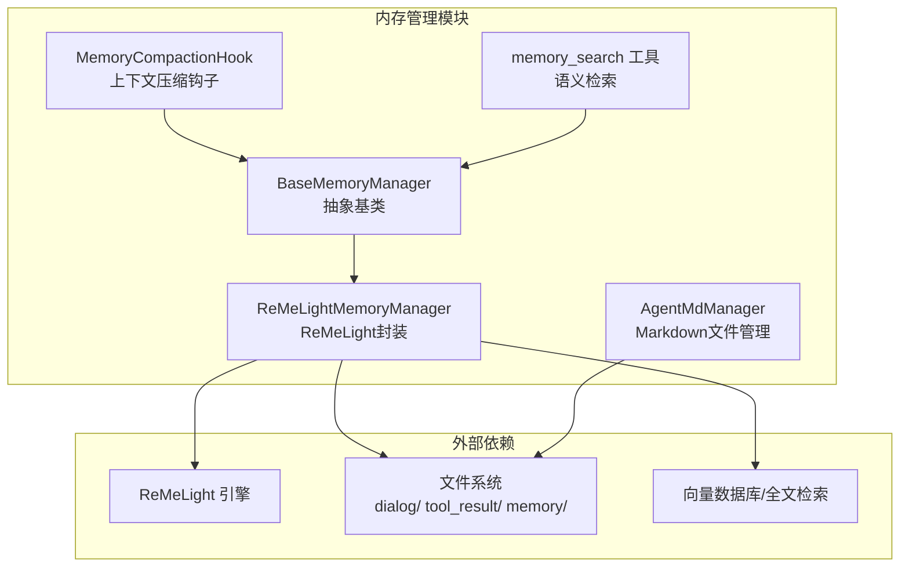
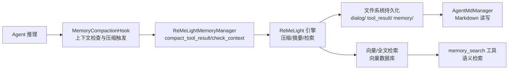
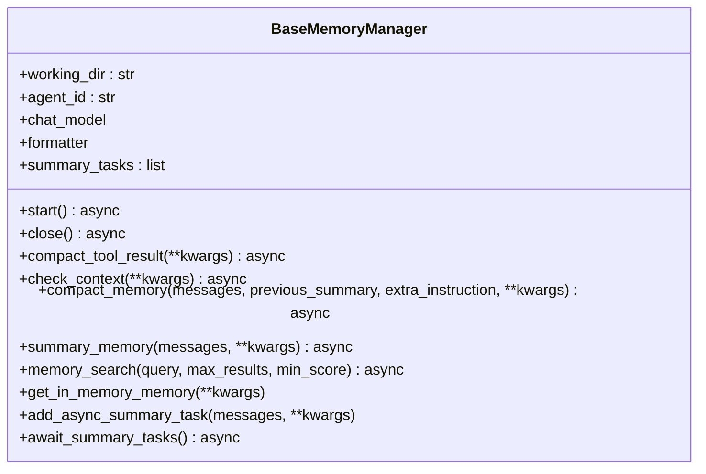
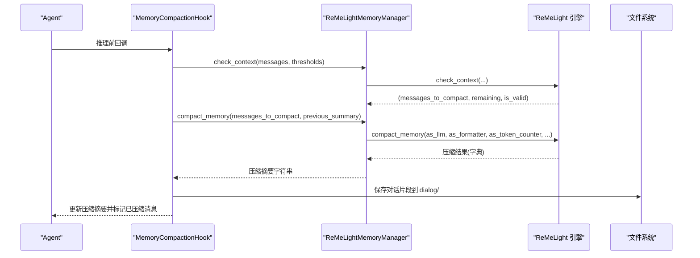
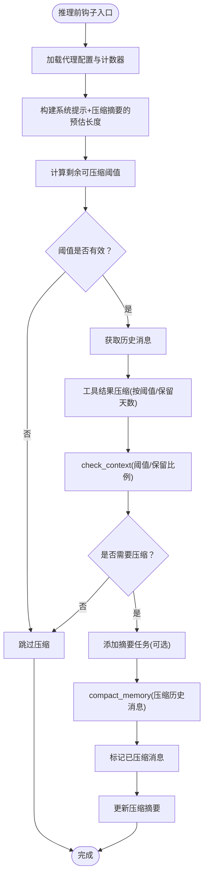
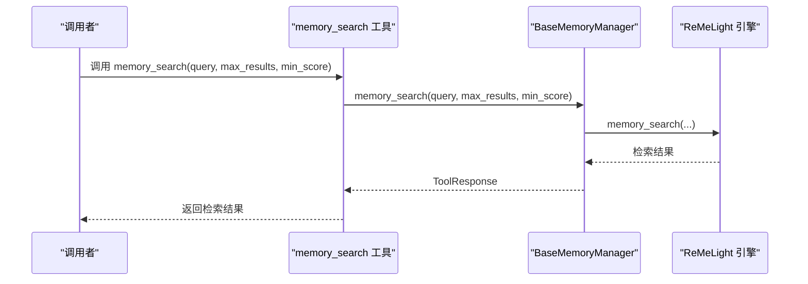
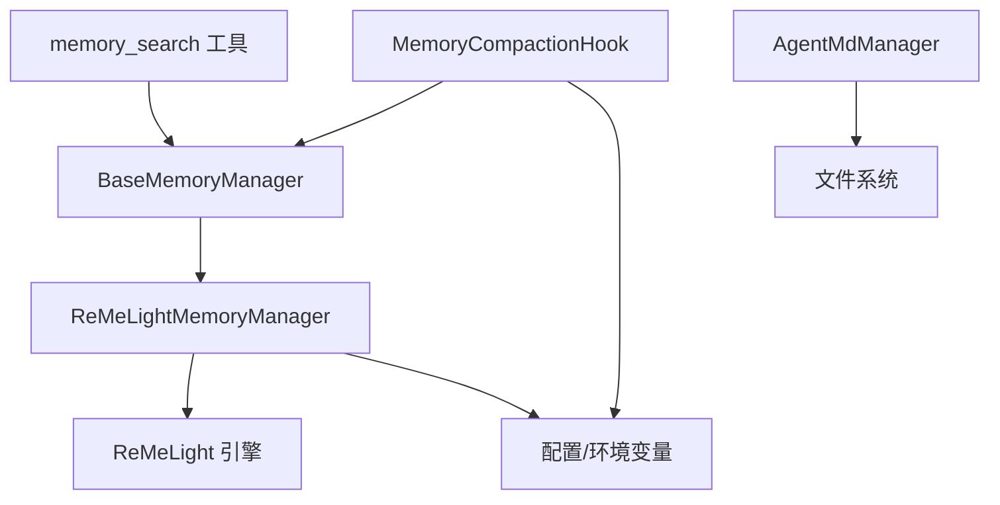

# 内存管理系统

<cite>
**本文引用的文件**
- [base_memory_manager.py](file://src/copaw/agents/memory/base_memory_manager.py)
- [reme_light_memory_manager.py](file://src/copaw/agents/memory/reme_light_memory_manager.py)
- [memory_compaction.py](file://src/copaw/agents/hooks/memory_compaction.py)
- [memory_search.py](file://src/copaw/agents/tools/memory_search.py)
- [agent_md_manager.py](file://src/copaw/agents/memory/agent_md_manager.py)
- [constant.py](file://src/copaw/constant.py)
- [context.en.md](file://website/public/docs/context.en.md)
- [enterprise-storage-migration.md](file://docs/enterprise-storage-migration.md)
</cite>

## 目录
1. [简介](#简介)
2. [项目结构](#项目结构)
3. [核心组件](#核心组件)
4. [架构总览](#架构总览)
5. [详细组件分析](#详细组件分析)
6. [依赖关系分析](#依赖关系分析)
7. [性能考量](#性能考量)
8. [故障排查指南](#故障排查指南)
9. [结论](#结论)
10. [附录](#附录)

## 简介
本技术文档面向内存管理系统，系统采用“代理内存”的多层次架构设计，围绕短期记忆（近期对话）、长期记忆（历史对话与知识文档）、压缩摘要（上下文压缩与总结）三大层次展开。系统通过 ReMeLight 作为核心引擎，结合工具结果压缩、上下文检查与自动压缩、向量与全文检索、文件系统持久化等能力，实现高效、可扩展的记忆管理。本文将深入解析内存压缩算法、内容检索机制、存储优化策略，并给出清理、持久化与恢复的实现细节，以及监控、性能指标与容量管理的最佳实践与调优建议。

## 项目结构
内存管理模块位于 agents/memory 与 agents/hooks、agents/tools 下，配合常量与配置文件共同构成完整的代理内存体系：
- 基类接口：定义统一的内存管理器接口与异步摘要任务管理
- ReMeLight 实现：封装 ReMeLight 引擎，提供启动、关闭、工具结果压缩、上下文检查、压缩与摘要、检索、内存对象获取等能力
- 钩子与工具：在推理前自动触发上下文压缩；提供检索工具函数
- Markdown 管理器：对工作目录与 memory 子目录的 Markdown 文件进行读写与元数据列举
- 常量与配置：提供环境变量加载、默认路径、压缩阈值等运行期参数

图表来源
- [base_memory_manager.py:21-226](file://src/copaw/agents/memory/base_memory_manager.py#L21-L226)
- [reme_light_memory_manager.py:37-391](file://src/copaw/agents/memory/reme_light_memory_manager.py#L37-L391)
- [memory_compaction.py:27-214](file://src/copaw/agents/hooks/memory_compaction.py#L27-L214)
- [memory_search.py:7-70](file://src/copaw/agents/tools/memory_search.py#L7-L70)
- [agent_md_manager.py:10-126](file://src/copaw/agents/memory/agent_md_manager.py#L10-L126)

章节来源
- [base_memory_manager.py:1-226](file://src/copaw/agents/memory/base_memory_manager.py#L1-L226)
- [reme_light_memory_manager.py:1-391](file://src/copaw/agents/memory/reme_light_memory_manager.py#L1-L391)
- [memory_compaction.py:1-214](file://src/copaw/agents/hooks/memory_compaction.py#L1-L214)
- [memory_search.py:1-70](file://src/copaw/agents/tools/memory_search.py#L1-L70)
- [agent_md_manager.py:1-126](file://src/copaw/agents/memory/agent_md_manager.py#L1-L126)

## 核心组件
- 抽象基类 BaseMemoryManager：定义统一接口，包括生命周期（start/close）、工具结果压缩、上下文检查、消息压缩、综合摘要、语义检索、内存对象获取等；内置异步摘要任务队列与清理逻辑
- ReMeLightMemoryManager：以组合方式封装 ReMeLight，负责初始化与版本校验、嵌入模型重启、启动/关闭、委托具体操作到 ReMeLight，并提供工具集（读写编辑文件）用于摘要生成
- MemoryCompactionHook：在推理前根据阈值与保留比例自动触发压缩，保留系统提示与近期消息，压缩历史对话
- memory_search 工具：封装语义检索，返回带路径与片段的工具响应
- AgentMdManager：对工作目录与 memory 子目录的 Markdown 文件进行读写与元数据列举，支撑长期记忆文档化与检索

章节来源
- [base_memory_manager.py:21-226](file://src/copaw/agents/memory/base_memory_manager.py#L21-L226)
- [reme_light_memory_manager.py:37-391](file://src/copaw/agents/memory/reme_light_memory_manager.py#L37-L391)
- [memory_compaction.py:27-214](file://src/copaw/agents/hooks/memory_compaction.py#L27-L214)
- [memory_search.py:7-70](file://src/copaw/agents/tools/memory_search.py#L7-L70)
- [agent_md_manager.py:10-126](file://src/copaw/agents/memory/agent_md_manager.py#L10-L126)

## 架构总览
系统采用“代理内存”三层架构：
- 短期记忆：近期对话消息，保留一定数量与字节阈值，避免被压缩
- 长期记忆：历史对话与知识文档（MEMORY.md、memory/*.md），通过向量与全文检索支撑语义查询
- 压缩摘要：当上下文接近阈值时，将历史消息压缩为结构化摘要，减少 token 使用

图表来源
- [memory_compaction.py:62-214](file://src/copaw/agents/hooks/memory_compaction.py#L62-L214)
- [reme_light_memory_manager.py:219-391](file://src/copaw/agents/memory/reme_light_memory_manager.py#L219-L391)
- [memory_search.py:17-70](file://src/copaw/agents/tools/memory_search.py#L17-L70)
- [agent_md_manager.py:10-126](file://src/copaw/agents/memory/agent_md_manager.py#L10-L126)

## 详细组件分析

### 组件一：BaseMemoryManager 抽象基类
- 职责：定义内存管理器统一接口，确保不同后端可替换
- 关键方法：
  - 生命周期：start/close
  - 工具结果压缩：compact_tool_result
  - 上下文检查：check_context（返回需压缩的消息集合、剩余消息、有效性）
  - 消息压缩：compact_memory（生成压缩摘要）
  - 综合摘要：summary_memory（基于工具集生成长摘要）
  - 语义检索：memory_search（返回工具响应）
  - 内存对象：get_in_memory_memory（带 token 计数支持）
  - 异步摘要任务：add_async_summary_task、await_summary_tasks
- 设计要点：统一接口、异步任务队列、异常处理与日志记录

图表来源
- [base_memory_manager.py:21-226](file://src/copaw/agents/memory/base_memory_manager.py#L21-L226)

章节来源
- [base_memory_manager.py:21-226](file://src/copaw/agents/memory/base_memory_manager.py#L21-L226)

### 组件二：ReMeLightMemoryManager 实现
- 职责：以组合方式封装 ReMeLight，提供启动、关闭、工具结果压缩、上下文检查、压缩与摘要、检索、内存对象获取
- 关键点：
  - 版本校验与警告：安装版本与期望版本不一致时发出告警
  - 嵌入配置优先级：配置文件 > 环境变量 > 默认
  - 后端选择：自动/本地/Chroma，按平台与依赖可用性动态选择
  - 模型与格式化器延迟初始化：首次需要时创建
  - 工具集：注册读写编辑文件工具，用于摘要生成
  - 检索前置校验：未启动时返回错误响应
  - 压缩结果校验：若返回非预期类型或无效，保存诊断文件并记录错误

图表来源
- [memory_compaction.py:62-214](file://src/copaw/agents/hooks/memory_compaction.py#L62-L214)
- [reme_light_memory_manager.py:219-391](file://src/copaw/agents/memory/reme_light_memory_manager.py#L219-L391)

章节来源
- [reme_light_memory_manager.py:37-391](file://src/copaw/agents/memory/reme_light_memory_manager.py#L37-L391)

### 组件三：MemoryCompactionHook 自动压缩钩子
- 职责：在推理前根据阈值与保留比例自动触发压缩，保留系统提示与近期消息，压缩历史对话
- 关键流程：
  - 计算系统提示与压缩摘要的 token 预估，得到剩余可压缩空间
  - 先压缩工具结果（按阈值与保留天数）
  - 调用 check_context 判断是否需要压缩
  - 若需要，异步提交摘要任务并执行压缩
  - 标记已压缩消息并更新压缩摘要

图表来源
- [memory_compaction.py:62-214](file://src/copaw/agents/hooks/memory_compaction.py#L62-L214)

章节来源
- [memory_compaction.py:27-214](file://src/copaw/agents/hooks/memory_compaction.py#L27-L214)

### 组件四：memory_search 语义检索工具
- 职责：封装语义检索，支持设置最大结果数与最小相似度，返回带路径与片段的工具响应
- 错误处理：当内存管理器未启用或检索失败时，返回错误文本

图表来源
- [memory_search.py:17-70](file://src/copaw/agents/tools/memory_search.py#L17-L70)
- [base_memory_manager.py:198-214](file://src/copaw/agents/memory/base_memory_manager.py#L198-L214)

章节来源
- [memory_search.py:1-70](file://src/copaw/agents/tools/memory_search.py#L1-L70)
- [base_memory_manager.py:198-214](file://src/copaw/agents/memory/base_memory_manager.py#L198-L214)

### 组件五：AgentMdManager Markdown 文件管理
- 职责：对工作目录与 memory 子目录的 Markdown 文件进行读写与元数据列举，支撑长期记忆文档化
- 功能：
  - 列举工作目录与 memory 目录下的 Markdown 文件及其元数据
  - 读写工作目录与 memory 目录下的 Markdown 文件

章节来源
- [agent_md_manager.py:10-126](file://src/copaw/agents/memory/agent_md_manager.py#L10-L126)

## 依赖关系分析
- ReMeLightMemoryManager 依赖 ReMeLight 引擎与嵌入配置（来自配置与环境变量）
- MemoryCompactionHook 依赖 BaseMemoryManager 接口与代理配置
- memory_search 工具依赖 BaseMemoryManager 接口
- AgentMdManager 依赖文件系统与编码回退读取工具
- 常量模块提供环境变量加载与默认路径、压缩阈值等

图表来源
- [base_memory_manager.py:21-226](file://src/copaw/agents/memory/base_memory_manager.py#L21-L226)
- [reme_light_memory_manager.py:37-391](file://src/copaw/agents/memory/reme_light_memory_manager.py#L37-L391)
- [memory_compaction.py:27-214](file://src/copaw/agents/hooks/memory_compaction.py#L27-L214)
- [memory_search.py:7-70](file://src/copaw/agents/tools/memory_search.py#L7-L70)
- [agent_md_manager.py:10-126](file://src/copaw/agents/memory/agent_md_manager.py#L10-L126)
- [constant.py:12-200](file://src/copaw/constant.py#L12-L200)

章节来源
- [constant.py:12-200](file://src/copaw/constant.py#L12-L200)

## 性能考量
- 上下文压缩阈值与保留比例
  - 阈值 = max_input_length × memory_compact_ratio
  - 保留 = max_input_length × memory_reserve_ratio
  - 可通过前端配置卡片实时计算并展示阈值
- 工具结果压缩
  - 对较长工具输出进行截断与缓存清理，减少 token 占用
  - 支持近期与旧消息不同的字节阈值与保留天数
- 嵌入与检索
  - 嵌入模型配置优先级：配置 > 环境变量 > 默认
  - 向量与全文检索双通道，提升召回质量
- 异步摘要任务
  - 通过异步任务队列避免阻塞主线推理
  - 提供 await_summary_tasks 在关闭前等待完成

章节来源
- [context.en.md:264-319](file://website/public/docs/context.en.md#L264-L319)
- [reme_light_memory_manager.py:183-202](file://src/copaw/agents/memory/reme_light_memory_manager.py#L183-L202)
- [memory_compaction.py:62-214](file://src/copaw/agents/hooks/memory_compaction.py#L62-L214)
- [base_memory_manager.py:116-196](file://src/copaw/agents/memory/base_memory_manager.py#L116-L196)

## 故障排查指南
- ReMe 版本不匹配
  - 现象：启动时发出版本告警
  - 处理：安装期望版本的 reme-ai 包
- ReMe 未启动导致检索失败
  - 现象：memory_search 返回错误文本
  - 处理：确认 ReMeLightMemoryManager 已启动
- 压缩结果无效或类型异常
  - 现象：压缩返回字符串而非字典，或 is_valid 为 False
  - 处理：保存诊断 JSON 并上报问题
- 压缩阈值过低
  - 现象：系统提示与压缩摘要之和超过阈值
  - 处理：提高阈值或使用 /clear 清空上下文
- 向量后端不可用
  - 现象：导入 chroma 失败，回退到本地后端
  - 处理：升级系统 SQLite 至所需版本或切换后端

章节来源
- [reme_light_memory_manager.py:144-169](file://src/copaw/agents/memory/reme_light_memory_manager.py#L144-L169)
- [reme_light_memory_manager.py:366-380](file://src/copaw/agents/memory/reme_light_memory_manager.py#L366-L380)
- [reme_light_memory_manager.py:300-331](file://src/copaw/agents/memory/reme_light_memory_manager.py#L300-L331)
- [memory_compaction.py:104-113](file://src/copaw/agents/hooks/memory_compaction.py#L104-L113)
- [reme_light_memory_manager.py:70-91](file://src/copaw/agents/memory/reme_light_memory_manager.py#L70-L91)

## 结论
本内存管理系统以 ReMeLight 为核心，结合自动上下文压缩、工具结果截断、结构化摘要与语义检索，形成短期记忆、长期记忆与压缩摘要的多层次架构。通过异步任务、阈值配置与文件系统持久化，系统在保证上下文连续性的同时显著降低 token 使用。企业场景可通过向量搜索兼容层与服务化方案进一步扩展能力与可靠性。

## 附录

### 内存压缩算法与检索机制
- 压缩算法
  - 基于 LLM 的结构化摘要生成，支持思考块与语言参数
  - 压缩比由配置控制，支持额外指令
- 检索机制
  - 向量相似度与全文检索双通道
  - 支持分类过滤与相似度阈值
- 存储优化
  - 对话片段落盘至 dialog/，工具结果落盘至 tool_result/ 并按天清理
  - 长期记忆文档化至 MEMORY.md 与 memory/*.md

章节来源
- [reme_light_memory_manager.py:255-357](file://src/copaw/agents/memory/reme_light_memory_manager.py#L255-L357)
- [memory_search.py:17-70](file://src/copaw/agents/tools/memory_search.py#L17-L70)
- [context.en.md:57-143](file://website/public/docs/context.en.md#L57-L143)

### 清理、持久化与恢复
- 清理
  - 工具结果缓存按保留天数自动清理
  - 压缩后的历史消息落盘，避免重复占用内存
- 持久化
  - 对话片段：dialog/YYYY-MM-DD.jsonl
  - 工具结果：tool_result/{uuid}.txt
  - 长期记忆：MEMORY.md 与 memory/*.md
- 恢复
  - 启动时可重建索引，恢复检索能力
  - 压缩摘要与近期消息在会话间保持

章节来源
- [context.en.md:57-65](file://website/public/docs/context.en.md#L57-L65)
- [reme_light_memory_manager.py:110-127](file://src/copaw/agents/memory/reme_light_memory_manager.py#L110-L127)

### 监控、性能指标与容量管理最佳实践
- 监控
  - 记录摘要任务状态（完成/取消/失败）
  - 记录压缩阈值与保留比例配置
- 性能指标
  - token 预估与实际使用对比
  - 检索命中率与平均相似度
- 容量管理
  - 合理设置 max_input_length、memory_compact_ratio、memory_reserve_ratio
  - 控制工具结果阈值与保留天数
  - 定期清理过期工具结果与对话片段

章节来源
- [base_memory_manager.py:116-196](file://src/copaw/agents/memory/base_memory_manager.py#L116-L196)
- [context.en.md:264-319](file://website/public/docs/context.en.md#L264-L319)

### 企业级迁移与服务化方案
- 向量搜索兼容层：提供 PostgreSQL + pgvector 的向量存储后端，替代 ReMe 的 SQLite 后端
- 服务化：将记忆服务拆分为 API 与 Worker，支持水平扩展与多实例共享
- 压缩策略：每日归档、重要性清理、向量索引重建

章节来源
- [enterprise-storage-migration.md:1880-2014](file://docs/enterprise-storage-migration.md#L1880-L2014)
- [enterprise-storage-migration.md:2370-2395](file://docs/enterprise-storage-migration.md#L2370-L2395)