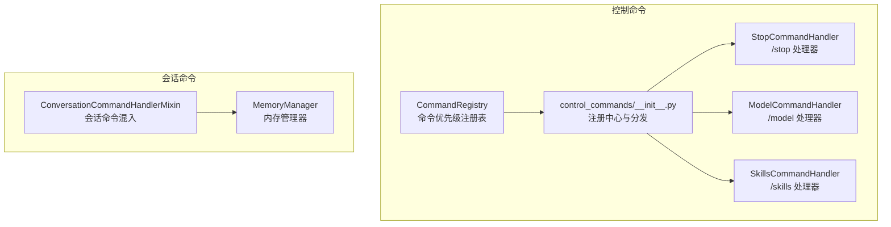
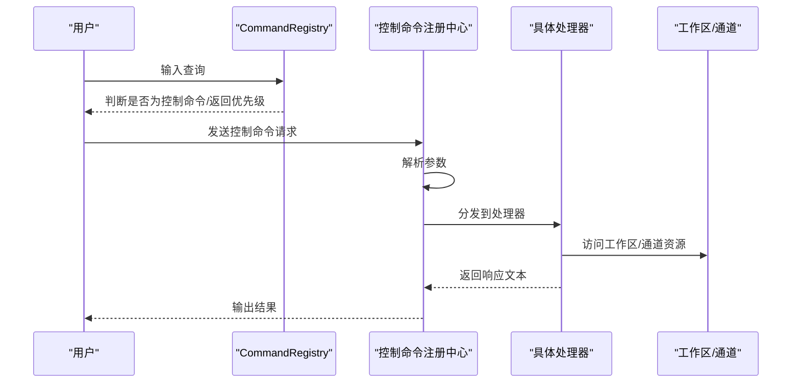
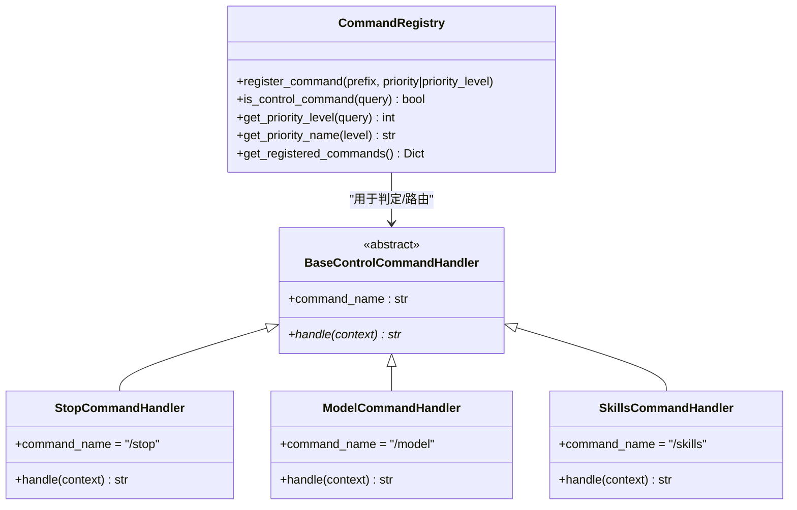
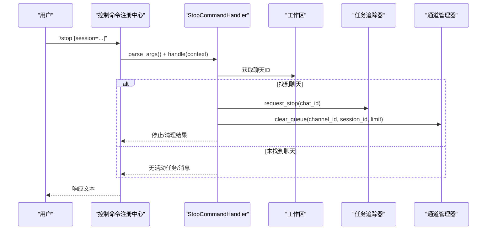
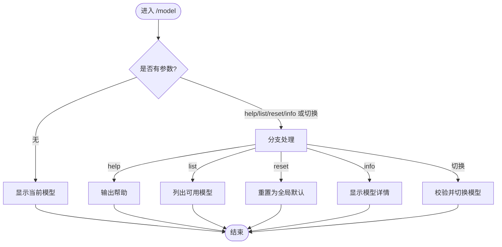
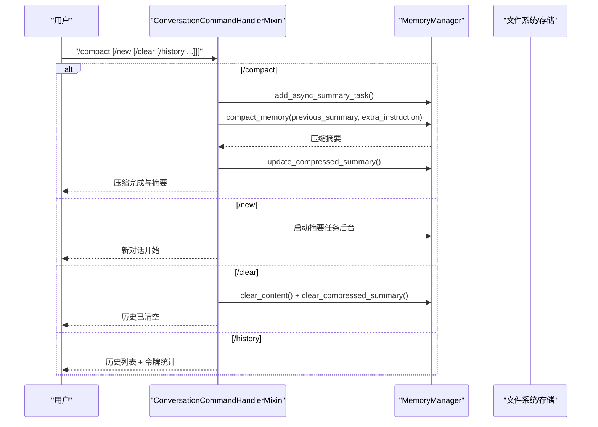
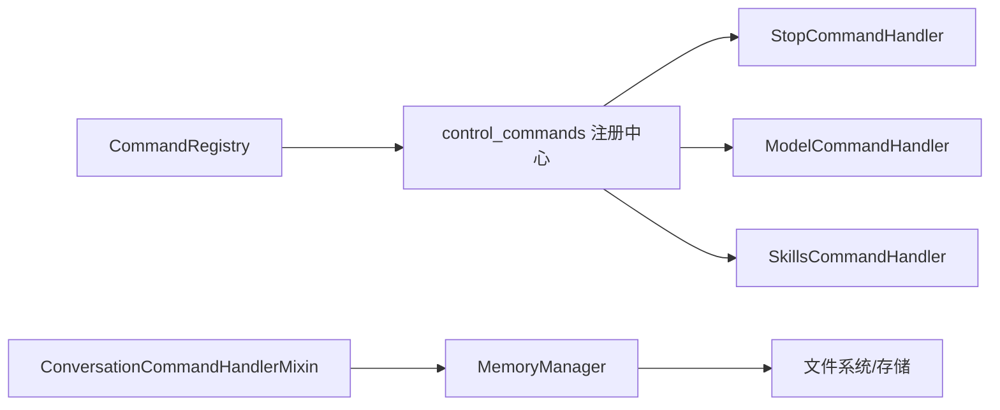

# 命令处理系统

<cite>
**本文引用的文件**
- [src\copaw\app\channels\command_registry.py](file://src\copaw\app\channels\command_registry.py)
- [src\copaw\app\runner\control_commands\__init__.py](file://src\copaw\app\runner\control_commands\__init__.py)
- [src\copaw\app\runner\control_commands\base.py](file://src\copaw\app\runner\control_commands\base.py)
- [src\copaw\app\runner\control_commands\model_handler.py](file://src\copaw\app\runner\control_commands\model_handler.py)
- [src\copaw\app\runner\control_commands\skills_handler.py](file://src\copaw\app\runner\control_commands\skills_handler.py)
- [src\copaw\app\runner\control_commands\stop_handler.py](file://src\copaw\app\runner\control_commands\stop_handler.py)
- [src\copaw\agents\command_handler.py](file://src\copaw\agents\command_handler.py)
- [website\public\docs\context.en.md](file://website\public\docs\context.en.md)
- [website\public\docs\commands.en.md](file://website\public\docs\commands.en.md)
</cite>

## 目录
1. [简介](#简介)
2. [项目结构](#项目结构)
3. [核心组件](#核心组件)
4. [架构总览](#架构总览)
5. [详细组件分析](#详细组件分析)
6. [依赖分析](#依赖分析)
7. [性能考虑](#性能考虑)
8. [故障排查指南](#故障排查指南)
9. [结论](#结论)
10. [附录](#附录)

## 简介
本技术文档面向命令处理系统，围绕控制命令与会话命令两大类展开，重点解释以下内容：
- 控制命令：/stop、/model、/skills 等的注册、解析、参数校验、执行与响应生成流程
- 会话命令：/compact、/new、/clear、/history 等的实现原理与内存压缩、历史记录管理、会话控制机制
- 命令扩展机制与自定义命令开发指南
- 错误处理策略与调试技巧

系统通过“优先级命令注册表”对控制命令进行快速判定与优先级分配；通过“控制命令处理器注册中心”集中分发控制命令；会话命令由代理混入类统一处理，结合内存管理器完成上下文压缩与历史维护。

## 项目结构
命令处理系统主要分布在如下模块：
- 控制命令（高优先级）：通道命令注册表 + 控制命令处理器注册中心 + 具体处理器（/stop、/model、/skills）
- 会话命令（普通对话上下文）：代理命令处理器混入类，负责 /compact、/new、/clear、/history 等

图表来源
- [src\copaw\app\channels\command_registry.py:23-267](file://src\copaw\app\channels\command_registry.py#L23-L267)
- [src\copaw\app\runner\control_commands\__init__.py:29-190](file://src\copaw\app\runner\control_commands\__init__.py#L29-L190)
- [src\copaw\app\runner\control_commands\stop_handler.py:16-103](file://src\copaw\app\runner\control_commands\stop_handler.py#L16-L103)
- [src\copaw\app\runner\control_commands\model_handler.py:17-501](file://src\copaw\app\runner\control_commands\model_handler.py#L17-L501)
- [src\copaw\app\runner\control_commands\skills_handler.py:23-91](file://src\copaw\app\runner\control_commands\skills_handler.py#L23-L91)
- [src\copaw\agents\command_handler.py:23-331](file://src\copaw\agents\command_handler.py#L23-L331)

章节来源
- [src\copaw\app\channels\command_registry.py:23-267](file://src\copaw\app\channels\command_registry.py#L23-L267)
- [src\copaw\app\runner\control_commands\__init__.py:29-190](file://src\copaw\app\runner\control_commands\__init__.py#L29-L190)
- [src\copaw\agents\command_handler.py:23-331](file://src\copaw\agents\command_handler.py#L23-L331)

## 核心组件
- 命令优先级注册表（CommandRegistry）
  - 提供命令前缀到优先级级别的映射，支持按名称或数值注册，内置默认控制命令与短别名
  - 提供查询接口以判断是否为控制命令及获取优先级级别
- 控制命令处理器注册中心（control_commands/__init__.py）
  - 维护全局处理器字典，提供注册、识别、参数解析与分发
  - 解析形如 “/cmd arg1=a arg2=b” 的参数，构造控制上下文后调用对应处理器
- 控制命令处理器基类（BaseControlCommandHandler）
  - 抽象基类，要求实现 handle(context)，返回字符串响应
- 具体处理器
  - /stop：终止任务并清空队列
  - /model：模型列表、切换、重置、信息查看
  - /skills：列出当前通道启用的技能清单
- 会话命令处理器混入（ConversationCommandHandlerMixin）
  - 负责 /compact、/new、/clear、/history 等命令的识别与执行
  - 与内存管理器协作，完成压缩、清理、历史导出/加载等操作

章节来源
- [src\copaw\app\channels\command_registry.py:23-267](file://src\copaw\app\channels\command_registry.py#L23-L267)
- [src\copaw\app\runner\control_commands\__init__.py:29-190](file://src\copaw\app\runner\control_commands\__init__.py#L29-L190)
- [src\copaw\app\runner\control_commands\base.py:19-70](file://src\copaw\app\runner\control_commands\base.py#L19-L70)
- [src\copaw\app\runner\control_commands\stop_handler.py:16-103](file://src\copaw\app\runner\control_commands\stop_handler.py#L16-L103)
- [src\copaw\app\runner\control_commands\model_handler.py:17-501](file://src\copaw\app\runner\control_commands\model_handler.py#L17-L501)
- [src\copaw\app\runner\control_commands\skills_handler.py:23-91](file://src\copaw\app\runner\control_commands\skills_handler.py#L23-L91)
- [src\copaw\agents\command_handler.py:23-331](file://src\copaw\agents\command_handler.py#L23-L331)

## 架构总览
控制命令与会话命令在两条路径上运行：
- 控制命令路径：用户输入 → 识别控制命令 → 优先级判定 → 参数解析 → 分发到处理器 → 返回响应
- 会话命令路径：用户输入 → 识别会话命令 → 执行相应逻辑（压缩/清理/历史管理）→ 返回响应

图表来源
- [src\copaw\app\channels\command_registry.py:136-218](file://src\copaw\app\channels\command_registry.py#L136-L218)
- [src\copaw\app\runner\control_commands\__init__.py:135-173](file://src\copaw\app\runner\control_commands\__init__.py#L135-L173)

## 详细组件分析

### 控制命令注册与分发（CommandRegistry 与 control_commands 注册中心）
- 命令优先级注册表
  - 默认优先级：critical(0)、high(10)、normal(20)、low(30)
  - 内置控制命令：/stop（critical），/daemon 系列与短别名（high）
  - 查询逻辑：按命令前缀长度降序匹配，确保最长前缀优先，且下一个字符为空白或结束
- 控制命令注册中心
  - 注册默认处理器：/stop、/model、/skills
  - 提供 is_control_command、parse_args、handle_control_command
  - 参数解析：支持 key=value 形式，保留原始参数以便需要时使用
  - 异常处理：捕获处理器异常并返回友好提示

图表来源
- [src\copaw\app\channels\command_registry.py:23-267](file://src\copaw\app\channels\command_registry.py#L23-L267)
- [src\copaw\app\runner\control_commands\base.py:40-70](file://src\copaw\app\runner\control_commands\base.py#L40-L70)
- [src\copaw\app\runner\control_commands\stop_handler.py:16-103](file://src\copaw\app\runner\control_commands\stop_handler.py#L16-L103)
- [src\copaw\app\runner\control_commands\model_handler.py:17-501](file://src\copaw\app\runner\control_commands\model_handler.py#L17-L501)
- [src\copaw\app\runner\control_commands\skills_handler.py:23-91](file://src\copaw\app\runner\control_commands\skills_handler.py#L23-L91)

章节来源
- [src\copaw\app\channels\command_registry.py:64-218](file://src\copaw\app\channels\command_registry.py#L64-L218)
- [src\copaw\app\runner\control_commands\__init__.py:33-176](file://src\copaw\app\runner\control_commands\__init__.py#L33-L176)

### /stop 命令处理流程
- 功能要点
  - 终止当前会话或指定会话的运行中任务
  - 清理该会话在通道中的排队消息
  - 返回停止状态与清理数量
- 关键步骤
  - 从上下文提取目标会话ID（默认当前会话）
  - 通过工作区查找活动聊天ID
  - 请求任务追踪器停止任务
  - 通过通道管理器清空队列
  - 汇总状态并返回响应

图表来源
- [src\copaw\app\runner\control_commands\__init__.py:97-173](file://src\copaw\app\runner\control_commands\__init__.py#L97-L173)
- [src\copaw\app\runner\control_commands\stop_handler.py:32-103](file://src\copaw\app\runner\control_commands\stop_handler.py#L32-L103)

章节来源
- [src\copaw\app\runner\control_commands\stop_handler.py:32-103](file://src\copaw\app\runner\control_commands\stop_handler.py#L32-L103)

### /model 命令处理流程
- 功能要点
  - 显示当前模型、帮助、列出可用模型、切换模型、重置为全局默认、显示模型信息
- 关键步骤
  - 无参：显示当前模型（来源：代理配置或全局）
  - list：过滤已配置提供者，展示模型能力与标记
  - reset：清除代理特定模型设置，使用全局默认
  - info：展示模型能力、探测来源、基础URL等
  - 切换：校验提供者与模型存在性，更新代理配置并持久化

图表来源
- [src\copaw\app\runner\control_commands\model_handler.py:39-72](file://src\copaw\app\runner\control_commands\model_handler.py#L39-L72)
- [src\copaw\app\runner\control_commands\model_handler.py:140-373](file://src\copaw\app\runner\control_commands\model_handler.py#L140-L373)

章节来源
- [src\copaw\app\runner\control_commands\model_handler.py:39-501](file://src\copaw\app\runner\control_commands\model_handler.py#L39-L501)

### /skills 命令处理流程
- 功能要点
  - 列出当前通道启用的技能，读取技能元数据（名称、描述、命令等）
- 关键步骤
  - 读取工作区技能清单与目录
  - 过滤启用且适用于当前通道的技能
  - 读取 SKILL.md Front Matter 获取显示名与描述
  - 汇总输出技能列表与调用方式

章节来源
- [src\copaw\app\runner\control_commands\skills_handler.py:32-91](file://src\copaw\app\runner\control_commands\skills_handler.py#L32-L91)

### 会话命令处理（/compact、/new、/clear、/history）
- 命令识别与分发
  - 通过混入类识别系统命令（/compact、/new、/clear、/history 等）
  - 将参数解析为字典，交由对应处理函数
- /compact：主动触发内存压缩
  - 调用内存管理器异步汇总任务，生成结构化压缩摘要
  - 更新压缩摘要并清空未压缩内容
- /new：清空上下文并保存到长期记忆
  - 启动摘要任务后台保存，准备新对话
- /clear：立即清空上下文（不保存）
  - 清空压缩摘要与未压缩内容
- /history：查看当前对话历史与上下文统计
  - 展示消息列表与令牌用量统计，支持按索引查看消息详情

图表来源
- [src\copaw\agents\command_handler.py:116-331](file://src\copaw\agents\command_handler.py#L116-L331)
- [website\public\docs\context.en.md:173-234](file://website\public\docs\context.en.md#L173-L234)
- [website\public\docs\commands.en.md:49-109](file://website\public\docs\commands.en.md#L49-L109)

章节来源
- [src\copaw\agents\command_handler.py:23-331](file://src\copaw\agents\command_handler.py#L23-L331)
- [website\public\docs\context.en.md:173-234](file://website\public\docs\context.en.md#L173-L234)
- [website\public\docs\commands.en.md:49-109](file://website\public\docs\commands.en.md#L49-L109)

## 依赖分析
- 控制命令链路
  - CommandRegistry 仅用于判定与优先级查询，不直接参与控制命令执行
  - control_commands 注册中心持有处理器实例，负责参数解析与分发
  - 具体处理器依赖工作区、通道、任务追踪器、提供者管理器等服务
- 会话命令链路
  - ConversationCommandHandlerMixin 依赖内存管理器与代理配置
  - 内存管理器与文件系统交互，完成压缩摘要与历史导出/加载

图表来源
- [src\copaw\app\channels\command_registry.py:23-267](file://src\copaw\app\channels\command_registry.py#L23-L267)
- [src\copaw\app\runner\control_commands\__init__.py:29-190](file://src\copaw\app\runner\control_commands\__init__.py#L29-L190)
- [src\copaw\agents\command_handler.py:23-331](file://src\copaw\agents\command_handler.py#L23-L331)

章节来源
- [src\copaw\app\channels\command_registry.py:23-267](file://src\copaw\app\channels\command_registry.py#L23-L267)
- [src\copaw\app\runner\control_commands\__init__.py:29-190](file://src\copaw\app\runner\control_commands\__init__.py#L29-L190)
- [src\copaw\agents\command_handler.py:23-331](file://src\copaw\agents\command_handler.py#L23-L331)

## 性能考虑
- 命令识别与优先级查询
  - CommandRegistry 使用前缀长度降序匹配，保证最长前缀优先，时间复杂度与命令前缀数量线性相关
  - 建议控制命令前缀尽量唯一，避免歧义导致额外匹配开销
- 控制命令参数解析
  - parse_args 对空参数早返回，避免不必要的字符串拆分
  - 建议处理器对大文本参数采用流式处理或延迟解析
- 会话命令与内存压缩
  - /compact 通过异步摘要任务与增量更新减少阻塞
  - 压缩摘要结构化可显著降低后续上下文长度，提升推理效率
- 历史记录管理
  - /history 展示令牌统计，便于用户评估上下文大小
  - /dump_history 导出文件路径，便于离线分析与备份

[本节为通用指导，无需列出章节来源]

## 故障排查指南
- 控制命令异常
  - 现象：处理器抛出异常或返回失败提示
  - 排查：检查日志中“Control command failed”条目，确认参数格式与目标资源是否存在
  - 建议：在处理器中捕获并记录异常，返回用户可读的错误信息
- /stop 无效
  - 现象：无活动任务或消息
  - 排查：确认会话ID正确、通道有活动聊天、任务追踪器与通道队列状态
- /model 切换失败
  - 现象：提供者或模型不存在、保存配置失败
  - 排查：使用 /model list 校验可用模型，检查全局默认模型配置
- /skills 未显示
  - 现象：当前通道无启用技能
  - 排查：检查工作区技能清单与通道配置，确认 SKILL.md Front Matter 正确
- 会话命令无响应
  - 现象：/compact 无结果、/clear 无效
  - 排查：确认内存管理器已启用、代理配置正确、磁盘空间充足

章节来源
- [src\copaw\app\runner\control_commands\__init__.py:166-172](file://src\copaw\app\runner\control_commands\__init__.py#L166-L172)
- [src\copaw\app\runner\control_commands\stop_handler.py:59-102](file://src\copaw\app\runner\control_commands\stop_handler.py#L59-L102)
- [src\copaw\app\runner\control_commands\model_handler.py:277-321](file://src\copaw\app\runner\control_commands\model_handler.py#L277-L321)
- [src\copaw\agents\command_handler.py:120-156](file://src\copaw\agents\command_handler.py#L120-L156)

## 结论
命令处理系统通过“优先级命令注册表 + 控制命令处理器注册中心 + 会话命令混入类”的分层设计，实现了控制命令的快速识别与高优先级执行，以及会话命令的统一处理与内存压缩、历史管理能力。系统提供了完善的扩展点与错误处理策略，便于开发者新增自定义命令与进行调试优化。

[本节为总结性内容，无需列出章节来源]

## 附录

### 命令扩展机制与自定义命令开发指南
- 控制命令扩展
  - 实现 BaseControlCommandHandler 子类，设置 command_name
  - 在模块导入时自动注册默认处理器，也可通过 register_command(handler) 动态注册
  - 在 handle(context) 中访问 context.workspace、context.channel、context.args 等上下文信息
- 会话命令扩展
  - 在 ConversationCommandHandlerMixin 的 SYSTEM_COMMANDS 集合中添加新命令名
  - 实现 _process_<cmd> 方法，遵循现有模式（参数解析、调用内存管理器、返回系统消息）
  - 如需导出/加载历史，参考 /dump_history 与 /load_history 的实现思路

章节来源
- [src\copaw\app\runner\control_commands\base.py:40-70](file://src\copaw\app\runner\control_commands\base.py#L40-L70)
- [src\copaw\app\runner\control_commands\__init__.py:40-66](file://src\copaw\app\runner\control_commands\__init__.py#L40-L66)
- [src\copaw\agents\command_handler.py:30-44](file://src\copaw\agents\command_handler.py#L30-L44)