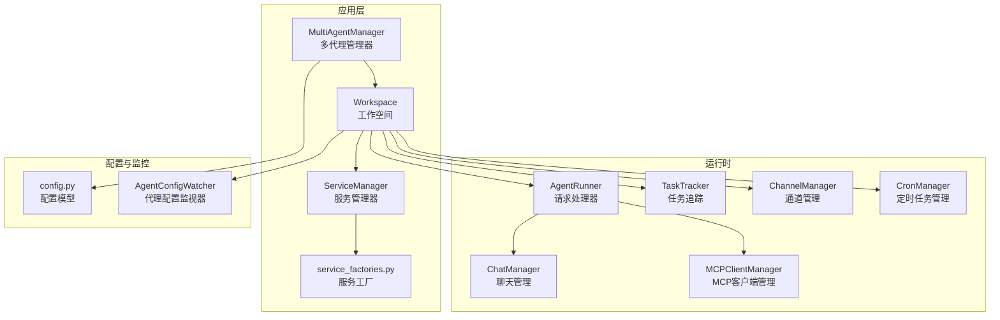
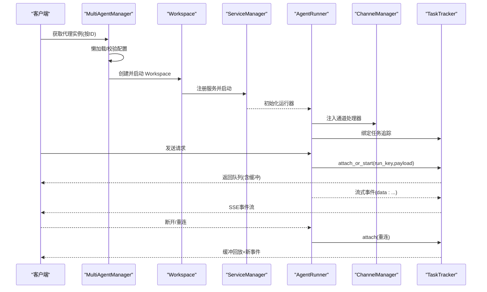
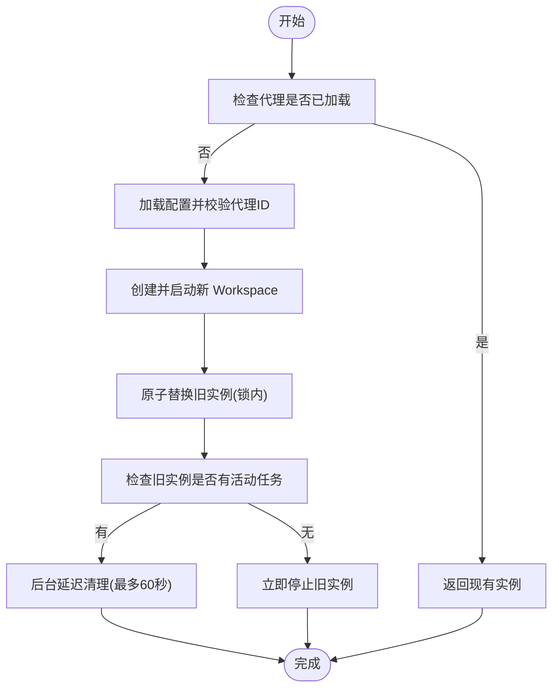
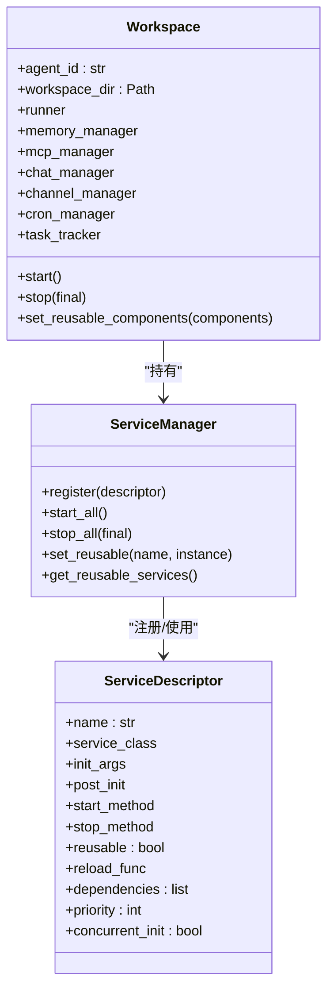
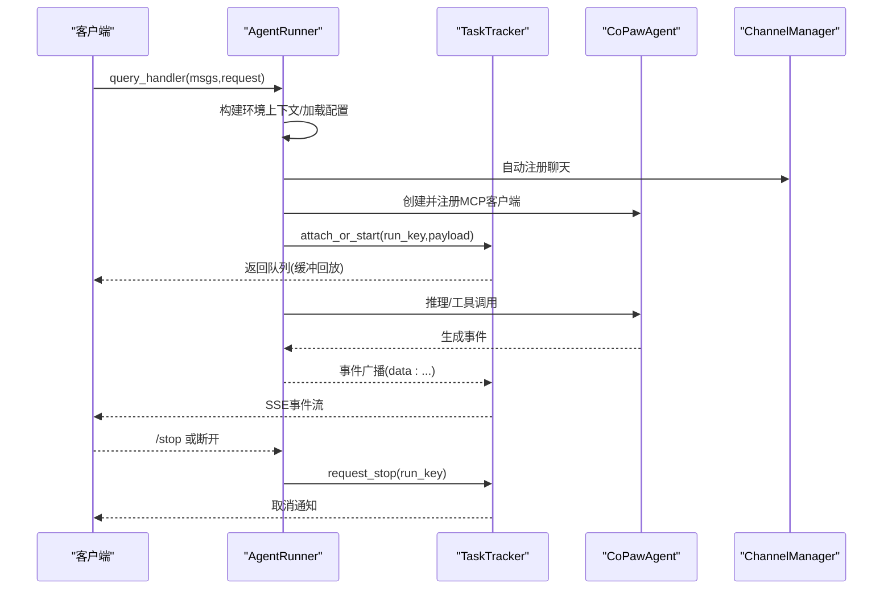
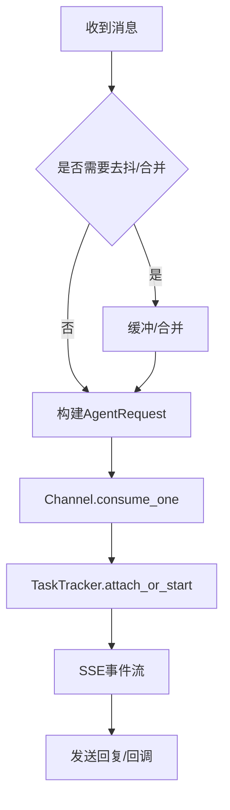
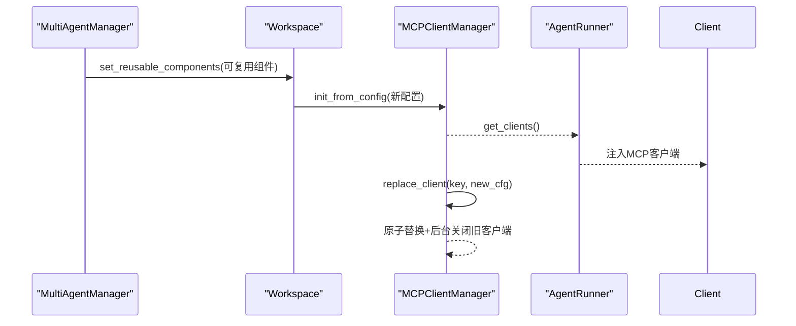
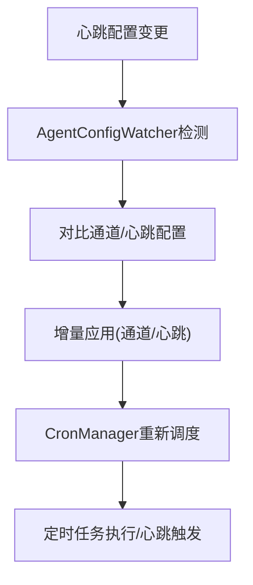
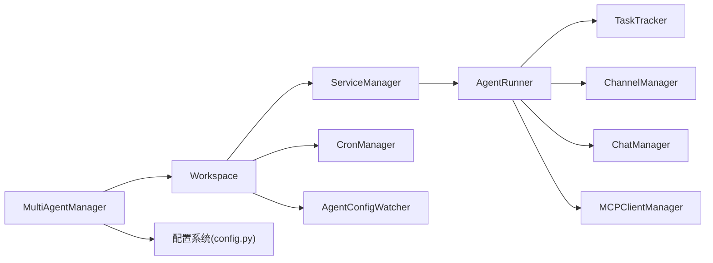

# 多代理管理

<cite>
**本文引用的文件**
- [multi_agent_manager.py](file://src/copaw/app/multi_agent_manager.py)
- [workspace.py](file://src/copaw/app/workspace/workspace.py)
- [service_manager.py](file://src/copaw/app/workspace/service_manager.py)
- [service_factories.py](file://src/copaw/app/workspace/service_factories.py)
- [react_agent.py](file://src/copaw/agents/react_agent.py)
- [runner.py](file://src/copaw/app/runner/runner.py)
- [manager.py](file://src/copaw/app/runner/manager.py)
- [task_tracker.py](file://src/copaw/app/runner/task_tracker.py)
- [base.py](file://src/copaw/app/channels/base.py)
- [manager.py](file://src/copaw/app/crons/manager.py)
- [config.py](file://src/copaw/config/config.py)
- [agent_config_watcher.py](file://src/copaw/app/agent_config_watcher.py)
- [manager.py](file://src/copaw/app/mcp/manager.py)
</cite>

## 目录
1. [简介](#简介)
2. [项目结构](#项目结构)
3. [核心组件](#核心组件)
4. [架构总览](#架构总览)
5. [详细组件分析](#详细组件分析)
6. [依赖关系分析](#依赖关系分析)
7. [性能考量](#性能考量)
8. [故障排查指南](#故障排查指南)
9. [结论](#结论)
10. [附录](#附录)

## 简介
本技术文档面向多代理管理系统（CoPaw）的“多代理”能力，系统性阐述其如何同时管理多个独立代理实例，覆盖以下主题：
- 代理调度与生命周期：按需懒加载、并发启动、零停机热重载、优雅停止
- 资源分配与隔离：每个代理拥有独立的工作空间与运行时组件，通道、聊天、内存、MCP、定时任务等均按实例隔离
- 代理间通信与协作：通过统一的通道层与消息编排，支持跨渠道、跨会话的事件流；提供任务跟踪与断线重连
- 冲突解决与一致性：基于优先级与依赖的组件启动顺序、原子替换与后台清理、配置变更的增量生效
- 工作空间与配置：工作空间目录化、配置分层（全局与代理级）、配置热更新
- 动态启停与故障恢复：任务追踪与取消、后台清理任务、错误兜底与日志记录

## 项目结构
CoPaw 的多代理架构以“工作空间（Workspace）”为核心单元，每个代理实例由一个独立 Workspace 承载。多代理管理器（MultiAgentManager）负责实例的生命周期与热重载，服务管理器（ServiceManager）负责组件注册、依赖与可复用性，运行器（AgentRunner）负责请求处理与消息流。

图示来源
- [multi_agent_manager.py:21-470](file://src/copaw/app/multi_agent_manager.py#L21-L470)
- [workspace.py:50-392](file://src/copaw/app/workspace/workspace.py#L50-L392)
- [service_manager.py:74-421](file://src/copaw/app/workspace/service_manager.py#L74-L421)
- [service_factories.py:18-171](file://src/copaw/app/workspace/service_factories.py#L18-L171)
- [runner.py:70-729](file://src/copaw/app/runner/runner.py#L70-L729)
- [manager.py:17-252](file://src/copaw/app/runner/manager.py#L17-L252)
- [task_tracker.py:30-231](file://src/copaw/app/runner/task_tracker.py#L30-L231)
- [config.py:697-800](file://src/copaw/config/config.py#L697-L800)
- [agent_config_watcher.py:35-278](file://src/copaw/app/agent_config_watcher.py#L35-L278)

章节来源
- [multi_agent_manager.py:21-470](file://src/copaw/app/multi_agent_manager.py#L21-L470)
- [workspace.py:50-392](file://src/copaw/app/workspace/workspace.py#L50-L392)
- [service_manager.py:74-421](file://src/copaw/app/workspace/service_manager.py#L74-L421)
- [service_factories.py:18-171](file://src/copaw/app/workspace/service_factories.py#L18-L171)
- [runner.py:70-729](file://src/copaw/app/runner/runner.py#L70-L729)
- [manager.py:17-252](file://src/copaw/app/runner/manager.py#L17-L252)
- [task_tracker.py:30-231](file://src/copaw/app/runner/task_tracker.py#L30-L231)
- [config.py:697-800](file://src/copaw/config/config.py#L697-L800)
- [agent_config_watcher.py:35-278](file://src/copaw/app/agent_config_watcher.py#L35-L278)

## 核心组件
- 多代理管理器（MultiAgentManager）
  - 懒加载：首次请求才创建并启动 Workspace
  - 并发启动：批量启动多个代理实例
  - 零停机热重载：新实例就绪后原子替换旧实例，后台清理旧实例
  - 优雅停止：区分 final 停止与 reload 场景下的可复用组件保留
- 工作空间（Workspace）
  - 统一的服务注册与生命周期：Runner、MemoryManager、ChatManager、ChannelManager、MCPClientManager、CronManager
  - 可复用组件：在热重载时将可复用组件（如内存、聊天）从旧实例转移到新实例
- 服务管理器（ServiceManager）
  - 描述符式注册：通过 ServiceDescriptor 声明组件类型、初始化参数、启动/停止方法、依赖与优先级
  - 启动顺序与并发：同优先级并发、不同优先级串行
  - 可复用组件：在 reload 时仅启动未复用的组件
- 运行器（AgentRunner）
  - 请求处理：构建 Agent 上下文、自动注册聊天、注入 MCP 客户端、执行推理与工具调用
  - 控制命令：解析与执行控制命令（如 /stop、/approve 等）
  - 错误处理：异常转换、调试转储、会话状态保存
- 任务追踪（TaskTracker）
  - SSE 事件广播：同一 run_key 下多订阅者、断线重连缓冲回放
  - 取消与等待：支持请求级取消、等待所有任务完成
- 通道与聊天（ChannelManager、ChatManager）
  - 通道抽象：统一消息格式、去抖与合并、权限与提及策略
  - 聊天管理：持久化聊天规格、自动注册与触达时间更新
- MCP 客户端管理（MCPClientManager）
  - 运行时热替换：连接新客户端、原子替换旧客户端、后台关闭旧客户端
- 定时任务（CronManager）
  - APScheduler 驱动：作业注册、并发信号量、心跳任务、失败推送
- 配置与热更新（AgentConfigWatcher）
  - 监视 agent.json：增量应用通道与心跳配置变更，避免重启

章节来源
- [multi_agent_manager.py:21-470](file://src/copaw/app/multi_agent_manager.py#L21-L470)
- [workspace.py:50-392](file://src/copaw/app/workspace/workspace.py#L50-L392)
- [service_manager.py:74-421](file://src/copaw/app/workspace/service_manager.py#L74-L421)
- [runner.py:70-729](file://src/copaw/app/runner/runner.py#L70-L729)
- [task_tracker.py:30-231](file://src/copaw/app/runner/task_tracker.py#L30-L231)
- [manager.py:17-252](file://src/copaw/app/runner/manager.py#L17-L252)
- [base.py:70-800](file://src/copaw/app/channels/base.py#L70-L800)
- [manager.py:38-388](file://src/copaw/app/crons/manager.py#L38-L388)
- [agent_config_watcher.py:35-278](file://src/copaw/app/agent_config_watcher.py#L35-L278)
- [manager.py:23-267](file://src/copaw/app/mcp/manager.py#L23-L267)

## 架构总览
下图展示多代理管理的关键交互：多代理管理器协调多个工作空间，每个工作空间内部通过服务管理器装配运行器、通道、聊天、MCP、定时任务与任务追踪，并通过统一的通道层进行消息编排与事件流输出。

图示来源
- [multi_agent_manager.py:38-90](file://src/copaw/app/multi_agent_manager.py#L38-L90)
- [workspace.py:325-362](file://src/copaw/app/workspace/workspace.py#L325-L362)
- [service_manager.py:171-229](file://src/copaw/app/workspace/service_manager.py#L171-L229)
- [runner.py:349-589](file://src/copaw/app/runner/runner.py#L349-L589)
- [task_tracker.py:142-208](file://src/copaw/app/runner/task_tracker.py#L142-L208)
- [base.py:659-800](file://src/copaw/app/channels/base.py#L659-L800)

## 详细组件分析

### 多代理管理器（MultiAgentManager）
- 懒加载与线程安全：使用异步锁保护实例字典，首次访问才创建并启动 Workspace
- 并发启动：批量启动启用的代理，错误不影响其他代理
- 零停机热重载：
  - 新实例在持有锁之外创建与启动，最小化锁占用
  - 原子替换旧实例，若存在活动任务则后台延迟清理
  - 支持可复用组件迁移（如内存、聊天）
- 优雅停止：区分 final 与非 final 停止，确保可复用组件在 reload 场景不被关闭

图示来源
- [multi_agent_manager.py:21-470](file://src/copaw/app/multi_agent_manager.py#L21-L470)

章节来源
- [multi_agent_manager.py:21-470](file://src/copaw/app/multi_agent_manager.py#L21-L470)

### 工作空间（Workspace）与服务管理器（ServiceManager）
- 服务注册：通过 ServiceDescriptor 声明组件类型、初始化参数、启动/停止方法、依赖与优先级
- 启动顺序：按优先级分组，同优先级并发，不同优先级串行
- 可复用组件：在 reload 前设置可复用组件，避免重建
- 生命周期：start/stop 分别委托给 ServiceManager，支持 final 与非 final 停止

图示来源
- [workspace.py:50-392](file://src/copaw/app/workspace/workspace.py#L50-L392)
- [service_manager.py:30-421](file://src/copaw/app/workspace/service_manager.py#L30-L421)

章节来源
- [workspace.py:50-392](file://src/copaw/app/workspace/workspace.py#L50-L392)
- [service_manager.py:74-421](file://src/copaw/app/workspace/service_manager.py#L74-L421)
- [service_factories.py:18-171](file://src/copaw/app/workspace/service_factories.py#L18-L171)

### 运行器（AgentRunner）与任务追踪（TaskTracker）
- 请求处理：构建 Agent 上下文、自动注册聊天、注入 MCP 客户端、执行推理与工具调用
- 控制命令：解析与执行控制命令（如 /stop、/approve 等）
- 任务追踪：同一 run_key 下多订阅者、断线重连缓冲回放、请求级取消
- 错误处理：异常转换、调试转储、会话状态保存

图示来源
- [runner.py:349-589](file://src/copaw/app/runner/runner.py#L349-L589)
- [task_tracker.py:142-208](file://src/copaw/app/runner/task_tracker.py#L142-L208)
- [react_agent.py:69-800](file://src/copaw/agents/react_agent.py#L69-L800)
- [manager.py:17-252](file://src/copaw/app/runner/manager.py#L17-L252)

章节来源
- [runner.py:70-729](file://src/copaw/app/runner/runner.py#L70-L729)
- [task_tracker.py:30-231](file://src/copaw/app/runner/task_tracker.py#L30-L231)
- [react_agent.py:69-800](file://src/copaw/agents/react_agent.py#L69-L800)
- [manager.py:17-252](file://src/copaw/app/runner/manager.py#L17-L252)

### 通道与聊天（ChannelManager、ChatManager）
- 通道抽象：统一消息格式、去抖与合并、权限与提及策略
- 聊天管理：持久化聊天规格、自动注册与触达时间更新
- 与工作空间集成：通过服务工厂注入到 Runner 与 Workspace

图示来源
- [base.py:659-800](file://src/copaw/app/channels/base.py#L659-L800)
- [manager.py:17-252](file://src/copaw/app/runner/manager.py#L17-L252)
- [service_factories.py:64-108](file://src/copaw/app/workspace/service_factories.py#L64-L108)

章节来源
- [base.py:70-800](file://src/copaw/app/channels/base.py#L70-L800)
- [manager.py:17-252](file://src/copaw/app/runner/manager.py#L17-L252)
- [service_factories.py:64-108](file://src/copaw/app/workspace/service_factories.py#L64-L108)

### MCP 客户端管理（MCPClientManager）
- 初始化与热替换：连接新客户端、原子替换旧客户端、后台关闭旧客户端
- 异常处理：连接超时或失败时强制清理，避免资源泄漏

图示来源
- [multi_agent_manager.py:265-297](file://src/copaw/app/multi_agent_manager.py#L265-L297)
- [workspace.py:293-324](file://src/copaw/app/workspace/workspace.py#L293-L324)
- [manager.py:23-267](file://src/copaw/app/mcp/manager.py#L23-L267)
- [runner.py:430-464](file://src/copaw/app/runner/runner.py#L430-L464)

章节来源
- [manager.py:23-267](file://src/copaw/app/mcp/manager.py#L23-L267)
- [multi_agent_manager.py:265-297](file://src/copaw/app/multi_agent_manager.py#L265-L297)
- [workspace.py:293-324](file://src/copaw/app/workspace/workspace.py#L293-L324)
- [runner.py:430-464](file://src/copaw/app/runner/runner.py#L430-L464)

### 定时任务（CronManager）与心跳（AgentConfigWatcher）
- CronManager：APScheduler 驱动，作业并发信号量、misfire 处理、心跳任务
- AgentConfigWatcher：监视 agent.json，增量应用通道与心跳配置变更

图示来源
- [manager.py:154-189](file://src/copaw/app/crons/manager.py#L154-L189)
- [agent_config_watcher.py:240-278](file://src/copaw/app/agent_config_watcher.py#L240-L278)

章节来源
- [manager.py:38-388](file://src/copaw/app/crons/manager.py#L38-L388)
- [agent_config_watcher.py:35-278](file://src/copaw/app/agent_config_watcher.py#L35-L278)

## 依赖关系分析
- 组件耦合与内聚
  - MultiAgentManager 与 Workspace：弱耦合，通过 ID 与配置解耦
  - Workspace 与 ServiceManager：强内聚，服务注册与生命周期集中管理
  - AgentRunner 与 TaskTracker：紧密耦合，前者负责生产事件，后者负责消费与广播
  - ChannelManager 与 TaskTracker：通过 run_key 实现会话级隔离与重连
- 外部依赖与集成点
  - 配置系统：全局配置与代理级配置分层，AgentConfigWatcher 提供增量更新
  - MCP 客户端：通过 Manager 提供热替换能力
  - 定时任务：APScheduler 作为调度引擎

图示来源
- [multi_agent_manager.py:21-470](file://src/copaw/app/multi_agent_manager.py#L21-L470)
- [workspace.py:50-392](file://src/copaw/app/workspace/workspace.py#L50-L392)
- [runner.py:70-729](file://src/copaw/app/runner/runner.py#L70-L729)
- [task_tracker.py:30-231](file://src/copaw/app/runner/task_tracker.py#L30-L231)
- [config.py:697-800](file://src/copaw/config/config.py#L697-L800)
- [agent_config_watcher.py:35-278](file://src/copaw/app/agent_config_watcher.py#L35-L278)

章节来源
- [multi_agent_manager.py:21-470](file://src/copaw/app/multi_agent_manager.py#L21-L470)
- [workspace.py:50-392](file://src/copaw/app/workspace/workspace.py#L50-L392)
- [runner.py:70-729](file://src/copaw/app/runner/runner.py#L70-L729)
- [task_tracker.py:30-231](file://src/copaw/app/runner/task_tracker.py#L30-L231)
- [config.py:697-800](file://src/copaw/config/config.py#L697-L800)
- [agent_config_watcher.py:35-278](file://src/copaw/app/agent_config_watcher.py#L35-L278)

## 性能考量
- 启动性能
  - 懒加载与并发启动：减少冷启动时间，提升吞吐
  - 同优先级并发：缩短启动链路
- 运行时性能
  - TaskTracker 使用无界队列与缓冲回放，适合高并发与断线重连场景
  - MCP 客户端连接超时与后台关闭，避免阻塞主流程
- 资源隔离
  - 每个代理独立工作空间，避免共享状态竞争
  - 可复用组件（内存、聊天）在 reload 时迁移，降低重建成本
- 配置热更新
  - AgentConfigWatcher 采用轮询与哈希比较，快速检测变更并增量应用

## 故障排查指南
- 热重载失败
  - 现象：新实例启动失败或旧实例无法停止
  - 排查：查看 MultiAgentManager 的异常日志与清理任务状态；确认新实例是否成功启动并设置 manager 引用
  - 参考
    - [multi_agent_manager.py:282-296](file://src/copaw/app/multi_agent_manager.py#L282-L296)
    - [multi_agent_manager.py:321-344](file://src/copaw/app/multi_agent_manager.py#L321-L344)
- 任务无法取消或长时间卡住
  - 现象：/stop 命令无效或等待超时
  - 排查：检查 TaskTracker 的 request_stop 与 wait_all_done；确认 run_key 是否正确
  - 参考
    - [task_tracker.py:133-141](file://src/copaw/app/runner/task_tracker.py#L133-L141)
    - [task_tracker.py:79-98](file://src/copaw/app/runner/task_tracker.py#L79-L98)
- 通道消息丢失或重复
  - 现象：消息去抖/合并导致内容缺失或重复
  - 排查：检查 Channel 的去抖参数与合并逻辑；确认 session_id 生成规则
  - 参考
    - [base.py:659-800](file://src/copaw/app/channels/base.py#L659-L800)
- MCP 客户端异常
  - 现象：客户端连接失败或会话中断
  - 排查：查看 MCPClientManager 的连接超时与强制清理逻辑；确认新旧客户端替换流程
  - 参考
    - [manager.py:106-132](file://src/copaw/app/mcp/manager.py#L106-L132)
    - [manager.py:190-229](file://src/copaw/app/mcp/manager.py#L190-L229)
- 定时任务未执行或报错
  - 现象：作业未触发或失败
  - 排查：检查 CronManager 的调度器状态、作业并发信号量与 misfire 设置；查看失败推送
  - 参考
    - [manager.py:63-111](file://src/copaw/app/crons/manager.py#L63-L111)
    - [manager.py:217-239](file://src/copaw/app/crons/manager.py#L217-L239)

章节来源
- [multi_agent_manager.py:282-296](file://src/copaw/app/multi_agent_manager.py#L282-L296)
- [multi_agent_manager.py:321-344](file://src/copaw/app/multi_agent_manager.py#L321-L344)
- [task_tracker.py:133-141](file://src/copaw/app/runner/task_tracker.py#L133-L141)
- [task_tracker.py:79-98](file://src/copaw/app/runner/task_tracker.py#L79-L98)
- [base.py:659-800](file://src/copaw/app/channels/base.py#L659-L800)
- [manager.py:106-132](file://src/copaw/app/mcp/manager.py#L106-L132)
- [manager.py:190-229](file://src/copaw/app/mcp/manager.py#L190-L229)
- [manager.py:63-111](file://src/copaw/app/crons/manager.py#L63-L111)
- [manager.py:217-239](file://src/copaw/app/crons/manager.py#L217-L239)

## 结论
CoPaw 的多代理管理通过“工作空间 + 服务管理器 + 运行器 + 任务追踪”的分层设计，实现了：
- 高可用：懒加载、并发启动、零停机热重载
- 高隔离：每个代理独立工作空间与运行时组件
- 高扩展：可插拔服务、可复用组件、增量配置更新
- 高可靠：任务追踪与取消、后台清理、错误兜底与日志

该架构为多代理部署提供了坚实基础，建议结合业务规模与资源约束，合理规划代理数量、并发与缓存策略，持续优化启动与热重载路径。

## 附录
- 最佳实践
  - 启动策略：优先启用高频代理，其余按需懒加载
  - 热重载：对可复用组件（内存、聊天）进行迁移，减少重建成本
  - 配置热更新：通过 AgentConfigWatcher 增量应用通道与心跳配置
  - 监控与告警：关注 TaskTracker 的活跃任务列表与等待完成超时
- 性能调优建议
  - 启动并发：根据 CPU 与 I/O 能力调整同优先级并发度
  - 缓冲与去抖：根据渠道特性调整 Channel 的去抖参数
  - MCP 连接：设置合理的连接超时与重试策略
  - 定时任务：为长耗时任务配置更高的并发信号量与更宽松的 misfire 容忍