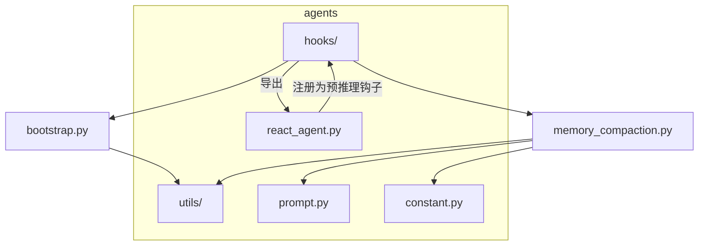
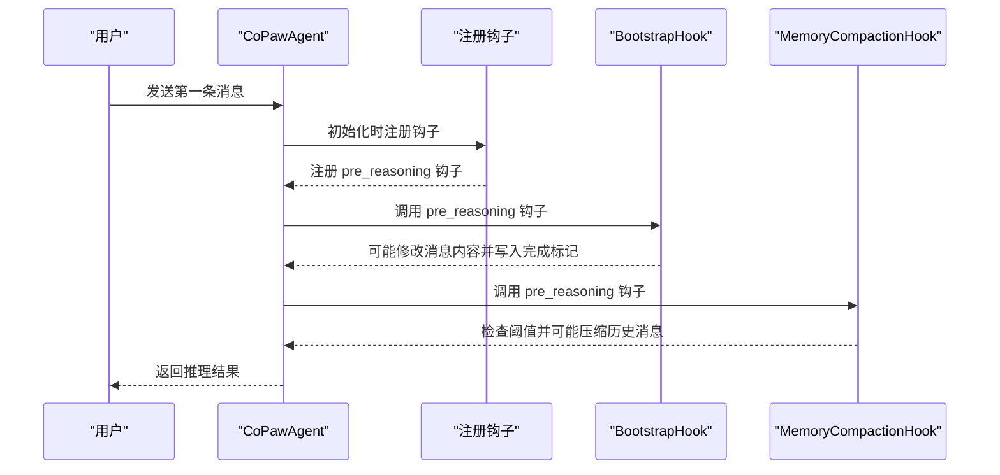
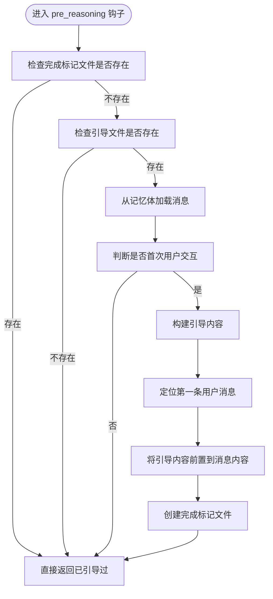
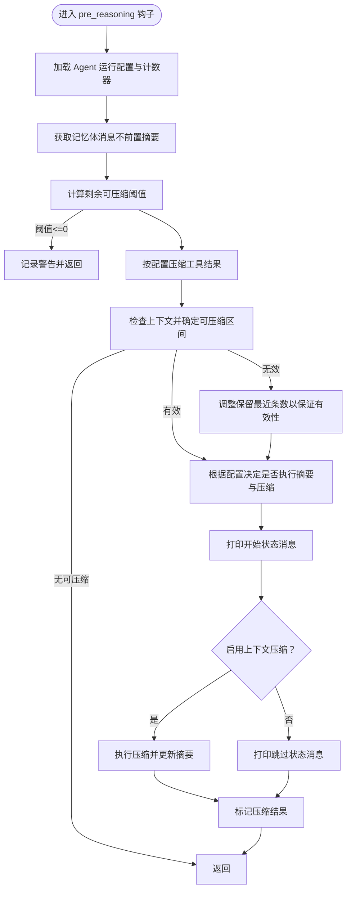
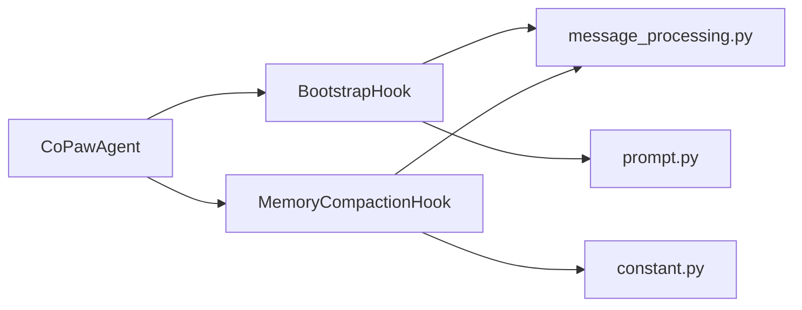

# 钩子系统

<cite>
**本文引用的文件**
- [src\copaw\agents\hooks\__init__.py](file://src\copaw\agents\hooks\__init__.py)
- [src\copaw\agents\hooks\bootstrap.py](file://src\copaw\agents\hooks\bootstrap.py)
- [src\copaw\agents\hooks\memory_compaction.py](file://src\copaw\agents\hooks\memory_compaction.py)
- [src\copaw\agents\react_agent.py](file://src\copaw\agents\react_agent.py)
- [src\copaw\agents\utils\message_processing.py](file://src\copaw\agents\utils\message_processing.py)
- [src\copaw\agents\utils\setup_utils.py](file://src\copaw\agents\utils\setup_utils.py)
- [src\copaw\agents\prompt.py](file://src\copaw\agents\prompt.py)
- [src\copaw\constant.py](file://src\copaw\constant.py)
</cite>

## 目录
1. [简介](#简介)
2. [项目结构](#项目结构)
3. [核心组件](#核心组件)
4. [架构总览](#架构总览)
5. [详细组件分析](#详细组件分析)
6. [依赖分析](#依赖分析)
7. [性能考虑](#性能考虑)
8. [故障排查指南](#故障排查指南)
9. [结论](#结论)
10. [附录](#附录)

## 简介
本文件系统性阐述 CoPaw 的钩子机制设计与实现，重点覆盖以下方面：
- 钩子类型与职责：预推理钩子、预行动钩子等在 Agent 生命周期中的作用边界
- 引导钩子（BootstrapHook）：首次用户交互时的引导注入流程
- 内存压缩钩子（MemoryCompactionHook）：上下文窗口管理与自动压缩策略
- 注册与执行时机：如何在 Agent 初始化阶段注册钩子，以及在推理前的调用点
- 参数传递机制：钩子函数签名与上下文参数的来源
- 自定义钩子开发指南与最佳实践
- 扩展方法与调试技巧

## 项目结构
钩子系统位于 agents 子模块中，采用“按功能分包”的组织方式：
- hooks 包含具体钩子实现与导出入口
- react_agent 负责在 Agent 初始化时注册钩子
- utils 提供消息处理、工具消息校验、计数器等支撑能力
- prompt 提供系统提示构建能力，与引导钩子配合工作
- constant 定义运行期常量，如上下文保留条数等

图表来源
- [src\copaw\agents\hooks\__init__.py](file://src\copaw\agents\hooks\__init__.py)
- [src\copaw\agents\react_agent.py](file://src\copaw\agents\react_agent.py)
- [src\copaw\agents\hooks\bootstrap.py](file://src\copaw\agents\hooks\bootstrap.py)
- [src\copaw\agents\hooks\memory_compaction.py](file://src\copaw\agents\hooks\memory_compaction.py)
- [src\copaw\agents\utils\message_processing.py](file://src\copaw\agents\utils\message_processing.py)
- [src\copaw\agents\prompt.py](file://src\copaw\agents\prompt.py)
- [src\copaw\constant.py](file://src\copaw\constant.py)

章节来源
- [src\copaw\agents\hooks\__init__.py](file://src\copaw\agents\hooks\__init__.py)
- [src\copaw\agents\react_agent.py](file://src\copaw\agents\react_agent.py)

## 核心组件
- 引导钩子（BootstrapHook）
  - 作用：在首次用户交互时检查工作目录中的引导文件，向第一条用户消息注入引导内容
  - 触发条件：存在引导文件且为首次用户交互；仅触发一次
  - 关键行为：读取引导内容、定位第一条用户消息、拼接到消息内容前部、写入完成标记文件
- 内存压缩钩子（MemoryCompactionHook）
  - 作用：在推理前检查上下文长度阈值，必要时对历史消息进行压缩与摘要更新
  - 触发条件：上下文估计长度超过阈值；可选跳过压缩或启用摘要任务
  - 关键行为：计算剩余可压缩阈值、选择待压缩区间、打印状态消息、标记压缩结果、更新压缩摘要

章节来源
- [src\copaw\agents\hooks\bootstrap.py](file://src\copaw\agents\hooks\bootstrap.py)
- [src\copaw\agents\hooks\memory_compaction.py](file://src\copaw\agents\hooks\memory_compaction.py)

## 架构总览
钩子注册与执行的关键路径如下：

图表来源
- [src\copaw\agents\react_agent.py](file://src\copaw\agents\react_agent.py)
- [src\copaw\agents\hooks\bootstrap.py](file://src\copaw\agents\hooks\bootstrap.py)
- [src\copaw\agents\hooks\memory_compaction.py](file://src\copaw\agents\hooks\memory_compaction.py)

## 详细组件分析

### 引导钩子（BootstrapHook）
- 设计要点
  - 通过工作目录中的引导文件决定是否注入引导内容
  - 使用“首次交互”判断逻辑避免重复注入
  - 通过标记文件确保引导只执行一次
- 执行流程

图表来源
- [src\copaw\agents\hooks\bootstrap.py](file://src\copaw\agents\hooks\bootstrap.py)
- [src\copaw\agents\utils\message_processing.py](file://src\copaw\agents\utils\message_processing.py)
- [src\copaw\agents\prompt.py](file://src\copaw\agents\prompt.py)

章节来源
- [src\copaw\agents\hooks\bootstrap.py](file://src\copaw\agents\hooks\bootstrap.py)
- [src\copaw\agents\utils\message_processing.py](file://src\copaw\agents\utils\message_processing.py)
- [src\copaw\agents\prompt.py](file://src\copaw\agents\prompt.py)

### 内存压缩钩子（MemoryCompactionHook）
- 设计要点
  - 基于配置计算“剩余可压缩阈值”，结合“最近保留条数”与“有效性校验”确定压缩区间
  - 支持工具结果压缩与上下文压缩两种策略
  - 可选开启摘要生成异步任务与上下文压缩任务
  - 通过状态消息反馈压缩进度与结果
- 执行流程

图表来源
- [src\copaw\agents\hooks\memory_compaction.py](file://src\copaw\agents\hooks\memory_compaction.py)
- [src\copaw\constant.py](file://src\copaw\constant.py)

章节来源
- [src\copaw\agents\hooks\memory_compaction.py](file://src\copaw\agents\hooks\memory_compaction.py)
- [src\copaw\constant.py](file://src\copaw\constant.py)

### 钩子注册与执行时机
- 注册位置
  - 在 Agent 初始化时调用注册逻辑，分别创建引导钩子与内存压缩钩子实例
  - 将钩子注册为“预推理”类型的实例钩子
- 执行时机
  - 在推理流程进入“推理阶段”前触发，确保在模型输入前完成必要的上下文准备与修正
- 参数传递
  - 钩子函数签名接收 agent 实例与 kwargs 字典
  - kwargs 通常包含即将传入推理方法的参数，钩子可在其中读取或调整消息列表等

章节来源
- [src\copaw\agents\react_agent.py](file://src\copaw\agents\react_agent.py)

### 预推理钩子与预行动钩子
- 预推理钩子（pre_reasoning）
  - 用于在推理前对消息、上下文、配置等进行检查与修正
  - 典型用途：上下文长度评估、引导注入、工具结果压缩
- 预行动钩子（pre_acting）
  - 用于在行动前对工具调用、输出格式等进行拦截与增强
  - 与工具守卫、命令处理等协作，保障安全与一致性

章节来源
- [src\copaw\agents\react_agent.py](file://src\copaw\agents\react_agent.py)

### 自定义钩子开发指南与最佳实践
- 开发步骤
  - 明确钩子类型与触发时机：选择 pre_reasoning 或 pre_acting
  - 编写钩子类或可调用对象，遵循统一签名：接收 agent 与 kwargs，返回 None 或调整后的 kwargs
  - 在 Agent 初始化时通过注册接口将其加入对应钩子链
- 最佳实践
  - 保持幂等性：避免重复执行副作用（例如使用完成标记文件）
  - 降低耦合：尽量通过配置与工具函数访问外部资源，减少硬编码
  - 记录日志：在关键分支记录 debug/warning/error，便于排障
  - 性能优先：避免在钩子中执行阻塞操作，必要时使用异步或后台任务
  - 参数最小化：仅读取/修改钩子需要的数据，避免对 kwargs 过度侵入

章节来源
- [src\copaw\agents\react_agent.py](file://src\copaw\agents\react_agent.py)

## 依赖分析
- 组件内聚与耦合
  - 引导钩子与消息处理工具紧密耦合，依赖“首次交互判断”“消息内容拼接”
  - 内存压缩钩子与配置、计数器、记忆管理器强耦合，依赖运行时配置与摘要更新
- 外部依赖
  - AgentScope 的 ReActAgent 与钩子注册机制
  - 工作目录与文件系统（引导文件、完成标记）
  - 环境变量与常量（上下文保留条数、比率等）

图表来源
- [src\copaw\agents\hooks\bootstrap.py](file://src\copaw\agents\hooks\bootstrap.py)
- [src\copaw\agents\hooks\memory_compaction.py](file://src\copaw\agents\hooks\memory_compaction.py)
- [src\copaw\agents\react_agent.py](file://src\copaw\agents\react_agent.py)
- [src\copaw\agents\utils\message_processing.py](file://src\copaw\agents\utils\message_processing.py)
- [src\copaw\agents\prompt.py](file://src\copaw\agents\prompt.py)
- [src\copaw\constant.py](file://src\copaw\constant.py)

章节来源
- [src\copaw\agents\hooks\bootstrap.py](file://src\copaw\agents\hooks\bootstrap.py)
- [src\copaw\agents\hooks\memory_compaction.py](file://src\copaw\agents\hooks\memory_compaction.py)
- [src\copaw\agents\react_agent.py](file://src\copaw\agents\react_agent.py)
- [src\copaw\agents\utils\message_processing.py](file://src\copaw\agents\utils\message_processing.py)
- [src\copaw\agents\prompt.py](file://src\copaw\agents\prompt.py)
- [src\copaw\constant.py](file://src\copaw\constant.py)

## 性能考虑
- 计数与估算
  - 使用专用计数器估算消息长度，避免实际调用模型带来的开销
- 压缩策略
  - 合理设置“剩余可压缩阈值”与“最近保留条数”，平衡上下文长度与信息保留
  - 对工具结果先行压缩，减少后续上下文压力
- 异步与后台
  - 摘要生成与上下文压缩可异步执行，避免阻塞主推理线程
- 日志级别
  - 在高频场景下降低日志级别，减少 IO 影响

## 故障排查指南
- 引导钩子相关问题
  - 引导未生效：确认引导文件存在、完成标记文件未提前创建、首次交互判断逻辑正确
  - 引导重复出现：检查完成标记文件是否被清理或删除
- 内存压缩钩子相关问题
  - 压缩阈值过低：系统提示会给出警告，建议增大阈值或清理历史摘要
  - 压缩失败：查看状态消息与异常日志，确认压缩任务是否成功
  - 无效消息导致压缩中断：钩子会尝试调整保留条数以保证有效性，必要时手动清理历史
- 调试技巧
  - 提升日志级别，观察钩子执行路径与关键变量
  - 使用命令查看历史与上下文状态，辅助定位问题
  - 临时禁用钩子验证问题是否由钩子引起

章节来源
- [src\copaw\agents\hooks\bootstrap.py](file://src\copaw\agents\hooks\bootstrap.py)
- [src\copaw\agents\hooks\memory_compaction.py](file://src\copaw\agents\hooks\memory_compaction.py)
- [src\copaw\agents\utils\setup_utils.py](file://src\copaw\agents\utils\setup_utils.py)

## 结论
CoPaw 的钩子系统通过“预推理钩子”在推理前完成上下文准备与修正，确保 Agent 在有限上下文窗口内稳定运行。引导钩子负责首次交互体验优化，内存压缩钩子负责长期运行的上下文可持续性。通过清晰的注册与执行机制、完善的工具与配置支撑，钩子系统具备良好的扩展性与可维护性。

## 附录
- 常用环境变量与常量
  - 上下文保留条数：用于控制压缩时保留的最近消息数量
  - 压缩比率：影响压缩后上下文长度的预期比例
- 文件与目录
  - 引导文件：工作目录下的引导文件，首次交互时注入
  - 完成标记：用于防止重复引导的标志文件

章节来源
- [src\copaw\constant.py](file://src\copaw\constant.py)
- [src\copaw\agents\utils\setup_utils.py](file://src\copaw\agents\utils\setup_utils.py)