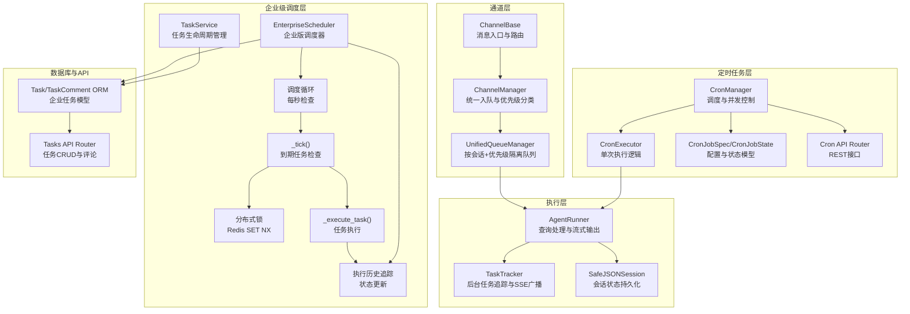
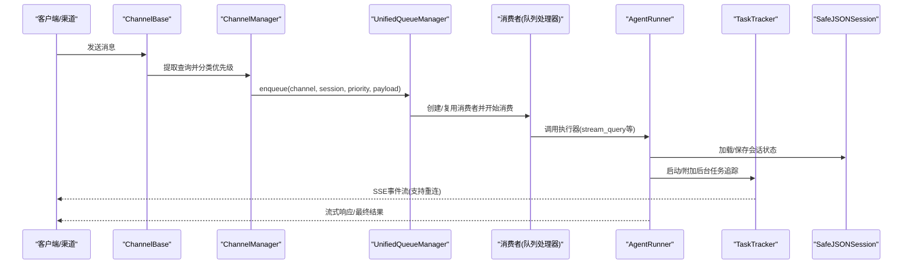
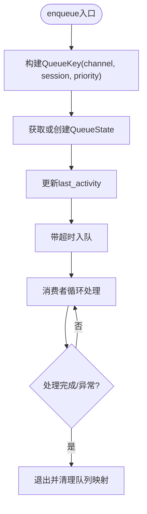
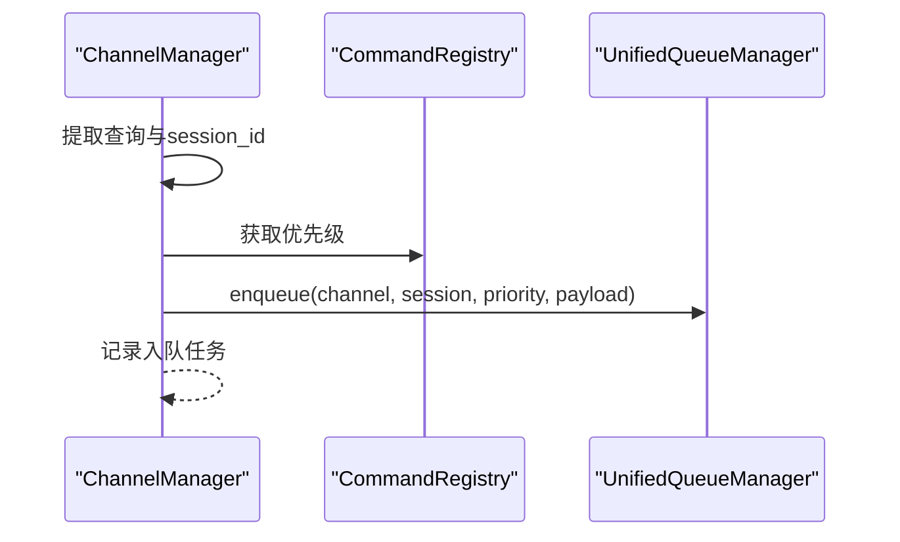
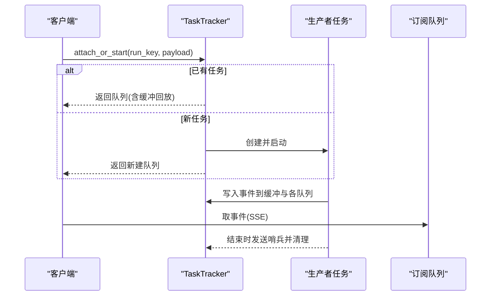
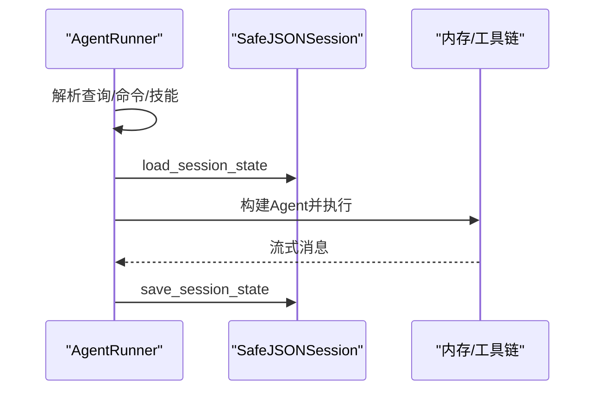
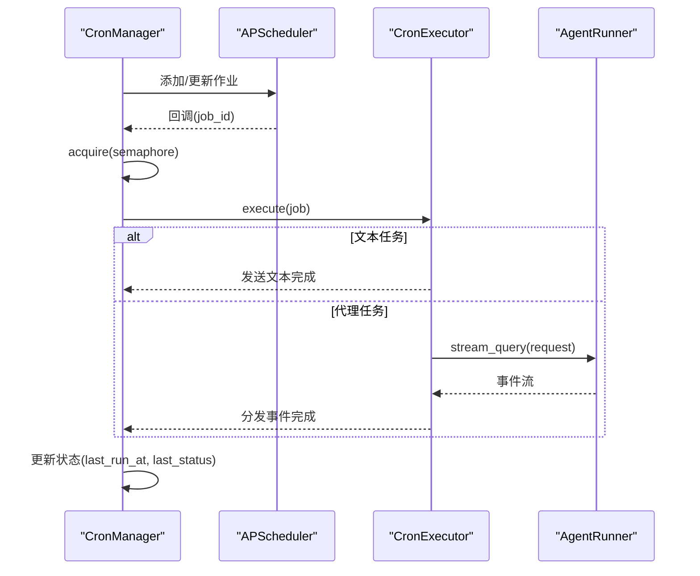
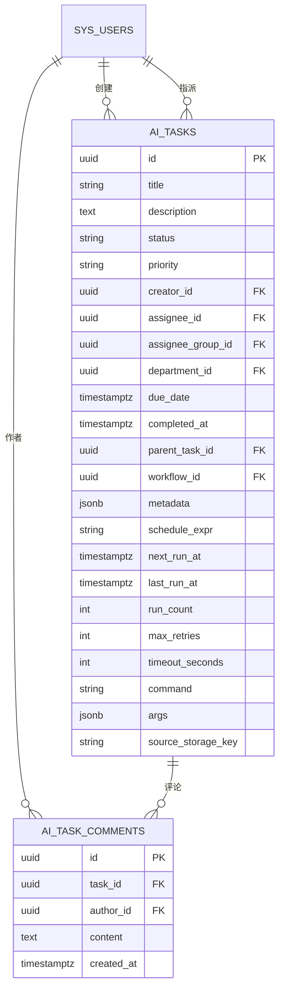
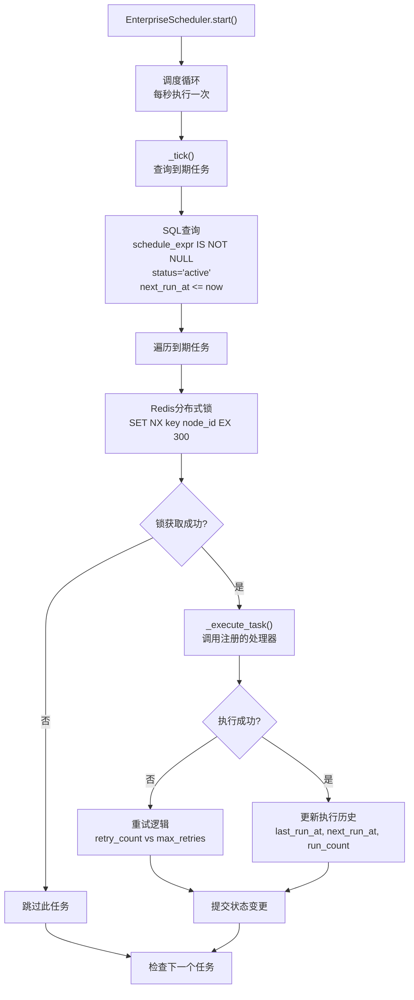
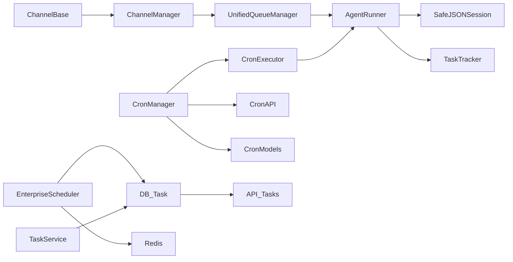

# 任务执行引擎

<cite>
**本文档引用的文件**
- [unified_queue_manager.py](file://src/copaw/app/channels/unified_queue_manager.py)
- [manager.py](file://src/copaw/app/channels/manager.py)
- [base.py](file://src/copaw/app/channels/base.py)
- [runner.py](file://src/copaw/app/runner/runner.py)
- [task_tracker.py](file://src/copaw/app/runner/task_tracker.py)
- [session.py](file://src/copaw/app/runner/session.py)
- [manager.py](file://src/copaw/app/crons/manager.py)
- [executor.py](file://src/copaw/app/crons/executor.py)
- [models.py](file://src/copaw/app/crons/models.py)
- [api.py](file://src/copaw/app/crons/api.py)
- [scheduler.py](file://src/copaw/enterprise/scheduler.py)
- [task_service.py](file://src/copaw/enterprise/task_service.py)
- [task.py](file://src/copaw/db/models/task.py)
- [tasks.py](file://src/copaw/app/routers/tasks.py)
- [007_ai_tasks_scheduling.py](file://alembic/versions/007_ai_tasks_scheduling.py)
</cite>

## 更新摘要
**所做更改**
- 新增企业级任务调度系统章节，详细介绍EnterpriseScheduler的设计与实现
- 更新任务模型章节，包含新的调度字段和企业级任务管理功能
- 增加分布式锁、超时控制、重试机制等企业级特性说明
- 扩展定时任务管理章节，涵盖两种不同的调度器实现

## 目录
1. [引言](#引言)
2. [项目结构](#项目结构)
3. [核心组件](#核心组件)
4. [架构总览](#架构总览)
5. [详细组件分析](#详细组件分析)
6. [企业级任务调度系统](#企业级任务调度系统)
7. [依赖关系分析](#依赖关系分析)
8. [性能考虑](#性能考虑)
9. [故障排查指南](#故障排查指南)
10. [结论](#结论)
11. [附录](#附录)

## 引言
本文件面向Copaw任务执行引擎，系统性阐述异步任务处理的高层设计与实现细节，覆盖任务调度、执行、监控、回收的完整流程；详解任务队列管理、优先级调度、并发控制；解释任务生命周期管理、状态跟踪与错误恢复机制；并给出定时任务、后台任务、实时任务的处理策略及性能优化与监控方案。本次更新重点介绍了新增的企业级任务调度系统，包括EnterpriseScheduler和cron任务管理的完整实现。

## 项目结构
任务执行引擎由"通道层-队列层-执行层-会话与追踪层-定时任务层-企业级调度层-数据库与API层"构成，采用事件驱动与异步I/O，确保高并发下的稳定与可观测性。

**图表来源**
- [base.py](file://src/copaw/app/channels/base.py)
- [manager.py](file://src/copaw/app/channels/manager.py)
- [unified_queue_manager.py](file://src/copaw/app/channels/unified_queue_manager.py)
- [runner.py](file://src/copaw/app/runner/runner.py)
- [task_tracker.py](file://src/copaw/app/runner/task_tracker.py)
- [session.py](file://src/copaw/app/runner/session.py)
- [manager.py](file://src/copaw/app/crons/manager.py)
- [executor.py](file://src/copaw/app/crons/executor.py)
- [models.py](file://src/copaw/app/crons/models.py)
- [api.py](file://src/copaw/app/crons/api.py)
- [scheduler.py](file://src/copaw/enterprise/scheduler.py)
- [task_service.py](file://src/copaw/enterprise/task_service.py)
- [task.py](file://src/copaw/db/models/task.py)
- [tasks.py](file://src/copaw/app/routers/tasks.py)

## 核心组件
- 统一队列管理器：基于三元键(渠道, 会话, 优先级)实现严格序列化、并发隔离与动态消费者创建。
- 通道管理器：提取查询文本进行优先级分类，路由到统一队列管理器，并启动任务跟踪。
- 任务追踪器：支持后台任务的多订阅者SSE流、重连缓冲回放、任务生命周期管理。
- 执行器：封装Agent请求处理、会话加载/保存、工具审批、命令路径、错误转译与调试转储。
- 会话管理：安全的JSON会话持久化，跨平台文件名兼容，异步读写避免阻塞。
- 定时任务管理：基于APScheduler的调度器，每任务并发信号量、状态记录、心跳作业。
- **企业级调度器**：基于ai_tasks表的调度字段，实现分布式锁、执行历史追踪、超时控制和重试机制。
- **任务服务**：提供企业级任务的生命周期管理，包括状态转换验证和批量查询功能。
- 数据模型与API：企业任务与评论的ORM模型与REST接口，支撑任务生命周期与审计。

**章节来源**
- [unified_queue_manager.py](file://src/copaw/app/channels/unified_queue_manager.py)
- [manager.py](file://src/copaw/app/channels/manager.py)
- [base.py](file://src/copaw/app/channels/base.py)
- [task_tracker.py](file://src/copaw/app/runner/task_tracker.py)
- [runner.py](file://src/copaw/app/runner/runner.py)
- [session.py](file://src/copaw/app/runner/session.py)
- [manager.py](file://src/copaw/app/crons/manager.py)
- [executor.py](file://src/copaw/app/crons/executor.py)
- [models.py](file://src/copaw/app/crons/models.py)
- [scheduler.py](file://src/copaw/enterprise/scheduler.py)
- [task_service.py](file://src/copaw/enterprise/task_service.py)
- [task.py](file://src/copaw/db/models/task.py)
- [tasks.py](file://src/copaw/app/routers/tasks.py)

## 架构总览
整体采用"事件驱动 + 队列隔离 + 并发控制 + 企业级调度"的异步架构。消息从通道入口进入，经优先级分类后入队；每个QueueKey拥有独立消费者；执行器负责实际业务处理；后台任务通过TaskTracker进行流式广播与状态维护；定时任务通过CronManager调度与并发限制；企业级调度器通过EnterpriseScheduler实现分布式任务执行；数据库与API提供持久化与外部交互。

**图表来源**
- [base.py](file://src/copaw/app/channels/base.py)
- [manager.py](file://src/copaw/app/channels/manager.py)
- [unified_queue_manager.py](file://src/copaw/app/channels/unified_queue_manager.py)
- [runner.py](file://src/copaw/app/runner/runner.py)
- [task_tracker.py](file://src/copaw/app/runner/task_tracker.py)
- [session.py](file://src/copaw/app/runner/session.py)

## 详细组件分析

### 统一队列管理器（UnifiedQueueManager）
- 设计要点
  - QueueKey = (channel_id, session_id, priority_level)，确保同一QueueKey内严格序列化，不同QueueKey并发隔离。
  - 动态消费者：首次入队时创建消费者任务，避免固定工作池带来的资源浪费。
  - 空闲清理：定期扫描空闲队列并取消对应消费者，降低内存与CPU占用。
  - 指标采集：提供队列数量、大小、处理计数、年龄与空闲时长等监控指标。
- 关键流程
  - 入队：计算QueueKey，获取或创建队列与消费者，带超时的入队操作，记录活动时间。
  - 消费：委托给注册的消费者函数，异常捕获与日志记录，退出时清理队列映射。
  - 清理：后台循环检查空闲队列，超过阈值则取消消费者并移除状态。
  - 并发：通过增量processed_count与last_activity，便于上层统计与限速。

**图表来源**
- [unified_queue_manager.py](file://src/copaw/app/channels/unified_queue_manager.py)

**章节来源**
- [unified_queue_manager.py](file://src/copaw/app/channels/unified_queue_manager.py)

### 通道管理与优先级路由（ChannelManager）
- 设计要点
  - 从payload中提取查询文本，交由命令注册表获取优先级等级。
  - 从通道实例中提取标准化session_id。
  - 将消息路由至UnifiedQueueManager，同时创建带超时的入队任务，加入集合以便跟踪。
- 关键流程
  - 提取查询与session_id。
  - 计算优先级。
  - 异步入队并登记任务。

**图表来源**
- [manager.py](file://src/copaw/app/channels/manager.py)

**章节来源**
- [manager.py](file://src/copaw/app/channels/manager.py)

### 任务追踪与SSE广播（TaskTracker）
- 设计要点
  - 每个run_key（通常为chat_id）维护一个运行状态，包含任务Future、订阅者队列列表与事件缓冲。
  - 支持attach/attach_or_start：已有任务则重连回放缓冲，否则启动新任务。
  - 流式生成SSE事件，异常时注入错误事件，完成后发送哨兵并清理。
  - 提供状态查询、活跃任务列表、等待全部完成、请求停止等能力。
- 关键流程
  - attach_or_start：若任务未完成则复用，否则创建生产者任务。
  - 生产者：遍历stream_fn产出的事件，写入缓冲与所有订阅队列。
  - 消费者：从队列取出事件，直至收到哨兵或取消。

**图表来源**
- [task_tracker.py](file://src/copaw/app/runner/task_tracker.py)

**章节来源**
- [task_tracker.py](file://src/copaw/app/runner/task_tracker.py)

### 执行器与会话管理（AgentRunner + SafeJSONSession）
- 设计要点
  - AgentRunner封装查询处理：解析技能调用、命令路径、工具审批、会话加载/保存、流式输出、异常转换与调试转储。
  - SafeJSONSession提供跨平台文件名安全的JSON会话持久化，使用异步文件I/O避免阻塞。
- 关键流程
  - 查询处理：解析最后一条用户消息，判定是否为命令或技能调用；加载Agent与会话；流式输出消息；最终保存会话。
  - 会话管理：根据session_id与user_id生成安全文件名，异步读写JSON状态。

**图表来源**
- [runner.py](file://src/copaw/app/runner/runner.py)
- [session.py](file://src/copaw/app/runner/session.py)

**章节来源**
- [runner.py](file://src/copaw/app/runner/runner.py)
- [session.py](file://src/copaw/app/runner/session.py)

### 定时任务调度与执行（CronManager + CronExecutor）
- 设计要点
  - CronManager基于APScheduler调度，每任务持有并发信号量，支持暂停/恢复/重调度心跳作业。
  - CronExecutor负责单次执行：文本任务直接发送，代理任务通过runner.stream_query流式输出并分发到指定渠道。
  - 任务状态记录：成功/失败/运行中/取消，包含最近一次运行时间与错误信息。
- 关键流程
  - 注册/更新：校验触发器，初始化每任务并发信号量，添加到调度器，更新状态。
  - 触发回调：在信号量保护下执行，记录状态与错误，刷新下次运行时间。
  - 单次执行：根据任务类型选择文本或代理执行路径，设置超时与取消处理。

**图表来源**
- [manager.py](file://src/copaw/app/crons/manager.py)
- [executor.py](file://src/copaw/app/crons/executor.py)
- [runner.py](file://src/copaw/app/runner/runner.py)

**章节来源**
- [manager.py](file://src/copaw/app/crons/manager.py)
- [executor.py](file://src/copaw/app/crons/executor.py)
- [models.py](file://src/copaw/app/crons/models.py)
- [api.py](file://src/copaw/app/crons/api.py)

### 企业任务模型与API（Task/TaskComment ORM + Tasks API）
- 设计要点
  - Task模型支持标题、描述、状态、优先级、指派对象、截止时间、父任务、工作流与元数据。
  - **新增调度字段**：schedule_expr（Cron表达式）、next_run_at（下次执行时间）、last_run_at（上次执行时间）、run_count（执行次数）、max_retries（最大重试次数）、timeout_seconds（超时时间）、command（执行命令）、args（命令参数）、source_storage_key（jobs.json存储键）。
  - TaskComment模型支持对任务的评论与作者信息。
  - Tasks API提供分页查询、创建、更新、状态变更、删除、评论列表与新增。
- 关键流程
  - 列表/详情：按过滤条件查询并返回聚合数据。
  - 状态变更：服务层校验状态转换合法性并持久化。
  - 审计日志：对关键操作记录审计事件。

**图表来源**
- [task.py](file://src/copaw/db/models/task.py)
- [007_ai_tasks_scheduling.py](file://alembic/versions/007_ai_tasks_scheduling.py)

**章节来源**
- [task.py](file://src/copaw/db/models/task.py)
- [tasks.py](file://src/copaw/app/routers/tasks.py)

## 企业级任务调度系统

### EnterpriseScheduler 设计与实现
EnterpriseScheduler是Copaw企业级任务调度系统的核心组件，基于ai_tasks表的调度字段和croniter库实现，提供分布式锁、执行历史追踪、超时控制和重试机制。

#### 核心特性
- **分布式锁**：使用Redis SET NX防止多节点重复执行相同任务
- **执行历史追踪**：自动更新last_run_at、next_run_at、run_count等状态字段
- **超时控制**：基于任务元数据的timeout_seconds配置
- **重试机制**：支持最大重试次数配置，失败时自动重试
- **节点标识**：自动生成唯一node_id，便于分布式环境识别

#### 关键方法
- `register_task(task_id, handler)`：注册任务处理器
- `start()`：启动调度循环（每秒检查一次）
- `stop()`：停止调度循环
- `_tick()`：检查到期任务并执行
- `_execute_task(task)`：执行单个任务

**图表来源**
- [scheduler.py](file://src/copaw/enterprise/scheduler.py)

**章节来源**
- [scheduler.py](file://src/copaw/enterprise/scheduler.py)

### 任务服务与生命周期管理
TaskService提供企业级任务的完整生命周期管理，包括状态转换验证和批量查询功能。

#### 状态转换规则
- pending → in_progress, cancelled
- in_progress → completed, blocked, cancelled  
- blocked → in_progress, cancelled
- completed → 无（终止状态）
- cancelled → 无（终止状态）

#### 核心功能
- `create()`：创建新任务，支持多种指派方式
- `update_status()`：安全的状态转换更新
- `list_tasks()`：支持多维度过滤的批量查询
- `add_comment()`：为任务添加评论

**章节来源**
- [task_service.py](file://src/copaw/enterprise/task_service.py)

## 依赖关系分析
- 通道层依赖队列层，队列层依赖消费者函数签名，消费者函数委托执行器。
- 执行器依赖会话管理与任务追踪，二者共同保障任务生命周期与状态一致性。
- 定时任务层依赖执行器与通道管理器，形成"计划-执行-分发"的闭环。
- **企业级调度层**独立于传统定时任务，直接操作数据库任务表，实现分布式调度。
- 数据层与API层为任务提供持久化与外部访问能力。

**图表来源**
- [base.py](file://src/copaw/app/channels/base.py)
- [manager.py](file://src/copaw/app/channels/manager.py)
- [unified_queue_manager.py](file://src/copaw/app/channels/unified_queue_manager.py)
- [runner.py](file://src/copaw/app/runner/runner.py)
- [session.py](file://src/copaw/app/runner/session.py)
- [task_tracker.py](file://src/copaw/app/runner/task_tracker.py)
- [manager.py](file://src/copaw/app/crons/manager.py)
- [executor.py](file://src/copaw/app/crons/executor.py)
- [models.py](file://src/copaw/app/crons/models.py)
- [api.py](file://src/copaw/app/crons/api.py)
- [scheduler.py](file://src/copaw/enterprise/scheduler.py)
- [task_service.py](file://src/copaw/enterprise/task_service.py)
- [task.py](file://src/copaw/db/models/task.py)
- [tasks.py](file://src/copaw/app/routers/tasks.py)

**章节来源**
- [base.py](file://src/copaw/app/channels/base.py)
- [manager.py](file://src/copaw/app/channels/manager.py)
- [unified_queue_manager.py](file://src/copaw/app/channels/unified_queue_manager.py)
- [runner.py](file://src/copaw/app/runner/runner.py)
- [session.py](file://src/copaw/app/runner/session.py)
- [task_tracker.py](file://src/copaw/app/runner/task_tracker.py)
- [manager.py](file://src/copaw/app/crons/manager.py)
- [executor.py](file://src/copaw/app/crons/executor.py)
- [models.py](file://src/copaw/app/crons/models.py)
- [api.py](file://src/copaw/app/crons/api.py)
- [scheduler.py](file://src/copaw/enterprise/scheduler.py)
- [task_service.py](file://src/copaw/enterprise/task_service.py)
- [task.py](file://src/copaw/db/models/task.py)
- [tasks.py](file://src/copaw/app/routers/tasks.py)

## 性能考虑
- 队列隔离与动态消费者
  - 通过QueueKey实现严格的序列化与并发隔离，避免全局锁争用；消费者按需创建，减少常驻开销。
- 并发控制
  - UnifiedQueueManager的processed_count与last_activity可用于上层限速与统计；CronManager为每任务提供信号量，防止过载。
- I/O非阻塞
  - TaskTracker使用无界队列承载订阅者，但建议在上游限流或背压策略以避免内存膨胀；SafeJSONSession采用异步文件I/O，降低磁盘阻塞风险。
- 超时与取消
  - CronExecutor与CronManager均设置超时与取消处理，避免僵尸任务；UnifiedQueueManager入队带超时，防止无限阻塞。
- **企业级调度优化**
  - EnterpriseScheduler每秒轮询检查，使用Redis分布式锁避免重复执行；支持超时控制和重试机制。
  - 数据库索引优化：ai_tasks表的schedule_expr和next_run_at字段建立索引，提高查询性能。
- 监控与清理
  - UnifiedQueueManager提供指标查询；CronManager记录状态与错误；EnterpriseScheduler记录执行历史；定期清理空闲队列与心跳作业，保持系统轻量。

## 故障排查指南
- 队列积压与超时
  - 现象：入队超时日志、队列满。
  - 排查：检查队列大小与清理间隔，确认消费者处理速度；必要时提升队列上限或增加消费者。
- 任务卡死或无法停止
  - 现象：任务长时间运行、无法取消。
  - 排查：使用TaskTracker的request_stop尝试取消；检查AgentRunner的取消处理与会话保存逻辑。
- 定时任务失败
  - 现象：状态为error，日志记录异常。
  - 排查：查看CronManager的状态更新与错误推送；核对CronExecutor的超时与取消分支；检查通道分发目标与会话ID。
- **企业级调度问题**
  - 现象：任务未执行或重复执行。
  - 排查：检查Redis连接和分布式锁状态；验证ai_tasks表的调度字段配置；确认任务状态转换逻辑。
  - 现象：超时或重试过多。
  - 排查：调整timeout_seconds配置；检查任务处理器的执行效率；验证max_retries设置。
- 会话状态异常
  - 现象：会话加载失败或状态不一致。
  - 排查：检查SafeJSONSession的文件路径与权限；确认跨平台文件名安全；查看AgentRunner的会话保存时机。

**章节来源**
- [unified_queue_manager.py](file://src/copaw/app/channels/unified_queue_manager.py)
- [task_tracker.py](file://src/copaw/app/runner/task_tracker.py)
- [runner.py](file://src/copaw/app/runner/runner.py)
- [manager.py](file://src/copaw/app/crons/manager.py)
- [executor.py](file://src/copaw/app/crons/executor.py)
- [session.py](file://src/copaw/app/runner/session.py)
- [scheduler.py](file://src/copaw/enterprise/scheduler.py)

## 结论
Copaw任务执行引擎以"通道-队列-执行-追踪-调度-企业级调度-持久化"为主线，构建了高并发、强隔离、可观测的任务处理体系。通过统一队列管理、任务追踪与SSE广播、定时任务并发控制与状态记录、企业级任务调度与分布式锁、以及企业任务模型与API，实现了从实时消息到定时任务再到后台任务的全栈支持。新增的企业级调度系统进一步增强了系统的分布式处理能力和可靠性，配合监控指标与清理策略，可在复杂场景下保持稳定与高效。

## 附录
- 处理策略概览
  - 实时任务：通道入口直通队列，严格序列化，流式响应。
  - 后台任务：TaskTracker统一管理，支持重连与缓冲回放。
  - 定时任务：CronManager调度，每任务并发信号量，状态持久化。
  - **企业级任务**：EnterpriseScheduler分布式调度，支持超时控制、重试机制和执行历史追踪。
- 建议
  - 在高并发场景下，结合processed_count与last_activity实施上层限速。
  - 对长耗时任务设置合理超时与取消策略，避免资源泄露。
  - 使用CronManager的状态与错误推送，完善前端可视化与告警。
  - **企业级调度建议**：合理配置Redis分布式锁超时时间，监控任务执行成功率，定期清理历史执行记录。