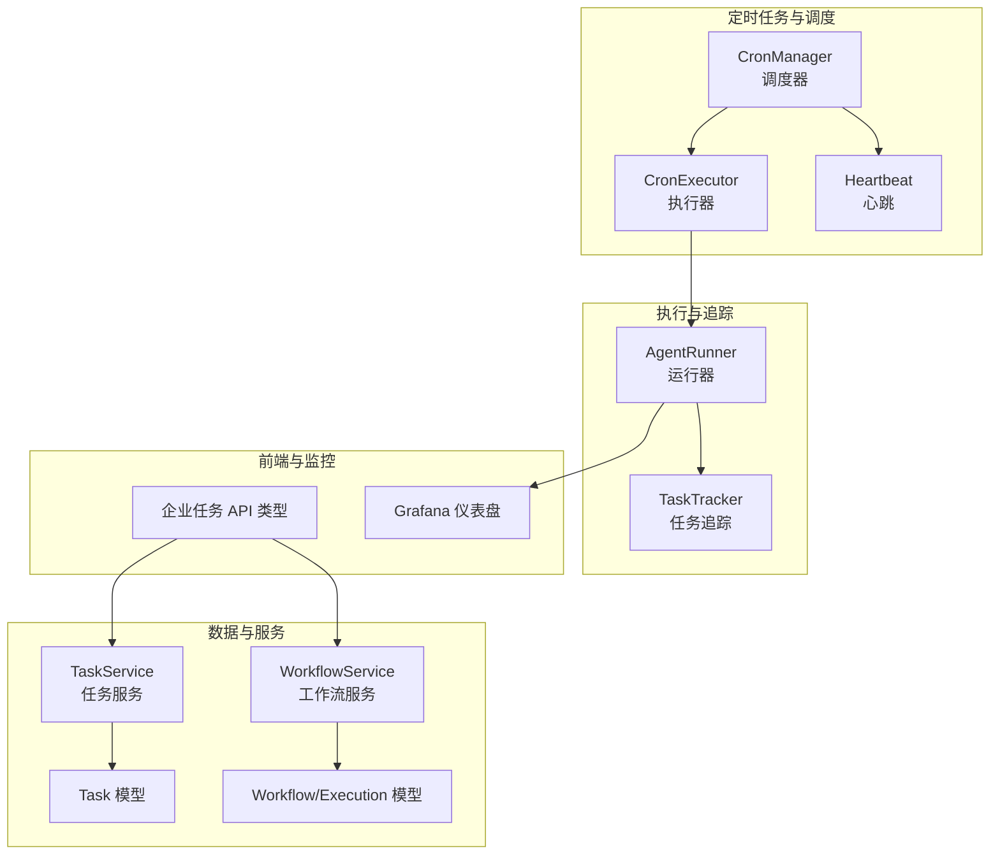
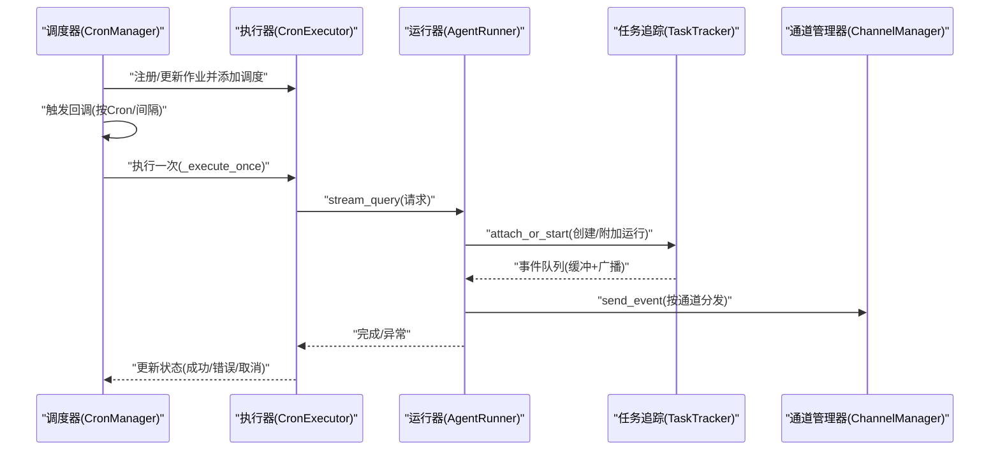
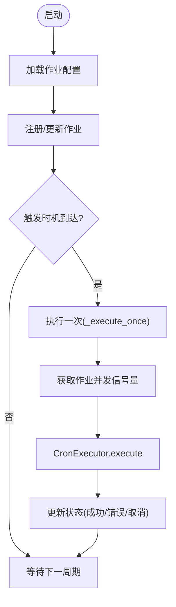
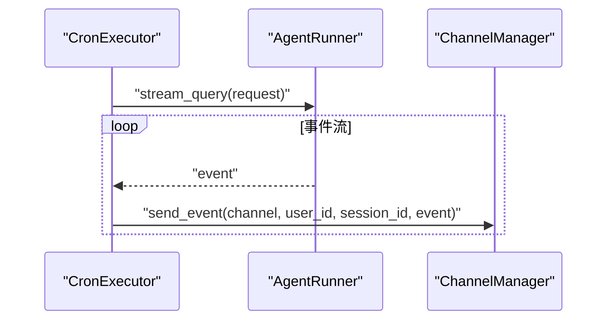
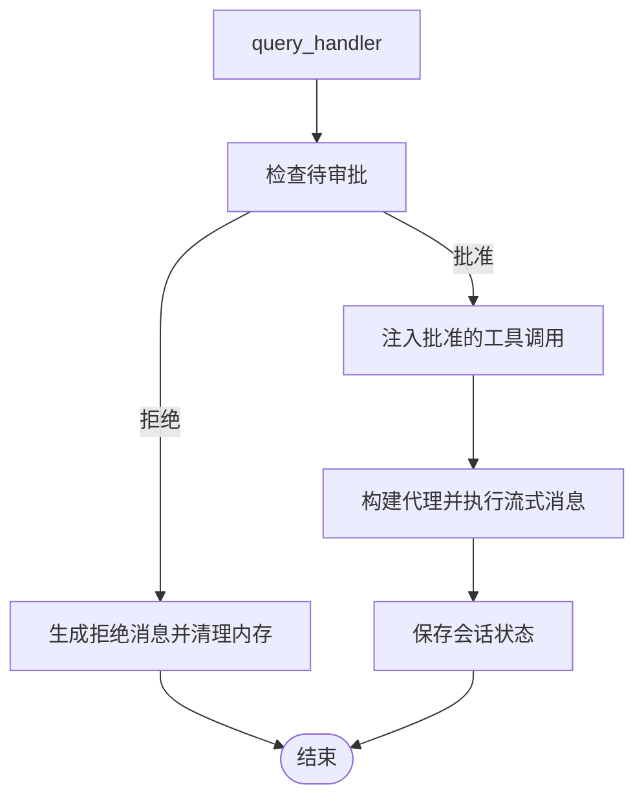
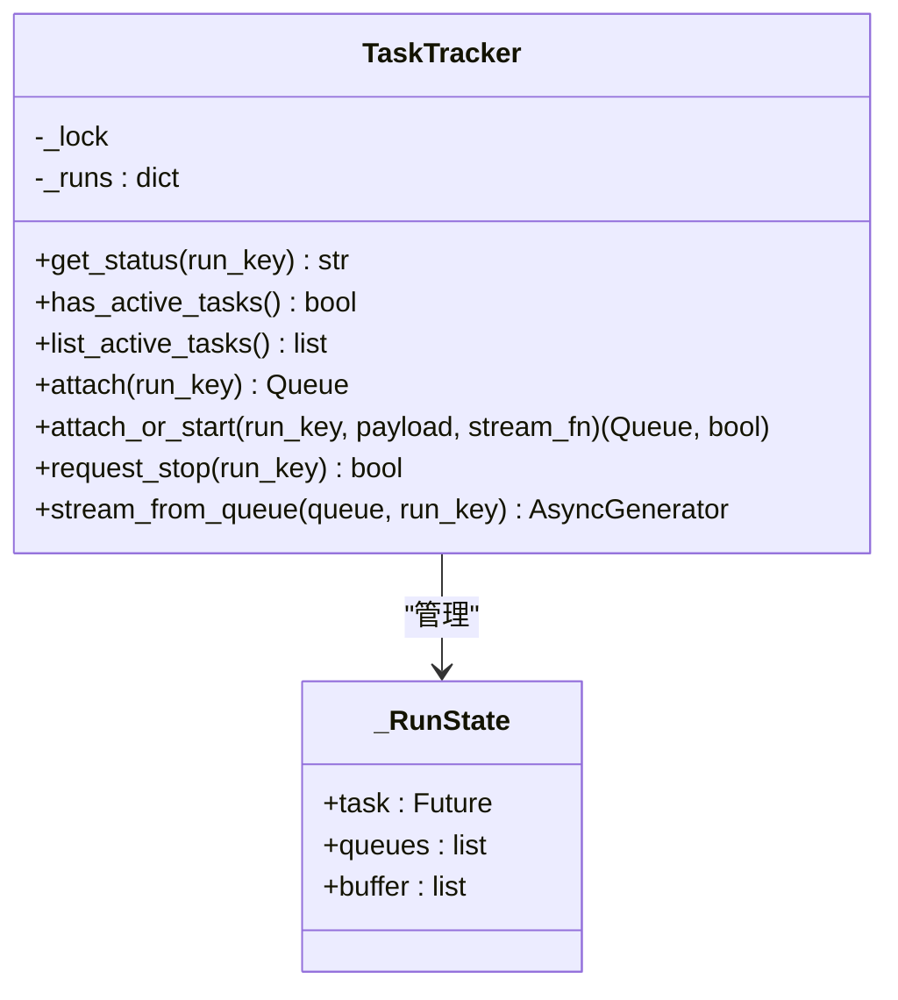
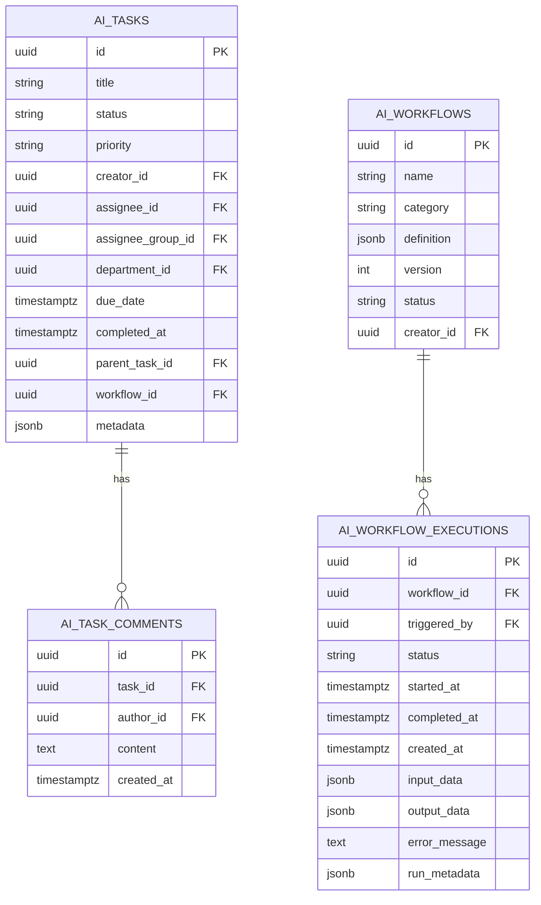
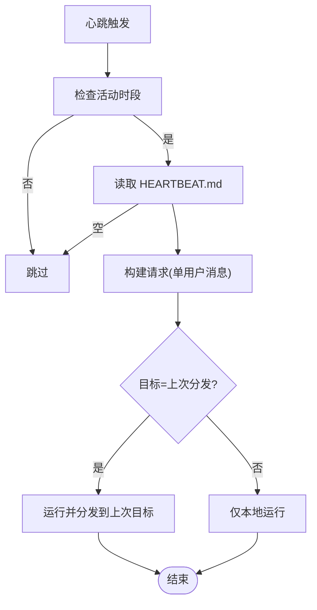
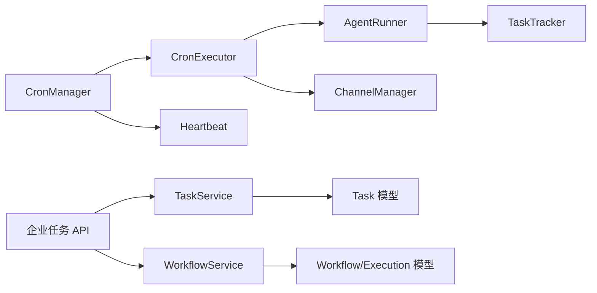

# 任务调度

<cite>
**本文引用的文件**
- [src/copaw/app/crons/manager.py](file://src/copaw/app/crons/manager.py)
- [src/copaw/app/crons/executor.py](file://src/copaw/app/crons/executor.py)
- [src/copaw/app/crons/models.py](file://src/copaw/app/crons/models.py)
- [src/copaw/app/crons/heartbeat.py](file://src/copaw/app/crons/heartbeat.py)
- [src/copaw/app/runner/runner.py](file://src/copaw/app/runner/runner.py)
- [src/copaw/app/runner/task_tracker.py](file://src/copaw/app/runner/task_tracker.py)
- [src/copaw/db/models/task.py](file://src/copaw/db/models/task.py)
- [src/copaw/db/models/workflow.py](file://src/copaw/db/models/workflow.py)
- [src/copaw/enterprise/task_service.py](file://src/copaw/enterprise/task_service.py)
- [src/copaw/enterprise/workflow_service.py](file://src/copaw/enterprise/workflow_service.py)
- [src/copaw/app/workspace/workspace.py](file://src/copaw/app/workspace/workspace.py)
- [console/src/api/modules/enterprise-tasks.ts](file://console/src/api/modules/enterprise-tasks.ts)
- [deploy/monitoring/grafana_dashboard.json](file://deploy/monitoring/grafana_dashboard.json)
- [src/copaw/cli/task_cmd.py](file://src/copaw/cli/task_cmd.py)
</cite>

## 目录
1. [简介](#简介)
2. [项目结构](#项目结构)
3. [核心组件](#核心组件)
4. [架构总览](#架构总览)
5. [详细组件分析](#详细组件分析)
6. [依赖分析](#依赖分析)
7. [性能考虑](#性能考虑)
8. [故障排查指南](#故障排查指南)
9. [结论](#结论)
10. [附录](#附录)

## 简介
本技术文档围绕任务调度系统，系统性阐述任务队列管理、优先级调度、负载均衡、任务分类与路由、执行策略、依赖管理、并发控制与资源分配，并提供监控、性能分析与容量规划方法，以及优化策略与故障诊断技巧。文档以代码为依据，结合前端 API 类型定义与部署监控配置，帮助读者从架构到实现细节全面理解系统。

## 项目结构
任务调度能力由“定时任务（Cron）+ 执行器 + 运行器 + 任务追踪 + 数据模型 + 企业服务层”构成，贯穿后端服务编排、任务生命周期管理与可观测性。

图表来源
- [src/copaw/app/crons/manager.py:38-110](file://src/copaw/app/crons/manager.py#L38-L110)
- [src/copaw/app/crons/executor.py:13-90](file://src/copaw/app/crons/executor.py#L13-L90)
- [src/copaw/app/crons/heartbeat.py:119-213](file://src/copaw/app/crons/heartbeat.py#L119-L213)
- [src/copaw/app/runner/runner.py:70-120](file://src/copaw/app/runner/runner.py#L70-L120)
- [src/copaw/app/runner/task_tracker.py:30-110](file://src/copaw/app/runner/task_tracker.py#L30-L110)
- [src/copaw/db/models/task.py:23-112](file://src/copaw/db/models/task.py#L23-L112)
- [src/copaw/db/models/workflow.py:19-148](file://src/copaw/db/models/workflow.py#L19-L148)
- [src/copaw/enterprise/task_service.py:25-131](file://src/copaw/enterprise/task_service.py#L25-L131)
- [src/copaw/enterprise/workflow_service.py:76-145](file://src/copaw/enterprise/workflow_service.py#L76-L145)
- [console/src/api/modules/enterprise-tasks.ts:1-56](file://console/src/api/modules/enterprise-tasks.ts#L1-L56)
- [deploy/monitoring/grafana_dashboard.json:1-146](file://deploy/monitoring/grafana_dashboard.json#L1-L146)

章节来源
- [src/copaw/app/crons/manager.py:38-110](file://src/copaw/app/crons/manager.py#L38-L110)
- [src/copaw/app/crons/executor.py:13-90](file://src/copaw/app/crons/executor.py#L13-L90)
- [src/copaw/app/crons/heartbeat.py:119-213](file://src/copaw/app/crons/heartbeat.py#L119-L213)
- [src/copaw/app/runner/runner.py:70-120](file://src/copaw/app/runner/runner.py#L70-L120)
- [src/copaw/app/runner/task_tracker.py:30-110](file://src/copaw/app/runner/task_tracker.py#L30-L110)
- [src/copaw/db/models/task.py:23-112](file://src/copaw/db/models/task.py#L23-L112)
- [src/copaw/db/models/workflow.py:19-148](file://src/copaw/db/models/workflow.py#L19-L148)
- [src/copaw/enterprise/task_service.py:25-131](file://src/copaw/enterprise/task_service.py#L25-L131)
- [src/copaw/enterprise/workflow_service.py:76-145](file://src/copaw/enterprise/workflow_service.py#L76-L145)
- [console/src/api/modules/enterprise-tasks.ts:1-56](file://console/src/api/modules/enterprise-tasks.ts#L1-L56)
- [deploy/monitoring/grafana_dashboard.json:1-146](file://deploy/monitoring/grafana_dashboard.json#L1-L146)

## 核心组件
- 调度器（CronManager）
  - 基于 APScheduler 的异步调度器，支持按 Cron 表达式与间隔表达式调度；内置并发信号量控制每作业最大并发；维护作业状态（下一次运行、最近运行、状态与错误）。
- 执行器（CronExecutor）
  - 将作业转换为请求，调用运行器执行，或直接发送文本消息至指定通道；支持超时控制与取消。
- 运行器（AgentRunner）
  - 面向代理的查询执行器，负责加载会话、构建环境上下文、注入 MCP 客户端、执行消息流并持久化会话状态；支持工具审批、命令路径与技能注入。
- 任务追踪（TaskTracker）
  - 支持多订阅者事件流（SSE），提供重连回放、缓冲区、取消与清理；保障后台任务的可观察与可恢复。
- 数据模型与服务
  - Task/TaskComment：企业任务与评论，支持状态机迁移、优先级、指派、截止日期、元数据与父子任务。
  - Workflow/WorkflowExecution：工作流定义与执行实例，支持状态、输入输出、错误与运行元数据。
  - TaskService/WorkflowService：任务与工作流的服务层，封装创建、列表、状态更新、执行启动与完成等业务逻辑。
- 心跳（Heartbeat）
  - 周期性读取 HEARTBEAT.md 并以用户消息形式运行代理，支持“上次分发目标”自动回传或仅本地运行。
- 前端类型与监控
  - 企业任务 API 类型定义任务字段与分页参数；Grafana 仪表盘展示租户用量与技能使用分布；CLI 提供任务执行耗时与令牌用量统计。

章节来源
- [src/copaw/app/crons/manager.py:38-110](file://src/copaw/app/crons/manager.py#L38-L110)
- [src/copaw/app/crons/executor.py:13-90](file://src/copaw/app/crons/executor.py#L13-L90)
- [src/copaw/app/runner/runner.py:70-120](file://src/copaw/app/runner/runner.py#L70-L120)
- [src/copaw/app/runner/task_tracker.py:30-110](file://src/copaw/app/runner/task_tracker.py#L30-L110)
- [src/copaw/db/models/task.py:23-112](file://src/copaw/db/models/task.py#L23-L112)
- [src/copaw/db/models/workflow.py:19-148](file://src/copaw/db/models/workflow.py#L19-L148)
- [src/copaw/enterprise/task_service.py:25-131](file://src/copaw/enterprise/task_service.py#L25-L131)
- [src/copaw/enterprise/workflow_service.py:76-145](file://src/copaw/enterprise/workflow_service.py#L76-L145)
- [src/copaw/app/crons/heartbeat.py:119-213](file://src/copaw/app/crons/heartbeat.py#L119-L213)
- [console/src/api/modules/enterprise-tasks.ts:1-56](file://console/src/api/modules/enterprise-tasks.ts#L1-L56)
- [deploy/monitoring/grafana_dashboard.json:1-146](file://deploy/monitoring/grafana_dashboard.json#L1-L146)
- [src/copaw/cli/task_cmd.py:122-158](file://src/copaw/cli/task_cmd.py#L122-L158)

## 架构总览
调度系统采用“配置驱动 + 异步并发 + 事件流”的设计：CronManager 读取作业配置，构建 APScheduler 触发器并注册回调；回调通过 CronExecutor 将作业转换为请求交由 AgentRunner 执行；AgentRunner 使用 TaskTracker 提供的事件流能力，将中间结果与最终结果通过通道分发；数据层通过 Task/Workflow 模型与服务层进行持久化与状态管理；前端通过 API 类型定义访问任务与工作流；监控通过 Prometheus 指标与 Grafana 可视化呈现。

图表来源
- [src/copaw/app/crons/manager.py:316-387](file://src/copaw/app/crons/manager.py#L316-L387)
- [src/copaw/app/crons/executor.py:18-90](file://src/copaw/app/crons/executor.py#L18-L90)
- [src/copaw/app/runner/runner.py:349-589](file://src/copaw/app/runner/runner.py#L349-L589)
- [src/copaw/app/runner/task_tracker.py:142-208](file://src/copaw/app/runner/task_tracker.py#L142-L208)

## 详细组件分析

### 组件一：CronManager（调度器）
- 职责
  - 加载作业配置，注册 APScheduler 作业；根据启用状态与并发限制设置信号量；维护作业状态（下次运行、最近运行、状态与错误）。
  - 支持心跳作业的动态启停与重新调度。
- 关键点
  - Cron 表达式规范化与 5 字段校验；秒字段不支持。
  - 每作业独立并发信号量，避免过载。
  - 失败回调统一记录日志并通过控制台推送错误提示。
- 并发与容错
  - 通过 asyncio.Semaphore 控制每作业最大并发；异常捕获并记录，不影响其他作业。
  - misfire_grace_seconds 控制错失触发的宽限时间。

图表来源
- [src/copaw/app/crons/manager.py:63-110](file://src/copaw/app/crons/manager.py#L63-L110)
- [src/copaw/app/crons/manager.py:242-272](file://src/copaw/app/crons/manager.py#L242-L272)
- [src/copaw/app/crons/manager.py:349-387](file://src/copaw/app/crons/manager.py#L349-L387)

章节来源
- [src/copaw/app/crons/manager.py:38-110](file://src/copaw/app/crons/manager.py#L38-L110)
- [src/copaw/app/crons/manager.py:242-272](file://src/copaw/app/crons/manager.py#L242-L272)
- [src/copaw/app/crons/manager.py:349-387](file://src/copaw/app/crons/manager.py#L349-L387)

### 组件二：CronExecutor（执行器）
- 职责
  - 将作业转换为请求，支持“文本”和“代理”两类任务类型；代理类型通过运行器流式执行并逐事件分发。
- 关键点
  - 文本类型：直接通过通道发送固定文本。
  - 代理类型：构造 AgentRequest，设置 user_id/session_id，流式获取事件并发送至通道；支持超时控制。
- 路由与分发
  - 依据作业的分发目标（通道、会话、模式）将事件推送到对应渠道。

图表来源
- [src/copaw/app/crons/executor.py:18-90](file://src/copaw/app/crons/executor.py#L18-L90)

章节来源
- [src/copaw/app/crons/executor.py:13-90](file://src/copaw/app/crons/executor.py#L13-L90)

### 组件三：AgentRunner（运行器）
- 职责
  - 加载代理配置、构建环境上下文、注入 MCP 客户端、执行消息流；保存/恢复会话状态；处理工具审批与命令路径。
- 关键点
  - 会话状态加载与保存，确保中断后可恢复。
  - 工具审批超时处理与批准/拒绝路径。
  - 技能注入与命令解析，支持“/技能名”快捷调用。
- 与任务追踪协作
  - 通过 task_tracker 注入，支持后台任务的事件流与重连。

图表来源
- [src/copaw/app/runner/runner.py:349-589](file://src/copaw/app/runner/runner.py#L349-L589)

章节来源
- [src/copaw/app/runner/runner.py:70-120](file://src/copaw/app/runner/runner.py#L70-L120)
- [src/copaw/app/runner/runner.py:349-589](file://src/copaw/app/runner/runner.py#L349-L589)

### 组件四：TaskTracker（任务追踪）
- 职责
  - 维护每个 run_key 的运行状态、事件队列与缓冲；支持订阅重连回放、取消与清理。
- 关键点
  - 无界连接队列，断开自动移除；完成时广播哨兵并清理运行记录。
  - 提供 wait_all_done、list_active_tasks 等运维辅助能力。

图表来源
- [src/copaw/app/runner/task_tracker.py:30-231](file://src/copaw/app/runner/task_tracker.py#L30-L231)

章节来源
- [src/copaw/app/runner/task_tracker.py:30-231](file://src/copaw/app/runner/task_tracker.py#L30-L231)

### 组件五：数据模型与服务（任务与工作流）
- Task/TaskComment
  - 支持状态机迁移（pending/in_progress/blocked/completed/cancelled）、优先级、指派、截止日期、元数据与父子任务；评论级联删除。
- Workflow/WorkflowExecution
  - 支持工作流定义（DAG）、分类（dify/internal）、状态与运行元数据；执行实例记录输入输出与错误。
- TaskService/WorkflowService
  - 提供创建、列表、状态更新、执行启动与完成等操作；工作流执行启动时写入开始时间与输入数据，完成时写入输出与错误并更新状态。

图表来源
- [src/copaw/db/models/task.py:23-151](file://src/copaw/db/models/task.py#L23-L151)
- [src/copaw/db/models/workflow.py:19-148](file://src/copaw/db/models/workflow.py#L19-L148)

章节来源
- [src/copaw/db/models/task.py:23-151](file://src/copaw/db/models/task.py#L23-L151)
- [src/copaw/db/models/workflow.py:19-148](file://src/copaw/db/models/workflow.py#L19-L148)
- [src/copaw/enterprise/task_service.py:25-131](file://src/copaw/enterprise/task_service.py#L25-L131)
- [src/copaw/enterprise/workflow_service.py:76-145](file://src/copaw/enterprise/workflow_service.py#L76-L145)

### 组件六：心跳（Heartbeat）
- 职责
  - 周期性读取 HEARTBEAT.md 内容作为用户消息运行代理；支持“上次分发目标”自动回传或仅本地运行；支持活动时段限制与超时控制。
- 关键点
  - cron/间隔两种触发方式；day_of_week 统一为英文缩写；活动时段基于用户时区判断。

图表来源
- [src/copaw/app/crons/heartbeat.py:119-213](file://src/copaw/app/crons/heartbeat.py#L119-L213)

章节来源
- [src/copaw/app/crons/heartbeat.py:119-213](file://src/copaw/app/crons/heartbeat.py#L119-L213)

### 组件七：前端 API 类型与监控
- 企业任务 API 类型
  - 定义任务字段（状态、优先级、截止日期等）与分页参数，便于前端统一管理任务列表与创建。
- 监控与可视化
  - Grafana 仪表盘展示租户请求速率与技能使用分布；Prometheus 指标暴露在 /metrics。
- CLI 性能指标
  - CLI 任务命令收集执行耗时与令牌用量（输入/输出 tokens、成本 USD）。

章节来源
- [console/src/api/modules/enterprise-tasks.ts:1-56](file://console/src/api/modules/enterprise-tasks.ts#L1-L56)
- [deploy/monitoring/grafana_dashboard.json:1-146](file://deploy/monitoring/grafana_dashboard.json#L1-L146)
- [src/copaw/cli/task_cmd.py:122-158](file://src/copaw/cli/task_cmd.py#L122-L158)

## 依赖分析
- 组件耦合
  - CronManager 依赖 CronExecutor、通道管理器与运行器；CronExecutor 依赖运行器与通道管理器；运行器依赖任务追踪与会话管理；服务层依赖数据库模型。
- 外部依赖
  - APScheduler（异步调度）、通道管理器（事件分发）、数据库（PostgreSQL/JSONB）、Prometheus（指标暴露）。
- 循环依赖
  - 当前模块间未见循环导入；服务层通过 ORM 模型解耦业务逻辑与数据持久化。

图表来源
- [src/copaw/app/crons/manager.py:38-110](file://src/copaw/app/crons/manager.py#L38-L110)
- [src/copaw/app/crons/executor.py:13-90](file://src/copaw/app/crons/executor.py#L13-L90)
- [src/copaw/app/runner/runner.py:70-120](file://src/copaw/app/runner/runner.py#L70-L120)
- [src/copaw/app/runner/task_tracker.py:30-110](file://src/copaw/app/runner/task_tracker.py#L30-L110)
- [src/copaw/db/models/task.py:23-112](file://src/copaw/db/models/task.py#L23-L112)
- [src/copaw/db/models/workflow.py:19-148](file://src/copaw/db/models/workflow.py#L19-L148)
- [src/copaw/enterprise/task_service.py:25-131](file://src/copaw/enterprise/task_service.py#L25-L131)
- [src/copaw/enterprise/workflow_service.py:76-145](file://src/copaw/enterprise/workflow_service.py#L76-L145)
- [console/src/api/modules/enterprise-tasks.ts:1-56](file://console/src/api/modules/enterprise-tasks.ts#L1-L56)

章节来源
- [src/copaw/app/crons/manager.py:38-110](file://src/copaw/app/crons/manager.py#L38-L110)
- [src/copaw/app/crons/executor.py:13-90](file://src/copaw/app/crons/executor.py#L13-L90)
- [src/copaw/app/runner/runner.py:70-120](file://src/copaw/app/runner/runner.py#L70-L120)
- [src/copaw/app/runner/task_tracker.py:30-110](file://src/copaw/app/runner/task_tracker.py#L30-L110)
- [src/copaw/db/models/task.py:23-112](file://src/copaw/db/models/task.py#L23-L112)
- [src/copaw/db/models/workflow.py:19-148](file://src/copaw/db/models/workflow.py#L19-L148)
- [src/copaw/enterprise/task_service.py:25-131](file://src/copaw/enterprise/task_service.py#L25-L131)
- [src/copaw/enterprise/workflow_service.py:76-145](file://src/copaw/enterprise/workflow_service.py#L76-L145)
- [console/src/api/modules/enterprise-tasks.ts:1-56](file://console/src/api/modules/enterprise-tasks.ts#L1-L56)

## 性能考虑
- 并发控制
  - 每作业并发信号量限制，避免单作业拖垮系统；建议按作业类型与资源占用合理设置 max_concurrency。
- 超时与取消
  - 执行器与心跳均设置超时；异常与取消路径清晰，减少资源泄漏。
- 事件流与内存
  - TaskTracker 使用无界队列，需关注订阅端消费速度；建议前端及时消费并断开时清理。
- 监控与指标
  - Grafana 展示租户请求速率与技能使用分布；CLI 输出令牌用量与耗时，便于容量评估。
- I/O 密集优化
  - 通道分发与会话保存为 I/O 密集场景，建议使用异步非阻塞实现并配合连接池。

## 故障排查指南
- 调度器问题
  - Cron 表达式不合法：检查字段数量与 day_of_week 规范化；查看日志中的配置异常。
  - 作业未执行：确认 enabled 状态、misfire_grace_seconds 设置与 APScheduler 作业存在。
- 执行器问题
  - 代理类型作业超时：调整 runtime.timeout_seconds；检查通道分发是否阻塞。
  - 文本类型作业未送达：核对 dispatch.channel 与目标 user_id/session_id。
- 运行器问题
  - 工具审批超时：检查审批超时阈值与前端交互；查看会话内存清理逻辑。
  - 会话状态异常：确认 session.load/save 是否抛出异常；必要时重建会话。
- 任务追踪问题
  - 订阅断开后内存泄漏：确认 stream_from_queue 是否正确移除队列；检查哨兵广播与清理。
- 监控问题
  - /metrics 不可用：确认 Prometheus 指标初始化与端点保护策略；Grafana 查询表达式是否正确。

章节来源
- [src/copaw/app/crons/manager.py:274-293](file://src/copaw/app/crons/manager.py#L274-L293)
- [src/copaw/app/crons/executor.py:75-90](file://src/copaw/app/crons/executor.py#L75-L90)
- [src/copaw/app/runner/runner.py:541-589](file://src/copaw/app/runner/runner.py#L541-L589)
- [src/copaw/app/runner/task_tracker.py:210-231](file://src/copaw/app/runner/task_tracker.py#L210-L231)
- [deploy/monitoring/grafana_dashboard.json:1-146](file://deploy/monitoring/grafana_dashboard.json#L1-L146)

## 结论
该任务调度系统以“配置驱动 + 异步并发 + 事件流”为核心，通过 CronManager/CronExecutor/AgentRunner/TaskTracker 形成闭环，结合 Task/Workflow 模型与服务层实现任务与工作流的全生命周期管理，并辅以前端 API 类型与 Grafana 监控，形成可观测、可扩展、可运维的调度体系。建议在生产环境中合理设置并发与超时、完善告警与日志、持续优化通道与会话 I/O 性能，并基于监控指标进行容量规划与性能调优。

## 附录
- 任务分类与路由
  - 分类：企业任务（Task）、工作流（Workflow）；路由：按作业类型（text/agent）与分发目标（通道/会话）决定执行路径。
- 依赖管理与并发控制
  - 通过状态机约束任务状态迁移；每作业并发信号量；会话状态的加载/保存保证一致性。
- 资源分配
  - 依据作业类型与通道特性分配 CPU/IO 资源；结合监控指标动态扩容。
- 优化策略
  - 合理设置 max_concurrency 与 timeout；优化通道分发与事件流；引入连接池与缓存；定期清理历史任务与会话。
- 故障诊断技巧
  - 关注调度器日志与错误推送；检查执行器超时与取消；验证运行器会话状态；利用 TaskTracker 事件流定位卡顿点。