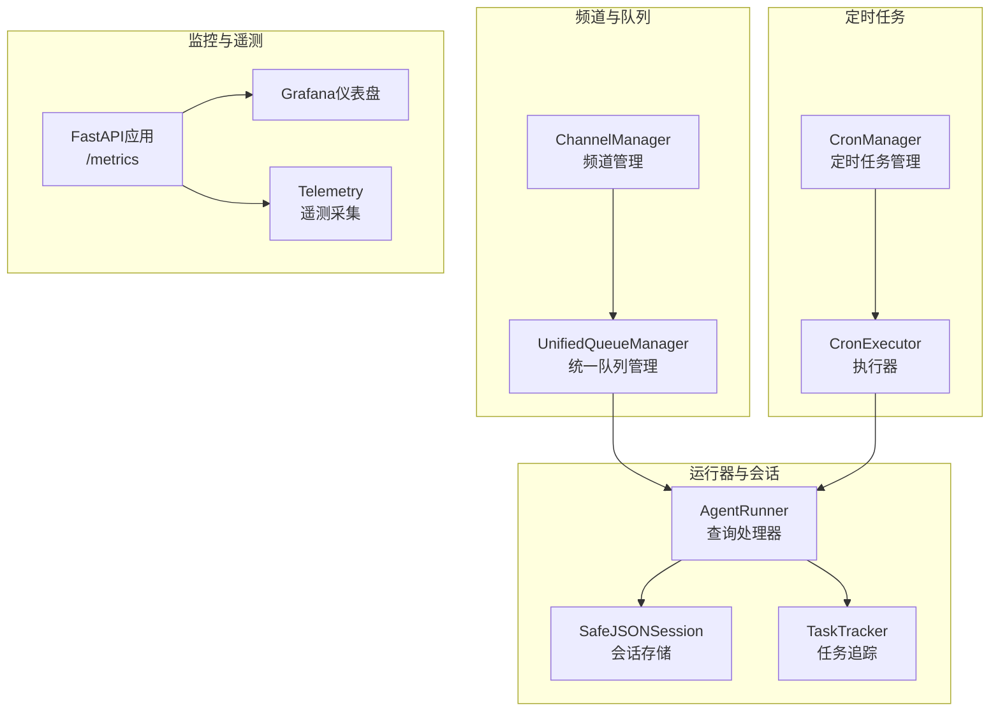
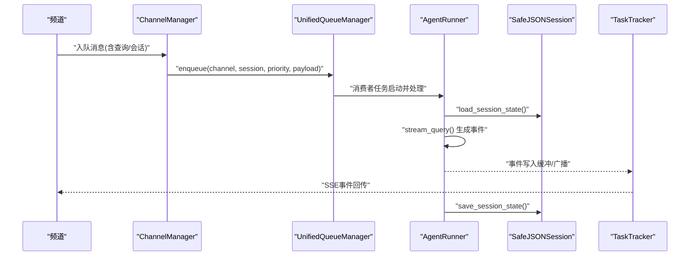
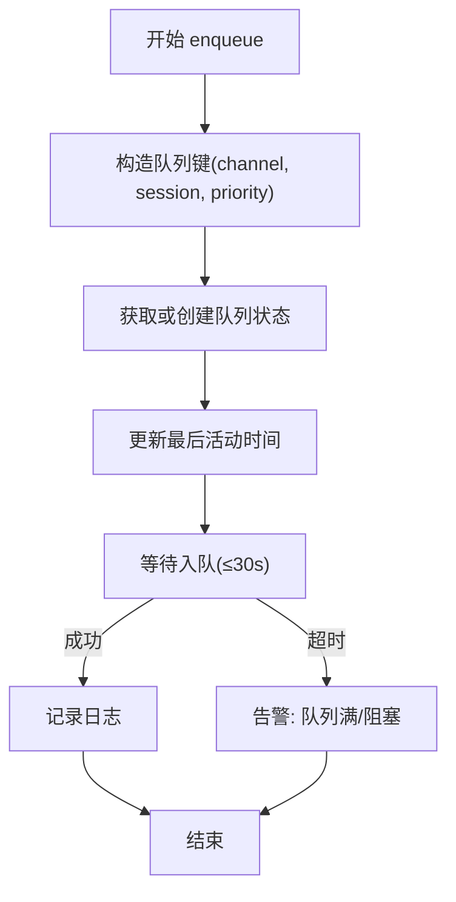
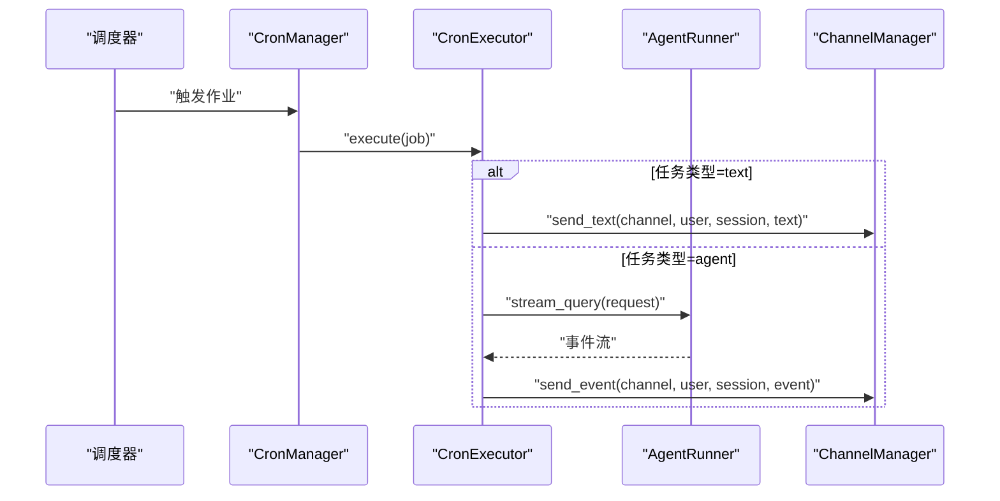
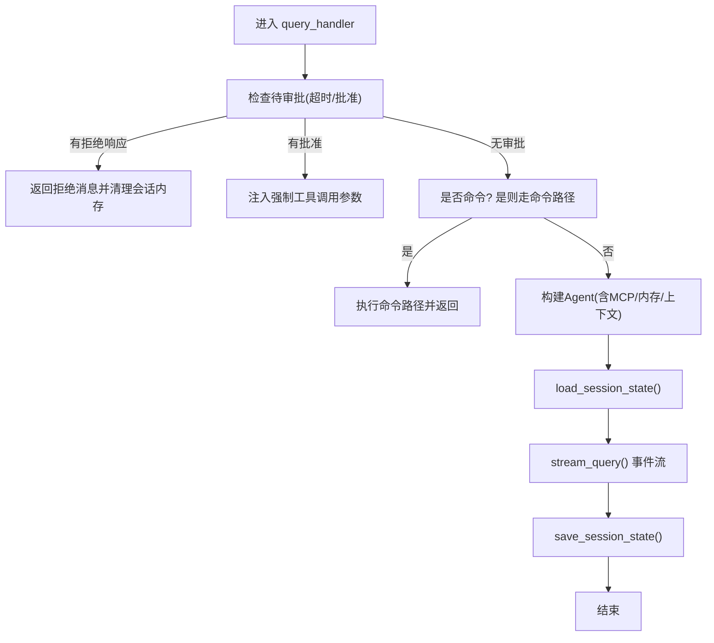
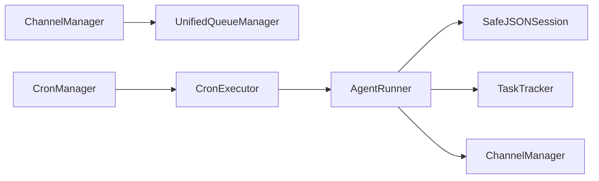

# 后台执行器

<cite>
**本文引用的文件**
- [unified_queue_manager.py](file://src/copaw/app/channels/unified_queue_manager.py)
- [manager.py](file://src/copaw/app/channels/manager.py)
- [executor.py](file://src/copaw/app/crons/executor.py)
- [manager.py](file://src/copaw/app/crons/manager.py)
- [runner.py](file://src/copaw/app/runner/runner.py)
- [session.py](file://src/copaw/app/runner/session.py)
- [task_tracker.py](file://src/copaw/app/runner/task_tracker.py)
- [models.py](file://src/copaw/app/runner/models.py)
- [command_dispatch.py](file://src/copaw/app/runner/command_dispatch.py)
- [workspace.py](file://src/copaw/app/workspace/workspace.py)
- [task_cmd.py](file://src/copaw/cli/task_cmd.py)
- [_app.py](file://src/copaw/app/_app.py)
- [grafana_dashboard.json](file://deploy/monitoring/grafana_dashboard.json)
- [telemetry.py](file://src/copaw/utils/telemetry.py)
- [system_info.py](file://src/copaw/utils/system_info.py)
</cite>

## 目录
1. [简介](#简介)
2. [项目结构](#项目结构)
3. [核心组件](#核心组件)
4. [架构总览](#架构总览)
5. [详细组件分析](#详细组件分析)
6. [依赖分析](#依赖分析)
7. [性能考量](#性能考量)
8. [故障排查指南](#故障排查指南)
9. [结论](#结论)
10. [附录](#附录)

## 简介
本文件面向Copaw后台执行器的技术文档，系统性阐述后台任务的执行机制、状态管理与结果收集、任务上下文与会话保持、资源清理策略、中断与优雅关闭、异常恢复、监控与性能指标以及优化与调试建议。重点覆盖统一队列管理、定时任务执行、运行器查询处理、会话持久化与重连、任务追踪与流式输出等模块。

## 项目结构
后台执行器相关代码主要分布在以下子系统：
- 频道与统一队列：负责消息路由、优先级隔离、动态消费者与空闲清理
- 定时任务：基于调度器的任务注册、并发控制、超时与错误上报
- 运行器：查询处理、命令路径、会话加载/保存、中断与异常转换
- 任务追踪：多订阅者事件流、缓冲区回放、请求停止
- 会话管理：安全JSON会话、跨平台文件名兼容、异步I/O
- 监控与遥测：Prometheus集成、Grafana仪表盘、系统信息采集

图表来源
- [unified_queue_manager.py:60-118](file://src/copaw/app/channels/unified_queue_manager.py#L60-L118)
- [manager.py:256-338](file://src/copaw/app/channels/manager.py#L256-L338)
- [executor.py:13-90](file://src/copaw/app/crons/executor.py#L13-L90)
- [manager.py:38-118](file://src/copaw/app/crons/manager.py#L38-L118)
- [runner.py:70-112](file://src/copaw/app/runner/runner.py#L70-L112)
- [session.py:39-72](file://src/copaw/app/runner/session.py#L39-L72)
- [task_tracker.py:30-45](file://src/copaw/app/runner/task_tracker.py#L30-L45)
- [_app.py:503-511](file://src/copaw/app/_app.py#L503-L511)
- [grafana_dashboard.json:104-111](file://deploy/monitoring/grafana_dashboard.json#L104-L111)
- [telemetry.py:1-311](file://src/copaw/utils/telemetry.py#L1-L311)

章节来源
- [unified_queue_manager.py:1-200](file://src/copaw/app/channels/unified_queue_manager.py#L1-L200)
- [manager.py:256-338](file://src/copaw/app/channels/manager.py#L256-L338)
- [executor.py:1-90](file://src/copaw/app/crons/executor.py#L1-L90)
- [manager.py:1-118](file://src/copaw/app/crons/manager.py#L1-L118)
- [runner.py:1-120](file://src/copaw/app/runner/runner.py#L1-L120)
- [session.py:1-120](file://src/copaw/app/runner/session.py#L1-L120)
- [task_tracker.py:1-120](file://src/copaw/app/runner/task_tracker.py#L1-L120)
- [_app.py:503-511](file://src/copaw/app/_app.py#L503-L511)
- [grafana_dashboard.json:104-111](file://deploy/monitoring/grafana_dashboard.json#L104-L111)
- [telemetry.py:1-120](file://src/copaw/utils/telemetry.py#L1-L120)

## 核心组件
- 统一队列管理（UnifiedQueueManager）：按频道+会话+优先级构建队列键，动态创建消费者，支持空闲清理与活动统计
- 频道管理（ChannelManager）：从消息中提取查询与会话ID，分类优先级并路由到统一队列
- 定时任务管理（CronManager）：注册/更新作业、并发信号量、心跳与错误回调
- 定时任务执行（CronExecutor）：根据任务类型发送文本或触发Agent查询并回传事件
- 运行器（AgentRunner）：查询处理、命令路径、会话加载/保存、中断与异常转换
- 会话存储（SafeJSONSession）：安全文件名、异步读写、状态装载/保存
- 任务追踪（TaskTracker）：事件缓冲、多订阅者、断开清理、请求停止
- 监控与遥测（FastAPI + Grafana + Telemetry）：指标暴露、仪表盘展示、系统信息采集

章节来源
- [unified_queue_manager.py:60-118](file://src/copaw/app/channels/unified_queue_manager.py#L60-L118)
- [manager.py:256-338](file://src/copaw/app/channels/manager.py#L256-L338)
- [manager.py:38-118](file://src/copaw/app/crons/manager.py#L38-L118)
- [executor.py:13-90](file://src/copaw/app/crons/executor.py#L13-L90)
- [runner.py:70-112](file://src/copaw/app/runner/runner.py#L70-L112)
- [session.py:39-72](file://src/copaw/app/runner/session.py#L39-L72)
- [task_tracker.py:30-45](file://src/copaw/app/runner/task_tracker.py#L30-L45)
- [_app.py:503-511](file://src/copaw/app/_app.py#L503-L511)
- [telemetry.py:1-120](file://src/copaw/utils/telemetry.py#L1-L120)

## 架构总览
后台执行器围绕“消息路由—任务执行—状态持久—事件回传”闭环展开。统一队列确保同一会话与优先级内的严格串行，不同会话/优先级并行处理；定时任务通过调度器触发，执行器将事件回传至指定频道；运行器在查询处理过程中维护会话状态，并通过任务追踪向前端提供SSE流。

图表来源
- [manager.py:256-338](file://src/copaw/app/channels/manager.py#L256-L338)
- [unified_queue_manager.py:119-164](file://src/copaw/app/channels/unified_queue_manager.py#L119-L164)
- [runner.py:396-589](file://src/copaw/app/runner/runner.py#L396-L589)
- [session.py:73-138](file://src/copaw/app/runner/session.py#L73-L138)
- [task_tracker.py:171-208](file://src/copaw/app/runner/task_tracker.py#L171-L208)

## 详细组件分析

### 统一队列管理（UnifiedQueueManager）
- 设计要点
  - 队列键：(频道, 会话, 优先级)，保证同键内严格串行，不同键并行
  - 动态消费者：首次入队时创建消费者任务，避免固定工作池
  - 空闲清理：周期扫描空闲队列，超时移除，降低内存占用
  - 活动统计：记录创建时间、最后活动时间、处理计数，便于监控
- 关键流程
  - 入队：超时保护（30秒），防止阻塞；记录日志
  - 获取/创建队列：加锁保护；创建消费者任务并命名
  - 清理循环：按间隔睡眠，计算空闲阈值，批量清理

图表来源
- [unified_queue_manager.py:119-164](file://src/copaw/app/channels/unified_queue_manager.py#L119-L164)
- [unified_queue_manager.py:165-200](file://src/copaw/app/channels/unified_queue_manager.py#L165-L200)
- [unified_queue_manager.py:376-395](file://src/copaw/app/channels/unified_queue_manager.py#L376-L395)

章节来源
- [unified_queue_manager.py:60-118](file://src/copaw/app/channels/unified_queue_manager.py#L60-L118)
- [unified_queue_manager.py:119-164](file://src/copaw/app/channels/unified_queue_manager.py#L119-L164)
- [unified_queue_manager.py:165-200](file://src/copaw/app/channels/unified_queue_manager.py#L165-L200)
- [unified_queue_manager.py:376-395](file://src/copaw/app/channels/unified_queue_manager.py#L376-L395)

### 频道管理与路由（ChannelManager）
- 路由逻辑
  - 提取消息中的查询文本，交由命令注册表判定优先级
  - 提取标准化会话ID，封装为任务后加入统一队列
  - 超时保护（30秒），避免阻塞主事件循环
- 错误处理
  - 未初始化队列管理器或找不到频道时记录警告
  - 取消/超时分别记录日志

章节来源
- [manager.py:256-338](file://src/copaw/app/channels/manager.py#L256-L338)

### 定时任务管理与执行（CronManager/CronExecutor）
- 管理器
  - 注册/更新作业：构建触发器，按作业并发度设置信号量
  - 心跳：支持Cron表达式与间隔两种触发方式
  - 回调：失败时记录日志并向控制台推送错误消息
- 执行器
  - 文本任务：直接发送文本到目标频道
  - Agent任务：以目标用户身份发起查询，流式事件回传
  - 超时控制：按作业配置的超时时间限制执行

图表来源
- [manager.py:38-118](file://src/copaw/app/crons/manager.py#L38-L118)
- [manager.py:217-239](file://src/copaw/app/crons/manager.py#L217-L239)
- [executor.py:18-90](file://src/copaw/app/crons/executor.py#L18-L90)

章节来源
- [manager.py:38-118](file://src/copaw/app/crons/manager.py#L38-L118)
- [manager.py:217-239](file://src/copaw/app/crons/manager.py#L217-L239)
- [executor.py:18-90](file://src/copaw/app/crons/executor.py#L18-L90)

### 运行器（AgentRunner）：查询处理与中断
- 查询处理
  - 解析待审批工具调用，支持批准/拒绝/超时
  - 命令路径：支持守护命令、控制命令与对话命令
  - Agent构建：注入环境上下文、MCP客户端、内存管理器、任务追踪
  - 会话加载/保存：在处理前后分别加载与保存状态
- 中断与异常
  - 取消：捕获取消异常，调用Agent中断并抛出业务异常
  - 异常：转换模型异常，生成调试转储，附加细节路径

图表来源
- [runner.py:349-589](file://src/copaw/app/runner/runner.py#L349-L589)
- [runner.py:541-581](file://src/copaw/app/runner/runner.py#L541-L581)

章节来源
- [runner.py:349-589](file://src/copaw/app/runner/runner.py#L349-L589)
- [runner.py:541-581](file://src/copaw/app/runner/runner.py#L541-L581)

### 会话管理（SafeJSONSession）
- 文件名安全：替换非法字符，适配Windows/Unix
- 异步I/O：使用aiofiles读写，避免阻塞事件循环
- 状态操作：支持装载、保存、增量更新、读取完整状态字典

章节来源
- [session.py:39-72](file://src/copaw/app/runner/session.py#L39-L72)
- [session.py:73-138](file://src/copaw/app/runner/session.py#L73-L138)
- [session.py:139-248](file://src/copaw/app/runner/session.py#L139-L248)

### 任务追踪（TaskTracker）：事件流与重连
- 多订阅者：每个运行键维护事件缓冲与订阅队列
- 重连回放：新订阅者可获得缓冲区事件
- 生命周期：任务完成后清理运行键与队列，断开自动移除

章节来源
- [task_tracker.py:30-45](file://src/copaw/app/runner/task_tracker.py#L30-L45)
- [task_tracker.py:142-208](file://src/copaw/app/runner/task_tracker.py#L142-L208)
- [task_tracker.py:210-231](file://src/copaw/app/runner/task_tracker.py#L210-L231)

### 命令分发（CommandDispatch）
- 命令识别：守护命令、控制命令、对话命令
- 执行路径：守护命令通过混合处理器执行；控制命令通过工作区通道；对话命令通过轻量内存与命令处理器
- 内存同步：对话命令结束后将内存状态写回会话

章节来源
- [command_dispatch.py:65-77](file://src/copaw/app/runner/command_dispatch.py#L65-L77)
- [command_dispatch.py:79-277](file://src/copaw/app/runner/command_dispatch.py#L79-L277)

### 工作区与服务注册（Workspace）
- 服务注册：Runner/Memory/MCP/Chat等服务按优先级注册与启动
- 任务追踪：提供TaskTracker实例供Runner使用

章节来源
- [workspace.py:145-230](file://src/copaw/app/workspace/workspace.py#L145-L230)

## 依赖分析
- 组件耦合
  - ChannelManager依赖UnifiedQueueManager进行路由
  - CronManager依赖CronExecutor与Runner/ChannelManager
  - AgentRunner依赖Session、TaskTracker、ChatManager、MCP管理器
- 外部依赖
  - 异步调度器（APScheduler）、事件循环、文件系统、网络通道

图表来源
- [manager.py:256-338](file://src/copaw/app/channels/manager.py#L256-L338)
- [unified_queue_manager.py:60-118](file://src/copaw/app/channels/unified_queue_manager.py#L60-L118)
- [manager.py:38-118](file://src/copaw/app/crons/manager.py#L38-L118)
- [executor.py:13-90](file://src/copaw/app/crons/executor.py#L13-L90)
- [runner.py:70-112](file://src/copaw/app/runner/runner.py#L70-L112)
- [session.py:39-72](file://src/copaw/app/runner/session.py#L39-L72)
- [task_tracker.py:30-45](file://src/copaw/app/runner/task_tracker.py#L30-L45)

## 性能考量
- 并发与隔离
  - 通过队列键实现会话与优先级隔离，避免全局锁争用
  - 动态消费者减少固定线程池的资源占用
- I/O非阻塞
  - 会话读写采用异步文件I/O，降低事件循环阻塞风险
- 超时与背压
  - 入队超时（30秒）与作业超时（按作业配置）防止无限等待
- 监控与指标
  - FastAPI集成Prometheus，暴露请求计数、耗时等指标
  - Grafana仪表盘可视化租户用量、端点调用趋势

章节来源
- [unified_queue_manager.py:145-156](file://src/copaw/app/channels/unified_queue_manager.py#L145-L156)
- [executor.py:75-89](file://src/copaw/app/crons/executor.py#L75-L89)
- [session.py:73-138](file://src/copaw/app/runner/session.py#L73-L138)
- [_app.py:503-511](file://src/copaw/app/_app.py#L503-L511)
- [grafana_dashboard.json:104-111](file://deploy/monitoring/grafana_dashboard.json#L104-L111)

## 故障排查指南
- 队列积压与超时
  - 现象：入队超时告警
  - 排查：检查消费者任务是否卡死、CPU/IO瓶颈、磁盘空间
  - 处置：增大队列容量、调整清理间隔、优化消费者处理逻辑
- 会话加载失败
  - 现象：schema不匹配导致跳过加载
  - 排查：确认会话文件完整性、字段版本一致性
  - 处置：在完成时保存最新状态，避免旧状态影响
- 定时任务失败
  - 现象：回调记录错误并推送控制台
  - 排查：查看作业配置、超时设置、目标频道可用性
  - 处置：修复配置、增加超时或降级策略
- 查询被取消
  - 现象：抛出取消异常并调用Agent中断
  - 排查：确认前端断开或手动停止
  - 处置：确保finally块保存会话状态
- 监控不可用
  - 现象：/metrics无法访问或指标缺失
  - 排查：确认中间件已启用、端口可达、容器网络配置
  - 处置：检查暴露端点、防火墙与代理配置

章节来源
- [unified_queue_manager.py:145-156](file://src/copaw/app/channels/unified_queue_manager.py#L145-L156)
- [runner.py:522-528](file://src/copaw/app/runner/runner.py#L522-L528)
- [manager.py:217-239](file://src/copaw/app/crons/manager.py#L217-L239)
- [runner.py:541-546](file://src/copaw/app/runner/runner.py#L541-L546)
- [_app.py:503-511](file://src/copaw/app/_app.py#L503-L511)

## 结论
Copaw后台执行器通过统一队列实现高并发与强隔离，结合定时任务调度、运行器查询处理、会话持久化与任务追踪，形成完整的后台执行闭环。配合监控与遥测体系，能够有效支撑企业级场景下的稳定性与可观测性需求。

## 附录

### 执行器监控与性能指标
- 指标暴露
  - 使用FastAPI Instrumentator在应用层暴露Prometheus指标
  - 自定义标签如租户ID、端点路径用于细分统计
- 仪表盘
  - Grafana预置仪表盘，展示租户用量、端点请求速率等
- 系统信息
  - 遥测采集系统信息（版本、安装方式、架构、GPU检测）
  - 系统信息工具提供内存、显存、CUDA版本等硬件信息

章节来源
- [_app.py:503-511](file://src/copaw/app/_app.py#L503-L511)
- [grafana_dashboard.json:104-111](file://deploy/monitoring/grafana_dashboard.json#L104-L111)
- [telemetry.py:1-120](file://src/copaw/utils/telemetry.py#L1-L120)
- [system_info.py:111-121](file://src/copaw/utils/system_info.py#L111-L121)

### 调试技巧
- CLI任务命令
  - 支持超时、错误返回与令牌用量统计，便于本地验证
- 会话状态
  - 在finally中保存会话，避免异常中断导致状态丢失
- 日志与转储
  - 查询异常生成调试转储文件路径，辅助定位问题

章节来源
- [task_cmd.py:122-158](file://src/copaw/cli/task_cmd.py#L122-L158)
- [runner.py:582-592](file://src/copaw/app/runner/runner.py#L582-L592)