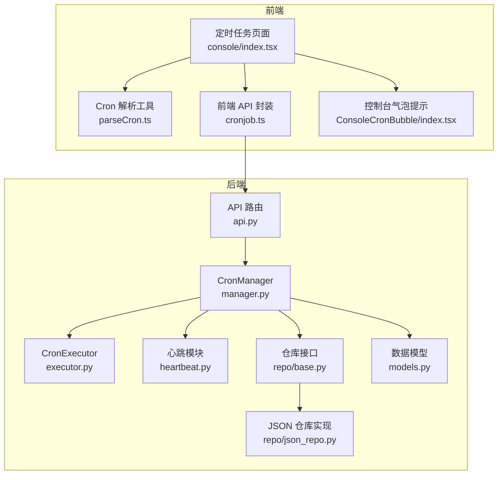
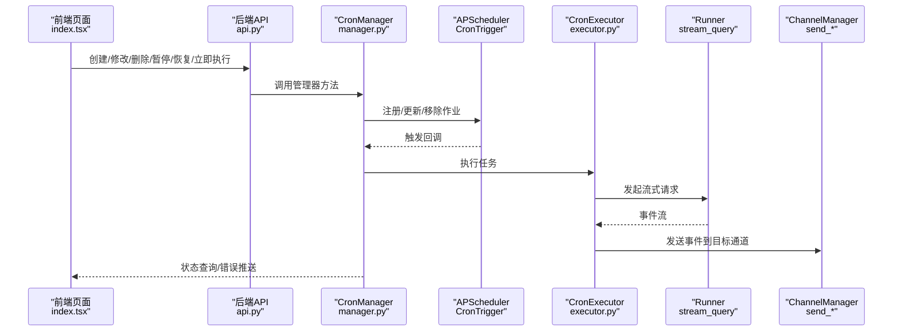
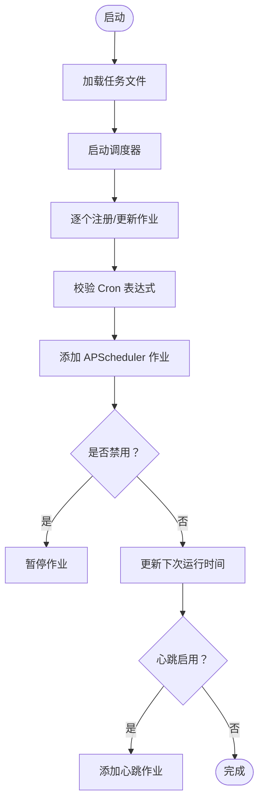
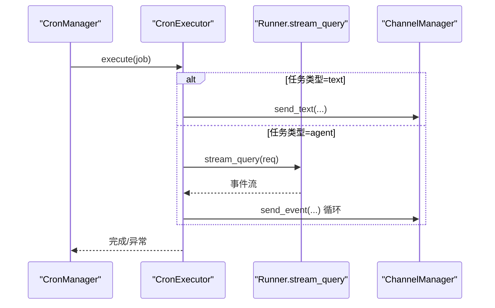
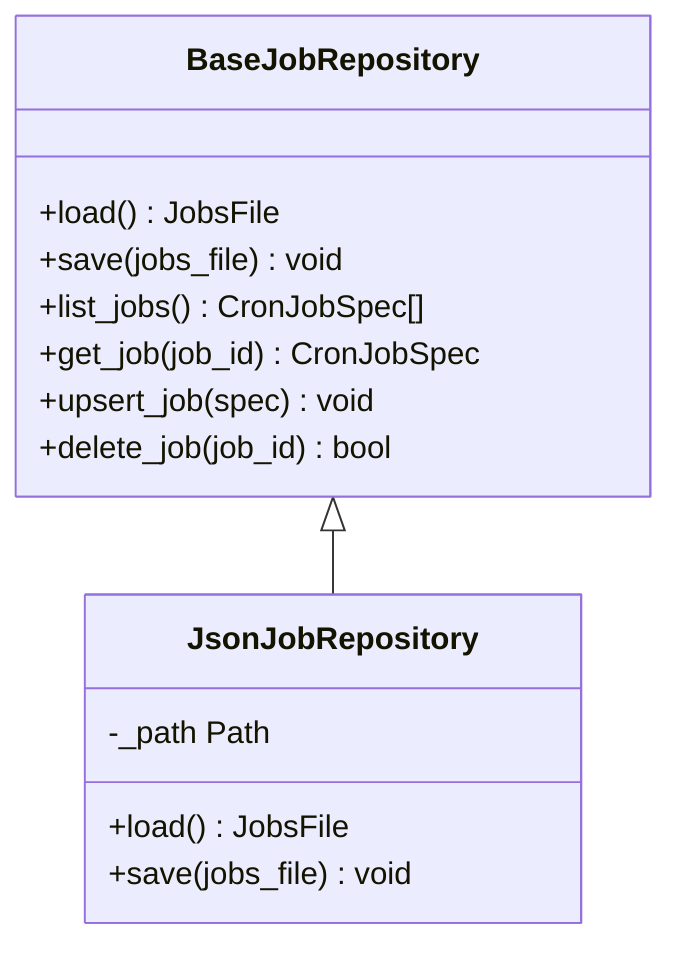
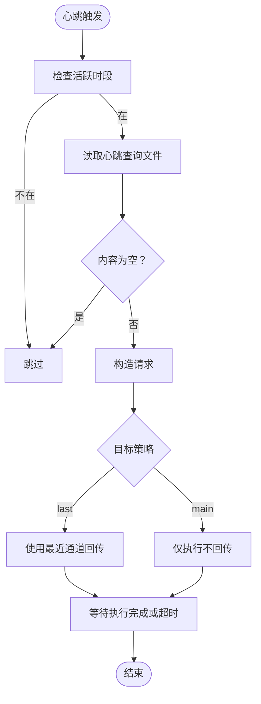
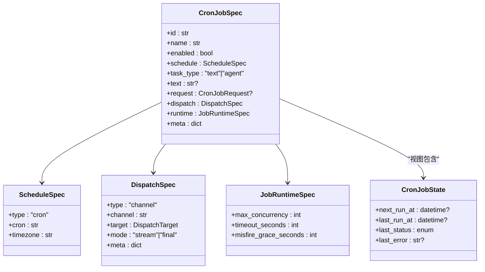
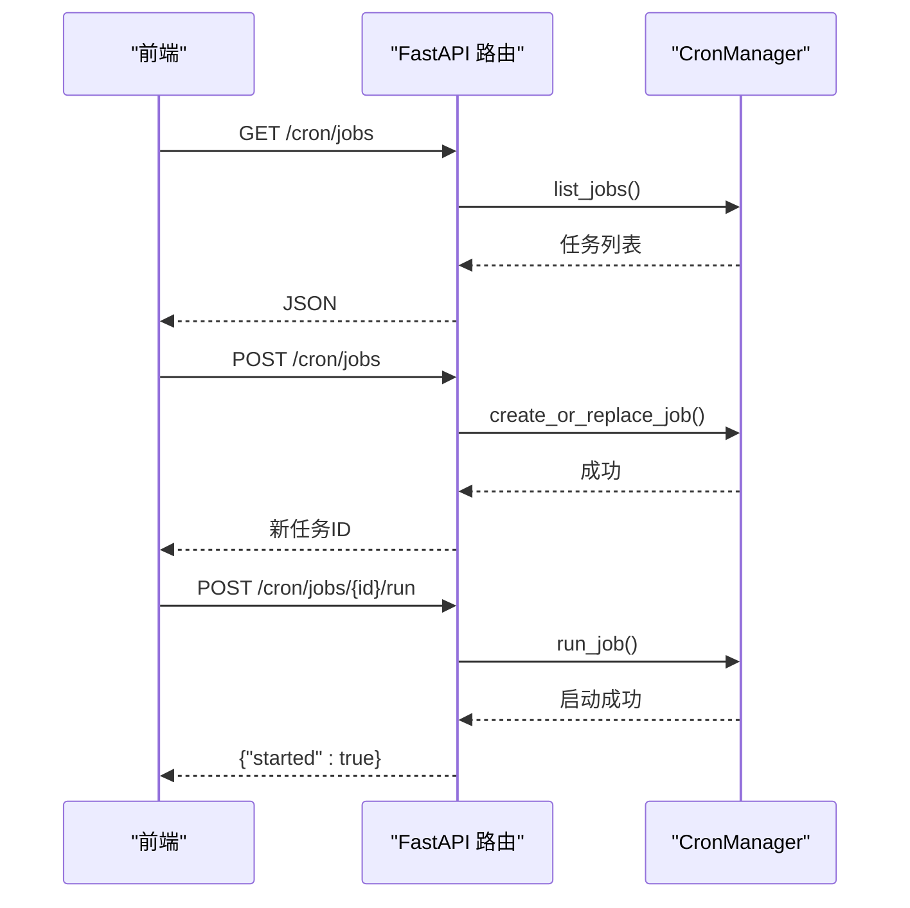
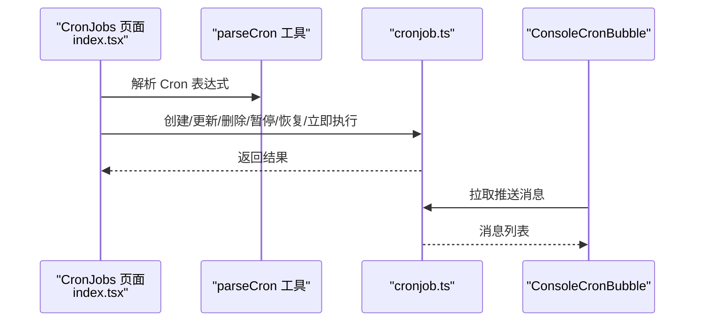
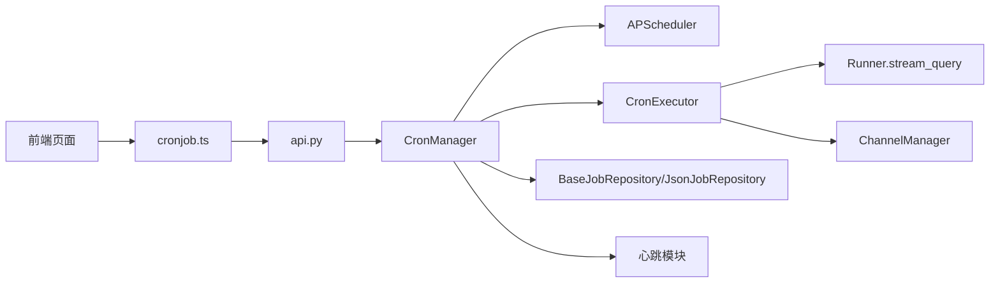

# 定时执行器

<cite>
**本文引用的文件**
- [executor.py](file://src/copaw/app/crons/executor.py)
- [manager.py](file://src/copaw/app/crons/manager.py)
- [heartbeat.py](file://src/copaw/app/crons/heartbeat.py)
- [models.py](file://src/copaw/app/crons/models.py)
- [base.py](file://src/copaw/app/crons/repo/base.py)
- [json_repo.py](file://src/copaw/app/crons/repo/json_repo.py)
- [api.py](file://src/copaw/app/crons/api.py)
- [constant.py](file://src/copaw/constant.py)
- [index.tsx](file://console/src/pages/Control/CronJobs/index.tsx)
- [parseCron.ts](file://console/src/pages/Control/CronJobs/components/parseCron.ts)
- [cronjob.ts](file://console/src/api/modules/cronjob.ts)
- [ConsoleCronBubble/index.tsx](file://console/src/components/ConsoleCronBubble/index.tsx)
</cite>

## 目录
1. [简介](#简介)
2. [项目结构](#项目结构)
3. [核心组件](#核心组件)
4. [架构总览](#架构总览)
5. [详细组件分析](#详细组件分析)
6. [依赖分析](#依赖分析)
7. [性能考虑](#性能考虑)
8. [故障排除指南](#故障排除指南)
9. [结论](#结论)
10. [附录](#附录)

## 简介
本技术文档围绕定时执行器展开，系统性阐述定时任务的调度机制、心跳检测、执行监控与状态同步的设计与实现；详解 Cron 表达式的解析与规范化、时间计算与执行时机控制策略；解释任务并发控制、超时与取消、错误处理与状态回传；并给出配置、执行历史与性能统计的实现要点，以及管理操作与故障排除建议。

## 项目结构
定时执行器位于后端 Python 包 src/copaw/app/crons 下，采用分层设计：API 层负责对外暴露 REST 接口；管理器层负责调度与生命周期管理；执行器层负责具体任务执行；仓库层负责任务持久化；心跳模块负责周期性健康检查；模型定义了任务规格、运行参数与状态视图。前端 console 提供可视化配置与状态展示。

**图表来源**
- [api.py:1-117](file://src/copaw/app/crons/api.py#L1-L117)
- [manager.py:1-388](file://src/copaw/app/crons/manager.py#L1-L388)
- [executor.py:1-90](file://src/copaw/app/crons/executor.py#L1-L90)
- [heartbeat.py:1-213](file://src/copaw/app/crons/heartbeat.py#L1-L213)
- [base.py:1-54](file://src/copaw/app/crons/repo/base.py#L1-L54)
- [json_repo.py:1-47](file://src/copaw/app/crons/repo/json_repo.py#L1-L47)
- [models.py:1-180](file://src/copaw/app/crons/models.py#L1-L180)
- [index.tsx:1-238](file://console/src/pages/Control/CronJobs/index.tsx#L1-L238)
- [parseCron.ts:1-152](file://console/src/pages/Control/CronJobs/components/parseCron.ts#L1-L152)
- [cronjob.ts:1-54](file://console/src/api/modules/cronjob.ts#L1-L54)
- [ConsoleCronBubble/index.tsx:1-41](file://console/src/components/ConsoleCronBubble/index.tsx#L1-L41)

**章节来源**
- [api.py:1-117](file://src/copaw/app/crons/api.py#L1-L117)
- [manager.py:1-388](file://src/copaw/app/crons/manager.py#L1-L388)
- [executor.py:1-90](file://src/copaw/app/crons/executor.py#L1-L90)
- [heartbeat.py:1-213](file://src/copaw/app/crons/heartbeat.py#L1-L213)
- [base.py:1-54](file://src/copaw/app/crons/repo/base.py#L1-L54)
- [json_repo.py:1-47](file://src/copaw/app/crons/repo/json_repo.py#L1-L47)
- [models.py:1-180](file://src/copaw/app/crons/models.py#L1-L180)
- [index.tsx:1-238](file://console/src/pages/Control/CronJobs/index.tsx#L1-L238)
- [parseCron.ts:1-152](file://console/src/pages/Control/CronJobs/components/parseCron.ts#L1-L152)
- [cronjob.ts:1-54](file://console/src/api/modules/cronjob.ts#L1-L54)
- [ConsoleCronBubble/index.tsx:1-41](file://console/src/components/ConsoleCronBubble/index.tsx#L1-L41)

## 核心组件
- CronManager：调度与生命周期管理，负责加载任务、注册 APScheduler 作业、并发控制、状态更新、心跳任务调度与重载、手动触发等。
- CronExecutor：单次任务执行器，支持“发送固定文本”和“以代理身份发起请求并流式回传”的两种任务类型，并内置超时控制。
- 仓库层：抽象 BaseJobRepository 与 JsonJobRepository 实现，提供任务持久化与原子写入。
- 心跳模块：解析心跳表达式或间隔，按用户活跃时段与目标策略执行一次心跳，可选地向最近通道回传。
- 数据模型：定义 CronJobSpec、ScheduleSpec、DispatchSpec、JobRuntimeSpec、CronJobState、CronJobView 等，含 Cron 表达式规范化与校验。
- API 层：FastAPI 路由，提供任务的增删改查、启停、立即执行与状态查询。
- 前端：可视化配置表单、Cron 表达式解析/序列化、状态轮询与错误提示气泡。

**章节来源**
- [manager.py:38-118](file://src/copaw/app/crons/manager.py#L38-L118)
- [executor.py:13-90](file://src/copaw/app/crons/executor.py#L13-L90)
- [base.py:10-54](file://src/copaw/app/crons/repo/base.py#L10-L54)
- [json_repo.py:12-47](file://src/copaw/app/crons/repo/json_repo.py#L12-L47)
- [heartbeat.py:40-213](file://src/copaw/app/crons/heartbeat.py#L40-L213)
- [models.py:59-180](file://src/copaw/app/crons/models.py#L59-L180)
- [api.py:13-117](file://src/copaw/app/crons/api.py#L13-L117)

## 架构总览
定时执行器采用“调度器 + 执行器 + 仓库 + 心跳 + API + 前端”的分层架构。调度器基于 APScheduler v3，使用 CronTrigger 控制执行时机；执行器通过 Runner 流式执行代理请求并将事件回传至指定通道；仓库层以 JSON 文件存储任务配置；心跳模块在配置允许下周期性运行；前端提供交互式配置与状态展示。

**图表来源**
- [api.py:28-117](file://src/copaw/app/crons/api.py#L28-L117)
- [manager.py:63-118](file://src/copaw/app/crons/manager.py#L63-L118)
- [executor.py:18-90](file://src/copaw/app/crons/executor.py#L18-L90)
- [heartbeat.py:119-213](file://src/copaw/app/crons/heartbeat.py#L119-L213)

## 详细组件分析

### CronManager：调度与生命周期管理
- 启动流程：加载任务文件、启动调度器、逐个注册或更新作业、自动禁用无效任务并持久化；根据心跳配置添加心跳作业。
- 并发控制：每个作业维护独立信号量，受 runtime.max_concurrency 控制。
- 执行时机：基于 CronTrigger 的 misfire_grace_time 控制错失触发的容忍窗口。
- 状态管理：维护每作业的 CronJobState，包括下次运行时间、上次运行时间、状态与错误信息。
- 心跳管理：支持动态重载心跳配置，按 cron 或间隔构建触发器。
- 手动触发：run_job 以 fire-and-forget 方式异步执行，异常记录并推送到前端控制台。

**图表来源**
- [manager.py:63-118](file://src/copaw/app/crons/manager.py#L63-L118)
- [manager.py:242-273](file://src/copaw/app/crons/manager.py#L242-L273)

**章节来源**
- [manager.py:38-118](file://src/copaw/app/crons/manager.py#L38-L118)
- [manager.py:120-153](file://src/copaw/app/crons/manager.py#L120-L153)
- [manager.py:154-189](file://src/copaw/app/crons/manager.py#L154-L189)
- [manager.py:190-214](file://src/copaw/app/crons/manager.py#L190-L214)
- [manager.py:242-273](file://src/copaw/app/crons/manager.py#L242-L273)
- [manager.py:316-328](file://src/copaw/app/crons/manager.py#L316-L328)
- [manager.py:349-388](file://src/copaw/app/crons/manager.py#L349-L388)

### CronExecutor：单次任务执行
- 文本任务：直接通过 ChannelManager 发送固定文本消息。
- 代理任务：将请求注入 user_id/session_id 后交由 Runner 流式执行，边生成事件边通过 ChannelManager 发送，支持超时控制与取消处理。
- 日志与异常：记录执行日志、超时警告、取消信息，并向上抛出以便状态更新与错误回传。

**图表来源**
- [executor.py:18-90](file://src/copaw/app/crons/executor.py#L18-L90)

**章节来源**
- [executor.py:18-90](file://src/copaw/app/crons/executor.py#L18-L90)

### 仓库层：任务持久化
- 抽象接口：定义 load/save/list/get/upsert/delete 等通用操作。
- JSON 实现：单文件存储，原子写入（临时文件 + 替换），支持并发读取与简单更新。

**图表来源**
- [base.py:10-54](file://src/copaw/app/crons/repo/base.py#L10-L54)
- [json_repo.py:12-47](file://src/copaw/app/crons/repo/json_repo.py#L12-L47)

**章节来源**
- [base.py:10-54](file://src/copaw/app/crons/repo/base.py#L10-L54)
- [json_repo.py:12-47](file://src/copaw/app/crons/repo/json_repo.py#L12-L47)

### 心跳模块：周期性健康检查
- 表达式识别：判断字符串是否为 5 字段 Cron 表达式。
- Cron 解析：将 crontab 数字星期转为三字母缩写，统一与 APScheduler v3 的星期编号。
- 间隔解析：支持 h/m/s 组合的间隔字符串，转换为秒。
- 活跃时段：根据用户时区与配置的开始/结束时间决定是否执行。
- 执行策略：可选择“主会话”或“最近通道”回传；默认超时 120 秒。

**图表来源**
- [heartbeat.py:119-213](file://src/copaw/app/crons/heartbeat.py#L119-L213)
- [heartbeat.py:40-79](file://src/copaw/app/crons/heartbeat.py#L40-L79)

**章节来源**
- [heartbeat.py:40-79](file://src/copaw/app/crons/heartbeat.py#L40-L79)
- [heartbeat.py:81-117](file://src/copaw/app/crons/heartbeat.py#L81-L117)
- [heartbeat.py:119-213](file://src/copaw/app/crons/heartbeat.py#L119-L213)
- [constant.py:114-117](file://src/copaw/constant.py#L114-L117)

### 数据模型：任务规格与状态
- CronJobSpec：任务标识、名称、启用状态、计划、任务类型、请求体、派发目标、运行参数、元数据。
- ScheduleSpec：类型（cron）、Cron 表达式、时区；提供 Cron 表达式规范化（将数字星期映射为三字母缩写）。
- DispatchSpec：派发目标（用户/会话）、通道、模式（流式/最终）、元数据。
- JobRuntimeSpec：最大并发、超时秒数、错失宽限秒数。
- CronJobState：下次运行时间、上次运行时间、状态（success/error/running/skipped/cancelled）、错误信息。
- CronJobView：组合任务规范与当前状态。

**图表来源**
- [models.py:59-180](file://src/copaw/app/crons/models.py#L59-L180)

**章节来源**
- [models.py:59-180](file://src/copaw/app/crons/models.py#L59-L180)

### API 层：REST 接口
- 列表与详情：获取任务列表与单个任务视图（包含状态）。
- 创建与替换：服务端生成任务 ID；替换时校验 ID 一致性。
- 删除、暂停、恢复、立即执行：提供完整控制能力。
- 状态查询：返回 CronJobState 的 JSON 表示。

**图表来源**
- [api.py:28-117](file://src/copaw/app/crons/api.py#L28-L117)

**章节来源**
- [api.py:13-117](file://src/copaw/app/crons/api.py#L13-L117)

### 前端：配置与状态展示
- 页面：提供表格、抽屉表单、确认对话框、时区设置与 Cron 表达式解析/序列化。
- 表单：支持“小时/日/周/自定义”四类表达式快速选择与自定义输入；序列化为标准 Cron 表达式。
- 状态轮询：通过 ConsoleCronBubble 拉取控制台推送消息，展示错误与通知。

**图表来源**
- [index.tsx:1-238](file://console/src/pages/Control/CronJobs/index.tsx#L1-L238)
- [parseCron.ts:1-152](file://console/src/pages/Control/CronJobs/components/parseCron.ts#L1-L152)
- [cronjob.ts:1-54](file://console/src/api/modules/cronjob.ts#L1-L54)
- [ConsoleCronBubble/index.tsx:1-41](file://console/src/components/ConsoleCronBubble/index.tsx#L1-L41)

**章节来源**
- [index.tsx:1-238](file://console/src/pages/Control/CronJobs/index.tsx#L1-L238)
- [parseCron.ts:1-152](file://console/src/pages/Control/CronJobs/components/parseCron.ts#L1-L152)
- [cronjob.ts:1-54](file://console/src/api/modules/cronjob.ts#L1-L54)
- [ConsoleCronBubble/index.tsx:1-41](file://console/src/components/ConsoleCronBubble/index.tsx#L1-L41)

## 依赖分析
- CronManager 依赖 APScheduler（AsyncIOScheduler、CronTrigger、IntervalTrigger）、仓库接口、执行器、心跳模块与通道管理器。
- CronExecutor 依赖 Runner（流式查询）与 ChannelManager（发送文本/事件）。
- 仓库层通过 JsonJobRepository 实现持久化，保证原子写入。
- 前端依赖后端 API 与本地 Cron 解析工具，结合控制台推送实现错误可视化。

**图表来源**
- [manager.py:10-26](file://src/copaw/app/crons/manager.py#L10-L26)
- [executor.py:4-16](file://src/copaw/app/crons/executor.py#L4-L16)
- [api.py:4-25](file://src/copaw/app/crons/api.py#L4-L25)
- [json_repo.py:12-47](file://src/copaw/app/crons/repo/json_repo.py#L12-L47)

**章节来源**
- [manager.py:10-26](file://src/copaw/app/crons/manager.py#L10-L26)
- [executor.py:4-16](file://src/copaw/app/crons/executor.py#L4-L16)
- [api.py:4-25](file://src/copaw/app/crons/api.py#L4-L25)
- [json_repo.py:12-47](file://src/copaw/app/crons/repo/json_repo.py#L12-L47)

## 性能考虑
- 并发控制：通过 per-job 信号量限制同时执行数量，避免资源争用与过载。
- 超时与取消：执行器对流式请求设置超时，捕获取消错误，防止僵尸任务占用资源。
- 错失触发容忍：通过 misfire_grace_seconds 平衡“漏掉的触发”与“堆积执行”，避免雪崩。
- 原子写入：JSON 仓库采用临时文件 + 替换，降低竞态风险。
- 心跳节流：按用户活跃时段与配置间隔执行，避免无效负载。

[本节为通用指导，无需特定文件来源]

## 故障排除指南
- 任务未执行
  - 检查 Cron 表达式是否为 5 字段且合法；确认时区设置正确。
  - 查看任务状态 last_status 是否为 running/error/skipped/cancelled。
  - 若错失触发，检查 misfire_grace_seconds 设置。
- 执行超时
  - 调整 runtime.timeout_seconds；检查 Runner 侧响应延迟。
- 任务被禁用或暂停
  - 通过 API 恢复；或在前端页面点击“恢复”。
- 心跳不生效
  - 确认心跳配置已启用；检查活跃时段与目标策略；验证查询文件存在且非空。
- 错误可见性
  - 前端 ConsoleCronBubble 会显示来自后端推送的错误消息；若无显示，检查控制台推送接口与轮询逻辑。

**章节来源**
- [manager.py:349-388](file://src/copaw/app/crons/manager.py#L349-L388)
- [executor.py:75-89](file://src/copaw/app/crons/executor.py#L75-L89)
- [heartbeat.py:119-213](file://src/copaw/app/crons/heartbeat.py#L119-L213)
- [ConsoleCronBubble/index.tsx:1-41](file://console/src/components/ConsoleCronBubble/index.tsx#L1-L41)

## 结论
该定时执行器以 APScheduler 为核心，结合自定义执行器、仓库与心跳模块，提供了稳定可靠的定时任务能力。通过严格的 Cron 规范化、并发与超时控制、状态同步与错误回传，满足生产环境的可靠性与可观测性需求。前端提供直观的配置与状态展示，便于运维与业务人员管理。

[本节为总结，无需特定文件来源]

## 附录

### Cron 表达式解析与规范化
- 后端模型层将 crontab 数字星期统一为三字母缩写，兼容 APScheduler v3 的星期编号。
- 前端提供“小时/日/周/自定义”四类表达式快速选择与自定义输入，序列化为标准 Cron 表达式。

**章节来源**
- [models.py:38-89](file://src/copaw/app/crons/models.py#L38-L89)
- [parseCron.ts:55-148](file://console/src/pages/Control/CronJobs/components/parseCron.ts#L55-L148)

### 配置项与默认值
- 心跳文件名、默认间隔、默认目标等常量集中于常量模块，便于全局一致化管理。

**章节来源**
- [constant.py:114-117](file://src/copaw/constant.py#L114-L117)