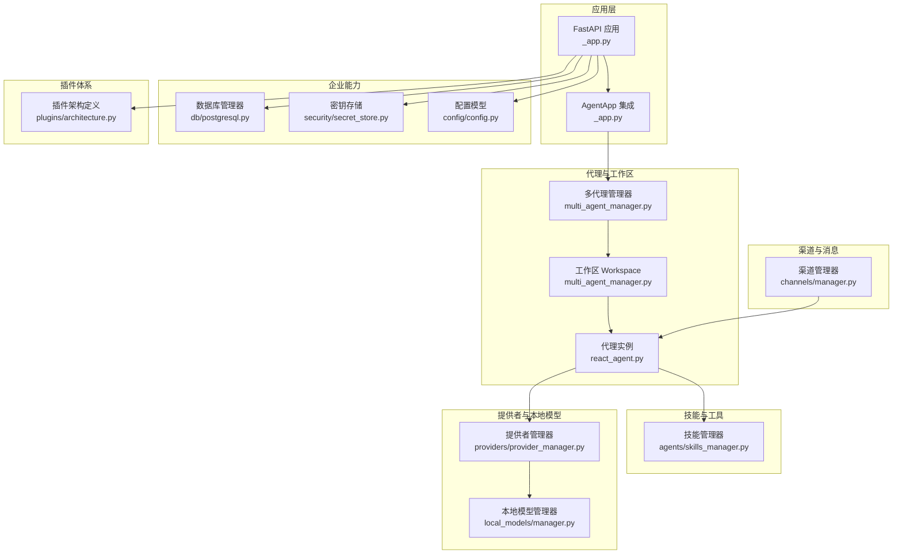
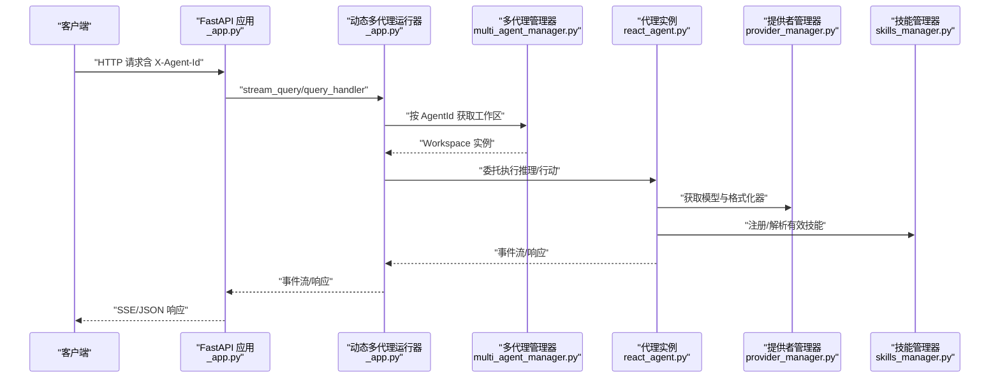
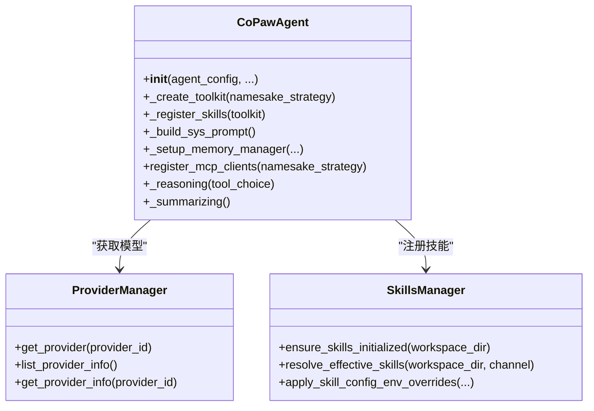
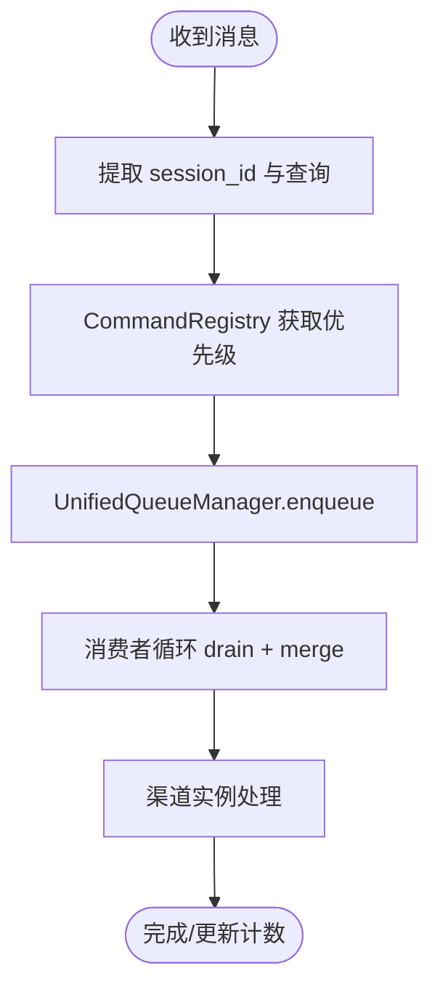
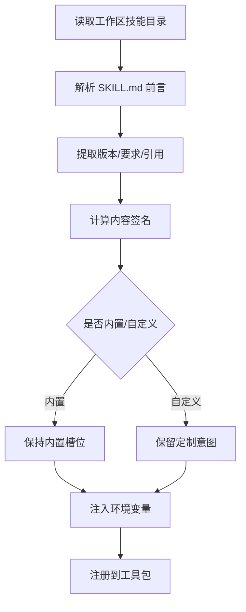
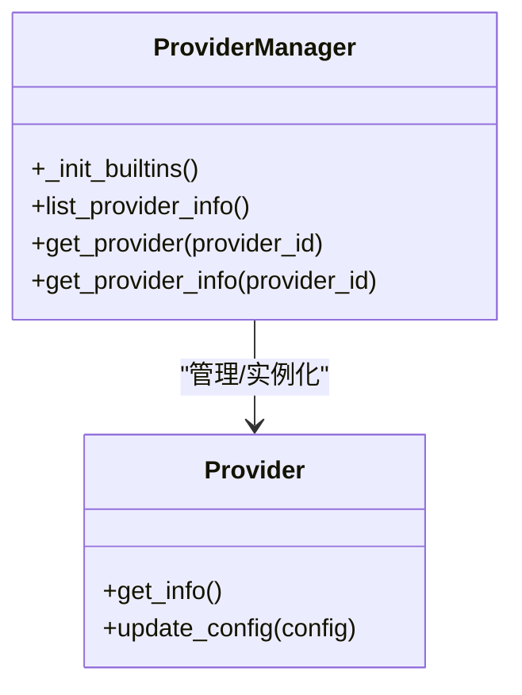
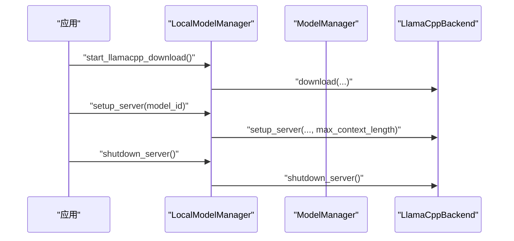
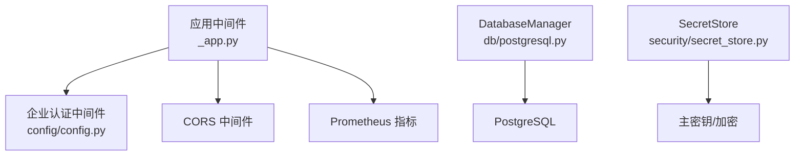
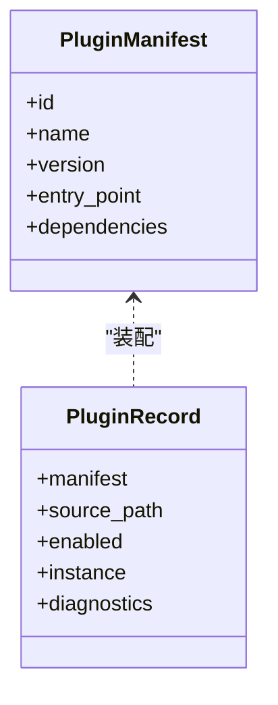
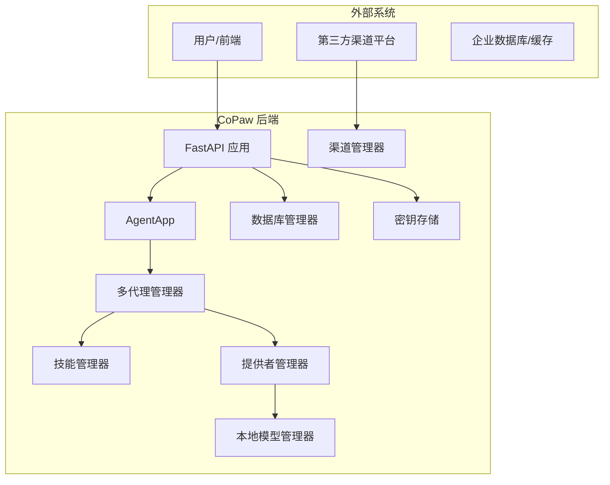

# 后端架构

<cite>
**本文引用的文件**
- [src/copaw/app/_app.py](file://src/copaw/app/_app.py)
- [src/copaw/providers/provider_manager.py](file://src/copaw/providers/provider_manager.py)
- [src/copaw/agents/skills_manager.py](file://src/copaw/agents/skills_manager.py)
- [src/copaw/app/channels/manager.py](file://src/copaw/app/channels/manager.py)
- [src/copaw/agents/react_agent.py](file://src/copaw/agents/react_agent.py)
- [src/copaw/app/multi_agent_manager.py](file://src/copaw/app/multi_agent_manager.py)
- [src/copaw/plugins/architecture.py](file://src/copaw/plugins/architecture.py)
- [src/copaw/local_models/manager.py](file://src/copaw/local_models/manager.py)
- [src/copaw/config/config.py](file://src/copaw/config/config.py)
- [src/copaw/security/secret_store.py](file://src/copaw/security/secret_store.py)
- [src/copaw/db/postgresql.py](file://src/copaw/db/postgresql.py)
- [pyproject.toml](file://pyproject.toml)
- [deploy/Dockerfile](file://deploy/Dockerfile)
- [docker-compose.yml](file://docker-compose.yml)
</cite>

## 目录
1. [引言](#引言)
2. [项目结构](#项目结构)
3. [核心组件](#核心组件)
4. [架构总览](#架构总览)
5. [详细组件分析](#详细组件分析)
6. [依赖分析](#依赖分析)
7. [性能考量](#性能考量)
8. [故障排查指南](#故障排查指南)
9. [结论](#结论)
10. [附录](#附录)

## 引言
本文件面向 CoPaw 后端，系统化阐述其高层设计、架构模式与系统边界，重点覆盖以下方面：
- 代理引擎设计：以 ReActAgent 为核心，结合工具集、技能池、内存管理与 MCP 客户端集成。
- 渠道管理系统：统一队列与消费模型，支持多通道并发与优先级路由。
- 技能执行框架：工作区技能同步、签名校验、冲突处理与运行时注入。
- 提供者适配器：统一模型提供者注册、内置/自定义/插件提供者管理与本地模型服务编排。
- 组件交互、数据流与集成模式：请求生命周期、动态路由、企业级中间件与可观测性。
- 基础设施需求、可扩展性与部署拓扑：容器化、数据库与缓存、企业版能力。
- 横切关注点：安全（密钥存储）、监控（Prometheus）、灾备与恢复。
- 技术栈、第三方依赖与版本兼容性。

## 项目结构
CoPaw 后端采用分层与模块化组织：
- 应用入口与生命周期：FastAPI 应用、AgentApp 集成、中间件与静态资源。
- 代理与工作区：多代理管理、工作区生命周期、代理实例构建与钩子。
- 渠道与消息：统一渠道管理器、队列与消费者、命令优先级与会话去抖。
- 技能与工具：技能清单、导入/导出、签名与冲突、环境变量注入。
- 提供者与本地模型：提供者注册与发现、本地 llama.cpp 管理。
- 企业能力：数据库连接、Redis 缓存、认证中间件、审计日志。
- 插件体系：清单、加载、控制命令与启动/关闭钩子。
- 部署与运维：Dockerfile、Compose、Supervisor 入口脚本。

图表来源
- [src/copaw/app/_app.py:475-685](file://src/copaw/app/_app.py#L475-L685)
- [src/copaw/app/multi_agent_manager.py:21-470](file://src/copaw/app/multi_agent_manager.py#L21-L470)
- [src/copaw/agents/react_agent.py:69-182](file://src/copaw/agents/react_agent.py#L69-L182)
- [src/copaw/app/channels/manager.py:68-120](file://src/copaw/app/channels/manager.py#L68-L120)
- [src/copaw/agents/skills_manager.py:1-120](file://src/copaw/agents/skills_manager.py#L1-L120)
- [src/copaw/providers/provider_manager.py:670-750](file://src/copaw/providers/provider_manager.py#L670-L750)
- [src/copaw/local_models/manager.py:33-110](file://src/copaw/local_models/manager.py#L33-L110)
- [src/copaw/db/postgresql.py:41-114](file://src/copaw/db/postgresql.py#L41-L114)
- [src/copaw/security/secret_store.py:148-200](file://src/copaw/security/secret_store.py#L148-L200)
- [src/copaw/config/config.py:30-81](file://src/copaw/config/config.py#L30-L81)
- [src/copaw/plugins/architecture.py:9-55](file://src/copaw/plugins/architecture.py#L9-L55)

章节来源
- [src/copaw/app/_app.py:1-685](file://src/copaw/app/_app.py#L1-L685)
- [src/copaw/app/multi_agent_manager.py:1-470](file://src/copaw/app/multi_agent_manager.py#L1-L470)
- [src/copaw/agents/react_agent.py:1-182](file://src/copaw/agents/react_agent.py#L1-L182)
- [src/copaw/app/channels/manager.py:1-120](file://src/copaw/app/channels/manager.py#L1-L120)
- [src/copaw/agents/skills_manager.py:1-120](file://src/copaw/agents/skills_manager.py#L1-L120)
- [src/copaw/providers/provider_manager.py:1-120](file://src/copaw/providers/provider_manager.py#L1-L120)
- [src/copaw/local_models/manager.py:1-110](file://src/copaw/local_models/manager.py#L1-L110)
- [src/copaw/db/postgresql.py:1-114](file://src/copaw/db/postgresql.py#L1-L114)
- [src/copaw/security/secret_store.py:1-200](file://src/copaw/security/secret_store.py#L1-L200)
- [src/copaw/config/config.py:1-120](file://src/copaw/config/config.py#L1-L120)
- [src/copaw/plugins/architecture.py:1-55](file://src/copaw/plugins/architecture.py#L1-L55)

## 核心组件
- 应用与生命周期管理
  - FastAPI 应用与 AgentApp 集成，动态多代理运行器按请求头选择工作区。
  - 中间件：CORS、认证（单租户或企业版）、Prometheus 指标。
  - 生命周期：启动阶段初始化企业数据库/缓存、迁移、多代理与本地模型管理器、插件系统与控制命令。
- 多代理与工作区
  - MultiAgentManager：惰性加载、零停机热重载、后台清理任务、并发启动。
  - Workspace：代理工作区封装，包含任务跟踪、渠道管理器、服务复用。
- 代理引擎
  - CoPawAgent：ReActAgent 扩展，集成工具集、技能注册、内存管理、命令处理器、MCP 客户端。
- 渠道与消息
  - ChannelManager：统一队列与消费者，按查询关键字分类优先级，合并批量消息，支持替换与清理。
- 技能与工具
  - SkillsManager：技能清单、导入/导出、签名与冲突检测、环境变量注入、目录树与元数据。
- 提供者与本地模型
  - ProviderManager：内置/自定义/插件提供者统一管理，模型列表与能力探测。
  - LocalModelManager：llama.cpp 下载、服务器生命周期、模型下载与删除。
- 企业能力
  - DatabaseManager：PostgreSQL 连接池与健康检查。
  - SecretStore：主密钥与 Fernet 加解密，支持 OS Keychain 与文件回退。
  - 配置模型：企业开关、数据库/Redis 配置、各渠道配置基类。
- 插件体系
  - PluginManifest/PluginRecord：插件清单与记录，支持启动/关闭钩子与控制命令注册。

章节来源
- [src/copaw/app/_app.py:162-473](file://src/copaw/app/_app.py#L162-L473)
- [src/copaw/app/multi_agent_manager.py:21-120](file://src/copaw/app/multi_agent_manager.py#L21-L120)
- [src/copaw/agents/react_agent.py:69-182](file://src/copaw/agents/react_agent.py#L69-L182)
- [src/copaw/app/channels/manager.py:68-120](file://src/copaw/app/channels/manager.py#L68-L120)
- [src/copaw/agents/skills_manager.py:1-120](file://src/copaw/agents/skills_manager.py#L1-L120)
- [src/copaw/providers/provider_manager.py:670-750](file://src/copaw/providers/provider_manager.py#L670-L750)
- [src/copaw/local_models/manager.py:33-110](file://src/copaw/local_models/manager.py#L33-L110)
- [src/copaw/db/postgresql.py:41-114](file://src/copaw/db/postgresql.py#L41-L114)
- [src/copaw/security/secret_store.py:148-200](file://src/copaw/security/secret_store.py#L148-L200)
- [src/copaw/config/config.py:30-120](file://src/copaw/config/config.py#L30-L120)
- [src/copaw/plugins/architecture.py:9-55](file://src/copaw/plugins/architecture.py#L9-L55)

## 架构总览
CoPaw 后端采用“应用层 + 代理层 + 通道层 + 技能与提供者层 + 企业能力层”的分层架构，并通过统一的生命周期与中间件实现横切关注点的集中治理。

图表来源
- [src/copaw/app/_app.py:106-136](file://src/copaw/app/_app.py#L106-L136)
- [src/copaw/app/multi_agent_manager.py:38-90](file://src/copaw/app/multi_agent_manager.py#L38-L90)
- [src/copaw/agents/react_agent.py:136-182](file://src/copaw/agents/react_agent.py#L136-L182)
- [src/copaw/providers/provider_manager.py:760-778](file://src/copaw/providers/provider_manager.py#L760-L778)
- [src/copaw/agents/skills_manager.py:306-341](file://src/copaw/agents/skills_manager.py#L306-L341)

## 详细组件分析

### 代理引擎设计
- 设计要点
  - 基于 ReActAgent 的推理与行动循环，集成工具集与技能池。
  - 工具注册策略（覆盖/跳过/抛错/重命名），异步工具自动注册后台任务管理工具。
  - 内存管理与压缩钩子，引导首次使用与上下文压缩。
  - 系统提示构建与多模态能力提示注入。
  - MCP 客户端注册与断线恢复。
- 数据流
  - 请求进入 AgentApp，经动态运行器路由到具体 Workspace/Agent。
  - Agent 从 ProviderManager 获取模型与格式化器，从 SkillsManager 注册技能。
  - 推理阶段根据模型能力过滤媒体块，必要时进行被动降级重试。
- 错误处理
  - 对媒体块拒绝错误进行主动与被动过滤，保留兜底重试路径。
  - MCP 客户端异常区分任务取消与内部错误，避免吞没真实取消信号。

图表来源
- [src/copaw/agents/react_agent.py:69-182](file://src/copaw/agents/react_agent.py#L69-L182)
- [src/copaw/providers/provider_manager.py:760-778](file://src/copaw/providers/provider_manager.py#L760-L778)
- [src/copaw/agents/skills_manager.py:306-341](file://src/copaw/agents/skills_manager.py#L306-L341)

章节来源
- [src/copaw/agents/react_agent.py:69-800](file://src/copaw/agents/react_agent.py#L69-L800)

### 渠道管理系统
- 设计要点
  - ChannelManager 负责通道实例的生命周期与统一队列管理。
  - 新架构引入 UnifiedQueueManager，按（通道, 会话, 优先级）键聚合与批处理。
  - 支持替换通道、清理特定队列、发送文本/事件。
- 数据流
  - 渠道回调 enqueue → 统一队列 → 消费者循环 → 合并批量 → 渠道 consume_one/_consume_one_request。
  - 通过 CommandRegistry 依据查询内容提取优先级。
- 可靠性
  - 超时保护 enqueue；取消与异常日志；优雅停止与后台清理任务。

图表来源
- [src/copaw/app/channels/manager.py:280-348](file://src/copaw/app/channels/manager.py#L280-L348)
- [src/copaw/app/channels/manager.py:362-446](file://src/copaw/app/channels/manager.py#L362-L446)

章节来源
- [src/copaw/app/channels/manager.py:68-526](file://src/copaw/app/channels/manager.py#L68-L526)

### 技能执行框架
- 设计要点
  - 技能清单与工作区技能目录分离，支持内置/自定义/插件来源。
  - 签名计算与冲突检测，时间戳建议重命名策略。
  - 环境变量注入：基于 metadata.requires.env 的键值映射，以及全量 JSON 变量。
- 数据流
  - 解析有效技能 → 读取 SKILL.md 前言与元数据 → 计算签名 → 注入环境变量 → 注册到工具包。
- 安全
  - 技能扫描与规则库，防止危险脚本与不安全依赖。

图表来源
- [src/copaw/agents/skills_manager.py:713-742](file://src/copaw/agents/skills_manager.py#L713-L742)
- [src/copaw/agents/skills_manager.py:666-711](file://src/copaw/agents/skills_manager.py#L666-L711)

章节来源
- [src/copaw/agents/skills_manager.py:1-200](file://src/copaw/agents/skills_manager.py#L1-L200)

### 提供者适配器实现原理
- 设计要点
  - ProviderManager 统一内置/自定义/插件提供者，暴露列表与详情查询。
  - 内置提供者覆盖多家厂商与本地（Ollama、LM Studio、Copaw Local 等）。
  - 支持模型发现、能力探测与连接检查。
- 数据流
  - 代理请求 → ProviderManager.get_provider → 返回 Provider 实例 → 创建 ChatModel。
- 可扩展性
  - 插件注册提供者，动态注入到全局注册表。

图表来源
- [src/copaw/providers/provider_manager.py:710-732](file://src/copaw/providers/provider_manager.py#L710-L732)
- [src/copaw/providers/provider_manager.py:736-778](file://src/copaw/providers/provider_manager.py#L736-L778)

章节来源
- [src/copaw/providers/provider_manager.py:1-200](file://src/copaw/providers/provider_manager.py#L1-L200)

### 本地模型与下载管理
- 设计要点
  - LocalModelManager 作为门面，协调 ModelManager 与 LlamaCppBackend。
  - 支持下载进度、服务器状态、上下下文长度配置持久化。
- 生命周期
  - 启动前可取消下载/服务器；设置最大上下文长度；按需启动/停止服务器。

图表来源
- [src/copaw/local_models/manager.py:119-220](file://src/copaw/local_models/manager.py#L119-L220)

章节来源
- [src/copaw/local_models/manager.py:1-229](file://src/copaw/local_models/manager.py#L1-L229)

### 企业能力与安全
- 数据库与缓存
  - DatabaseManager 使用 SQLAlchemy 2.0 + asyncpg，提供健康检查与会话工厂。
- 密钥存储
  - 主密钥来自 OS Keychain 或文件，Fernet 加密字段带前缀，透明迁移。
- 配置模型
  - 企业开关、数据库/Redis 配置、各渠道配置基类。
- 中间件
  - 企业版 JWT 认证中间件或单租户认证中间件，CORS 中间件。

图表来源
- [src/copaw/app/_app.py:517-537](file://src/copaw/app/_app.py#L517-L537)
- [src/copaw/db/postgresql.py:41-114](file://src/copaw/db/postgresql.py#L41-L114)
- [src/copaw/security/secret_store.py:148-200](file://src/copaw/security/secret_store.py#L148-L200)
- [src/copaw/config/config.py:30-81](file://src/copaw/config/config.py#L30-L81)

章节来源
- [src/copaw/db/postgresql.py:1-187](file://src/copaw/db/postgresql.py#L1-L187)
- [src/copaw/security/secret_store.py:1-200](file://src/copaw/security/secret_store.py#L1-L200)
- [src/copaw/config/config.py:1-120](file://src/copaw/config/config.py#L1-L120)

### 插件体系
- 清单与记录：插件元信息、源路径、启用状态、实例与诊断。
- 加载与注册：启动钩子、关闭钩子、控制命令注册、运行时助手注入。

图表来源
- [src/copaw/plugins/architecture.py:9-55](file://src/copaw/plugins/architecture.py#L9-L55)

章节来源
- [src/copaw/plugins/architecture.py:1-55](file://src/copaw/plugins/architecture.py#L1-L55)

## 依赖分析
- 技术栈与版本
  - Python 3.10–3.13，FastAPI、Uvicorn、AgentScope/AgentScope Runtime、Playwright、Prometheus Instrumentator、SQLAlchemy 2.0 + asyncpg、Redis、Cryptography/keyring。
  - 可选依赖：llama-cpp-python、mlx-lm（macOS）、ollama、openai-whisper、full（组合安装）。
- 第三方集成
  - 渠道 SDK：Discord、Telegram、Twilio、MQTT、Matrix、钉钉、飞书、OneBot、Mattermost、iMessage 等。
  - 企业依赖：Alembic 迁移、Passlib/Jose/Cryptography、Authlib、itsdangerous。
- 版本兼容性
  - anyio 限制在 <4.13.0 以规避已知问题。
  - onnxruntime <1.24。

章节来源
- [pyproject.toml:1-124](file://pyproject.toml#L1-L124)

## 性能考量
- 并发与队列
  - ChannelManager 使用统一队列与消费者循环，批处理合并提升吞吐。
  - MultiAgentManager 零停机热重载，后台清理任务避免阻塞。
- 模型与本地推理
  - ProviderManager 支持多厂商与本地模型，LocalModelManager 控制上下文长度与服务器生命周期。
- 指标与可观测性
  - Prometheus 指标暴露、多租户用量计数器、请求追踪中间件。
- I/O 与资源
  - 文件锁与原子写入用于技能清单变更；媒体块过滤减少无效重试。

[本节为通用指导，无需特定文件引用]

## 故障排查指南
- 启动失败
  - 企业数据库/Redis 初始化失败：检查 DSN/凭据与健康检查；查看日志。
  - 插件加载异常：检查清单与依赖，查看启动/关闭钩子日志。
- 渠道消息积压
  - 检查队列大小与消费者状态；确认 CommandRegistry 优先级是否正确提取。
- 技能冲突
  - 使用签名比对与建议重命名；确认内置槽位与定制意图。
- 提供者不可用
  - 检查连接检查与模型发现；确认 API Key 与 URL 配置。
- 本地模型
  - 下载/服务器状态查询；上下文长度配置；取消任务与重新启动。

章节来源
- [src/copaw/app/_app.py:395-473](file://src/copaw/app/_app.py#L395-L473)
- [src/copaw/app/channels/manager.py:479-526](file://src/copaw/app/channels/manager.py#L479-L526)
- [src/copaw/agents/skills_manager.py:779-791](file://src/copaw/agents/skills_manager.py#L779-L791)
- [src/copaw/providers/provider_manager.py:760-778](file://src/copaw/providers/provider_manager.py#L760-L778)
- [src/copaw/local_models/manager.py:119-220](file://src/copaw/local_models/manager.py#L119-L220)

## 结论
CoPaw 后端以 FastAPI 与 AgentApp 为核心，围绕多代理工作区、统一渠道队列、技能与提供者管理、企业能力与插件体系构建了高内聚、低耦合的分层架构。通过动态路由、零停机热重载、统一指标与密钥存储等横切机制，满足从个人到企业级的多样化部署与运维需求。未来可在以下方向持续演进：更细粒度的限流与熔断、更丰富的渠道适配模板、更完善的可观测性与告警联动。

[本节为总结性内容，无需特定文件引用]

## 附录

### 系统上下文图与组件分解图

图表来源
- [src/copaw/app/_app.py:475-685](file://src/copaw/app/_app.py#L475-L685)
- [src/copaw/app/multi_agent_manager.py:21-120](file://src/copaw/app/multi_agent_manager.py#L21-L120)
- [src/copaw/app/channels/manager.py:68-120](file://src/copaw/app/channels/manager.py#L68-L120)
- [src/copaw/agents/skills_manager.py:1-120](file://src/copaw/agents/skills_manager.py#L1-L120)
- [src/copaw/providers/provider_manager.py:1-120](file://src/copaw/providers/provider_manager.py#L1-L120)
- [src/copaw/local_models/manager.py:1-110](file://src/copaw/local_models/manager.py#L1-L110)
- [src/copaw/db/postgresql.py:41-114](file://src/copaw/db/postgresql.py#L41-L114)
- [src/copaw/security/secret_store.py:148-200](file://src/copaw/security/secret_store.py#L148-L200)

### 部署拓扑与基础设施
- 单机/容器化
  - Dockerfile：Node 构建前端 → Python 运行时 → Supervisor 入口脚本 → 暴露 8088。
  - docker-compose：PostgreSQL + Redis + CoPaw 企业版服务，健康检查与持久卷。
- 企业版特性
  - COPAW_ENTERPRISE_ENABLED=true，PostgreSQL/Redis 连接参数通过环境变量注入。
  - JWT 密钥需在生产中覆盖默认值。

章节来源
- [deploy/Dockerfile:1-103](file://deploy/Dockerfile#L1-L103)
- [docker-compose.yml:1-92](file://docker-compose.yml#L1-L92)