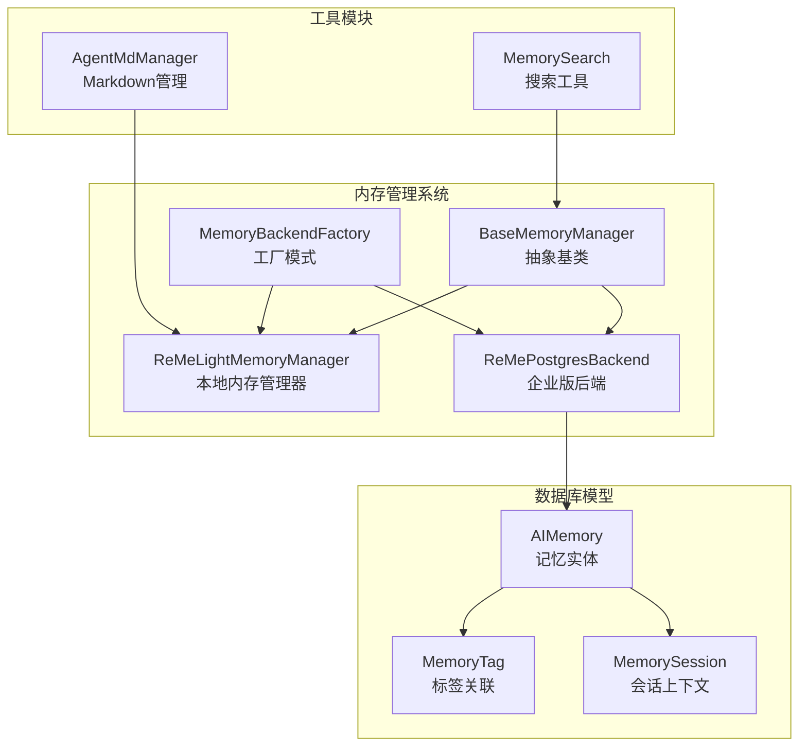
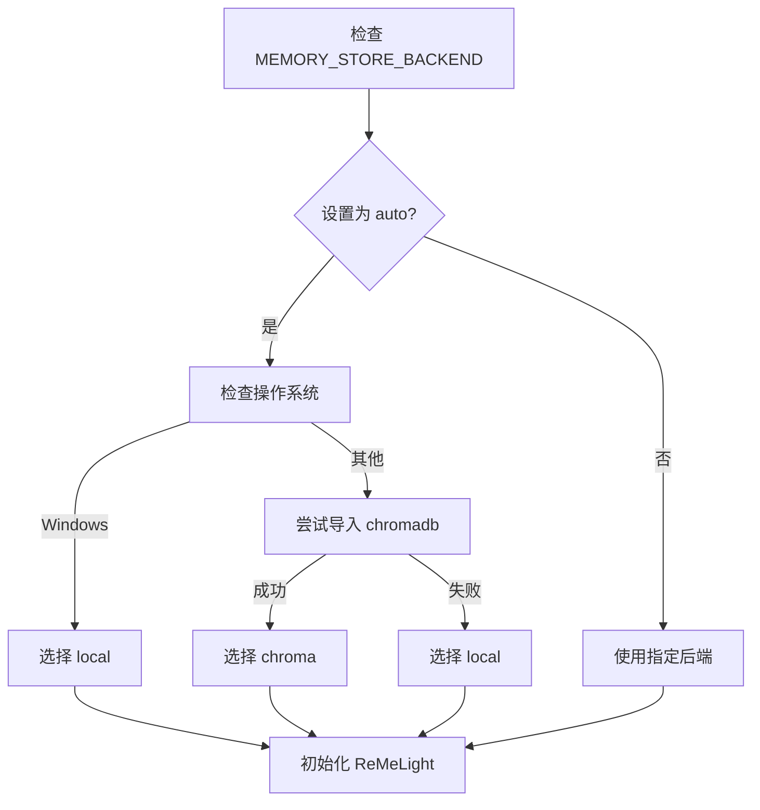
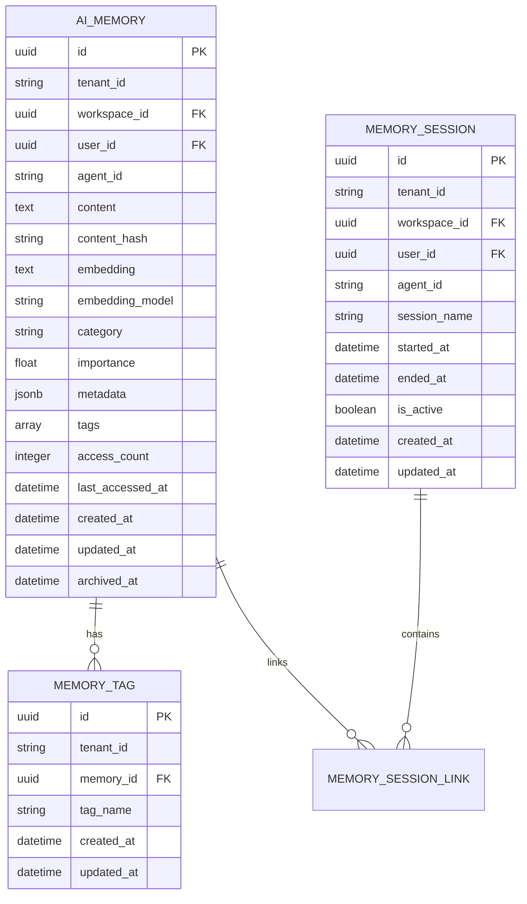
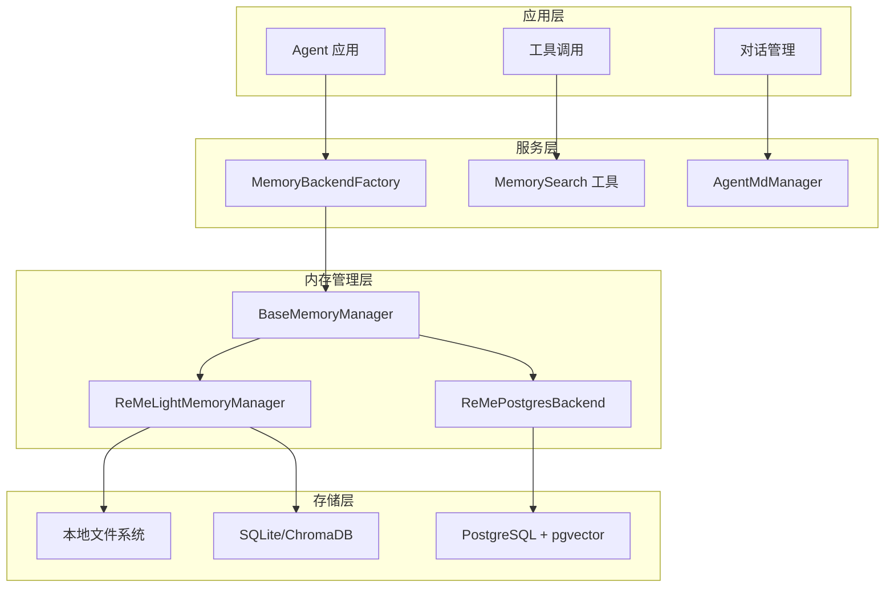
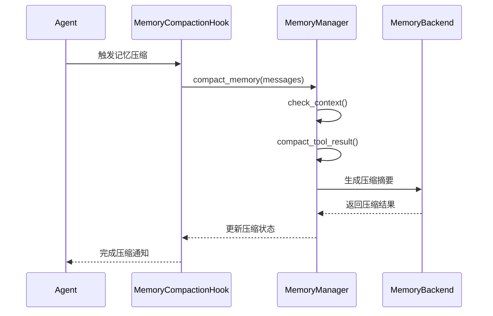
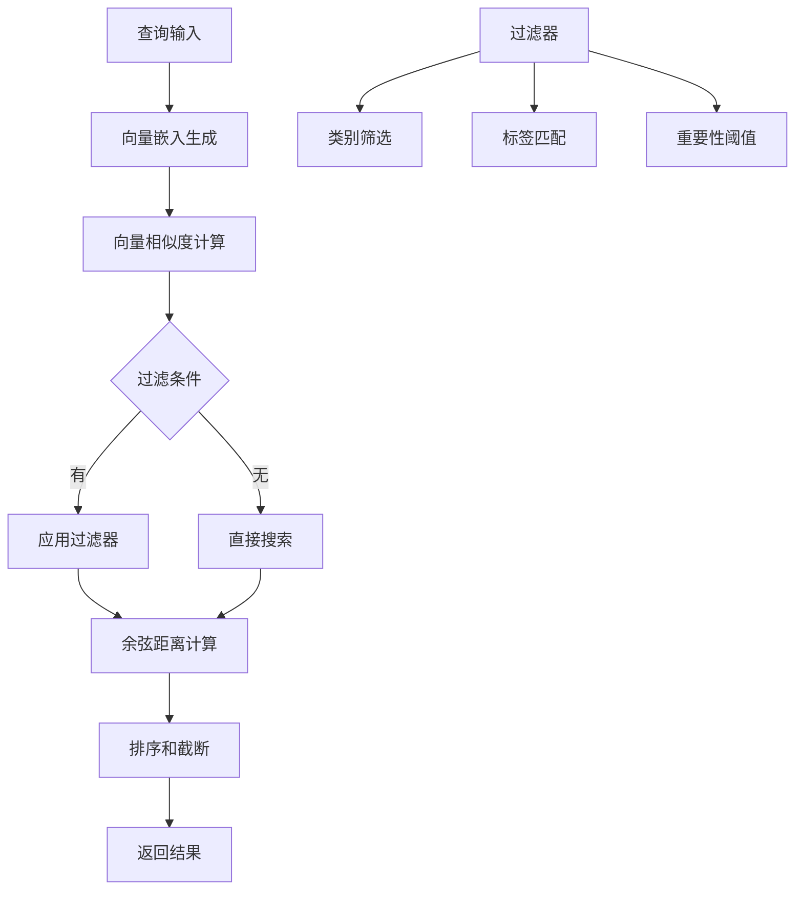
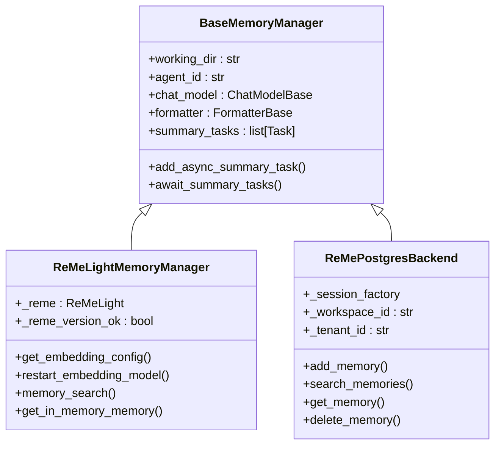
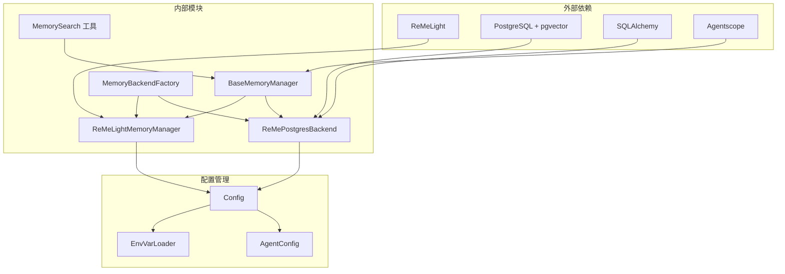

# 向量内存系统

<cite>
**本文档引用的文件**
- [base_memory_manager.py](file://src/copaw/agents/memory/base_memory_manager.py)
- [reme_light_memory_manager.py](file://src/copaw/agents/memory/reme_light_memory_manager.py)
- [reme_postgres_backend.py](file://src/copaw/agents/memory/reme_postgres_backend.py)
- [memory_backend_factory.py](file://src/copaw/agents/memory/memory_backend_factory.py)
- [agent_md_manager.py](file://src/copaw/agents/memory/agent_md_manager.py)
- [memory_search.py](file://src/copaw/agents/tools/memory_search.py)
- [memory.py](file://src/copaw/db/models/memory.py)
- [006_ai_memories_pgvector.py](file://alembic/versions/006_ai_memories_pgvector.py)
- [config.py](file://src/copaw/config/config.py)
</cite>

## 目录
1. [简介](#简介)
2. [项目结构](#项目结构)
3. [核心组件](#核心组件)
4. [架构概览](#架构概览)
5. [详细组件分析](#详细组件分析)
6. [依赖关系分析](#依赖关系分析)
7. [性能考虑](#性能考虑)
8. [故障排除指南](#故障排除指南)
9. [结论](#结论)

## 简介

向量内存系统是 CoPaw 人工智能平台的核心记忆管理组件，负责处理对话历史、工具结果和知识内容的存储、检索和管理。该系统采用混合架构设计，支持个人版和企业版两种不同的内存存储模式：

- **个人版**: 基于 ReMeLight 的本地文件存储，使用 SQLite 或 ChromaDB 进行向量检索
- **企业版**: 基于 PostgreSQL + pgvector 的云端分布式存储，支持多租户和高并发访问

系统提供了完整的记忆生命周期管理，包括记忆创建、向量化、存储、检索、压缩和清理等功能。

## 项目结构

向量内存系统主要位于 `src/copaw/agents/memory/` 目录下，包含以下核心模块：

**图表来源**
- [base_memory_manager.py:21-226](file://src/copaw/agents/memory/base_memory_manager.py#L21-L226)
- [reme_light_memory_manager.py:37-391](file://src/copaw/agents/memory/reme_light_memory_manager.py#L37-L391)
- [reme_postgres_backend.py:24-271](file://src/copaw/agents/memory/reme_postgres_backend.py#L24-L271)
- [memory_backend_factory.py:18-120](file://src/copaw/agents/memory/memory_backend_factory.py#L18-L120)

**章节来源**
- [base_memory_manager.py:1-226](file://src/copaw/agents/memory/base_memory_manager.py#L1-L226)
- [reme_light_memory_manager.py:1-391](file://src/copaw/agents/memory/reme_light_memory_manager.py#L1-L391)
- [reme_postgres_backend.py:1-271](file://src/copaw/agents/memory/reme_postgres_backend.py#L1-L271)
- [memory_backend_factory.py:1-120](file://src/copaw/agents/memory/memory_backend_factory.py#L1-L120)

## 核心组件

### 抽象基类 - BaseMemoryManager

BaseMemoryManager 定义了所有内存管理器必须实现的标准接口，确保不同后端的兼容性和可替换性。

**核心功能**:
- 生命周期管理：启动和关闭内存系统
- 记忆压缩：处理工具结果和对话历史压缩
- 上下文检查：监控和控制上下文大小
- 语义搜索：基于向量和全文的智能检索
- 总结生成：自动生成对话摘要

**关键方法**:
- `start()`: 初始化内存管理器
- `close()`: 清理和关闭资源
- `compact_memory()`: 压缩对话历史
- `summary_memory()`: 生成综合摘要
- `memory_search()`: 执行语义搜索

**章节来源**
- [base_memory_manager.py:21-226](file://src/copaw/agents/memory/base_memory_manager.py#L21-L226)

### ReMeLightMemoryManager - 本地内存管理器

ReMeLightMemoryManager 是个人版的主要实现，基于 ReMeLight 框架提供完整的内存管理功能。

**核心特性**:
- **自动后端选择**: 根据平台和依赖自动选择最佳存储后端
- **向量嵌入**: 支持多种嵌入模型和自定义维度
- **全文搜索**: 结合向量和文本的混合搜索
- **异步处理**: 支持后台摘要任务和并发操作

**后端选择逻辑**:

**图表来源**
- [reme_light_memory_manager.py:70-127](file://src/copaw/agents/memory/reme_light_memory_manager.py#L70-L127)

**章节来源**
- [reme_light_memory_manager.py:37-391](file://src/copaw/agents/memory/reme_light_memory_manager.py#L37-L391)

### ReMePostgresBackend - 企业版后端

ReMePostgresBackend 提供企业级的向量记忆存储解决方案，基于 PostgreSQL 和 pgvector 扩展。

**核心功能**:
- **分布式存储**: 支持多实例共享和高可用性
- **向量检索**: 使用 pgvector 的高效向量相似度搜索
- **标签管理**: 支持复杂的数据标签和过滤
- **会话关联**: 维护记忆与用户会话的关联关系

**数据模型**:

**图表来源**
- [memory.py:39-248](file://src/copaw/db/models/memory.py#L39-L248)

**章节来源**
- [reme_postgres_backend.py:24-271](file://src/copaw/agents/memory/reme_postgres_backend.py#L24-L271)
- [memory.py:39-248](file://src/copaw/db/models/memory.py#L39-L248)

### MemoryBackendFactory - 工厂模式

MemoryBackendFactory 实现了工厂设计模式，根据运行环境自动选择合适的内存后端。

**工厂策略**:
- **企业版**: 自动选择 PostgreSQL + pgvector 后端
- **个人版**: 自动选择 SQLite/Chroma/Local 后端
- **配置优先**: 支持通过环境变量手动指定后端类型

**章节来源**
- [memory_backend_factory.py:18-120](file://src/copaw/agents/memory/memory_backend_factory.py#L18-L120)

## 架构概览

向量内存系统采用分层架构设计，确保了良好的可扩展性和维护性：

**图表来源**
- [memory_backend_factory.py:18-120](file://src/copaw/agents/memory/memory_backend_factory.py#L18-L120)
- [base_memory_manager.py:21-226](file://src/copaw/agents/memory/base_memory_manager.py#L21-L226)
- [reme_light_memory_manager.py:37-391](file://src/copaw/agents/memory/reme_light_memory_manager.py#L37-L391)
- [reme_postgres_backend.py:24-271](file://src/copaw/agents/memory/reme_postgres_backend.py#L24-L271)

## 详细组件分析

### 记忆压缩机制

记忆压缩是向量内存系统的核心功能之一，用于控制上下文大小并提高检索效率。

**压缩流程**:
1. **工具结果压缩**: 首先压缩长输出的工具调用结果
2. **上下文检查**: 计算当前上下文的 token 数量
3. **对话压缩**: 将超出阈值的历史对话压缩为结构化摘要
4. **状态更新**: 更新记忆状态并清理已压缩的消息

**章节来源**
- [reme_light_memory_manager.py:255-331](file://src/copaw/agents/memory/reme_light_memory_manager.py#L255-L331)
- [base_memory_manager.py:84-114](file://src/copaw/agents/memory/base_memory_manager.py#L84-L114)

### 向量检索算法

系统实现了高效的向量相似度搜索算法，支持大规模记忆数据的快速检索。

**搜索优化**:
- **索引策略**: 使用 IVFFlat 索引提高搜索性能
- **批量处理**: 支持批量向量嵌入和查询
- **缓存机制**: 缓存常用查询结果减少重复计算
- **增量更新**: 支持实时增量索引更新

**章节来源**
- [reme_postgres_backend.py:95-148](file://src/copaw/agents/memory/reme_postgres_backend.py#L95-L148)
- [006_ai_memories_pgvector.py:59-63](file://alembic/versions/006_ai_memories_pgvector.py#L59-L63)

### 异步任务管理

系统采用异步编程模式处理后台任务，如摘要生成和向量嵌入。

**图表来源**
- [base_memory_manager.py:21-226](file://src/copaw/agents/memory/base_memory_manager.py#L21-L226)
- [reme_light_memory_manager.py:37-391](file://src/copaw/agents/memory/reme_light_memory_manager.py#L37-L391)
- [reme_postgres_backend.py:24-271](file://src/copaw/agents/memory/reme_postgres_backend.py#L24-L271)

**章节来源**
- [base_memory_manager.py:116-196](file://src/copaw/agents/memory/base_memory_manager.py#L116-L196)
- [reme_light_memory_manager.py:171-214](file://src/copaw/agents/memory/reme_light_memory_manager.py#L171-L214)

## 依赖关系分析

向量内存系统的设计遵循了清晰的依赖层次结构，确保了模块间的松耦合和高内聚。

**依赖特点**:
- **向下兼容**: 所有具体实现都遵循 BaseMemoryManager 接口
- **向上解耦**: 工厂模式消除了上层对具体实现的依赖
- **横向独立**: 各模块间依赖关系清晰，便于单独测试和维护

**章节来源**
- [memory_backend_factory.py:72-120](file://src/copaw/agents/memory/memory_backend_factory.py#L72-L120)
- [config.py:32-92](file://src/copaw/config/config.py#L32-L92)

## 性能考虑

### 存储性能优化

**企业版性能特性**:
- **向量索引**: 使用 IVFFlat 索引支持大规模向量数据的快速检索
- **连接池**: PostgreSQL 连接池管理提高并发访问性能
- **批量操作**: 支持批量插入和查询减少网络开销
- **缓存策略**: 多层缓存机制减少重复计算

**个人版优化**:
- **本地缓存**: 利用本地文件系统缓存常用数据
- **异步处理**: 非阻塞的异步操作避免界面卡顿
- **内存映射**: ReMeLight 的内存映射技术提高读写速度

### 搜索性能优化

**索引策略**:
- **混合索引**: 结合向量索引和传统索引提高查询效率
- **预计算**: 预计算常用查询结果减少实时计算开销
- **分页加载**: 大量结果的分页加载避免内存溢出

**查询优化**:
- **向量裁剪**: 在查询前进行向量维度裁剪减少计算量
- **结果过滤**: 多级过滤减少不必要的数据传输
- **超时控制**: 查询超时机制防止长时间阻塞

## 故障排除指南

### 常见问题及解决方案

**1. 向量嵌入失败**
- **症状**: 记忆无法正确向量化
- **原因**: 嵌入模型配置错误或网络连接问题
- **解决**: 检查 EMBEDDING_API_KEY 和 EMBEDDING_BASE_URL 配置

**2. 搜索结果不准确**
- **症状**: 语义搜索返回相关度较低的结果
- **原因**: 向量维度不匹配或索引未建立
- **解决**: 确保使用正确的嵌入模型和建立向量索引

**3. 性能下降**
- **症状**: 搜索响应时间过长
- **原因**: 数据库连接池耗尽或索引失效
- **解决**: 调整连接池参数或重建索引

**4. 内存泄漏**
- **症状**: 应用内存持续增长
- **原因**: 异步任务未正确清理
- **解决**: 调用 await_summary_tasks() 清理任务队列

**章节来源**
- [reme_light_memory_manager.py:143-170](file://src/copaw/agents/memory/reme_light_memory_manager.py#L143-L170)
- [base_memory_manager.py:116-196](file://src/copaw/agents/memory/base_memory_manager.py#L116-L196)

### 调试工具

**日志记录**:
- **详细级别**: INFO 级别记录正常操作，ERROR 级别记录异常
- **关键信息**: 包含 agent_id、memory_id 和操作结果
- **性能指标**: 记录查询耗时和内存使用情况

**监控指标**:
- **查询统计**: 搜索请求次数和成功率
- **性能指标**: 平均响应时间和错误率
- **资源使用**: 内存、CPU 和数据库连接使用情况

## 结论

向量内存系统通过精心设计的架构和优化的实现，为 CoPaw 平台提供了强大而灵活的记忆管理能力。系统的关键优势包括：

**技术优势**:
- **双模式支持**: 同时满足个人用户和企业用户的不同需求
- **高性能检索**: 基于 pgvector 的向量搜索提供精确的语义匹配
- **可扩展性**: 模块化设计支持功能扩展和性能优化
- **可靠性**: 完善的错误处理和监控机制确保系统稳定运行

**应用场景**:
- **对话助手**: 长对话历史的记忆和上下文管理
- **知识管理**: 结构化知识的存储和检索
- **工具调用**: 复杂工具结果的压缩和管理
- **多模态交互**: 文本、图像等多种类型内容的记忆

该系统为构建智能 AI 应用提供了坚实的基础，通过持续的优化和扩展，能够满足各种复杂的记忆管理需求。