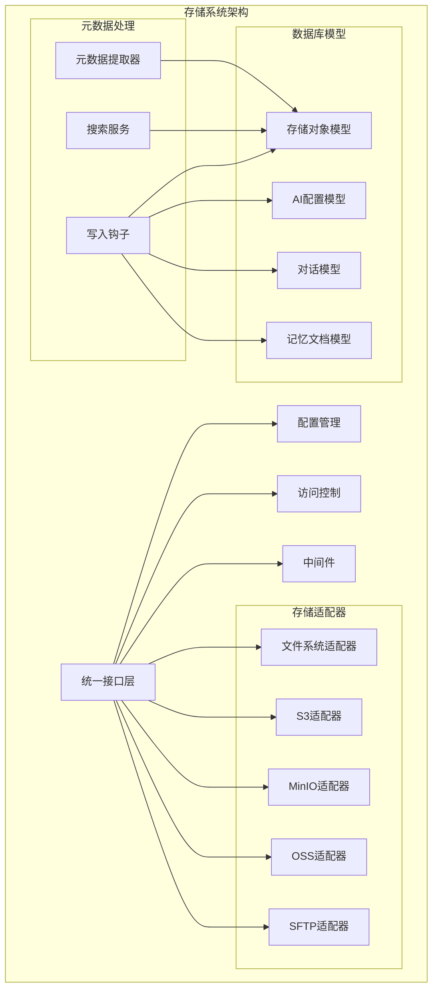
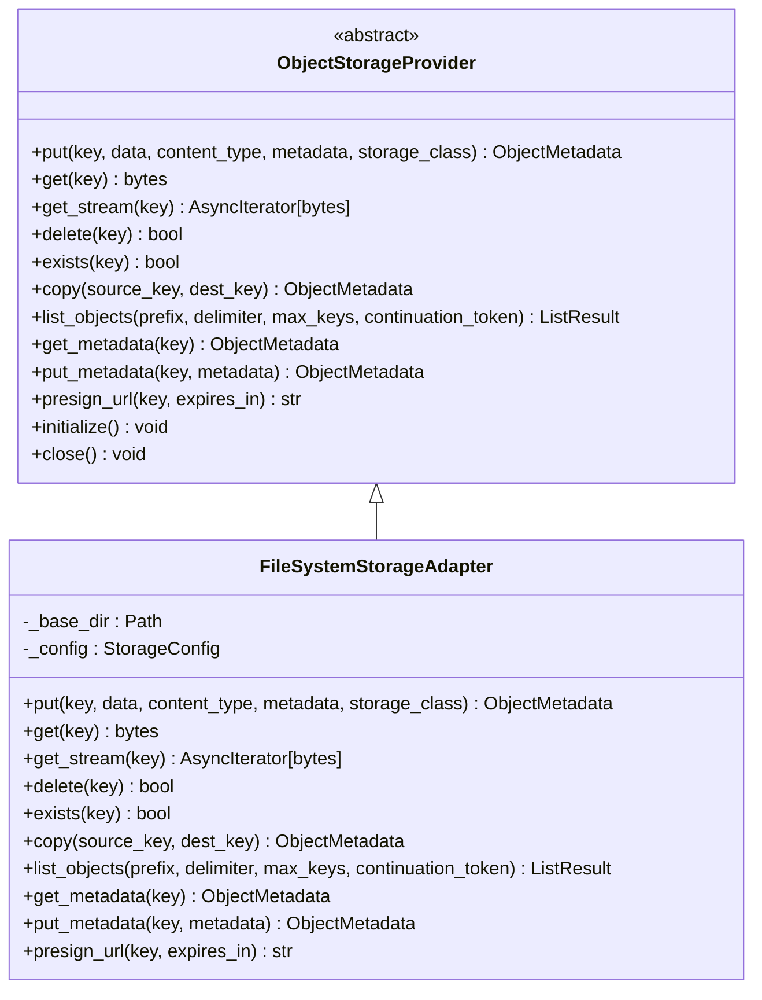
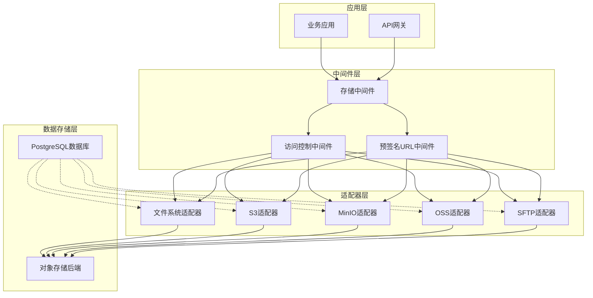
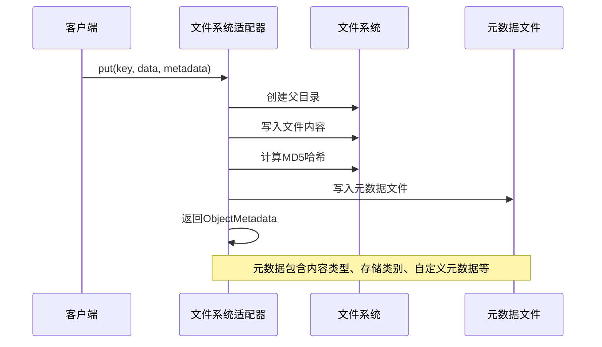
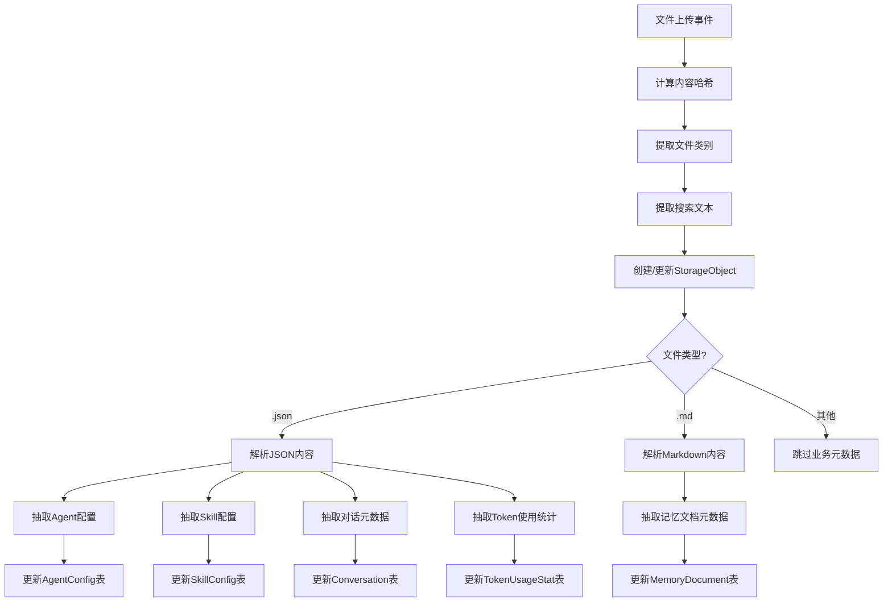
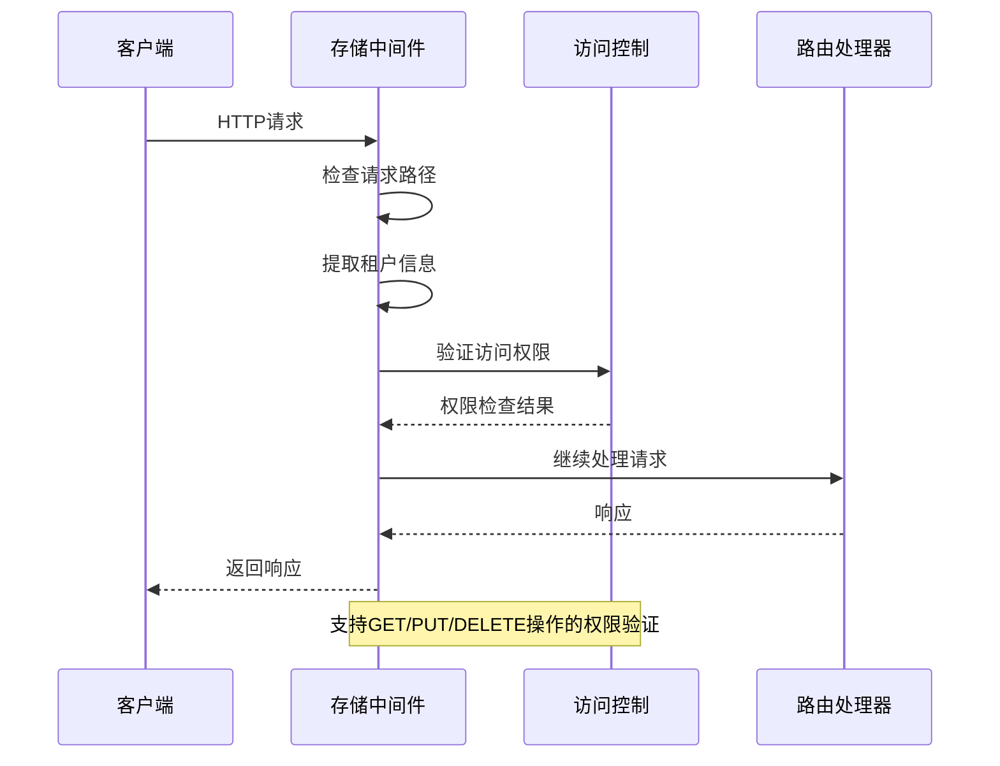
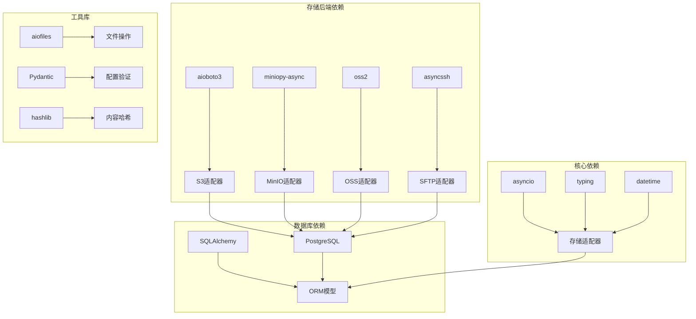

# 对象存储系统

<cite>
**本文档引用的文件**
- [storage/__init__.py](file://src/copaw/storage/__init__.py)
- [storage/base.py](file://src/copaw/storage/base.py)
- [storage/config.py](file://src/copaw/storage/config.py)
- [storage/middleware.py](file://src/copaw/storage/middleware.py)
- [storage/access_control.py](file://src/copaw/storage/access_control.py)
- [storage/key_builder.py](file://src/copaw/storage/key_builder.py)
- [storage/metadata_extractor.py](file://src/copaw/storage/metadata_extractor.py)
- [storage/search_service.py](file://src/copaw/storage/search_service.py)
- [storage/write_hook.py](file://src/copaw/storage/write_hook.py)
- [storage/filesystem_adapter.py](file://src/copaw/storage/filesystem_adapter.py)
- [storage/s3_adapter.py](file://src/copaw/storage/s3_adapter.py)
- [storage/minio_adapter.py](file://src/copaw/storage/minio_adapter.py)
- [storage/oss_adapter.py](file://src/copaw/storage/oss_adapter.py)
- [storage/sftp_adapter.py](file://src/copaw/storage/sftp_adapter.py)
- [db/models/storage_meta.py](file://src/copaw/db/models/storage_meta.py)
</cite>

## 目录
1. [简介](#简介)
2. [项目结构](#项目结构)
3. [核心组件](#核心组件)
4. [架构概览](#架构概览)
5. [详细组件分析](#详细组件分析)
6. [依赖关系分析](#依赖关系分析)
7. [性能考虑](#性能考虑)
8. [故障排除指南](#故障排除指南)
9. [结论](#结论)

## 简介

对象存储系统是 CoPaw AI 助手平台的核心基础设施，提供了统一的多后端存储抽象层。该系统支持多种存储后端（本地文件系统、S3、MinIO、OSS、SFTP），实现了企业级的多租户访问控制、智能元数据提取和全文搜索功能。

系统采用分层架构设计，通过统一的接口抽象屏蔽了底层存储差异，同时提供了丰富的扩展点以支持未来的存储后端集成。该系统特别注重企业级需求，包括安全访问控制、审计跟踪、性能优化和可靠性保障。

## 项目结构

对象存储系统位于 `src/copaw/storage/` 目录下，采用模块化设计，每个功能模块都有明确的职责分工：

**图表来源**
- [storage/__init__.py:1-118](file://src/copaw/storage/__init__.py#L1-L118)
- [storage/base.py:1-230](file://src/copaw/storage/base.py#L1-L230)

**章节来源**
- [storage/__init__.py:1-118](file://src/copaw/storage/__init__.py#L1-L118)
- [storage/base.py:1-230](file://src/copaw/storage/base.py#L1-L230)

## 核心组件

### 统一存储接口

系统定义了 `ObjectStorageProvider` 抽象基类，为所有存储后端提供统一的操作接口。该接口涵盖了对象存储的核心操作：

- **基础操作**：put、get、get_stream、delete、exists、copy
- **列表操作**：list_objects
- **元数据操作**：get_metadata、put_metadata  
- **预签名URL**：presign_url
- **生命周期管理**：initialize、close

**图表来源**
- [storage/base.py:146-230](file://src/copaw/storage/base.py#L146-L230)
- [storage/filesystem_adapter.py:37-259](file://src/copaw/storage/filesystem_adapter.py#L37-L259)

### 配置管理系统

`StorageConfig` 类提供了统一的配置管理机制，支持多种存储后端的配置参数：

- **通用设置**：默认存储桶、预签名URL启用、元数据同步
- **S3兼容设置**：端点URL、访问密钥、区域、存储桶
- **MinIO设置**：端点、访问密钥、安全连接、存储桶
- **OSS设置**：端点、访问密钥、存储桶
- **SFTP设置**：主机、端口、用户名、密码、私钥路径、基础目录
- **文件系统设置**：个人版本地目录

**章节来源**
- [storage/config.py:16-140](file://src/copaw/storage/config.py#L16-L140)

### 多租户访问控制

系统实现了基于角色的访问控制（RBAC）机制，确保不同租户之间的数据隔离：

- **访问级别**：SYSTEM、TENANT、DEPARTMENT、USER、PUBLIC
- **资源前缀构建**：支持租户级、部门级、用户级资源组织
- **权限验证**：动态检查用户对存储键的访问权限
- **跨租户隔离**：超级管理员可跨租户访问，普通用户仅限本租户

**章节来源**
- [storage/access_control.py:15-175](file://src/copaw/storage/access_control.py#L15-L175)
- [storage/key_builder.py:15-242](file://src/copaw/storage/key_builder.py#L15-L242)

## 架构概览

对象存储系统采用分层架构，从上到下分为应用层、中间件层、适配器层和数据存储层：

**图表来源**
- [storage/middleware.py:22-110](file://src/copaw/storage/middleware.py#L22-L110)
- [storage/__init__.py:61-118](file://src/copaw/storage/__init__.py#L61-L118)

## 详细组件分析

### 存储适配器实现

#### 文件系统适配器

文件系统适配器为个人版用户提供本地文件系统存储支持，完全兼容 `~/.copaw/` 目录布局：

- **路径安全**：防止路径遍历攻击，确保文件访问限制在基础目录内
- **元数据管理**：使用 `.meta.json` 侧车文件存储对象元数据
- **流式读取**：支持大文件的流式下载，内存友好
- **ETag计算**：基于文件内容MD5计算ETag，支持内容变更检测

**图表来源**
- [storage/filesystem_adapter.py:105-138](file://src/copaw/storage/filesystem_adapter.py#L105-L138)

**章节来源**
- [storage/filesystem_adapter.py:37-259](file://src/copaw/storage/filesystem_adapter.py#L37-L259)

#### S3兼容适配器

S3适配器支持AWS S3、Ceph、DigitalOcean Spaces等S3兼容存储服务：

- **异步客户端**：使用 `aioboto3` 实现异步S3操作
- **自动桶创建**：初始化时自动创建存储桶
- **错误处理**：完善的异常处理机制，区分不同类型的存储错误
- **流式上传**：支持流式数据上传，适合大文件场景

**章节来源**
- [storage/s3_adapter.py:26-200](file://src/copaw/storage/s3_adapter.py#L26-L200)

#### MinIO适配器

MinIO适配器提供专门的高性能实现，利用 `miniopy-async` SDK的优势：

- **原生SDK**：直接使用 `miniopy-async` SDK，性能更优
- **优化路径**：针对MinIO特性进行了专门优化
- **自动桶管理**：自动检查和创建存储桶
- **异步操作**：完整的异步操作支持

**章节来源**
- [storage/minio_adapter.py:26-200](file://src/copaw/storage/minio_adapter.py#L26-L200)

#### OSS适配器

OSS适配器使用 `oss2` SDK，通过线程池实现异步兼容：

- **同步SDK包装**：使用 `asyncio.to_thread` 包装同步SDK调用
- **自定义头部**：支持自定义元数据头部 `x-oss-meta-*`
- **线程安全**：通过线程池确保SDK调用的线程安全性
- **错误映射**：将OSS异常映射到统一的存储异常体系

**章节来源**
- [storage/oss_adapter.py:26-200](file://src/copaw/storage/oss_adapter.py#L26-L200)

#### SFTP适配器

SFTP适配器模拟对象存储语义，支持传统的文件服务器和内部NAS：

- **路径映射**：将存储键映射到远程服务器上的相对路径
- **连接管理**：支持密码和私钥认证方式
- **目录创建**：自动创建必要的目录结构
- **回退机制**：SFTP不支持原生复制时的下载上传回退

**章节来源**
- [storage/sftp_adapter.py:26-200](file://src/copaw/storage/sftp_adapter.py#L26-L200)

### 元数据提取与搜索

#### 元数据提取器

元数据提取器实现了双轨存储架构的核心功能，负责从文件内容中抽取结构化信息：

**图表来源**
- [storage/write_hook.py:37-131](file://src/copaw/storage/write_hook.py#L37-L131)
- [storage/metadata_extractor.py:21-313](file://src/copaw/storage/metadata_extractor.py#L21-L313)

系统支持以下文件类型的智能提取：

- **Agent配置**：从 `agent.json` 提取模型配置、技能列表、通道设置等
- **Skill配置**：从 `skill.json` 提取技能元数据和属性
- **对话历史**：从 `chats.json` 提取对话和消息结构
- **Token使用**：从 `token_usage.json` 提取使用统计和成本信息
- **记忆文档**：从各种Markdown文件提取标题、标签、摘要等

**章节来源**
- [storage/metadata_extractor.py:21-313](file://src/copaw/storage/metadata_extractor.py#L21-L313)
- [storage/write_hook.py:133-424](file://src/copaw/storage/write_hook.py#L133-L424)

#### 搜索服务

搜索服务提供了基于PostgreSQL全文搜索的智能检索能力：

- **全文搜索**：使用PostgreSQL的 `to_tsvector` 和 `plainto_tsquery` 实现
- **多维过滤**：支持按类别、所有者、工作空间、标签、时间范围等过滤
- **排序控制**：支持多种字段的升序/降序排序
- **分页处理**：高效的分页查询实现

**章节来源**
- [storage/search_service.py:51-211](file://src/copaw/storage/search_service.py#L51-L211)

### 中间件与访问控制

#### 存储中间件

存储中间件实现了自动的租户前缀注入和访问控制检查：

**图表来源**
- [storage/middleware.py:22-110](file://src/copaw/storage/middleware.py#L22-L110)

**章节来源**
- [storage/middleware.py:22-110](file://src/copaw/storage/middleware.py#L22-L110)
- [storage/access_control.py:25-175](file://src/copaw/storage/access_control.py#L25-L175)

## 依赖关系分析

对象存储系统的依赖关系清晰且层次分明：

**图表来源**
- [storage/s3_adapter.py:42-47](file://src/copaw/storage/s3_adapter.py#L42-L47)
- [storage/minio_adapter.py:36-41](file://src/copaw/storage/minio_adapter.py#L36-L41)
- [storage/oss_adapter.py:37-42](file://src/copaw/storage/oss_adapter.py#L37-L42)
- [storage/sftp_adapter.py:41-46](file://src/copaw/storage/sftp_adapter.py#L41-L46)

**章节来源**
- [storage/__init__.py:61-86](file://src/copaw/storage/__init__.py#L61-L86)

## 性能考虑

### 存储性能优化

系统在多个层面实现了性能优化：

- **流式处理**：大文件采用流式上传下载，避免内存峰值
- **连接池管理**：异步客户端支持连接复用和自动重连
- **缓存策略**：ETag和内容哈希用于变更检测，减少重复处理
- **批量操作**：支持批量元数据提取和数据库写入

### 搜索性能优化

- **全文索引**：PostgreSQL的GIN索引支持高效的全文搜索
- **复合索引**：针对常用查询条件建立复合索引
- **查询优化**：使用 `EXPLAIN ANALYZE` 分析查询计划
- **分页优化**：基于游标和偏移量的高效分页实现

### 并发处理

- **异步I/O**：所有存储操作都是异步非阻塞的
- **并发限制**：通过连接池和队列限制并发度
- **超时控制**：合理的超时设置防止资源泄露
- **错误恢复**：自动重试和优雅降级机制

## 故障排除指南

### 常见问题诊断

#### 存储连接问题

**症状**：无法连接到存储后端
**排查步骤**：
1. 检查网络连接和防火墙设置
2. 验证认证凭据的正确性
3. 确认存储桶/目录的存在性和权限
4. 查看具体的异常信息和错误码

#### 权限访问问题

**症状**：访问被拒绝或权限不足
**排查步骤**：
1. 验证用户角色和访问级别
2. 检查存储键的租户前缀
3. 确认资源的所有者信息
4. 查看访问控制日志

#### 性能问题

**症状**：存储操作响应缓慢
**排查步骤**：
1. 监控磁盘I/O和网络带宽
2. 检查数据库查询性能
3. 分析异步任务队列
4. 优化索引和查询计划

**章节来源**
- [storage/base.py:65-141](file://src/copaw/storage/base.py#L65-L141)
- [storage/middleware.py:91-101](file://src/copaw/storage/middleware.py#L91-L101)

### 错误处理机制

系统实现了完善的错误处理和异常管理：

- **统一异常体系**：继承自 `AgentRuntimeErrorException`
- **具体异常类型**：针对不同错误场景的专门异常
- **详细错误信息**：包含关键参数和上下文信息
- **日志记录**：完整的错误日志和审计追踪

**章节来源**
- [storage/base.py:65-141](file://src/copaw/storage/base.py#L65-L141)

## 结论

对象存储系统通过其模块化设计和企业级功能，为CoPaw AI助手平台提供了强大而灵活的存储基础设施。系统的主要优势包括：

1. **统一抽象**：通过统一接口屏蔽底层存储差异
2. **多后端支持**：灵活支持多种存储后端，满足不同部署需求
3. **企业级安全**：完善的多租户访问控制和审计功能
4. **智能元数据**：自动化的元数据提取和结构化存储
5. **高性能设计**：异步处理、流式操作和优化的搜索能力

该系统为AI助手平台的持续发展奠定了坚实的基础，能够支持从个人版到企业级的大规模部署需求。通过模块化的架构设计，系统具备良好的可扩展性和维护性，能够适应未来的技术演进和业务需求变化。