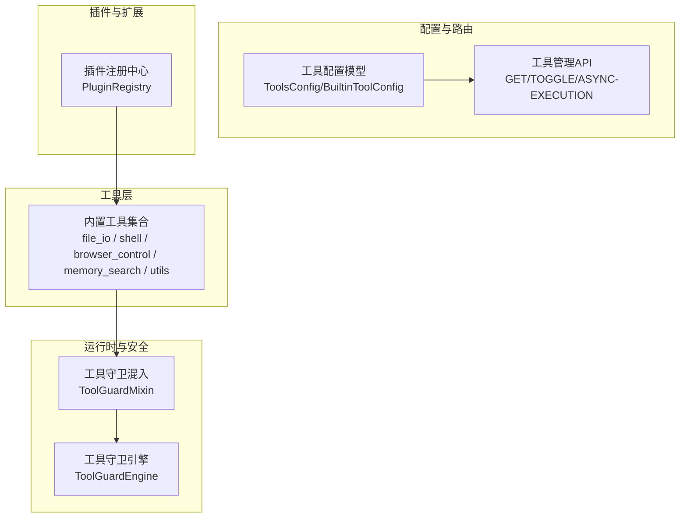
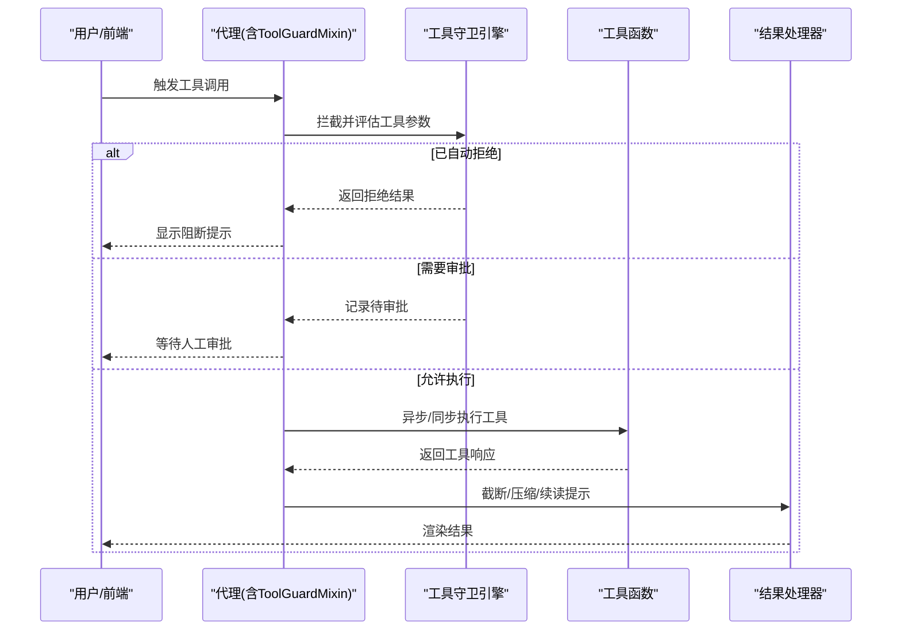
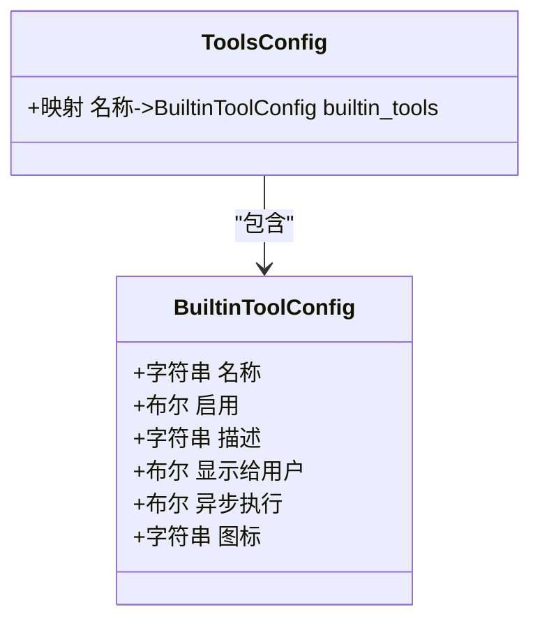
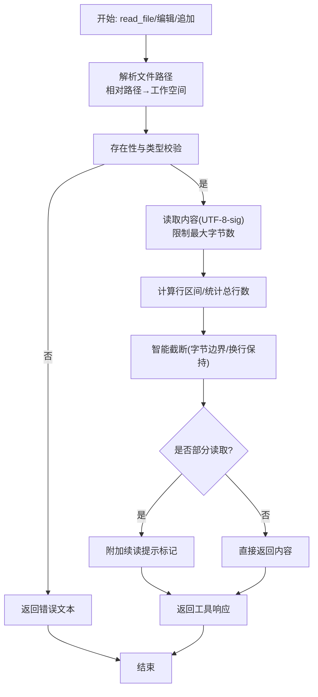
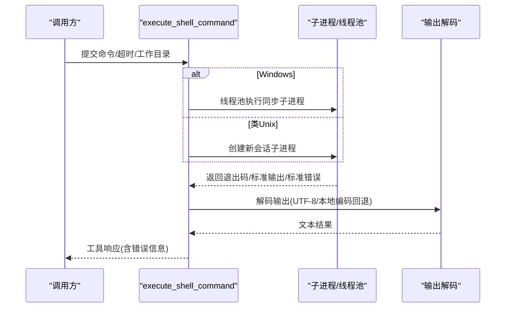
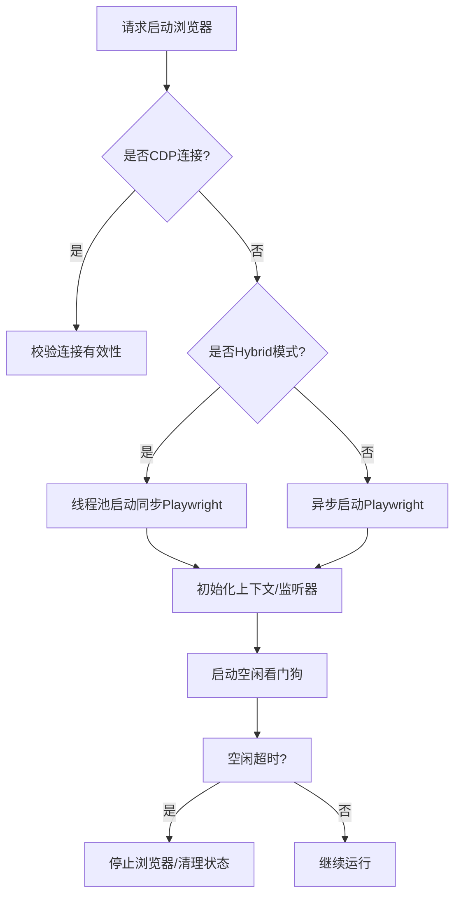
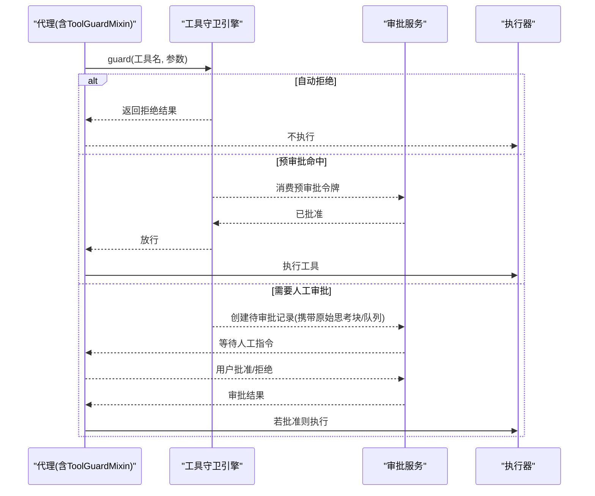
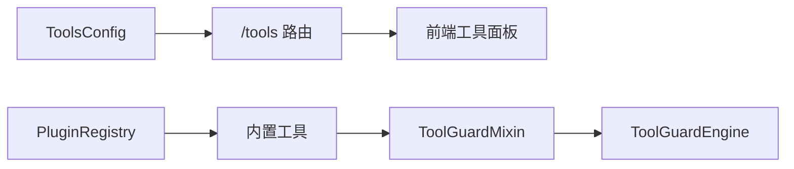

# 工具系统

<cite>
**本文引用的文件**
- [agents/tools/__init__.py](file://src/copaw/agents/tools/__init__.py)
- [agents/tools/utils.py](file://src/copaw/agents/tools/utils.py)
- [agents/tools/file_io.py](file://src/copaw/agents/tools/file_io.py)
- [agents/tools/shell.py](file://src/copaw/agents/tools/shell.py)
- [agents/tools/browser_control.py](file://src/copaw/agents/tools/browser_control.py)
- [agents/tools/memory_search.py](file://src/copaw/agents/tools/memory_search.py)
- [agents/tool_guard_mixin.py](file://src/copaw/agents/tool_guard_mixin.py)
- [app/routers/tools.py](file://src/copaw/app/routers/tools.py)
- [config/config.py](file://src/copaw/config/config.py)
- [constant.py](file://src/copaw/constant.py)
- [plugins/registry.py](file://src/copaw/plugins/registry.py)
- [security/tool_guard/engine.py](file://src/copaw/security/tool_guard/engine.py)
</cite>

## 目录
1. [简介](#简介)
2. [项目结构](#项目结构)
3. [核心组件](#核心组件)
4. [架构总览](#架构总览)
5. [详细组件分析](#详细组件分析)
6. [依赖分析](#依赖分析)
7. [性能考虑](#性能考虑)
8. [故障排查指南](#故障排查指南)
9. [结论](#结论)
10. [附录](#附录)

## 简介
本技术文档系统化阐述 Copaw 工具系统的抽象设计、接口规范与执行机制，覆盖工具注册、发现、调用、结果处理的完整流程；解释参数校验、安全沙箱、资源限制的实现策略；给出内置工具集、自定义工具开发与工具组合使用的指南；并提供性能优化与安全加固的最佳实践，以及链式调用、错误处理与超时控制等高级特性说明。

## 项目结构
工具系统主要由以下模块构成：
- 内置工具集合：文件读写、搜索、Shell 命令、浏览器自动化、媒体查看、时间与时区、令牌用量统计、内存检索等。
- 工具运行时与安全：工具调用拦截与审批流、守护引擎、工具结果压缩与截断策略。
- 配置与路由：工具启用/禁用、异步执行开关、工具信息查询 API。
- 插件与扩展：插件注册中心，支持插件化扩展工具能力。

图示来源
- [agents/tools/__init__.py:1-48](file://src/copaw/agents/tools/__init__.py#L1-L48)
- [agents/tool_guard_mixin.py:1-800](file://src/copaw/agents/tool_guard_mixin.py#L1-L800)
- [security/tool_guard/engine.py:1-238](file://src/copaw/security/tool_guard/engine.py#L1-L238)
- [app/routers/tools.py:1-181](file://src/copaw/app/routers/tools.py#L1-L181)
- [config/config.py:939-1067](file://src/copaw/config/config.py#L939-L1067)
- [plugins/registry.py:1-254](file://src/copaw/plugins/registry.py#L1-L254)

章节来源
- [agents/tools/__init__.py:1-48](file://src/copaw/agents/tools/__init__.py#L1-L48)
- [config/config.py:939-1067](file://src/copaw/config/config.py#L939-L1067)
- [app/routers/tools.py:1-181](file://src/copaw/app/routers/tools.py#L1-L181)

## 核心组件
- 工具抽象与接口规范
  - 工具函数统一返回工具响应对象，内容块以文本为主，便于消息系统与前端渲染。
  - 参数类型严格约束，异常路径返回错误文本，保证调用方可预期的失败语义。
- 工具注册与发现
  - 通过工具包导出聚合，集中暴露可用工具名称与别名，便于运行时动态装配。
- 工具执行与结果处理
  - 异步执行优先，支持后台异步模式；结果进行字节级截断与续读提示，避免上下文溢出。
- 安全与沙箱
  - 工具调用前经守卫引擎评估，敏感工具进入审批流程；支持自动拒绝、预审批与风险提示。
- 资源限制
  - Shell 执行设置超时与进程组清理；浏览器自动化按工作空间隔离状态，空闲自动回收；文件读取限制最大内存占用与编码容错。

章节来源
- [agents/tools/file_io.py:66-396](file://src/copaw/agents/tools/file_io.py#L66-L396)
- [agents/tools/shell.py:284-454](file://src/copaw/agents/tools/shell.py#L284-L454)
- [agents/tools/browser_control.py:494-800](file://src/copaw/agents/tools/browser_control.py#L494-L800)
- [agents/tool_guard_mixin.py:261-616](file://src/copaw/agents/tool_guard_mixin.py#L261-L616)
- [agents/tools/utils.py:151-227](file://src/copaw/agents/tools/utils.py#L151-L227)

## 架构总览
工具系统采用“工具函数 + 运行时拦截 + 配置驱动 + API 管理”的分层架构。运行时通过混入类在推理阶段插入工具调用拦截逻辑，结合守卫引擎对工具参数进行实时评估，并根据会话上下文决定是否进入审批队列。配置层提供工具启用、异步执行、图标与展示等元数据，API 层提供工具清单与动态开关能力。

图示来源
- [agents/tool_guard_mixin.py:261-616](file://src/copaw/agents/tool_guard_mixin.py#L261-L616)
- [security/tool_guard/engine.py:169-227](file://src/copaw/security/tool_guard/engine.py#L169-L227)
- [agents/tools/file_io.py:66-396](file://src/copaw/agents/tools/file_io.py#L66-L396)
- [agents/tools/shell.py:284-454](file://src/copaw/agents/tools/shell.py#L284-L454)

## 详细组件分析

### 工具注册与发现
- 工具聚合导出：通过工具包导出统一入口，集中暴露所有内置工具名称与别名，便于运行时装配与 UI 展示。
- 工具配置模型：每个内置工具具备启用、描述、图标、是否显示给用户、是否异步执行等元数据字段，支持按代理维度覆盖。

图示来源
- [config/config.py:939-1067](file://src/copaw/config/config.py#L939-L1067)

章节来源
- [agents/tools/__init__.py:1-48](file://src/copaw/agents/tools/__init__.py#L1-L48)
- [config/config.py:939-1067](file://src/copaw/config/config.py#L939-L1067)

### 文件工具链：读写、编辑与续读
- 路径解析与编码策略：相对路径解析至当前工作空间；不同文件类型采用不同编码策略以兼容跨平台编辑器。
- 行区间读取与智能截断：支持 start_line/end_line 的行区间读取；当输出超过阈值时进行字节级截断，并附带续读提示，便于分页拉取。
- 编辑与追加：提供查找替换与追加写入能力，内部复用读写流程并进行一致性校验。

图示来源
- [agents/tools/file_io.py:66-396](file://src/copaw/agents/tools/file_io.py#L66-L396)
- [agents/tools/utils.py:151-227](file://src/copaw/agents/tools/utils.py#L151-L227)

章节来源
- [agents/tools/file_io.py:66-396](file://src/copaw/agents/tools/file_io.py#L66-L396)
- [agents/tools/utils.py:151-227](file://src/copaw/agents/tools/utils.py#L151-L227)

### Shell 工具：跨平台执行与资源控制
- 平台差异处理：Windows 使用线程池绕过 asyncio 子进程限制；类 Unix 使用新会话与进程组确保子进程被正确终止。
- 命令清洗：对嵌入换行、转义序列进行归一化，避免不同平台命令解释差异导致的安全与稳定性问题。
- 超时与清理：统一超时控制与进程树清理策略，确保长时间运行命令不会泄漏资源。
- 输出解码：UTF-8 解码失败时回退到系统本地编码，保证非 UTF-8 输出也能稳定呈现。

图示来源
- [agents/tools/shell.py:284-454](file://src/copaw/agents/tools/shell.py#L284-L454)

章节来源
- [agents/tools/shell.py:284-454](file://src/copaw/agents/tools/shell.py#L284-L454)

### 浏览器自动化工具：多态与资源回收
- 多模式启动：支持同步/异步 Playwright 启动，Windows 在热重载模式下强制同步以规避 asyncio 限制；其他平台优先异步提升吞吐。
- 工作空间隔离：按工作空间维护浏览器状态，持久化用户数据目录，减少重复登录成本。
- 空闲回收：后台空闲看门狗定时停止浏览器实例，释放渲染进程与内存。
- 可视化与 Headless：根据 headed 参数切换可见窗口；默认 headless 以节省资源。

图示来源
- [agents/tools/browser_control.py:494-800](file://src/copaw/agents/tools/browser_control.py#L494-L800)

章节来源
- [agents/tools/browser_control.py:494-800](file://src/copaw/agents/tools/browser_control.py#L494-L800)

### 内存检索工具：语义搜索与结果格式化
- 绑定记忆管理器：通过工厂函数将外部记忆管理器绑定为工具函数，统一返回工具响应。
- 查询参数：支持最大结果数与最小相似度阈值，便于在不同场景下平衡召回与质量。
- 错误兜底：当记忆管理器未启用或查询异常时，返回明确的错误文本。

章节来源
- [agents/tools/memory_search.py:1-70](file://src/copaw/agents/tools/memory_search.py#L1-L70)

### 工具守卫与审批流：拦截、评估与重放
- 拦截点：在代理推理循环中拦截工具调用，区分自动拒绝、预审批与需要人工审批三类路径。
- 守卫引擎：聚合多种守护者（规则型、路径型），对工具名与参数进行扫描，生成发现记录与严重等级。
- 审批队列：记录原始助手消息与思考块，支持后续重放；在会话上下文中保留剩余队列，确保链式调用不丢失。
- 重放机制：当预审批或人工审批通过后，系统将剩余工具调用队列按顺序合成消息并注入对话历史，实现无缝衔接。

图示来源
- [agents/tool_guard_mixin.py:261-616](file://src/copaw/agents/tool_guard_mixin.py#L261-L616)
- [security/tool_guard/engine.py:169-227](file://src/copaw/security/tool_guard/engine.py#L169-L227)

章节来源
- [agents/tool_guard_mixin.py:261-616](file://src/copaw/agents/tool_guard_mixin.py#L261-L616)
- [security/tool_guard/engine.py:169-227](file://src/copaw/security/tool_guard/engine.py#L169-L227)

### 工具管理 API：动态开关与异步执行
- 列表接口：返回当前激活代理的工具清单，包含名称、启用状态、描述、异步执行标志与图标。
- 动态开关：按工具名切换启用状态，立即生效并通过调度器触发配置热重载。
- 异步执行更新：按工具名更新异步执行标志，立即生效并热重载。

章节来源
- [app/routers/tools.py:1-181](file://src/copaw/app/routers/tools.py#L1-L181)

### 配置与常量：工具阈值与截断标记
- 工具结果压缩阈值：近期消息与旧消息分别使用不同的字节上限，支持最近 N 条消息使用更大阈值。
- 截断标记：统一的截断标记用于在消息压缩阶段识别原始片段并重新截断，保证续读一致性。
- 默认工作目录与媒体目录：作为工具执行的默认根路径，保障相对路径解析的一致性。

章节来源
- [config/config.py:403-442](file://src/copaw/config/config.py#L403-L442)
- [constant.py:251-274](file://src/copaw/constant.py#L251-L274)

## 依赖分析
- 工具与运行时耦合
  - 工具函数依赖消息系统与工具响应对象，确保与代理的消息协议一致。
  - 工具守卫混入通过代理生命周期钩子接入，形成低侵入的安全增强。
- 配置与路由
  - 工具配置模型与 API 路由相互配合，实现工具元数据的读取与修改。
- 插件生态
  - 插件注册中心提供统一的扩展点，支持第三方工具以插件形式集成。

图示来源
- [config/config.py:939-1067](file://src/copaw/config/config.py#L939-L1067)
- [app/routers/tools.py:1-181](file://src/copaw/app/routers/tools.py#L1-L181)
- [plugins/registry.py:1-254](file://src/copaw/plugins/registry.py#L1-L254)

章节来源
- [config/config.py:939-1067](file://src/copaw/config/config.py#L939-L1067)
- [app/routers/tools.py:1-181](file://src/copaw/app/routers/tools.py#L1-L181)
- [plugins/registry.py:1-254](file://src/copaw/plugins/registry.py#L1-L254)

## 性能考虑
- 异步执行优先：文件读写与 Shell 执行均支持异步模式，减少阻塞；浏览器自动化在类 Unix 平台优先异步以提升并发。
- 结果压缩与截断：通过近期/旧消息双阈值策略与统一截断标记，降低上下文长度，提高响应速度。
- 超时与资源回收：Shell 命令统一超时与进程树清理；浏览器空闲看门狗定期回收，避免资源泄漏。
- 编码容错：文件读取采用 UTF-8-sig 并在解码失败时回退到系统本地编码，减少异常开销。

## 故障排查指南
- 文件工具
  - 路径不存在或非文件：返回明确错误文本，检查相对路径解析与工作空间配置。
  - 行区间越界：起始行大于总行数或起止关系非法时返回错误，修正行号范围。
- Shell 工具
  - 超时：出现超时错误时检查命令复杂度与资源占用，适当增大超时或拆分子任务。
  - 进程泄漏：确认类 Unix 平台使用新会话与进程组清理，Windows 使用线程池同步执行。
- 浏览器工具
  - 启动失败：检查容器/系统环境变量与可执行路径；必要时切换 headless 模式。
  - 空闲回收：若频繁重启影响体验，调整空闲超时或在链式调用中保持活动。
- 工具守卫
  - 自动拒绝：检查拒绝工具集合与规则配置，必要时移除或放宽规则。
  - 审批堆积：检查审批服务队列与会话上下文，清理过期待审项。

章节来源
- [agents/tools/file_io.py:66-396](file://src/copaw/agents/tools/file_io.py#L66-L396)
- [agents/tools/shell.py:284-454](file://src/copaw/agents/tools/shell.py#L284-L454)
- [agents/tools/browser_control.py:494-800](file://src/copaw/agents/tools/browser_control.py#L494-L800)
- [agents/tool_guard_mixin.py:261-616](file://src/copaw/agents/tool_guard_mixin.py#L261-L616)

## 结论
Copaw 工具系统以“可配置、可拦截、可扩展”为核心设计理念，通过统一的工具响应协议、严格的参数校验与安全拦截、灵活的异步执行与资源回收策略，构建了稳定高效的工具生态。内置工具覆盖文件、Shell、浏览器、媒体与内存检索等常见场景；配合工具守卫与审批流，满足企业级安全与合规要求；通过 API 与配置模型实现动态治理与可观测性。

## 附录

### 内置工具集一览
- 文件操作：读取、写入、编辑、追加
- 搜索：正则/通配符搜索
- Shell：跨平台命令执行
- 浏览器：自动化、截图、PDF、对话框处理
- 媒体：图片/视频加载
- 时间与时区：获取当前时间、设置用户时区
- 令牌用量：统计 LLM 令牌消耗
- 内存检索：语义搜索记忆文件

章节来源
- [agents/tools/__init__.py:1-48](file://src/copaw/agents/tools/__init__.py#L1-L48)
- [config/config.py:959-1048](file://src/copaw/config/config.py#L959-L1048)

### 自定义工具开发指南
- 接口规范
  - 函数签名：接收参数并返回工具响应对象；错误路径返回错误文本。
  - 路径解析：相对路径解析至工作空间目录，避免越权访问。
  - 编码策略：按文件类型选择合适编码，兼容跨平台编辑器。
- 安全建议
  - 参数校验：严格校验输入类型与范围；对 Shell 命令进行清洗与白名单化。
  - 超时控制：为可能长时间运行的任务设置合理超时。
  - 资源回收：及时关闭文件句柄与网络连接，避免泄漏。
- 集成步骤
  - 将工具函数加入工具包导出，确保运行时可发现。
  - 在工具配置中登记元数据（启用、描述、图标、异步执行）。
  - 如需安全拦截，将其纳入守卫引擎的受控范围或添加规则。

章节来源
- [agents/tools/file_io.py:66-396](file://src/copaw/agents/tools/file_io.py#L66-L396)
- [agents/tools/shell.py:284-454](file://src/copaw/agents/tools/shell.py#L284-L454)
- [config/config.py:939-1067](file://src/copaw/config/config.py#L939-L1067)

### 工具组合使用与链式调用
- 队列重放：在审批通过后，系统会将剩余工具调用队列按顺序注入对话历史，实现无缝链式执行。
- 思考块保留：原始思考块会在审批过程中被保留，确保链式调用的上下文完整性。
- 注意事项：确保工具间依赖关系清晰，避免循环依赖与竞态条件。

章节来源
- [agents/tool_guard_mixin.py:650-715](file://src/copaw/agents/tool_guard_mixin.py#L650-L715)

### 调试技巧
- 日志级别：通过环境变量调整日志级别，定位工具执行与拦截过程中的异常。
- 截断标记：利用统一截断标记辅助定位长输出的续读位置，便于分段调试。
- 审批追踪：在审批服务中查看待审记录与队列状态，快速定位阻塞原因。

章节来源
- [constant.py:251-274](file://src/copaw/constant.py#L251-L274)
- [agents/tool_guard_mixin.py:182-221](file://src/copaw/agents/tool_guard_mixin.py#L182-L221)