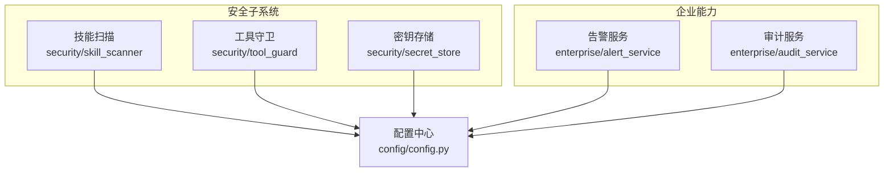
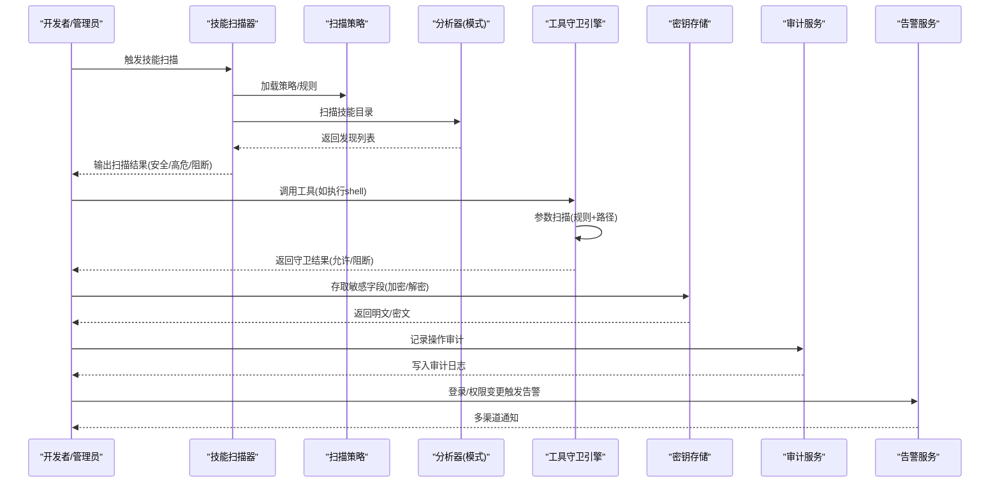
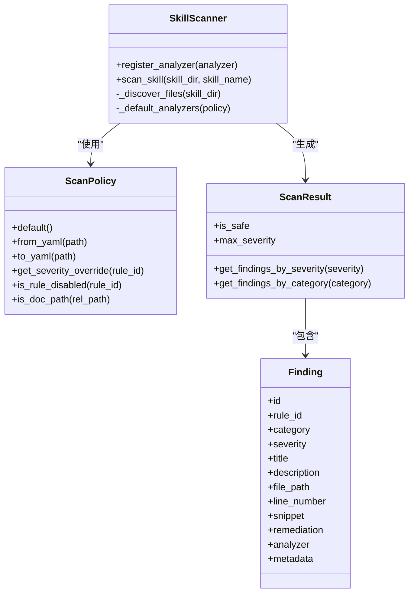
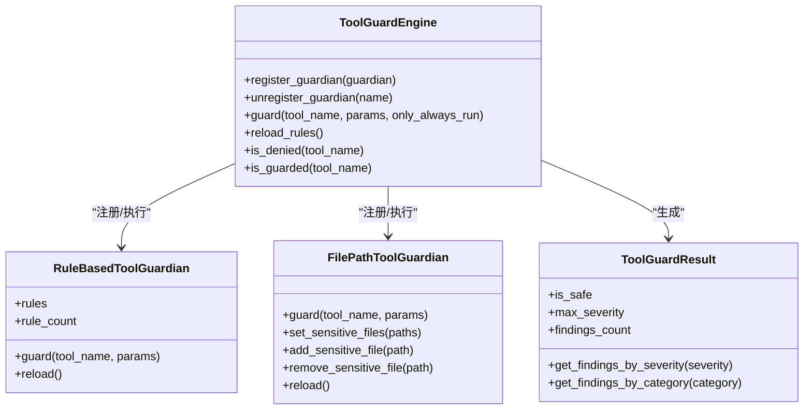
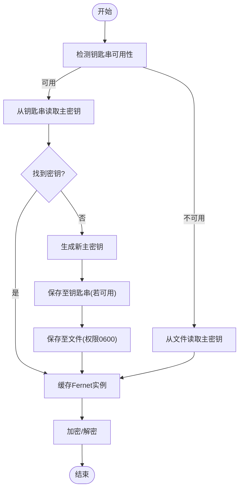
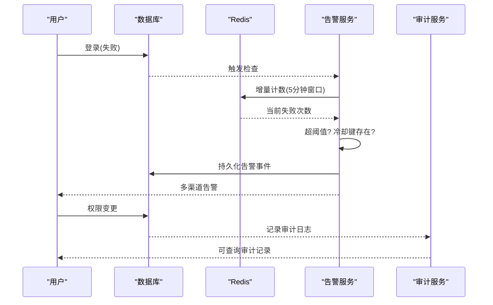
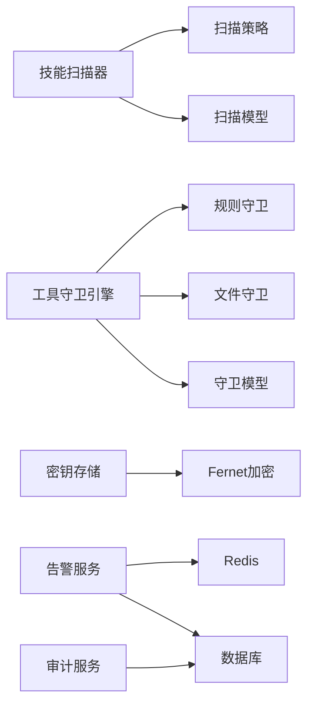

# 技能安全

<cite>
**本文引用的文件**
- [security/__init__.py](file://src/copaw/security/__init__.py)
- [security/skill_scanner/__init__.py](file://src/copaw/security/skill_scanner/__init__.py)
- [security/skill_scanner/models.py](file://src/copaw/security/skill_scanner/models.py)
- [security/skill_scanner/scanner.py](file://src/copaw/security/skill_scanner/scanner.py)
- [security/skill_scanner/scan_policy.py](file://src/copaw/security/skill_scanner/scan_policy.py)
- [security/tool_guard/__init__.py](file://src/copaw/security/tool_guard/__init__.py)
- [security/tool_guard/engine.py](file://src/copaw/security/tool_guard/engine.py)
- [security/tool_guard/guardians/rule_guardian.py](file://src/copaw/security/tool_guard/guardians/rule_guardian.py)
- [security/tool_guard/guardians/file_guardian.py](file://src/copaw/security/tool_guard/guardians/file_guardian.py)
- [security/tool_guard/models.py](file://src/copaw/security/tool_guard/models.py)
- [security/secret_store.py](file://src/copaw/security/secret_store.py)
- [config/config.py](file://src/copaw/config/config.py)
- [enterprise/alert_service.py](file://src/copaw/enterprise/alert_service.py)
- [enterprise/audit_service.py](file://src/copaw/enterprise/audit_service.py)
- [website/public/docs/security.en.md](file://website/public/docs/security.en.md)
</cite>

## 目录
1. [简介](#简介)
2. [项目结构](#项目结构)
3. [核心组件](#核心组件)
4. [架构总览](#架构总览)
5. [详细组件分析](#详细组件分析)
6. [依赖分析](#依赖分析)
7. [性能考虑](#性能考虑)
8. [故障排查指南](#故障排查指南)
9. [结论](#结论)
10. [附录](#附录)

## 简介
本技术文档面向“技能安全”子系统，系统性阐述技能扫描、威胁检测、访问控制与安全策略配置的完整安全框架。文档覆盖以下关键主题：
- 技能静态扫描：基于签名规则的模式匹配、可插拔分析器、白名单与阻断历史记录
- 威胁检测：工具调用前参数扫描（命令注入、敏感文件访问、路径越界等）
- 访问控制：基于规则的工具守卫、文件路径保护、权限控制与环境变量开关
- 安全策略配置：组织化扫描策略、规则作用域、严重性覆盖、文件分类与阈值
- 规则引擎：YAML 规则加载、正则表达式编译、命中上下文提取
- 威胁评估：威胁类别枚举、严重性分级、结果聚合与去重
- 文件守护与工具保护：路径解析、跨平台兼容、重定向操作识别
- 权限控制：RBAC 与企业版审计、告警联动
- 安全审计与合规：ISO 27001 合规审计日志、查询接口
- 风险评估与加固：扫描超时、缓存、白名单、阻断历史、告警通知
- 企业级能力：多通道告警、数据库持久化、任务管理、工作流引擎

## 项目结构
安全相关代码主要集中在以下模块：
- 技能扫描：security/skill_scanner（扫描器、策略、模型、签名规则）
- 工具守卫：security/tool_guard（守卫引擎、规则守卫、文件守卫、模型）
- 密钥存储：security/secret_store（透明加密/解密、主密钥管理）
- 企业级能力：enterprise（告警服务、审计服务）
- 配置：config/config.py（企业开关、数据库、Redis、安全子配置）

图示来源
- [security/skill_scanner/__init__.py:1-505](file://src/copaw/security/skill_scanner/__init__.py#L1-L505)
- [security/tool_guard/__init__.py:1-59](file://src/copaw/security/tool_guard/__init__.py#L1-L59)
- [security/secret_store.py:1-285](file://src/copaw/security/secret_store.py#L1-L285)
- [config/config.py:1-800](file://src/copaw/config/config.py#L1-L800)
- [enterprise/alert_service.py:1-217](file://src/copaw/enterprise/alert_service.py#L1-L217)
- [enterprise/audit_service.py:1-135](file://src/copaw/enterprise/audit_service.py#L1-L135)

章节来源
- [security/__init__.py:1-21](file://src/copaw/security/__init__.py#L1-L21)
- [security/skill_scanner/__init__.py:1-505](file://src/copaw/security/skill_scanner/__init__.py#L1-L505)
- [security/tool_guard/__init__.py:1-59](file://src/copaw/security/tool_guard/__init__.py#L1-L59)
- [security/secret_store.py:1-285](file://src/copaw/security/secret_store.py#L1-L285)
- [config/config.py:1-800](file://src/copaw/config/config.py#L1-L800)
- [enterprise/alert_service.py:1-217](file://src/copaw/enterprise/alert_service.py#L1-L217)
- [enterprise/audit_service.py:1-135](file://src/copaw/enterprise/audit_service.py#L1-L135)

## 核心组件
- 技能扫描器（SkillScanner）：遍历技能目录、发现文件、运行分析器、聚合结果
- 扫描策略（ScanPolicy）：组织化规则作用域、严重性覆盖、文件分类、阈值与白名单
- 工具守卫引擎（ToolGuardEngine）：在工具调用前扫描参数，支持规则守卫与文件路径守卫
- 密钥存储（SecretStore）：基于 Fernet 的透明加解密，主密钥来自系统钥匙串或文件
- 企业告警与审计：登录异常检测、权限变更告警；ISO 27001 合规审计日志

章节来源
- [security/skill_scanner/scanner.py:76-319](file://src/copaw/security/skill_scanner/scanner.py#L76-L319)
- [security/skill_scanner/scan_policy.py:156-476](file://src/copaw/security/skill_scanner/scan_policy.py#L156-L476)
- [security/tool_guard/engine.py:53-238](file://src/copaw/security/tool_guard/engine.py#L53-L238)
- [security/secret_store.py:148-285](file://src/copaw/security/secret_store.py#L148-L285)
- [enterprise/alert_service.py:101-217](file://src/copaw/enterprise/alert_service.py#L101-L217)
- [enterprise/audit_service.py:51-135](file://src/copaw/enterprise/audit_service.py#L51-L135)

## 架构总览
技能安全体系由“扫描—评估—阻断/告警—审计”的闭环构成，贯穿安装期与运行期。

图示来源
- [security/skill_scanner/scanner.py:148-242](file://src/copaw/security/skill_scanner/scanner.py#L148-L242)
- [security/skill_scanner/scan_policy.py:236-304](file://src/copaw/security/skill_scanner/scan_policy.py#L236-L304)
- [security/tool_guard/engine.py:169-226](file://src/copaw/security/tool_guard/engine.py#L169-L226)
- [security/secret_store.py:207-241](file://src/copaw/security/secret_store.py#L207-L241)
- [enterprise/audit_service.py:54-86](file://src/copaw/enterprise/audit_service.py#L54-L86)
- [enterprise/alert_service.py:104-162](file://src/copaw/enterprise/alert_service.py#L104-L162)

## 详细组件分析

### 技能扫描子系统
- 扫描器职责：发现文件、限制数量/大小、跳过符号链接与越界路径、运行分析器、聚合结果并记录阻断历史
- 策略配置：隐藏文件处理、规则作用域、凭证抑制、文件分类、阈值、严重性覆盖、禁用规则
- 白名单与阻断历史：按技能名与内容哈希匹配，记录阻断事件用于审计与回溯
- 公共 API：扫描目录、获取扫描模式、超时、内容哈希计算、阻断历史读写

图示来源
- [security/skill_scanner/scanner.py:76-319](file://src/copaw/security/skill_scanner/scanner.py#L76-L319)
- [security/skill_scanner/scan_policy.py:156-476](file://src/copaw/security/skill_scanner/scan_policy.py#L156-L476)
- [security/skill_scanner/models.py:168-235](file://src/copaw/security/skill_scanner/models.py#L168-L235)

章节来源
- [security/skill_scanner/__init__.py:415-505](file://src/copaw/security/skill_scanner/__init__.py#L415-L505)
- [security/skill_scanner/scanner.py:148-319](file://src/copaw/security/skill_scanner/scanner.py#L148-L319)
- [security/skill_scanner/scan_policy.py:236-476](file://src/copaw/security/skill_scanner/scan_policy.py#L236-L476)
- [security/skill_scanner/models.py:16-235](file://src/copaw/security/skill_scanner/models.py#L16-L235)

### 工具守卫子系统
- 引擎职责：按配置启用/禁用、加载默认守卫、执行并聚合结果、支持热重载规则
- 规则守卫：从 YAML 加载规则，对参数字符串进行正则匹配，支持排除模式、上下文片段、严重性与类别
- 文件守卫：针对敏感文件/目录、shell 重定向、路径解析与越界检测
- 结果模型：统一的威胁类别与严重性，便于与扫描结果协同

图示来源
- [security/tool_guard/engine.py:53-238](file://src/copaw/security/tool_guard/engine.py#L53-L238)
- [security/tool_guard/guardians/rule_guardian.py:559-758](file://src/copaw/security/tool_guard/guardians/rule_guardian.py#L559-L758)
- [security/tool_guard/guardians/file_guardian.py:161-342](file://src/copaw/security/tool_guard/guardians/file_guardian.py#L161-L342)
- [security/tool_guard/models.py:103-185](file://src/copaw/security/tool_guard/models.py#L103-L185)

章节来源
- [security/tool_guard/__init__.py:1-59](file://src/copaw/security/tool_guard/__init__.py#L1-L59)
- [security/tool_guard/engine.py:169-238](file://src/copaw/security/tool_guard/engine.py#L169-L238)
- [security/tool_guard/guardians/rule_guardian.py:559-758](file://src/copaw/security/tool_guard/guardians/rule_guardian.py#L559-L758)
- [security/tool_guard/guardians/file_guardian.py:161-342](file://src/copaw/security/tool_guard/guardians/file_guardian.py#L161-L342)
- [security/tool_guard/models.py:103-185](file://src/copaw/security/tool_guard/models.py#L103-L185)

### 密钥存储与透明加密
- 主密钥来源：系统钥匙串（优先）、文件（降级），容器/CI 环境自动跳过钥匙串
- 加密算法：Fernet（AES-128-CBC + HMAC-SHA256），密文带前缀标识
- 字段加密：提供针对特定字段的批量加解密辅助函数，避免明文落盘

图示来源
- [security/secret_store.py:46-204](file://src/copaw/security/secret_store.py#L46-L204)

章节来源
- [security/secret_store.py:148-285](file://src/copaw/security/secret_store.py#L148-L285)

### 企业级安全：告警与审计
- 告警服务：登录失败异常检测（Redis 计数+冷却），权限变更告警，多通道通知（企业微信、钉钉、SMTP）
- 审计服务：ISO 27001 合规审计日志，支持按用户、动作类型、资源、时间范围查询

图示来源
- [enterprise/alert_service.py:104-162](file://src/copaw/enterprise/alert_service.py#L104-L162)
- [enterprise/audit_service.py:54-135](file://src/copaw/enterprise/audit_service.py#L54-L135)

章节来源
- [enterprise/alert_service.py:101-217](file://src/copaw/enterprise/alert_service.py#L101-L217)
- [enterprise/audit_service.py:51-135](file://src/copaw/enterprise/audit_service.py#L51-L135)

## 依赖分析
- 组件内聚：扫描与守卫各自独立，通过公共模型与配置耦合度低
- 外部依赖：正则、YAML、SQLAlchemy、HTTP 客户端、系统钥匙串
- 环境变量开关：扫描模式、工具守卫开关、容器/CI 特殊处理
- 配置驱动：策略与规则均来自配置与 YAML，便于组织定制

图示来源
- [security/skill_scanner/scanner.py:100-134](file://src/copaw/security/skill_scanner/scanner.py#L100-L134)
- [security/tool_guard/engine.py:65-78](file://src/copaw/security/tool_guard/engine.py#L65-L78)
- [security/secret_store.py:193-204](file://src/copaw/security/secret_store.py#L193-L204)
- [enterprise/alert_service.py:31-97](file://src/copaw/enterprise/alert_service.py#L31-L97)
- [enterprise/audit_service.py:16-18](file://src/copaw/enterprise/audit_service.py#L16-L18)

章节来源
- [security/skill_scanner/__init__.py:82-114](file://src/copaw/security/skill_scanner/__init__.py#L82-L114)
- [security/tool_guard/__init__.py:34-59](file://src/copaw/security/tool_guard/__init__.py#L34-L59)
- [config/config.py:60-81](file://src/copaw/config/config.py#L60-L81)

## 性能考虑
- 扫描缓存：基于目录 mtime 的轻量缓存，LRU 控制条目上限，避免重复扫描
- 文件发现：跳过符号链接、越界路径、大文件与扩展过滤，限制最大文件数
- 正则编译：规则预编译，长正则与无效正则快速失败并告警
- 并发与超时：扫描在单线程池中限时执行，超时返回空结果而非阻塞
- 守卫延迟：仅在启用时执行，且支持只运行“始终运行”的守卫以降低开销

章节来源
- [security/skill_scanner/__init__.py:327-380](file://src/copaw/security/skill_scanner/__init__.py#L327-L380)
- [security/skill_scanner/scanner.py:248-299](file://src/copaw/security/skill_scanner/scanner.py#L248-L299)
- [security/skill_scanner/scan_policy.py:49-67](file://src/copaw/security/skill_scanner/scan_policy.py#L49-L67)
- [security/tool_guard/engine.py:169-226](file://src/copaw/security/tool_guard/engine.py#L169-L226)

## 故障排查指南
- 扫描未生效
  - 检查扫描模式与超时：环境变量优先于配置
  - 确认白名单与内容哈希是否匹配
  - 查看阻断历史文件是否存在与可读
- 守卫误报/漏报
  - 校验规则文件是否正确加载与重载
  - 检查工具名/参数名是否匹配规则作用域
  - 对于 rm 命令，确认路径解析与工作区边界判断
- 密钥无法解密
  - 检查主密钥来源（钥匙串/文件）与权限
  - 若主密钥变更，旧密文将无法解密，需重新加密
- 告警不触发
  - 检查 Redis 是否可用、冷却键是否导致抑制
  - 确认阈值设置与通知通道配置
- 审计日志缺失
  - 确认企业功能开启与数据库连接
  - 检查事务提交时机与查询条件

章节来源
- [security/skill_scanner/__init__.py:85-114](file://src/copaw/security/skill_scanner/__init__.py#L85-L114)
- [security/skill_scanner/__init__.py:262-302](file://src/copaw/security/skill_scanner/__init__.py#L262-L302)
- [security/tool_guard/guardians/rule_guardian.py:590-594](file://src/copaw/security/tool_guard/guardians/rule_guardian.py#L590-L594)
- [security/secret_store.py:72-102](file://src/copaw/security/secret_store.py#L72-L102)
- [enterprise/alert_service.py:134-162](file://src/copaw/enterprise/alert_service.py#L134-L162)
- [enterprise/audit_service.py:102-135](file://src/copaw/enterprise/audit_service.py#L102-L135)

## 结论
该技能安全框架通过“策略驱动 + 规则引擎 + 多层防护”的设计，在安装期与运行期分别提供静态扫描与动态守卫，结合密钥存储、审计与告警，形成完整的安全闭环。其模块化与配置化特性使得组织能够按需定制规则、调整阈值与覆盖严重性，满足企业级合规与风险管控需求。

## 附录

### 安全策略配置模板（要点）
- 扫描模式：block/warn/off，支持环境变量覆盖
- 超时：默认 30 秒，可通过配置调整
- 白名单：按技能名与内容哈希匹配，匹配后跳过扫描
- 阻断历史：记录阻断时间、最高严重性、发现详情与内容哈希
- 缓存：目录 mtime 变更前复用结果
- 策略文件：YAML 合并内置默认策略，仅覆盖差异项

章节来源
- [security/skill_scanner/__init__.py:85-114](file://src/copaw/security/skill_scanner/__init__.py#L85-L114)
- [security/skill_scanner/__init__.py:141-167](file://src/copaw/security/skill_scanner/__init__.py#L141-L167)
- [security/skill_scanner/__init__.py:231-260](file://src/copaw/security/skill_scanner/__init__.py#L231-L260)
- [security/skill_scanner/__init__.py:327-380](file://src/copaw/security/skill_scanner/__init__.py#L327-L380)
- [security/skill_scanner/scan_policy.py:261-304](file://src/copaw/security/skill_scanner/scan_policy.py#L261-L304)

### 威胁防护案例（场景与处置）
- 命令注入
  - 规则：匹配管道/重定向到 shell 的危险模式
  - 处置：阻断工具调用，提示替换为安全方式
- 敏感文件访问
  - 规则：显式路径命中敏感文件/目录
  - 处置：阻断访问，建议改用受控路径
- 资源滥用
  - 规则：可疑网络请求、大文件下载、高并发调用
  - 处置：警告并记录，必要时阻断
- 硬编码凭据
  - 规则：常见 API Key/Token 模式
  - 处置：标记高危，建议迁移至密钥管理

章节来源
- [website/public/docs/security.en.md:387-442](file://website/public/docs/security.en.md#L387-L442)
- [security/tool_guard/guardians/rule_guardian.py:645-757](file://src/copaw/security/tool_guard/guardians/rule_guardian.py#L645-L757)
- [security/tool_guard/guardians/file_guardian.py:268-341](file://src/copaw/security/tool_guard/guardians/file_guardian.py#L268-L341)