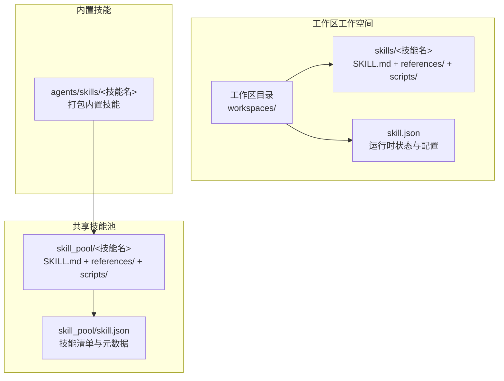
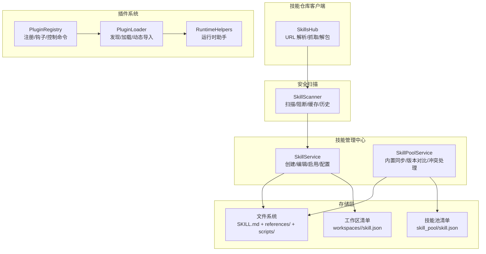
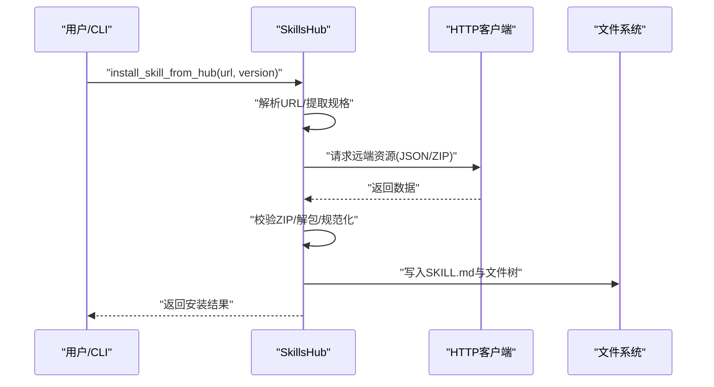
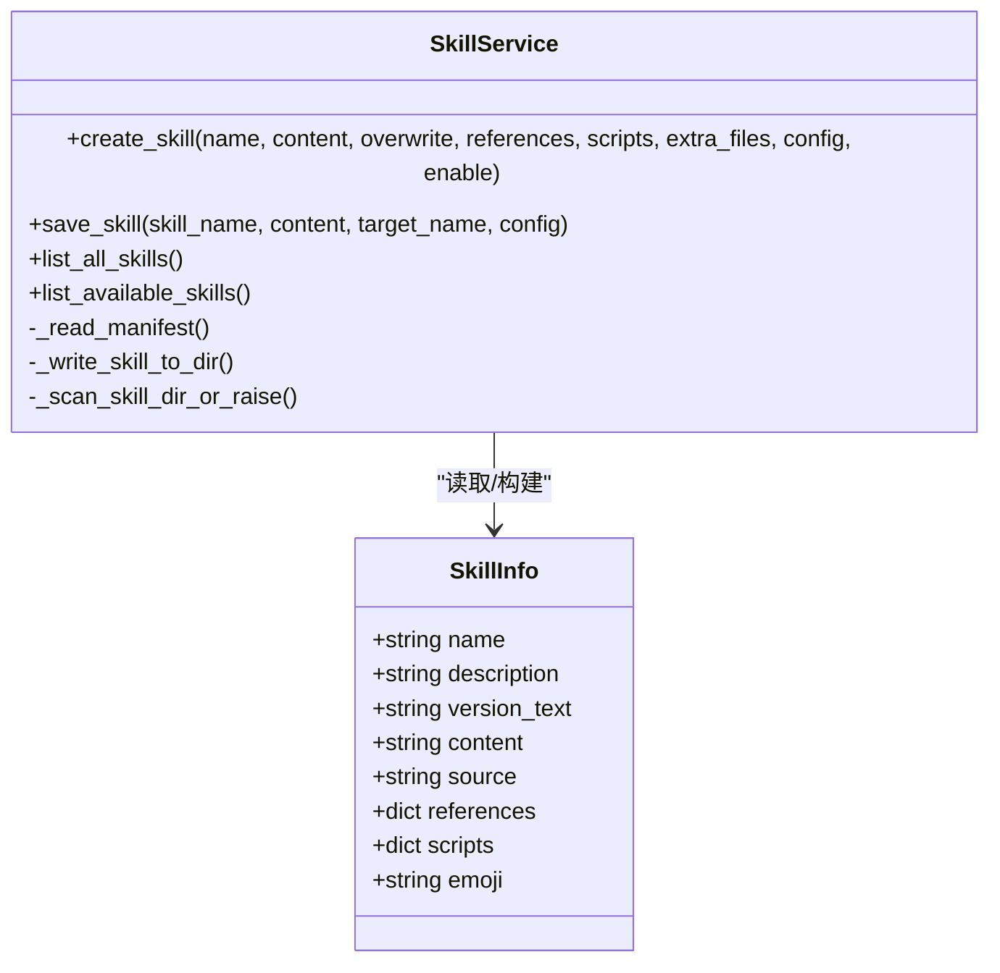
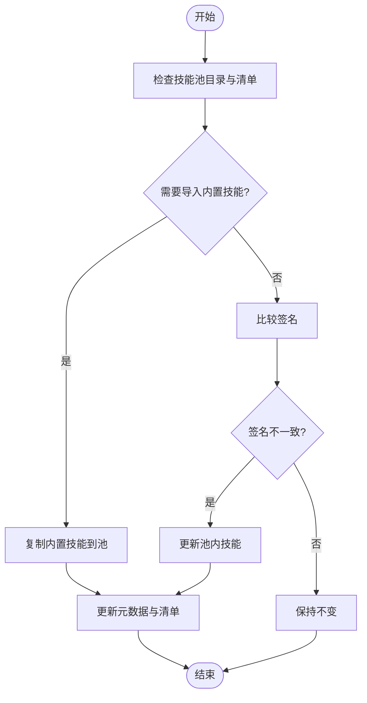
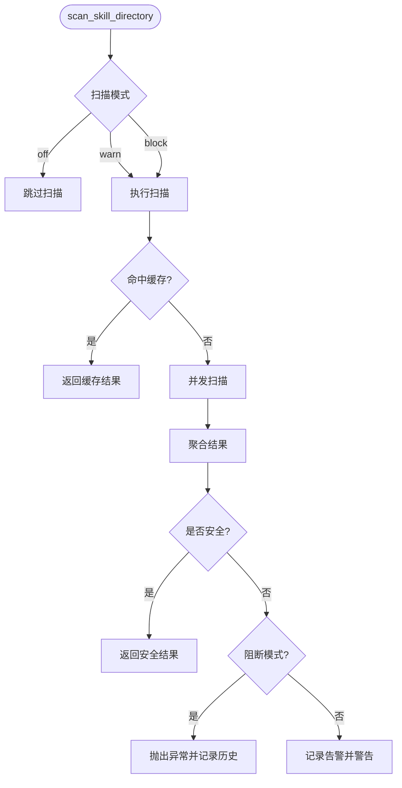
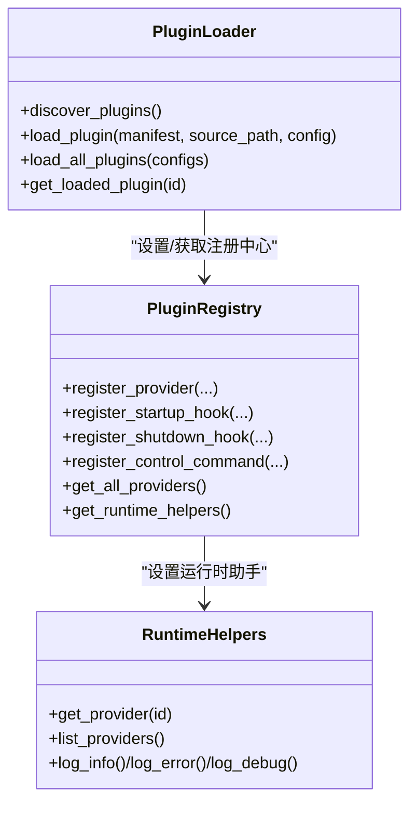
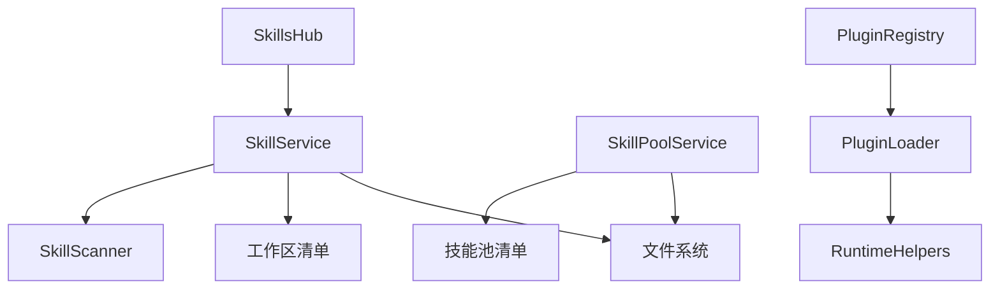

# 技能执行框架

<cite>
**本文档引用的文件**
- [skills_hub.py](file://src/copaw/agents/skills_hub.py)
- [skills_manager.py](file://src/copaw/agents/skills_manager.py)
- [registry.py](file://src/copaw/plugins/registry.py)
- [loader.py](file://src/copaw/plugins/loader.py)
- [runtime.py](file://src/copaw/plugins/runtime.py)
- [__init__.py](file://src/copaw/security/skill_scanner/__init__.py)
- [file_handling.py](file://src/copaw/agents/utils/file_handling.py)
- [skill.json](file://working/skill_pool/skill.json)
- [SKILL.md](file://src/copaw/agents/skills/browser_cdp/SKILL.md)
- [SKILL.md](file://src/copaw/agents/skills/guidance/SKILL.md)
- [constant.py](file://src/copaw/constant.py)
</cite>

## 目录
1. [引言](#引言)
2. [项目结构](#项目结构)
3. [核心组件](#核心组件)
4. [架构总览](#架构总览)
5. [详细组件分析](#详细组件分析)
6. [依赖分析](#依赖分析)
7. [性能考虑](#性能考虑)
8. [故障排除指南](#故障排除指南)
9. [结论](#结论)
10. [附录](#附录)

## 引言
本文件为 Copaw 技能执行框架的架构文档，系统性阐述技能系统的高层设计与实现细节，覆盖技能注册、发现、执行、缓存的完整流程；详细说明技能接口规范、参数验证、结果处理的实现原理；解释技能依赖管理、版本控制、热更新机制；并提供技能开发指南、测试策略、性能监控建议、扩展最佳实践与安全考虑。

## 项目结构
Copaw 技能系统围绕工作区（workspace）与技能池（skill pool）两大核心目录展开，采用“文件系统即清单”的设计思想，配合 JSON 清单进行运行时状态管理。技能内容以 SKILL.md 为统一入口，辅以 references/scripts 子目录存放相关资源与脚本。

**图表来源**
- [skills_manager.py:124-148](file://src/copaw/agents/skills_manager.py#L124-L148)
- [skill.json:1-370](file://working/skill_pool/skill.json#L1-L370)

**章节来源**
- [skills_manager.py:124-148](file://src/copaw/agents/skills_manager.py#L124-L148)
- [skill.json:1-370](file://working/skill_pool/skill.json#L1-L370)

## 核心组件
- 技能管理中心（SkillService）
  - 负责工作区内的技能生命周期管理：创建、编辑、启用/禁用、渠道路由、配置持久化、文件写入与校验。
  - 通过解析 SKILL.md frontmatter 获取技能名称、描述、版本、emoji、依赖等元信息。
  - 与工作区 skill.json 清单交互，确保运行时状态与文件系统一致。

- 技能池管理（SkillPoolService）
  - 负责内置技能与自定义技能的同步、去重、签名比对与冲突处理。
  - 支持内置技能导入、版本对比、增量更新与一致性校验。

- 技能仓库客户端（SkillsHub）
  - 提供从多种来源（ClawHub、GitHub、LobeHub、ModelScope、skills.sh 等）拉取技能包的能力。
  - 实现 HTTP 请求重试、超时、速率限制处理、ZIP 包安全校验与解压、文件树规范化等。

- 安全扫描器（SkillScanner）
  - 在技能导入/安装前进行安全扫描，支持白名单、阻断/告警模式、缓存与历史记录。
  - 提供内容哈希计算、并发扫描、超时控制与异常封装。

- 插件系统（Plugin System）
  - 提供插件注册、加载、钩子与运行时助手，支撑技能生态扩展。

**章节来源**
- [skills_manager.py:1447-1568](file://src/copaw/agents/skills_manager.py#L1447-L1568)
- [skills_hub.py:1588-1598](file://src/copaw/agents/skills_hub.py#L1588-L1598)
- [__init__.py:415-505](file://src/copaw/security/skill_scanner/__init__.py#L415-L505)
- [registry.py:42-254](file://src/copaw/plugins/registry.py#L42-L254)

## 架构总览
技能执行框架采用“文件系统 + 清单”的双轨设计：文件系统承载技能内容，清单负责运行时状态与路由。安全扫描贯穿导入流程，确保技能可信。插件系统提供扩展能力，技能仓库客户端提供外部技能获取通道。

**图表来源**
- [skills_hub.py:1561-1586](file://src/copaw/agents/skills_hub.py#L1561-L1586)
- [skills_manager.py:1447-1568](file://src/copaw/agents/skills_manager.py#L1447-L1568)
- [__init__.py:415-505](file://src/copaw/security/skill_scanner/__init__.py#L415-L505)
- [registry.py:42-254](file://src/copaw/plugins/registry.py#L42-L254)
- [loader.py:19-241](file://src/copaw/plugins/loader.py#L19-L241)
- [runtime.py:10-68](file://src/copaw/plugins/runtime.py#L10-L68)

## 详细组件分析

### 技能仓库客户端（SkillsHub）
职责与流程
- URL 解析：支持 ClawHub、GitHub、LobeHub、ModelScope、skills.sh 等多种来源的 URL 规范化与提取。
- 抓取与解包：从远端下载 ZIP 或 JSON，校验大小与路径安全性，解包为文件树。
- 文件树规范化：将扁平 files 映射为 references/scripts 树，提取 SKILL.md 内容与元信息。
- 版本与来源解析：从远端响应中提取版本号、文件列表，回填为统一的包结构。

关键实现要点
- HTTP 重试与退避：基于指数退避与可配置重试次数，处理 429/5xx 与网络错误。
- 速率限制与鉴权：对 GitHub API 自动注入 Authorization 头，处理 403 rate limit。
- ZIP 安全校验：限制条目数量与总大小，拒绝符号链接与危险路径。
- 取消检查：支持取消导入任务，避免长时间阻塞。

**图表来源**
- [skills_hub.py:1561-1586](file://src/copaw/agents/skills_hub.py#L1561-L1586)
- [skills_hub.py:1326-1383](file://src/copaw/agents/skills_hub.py#L1326-L1383)
- [skills_hub.py:287-400](file://src/copaw/agents/skills_hub.py#L287-L400)

**章节来源**
- [skills_hub.py:1561-1586](file://src/copaw/agents/skills_hub.py#L1561-L1586)
- [skills_hub.py:1326-1383](file://src/copaw/agents/skills_hub.py#L1326-L1383)
- [skills_hub.py:287-400](file://src/copaw/agents/skills_hub.py#L287-L400)

### 技能管理中心（SkillService）
职责与流程
- 创建技能：校验 SKILL.md frontmatter，规范化目录名，写入文件树，执行安全扫描，写入工作区清单。
- 编辑技能：支持原地保存与重命名，保留配置与渠道设置。
- 启用/禁用与渠道路由：通过清单中的 enabled 与 channels 字段决定运行时生效范围。
- 配置注入：根据 metadata.requires.env 将配置注入为环境变量，支持作用域隔离与释放。

关键实现要点
- 清单原子写入：使用临时文件与原子替换，避免并发写入导致的数据损坏。
- 文件锁：跨进程写入时使用文件锁，保证清单一致性。
- 内容签名：基于文件树与内容的 SHA256 签名，用于内置/自定义识别与变更检测。
- 前端展示：从 SKILL.md frontmatter 提取 emoji 与版本信息，增强 UI 展示。

**图表来源**
- [skills_manager.py:1447-1568](file://src/copaw/agents/skills_manager.py#L1447-L1568)
- [skills_manager.py:64-81](file://src/copaw/agents/skills_manager.py#L64-L81)

**章节来源**
- [skills_manager.py:1447-1568](file://src/copaw/agents/skills_manager.py#L1447-L1568)
- [skills_manager.py:64-81](file://src/copaw/agents/skills_manager.py#L64-L81)

### 技能池管理（SkillPoolService）
职责与流程
- 内置技能导入：将打包内置技能复制到技能池，维护 builtin_skill_names 列表。
- 同步与去重：基于签名比对内置版本与池内版本，处理冲突与更新。
- 版本状态：提供“已同步/已过期”状态查询，支持单个内置技能更新。

关键实现要点
- 签名缓存：内置技能签名仅首次计算并缓存，提升性能。
- 状态分类：区分“builtin”与“customized”，尊重用户定制意图。
- 清单重建：定期扫描技能池目录，重建元数据并保留用户配置。

**图表来源**
- [skills_manager.py:832-928](file://src/copaw/agents/skills_manager.py#L832-L928)
- [skills_manager.py:948-1017](file://src/copaw/agents/skills_manager.py#L948-L1017)

**章节来源**
- [skills_manager.py:832-928](file://src/copaw/agents/skills_manager.py#L832-L928)
- [skills_manager.py:948-1017](file://src/copaw/agents/skills_manager.py#L948-L1017)

### 安全扫描器（SkillScanner）
职责与流程
- 扫描触发：在技能导入/安装前调用，支持白名单跳过与超时控制。
- 扫描执行：基于模式分析器进行威胁检测，聚合严重级别与发现项。
- 结果处理：阻断模式下抛出异常，告警模式记录历史并警告，缓存最近扫描结果。

关键实现要点
- 模式与并发：采用线程池执行扫描，避免阻塞主线程。
- 缓存策略：基于目录 mtime 的 LRU 缓存，减少重复扫描成本。
- 历史记录：持久化阻断/告警记录，支持查询与清理。

**图表来源**
- [__init__.py:415-505](file://src/copaw/security/skill_scanner/__init__.py#L415-L505)
- [__init__.py:327-380](file://src/copaw/security/skill_scanner/__init__.py#L327-L380)

**章节来源**
- [__init__.py:415-505](file://src/copaw/security/skill_scanner/__init__.py#L415-L505)
- [__init__.py:327-380](file://src/copaw/security/skill_scanner/__init__.py#L327-L380)

### 插件系统（Plugin System）
职责与流程
- 注册中心：集中管理 Provider、启动/关闭钩子、控制命令处理器。
- 加载器：发现并动态加载插件模块，调用插件的 register 方法完成注册。
- 运行时助手：提供 Provider 查询、日志与诊断能力。

关键实现要点
- 动态导入：使用 importlib.spec_from_file_location 与唯一模块名避免冲突。
- 协程兼容：支持异步/同步 register 方法。
- 诊断记录：记录加载失败原因，便于排障。

**图表来源**
- [registry.py:42-254](file://src/copaw/plugins/registry.py#L42-L254)
- [loader.py:19-241](file://src/copaw/plugins/loader.py#L19-L241)
- [runtime.py:10-68](file://src/copaw/plugins/runtime.py#L10-L68)

**章节来源**
- [registry.py:42-254](file://src/copaw/plugins/registry.py#L42-L254)
- [loader.py:19-241](file://src/copaw/plugins/loader.py#L19-L241)
- [runtime.py:10-68](file://src/copaw/plugins/runtime.py#L10-L68)

### 技能接口规范与参数验证
- 元数据规范：SKILL.md frontmatter 必须包含 name 与 description；metadata 可选包含版本、emoji、依赖声明等。
- 依赖声明：metadata.requires 支持 bins/env 两类依赖，运行时通过环境变量注入。
- 参数验证：创建/编辑时校验目录名合法性、空路径与相对路径约束，ZIP 安全校验与条目数量限制。
- 内容哈希：基于文件树与内容的 SHA256，用于内置/自定义识别与变更检测。

**章节来源**
- [skills_manager.py:1324-1336](file://src/copaw/agents/skills_manager.py#L1324-L1336)
- [skills_manager.py:496-525](file://src/copaw/agents/skills_manager.py#L496-L525)
- [skills_manager.py:452-474](file://src/copaw/agents/skills_manager.py#L452-L474)

### 结果处理与缓存
- 清单缓存：读取清单时进行 JSON 解析与错误恢复，写入时原子替换并递增版本号。
- 扫描缓存：基于目录 mtime 的 LRU 缓存，避免重复扫描。
- GitHub 缓存：对 API 调用结果进行 TTL 控制，降低外部依赖压力。

**章节来源**
- [skills_manager.py:337-388](file://src/copaw/agents/skills_manager.py#L337-L388)
- [__init__.py:327-380](file://src/copaw/security/skill_scanner/__init__.py#L327-L380)
- [skills_hub.py:92-127](file://src/copaw/agents/skills_hub.py#L92-L127)

### 依赖管理、版本控制与热更新
- 依赖管理：通过 metadata.requires 声明系统依赖（bin/env），运行时注入环境变量。
- 版本控制：内置技能版本来自 SKILL.md metadata 或 builtin_skill_version；池内技能记录 version_text 与 commit_text。
- 热更新：内置技能池与工作区清单均支持增量更新与签名比对，避免覆盖用户定制。

**章节来源**
- [skills_manager.py:542-567](file://src/copaw/agents/skills_manager.py#L542-L567)
- [skill.json:1-370](file://working/skill_pool/skill.json#L1-L370)

### 技能开发指南
- 目录结构：每个技能包含 SKILL.md、可选 references/ 与 scripts/ 目录。
- 元数据编写：frontmatter 必须包含 name 与 description；可选 metadata 字段声明版本与依赖。
- 依赖声明：在 metadata.copaw.requires 中声明所需二进制与环境变量键。
- 安全建议：避免在技能中嵌入敏感信息；遵循最小权限原则；使用白名单与扫描器。

**章节来源**
- [SKILL.md:1-182](file://src/copaw/agents/skills/browser_cdp/SKILL.md#L1-L182)
- [SKILL.md:1-138](file://src/copaw/agents/skills/guidance/SKILL.md#L1-L138)
- [skills_manager.py:542-567](file://src/copaw/agents/skills_manager.py#L542-L567)

### 测试策略
- 单元测试：针对技能解析、清单读写、扫描缓存、ZIP 安全校验等关键路径进行单元测试。
- 集成测试：模拟技能导入/安装流程，覆盖多种 URL 来源与错误场景。
- 性能测试：评估扫描缓存命中率、清单写入吞吐量与并发加载性能。

**章节来源**
- [file_handling.py:246-357](file://src/copaw/agents/utils/file_handling.py#L246-L357)

### 性能监控
- 关键指标：扫描耗时、清单写入延迟、ZIP 解压耗时、HTTP 请求成功率与重试次数。
- 监控建议：在 CLI 与服务端埋点统计，结合日志与指标系统进行告警。

**章节来源**
- [constant.py:1-274](file://src/copaw/constant.py#L1-L274)

## 依赖分析
技能系统内部依赖关系清晰，核心模块之间通过明确的接口协作：SkillsHub 与 SkillService 通过文件系统与清单交互；SkillService 与 SkillPoolService 共享签名与元数据；SkillScanner 作为横切关注点贯穿导入流程；Plugin System 为扩展提供机制。

**图表来源**
- [skills_hub.py:1561-1586](file://src/copaw/agents/skills_hub.py#L1561-L1586)
- [skills_manager.py:1447-1568](file://src/copaw/agents/skills_manager.py#L1447-L1568)
- [registry.py:42-254](file://src/copaw/plugins/registry.py#L42-L254)
- [loader.py:19-241](file://src/copaw/plugins/loader.py#L19-L241)

**章节来源**
- [skills_hub.py:1561-1586](file://src/copaw/agents/skills_hub.py#L1561-L1586)
- [skills_manager.py:1447-1568](file://src/copaw/agents/skills_manager.py#L1447-L1568)
- [registry.py:42-254](file://src/copaw/plugins/registry.py#L42-L254)
- [loader.py:19-241](file://src/copaw/plugins/loader.py#L19-L241)

## 性能考虑
- I/O 优化：清单读写采用原子替换与文件锁，避免并发竞争；扫描结果基于 mtime 的缓存减少重复计算。
- 网络优化：SkillsHub 对 GitHub API 使用 TTL 缓存与退避重试，降低外部依赖抖动。
- 安全前置：在导入阶段执行扫描与 ZIP 校验，避免后续运行时失败带来的额外开销。

**章节来源**
- [__init__.py:327-380](file://src/copaw/security/skill_scanner/__init__.py#L327-L380)
- [skills_hub.py:92-127](file://src/copaw/agents/skills_hub.py#L92-L127)
- [skills_manager.py:337-388](file://src/copaw/agents/skills_manager.py#L337-L388)

## 故障排除指南
常见问题与处理
- GitHub 速率限制：设置 GITHUB_TOKEN 提升配额；关注 403/429 错误并重试。
- ZIP 安全校验失败：检查压缩包条目数量与大小限制，避免符号链接与危险路径。
- 清单写入冲突：确认并发写入场景，使用文件锁与原子替换避免损坏。
- 扫描阻断：检查 SkillScanner 配置与白名单，必要时调整扫描模式或清理历史记录。

**章节来源**
- [skills_hub.py:312-364](file://src/copaw/agents/skills_hub.py#L312-L364)
- [skills_manager.py:452-474](file://src/copaw/agents/skills_manager.py#L452-L474)
- [__init__.py:231-303](file://src/copaw/security/skill_scanner/__init__.py#L231-L303)

## 结论
Copaw 技能执行框架通过“文件系统 + 清单”的设计实现了高内聚、低耦合的技能管理；SkillsHub 提供强大的外部技能获取能力；SkillScanner 将安全前置到导入阶段；插件系统为生态扩展提供稳定机制。整体架构兼顾易用性、安全性与可扩展性，适合企业级技能生态的长期演进。

## 附录
- 环境变量与配置
  - 技能扫描模式：COPAW_SKILL_SCAN_MODE（block/warn/off）
  - 扫描超时：COPAW_SKILL_SCANNER_TIMEOUT
  - 工作目录：COPAW_WORKING_DIR
  - 日志级别：COPAW_LOG_LEVEL
  - GitHub 令牌：GITHUB_TOKEN/GH_TOKEN
  - 技能池与工作区路径：由常量模块提供默认值与解析逻辑

**章节来源**
- [constant.py:72-86](file://src/copaw/constant.py#L72-L86)
- [__init__.py:95-114](file://src/copaw/security/skill_scanner/__init__.py#L95-L114)