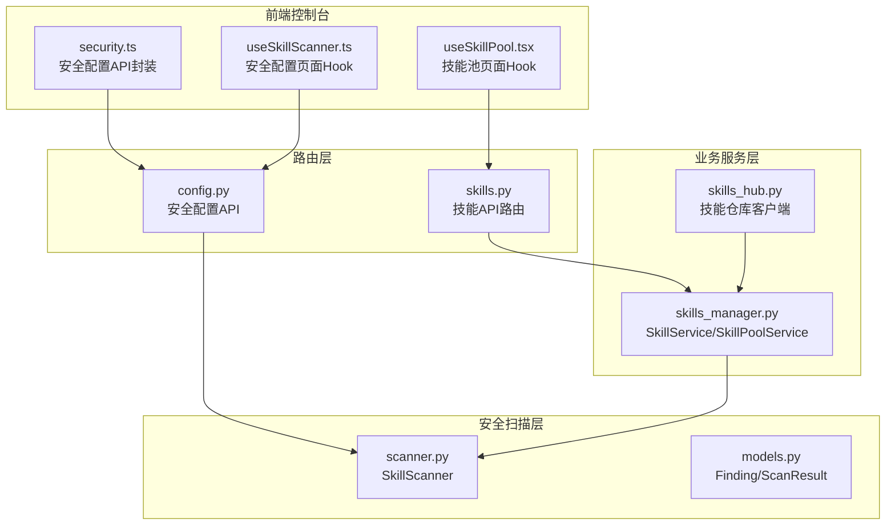
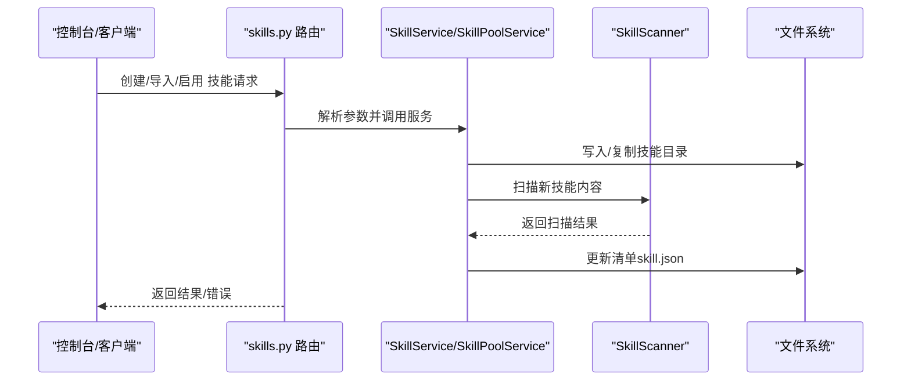
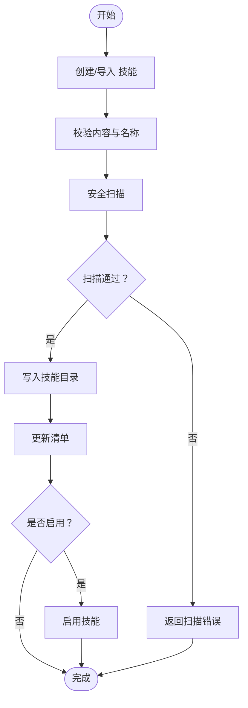
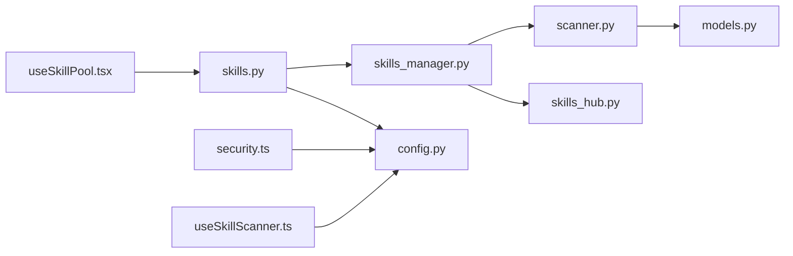

# 技能管理

<cite>
**本文引用的文件**
- [skills_manager.py](file://src/copaw/agents/skills_manager.py)
- [skills.py](file://src/copaw/app/routers/skills.py)
- [scanner.py](file://src/copaw/security/skill_scanner/scanner.py)
- [models.py](file://src/copaw/security/skill_scanner/models.py)
- [config.py](file://src/copaw/app/routers/config.py)
- [skills_hub.py](file://src/copaw/agents/skills_hub.py)
- [skill.json](file://working/skill_pool/skill.json)
- [security.ts](file://console/src/api/modules/security.ts)
- [useSkillScanner.ts](file://console/src/pages/Settings\Security\useSkillScanner.ts)
- [useSkillPool.tsx](file://console/src/pages/Settings\SkillPool\useSkillPool.tsx)
- [walkthrough.md](file://docs/walkthrough.md)
- [implementation_plan-D.md](file://docs/implementation_plan-D.md)
</cite>

## 目录
1. [简介](#简介)
2. [项目结构](#项目结构)
3. [核心组件](#核心组件)
4. [架构总览](#架构总览)
5. [详细组件分析](#详细组件分析)
6. [依赖分析](#依赖分析)
7. [性能考虑](#性能考虑)
8. [故障排查指南](#故障排查指南)
9. [结论](#结论)
10. [附录](#附录)

## 简介
本技术文档系统性阐述技能管理系统的生命周期与实现机制，覆盖技能注册、发现、激活、停用的完整流程；技能配置管理、依赖解析、版本控制；缓存策略与性能优化；权限控制、访问审计与安全检查；监控指标与故障诊断；以及导入导出、批量操作与冲突解决等高级能力。文档面向不同层次读者，既提供高层架构视图，也给出代码级实现细节与最佳实践。

## 项目结构
技能管理由三层协同构成：
- 路由层：提供REST接口，负责请求校验、参数解析与错误响应标准化
- 业务服务层：封装工作空间与共享技能池的生命周期管理逻辑
- 安全扫描层：对技能进行内容安全扫描与白名单/黑名单管控

图表来源
- [skills.py:1-120](file://src/copaw/app/routers/skills.py#L1-L120)
- [config.py:541-641](file://src/copaw/app/routers/config.py#L541-L641)
- [skills_manager.py:1447-2399](file://src/copaw/agents/skills_manager.py#L1447-L2399)
- [scanner.py:76-319](file://src/copaw/security/skill_scanner/scanner.py#L76-L319)
- [models.py:168-235](file://src/copaw/security/skill_scanner/models.py#L168-L235)
- [skills_hub.py:1-200](file://src/copaw/agents/skills_hub.py#L1-L200)
- [security.ts:92-148](file://console/src/api/modules/security.ts#L92-L148)
- [useSkillScanner.ts:1-47](file://console/src/pages/Settings\Security\useSkillScanner.ts#L1-L47)
- [useSkillPool.tsx:633-676](file://console/src/pages/Settings\SkillPool\useSkillPool.tsx#L633-L676)

章节来源
- [skills.py:1-120](file://src/copaw/app/routers/skills.py#L1-L120)
- [skills_manager.py:1447-2399](file://src/copaw/agents/skills_manager.py#L1447-L2399)
- [scanner.py:76-319](file://src/copaw/security/skill_scanner/scanner.py#L76-L319)
- [models.py:168-235](file://src/copaw/security/skill_scanner/models.py#L168-L235)
- [skills_hub.py:1-200](file://src/copaw/agents/skills_hub.py#L1-L200)
- [security.ts:92-148](file://console/src/api/modules/security.ts#L92-L148)
- [useSkillScanner.ts:1-47](file://console/src/pages/Settings\Security\useSkillScanner.ts#L1-L47)
- [useSkillPool.tsx:633-676](file://console/src/pages/Settings\SkillPool\useSkillPool.tsx#L633-L676)

## 核心组件
- 技能服务（SkillService）：管理单工作空间内的技能，支持创建、编辑、启用/停用、通道路由、标签与配置持久化
- 技能池服务（SkillPoolService）：管理共享技能池，支持导入导出、内置同步、上传下载、冲突检测
- 技能扫描器（SkillScanner）：基于策略的扫描器，聚合各类分析器结果，输出Findings与ScanResult
- 技能仓库客户端（SkillsHub）：从外部仓库拉取技能包，支持取消、重试与缓存
- 配置与白名单（Config/Whitelist）：集中管理扫描策略、白名单与阻断历史

章节来源
- [skills_manager.py:1447-2399](file://src/copaw/agents/skills_manager.py#L1447-L2399)
- [scanner.py:76-319](file://src/copaw/security/skill_scanner/scanner.py#L76-L319)
- [models.py:168-235](file://src/copaw/security/skill_scanner/models.py#L168-L235)
- [skills_hub.py:1-200](file://src/copaw/agents/skills_hub.py#L1-L200)
- [config.py:541-641](file://src/copaw/app/routers/config.py#L541-L641)

## 架构总览
技能管理采用“路由-服务-扫描”分层设计，通过统一的清单（manifest）与文件系统保持一致性，确保运行时状态与磁盘内容可追溯。

图表来源
- [skills.py:662-768](file://src/copaw/app/routers/skills.py#L662-L768)
- [skills_manager.py:1504-1568](file://src/copaw/agents/skills_manager.py#L1504-L1568)
- [scanner.py:148-242](file://src/copaw/security/skill_scanner/scanner.py#L148-L242)

章节来源
- [skills.py:662-768](file://src/copaw/app/routers/skills.py#L662-L768)
- [skills_manager.py:1504-1568](file://src/copaw/agents/skills_manager.py#L1504-L1568)
- [scanner.py:148-242](file://src/copaw/security/skill_scanner/scanner.py#L148-L242)

## 详细组件分析

### 技能生命周期管理（注册/发现/激活/停用）
- 注册与创建
  - 支持从内容创建、ZIP导入、从仓库安装三种入口
  - 创建前进行内容校验与安全扫描，失败抛出扫描异常
  - 写入技能目录后更新工作空间清单，保留enabled/channels/config等状态
- 发现与清单
  - 工作空间与技能池均维护独立清单，按需reconcile
  - 清单不作为权威来源，实际内容以磁盘为准
- 激活/停用
  - 启用前再次扫描，防止内容回退导致违规
  - 停用仅修改清单状态，不删除磁盘内容
- 编辑与重命名
  - 支持原地编辑与重命名，重命名时检测冲突并建议时间戳后缀名
- 删除
  - 仅允许停用状态下删除，避免运行中破坏

图表来源
- [skills_manager.py:1504-1568](file://src/copaw/agents/skills_manager.py#L1504-L1568)
- [skills_manager.py:1728-1817](file://src/copaw/agents/skills_manager.py#L1728-L1817)
- [skills_manager.py:1819-1903](file://src/copaw/agents/skills_manager.py#L1819-L1903)

章节来源
- [skills_manager.py:1504-1568](file://src/copaw/agents/skills_manager.py#L1504-L1568)
- [skills_manager.py:1728-1817](file://src/copaw/agents/skills_manager.py#L1728-L1817)
- [skills_manager.py:1819-1903](file://src/copaw/agents/skills_manager.py#L1819-L1903)

### 技能配置管理、依赖解析、版本控制
- 配置管理
  - 每个技能可设置config字典，支持按需注入环境变量
  - 通过require_envs声明需求，仅注入匹配键值，未满足时记录告警
- 依赖解析
  - 从frontmatter提取metadata.requires，支持bins与env两类
  - 运行期通过apply_skill_config_env_overrides注入环境变量
- 版本控制
  - 通过signature（文件树哈希）与version_text/commit_text标识版本
  - 技能池内置签名缓存，用于对比内置版本差异
  - 内置技能同步状态（synced/outdated）用于提示升级

章节来源
- [skills_manager.py:542-624](file://src/copaw/agents/skills_manager.py#L542-L624)
- [skills_manager.py:713-742](file://src/copaw/agents/skills_manager.py#L713-L742)
- [skills_manager.py:948-1017](file://src/copaw/agents/skills_manager.py#L948-L1017)
- [skills_manager.py:1180-1218](file://src/copaw/agents/skills_manager.py#L1180-L1218)
- [skill.json:1-370](file://working/skill_pool/skill.json#L1-L370)

### 技能缓存策略、性能优化、资源管理
- 扫描缓存
  - 基于目录mtime与LRU缓存，避免重复扫描
  - 缓存条目上限受控，过期后自动淘汰
- 文件锁与原子写
  - 清单写入使用文件锁与临时文件替换，保证并发安全
- ZIP与路径安全
  - ZIP解压前校验大小、路径合法性与符号链接
  - 路径解析严格限制在技能根目录内
- 并发与异步
  - 技能仓库安装任务使用异步队列与取消事件
  - 导入/保存流程采用“阶段目录+原子替换”，失败可清理

章节来源
- [scanner.py:347-380](file://src/copaw/security/skill_scanner/scanner.py#L347-L380)
- [skills_manager.py:317-387](file://src/copaw/agents/skills_manager.py#L317-L387)
- [skills_manager.py:452-473](file://src/copaw/agents/skills_manager.py#L452-L473)
- [skills_manager.py:1434-1444](file://src/copaw/agents/skills_manager.py#L1434-L1444)
- [skills.py:389-474](file://src/copaw/app/routers/skills.py#L389-L474)

### 权限控制、访问审计、安全检查
- 白名单/阻断
  - 支持添加/移除技能白名单，记录阻断历史并可清空
  - 扫描失败抛出SkillScanError，路由层转换为422响应
- 访问审计
  - 控制台提供阻断历史查询与清理接口
  - 前端页面展示扫描结果与阻断详情
- 安全扫描
  - 默认PatternAnalyzer规则集，支持去重与失败记录
  - 文件发现阶段过滤隐藏文件、跳过扩展与大文件限制

章节来源
- [config.py:541-641](file://src/copaw/app/routers/config.py#L541-L641)
- [scanner.py:76-319](file://src/copaw/security/skill_scanner/scanner.py#L76-L319)
- [models.py:168-235](file://src/copaw/security/skill_scanner/models.py#L168-L235)
- [security.ts:92-148](file://console/src/api/modules/security.ts#L92-L148)
- [useSkillScanner.ts:1-47](file://console/src/pages/Settings\Security\useSkillScanner.ts#L1-L47)

### 监控指标与故障诊断
- 监控栈
  - 集成Prometheus指标，提供自定义tenant_id维度
  - Grafana仪表板预置，可视化租户请求率与技能使用分布
- 故障诊断
  - 扫描失败返回findings摘要，前端可直接展示
  - 阻断历史便于复盘与溯源
  - 日志记录扫描耗时、文件发现数量与失败分析器

章节来源
- [walkthrough.md:21-26](file://docs/walkthrough.md#L21-L26)
- [implementation_plan-D.md:30-66](file://docs/implementation_plan-D.md#L30-L66)

### 导入导出、批量操作、冲突解决
- 导入导出
  - 支持ZIP批量导入，自动规范化名称与重命名映射
  - 技能池支持从工作空间上传与下载到多个工作空间
- 批量操作
  - 批量启用/停用技能，逐项返回结果，失败不中断整体流程
- 冲突解决
  - 冲突时返回建议的新名称（时间戳后缀），避免覆盖
  - 技能池内置与自定义冲突检测，保留配置与标签

章节来源
- [skills.py:1183-1191](file://src/copaw/app/routers/skills.py#L1183-L1191)
- [skills_manager.py:1728-1817](file://src/copaw/agents/skills_manager.py#L1728-L1817)
- [skills_manager.py:2088-2197](file://src/copaw/agents/skills_manager.py#L2088-L2197)
- [useSkillPool.tsx:633-676](file://console/src/pages/Settings\SkillPool\useSkillPool.tsx#L633-L676)

## 依赖分析
- 组件耦合
  - 路由层依赖业务服务层；业务服务层依赖扫描器与文件系统
  - 前端通过API模块封装调用后端配置与技能接口
- 外部依赖
  - 前端控制台集成安全配置与技能池页面逻辑
  - 文档与部署脚本提供监控与仪表板

图表来源
- [skills.py:1-120](file://src/copaw/app/routers/skills.py#L1-L120)
- [config.py:541-641](file://src/copaw/app/routers/config.py#L541-L641)
- [skills_manager.py:1447-2399](file://src/copaw/agents/skills_manager.py#L1447-L2399)
- [scanner.py:76-319](file://src/copaw/security/skill_scanner/scanner.py#L76-L319)
- [models.py:168-235](file://src/copaw/security/skill_scanner/models.py#L168-L235)
- [skills_hub.py:1-200](file://src/copaw/agents/skills_hub.py#L1-L200)
- [security.ts:92-148](file://console/src/api/modules/security.ts#L92-L148)
- [useSkillScanner.ts:1-47](file://console/src/pages/Settings\Security\useSkillScanner.ts#L1-L47)
- [useSkillPool.tsx:633-676](file://console/src/pages/Settings\SkillPool\useSkillPool.tsx#L633-L676)

章节来源
- [skills.py:1-120](file://src/copaw/app/routers/skills.py#L1-L120)
- [config.py:541-641](file://src/copaw/app/routers/config.py#L541-L641)
- [skills_manager.py:1447-2399](file://src/copaw/agents/skills_manager.py#L1447-L2399)
- [scanner.py:76-319](file://src/copaw/security/skill_scanner/scanner.py#L76-L319)
- [models.py:168-235](file://src/copaw/security/skill_scanner/models.py#L168-L235)
- [skills_hub.py:1-200](file://src/copaw/agents/skills_hub.py#L1-L200)
- [security.ts:92-148](file://console/src/api/modules/security.ts#L92-L148)
- [useSkillScanner.ts:1-47](file://console/src/pages/Settings\Security\useSkillScanner.ts#L1-L47)
- [useSkillPool.tsx:633-676](file://console/src/pages/Settings\SkillPool\useSkillPool.tsx#L633-L676)

## 性能考虑
- 扫描性能
  - 通过缓存与文件大小/数量限制降低扫描开销
  - 分析器失败不影响整体结果，便于快速失败与重试
- I/O与并发
  - 文件锁与原子写减少竞态与损坏风险
  - 异步任务与取消事件提升用户体验
- 资源管理
  - ZIP解压前严格校验，避免过大或恶意内容
  - 临时目录与阶段目录确保失败可恢复

## 故障排查指南
- 扫描失败
  - 检查扫描结果findings，确认严重级别与定位
  - 若命中白名单，可调整策略或更新白名单
- 冲突与重名
  - 使用建议的新名称重试，或选择覆盖策略
- 导入异常
  - 检查ZIP格式、路径合法性与大小限制
  - 关注重命名映射与目标名称冲突
- 监控与日志
  - 查看扫描耗时、文件发现数量与失败分析器
  - 通过阻断历史复盘最近一次扫描失败原因

章节来源
- [scanner.py:200-242](file://src/copaw/security/skill_scanner/scanner.py#L200-L242)
- [skills_manager.py:748-768](file://src/copaw/agents/skills_manager.py#L748-L768)
- [skills.py:352-371](file://src/copaw/app/routers/skills.py#L352-L371)
- [config.py:541-641](file://src/copaw/app/routers/config.py#L541-L641)

## 结论
该技能管理系统以清单与文件系统为核心，结合安全扫描与白名单策略，实现了从注册、发现、激活到停用的全生命周期管理。通过缓存、文件锁与异步任务等机制保障性能与可靠性；通过监控与审计完善可观测性。同时提供丰富的导入导出与批量操作能力，配合冲突解决策略，满足企业级技能共享与治理需求。

## 附录
- 最佳实践
  - 新建技能前先在本地验证扫描结果
  - 对关键技能启用白名单并定期审查阻断历史
  - 使用时间戳后缀处理重名冲突，保留配置与标签
  - 批量操作时逐项检查结果，避免全局失败
- 参考文档
  - 企业监控与仪表板配置说明
  - 技能商店与私有仓库集成指南

章节来源
- [walkthrough.md:21-26](file://docs/walkthrough.md#L21-L26)
- [implementation_plan-D.md:30-66](file://docs/implementation_plan-D.md#L30-L66)