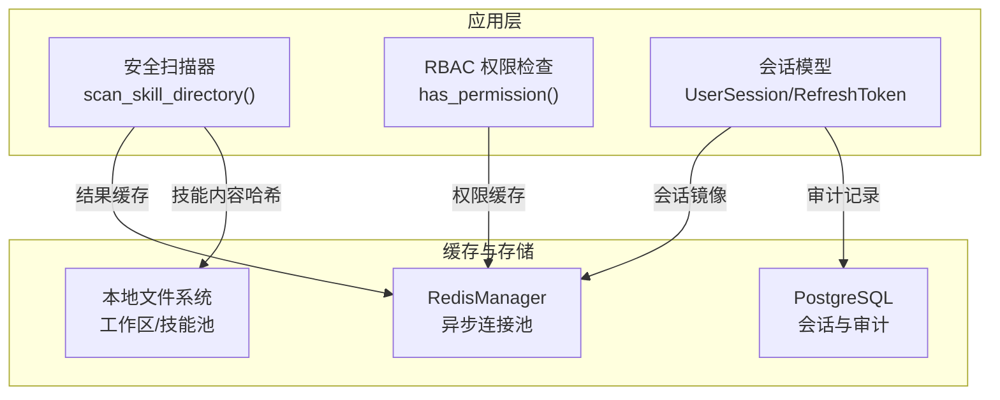
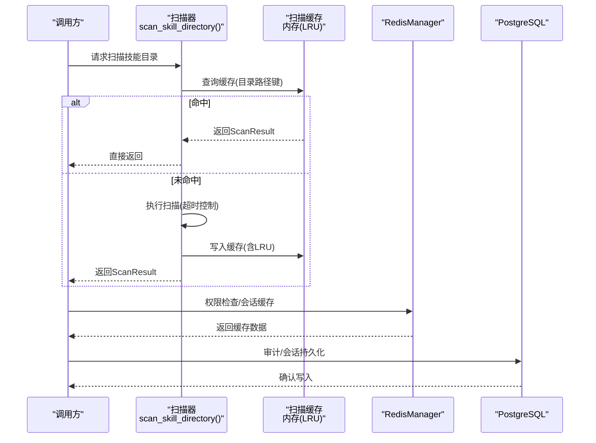
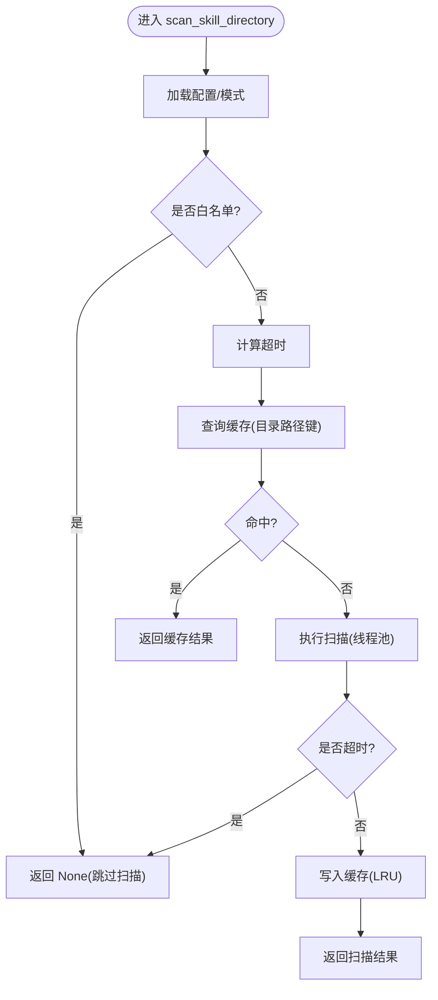
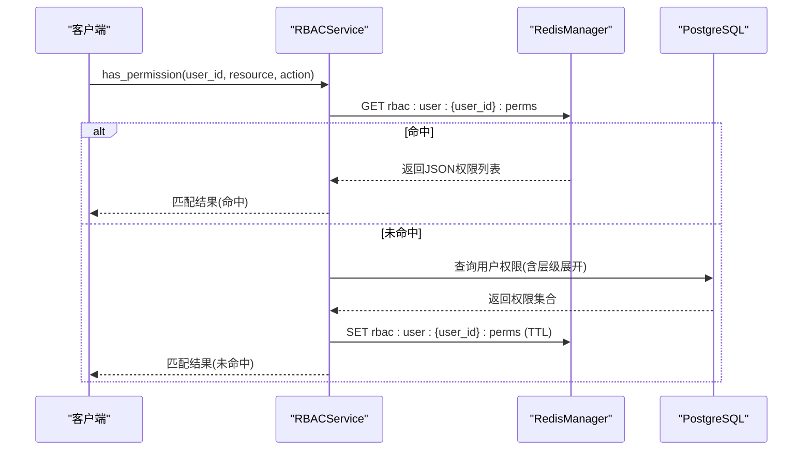
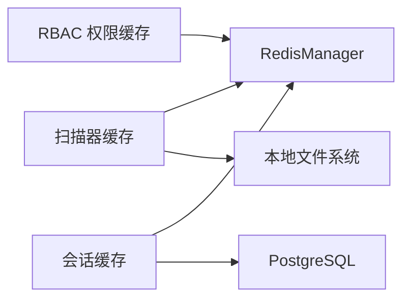

# 技能缓存

<cite>
**本文引用的文件**
- [skill_scanner/__init__.py](file://src/copaw/security/skill_scanner/__init__.py)
- [redis_client.py](file://src/copaw/db/redis_client.py)
- [rbac_service.py](file://src/copaw/enterprise/rbac_service.py)
- [enterprise-storage-migration.md](file://docs/enterprise-storage-migration.md)
- [session.py](file://src/copaw/db/models/session.py)
- [001_initial_schema.py](file://alembic/versions/001_initial_schema.py)
- [reme_light_memory_manager.py](file://src/copaw/agents/memory/reme_light_memory_manager.py)
- [README.md](file://README.md)
</cite>

## 目录
1. [简介](#简介)
2. [项目结构](#项目结构)
3. [核心组件](#核心组件)
4. [架构总览](#架构总览)
5. [详细组件分析](#详细组件分析)
6. [依赖分析](#依赖分析)
7. [性能考量](#性能考量)
8. [故障排除指南](#故障排除指南)
9. [结论](#结论)
10. [附录](#附录)

## 简介
本技术文档聚焦“技能缓存系统”，围绕技能执行结果的缓存策略、缓存失效机制、命中率优化、缓存键设计、数据序列化与存储介质选择、缓存更新与并发控制、内存管理、监控与容量规划、调优与故障排除，以及分布式缓存、持久化存储与缓存预热等高级主题进行系统化阐述。文档同时给出配置示例与性能基准建议，并通过图示展示关键流程与依赖关系。

## 项目结构
本仓库中与“技能缓存”直接相关的核心位置包括：
- 安全扫描器中的扫描结果缓存：位于安全模块，采用基于目录 mtime 的内存缓存与 LRU 淘汰。
- 企业版权限控制中的 Redis 缓存：RBAC 权限映射缓存，带 TTL。
- Redis 连接管理器：统一提供异步 Redis 访问、缓存键命名空间、发布订阅、分布式锁等能力。
- 会话模型与数据库：用户会话与刷新令牌模型，支撑会话缓存与审计。
- 存储架构文档：概述本地文件系统、PostgreSQL、Redis、SQLite 等存储介质的角色与关系。
- 记忆管理器：ReMeLight 内存与向量检索能力，涉及向量嵌入缓存与索引重建策略。

图表来源
- [redis_client.py:22-218](file://src/copaw/db/redis_client.py#L22-L218)
- [rbac_service.py:30-64](file://src/copaw/enterprise/rbac_service.py#L30-L64)
- [session.py:21-115](file://src/copaw/db/models/session.py#L21-L115)
- [enterprise-storage-migration.md:134-158](file://docs/enterprise-storage-migration.md#L134-L158)

章节来源
- [redis_client.py:22-218](file://src/copaw/db/redis_client.py#L22-L218)
- [rbac_service.py:30-64](file://src/copaw/enterprise/rbac_service.py#L30-L64)
- [session.py:21-115](file://src/copaw/db/models/session.py#L21-L115)
- [enterprise-storage-migration.md:134-158](file://docs/enterprise-storage-migration.md#L134-L158)

## 核心组件
- 扫描结果缓存（内存 + LRU）
  - 以技能目录路径为键，缓存扫描结果；缓存条目包含目录 mtime 与结果对象；超过最大条目数时按插入顺序淘汰最旧项。
  - 优点：避免重复扫描同一技能目录，显著降低 CPU 与 I/O 开销；线程安全。
  - 关键函数：获取目录 mtime、读取缓存、写入缓存（含 LRU）、超时处理。
- Redis 缓存（企业版）
  - 提供异步连接池、键命名空间、TTL 设置、发布订阅、分布式锁等通用能力。
  - 在 RBAC 中用于缓存用户权限映射，减少数据库查询压力。
- 会话缓存（PG + Redis）
  - UserSession/RefreshToken 模型在数据库中持久化，同时在 Redis 中镜像，用于快速查找与撤销。
- 记忆与向量缓存（ReMeLight）
  - 支持向量嵌入与全文检索，具备索引重建与压缩策略，间接影响“技能执行结果”的检索与缓存命中。

章节来源
- [skill_scanner/__init__.py:327-380](file://src/copaw/security/skill_scanner/__init__.py#L327-L380)
- [redis_client.py:22-218](file://src/copaw/db/redis_client.py#L22-L218)
- [rbac_service.py:30-64](file://src/copaw/enterprise/rbac_service.py#L30-L64)
- [session.py:21-115](file://src/copaw/db/models/session.py#L21-L115)
- [reme_light_memory_manager.py:115-127](file://src/copaw/agents/memory/reme_light_memory_manager.py#L115-L127)

## 架构总览
下图展示了“技能缓存系统”的整体交互：扫描器在执行扫描前先查缓存，命中则直接返回；未命中则执行扫描并将结果写回缓存；RBAC 在权限检查时也利用 Redis 缓存提升性能；会话信息在数据库与 Redis 之间镜像，保障快速校验与撤销。

图表来源
- [skill_scanner/__init__.py:415-505](file://src/copaw/security/skill_scanner/__init__.py#L415-L505)
- [redis_client.py:109-137](file://src/copaw/db/redis_client.py#L109-L137)
- [rbac_service.py:36-63](file://src/copaw/enterprise/rbac_service.py#L36-L63)
- [session.py:21-115](file://src/copaw/db/models/session.py#L21-L115)

## 详细组件分析

### 组件A：扫描结果缓存（内存 + LRU）
- 设计要点
  - 键设计：技能目录绝对路径字符串；避免跨平台差异，使用解析后的绝对路径。
  - 失效机制：基于目录 mtime 的变更检测；当目录或其直接文件的 mtime 发生变化即视为失效。
  - 序列化：缓存值为完整 ScanResult 对象；读取时直接返回，无需额外反序列化。
  - LRU 淘汰：最大条目数限制，超出时删除最旧项，保证内存占用可控。
  - 并发控制：全局锁保护缓存字典的读写，避免竞态。
  - 超时控制：扫描过程支持超时，超时则不写入缓存，避免阻塞。
- 命中率优化
  - 通过 mtime 检测确保缓存一致性；对频繁重复扫描的技能目录显著提升命中率。
  - 限制最大缓存条目数量，避免内存膨胀。
- 更新策略
  - 新增或更新缓存项时，先弹出旧键再插入新键，随后进行长度裁剪。
- 并发与内存
  - 使用线程锁保护共享状态；缓存值为对象引用，避免频繁深拷贝。
- 监控与容量规划
  - 可通过日志统计缓存命中次数与未命中次数，评估命中率；根据技能目录规模与扫描频率设定最大条目数。
- 故障排除
  - 若出现缓存不一致，检查目录 mtime 是否被修改；确认锁未被死锁占用；必要时清空缓存后重试。

图表来源
- [skill_scanner/__init__.py:415-505](file://src/copaw/security/skill_scanner/__init__.py#L415-L505)
- [skill_scanner/__init__.py:327-380](file://src/copaw/security/skill_scanner/__init__.py#L327-L380)

章节来源
- [skill_scanner/__init__.py:327-380](file://src/copaw/security/skill_scanner/__init__.py#L327-L380)
- [skill_scanner/__init__.py:415-505](file://src/copaw/security/skill_scanner/__init__.py#L415-L505)

### 组件B：Redis 缓存（权限与会话）
- 设计要点
  - RedisManager 提供统一的异步连接池、键命名空间、TTL 设置、发布订阅、分布式锁等能力。
  - RBACService 将用户权限映射缓存到 Redis，键格式为 rbac:user:{user_id}:perms，TTL 默认 300 秒。
  - 会话模型在数据库中持久化，同时在 Redis 中镜像，便于快速查找与撤销。
- 命中率优化
  - 权限检查高频场景下，缓存命中可显著降低数据库查询次数。
  - 通过 TTL 控制缓存新鲜度，结合权限变更时的缓存失效策略，维持准确性。
- 更新策略
  - 权限变更（角色分配/回收、权限集合替换）时，主动删除对应用户的权限缓存键，确保下次查询从数据库加载最新数据。
- 并发与内存
  - 异步接口避免阻塞；连接池上限可调，防止资源耗尽。
- 监控与容量规划
  - 关注 Redis 内存使用、键数量、命中率与过期策略；结合业务峰值设置连接池大小与 TTL。
- 故障排除
  - Redis 不可用时，降级为直接查询数据库；检查健康检查接口与网络连通性；核对键命名空间与 TTL 设置。

图表来源
- [rbac_service.py:36-63](file://src/copaw/enterprise/rbac_service.py#L36-L63)
- [redis_client.py:109-137](file://src/copaw/db/redis_client.py#L109-L137)

章节来源
- [redis_client.py:22-218](file://src/copaw/db/redis_client.py#L22-L218)
- [rbac_service.py:30-64](file://src/copaw/enterprise/rbac_service.py#L30-L64)
- [session.py:21-115](file://src/copaw/db/models/session.py#L21-L115)
- [001_initial_schema.py:152-163](file://alembic/versions/001_initial_schema.py#L152-L163)

### 组件C：会话缓存（PG + Redis）
- 设计要点
  - UserSession/RefreshToken 模型在数据库中持久化，同时在 Redis 中镜像，用于快速查找与撤销。
  - 会话缓存键命名规范，便于统一管理与清理。
- 命中率优化
  - 快速会话校验与撤销，减少数据库往返。
- 更新策略
  - 会话创建/更新/撤销时同步更新 Redis 与数据库，保证一致性。
- 并发与内存
  - 异步接口与连接池，避免阻塞；Redis 作为热点数据缓存，降低数据库压力。
- 监控与容量规划
  - 关注会话数量、Redis 内存与键过期策略；结合业务峰值调整连接池与 TTL。
- 故障排除
  - Redis 不可用时，降级为数据库查询；核对会话键命名与过期策略。

章节来源
- [session.py:21-115](file://src/copaw/db/models/session.py#L21-L115)
- [001_initial_schema.py:152-163](file://alembic/versions/001_initial_schema.py#L152-L163)
- [redis_client.py:109-137](file://src/copaw/db/redis_client.py#L109-L137)

### 组件D：记忆与向量缓存（ReMeLight）
- 设计要点
  - ReMeLight 支持向量嵌入与全文检索，具备索引重建与压缩策略，间接影响“技能执行结果”的检索与缓存命中。
  - 向量维度、缓存开关、批处理参数等均可配置，影响检索性能与内存占用。
- 命中率优化
  - 通过合理的向量维度与阈值设置，提升检索准确率与速度。
- 更新策略
  - 索引重建与压缩策略需结合业务数据更新频率进行规划。
- 并发与内存
  - 注意向量嵌入模型的批处理与缓存参数，避免内存峰值过高。
- 监控与容量规划
  - 关注向量索引大小、检索延迟与内存使用；结合硬件资源规划缓存与索引策略。
- 故障排除
  - 版本不匹配导致功能异常时，按提示升级依赖版本；关注索引重建失败的日志。

章节来源
- [reme_light_memory_manager.py:115-127](file://src/copaw/agents/memory/reme_light_memory_manager.py#L115-L127)
- [reme_light_memory_manager.py:183-202](file://src/copaw/agents/memory/reme_light_memory_manager.py#L183-L202)

## 依赖分析
- 组件耦合与内聚
  - 扫描器缓存与 Redis 缓存相互独立，分别服务于不同领域；两者均依赖统一的键命名与并发控制策略。
  - RBAC 与会话缓存共享 RedisManager，体现良好的基础设施复用。
- 外部依赖与集成点
  - RedisManager 依赖 redis-py 与 hiredis；会话模型依赖 SQLAlchemy 与 PostgreSQL。
  - 存储架构文档明确了本地文件系统、PostgreSQL、Redis、SQLite 的角色分工。
- 循环依赖
  - 未发现循环依赖；各模块职责清晰，接口边界明确。

图表来源
- [redis_client.py:22-218](file://src/copaw/db/redis_client.py#L22-L218)
- [rbac_service.py:30-64](file://src/copaw/enterprise/rbac_service.py#L30-L64)
- [session.py:21-115](file://src/copaw/db/models/session.py#L21-L115)
- [enterprise-storage-migration.md:134-158](file://docs/enterprise-storage-migration.md#L134-L158)

章节来源
- [redis_client.py:22-218](file://src/copaw/db/redis_client.py#L22-L218)
- [rbac_service.py:30-64](file://src/copaw/enterprise/rbac_service.py#L30-L64)
- [session.py:21-115](file://src/copaw/db/models/session.py#L21-L115)
- [enterprise-storage-migration.md:134-158](file://docs/enterprise-storage-migration.md#L134-L158)

## 性能考量
- 缓存命中率
  - 扫描器缓存通过目录 mtime 检测提升命中率；RBAC 缓存通过 TTL 控制新鲜度；两者结合可显著降低数据库与 I/O 压力。
- 并发与吞吐
  - RedisManager 提供异步接口与连接池，适合高并发场景；扫描器缓存使用线程锁，适用于单进程内的高并发读写。
- 内存管理
  - 扫描器缓存采用 LRU 淘汰，限制最大条目数；ReMeLight 的嵌入缓存与批处理参数需合理配置，避免内存峰值。
- I/O 与网络
  - 会话缓存与权限缓存均走 Redis，减少数据库 I/O；注意网络抖动与 Redis 延迟对整体性能的影响。

## 故障排除指南
- Redis 不可用
  - 现象：权限检查或会话缓存失败。
  - 处理：启用健康检查接口，核对连接参数与网络连通性；必要时降级为数据库直连。
- 缓存不一致
  - 现象：扫描结果或权限结果与预期不符。
  - 处理：检查目录 mtime 是否被修改；确认缓存键命名与 TTL 设置；在权限变更后主动清理缓存键。
- 内存不足
  - 现象：系统内存告警或缓存频繁淘汰。
  - 处理：降低扫描器缓存最大条目数；调整 ReMeLight 嵌入缓存与批处理参数；监控 Redis 内存使用。
- 会话异常
  - 现象：会话查找失败或撤销无效。
  - 处理：核对会话键命名与过期策略；检查数据库与 Redis 的镜像同步状态。

章节来源
- [redis_client.py:198-207](file://src/copaw/db/redis_client.py#L198-L207)
- [rbac_service.py:162-184](file://src/copaw/enterprise/rbac_service.py#L162-L184)
- [session.py:21-115](file://src/copaw/db/models/session.py#L21-L115)

## 结论
技能缓存系统通过“扫描器缓存 + Redis 缓存 + 会话缓存 + 记忆与向量缓存”的多层协同，在保证一致性的同时显著提升了性能与可扩展性。通过合理的键设计、TTL 策略、LRU 淘汰与并发控制，系统能够在高并发场景下稳定运行。建议持续监控命中率、内存与网络指标，并结合业务增长进行容量规划与调优。

## 附录

### 缓存配置示例
- 扫描器缓存
  - 最大缓存条目数：64（默认）
  - 目录 mtime 检测：自动
  - 超时控制：通过扫描器超时参数设置
- Redis 缓存
  - 连接参数：主机、端口、数据库、密码、最大连接数、键前缀
  - 权限缓存 TTL：默认 300 秒
  - 键命名：rbac:user:{user_id}:perms
- 会话缓存
  - Redis 键命名：遵循统一命名规范
  - 数据库持久化：UserSession/RefreshToken 模型
- 记忆与向量缓存
  - 向量维度、嵌入缓存开关、批处理参数、索引重建策略

章节来源
- [skill_scanner/__init__.py:327-380](file://src/copaw/security/skill_scanner/__init__.py#L327-L380)
- [redis_client.py:43-78](file://src/copaw/db/redis_client.py#L43-L78)
- [rbac_service.py:27-63](file://src/copaw/enterprise/rbac_service.py#L27-L63)
- [session.py:21-115](file://src/copaw/db/models/session.py#L21-L115)
- [reme_light_memory_manager.py:183-202](file://src/copaw/agents/memory/reme_light_memory_manager.py#L183-L202)

### 性能基准建议
- 基准测试方法
  - 扫描器缓存：构造相同目录的多次扫描请求，统计命中率与平均响应时间。
  - Redis 缓存：压测权限检查与会话缓存，观察延迟分布与吞吐。
  - 记忆与向量缓存：对比不同向量维度与阈值下的检索延迟与准确率。
- 监控指标
  - 缓存命中率、Redis 内存使用、数据库查询次数、网络延迟、系统 CPU/内存。
- 调优方向
  - 调整扫描器缓存最大条目数与 TTL；优化 Redis 连接池与键前缀；合理配置嵌入缓存与批处理参数。

### 分布式缓存、持久化存储与缓存预热
- 分布式缓存
  - 使用 Redis 集群或哨兵模式，确保高可用与自动故障转移。
- 持久化存储
  - PostgreSQL 用于会话与审计；本地文件系统用于技能与工作区；SQLite 用于轻量场景。
- 缓存预热
  - 在系统启动时预热高频权限键；在索引重建完成后预热向量索引，减少首次查询延迟。

章节来源
- [enterprise-storage-migration.md:134-158](file://docs/enterprise-storage-migration.md#L134-L158)
- [rbac_service.py:36-63](file://src/copaw/enterprise/rbac_service.py#L36-L63)
- [reme_light_memory_manager.py:115-127](file://src/copaw/agents/memory/reme_light_memory_manager.py#L115-L127)