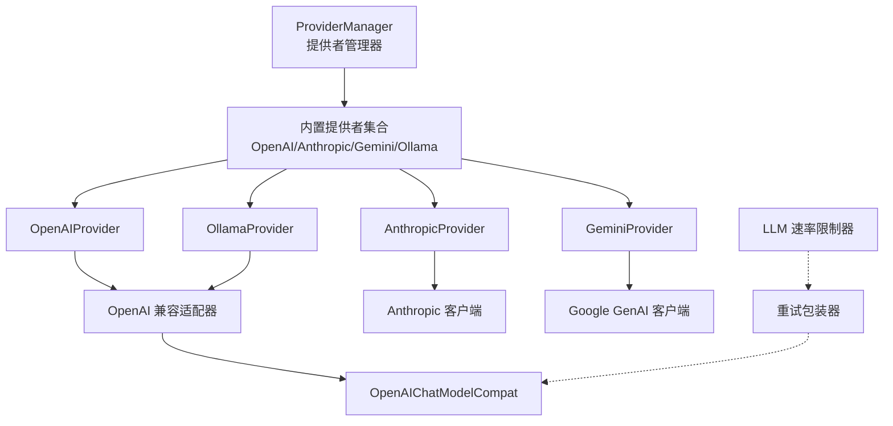
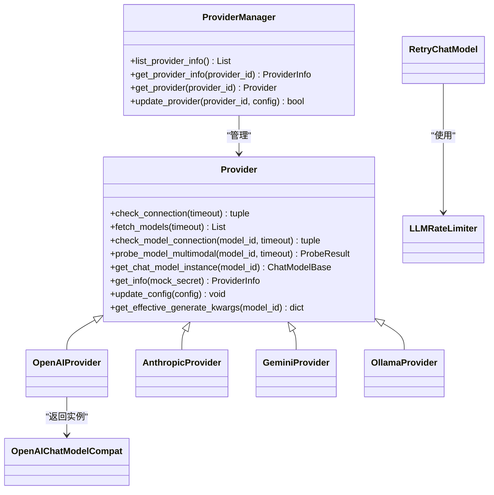
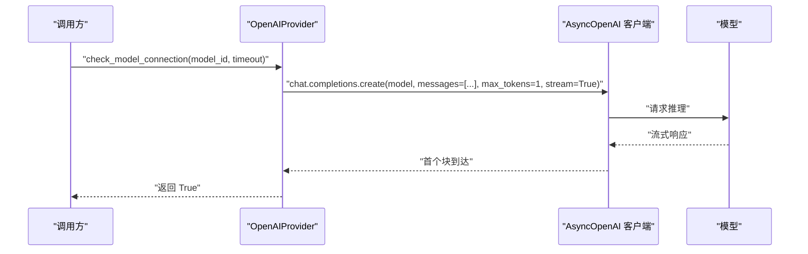
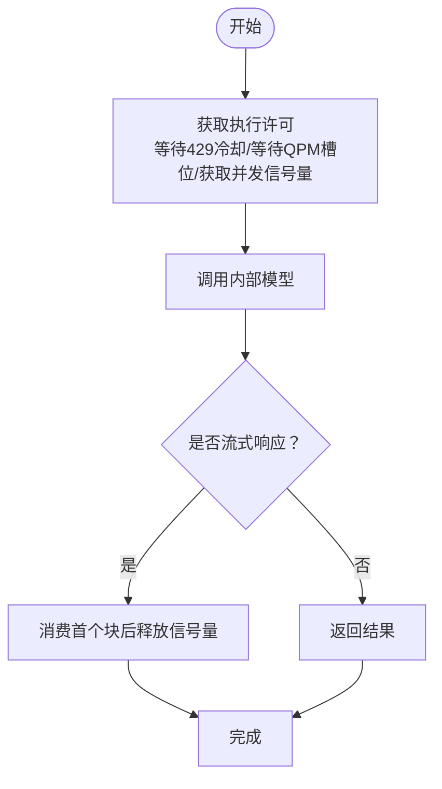
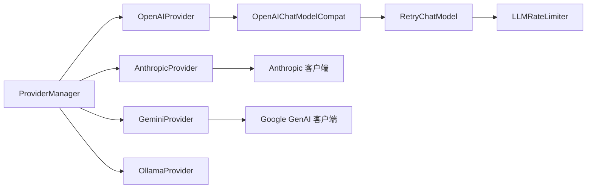

# 内置提供者

<cite>
**本文档引用的文件**
- [provider.py](file://src/copaw/providers/provider.py)
- [provider_manager.py](file://src/copaw/providers/provider_manager.py)
- [models.py](file://src/copaw/providers/models.py)
- [openai_provider.py](file://src/copaw/providers/openai_provider.py)
- [anthropic_provider.py](file://src/copaw/providers/anthropic_provider.py)
- [gemini_provider.py](file://src/copaw/providers/gemini_provider.py)
- [ollama_provider.py](file://src/copaw/providers/ollama_provider.py)
- [multimodal_prober.py](file://src/copaw/providers/multimodal_prober.py)
- [openai_chat_model_compat.py](file://src/copaw/providers/openai_chat_model_compat.py)
- [rate_limiter.py](file://src/copaw/providers/rate_limiter.py)
- [retry_chat_model.py](file://src/copaw/providers/retry_chat_model.py)
- [test_openai_provider.py](file://tests/unit/providers/test_openai_provider.py)
- [test_anthropic_provider.py](file://tests/unit/providers/test_anthropic_provider.py)
- [test_gemini_provider.py](file://tests/unit/providers/test_gemini_provider.py)
- [test_ollama_provider.py](file://tests/unit/providers/test_ollama_provider.py)
</cite>

## 目录
1. [简介](#简介)
2. [项目结构](#项目结构)
3. [核心组件](#核心组件)
4. [架构总览](#架构总览)
5. [详细组件分析](#详细组件分析)
6. [依赖分析](#依赖分析)
7. [性能考虑](#性能考虑)
8. [故障排除指南](#故障排除指南)
9. [结论](#结论)
10. [附录](#附录)

## 简介
本文件系统性阐述 Copaw 内置提供者的实现与使用方法，覆盖 OpenAI、Anthropic、Google Gemini、Ollama 等主流 LLM 提供者。内容包括：
- 认证机制与 API 端点配置
- 模型列表管理与能力探测
- 连接测试与错误处理
- 配置模板、默认参数与环境变量处理
- 使用示例与最佳实践

## 项目结构
内置提供者位于 `src/copaw/providers/` 目录，采用“抽象基类 + 具体实现 + 管理器”的分层设计：
- 抽象层：定义 Provider 基类与通用数据结构（ProviderInfo、ModelInfo）
- 实现层：针对不同提供商的具体实现（OpenAI、Anthropic、Gemini、Ollama）
- 管理层：ProviderManager 负责内置提供者注册、持久化与统一查询
- 工具层：多模态探测器、重试与限流等辅助模块

图示来源
- [provider_manager.py:670-732](file://src/copaw/providers/provider_manager.py#L670-L732)
- [openai_provider.py:25-34](file://src/copaw/providers/openai_provider.py#L25-L34)
- [anthropic_provider.py:27-35](file://src/copaw/providers/anthropic_provider.py#L27-L35)
- [gemini_provider.py:27-34](file://src/copaw/providers/gemini_provider.py#L27-L34)
- [ollama_provider.py:16-52](file://src/copaw/providers/ollama_provider.py#L16-L52)
- [openai_chat_model_compat.py:191-313](file://src/copaw/providers/openai_chat_model_compat.py#L191-L313)
- [rate_limiter.py:30-70](file://src/copaw/providers/rate_limiter.py#L30-L70)
- [retry_chat_model.py:204-228](file://src/copaw/providers/retry_chat_model.py#L204-L228)

章节来源
- [provider_manager.py:670-732](file://src/copaw/providers/provider_manager.py#L670-L732)
- [provider.py:111-314](file://src/copaw/providers/provider.py#L111-L314)

## 核心组件
- Provider/ProviderInfo/ModelInfo：定义提供者元信息、模型元信息与通用行为接口
- ProviderManager：内置提供者注册、持久化存储、统一查询与迁移
- 具体 Provider：OpenAIProvider、AnthropicProvider、GeminiProvider、OllamaProvider
- 多模态探测器：统一的图像/视频探测常量与结果结构
- 重试与限流：全局并发与 QPM 控制，透明重试包装器

章节来源
- [provider.py:17-314](file://src/copaw/providers/provider.py#L17-L314)
- [models.py:9-16](file://src/copaw/providers/models.py#L9-L16)
- [provider_manager.py:666-751](file://src/copaw/providers/provider_manager.py#L666-L751)
- [multimodal_prober.py:75-102](file://src/copaw/providers/multimodal_prober.py#L75-L102)

## 架构总览
内置提供者通过 ProviderManager 统一注册与管理，支持以下关键能力：
- 提供者级配置：名称、基础 URL、API Key、是否本地、是否冻结 URL、是否需要 API Key、是否支持模型发现/连接检查
- 模型级配置：每个模型的标识、名称、多模态支持状态、探测来源、生成参数覆盖
- 统一接口：连接检查、模型列表拉取、单模型可用性检查、多模态探测、实例化聊天模型
- 安全与持久化：敏感字段加密存储、磁盘目录权限控制、插件提供者直存 ProviderInfo

图示来源
- [provider.py:111-314](file://src/copaw/providers/provider.py#L111-L314)
- [provider_manager.py:670-778](file://src/copaw/providers/provider_manager.py#L670-L778)
- [openai_provider.py:25-163](file://src/copaw/providers/openai_provider.py#L25-L163)
- [anthropic_provider.py:27-164](file://src/copaw/providers/anthropic_provider.py#L27-L164)
- [gemini_provider.py:27-140](file://src/copaw/providers/gemini_provider.py#L27-L140)
- [ollama_provider.py:16-85](file://src/copaw/providers/ollama_provider.py#L16-L85)
- [openai_chat_model_compat.py:191-313](file://src/copaw/providers/openai_chat_model_compat.py#L191-L313)
- [rate_limiter.py:30-70](file://src/copaw/providers/rate_limiter.py#L30-L70)
- [retry_chat_model.py:204-228](file://src/copaw/providers/retry_chat_model.py#L204-L228)

## 详细组件分析

### Provider 抽象层
- 数据模型
  - ModelInfo：模型标识、可读名称、多模态支持状态（图像/视频）、探测来源、模型级生成参数覆盖
  - ProviderInfo：提供者标识、名称、基础 URL、API Key、聊天模型类型、内置/用户添加模型列表、API Key 前缀、是否本地/冻结 URL/需要 API Key、是否支持模型发现/连接检查、提供者级生成参数、元数据
- 关键方法
  - 连接检查、模型列表获取、单模型可用性检查
  - 模型增删、配置更新、有效生成参数合并、多模态探测默认实现
  - 返回聊天模型类与实例化

章节来源
- [provider.py:17-314](file://src/copaw/providers/provider.py#L17-L314)

### ProviderManager 管理器
- 初始化与内置提供者注册：在内存中维护内置/自定义/插件提供者映射
- 存储与迁移：磁盘目录准备（安全权限）、从持久化存储加载、默认注解应用
- 查询与更新：统一列出 ProviderInfo、按 ID 获取 Provider 或其 ProviderInfo、更新 Provider 配置并持久化
- 内置提供者清单（节选）
  - CoPaw Local、Ollama、LM Studio、ModelScope、DashScope、阿里云 CodingPlan、OpenAI、Azure OpenAI、Anthropic、Google Gemini、DeepSeek、Kimi（中/国际）、MiniMax（中/国际）、Zhipu（BigModel/Z.AI 及 CodingPlan）、SiliconFlow（中/国际）

章节来源
- [provider_manager.py:670-732](file://src/copaw/providers/provider_manager.py#L670-L732)
- [provider_manager.py:736-778](file://src/copaw/providers/provider_manager.py#L736-L778)

### OpenAIProvider 实现
- 认证与端点
  - 使用 AsyncOpenAI 客户端，支持 DashScope 兼容头（特定 base_url）
  - 支持模型发现与连接检查；对 DashScope 特殊 base_url 的连接检查有特判
- 模型列表与校验
  - 列表拉取后进行去重与规范化；单模型可用性检查以极短 max_tokens 流式试探
- 多模态探测
  - 图像：发送 16x16 红色 PNG，要求模型识别颜色；对“静默接受媒体但不感知”的模型进行语义验证
  - 视频：优先 base64 内联，失败时回退 HTTP URL；对 HTTP URL 探测放宽条件（已通过图像探测）
- 聊天模型实例化
  - 通过 OpenAIChatModelCompat 包装，支持工具调用解析与额外内容透传

图示来源
- [openai_provider.py:85-124](file://src/copaw/providers/openai_provider.py#L85-L124)

章节来源
- [openai_provider.py:25-550](file://src/copaw/providers/openai_provider.py#L25-L550)

### AnthropicProvider 实现
- 认证与端点
  - 使用 AsyncAnthropic 客户端；支持 DashScope 兼容头
- 模型列表与校验
  - 列表拉取后规范化与去重；单模型可用性检查以消息 API 流式试探
- 多模态探测
  - 仅图像探测（Anthropic 不支持视频）；使用 base64 图像源格式

章节来源
- [anthropic_provider.py:27-256](file://src/copaw/providers/anthropic_provider.py#L27-L256)

### GeminiProvider 实现
- 认证与端点
  - 使用 google.genai 客户端；异步模型列表接口
- 模型列表与校验
  - 列表拉取后去除 "models/" 前缀；单模型可用性检查以 generate_content_stream 试探
- 多模态探测
  - 图像：inline_data 发送 16x16 红色 PNG，要求识别颜色
  - 视频：file_data 发送外部 MP4，询问是否包含运动内容

章节来源
- [gemini_provider.py:27-332](file://src/copaw/providers/gemini_provider.py#L27-L332)

### OllamaProvider 实现
- 认证与端点
  - 作为 OpenAI 兼容平台，自动将 base_url 规范化并追加单个 /v1 后缀
  - 默认从环境变量 OLLAMA_HOST 加载，若未设置则使用本地默认地址
- 模型管理
  - 不支持通过管理器动态增删模型（需在 Ollama 侧执行）
- 聊天模型实例化
  - 通过 OpenAIChatModelCompat 包装，客户端 base_url 指向 /v1

章节来源
- [ollama_provider.py:16-85](file://src/copaw/providers/ollama_provider.py#L16-L85)

### 多模态探测器
- 统一探测常量：最小尺寸红色 PNG、HTTP 视频样本、探测结果结构
- 关键能力
  - 图像探测：检测 API 是否拒绝媒体或接受但不感知
  - 视频探测：优先内联 base64，失败回退 HTTP URL
  - 结果结构：supports_image/supports_video/image_message/video_message

章节来源
- [multimodal_prober.py:75-102](file://src/copaw/providers/multimodal_prober.py#L75-L102)

### 聊天模型兼容与重试/限流
- OpenAIChatModelCompat
  - 清理/标准化流式响应中的工具调用块，修复异常格式
  - 透传额外内容（如 Gemini 思维模型的 thought_signature）
- RetryChatModel
  - 对瞬时错误（429、超时、连接异常）进行指数退避重试
  - 与 LLMRateLimiter 协作：全局并发信号量、QPM 滑动窗口、429 全局暂停与抖动
- LLMRateLimiter
  - 并发上限、每分钟请求数限制、429 全局暂停、等待统计

图示来源
- [retry_chat_model.py:269-354](file://src/copaw/providers/retry_chat_model.py#L269-L354)
- [rate_limiter.py:70-150](file://src/copaw/providers/rate_limiter.py#L70-L150)

章节来源
- [openai_chat_model_compat.py:191-313](file://src/copaw/providers/openai_chat_model_compat.py#L191-L313)
- [retry_chat_model.py:204-477](file://src/copaw/providers/retry_chat_model.py#L204-L477)
- [rate_limiter.py:30-279](file://src/copaw/providers/rate_limiter.py#L30-L279)

## 依赖分析
- ProviderManager 依赖各具体 Provider 类与安全存储模块，负责初始化、持久化与查询
- 具体 Provider 依赖对应 SDK（OpenAI、Anthropic、Google GenAI），并通过 OpenAIChatModelCompat 统一输出
- 重试与限流模块相互协作，形成全局保护层

图示来源
- [provider_manager.py:21-36](file://src/copaw/providers/provider_manager.py#L21-L36)
- [openai_provider.py:126-163](file://src/copaw/providers/openai_provider.py#L126-L163)
- [anthropic_provider.py:128-164](file://src/copaw/providers/anthropic_provider.py#L128-L164)
- [gemini_provider.py:132-140](file://src/copaw/providers/gemini_provider.py#L132-L140)
- [ollama_provider.py:75-85](file://src/copaw/providers/ollama_provider.py#L75-L85)
- [retry_chat_model.py:204-228](file://src/copaw/providers/retry_chat_model.py#L204-L228)
- [rate_limiter.py:30-70](file://src/copaw/providers/rate_limiter.py#L30-L70)

章节来源
- [provider_manager.py:21-36](file://src/copaw/providers/provider_manager.py#L21-L36)

## 性能考虑
- 并发与 QPM 控制：通过 LLMRateLimiter 限制并发与每分钟请求数，避免上游限流
- 429 全局暂停：当收到 429 时设置全局暂停时间，配合抖动避免同时重启
- 流式响应优化：首次块到达即释放信号量，减少长尾阻塞
- 重试策略：指数退避，最大重试次数可配置，避免雪崩效应

章节来源
- [rate_limiter.py:30-150](file://src/copaw/providers/rate_limiter.py#L30-L150)
- [retry_chat_model.py:269-354](file://src/copaw/providers/retry_chat_model.py#L269-L354)

## 故障排除指南
- 连接失败
  - OpenAI/Azure OpenAI：检查 base_url 与 API Key；DashScope 特定 base_url 有特判
  - Anthropic：确认 API Key 与网络可达性
  - Gemini：检查 API Key 与网络；注意异步列表接口
  - Ollama：确认 OLLAMA_HOST 环境变量与本地服务运行状态
- 模型不可用
  - 使用单模型连接检查接口定位问题；查看返回的错误信息
- 多模态探测异常
  - 图像探测：部分模型可能静默接受媒体但不感知，需结合语义验证
  - 视频探测：优先内联 base64，失败再回退 HTTP URL
- 重试与限流
  - 若频繁出现 429，适当降低并发或提高 acquire 超时；检查 Retry-After 头

章节来源
- [openai_provider.py:57-124](file://src/copaw/providers/openai_provider.py#L57-L124)
- [anthropic_provider.py:66-126](file://src/copaw/providers/anthropic_provider.py#L66-L126)
- [gemini_provider.py:68-130](file://src/copaw/providers/gemini_provider.py#L68-L130)
- [ollama_provider.py:36-52](file://src/copaw/providers/ollama_provider.py#L36-L52)
- [retry_chat_model.py:137-160](file://src/copaw/providers/retry_chat_model.py#L137-L160)
- [rate_limiter.py:152-174](file://src/copaw/providers/rate_limiter.py#L152-L174)

## 结论
Copaw 内置提供者通过统一抽象与管理器实现了对多家 LLM 提供商的一致接入，具备完善的连接检查、模型发现、单模型校验与多模态探测能力，并通过重试与限流保障稳定性。Ollama 作为本地平台提供了开箱即用的兼容体验。

## 附录

### 配置模板与默认参数
- ProviderInfo 字段
  - id、name、base_url、api_key、chat_model、models、extra_models、api_key_prefix、is_local、freeze_url、require_api_key、is_custom、support_model_discovery、support_connection_check、generate_kwargs、meta
- ModelInfo 字段
  - id、name、supports_multimodal、supports_image、supports_video、probe_source、generate_kwargs
- ProviderManager 默认行为
  - 内置提供者注册、磁盘目录准备（权限 0700）、持久化存储、默认注解应用
- OpenAIProvider 默认行为
  - DashScope 兼容头、模型发现与连接检查、多模态探测（图像/视频）
- OllamaProvider 默认行为
  - 自动从环境变量加载 base_url，统一追加 /v1 后缀

章节来源
- [provider.py:49-109](file://src/copaw/providers/provider.py#L49-L109)
- [models.py:9-16](file://src/copaw/providers/models.py#L9-L16)
- [provider_manager.py:696-732](file://src/copaw/providers/provider_manager.py#L696-L732)
- [openai_provider.py:126-163](file://src/copaw/providers/openai_provider.py#L126-L163)
- [ollama_provider.py:36-52](file://src/copaw/providers/ollama_provider.py#L36-L52)

### 环境变量处理
- OLLAMA_HOST：用于自动填充 Ollama 提供者的 base_url，支持带或不带末尾斜杠与 /v1 后缀的多种形式

章节来源
- [ollama_provider.py:36-41](file://src/copaw/providers/ollama_provider.py#L36-L41)

### 使用示例与最佳实践
- 选择提供者
  - 通过 ProviderManager.list_provider_info() 获取所有提供者信息
  - 通过 ProviderManager.get_provider(provider_id) 获取具体 Provider 实例
- 更新配置
  - 通过 ProviderManager.update_provider(provider_id, config) 更新 Provider 配置并持久化
- 连接测试
  - 使用 Provider.check_connection()/check_model_connection() 快速验证
- 多模态探测
  - 使用 Provider.probe_model_multimodal() 获取图像/视频支持状态
- 本地模型
  - Ollama 提供者无需 API Key，直接使用本地模型

章节来源
- [provider_manager.py:736-778](file://src/copaw/providers/provider_manager.py#L736-L778)
- [openai_provider.py:57-124](file://src/copaw/providers/openai_provider.py#L57-L124)
- [anthropic_provider.py:66-126](file://src/copaw/providers/anthropic_provider.py#L66-L126)
- [gemini_provider.py:68-130](file://src/copaw/providers/gemini_provider.py#L68-L130)
- [ollama_provider.py:36-52](file://src/copaw/providers/ollama_provider.py#L36-L52)

### 行为验证（单元测试要点）
- OpenAIProvider
  - 连接检查、模型列表规范化与去重、单模型连接检查、配置更新与 ProviderInfo 输出
- AnthropicProvider
  - 连接检查、模型列表规范化与去重、单模型连接检查、配置更新
- GeminiProvider
  - 连接检查、模型列表规范化与去重、单模型连接检查、模型名前缀处理
- OllamaProvider
  - base_url 规范化、环境变量加载、/v1 后缀拼接、聊天模型实例化

章节来源
- [test_openai_provider.py:21-269](file://tests/unit/providers/test_openai_provider.py#L21-L269)
- [test_anthropic_provider.py:21-189](file://tests/unit/providers/test_anthropic_provider.py#L21-L189)
- [test_gemini_provider.py:41-341](file://tests/unit/providers/test_gemini_provider.py#L41-L341)
- [test_ollama_provider.py:19-141](file://tests/unit/providers/test_ollama_provider.py#L19-L141)