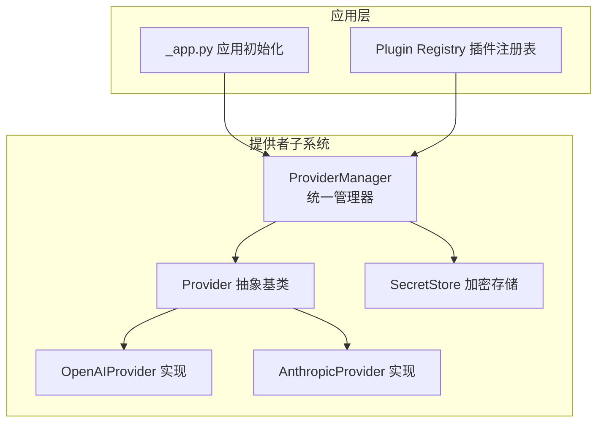
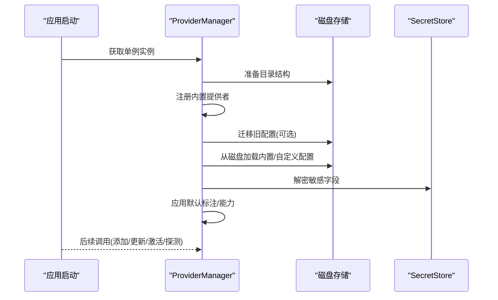
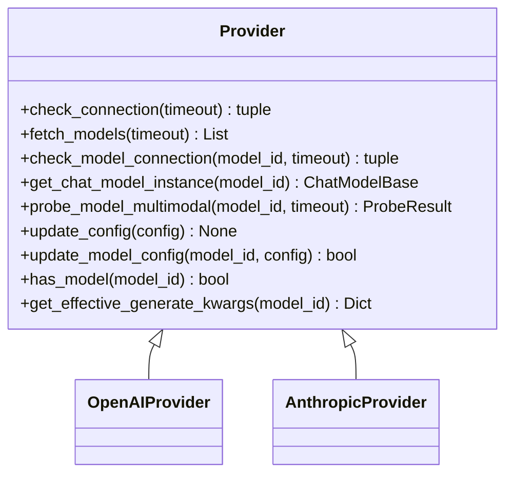
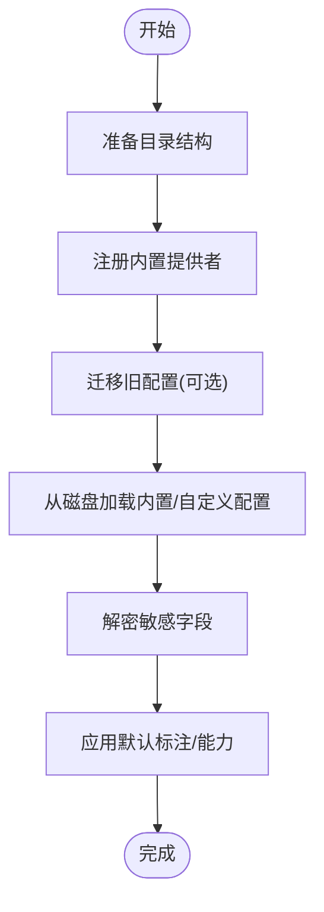
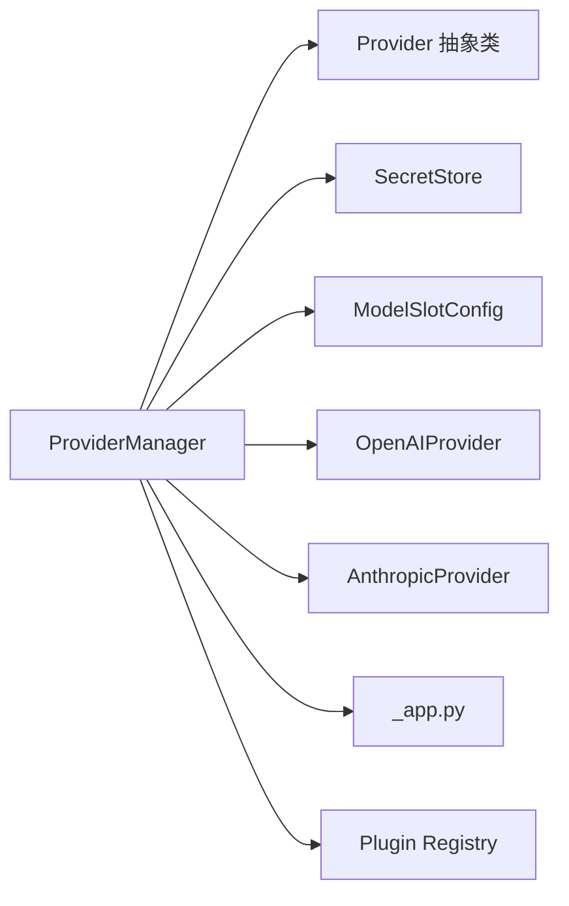

# 提供者管理器核心

<cite>
**本文档引用的文件**
- [provider_manager.py](file://src/copaw/providers/provider_manager.py)
- [provider.py](file://src/copaw/providers/provider.py)
- [_app.py](file://src/copaw/app/_app.py)
- [secret_store.py](file://src/copaw/security/secret_store.py)
- [test_provider_manager.py](file://tests/unit/providers/test_provider_manager.py)
- [models.py](file://src/copaw/providers/models.py)
- [openai_provider.py](file://src/copaw/providers/openai_provider.py)
- [anthropic_provider.py](file://src/copaw/providers/anthropic_provider.py)
- [registry.py](file://src/copaw/plugins/registry.py)
</cite>

## 目录
1. [简介](#简介)
2. [项目结构](#项目结构)
3. [核心组件](#核心组件)
4. [架构总览](#架构总览)
5. [详细组件分析](#详细组件分析)
6. [依赖分析](#依赖分析)
7. [性能考虑](#性能考虑)
8. [故障排查指南](#故障排查指南)
9. [结论](#结论)
10. [附录](#附录)

## 简介
本文件面向“提供者管理器核心”（ProviderManager）的技术文档，系统阐述其设计架构与实现细节，覆盖以下主题：
- 单例模式实现与全局访问入口
- 内置与自定义提供者的统一注册与管理
- 提供者信息获取、配置更新、状态管理
- 提供者存储结构、磁盘持久化与加密存储
- 生命周期管理、热重载与故障恢复
- 扩展点与最佳实践

## 项目结构
ProviderManager位于提供者子系统中，负责统一管理内置、自定义与插件提供的模型提供者，并通过磁盘持久化与加密存储保障配置安全与可恢复性。

图表来源
- [provider_manager.py](file://src/copaw/providers/provider_manager.py)
- [provider.py](file://src/copaw/providers/provider.py)
- [_app.py](file://src/copaw/app/_app.py)
- [secret_store.py](file://src/copaw/security/secret_store.py)
- [registry.py](file://src/copaw/plugins/registry.py)

章节来源
- [provider_manager.py](file://src/copaw/providers/provider_manager.py)
- [provider.py](file://src/copaw/providers/provider.py)
- [_app.py](file://src/copaw/app/_app.py)
- [secret_store.py](file://src/copaw/security/secret_store.py)
- [registry.py](file://src/copaw/plugins/registry.py)

## 核心组件
- ProviderManager：提供者统一管理器，负责内置/自定义/插件提供者的注册、加载、持久化、激活模型、能力探测等。
- Provider 抽象类：定义提供者通用接口（连接检查、模型发现、模型连接检查、实例化聊天模型、能力探测等）。
- ProviderInfo/ModelInfo：提供者与模型的元数据模型，用于序列化与UI展示。
- SecretStore：敏感字段（如API Key）的加密/解密与迁移工具。
- 插件注册表：向ProviderManager注册插件提供的Provider。

章节来源
- [provider_manager.py](file://src/copaw/providers/provider_manager.py)
- [provider.py](file://src/copaw/providers/provider.py)
- [models.py](file://src/copaw/providers/models.py)
- [secret_store.py](file://src/copaw/security/secret_store.py)
- [registry.py](file://src/copaw/plugins/registry.py)

## 架构总览
ProviderManager采用单例模式，初始化时准备磁盘目录、注册内置提供者、迁移旧配置、从磁盘加载配置并应用默认标注；运行期支持添加/删除自定义提供者、更新配置、激活模型、后台恢复本地模型、能力探测与持久化。

图表来源
- [provider_manager.py](file://src/copaw/providers/provider_manager.py)
- [secret_store.py](file://src/copaw/security/secret_store.py)

## 详细组件分析

### ProviderManager 设计与实现
- 单例模式
  - 使用类变量保存唯一实例，首次访问时构造，后续直接返回。
  - 提供静态方法获取实例，确保全局一致性。
- 初始化流程
  - 准备磁盘目录（内置/自定义/插件），设置权限。
  - 注册内置提供者集合。
  - 尝试迁移旧版 providers.json，失败仅记录警告。
  - 从磁盘加载内置/自定义配置，合并用户配置到内置提供者实例。
  - 应用默认标注（基于文档或期望能力表）。
- 提供者注册与查找
  - 内置：初始化时注入。
  - 自定义：动态添加，冲突ID自动重命名。
  - 插件：通过插件注册表注册，保存到独立路径，按需实例化。
  - 查找优先级：插件 > 内置 > 自定义。
- 配置更新与持久化
  - update_provider：更新内存实例后，区分内置/自定义/插件路径保存。
  - _save_provider/_save_plugin_provider：使用加密存储写入JSON，设置严格权限。
  - load_provider：读取JSON，透明解密，必要时迁移明文字段。
- 激活模型与状态管理
  - activate_model：校验提供者与模型存在性，设置当前激活槽位，持久化。
  - get_active_model/save_active_model/clear_active_model：全局激活模型的读写。
- 能力探测与模型管理
  - fetch_provider_models：拉取远端可用模型列表并持久化。
  - add_model_to_provider/update_model_config/delete_model_from_provider：对模型进行增删改查。
  - probe_model_multimodal/maybe_probe_multimodal：异步探测多模态能力并持久化。
- 本地模型热恢复
  - start_local_model_resume：后台任务恢复本地模型服务（如copaw-local）。
  - _resume_local_model：检查安装、下载状态，启动服务并更新URL与模型列表。
- 插件提供者集成
  - register_plugin_provider：从插件注册表读取默认模型与元数据，合并已保存配置，注册到内存字典。
- 错误处理与健壮性
  - 大量try/except与日志warning，避免单点失败影响整体。
  - 对未知提供者抛出明确错误类型，便于上层处理。

章节来源
- [provider_manager.py](file://src/copaw/providers/provider_manager.py)
- [secret_store.py](file://src/copaw/security/secret_store.py)
- [test_provider_manager.py](file://tests/unit/providers/test_provider_manager.py)

### Provider 抽象类与具体实现
- Provider 抽象类
  - 定义统一接口：check_connection/fetch_models/check_model_connection/get_chat_model_instance/probe_model_multimodal 等。
  - 维护 ProviderInfo 字段集，含模型列表、生成参数、是否本地/冻结URL/是否需要API Key等。
  - 提供 update_config/update_model_config/has_model/get_effective_generate_kwargs 等实用方法。
- 具体实现
  - OpenAIProvider：对接OpenAI兼容API，支持模型发现、连接检查、多模态探测（图片/视频）。
  - AnthropicProvider：对接Anthropic API，支持模型发现、连接检查、多模态探测（图片，视频不支持）。
  - 其他内置提供者（如Gemini/Ollama等）在ProviderManager中以实例形式注册。

图表来源
- [provider.py](file://src/copaw/providers/provider.py)
- [openai_provider.py](file://src/copaw/providers/openai_provider.py)
- [anthropic_provider.py](file://src/copaw/providers/anthropic_provider.py)

章节来源
- [provider.py](file://src/copaw/providers/provider.py)
- [openai_provider.py](file://src/copaw/providers/openai_provider.py)
- [anthropic_provider.py](file://src/copaw/providers/anthropic_provider.py)

### 存储结构、磁盘持久化与加密存储
- 目录布局
  - 根目录：providers/
  - 子目录：builtin/、custom/、plugin/
  - 激活模型：providers/active_model.json
- 数据格式
  - JSON文件，包含ProviderInfo字段（含敏感字段api_key）。
  - 敏感字段在写入前加密，在读取后解密。
- 权限控制
  - 写入后设置文件权限为0600，限制访问。
- 迁移策略
  - 旧版 providers.json 一次性迁移至新结构，失败仅告警。
  - 明文api_key检测后自动重加密并回写。

图表来源
- [provider_manager.py](file://src/copaw/providers/provider_manager.py)
- [secret_store.py](file://src/copaw/security/secret_store.py)

章节来源
- [provider_manager.py](file://src/copaw/providers/provider_manager.py)
- [secret_store.py](file://src/copaw/security/secret_store.py)

### 生命周期管理、热重载与故障恢复
- 生命周期
  - 初始化：准备目录、注册内置、迁移、加载、应用默认标注。
  - 运行期：动态增删改查、激活模型、能力探测、持久化。
  - 关闭：由上层服务管理，ProviderManager维持状态。
- 热重载
  - 通过重新实例化ProviderManager可实现“软重启”，保留磁盘持久化的配置与激活模型。
  - 测试覆盖了重启后激活模型仍生效。
- 故障恢复
  - 本地模型恢复：后台任务在应用启动后尝试恢复copaw-local本地模型服务器，若未安装或未下载则跳过。
  - 探测失败：能力探测异常被记录为warning，不影响主流程。
  - 插件提供者：保存配置（如api_key/base_url/generate_kwargs），重启后自动合并。

章节来源
- [test_provider_manager.py](file://tests/unit/providers/test_provider_manager.py)
- [provider_manager.py](file://src/copaw/providers/provider_manager.py)

### 扩展点与最佳实践
- 扩展点
  - 新增内置提供者：在ProviderManager初始化阶段追加实例注册。
  - 插件提供者：通过插件注册表注册，ProviderManager自动加载保存的配置。
  - 自定义提供者：通过UI或API添加，自动解决ID冲突并持久化。
- 最佳实践
  - 保持freeze_url策略：内置提供者通常冻结URL，避免用户误改。
  - 优先使用插件提供者：便于分发与版本管理。
  - 谨慎更新敏感字段：使用update_provider并确认加密写入。
  - 启用能力探测：对未知模型进行异步探测，提升UI体验。
  - 本地模型恢复：确保llama.cpp安装与模型下载，避免恢复失败。

章节来源
- [provider_manager.py](file://src/copaw/providers/provider_manager.py)
- [registry.py](file://src/copaw/plugins/registry.py)
- [_app.py](file://src/copaw/app/_app.py)

## 依赖分析
ProviderManager与外部模块的耦合关系如下：

图表来源
- [provider_manager.py](file://src/copaw/providers/provider_manager.py)
- [provider.py](file://src/copaw/providers/provider.py)
- [models.py](file://src/copaw/providers/models.py)
- [openai_provider.py](file://src/copaw/providers/openai_provider.py)
- [anthropic_provider.py](file://src/copaw/providers/anthropic_provider.py)
- [_app.py](file://src/copaw/app/_app.py)
- [registry.py](file://src/copaw/plugins/registry.py)

章节来源
- [provider_manager.py](file://src/copaw/providers/provider_manager.py)
- [provider.py](file://src/copaw/providers/provider.py)
- [models.py](file://src/copaw/providers/models.py)
- [openai_provider.py](file://src/copaw/providers/openai_provider.py)
- [anthropic_provider.py](file://src/copaw/providers/anthropic_provider.py)
- [_app.py](file://src/copaw/app/_app.py)
- [registry.py](file://src/copaw/plugins/registry.py)

## 性能考虑
- 并发与异步
  - 列举提供者信息时并发获取（gather）。
  - 激活模型后异步触发多模态探测，不阻塞主线程。
  - 本地模型恢复作为后台任务执行，完成后回调日志。
- I/O与磁盘
  - JSON读写采用小文件策略（每个提供者一个文件），减少锁竞争。
  - 写入后设置严格权限，兼顾安全与性能。
- 缓存与默认标注
  - 默认标注在初始化阶段计算，避免重复计算。
  - 已探测结果与期望能力对比，减少重复探测。

## 故障排查指南
- 常见问题
  - 提供者未找到：检查ID是否正确，确认是否为插件/内置/自定义三类之一。
  - 模型不存在：activate_model会抛出明确异常，检查模型ID与提供者关联。
  - 连接失败：使用测试连接接口验证base_url与api_key。
  - 本地模型恢复失败：检查llama.cpp安装与模型下载状态。
- 日志定位
  - ProviderManager内部大量warning日志，关注失败原因与文件路径。
  - 插件提供者注册失败时，检查插件ID是否重复。
- 数据修复
  - 明文api_key会自动迁移为加密存储。
  - 旧版providers.json迁移失败不会中断启动，但可能丢失配置。

章节来源
- [provider_manager.py](file://src/copaw/providers/provider_manager.py)
- [test_provider_manager.py](file://tests/unit/providers/test_provider_manager.py)

## 结论
ProviderManager通过统一抽象、清晰的存储与加密策略、完善的生命周期与恢复机制，实现了对内置、自定义与插件提供者的高效管理。其异步化与并发化设计提升了用户体验，同时通过严格的错误处理与日志体系保障了系统的稳定性与可观测性。

## 附录
- 关键API与行为
  - 单例获取：ProviderManager.get_instance()
  - 添加自定义提供者：add_custom_provider()
  - 更新配置：update_provider()
  - 激活模型：activate_model()/get_active_model()
  - 能力探测：probe_model_multimodal()/maybe_probe_multimodal()
  - 本地模型恢复：start_local_model_resume()