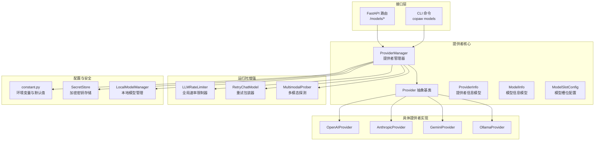
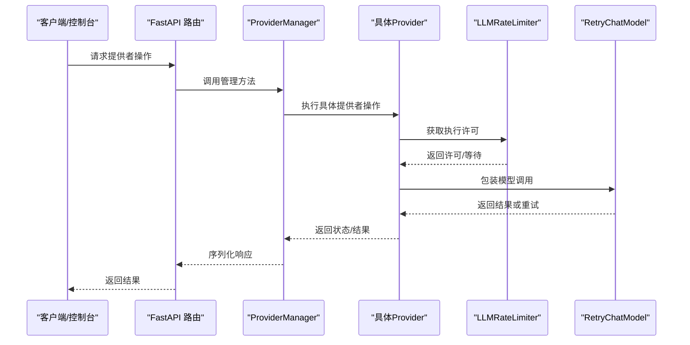
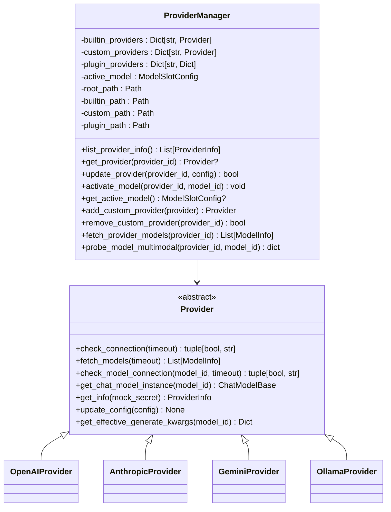
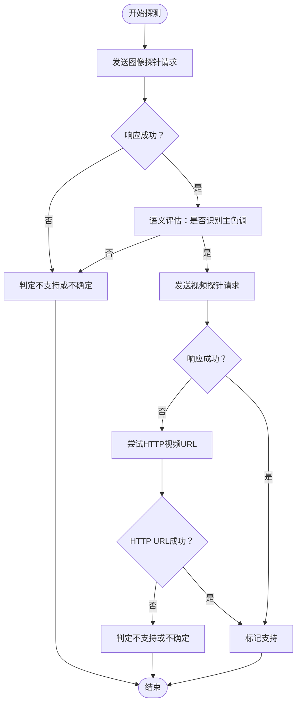
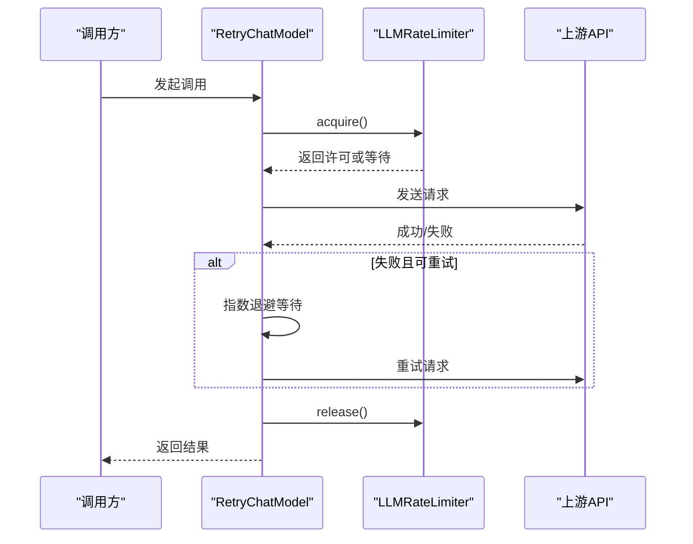
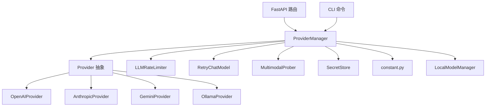

# 提供者管理系统

<cite>
**本文档引用的文件**
- [provider_manager.py](file://src/copaw/providers/provider_manager.py)
- [provider.py](file://src/copaw/providers/provider.py)
- [models.py](file://src/copaw/providers/models.py)
- [rate_limiter.py](file://src/copaw/providers/rate_limiter.py)
- [multimodal_prober.py](file://src/copaw/providers/multimodal_prober.py)
- [openai_provider.py](file://src/copaw/providers/openai_provider.py)
- [anthropic_provider.py](file://src/copaw/providers/anthropic_provider.py)
- [gemini_provider.py](file://src/copaw/providers/gemini_provider.py)
- [ollama_provider.py](file://src/copaw/providers/ollama_provider.py)
- [retry_chat_model.py](file://src/copaw/providers/retry_chat_model.py)
- [providers.py](file://src/copaw/app/routers/providers.py)
- [providers_cmd.py](file://src/copaw/cli/providers_cmd.py)
- [constant.py](file://src/copaw/constant.py)
- [secret_store.py](file://src/copaw/security/secret_store.py)
- [manager.py](file://src/copaw/local_models/manager.py)
- [test_provider_manager.py](file://tests/unit/providers/test_provider_manager.py)
- [test_openai_provider.py](file://tests/unit/providers/test_openai_provider.py)
</cite>

## 目录
1. [简介](#简介)
2. [项目结构](#项目结构)
3. [核心组件](#核心组件)
4. [架构总览](#架构总览)
5. [详细组件分析](#详细组件分析)
6. [依赖关系分析](#依赖关系分析)
7. [性能考虑](#性能考虑)
8. [故障排除指南](#故障排除指南)
9. [结论](#结论)
10. [附录](#附录)

## 简介

提供者管理系统是 CoPaw 框架中负责统一管理各类大语言模型提供者的基础设施层。该系统支持多种主流模型提供者（如 OpenAI、Anthropic、Google Gemini、阿里云 DashScope 等），并提供了完整的生命周期管理：从提供者注册、发现、配置管理到连接池与速率限制控制。

系统采用统一抽象接口，通过 Provider 基类定义标准能力，具体提供者实现各自协议适配；同时内置了多模态探测、重试与限流、本地模型管理等高级特性，确保在复杂生产环境中具备高可用性与可维护性。

## 项目结构

提供者管理相关代码主要位于 `src/copaw/providers/` 目录下，配合应用路由、CLI 命令、常量配置与安全存储模块共同构成完整的管理闭环：

**图表来源**
- [provider_manager.py:670-800](file://src/copaw/providers/provider_manager.py#L670-L800)
- [provider.py:111-314](file://src/copaw/providers/provider.py#L111-L314)
- [models.py:9-16](file://src/copaw/providers/models.py#L9-L16)
- [rate_limiter.py:30-279](file://src/copaw/providers/rate_limiter.py#L30-L279)
- [retry_chat_model.py:204-477](file://src/copaw/providers/retry_chat_model.py#L204-L477)
- [multimodal_prober.py:75-102](file://src/copaw/providers/multimodal_prober.py#L75-L102)
- [providers.py:1-632](file://src/copaw/app/routers/providers.py#L1-L632)
- [providers_cmd.py:1-812](file://src/copaw/cli/providers_cmd.py#L1-L812)
- [constant.py:187-250](file://src/copaw/constant.py#L187-L250)
- [secret_store.py:1-285](file://src/copaw/security/secret_store.py#L1-L285)
- [manager.py:33-229](file://src/copaw/local_models/manager.py#L33-L229)

**章节来源**
- [provider_manager.py:1-800](file://src/copaw/providers/provider_manager.py#L1-L800)
- [providers.py:1-632](file://src/copaw/app/routers/providers.py#L1-L632)
- [providers_cmd.py:1-812](file://src/copaw/cli/providers_cmd.py#L1-L812)

## 核心组件

### Provider 抽象层
- 定义统一的提供者接口：连接检查、模型发现、单模型连通性验证、模型实例化、多模态探测、配置更新等。
- 提供生成参数合并策略（provider 级别与 model 级别的深度合并）。
- 支持自定义提供者与内置提供者区分，以及冻结 URL、是否需要 API Key 等元数据。

**章节来源**
- [provider.py:111-314](file://src/copaw/providers/provider.py#L111-L314)

### ProviderManager 统一管理器
- 负责内置与自定义提供者的注册、持久化与加载。
- 提供统一的提供者查询、配置更新、模型激活等功能。
- 支持插件提供者直连信息模式（无需实例化）。
- 内置迁移逻辑，兼容历史配置文件格式。

**章节来源**
- [provider_manager.py:670-800](file://src/copaw/providers/provider_manager.py#L670-L800)

### 具体提供者实现
- OpenAIProvider：支持 OpenAI 及兼容端点，提供多模态探测、模型发现、连接测试等。
- AnthropicProvider：基于 Anthropic Messages API 的实现。
- GeminiProvider：基于 Google Gemini API 的实现。
- OllamaProvider：本地 LLM 平台适配，自动转换为 OpenAI 兼容端点。

**章节来源**
- [openai_provider.py:25-550](file://src/copaw/providers/openai_provider.py#L25-L550)
- [anthropic_provider.py:27-256](file://src/copaw/providers/anthropic_provider.py#L27-L256)
- [gemini_provider.py:27-332](file://src/copaw/providers/gemini_provider.py#L27-L332)
- [ollama_provider.py:16-86](file://src/copaw/providers/ollama_provider.py#L16-L86)

### 运行时增强组件
- LLMRateLimiter：全局并发与 QPM 限制，支持 429 后统一暂停与抖动避免惊群效应。
- RetryChatModel：透明重试包装器，支持非流式与流式响应的指数退避重试。
- MultimodalProber：多模态能力探测工具，统一图像/视频探测流程与结果结构。

**章节来源**
- [rate_limiter.py:30-279](file://src/copaw/providers/rate_limiter.py#L30-L279)
- [retry_chat_model.py:204-477](file://src/copaw/providers/retry_chat_model.py#L204-L477)
- [multimodal_prober.py:75-102](file://src/copaw/providers/multimodal_prober.py#L75-L102)

### 接口与命令行
- FastAPI 路由：提供 /models/* 接口，支持列出提供者、配置提供者、测试连接、发现模型、探测多模态、设置/获取当前激活模型等。
- CLI 命令：copaw models 子命令族，支持交互式配置、添加/删除提供者与模型、下载本地模型等。

**章节来源**
- [providers.py:1-632](file://src/copaw/app/routers/providers.py#L1-L632)
- [providers_cmd.py:469-812](file://src/copaw/cli/providers_cmd.py#L469-L812)

## 架构总览

提供者管理系统的整体架构围绕 ProviderManager 展开，通过统一抽象与具体实现分离，结合运行时增强组件，形成高内聚、低耦合的管理体系：

**图表来源**
- [providers.py:153-190](file://src/copaw/app/routers/providers.py#L153-L190)
- [provider_manager.py:760-795](file://src/copaw/providers/provider_manager.py#L760-L795)
- [rate_limiter.py:70-111](file://src/copaw/providers/rate_limiter.py#L70-L111)
- [retry_chat_model.py:269-354](file://src/copaw/providers/retry_chat_model.py#L269-L354)

## 详细组件分析

### ProviderManager 组件分析

ProviderManager 是整个提供者管理系统的中枢，负责：

- 初始化内置提供者集合（含 DashScope、Zhipu、OpenAI、Azure OpenAI、Anthropic、Gemini、Ollama、LM Studio、SiliconFlow 等）。
- 自定义提供者注册与持久化，支持冲突解决与唯一 ID 生成。
- 插件提供者直连信息模式，直接返回 ProviderInfo。
- 提供者配置更新与保存，区分内置与自定义路径。
- 激活模型槽位（全局或按代理），并支持本地模型恢复与服务器重启。

**图表来源**
- [provider_manager.py:670-800](file://src/copaw/providers/provider_manager.py#L670-L800)
- [provider.py:111-314](file://src/copaw/providers/provider.py#L111-L314)
- [openai_provider.py:25-550](file://src/copaw/providers/openai_provider.py#L25-L550)
- [anthropic_provider.py:27-256](file://src/copaw/providers/anthropic_provider.py#L27-L256)
- [gemini_provider.py:27-332](file://src/copaw/providers/gemini_provider.py#L27-L332)
- [ollama_provider.py:16-86](file://src/copaw/providers/ollama_provider.py#L16-L86)

**章节来源**
- [provider_manager.py:670-800](file://src/copaw/providers/provider_manager.py#L670-L800)

### 多模态探测机制

多模态探测通过统一的 ProbeResult 结构返回图像与视频支持状态，并针对不同提供者采用差异化探测策略：

- 图像探测：发送最小尺寸探针图片，结合语义校验（如要求识别主色调）以避免静默忽略。
- 视频探测：优先尝试 base64 内联数据，失败时回退至外部 HTTP URL；对 HTTP URL 探测放宽条件，仅需非空响应即视为支持。
- 错误关键词过滤：对包含媒体相关关键字的错误进行明确拒绝判断。

**图表来源**
- [multimodal_prober.py:75-102](file://src/copaw/providers/multimodal_prober.py#L75-L102)
- [openai_provider.py:165-550](file://src/copaw/providers/openai_provider.py#L165-L550)
- [anthropic_provider.py:166-256](file://src/copaw/providers/anthropic_provider.py#L166-L256)
- [gemini_provider.py:142-332](file://src/copaw/providers/gemini_provider.py#L142-L332)

**章节来源**
- [multimodal_prober.py:75-102](file://src/copaw/providers/multimodal_prober.py#L75-L102)
- [openai_provider.py:165-550](file://src/copaw/providers/openai_provider.py#L165-L550)
- [anthropic_provider.py:166-256](file://src/copaw/providers/anthropic_provider.py#L166-L256)
- [gemini_provider.py:142-332](file://src/copaw/providers/gemini_provider.py#L142-L332)

### 速率限制与重试策略

系统通过 LLMRateLimiter 与 RetryChatModel 实现精细化的并发与速率控制：

- LLMRateLimiter
  - 60 秒滑动窗口 QPM 控制，防止 429。
  - asyncio.Semaphore 控制并发请求数。
  - 全局暂停时间戳与抖动，避免惊群重试。
  - 提供统计接口用于监控与告警。
- RetryChatModel
  - 对 429、超时、连接错误等瞬时异常进行指数退避重试。
  - 非流式与流式分别处理，确保资源释放与所有权转移正确。
  - 与 LLMRateLimiter 协作，统一执行许可与暂停策略。

**图表来源**
- [retry_chat_model.py:269-477](file://src/copaw/providers/retry_chat_model.py#L269-L477)
- [rate_limiter.py:70-196](file://src/copaw/providers/rate_limiter.py#L70-L196)

**章节来源**
- [rate_limiter.py:30-279](file://src/copaw/providers/rate_limiter.py#L30-L279)
- [retry_chat_model.py:204-477](file://src/copaw/providers/retry_chat_model.py#L204-L477)

### 配置管理与认证处理

- ProviderInfo/ModelInfo 数据模型定义了提供者与模型的结构化信息，支持额外模型列表与生成参数覆盖。
- SecretStore 提供透明的加密存储，敏感字段（如 API Key）在磁盘上以 ENC: 前缀加密保存，支持 OS Keychain 与文件两种后端。
- Provider.update_config 支持选择性更新，避免覆盖未提供的字段；get_info 可选择隐藏敏感信息。
- 环境变量与默认值集中于 constant.py，便于在不同部署环境下调整行为。

**章节来源**
- [provider.py:17-109](file://src/copaw/providers/provider.py#L17-L109)
- [secret_store.py:1-285](file://src/copaw/security/secret_store.py#L1-L285)
- [constant.py:187-250](file://src/copaw/constant.py#L187-L250)

### 本地模型管理与成本控制

- LocalModelManager 负责本地 llama.cpp 二进制与模型仓库的下载、安装与服务器生命周期管理。
- 通过最大上下文长度等配置项影响推理成本与性能。
- 与 ProviderManager 协同，支持本地模型的激活与恢复。

**章节来源**
- [manager.py:33-229](file://src/copaw/local_models/manager.py#L33-L229)
- [provider_manager.py:200-270](file://src/copaw/providers/provider_manager.py#L200-L270)

## 依赖关系分析

提供者管理系统的依赖关系清晰，核心围绕 Provider 抽象与具体实现展开，运行时增强组件独立于提供者实现，接口层通过路由与命令行与管理器交互：

**图表来源**
- [provider_manager.py:670-800](file://src/copaw/providers/provider_manager.py#L670-L800)
- [providers.py:1-632](file://src/copaw/app/routers/providers.py#L1-L632)
- [providers_cmd.py:1-812](file://src/copaw/cli/providers_cmd.py#L1-L812)
- [secret_store.py:1-285](file://src/copaw/security/secret_store.py#L1-L285)
- [constant.py:1-274](file://src/copaw/constant.py#L1-L274)
- [manager.py:33-229](file://src/copaw/local_models/manager.py#L33-L229)

**章节来源**
- [provider_manager.py:670-800](file://src/copaw/providers/provider_manager.py#L670-L800)
- [providers.py:1-632](file://src/copaw/app/routers/providers.py#L1-L632)
- [providers_cmd.py:1-812](file://src/copaw/cli/providers_cmd.py#L1-L812)

## 性能考虑

- 并发与 QPM 控制：通过 LLMRateLimiter 的滑动窗口与信号量限制并发与吞吐，减少上游限流触发。
- 重试策略：指数退避降低瞬时峰值压力，避免雪崩效应。
- 多模态探测：使用最小探针与语义校验，避免无效探测带来的额外延迟。
- 本地模型：通过本地推理减少网络往返，但需合理配置上下文长度与硬件资源。
- 监控与统计：LLMRateLimiter 提供实时统计，便于动态调优。

[本节为通用指导，无需特定文件引用]

## 故障排除指南

常见问题与排查步骤：

- 提供者连接失败
  - 使用 /models/{provider_id}/test 接口或 CLI copaw models config-key 进行连接测试。
  - 检查 base_url 与 API Key 是否正确，必要时参考 ProviderInfo 中的 api_key_prefix 提示。
- 模型不可用
  - 使用 /models/{provider_id}/models/test 接口验证模型连通性。
  - 若为自定义模型，确认已通过 /models/{provider_id}/models 添加。
- 429 限流
  - 检查 LLMRateLimiter 统计，适当降低并发或 QPM 阈值。
  - 关注 RetryChatModel 日志中的重试次数与延迟。
- 多模态探测异常
  - 检查探针图片/视频是否符合要求（尺寸、格式）。
  - 对于 HTTP URL 探测放宽条件，确认上游是否返回非空响应。
- 本地模型启动失败
  - 使用 copaw models download 下载模型，检查下载进度与错误信息。
  - 确认本地 llama.cpp 二进制安装状态与服务器端口占用情况。

**章节来源**
- [providers.py:275-369](file://src/copaw/app/routers/providers.py#L275-L369)
- [providers_cmd.py:698-812](file://src/copaw/cli/providers_cmd.py#L698-L812)
- [retry_chat_model.py:330-477](file://src/copaw/providers/retry_chat_model.py#L330-L477)
- [rate_limiter.py:175-196](file://src/copaw/providers/rate_limiter.py#L175-L196)

## 结论

提供者管理系统通过统一抽象与分层设计，实现了对多源模型提供者的标准化接入与治理。其核心优势在于：

- 统一接口与灵活扩展：通过 Provider 抽象与具体实现分离，易于新增提供者。
- 运行时增强：内置速率限制、重试与多模态探测，提升稳定性与可观测性。
- 安全与配置：加密存储与环境变量配置，兼顾易用性与安全性。
- 生态集成：与 FastAPI 路由与 CLI 命令无缝对接，便于运维与开发。

建议在生产环境中结合监控指标与日志，持续优化并发与 QPM 参数，并定期进行多模态探测与连接测试，确保系统在高负载下的可靠性。

[本节为总结性内容，无需特定文件引用]

## 附录

### 新提供者开发指南

- 继承 Provider 抽象类，实现以下方法：
  - check_connection：连接可达性检查
  - fetch_models：拉取可用模型列表
  - check_model_connection：单模型连通性验证
  - get_chat_model_instance：返回对应 ChatModelBase 实例
  - 可选：重写 probe_model_multimodal 实现多模态探测
- 在 ProviderManager 中注册内置提供者或通过 add_custom_provider 动态注册。
- 提供者配置更新与持久化遵循 Provider.update_config 与 ProviderInfo 字段约定。
- 如需本地平台适配，可参考 OllamaProvider 的端点转换与限制。

**章节来源**
- [provider.py:111-314](file://src/copaw/providers/provider.py#L111-L314)
- [provider_manager.py:709-732](file://src/copaw/providers/provider_manager.py#L709-L732)
- [ollama_provider.py:16-86](file://src/copaw/providers/ollama_provider.py#L16-L86)

### 性能监控与成本控制方法

- 监控指标
  - LLMRateLimiter.stats：并发、QPM、暂停剩余时间、总等待次数等。
  - 日志：重试次数、延迟、429 触发频率。
- 成本控制
  - 调整 LLM_MAX_CONCURRENT 与 LLM_MAX_QPM，匹配上游配额。
  - 本地模型通过上下文长度与硬件资源平衡推理成本。
  - 多模态探测仅在必要时执行，避免频繁探测。

**章节来源**
- [rate_limiter.py:175-196](file://src/copaw/providers/rate_limiter.py#L175-L196)
- [constant.py:187-250](file://src/copaw/constant.py#L187-L250)
- [manager.py:101-110](file://src/copaw/local_models/manager.py#L101-L110)

### 最佳实践

- 提供者命名与 ID：避免与内置提供者冲突，必要时启用自动重命名。
- 配置管理：优先使用环境变量与 SecretStore，避免明文存储。
- 多模态探测：在模型列表变更或新模型加入时触发探测，保持能力清单准确。
- 重试与限流：根据上游 SLA 设置合理的重试次数与退避上限，避免过度重试。

**章节来源**
- [test_provider_manager.py:340-360](file://tests/unit/providers/test_provider_manager.py#L340-L360)
- [secret_store.py:247-285](file://src/copaw/security/secret_store.py#L247-L285)