# 连接监控与管理

<cite>
**本文引用的文件**
- [rate_limiter.py](file://src/copaw/providers/rate_limiter.py)
- [retry_chat_model.py](file://src/copaw/providers/retry_chat_model.py)
- [multimodal_prober.py](file://src/copaw/providers/multimodal_prober.py)
- [provider.py](file://src/copaw/providers/provider.py)
- [provider_manager.py](file://src/copaw/providers/provider_manager.py)
- [constant.py](file://src/copaw/constant.py)
- [config.py](file://src/copaw/config/config.py)
- [redis_client.py](file://src/copaw/db/redis_client.py)
- [cloudflare.py](file://src/copaw/tunnel/cloudflare.py)
- [base.py](file://src/copaw/app/channels/base.py)
- [exceptions.py](file://src/copaw/exceptions.py)
- [telemetry.py](file://src/copaw/utils/telemetry.py)
</cite>

## 目录
1. [简介](#简介)
2. [项目结构](#项目结构)
3. [核心组件](#核心组件)
4. [架构总览](#架构总览)
5. [详细组件分析](#详细组件分析)
6. [依赖关系分析](#依赖关系分析)
7. [性能考量](#性能考量)
8. [故障排查指南](#故障排查指南)
9. [结论](#结论)
10. [附录](#附录)

## 简介
本技术文档围绕“连接监控与管理”主题，系统阐述本项目的连接池管理、超时控制、重试机制、速率限制、并发控制、资源回收、健康检查、自动重连与故障隔离、性能指标与错误统计、降级处理、以及多模态探测器的设计与使用。文档以代码为依据，结合图示帮助读者快速理解从模型调用到通道交互的全链路连接治理策略，并提供优化与排障建议。

## 项目结构
本项目在“providers”层提供统一的模型调用包装与限流控制；在“db”层提供 Redis 连接管理；在“tunnel”层提供隧道驱动；在“app/channels”层提供消息通道抽象与队列管理；在“config/constant”层提供运行参数与默认值；在“utils”层提供遥测采集；在“exceptions”层提供异常转换与分类。

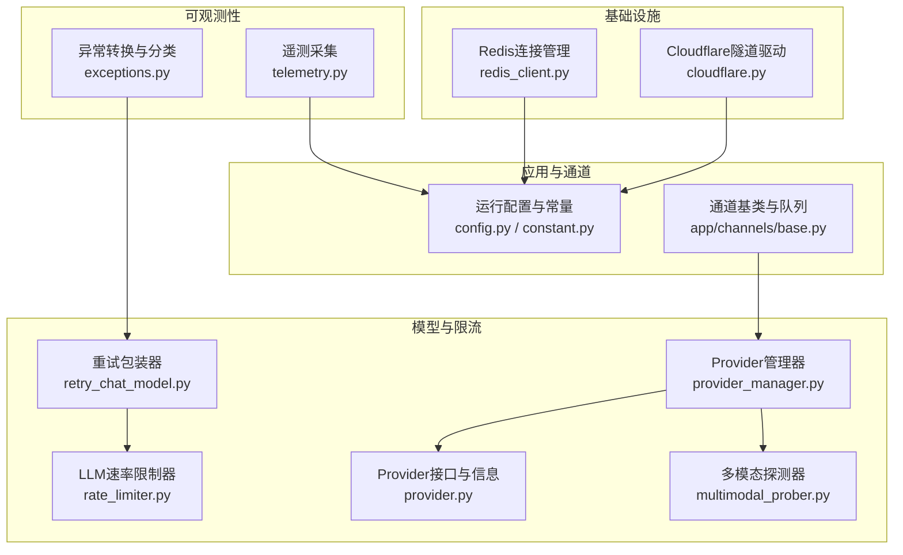

**图表来源**
- [rate_limiter.py:30-279](file://src/copaw/providers/rate_limiter.py#L30-L279)
- [retry_chat_model.py:204-477](file://src/copaw/providers/retry_chat_model.py#L204-L477)
- [multimodal_prober.py:1-102](file://src/copaw/providers/multimodal_prober.py#L1-L102)
- [provider.py:111-314](file://src/copaw/providers/provider.py#L111-L314)
- [provider_manager.py:670-800](file://src/copaw/providers/provider_manager.py#L670-L800)
- [redis_client.py:22-218](file://src/copaw/db/redis_client.py#L22-L218)
- [cloudflare.py:34-198](file://src/copaw/tunnel/cloudflare.py#L34-L198)
- [config.py:49-81](file://src/copaw/config/config.py#L49-L81)
- [base.py:70-800](file://src/copaw/app/channels/base.py#L70-L800)
- [exceptions.py:165-254](file://src/copaw/exceptions.py#L165-L254)
- [telemetry.py:1-311](file://src/copaw/utils/telemetry.py#L1-L311)

**章节来源**
- [rate_limiter.py:1-279](file://src/copaw/providers/rate_limiter.py#L1-L279)
- [retry_chat_model.py:1-477](file://src/copaw/providers/retry_chat_model.py#L1-L477)
- [multimodal_prober.py:1-102](file://src/copaw/providers/multimodal_prober.py#L1-L102)
- [provider.py:1-314](file://src/copaw/providers/provider.py#L1-L314)
- [provider_manager.py:1-800](file://src/copaw/providers/provider_manager.py#L1-L800)
- [redis_client.py:1-218](file://src/copaw/db/redis_client.py#L1-L218)
- [cloudflare.py:1-198](file://src/copaw/tunnel/cloudflare.py#L1-L198)
- [config.py:1-800](file://src/copaw/config/config.py#L1-L800)
- [base.py:1-800](file://src/copaw/app/channels/base.py#L1-L800)
- [exceptions.py:1-254](file://src/copaw/exceptions.py#L1-L254)
- [telemetry.py:1-311](file://src/copaw/utils/telemetry.py#L1-L311)

## 核心组件
- 速率限制与并发控制：基于滑动窗口QPM与信号量的全局限流器，支持429全局暂停与抖动防风暴。
- 重试与超时：透明重试包装器，指数回退、硬超时、流式消费槽位释放策略。
- 多模态探测：统一的探测数据结构与关键词判定，辅助能力开关与降级。
- Provider管理：内置与自定义Provider注册、模型发现、连接检查、生成参数合并。
- 基础设施连接：Redis连接池与健康检查、分布式锁、发布订阅；Cloudflare隧道生命周期与健康检查。
- 通道与队列：统一的消息通道抽象、去抖与合并、任务跟踪与取消。
- 异常与遥测：模型异常分类与转换、安装遥测采集。

**章节来源**
- [rate_limiter.py:30-196](file://src/copaw/providers/rate_limiter.py#L30-L196)
- [retry_chat_model.py:204-477](file://src/copaw/providers/retry_chat_model.py#L204-L477)
- [multimodal_prober.py:75-102](file://src/copaw/providers/multimodal_prober.py#L75-L102)
- [provider.py:111-314](file://src/copaw/providers/provider.py#L111-L314)
- [provider_manager.py:670-800](file://src/copaw/providers/provider_manager.py#L670-L800)
- [redis_client.py:22-218](file://src/copaw/db/redis_client.py#L22-L218)
- [cloudflare.py:34-198](file://src/copaw/tunnel/cloudflare.py#L34-L198)
- [base.py:70-800](file://src/copaw/app/channels/base.py#L70-L800)
- [exceptions.py:165-254](file://src/copaw/exceptions.py#L165-L254)
- [telemetry.py:1-311](file://src/copaw/utils/telemetry.py#L1-L311)

## 架构总览
下图展示从应用侧发起模型调用，经由重试与限流包装，到Provider与多模态探测，再到通道与基础设施的整体流程。

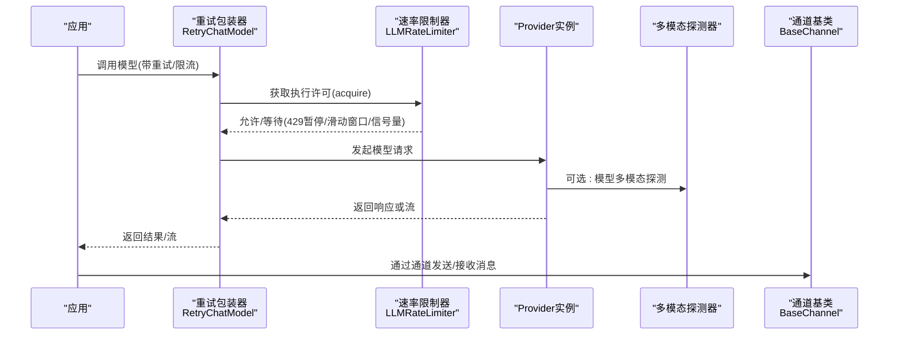

**图表来源**
- [retry_chat_model.py:269-354](file://src/copaw/providers/retry_chat_model.py#L269-L354)
- [rate_limiter.py:70-110](file://src/copaw/providers/rate_limiter.py#L70-L110)
- [provider.py:274-286](file://src/copaw/providers/provider.py#L274-L286)
- [base.py:659-795](file://src/copaw/app/channels/base.py#L659-L795)

## 详细组件分析

### 速率限制与并发控制（LLMRateLimiter）
- 滑动窗口QPM：每分钟最多N次请求，超过则等待最早请求时间点之后的时间。
- 并发信号量：限制同时进行中的调用数量，避免上游限流或过载。
- 全局429暂停：收到429后设置全局暂停时间戳，所有等待者按剩余时间+抖动唤醒，避免“惊群”。
- 统计指标：总获取次数、暂停次数、QPM等待次数、被限流次数、当前飞行数等。
- 配置来源：环境变量与运行时参数，支持动态初始化。

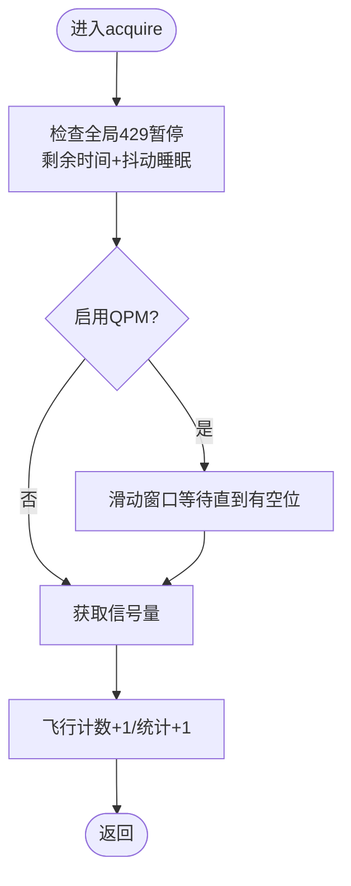

**图表来源**
- [rate_limiter.py:70-145](file://src/copaw/providers/rate_limiter.py#L70-L145)

**章节来源**
- [rate_limiter.py:30-196](file://src/copaw/providers/rate_limiter.py#L30-L196)
- [constant.py:187-249](file://src/copaw/constant.py#L187-L249)

### 重试与超时（RetryChatModel）
- 透明重试：对可重试错误（如429、网络超时、连接异常）进行指数回退重试。
- 流式处理：流开始即释放执行槽位，避免长时间占用导致饥饿。
- 硬超时：每个获取许可的等待设置硬上限，超时抛出特定异常类型。
- 429协调：当发生429时，调用速率限制器记录全局暂停并传播给所有等待者。
- 可重试判定：基于状态码集合与SDK异常类型，支持解析Retry-After头。

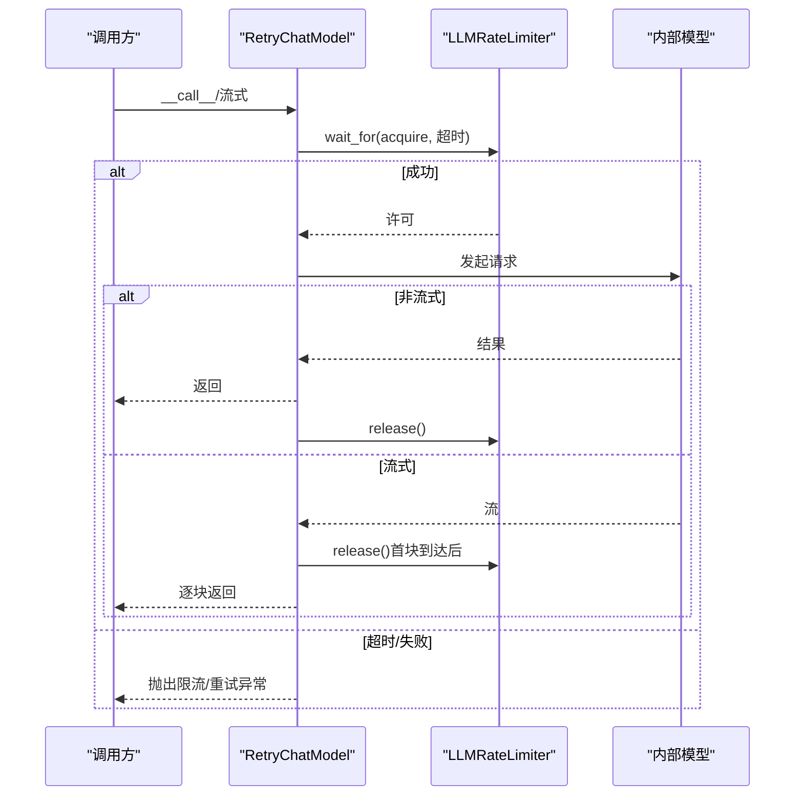

**图表来源**
- [retry_chat_model.py:269-354](file://src/copaw/providers/retry_chat_model.py#L269-L354)
- [retry_chat_model.py:357-477](file://src/copaw/providers/retry_chat_model.py#L357-L477)
- [rate_limiter.py:70-110](file://src/copaw/providers/rate_limiter.py#L70-L110)

**章节来源**
- [retry_chat_model.py:204-477](file://src/copaw/providers/retry_chat_model.py#L204-L477)
- [constant.py:187-249](file://src/copaw/constant.py#L187-L249)

### 多模态探测器（MultimodalProber）
- 探测目标：图像/视频能力识别，避免在不支持的模型上发送多媒体内容。
- 探测数据：内置最小探针（图片/视频），减少误判与浪费。
- 结果结构：统一的探测结果对象，包含是否支持图像/视频及附加信息字段。
- 关键词判定：对异常消息中与媒体相关的关键词进行匹配，辅助快速判断。

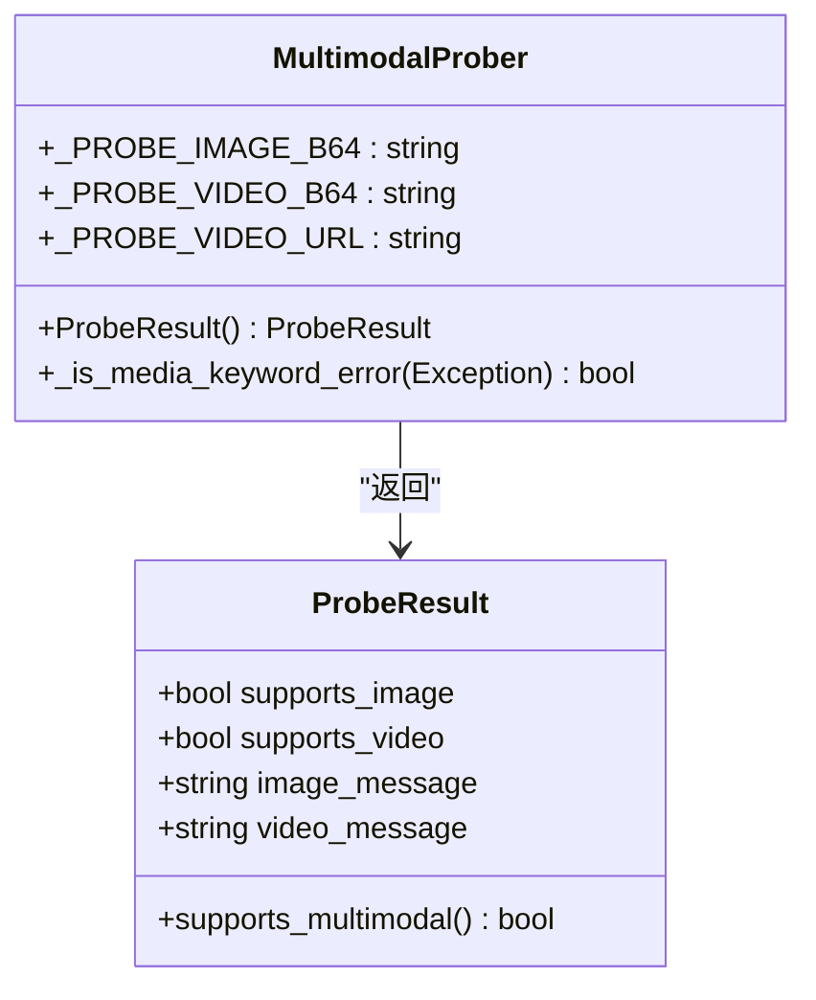

**图表来源**
- [multimodal_prober.py:75-102](file://src/copaw/providers/multimodal_prober.py#L75-L102)

**章节来源**
- [multimodal_prober.py:1-102](file://src/copaw/providers/multimodal_prober.py#L1-L102)
- [provider.py:274-286](file://src/copaw/providers/provider.py#L274-L286)

### Provider管理与模型发现
- Provider接口：统一的连接检查、模型拉取、单模型可用性检查、配置更新、生成参数合并等。
- Provider管理器：内置与插件Provider注册、持久化存储、默认注解应用、异步批量获取信息。
- 模型信息：支持文档标注与实际探测两种来源，便于在未接入探测API时先验配置。

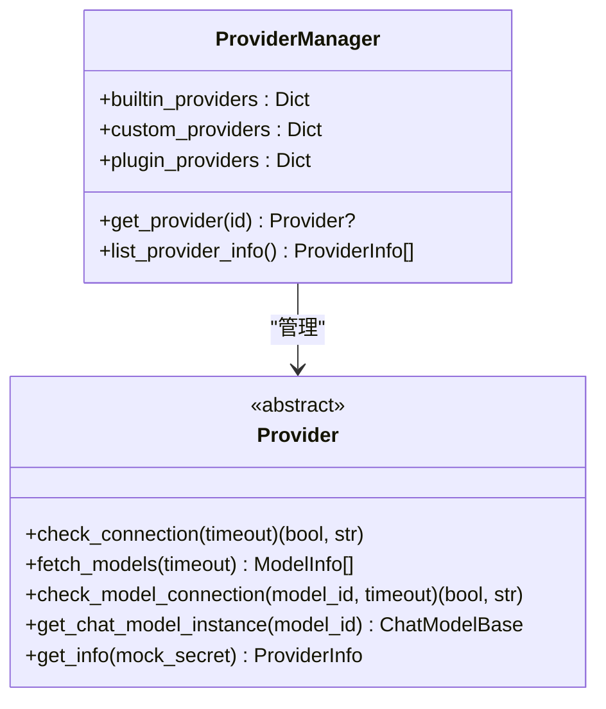

**图表来源**
- [provider.py:111-314](file://src/copaw/providers/provider.py#L111-L314)
- [provider_manager.py:670-800](file://src/copaw/providers/provider_manager.py#L670-L800)

**章节来源**
- [provider.py:1-314](file://src/copaw/providers/provider.py#L1-L314)
- [provider_manager.py:1-800](file://src/copaw/providers/provider_manager.py#L1-L800)

### Redis连接管理与健康检查
- 连接池：统一的连接池创建、最大连接数、密钥前缀、客户端访问。
- 健康检查：ping检测，异常可选择抛出或静默返回。
- 分布式锁：基于SET NX EX的简单分布式锁。
- 缓存与会话：通用的字符串缓存、哈希读写、发布订阅、过期与自增。

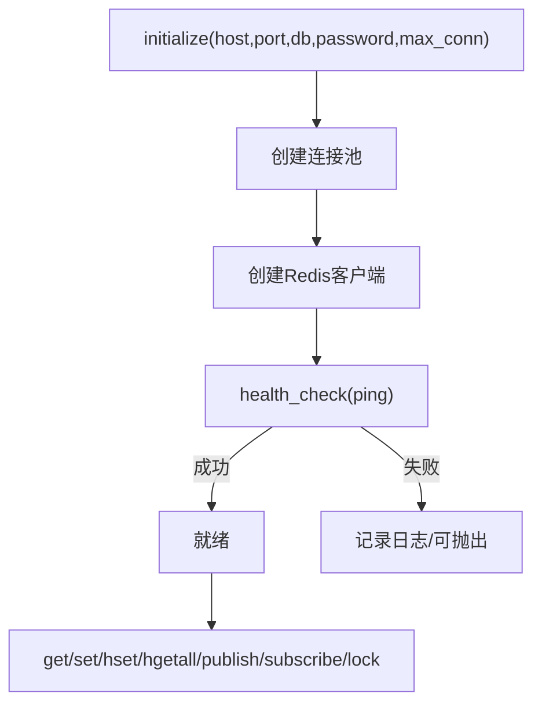

**图表来源**
- [redis_client.py:43-206](file://src/copaw/db/redis_client.py#L43-L206)

**章节来源**
- [redis_client.py:1-218](file://src/copaw/db/redis_client.py#L1-L218)
- [config.py:49-81](file://src/copaw/config/config.py#L49-L81)

### Cloudflare隧道驱动
- 生命周期：启动子进程、解析标准错误输出提取公网URL、监控退出、健康检查。
- 资源回收：终止进程、取消监控任务、清理信息。
- 自动重启：不自动重启，避免新URL导致的连接失效。

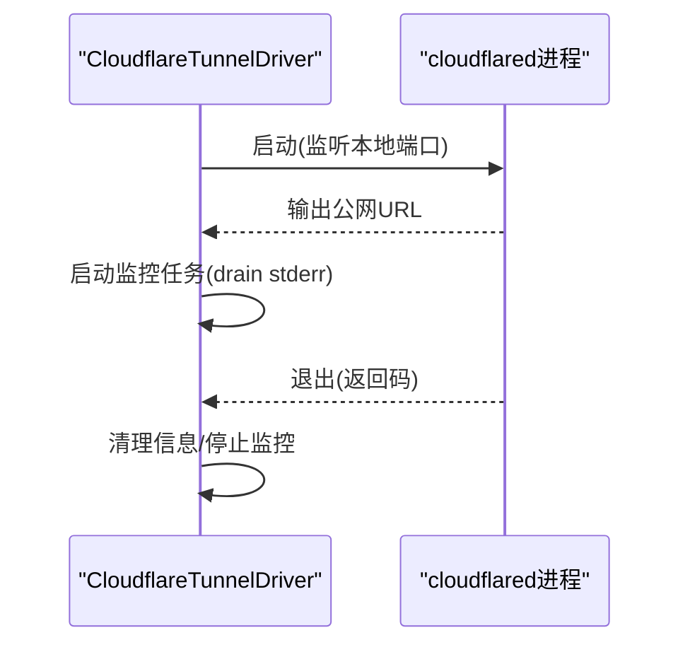

**图表来源**
- [cloudflare.py:52-198](file://src/copaw/tunnel/cloudflare.py#L52-L198)

**章节来源**
- [cloudflare.py:1-198](file://src/copaw/tunnel/cloudflare.py#L1-L198)

### 通道与队列（BaseChannel）
- 统一抽象：通道基类定义消息构建、渲染、去抖与合并、会话键解析、任务跟踪与取消。
- 队列与消费：由管理器负责入队与消费者循环，通道仅关注如何消费。
- 控制命令：区分普通消息与控制命令，后者绕过任务跟踪直发。

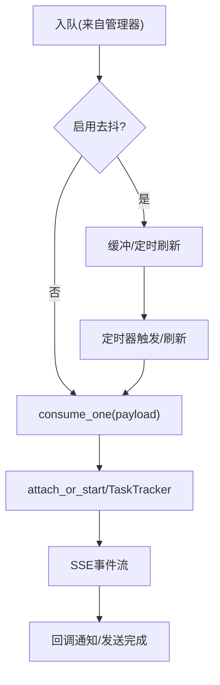

**图表来源**
- [base.py:659-795](file://src/copaw/app/channels/base.py#L659-L795)

**章节来源**
- [base.py:1-800](file://src/copaw/app/channels/base.py#L1-L800)

### 异常转换与遥测
- 异常转换：根据状态码与关键字将底层异常映射为统一的运行时异常类型，便于上层处理。
- 遥测采集：收集安装方式、系统信息、GPU检测、版本信息，上传至遥测服务并打点标记。

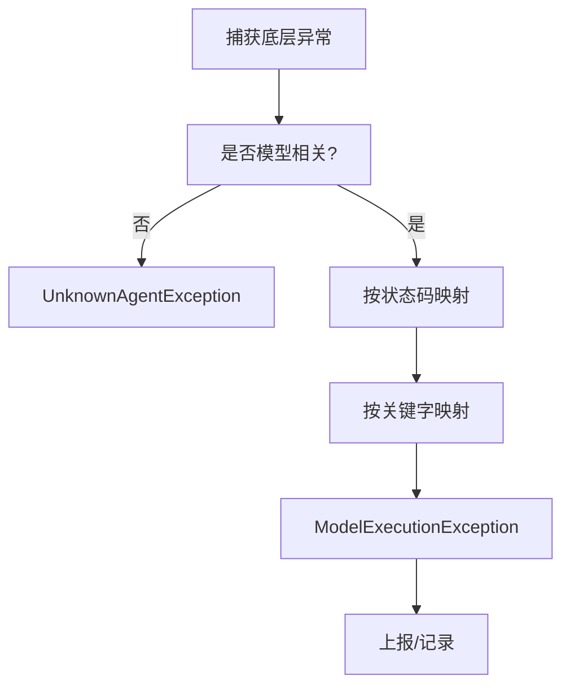

**图表来源**
- [exceptions.py:165-254](file://src/copaw/exceptions.py#L165-L254)

**章节来源**
- [exceptions.py:1-254](file://src/copaw/exceptions.py#L1-L254)
- [telemetry.py:1-311](file://src/copaw/utils/telemetry.py#L1-L311)

## 依赖关系分析
- RetryChatModel 依赖 LLMRateLimiter 提供全局许可与429暂停协调。
- ProviderManager 维护 Provider 实例与模型列表，为通道与模型调用提供统一入口。
- RedisManager 为分布式锁、缓存与会话提供基础设施支撑。
- BaseChannel 通过 ProviderManager 获取模型实例并进行消息处理。
- MultimodalProber 作为 Provider 的能力探测工具，辅助模型选择与降级。

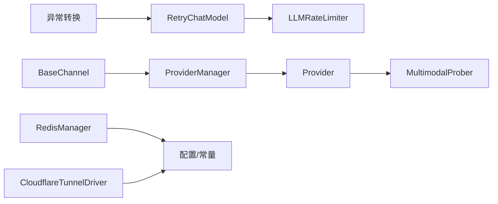

**图表来源**
- [retry_chat_model.py:274-279](file://src/copaw/providers/retry_chat_model.py#L274-L279)
- [rate_limiter.py:211-272](file://src/copaw/providers/rate_limiter.py#L211-L272)
- [provider_manager.py:760-778](file://src/copaw/providers/provider_manager.py#L760-L778)
- [provider.py:274-286](file://src/copaw/providers/provider.py#L274-L286)
- [redis_client.py:22-218](file://src/copaw/db/redis_client.py#L22-L218)
- [cloudflare.py:34-198](file://src/copaw/tunnel/cloudflare.py#L34-L198)
- [base.py:70-800](file://src/copaw/app/channels/base.py#L70-L800)
- [exceptions.py:165-254](file://src/copaw/exceptions.py#L165-L254)

**章节来源**
- [retry_chat_model.py:1-477](file://src/copaw/providers/retry_chat_model.py#L1-L477)
- [rate_limiter.py:1-279](file://src/copaw/providers/rate_limiter.py#L1-L279)
- [provider_manager.py:1-800](file://src/copaw/providers/provider_manager.py#L1-L800)
- [provider.py:1-314](file://src/copaw/providers/provider.py#L1-L314)
- [redis_client.py:1-218](file://src/copaw/db/redis_client.py#L1-L218)
- [cloudflare.py:1-198](file://src/copaw/tunnel/cloudflare.py#L1-L198)
- [base.py:1-800](file://src/copaw/app/channels/base.py#L1-L800)
- [exceptions.py:1-254](file://src/copaw/exceptions.py#L1-L254)

## 性能考量
- 速率限制：合理设置并发与QPM，避免上游429；启用抖动防止同时唤醒。
- 回退策略：指数回退底数与上限需平衡恢复速度与对上游压力。
- 流式释放：流式响应在首块到达后释放槽位，提升吞吐与公平性。
- 连接池：Redis连接池大小与键前缀命名空间需与部署规模匹配。
- 去抖与合并：在通道层减少噪声消息，降低下游压力。
- 遥测与观测：异常分类与遥测采集有助于定位瓶颈与回归。

[本节为通用指导，无需具体文件引用]

## 故障排查指南
- 429风暴与限流：确认全局暂停时间与抖动范围，检查QPM窗口是否过小；必要时提高QPM或降低并发。
- 超时与饥饿：检查acquire超时阈值与回退策略；确保流式场景在首块到达后及时释放槽位。
- Provider不可达：使用Provider的连接检查与模型可用性检查接口；核对API Key、Base URL与网络策略。
- Redis异常：查看健康检查日志与连接池状态；确认密码、端口与数据库索引。
- 隧道问题：确认cloudflared进程健康、URL解析与监控任务；注意退出时不自动重启。
- 通道堆积：检查去抖与合并策略、队列消费循环与任务跟踪；避免重复任务与阻塞。
- 异常分类：利用异常转换逻辑定位Unauthorized/Quota/Timeout/Context等场景，针对性调整配额与上下文长度。

**章节来源**
- [rate_limiter.py:152-196](file://src/copaw/providers/rate_limiter.py#L152-L196)
- [retry_chat_model.py:330-354](file://src/copaw/providers/retry_chat_model.py#L330-L354)
- [provider.py:115-128](file://src/copaw/providers/provider.py#L115-L128)
- [redis_client.py:198-206](file://src/copaw/db/redis_client.py#L198-L206)
- [cloudflare.py:120-198](file://src/copaw/tunnel/cloudflare.py#L120-L198)
- [base.py:659-795](file://src/copaw/app/channels/base.py#L659-L795)
- [exceptions.py:165-254](file://src/copaw/exceptions.py#L165-L254)

## 结论
本系统通过“重试+限流+探测+通道+基础设施”的组合，实现了对模型调用与外部连接的全链路治理。速率限制器与重试包装器协同工作，既保护上游又提升稳定性；Provider与多模态探测器保证能力适配与降级；通道与队列提供一致的消息处理体验；Redis与隧道驱动提供可靠的基础设施支撑。配合异常分类与遥测采集，形成闭环的监控与优化体系。

[本节为总结，无需具体文件引用]

## 附录
- 配置项参考：运行时参数与默认值来源于常量模块与配置模块，包括最大重试次数、回退底数/上限、并发、QPM、暂停与抖动、获取许可超时等。
- 企业配置：数据库与Redis配置项用于企业版功能，需与部署环境保持一致。

**章节来源**
- [constant.py:187-249](file://src/copaw/constant.py#L187-L249)
- [config.py:32-81](file://src/copaw/config/config.py#L32-L81)