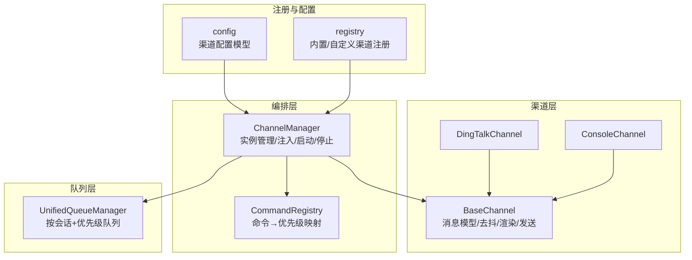
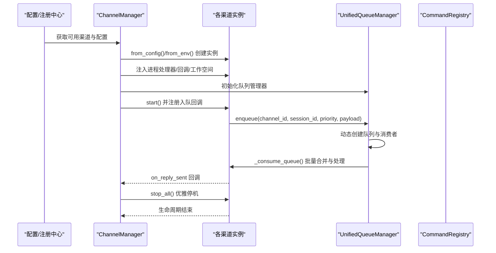
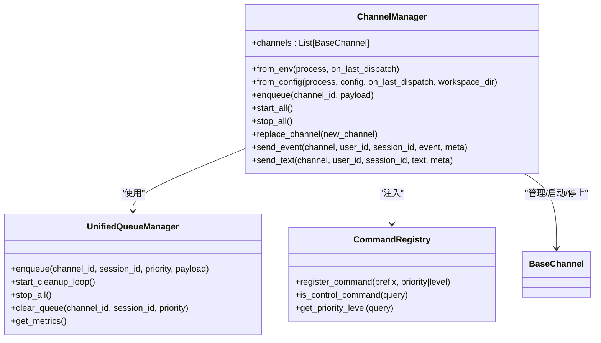
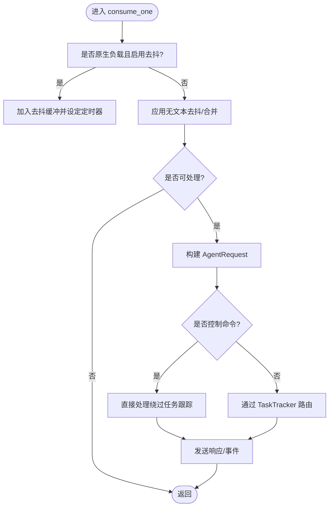
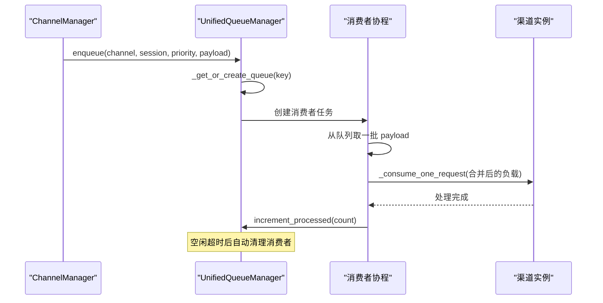
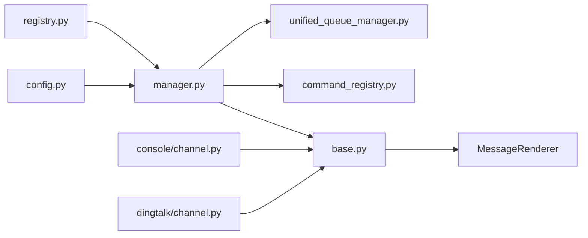

# 渠道生命周期管理

<cite>
**本文引用的文件**
- [manager.py](file://src/copaw/app/channels/manager.py)
- [base.py](file://src/copaw/app/channels/base.py)
- [unified_queue_manager.py](file://src/copaw/app/channels/unified_queue_manager.py)
- [command_registry.py](file://src/copaw/app/channels/command_registry.py)
- [registry.py](file://src/copaw/app/channels/registry.py)
- [schema.py](file://src/copaw/app/channels/schema.py)
- [channel.py（控制台）](file://src/copaw/app/channels/console/channel.py)
- [channel.py（钉钉）](file://src/copaw/app/channels/dingtalk/channel.py)
- [config.py](file://src/copaw/config/config.py)
</cite>

## 目录
1. [简介](#简介)
2. [项目结构](#项目结构)
3. [核心组件](#核心组件)
4. [架构总览](#架构总览)
5. [详细组件分析](#详细组件分析)
6. [依赖分析](#依赖分析)
7. [性能考虑](#性能考虑)
8. [故障排查指南](#故障排查指南)
9. [结论](#结论)
10. [附录](#附录)

## 简介
本技术文档围绕 Copaw 的“渠道生命周期管理”展开，系统阐述从渠道创建、初始化、启动、运行、停止到销毁的完整流程；详解 ChannelManager 对多渠道实例的统一管理能力，包括并发启动、队列化处理、优雅停机与资源清理；解释渠道状态管理、错误恢复与重连策略的设计原理；覆盖配置验证、依赖注入、回调注册等关键流程，并提供生命周期监控、故障诊断与性能优化方法。

## 项目结构
渠道子系统位于应用层 channels 包中，采用“基类 + 多实现 + 统一编排”的分层设计：
- 基类：定义统一的消息模型、渲染器、去抖与合并策略、任务跟踪与发送协议
- 渠道实现：各平台渠道（如 Console、DingTalk 等）继承基类并实现具体接入逻辑
- 编排器：ChannelManager 负责渠道实例的创建、注入、启动、停止与队列编排
- 队列管理：UnifiedQueueManager 提供按会话与优先级隔离的动态队列与消费者
- 注册中心：registry 汇总内置与自定义渠道类型，支持按可用性筛选与缓存
- 命令路由：CommandRegistry 将用户查询映射到优先级，驱动队列调度

图示来源
- [manager.py:68-106](file://src/copaw/app/channels/manager.py#L68-L106)
- [base.py:70-127](file://src/copaw/app/channels/base.py#L70-L127)
- [unified_queue_manager.py:60-117](file://src/copaw/app/channels/unified_queue_manager.py#L60-L117)
- [registry.py:190-195](file://src/copaw/app/channels/registry.py#L190-L195)
- [config.py:261-281](file://src/copaw/config/config.py#L261-L281)

章节来源
- [manager.py:68-106](file://src/copaw/app/channels/manager.py#L68-L106)
- [base.py:70-127](file://src/copaw/app/channels/base.py#L70-L127)
- [unified_queue_manager.py:60-117](file://src/copaw/app/channels/unified_queue_manager.py#L60-L117)
- [registry.py:190-195](file://src/copaw/app/channels/registry.py#L190-L195)
- [config.py:261-281](file://src/copaw/config/config.py#L261-L281)

## 核心组件
- ChannelManager：持有渠道列表，负责统一注入进程处理器、设置工作空间、启动/停止所有渠道、替换单个渠道、发送事件与文本、以及基于 UnifiedQueueManager 的入队与消费编排
- BaseChannel：抽象出渠道通用能力：消息去抖与合并、请求构建、内容渲染、权限策略、任务跟踪、发送协议、生命周期钩子
- UnifiedQueueManager：以三元组键（渠道标识、会话标识、优先级）为维度的动态队列与消费者管理，支持自动清理空闲队列、统计指标与受控入队
- CommandRegistry：命令前缀到优先级的映射表，支持默认控制命令与扩展优先级级别
- 渠道实现：ConsoleChannel/DingTalkChannel 等在各自平台特性上实现接入细节（如 DingTalk 的会话 Webhook 存储、去重、流式回复）
- 注册中心与配置：registry 汇总内置与自定义渠道类型；config 定义各渠道配置模型与默认值

章节来源
- [manager.py:68-106](file://src/copaw/app/channels/manager.py#L68-L106)
- [base.py:70-127](file://src/copaw/app/channels/base.py#L70-L127)
- [unified_queue_manager.py:60-117](file://src/copaw/app/channels/unified_queue_manager.py#L60-L117)
- [command_registry.py:23-62](file://src/copaw/app/channels/command_registry.py#L23-L62)
- [registry.py:190-195](file://src/copaw/app/channels/registry.py#L190-L195)
- [config.py:92-281](file://src/copaw/config/config.py#L92-L281)

## 架构总览
下图展示渠道生命周期管理的整体交互：配置解析与注册 → 实例化 → 注入依赖 → 启动与队列编排 → 运行期入队与消费 → 停止与资源回收。

图示来源
- [manager.py:86-106](file://src/copaw/app/channels/manager.py#L86-L106)
- [manager.py:110-213](file://src/copaw/app/channels/manager.py#L110-L213)
- [manager.py:447-525](file://src/copaw/app/channels/manager.py#L447-L525)
- [unified_queue_manager.py:119-164](file://src/copaw/app/channels/unified_queue_manager.py#L119-L164)
- [unified_queue_manager.py:214-273](file://src/copaw/app/channels/unified_queue_manager.py#L214-L273)
- [command_registry.py:175-218](file://src/copaw/app/channels/command_registry.py#L175-L218)

## 详细组件分析

### ChannelManager：多渠道统一编排
- 实例化与注入
  - 支持从环境变量与配置两种方式创建渠道实例，按可用性过滤
  - 将进程处理器、回调注入到每个渠道实例
- 队列与消费
  - 使用 UnifiedQueueManager 作为统一队列后端，按（渠道标识、会话标识、优先级）建队列
  - 入队时提取查询文本进行优先级分类，记录会话标识用于同会话串行化
  - 消费器内部对同队列批量拉取并合并，保证吞吐与一致性
- 并发启动与优雅停机
  - 启动阶段：初始化队列管理器、启动清理循环、为每个渠道设置入队回调、逐个异步启动
  - 停止阶段：取消待处理入队任务、停止队列管理器、解除入队回调、逆序逐个停止渠道
- 替换与运维
  - 支持热替换单个渠道实例，先预启动新实例再交换并停止旧实例
  - 提供清空指定队列、发送事件与文本等运维接口

图示来源
- [manager.py:68-106](file://src/copaw/app/channels/manager.py#L68-L106)
- [manager.py:447-525](file://src/copaw/app/channels/manager.py#L447-L525)
- [unified_queue_manager.py:60-117](file://src/copaw/app/channels/unified_queue_manager.py#L60-L117)
- [command_registry.py:23-62](file://src/copaw/app/channels/command_registry.py#L23-L62)

章节来源
- [manager.py:68-106](file://src/copaw/app/channels/manager.py#L68-L106)
- [manager.py:110-213](file://src/copaw/app/channels/manager.py#L110-L213)
- [manager.py:349-361](file://src/copaw/app/channels/manager.py#L349-L361)
- [manager.py:447-525](file://src/copaw/app/channels/manager.py#L447-L525)
- [manager.py:571-630](file://src/copaw/app/channels/manager.py#L571-L630)

### BaseChannel：渠道通用能力与生命周期钩子
- 消息模型与渲染
  - 统一使用运行时内容类型（文本/图片/音频/视频/文件/拒绝），通过渲染器输出
  - 支持工具详情显示、中间态消息过滤、思考内容过滤等渲染策略
- 去抖与合并
  - 对原生负载按会话键进行时间去抖，避免无文本输入导致的空消息风暴
  - 支持原生负载与 AgentRequest 的合并策略，提升批处理效率
- 权限与会话
  - 支持私聊/群聊白名单策略、@提及要求等
  - 会话键解析统一由 resolve_session_id 提供，确保跨渠道一致性
- 任务跟踪与发送
  - 通过 TaskTracker 与工作空间集成，支持任务取消与幂等
  - 发送路径支持多种内容部件与元数据合并，保证下游一致性

图示来源
- [base.py:659-758](file://src/copaw/app/channels/base.py#L659-L758)
- [base.py:759-800](file://src/copaw/app/channels/base.py#L759-L800)
- [base.py:374-430](file://src/copaw/app/channels/base.py#L374-L430)
- [base.py:431-536](file://src/copaw/app/channels/base.py#L431-L536)

章节来源
- [base.py:70-127](file://src/copaw/app/channels/base.py#L70-L127)
- [base.py:128-177](file://src/copaw/app/channels/base.py#L128-L177)
- [base.py:178-209](file://src/copaw/app/channels/base.py#L178-L209)
- [base.py:283-318](file://src/copaw/app/channels/base.py#L283-L318)
- [base.py:374-536](file://src/copaw/app/channels/base.py#L374-L536)

### UnifiedQueueManager：动态队列与消费者
- 键模型与隔离
  - 键：(channel_id, session_id, priority_level)，严格保证同一键内串行化，不同键并发执行
- 动态创建与清理
  - 首次入队时创建队列与消费者任务，空闲超时自动清理消费者
  - 提供受控入队（带超时）、清空队列、统计指标等运维能力
- 性能与可观测性
  - 记录每队列处理计数、年龄与空闲时长，便于监控与容量规划

图示来源
- [unified_queue_manager.py:119-164](file://src/copaw/app/channels/unified_queue_manager.py#L119-L164)
- [unified_queue_manager.py:165-213](file://src/copaw/app/channels/unified_queue_manager.py#L165-L213)
- [unified_queue_manager.py:214-273](file://src/copaw/app/channels/unified_queue_manager.py#L214-L273)
- [unified_queue_manager.py:376-428](file://src/copaw/app/channels/unified_queue_manager.py#L376-L428)

章节来源
- [unified_queue_manager.py:60-117](file://src/copaw/app/channels/unified_queue_manager.py#L60-L117)
- [unified_queue_manager.py:119-164](file://src/copaw/app/channels/unified_queue_manager.py#L119-L164)
- [unified_queue_manager.py:274-328](file://src/copaw/app/channels/unified_queue_manager.py#L274-L328)
- [unified_queue_manager.py:329-375](file://src/copaw/app/channels/unified_queue_manager.py#L329-L375)
- [unified_queue_manager.py:430-498](file://src/copaw/app/channels/unified_queue_manager.py#L430-L498)

### CommandRegistry：命令优先级与控制通道
- 默认控制命令集（如 /stop、/daemon 系列）映射到高优先级
- 查询匹配采用最长前缀匹配，支持空格/制表符结尾断词
- 可扩展优先级级别，便于插入中间优先级

章节来源
- [command_registry.py:23-62](file://src/copaw/app/channels/command_registry.py#L23-L62)
- [command_registry.py:136-174](file://src/copaw/app/channels/command_registry.py#L136-L174)
- [command_registry.py:175-218](file://src/copaw/app/channels/command_registry.py#L175-L218)

### 渠道实现示例：ConsoleChannel 与 DingTalkChannel
- ConsoleChannel
  - 仅输出到终端，支持媒体文件本地化与推送前端存储
  - 生命周期：启动即就绪，停止为空操作
- DingTalkChannel
  - 会话 Webhook 存储与持久化，支持主动推送与 Open API 回退
  - 去重与流式 ACK、批量回复、卡片状态管理等复杂逻辑
  - 生命周期：启动建立连接/线程，停止释放资源与锁

章节来源
- [channel.py（控制台）:562-572](file://src/copaw/app/channels/console/channel.py#L562-L572)
- [channel.py（钉钉）:113-200](file://src/copaw/app/channels/dingtalk/channel.py#L113-L200)
- [channel.py（钉钉）:279-290](file://src/copaw/app/channels/dingtalk/channel.py#L279-L290)
- [channel.py（钉钉）:320-351](file://src/copaw/app/channels/dingtalk/channel.py#L320-L351)
- [channel.py（钉钉）:405-423](file://src/copaw/app/channels/dingtalk/channel.py#L405-L423)

### 注册中心与配置验证
- 注册中心
  - 内置渠道缓存加载，失败不影响其他渠道；自定义渠道从目录动态发现
  - 支持自定义渠道挂载 API 路由（需以 /api/ 开头）
- 配置模型
  - ChannelConfig 定义各内置渠道的配置项与默认值
  - BaseChannelConfig 提供通用字段（启用、前缀、过滤策略、权限策略等）

章节来源
- [registry.py:45-78](file://src/copaw/app/channels/registry.py#L45-L78)
- [registry.py:97-129](file://src/copaw/app/channels/registry.py#L97-L129)
- [registry.py:190-195](file://src/copaw/app/channels/registry.py#L190-L195)
- [config.py:92-104](file://src/copaw/config/config.py#L92-L104)
- [config.py:261-281](file://src/copaw/config/config.py#L261-L281)

## 依赖分析
- 组件耦合
  - ChannelManager 依赖 UnifiedQueueManager 与 CommandRegistry，同时向各渠道注入进程处理器与工作空间
  - BaseChannel 依赖渲染器与消息模型，向上游提供统一的消费与发送接口
- 外部依赖
  - 渠道实现可能依赖第三方 SDK（如 DingTalk）、HTTP 客户端等
- 循环依赖
  - 未见循环导入；注册中心通过延迟导入与缓存避免循环

图示来源
- [registry.py:190-195](file://src/copaw/app/channels/registry.py#L190-L195)
- [manager.py:68-106](file://src/copaw/app/channels/manager.py#L68-L106)
- [unified_queue_manager.py:60-117](file://src/copaw/app/channels/unified_queue_manager.py#L60-L117)
- [command_registry.py:23-62](file://src/copaw/app/channels/command_registry.py#L23-L62)
- [base.py:36-46](file://src/copaw/app/channels/base.py#L36-L46)
- [channel.py（控制台）:32-44](file://src/copaw/app/channels/console/channel.py#L32-L44)
- [channel.py（钉钉）:49-56](file://src/copaw/app/channels/dingtalk/channel.py#L49-L56)

章节来源
- [registry.py:190-195](file://src/copaw/app/channels/registry.py#L190-L195)
- [manager.py:68-106](file://src/copaw/app/channels/manager.py#L68-L106)
- [base.py:36-46](file://src/copaw/app/channels/base.py#L36-L46)

## 性能考虑
- 队列隔离与并发
  - 通过（渠道、会话、优先级）三元键隔离，避免跨会话/跨优先级阻塞
  - 同一键内批处理合并，减少上下文切换与 IO 次数
- 资源回收
  - 空闲队列自动清理，防止内存泄漏与僵尸消费者
  - 优雅停机时等待消费者退出，避免丢弃未处理消息
- 超时与背压
  - 入队与消费者内部均设置超时，防止无限阻塞
- 渲染与过滤
  - 工具详情与思考内容的可选过滤降低输出体积，提升前端渲染性能

## 故障排查指南
- 启动失败
  - 检查渠道配置是否启用、密钥/令牌是否正确
  - 查看注册中心日志，确认内置渠道加载是否成功
- 消息堆积
  - 使用队列指标查看总队列数、各队列 qsize 与空闲时长
  - 检查是否存在长时间空闲队列（可能为异常会话或上游未清理）
- 重复消息/去重问题
  - DingTalk 去重基于消息 ID，检查消息 ID 是否正确传递与释放
- 主动推送失败
  - 检查会话 Webhook 是否过期，必要时回退至 Open API
- 优雅停机卡住
  - 关注待处理入队任务数量与消费者退出情况，确认超时参数合理

章节来源
- [unified_queue_manager.py:430-498](file://src/copaw/app/channels/unified_queue_manager.py#L430-L498)
- [channel.py（钉钉）:563-597](file://src/copaw/app/channels/dingtalk/channel.py#L563-L597)
- [channel.py（钉钉）:424-485](file://src/copaw/app/channels/dingtalk/channel.py#L424-L485)

## 结论
Copaw 的渠道生命周期管理以 ChannelManager 为核心，结合 UnifiedQueueManager 的动态队列与 CommandRegistry 的优先级路由，实现了多渠道的统一编排与高效运行。通过严格的会话隔离、批处理合并、空闲清理与优雅停机机制，系统在保证一致性的同时具备良好的扩展性与稳定性。配合完善的配置模型与注册中心，开发者可以快速接入新渠道并进行运维监控与故障定位。

## 附录
- 渠道类型枚举与路由协议
  - 内置渠道类型集合与统一地址协议定义于 schema 中，便于跨渠道路由与转换

章节来源
- [schema.py:30-50](file://src/copaw/app/channels/schema.py#L30-L50)