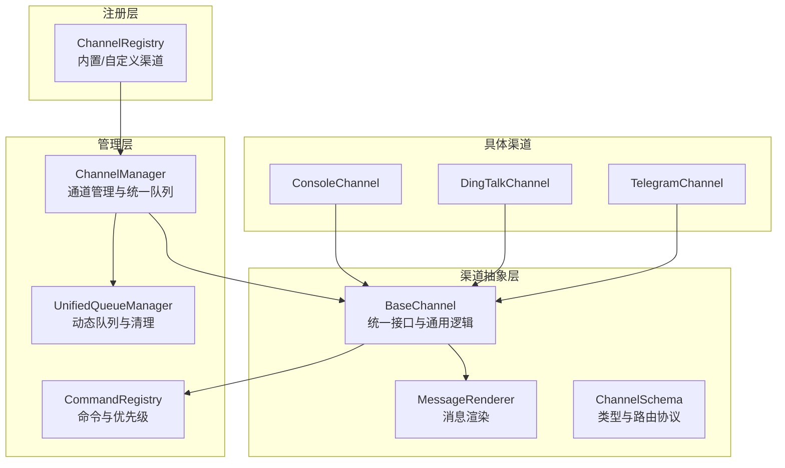
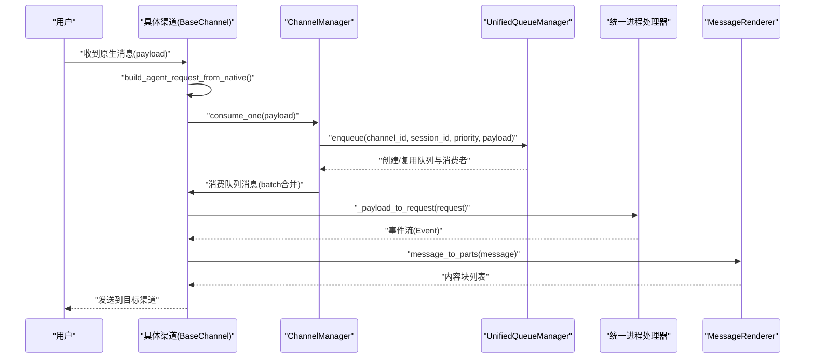
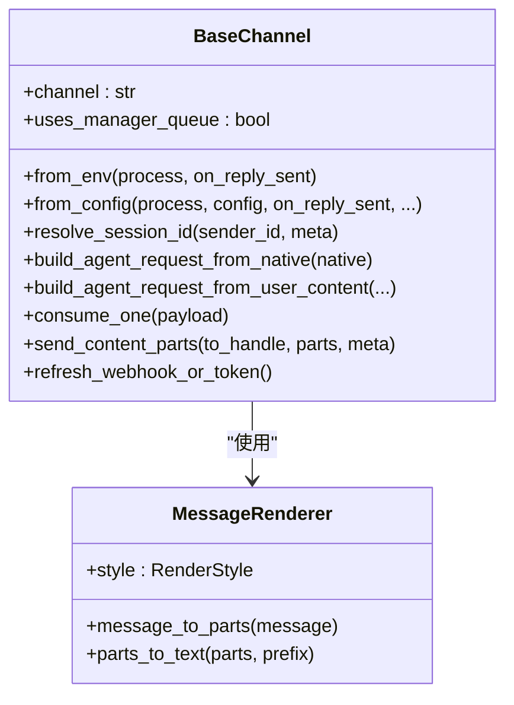
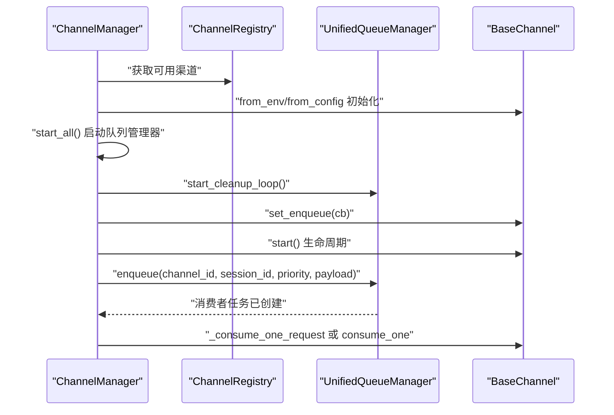
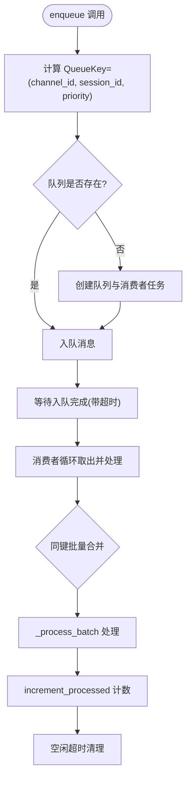
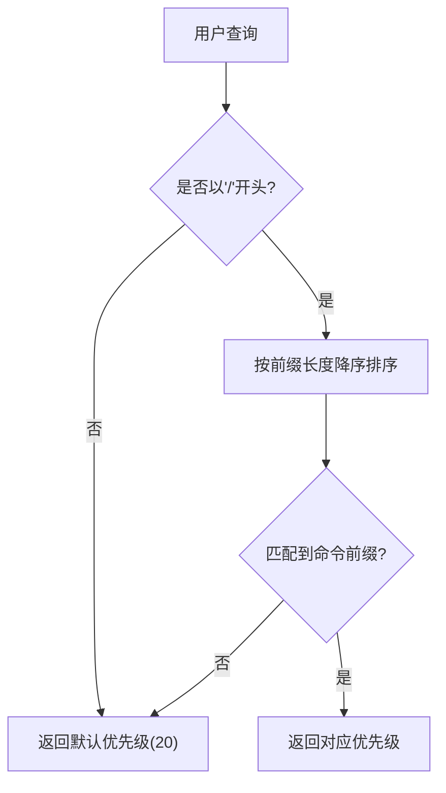
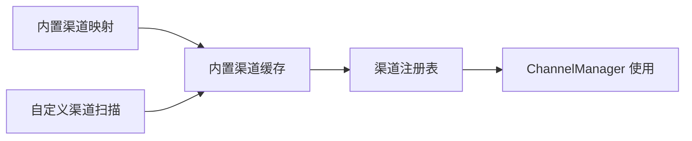
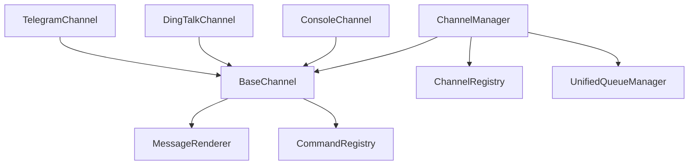

# 渠道管理系统

<cite>
**本文档引用的文件**
- [src/copaw/app/channels/base.py](file://src/copaw/app/channels/base.py)
- [src/copaw/app/channels/manager.py](file://src/copaw/app/channels/manager.py)
- [src/copaw/app/channels/registry.py](file://src/copaw/app/channels/registry.py)
- [src/copaw/app/channels/schema.py](file://src/copaw/app/channels/schema.py)
- [src/copaw/app/channels/unified_queue_manager.py](file://src/copaw/app/channels/unified_queue_manager.py)
- [src/copaw/app/channels/command_registry.py](file://src/copaw/app/channels/command_registry.py)
- [src/copaw/app/channels/renderer.py](file://src/copaw/app/channels/renderer.py)
- [src/copaw/app/channels/utils.py](file://src/copaw/app/channels/utils.py)
- [src/copaw/config/config.py](file://src/copaw/config/config.py)
- [src/copaw/app/channels/console/channel.py](file://src/copaw/app/channels/console/channel.py)
- [src/copaw/app/channels/dingtalk/channel.py](file://src/copaw/app/channels/dingtalk/channel.py)
- [src/copaw/app/channels/telegram/channel.py](file://src/copaw/app/channels/telegram/channel.py)
- [src/copaw/app/channels/qrcode_auth_handler.py](file://src/copaw/app/channels/qrcode_auth_handler.py)
</cite>

## 目录
1. [简介](#简介)
2. [项目结构](#项目结构)
3. [核心组件](#核心组件)
4. [架构总览](#架构总览)
5. [详细组件分析](#详细组件分析)
6. [依赖关系分析](#依赖关系分析)
7. [性能考虑](#性能考虑)
8. [故障排除指南](#故障排除指南)
9. [结论](#结论)
10. [附录](#附录)

## 简介
本文件为渠道管理系统的架构文档，面向多渠道集成场景，涵盖渠道抽象层、消息路由、状态管理与错误恢复策略。文档重点阐述：
- 渠道注册机制与适配器设计
- 消息转换与双向通信处理流程
- 连接管理与会话隔离
- 新渠道开发指南、配置管理与性能监控
- 故障排除与最佳实践

## 项目结构
渠道管理子系统位于 `src/copaw/app/channels/` 目录下，采用“抽象基类 + 具体适配器 + 统一队列管理 + 路由与命令优先级”的分层架构。核心模块包括：
- 抽象层：BaseChannel 定义统一接口与通用逻辑（消息合并、去抖、渲染、任务跟踪）
- 管理层：ChannelManager 负责通道生命周期、统一队列与消费者调度
- 注册层：registry 提供内置与自定义渠道发现与加载
- 队列层：UnifiedQueueManager 实现按会话与优先级的动态队列与清理
- 命令层：CommandRegistry 支持控制命令识别与优先级分配
- 渲染层：MessageRenderer 将运行时消息转换为可发送内容块
- 工具层：通用工具函数（文本拆分、文件URL解析等）

**图表来源**
- [src/copaw/app/channels/base.py:70-127](file://src/copaw/app/channels/base.py#L70-L127)
- [src/copaw/app/channels/manager.py:68-106](file://src/copaw/app/channels/manager.py#L68-L106)
- [src/copaw/app/channels/unified_queue_manager.py:60-117](file://src/copaw/app/channels/unified_queue_manager.py#L60-L117)
- [src/copaw/app/channels/command_registry.py:23-62](file://src/copaw/app/channels/command_registry.py#L23-L62)
- [src/copaw/app/channels/registry.py:190-195](file://src/copaw/app/channels/registry.py#L190-L195)
- [src/copaw/app/channels/console/channel.py:63-103](file://src/copaw/app/channels/console/channel.py#L63-L103)
- [src/copaw/app/channels/dingtalk/channel.py:89-136](file://src/copaw/app/channels/dingtalk/channel.py#L89-L136)
- [src/copaw/app/channels/telegram/channel.py:1-68](file://src/copaw/app/channels/telegram/channel.py#L1-L68)

**章节来源**
- [src/copaw/app/channels/base.py:70-127](file://src/copaw/app/channels/base.py#L70-L127)
- [src/copaw/app/channels/manager.py:68-106](file://src/copaw/app/channels/manager.py#L68-L106)
- [src/copaw/app/channels/registry.py:190-195](file://src/copaw/app/channels/registry.py#L190-L195)
- [src/copaw/app/channels/unified_queue_manager.py:60-117](file://src/copaw/app/channels/unified_queue_manager.py#L60-L117)
- [src/copaw/app/channels/command_registry.py:23-62](file://src/copaw/app/channels/command_registry.py#L23-L62)
- [src/copaw/app/channels/renderer.py:78-86](file://src/copaw/app/channels/renderer.py#L78-L86)
- [src/copaw/app/channels/schema.py:12-48](file://src/copaw/app/channels/schema.py#L12-L48)

## 核心组件
- BaseChannel：定义渠道通用能力（消息构建、去抖、渲染、任务跟踪、会话解析、发送接口等），并提供从环境或配置初始化的工厂方法占位。
- ChannelManager：负责通道实例化、注入统一进程处理器、设置工作区、启动/停止通道、统一入队与消费、发送事件/文本。
- UnifiedQueueManager：基于三元键（channel_id, session_id, priority）的动态队列系统，支持并发会话与优先级隔离、自动清理空闲队列。
- CommandRegistry：集中式命令注册与优先级映射，支持控制命令快速识别与分级处理。
- MessageRenderer：将运行时消息转换为可发送的内容块，支持过滤工具消息、思考内容与媒体回退文本。
- ChannelRegistry：内置渠道与自定义渠道的发现与缓存，支持自定义渠道HTTP路由注册。

**章节来源**
- [src/copaw/app/channels/base.py:70-127](file://src/copaw/app/channels/base.py#L70-L127)
- [src/copaw/app/channels/manager.py:68-106](file://src/copaw/app/channels/manager.py#L68-L106)
- [src/copaw/app/channels/unified_queue_manager.py:60-117](file://src/copaw/app/channels/unified_queue_manager.py#L60-L117)
- [src/copaw/app/channels/command_registry.py:23-62](file://src/copaw/app/channels/command_registry.py#L23-L62)
- [src/copaw/app/channels/renderer.py:78-86](file://src/copaw/app/channels/renderer.py#L78-L86)
- [src/copaw/app/channels/registry.py:190-195](file://src/copaw/app/channels/registry.py#L190-L195)

## 架构总览
渠道管理采用“抽象 + 管理 + 队列 + 命令 + 渲染”的分层设计，通过统一队列实现跨渠道的消息有序处理与并发隔离。消息流经渠道适配器转换为运行时请求，交由统一进程处理器生成事件流，再由渲染器转换为各渠道可发送的内容块。

**图表来源**
- [src/copaw/app/channels/base.py:604-631](file://src/copaw/app/channels/base.py#L604-L631)
- [src/copaw/app/channels/manager.py:39-66](file://src/copaw/app/channels/manager.py#L39-L66)
- [src/copaw/app/channels/unified_queue_manager.py:119-164](file://src/copaw/app/channels/unified_queue_manager.py#L119-L164)
- [src/copaw/app/channels/renderer.py:87-103](file://src/copaw/app/channels/renderer.py#L87-L103)

## 详细组件分析

### 渠道抽象层（BaseChannel）
- 职责：定义统一的渠道接口，包括消息构建、去抖合并、会话解析、渲染与发送、任务跟踪、错误处理回调等。
- 关键特性：
  - 去抖与时间合并：对无文本内容进行缓冲，待出现文本后合并发送；支持音频直发（语音输入）。
  - 会话隔离：通过 session_id 与渠道元信息解析会话键，确保同一会话串行处理。
  - 控制命令检测：结合 CommandRegistry 识别紧急/高优命令，绕过队列直接处理。
  - 渲染与发送：使用 MessageRenderer 将运行时消息转换为渠道可发送的内容块。
  - 工作区集成：注入 Workspace 以启用 TaskTracker 与聊天管理。

**图表来源**
- [src/copaw/app/channels/base.py:70-127](file://src/copaw/app/channels/base.py#L70-L127)
- [src/copaw/app/channels/renderer.py:78-86](file://src/copaw/app/channels/renderer.py#L78-L86)

**章节来源**
- [src/copaw/app/channels/base.py:250-282](file://src/copaw/app/channels/base.py#L250-L282)
- [src/copaw/app/channels/base.py:557-567](file://src/copaw/app/channels/base.py#L557-L567)
- [src/copaw/app/channels/base.py:604-631](file://src/copaw/app/channels/base.py#L604-L631)
- [src/copaw/app/channels/base.py:659-695](file://src/copaw/app/channels/base.py#L659-L695)
- [src/copaw/app/channels/base.py:759-800](file://src/copaw/app/channels/base.py#L759-L800)

### 渠道管理器（ChannelManager）
- 职责：统一创建/启动/停止渠道；注入统一进程处理器；设置工作区；提供发送事件/文本接口；管理统一队列与消费者。
- 关键流程：
  - from_env/from_config：根据可用渠道与配置创建通道实例。
  - start_all：初始化 UnifiedQueueManager，启动清理循环，为每个通道设置入队回调并启动。
  - enqueue：线程安全地将消息入队，提取查询文本用于优先级分类，计算 session_id 并入队。
  - _consume_queue：消费者循环，批量合并同键队列消息，调用通道的 _consume_one_request 或 consume_one。
  - send_text/send_event：将文本或事件转换为内容块并发送。

**图表来源**
- [src/copaw/app/channels/manager.py:87-106](file://src/copaw/app/channels/manager.py#L87-L106)
- [src/copaw/app/channels/manager.py:447-478](file://src/copaw/app/channels/manager.py#L447-L478)
- [src/copaw/app/channels/manager.py:349-361](file://src/copaw/app/channels/manager.py#L349-L361)
- [src/copaw/app/channels/manager.py:362-446](file://src/copaw/app/channels/manager.py#L362-L446)

**章节来源**
- [src/copaw/app/channels/manager.py:68-106](file://src/copaw/app/channels/manager.py#L68-L106)
- [src/copaw/app/channels/manager.py:215-301](file://src/copaw/app/channels/manager.py#L215-L301)
- [src/copaw/app/channels/manager.py:362-446](file://src/copaw/app/channels/manager.py#L362-L446)
- [src/copaw/app/channels/manager.py:630-711](file://src/copaw/app/channels/manager.py#L630-L711)

### 统一队列管理（UnifiedQueueManager）
- 职责：基于 (channel_id, session_id, priority) 的三元键动态创建队列与消费者，保证相同键严格串行，不同键并发执行。
- 特性：
  - 动态创建：首次入队时创建队列与消费者任务。
  - 自动清理：空闲超时后取消消费者并移除队列。
  - 计数统计：记录每队列处理数量，便于监控。
  - 线程安全：使用锁保护队列字典访问。

**图表来源**
- [src/copaw/app/channels/unified_queue_manager.py:119-164](file://src/copaw/app/channels/unified_queue_manager.py#L119-L164)
- [src/copaw/app/channels/unified_queue_manager.py:165-212](file://src/copaw/app/channels/unified_queue_manager.py#L165-L212)
- [src/copaw/app/channels/unified_queue_manager.py:274-428](file://src/copaw/app/channels/unified_queue_manager.py#L274-L428)
- [src/copaw/app/channels/manager.py:39-66](file://src/copaw/app/channels/manager.py#L39-L66)

**章节来源**
- [src/copaw/app/channels/unified_queue_manager.py:60-117](file://src/copaw/app/channels/unified_queue_manager.py#L60-L117)
- [src/copaw/app/channels/unified_queue_manager.py:274-428](file://src/copaw/app/channels/unified_queue_manager.py#L274-L428)
- [src/copaw/app/channels/unified_queue_manager.py:430-498](file://src/copaw/app/channels/unified_queue_manager.py#L430-L498)

### 命令注册与优先级（CommandRegistry）
- 职责：集中注册命令前缀与其优先级，支持快速判断是否为控制命令并返回优先级等级。
- 默认优先级：
  - critical: 0（如 /stop）
  - high: 10（如 /daemon status/restart 等）
  - normal: 20（默认）
  - low: 30（预留）
- 查询匹配：按前缀长度降序匹配，确保最长前缀优先。

**图表来源**
- [src/copaw/app/channels/command_registry.py:175-218](file://src/copaw/app/channels/command_registry.py#L175-L218)

**章节来源**
- [src/copaw/app/channels/command_registry.py:23-62](file://src/copaw/app/channels/command_registry.py#L23-L62)
- [src/copaw/app/channels/command_registry.py:136-218](file://src/copaw/app/channels/command_registry.py#L136-L218)

### 渠道注册与发现（ChannelRegistry）
- 职责：内置渠道与自定义渠道的发现与缓存；支持自定义渠道在应用启动时注册额外HTTP路由。
- 内置渠道键集合：imessage、discord、dingtalk、feishu、qq、telegram、mattermost、mqtt、console、matrix、voice、wecom、xiaoyi、weixin、onebot。
- 自定义渠道：扫描 CUSTOM_CHANNELS_DIR 下的Python模块或包，查找继承自 BaseChannel 的类并注册。

**图表来源**
- [src/copaw/app/channels/registry.py:45-78](file://src/copaw/app/channels/registry.py#L45-L78)
- [src/copaw/app/channels/registry.py:97-129](file://src/copaw/app/channels/registry.py#L97-L129)
- [src/copaw/app/channels/registry.py:190-195](file://src/copaw/app/channels/registry.py#L190-L195)

**章节来源**
- [src/copaw/app/channels/registry.py:190-195](file://src/copaw/app/channels/registry.py#L190-L195)

### 消息渲染（MessageRenderer）
- 职责：将运行时消息转换为渠道可发送的内容块，支持过滤工具消息、思考内容、媒体回退文本等。
- 输出类型：Text、Image、Video、Audio、File、Refusal。
- 可配置样式：是否显示工具详情、是否过滤工具消息、是否过滤思考内容、是否使用表情等。

**章节来源**
- [src/copaw/app/channels/renderer.py:78-384](file://src/copaw/app/channels/renderer.py#L78-L384)

### 渠道适配器示例

#### ConsoleChannel（控制台）
- 职责：将 Agent 响应打印到标准输出，支持颜色、时间戳与媒体回退文本。
- 特性：支持过滤工具消息、思考内容；解析上传媒体路径；推送前端存储。

**章节来源**
- [src/copaw/app/channels/console/channel.py:63-190](file://src/copaw/app/channels/console/channel.py#L63-L190)
- [src/copaw/app/channels/console/channel.py:255-276](file://src/copaw/app/channels/console/channel.py#L255-L276)
- [src/copaw/app/channels/console/channel.py:427-431](file://src/copaw/app/channels/console/channel.py#L427-L431)
- [src/copaw/app/channels/console/channel.py:525-559](file://src/copaw/app/channels/console/channel.py#L525-L559)

#### DingTalkChannel（钉钉）
- 职责：通过钉钉流式回调接收消息，支持AI卡片与Webhook回复；维护会话Webhook以支持主动推送。
- 特性：时间去抖关闭（由队列合并）；AI卡片状态管理；令牌缓存与刷新；消息去重。

**章节来源**
- [src/copaw/app/channels/dingtalk/channel.py:89-200](file://src/copaw/app/channels/dingtalk/channel.py#L89-L200)

#### TelegramChannel（电报）
- 职责：Bot API 接收与发送，支持媒体下载与远程URL解析、分片发送、大小限制检查。
- 特性：实体解析（命令、提及）、Markdown转HTML、文件下载到本地目录、重连与看门狗。

**章节来源**
- [src/copaw/app/channels/telegram/channel.py:1-200](file://src/copaw/app/channels/telegram/channel.py#L1-L200)

### 渠道配置与环境变量
- BaseChannelConfig：通用字段（enabled、bot_prefix、过滤选项、策略与白名单等）。
- 各渠道配置类：ConsoleConfig、DingTalkConfig、TelegramConfig、FeishuConfig、QQConfig、OneBotConfig、MQTTConfig、MattermostConfig 等。
- 环境变量注入：部分配置可通过环境变量覆盖（如数据库、Redis、渠道令牌等）。

**章节来源**
- [src/copaw/config/config.py:92-104](file://src/copaw/config/config.py#L92-L104)
- [src/copaw/config/config.py:196-200](file://src/copaw/config/config.py#L196-L200)
- [src/copaw/config/config.py:122-131](file://src/copaw/config/config.py#L122-L131)
- [src/copaw/config/config.py:163-168](file://src/copaw/config/config.py#L163-L168)

### 二维码授权处理（QR Code Auth）
- 职责：为支持扫码登录的渠道（如微信、企业微信）提供统一的二维码生成与状态轮询接口。
- 流程：获取二维码、轮询状态、返回凭证；生成二维码图像为 base64 PNG。
- 扩展：在注册表中添加新的渠道处理器即可接入。

**章节来源**
- [src/copaw/app/channels/qrcode_auth_handler.py:48-72](file://src/copaw/app/channels/qrcode_auth_handler.py#L48-L72)
- [src/copaw/app/channels/qrcode_auth_handler.py:101-160](file://src/copaw/app/channels/qrcode_auth_handler.py#L101-L160)
- [src/copaw/app/channels/qrcode_auth_handler.py:174-260](file://src/copaw/app/channels/qrcode_auth_handler.py#L174-L260)
- [src/copaw/app/channels/qrcode_auth_handler.py:267-271](file://src/copaw/app/channels/qrcode_auth_handler.py#L267-L271)

## 依赖关系分析
- BaseChannel 依赖 MessageRenderer 与 CommandRegistry；被具体渠道实现继承。
- ChannelManager 依赖 ChannelRegistry、UnifiedQueueManager、CommandRegistry；向各渠道注入统一进程处理器与工作区。
- UnifiedQueueManager 依赖 ConsumerFn；ChannelManager 提供消费者函数。
- 具体渠道（Console/DingTalk/Telegram）继承 BaseChannel，并实现各自的原生消息解析与发送逻辑。
- ChannelRegistry 为 ChannelManager 提供渠道类清单；支持自定义渠道模块注册HTTP路由。

**图表来源**
- [src/copaw/app/channels/base.py:70-127](file://src/copaw/app/channels/base.py#L70-L127)
- [src/copaw/app/channels/manager.py:68-106](file://src/copaw/app/channels/manager.py#L68-L106)
- [src/copaw/app/channels/unified_queue_manager.py:60-117](file://src/copaw/app/channels/unified_queue_manager.py#L60-L117)
- [src/copaw/app/channels/registry.py:190-195](file://src/copaw/app/channels/registry.py#L190-L195)

**章节来源**
- [src/copaw/app/channels/base.py:70-127](file://src/copaw/app/channels/base.py#L70-L127)
- [src/copaw/app/channels/manager.py:68-106](file://src/copaw/app/channels/manager.py#L68-L106)
- [src/copaw/app/channels/unified_queue_manager.py:60-117](file://src/copaw/app/channels/unified_queue_manager.py#L60-L117)
- [src/copaw/app/channels/registry.py:190-195](file://src/copaw/app/channels/registry.py#L190-L195)

## 性能考虑
- 队列容量与超时：统一队列最大长度与入队超时避免阻塞；空闲队列自动清理降低内存占用。
- 优先级与批处理：命令优先级确保紧急命令快速响应；同键批处理减少重复处理开销。
- 去抖与合并：对无文本内容进行缓冲合并，减少无效渲染与网络往返。
- 渲染与媒体：按需渲染与媒体回退文本，避免冗余传输；Telegram 等渠道的分片与大小限制保障稳定性。
- 并发模型：动态消费者模型替代固定池，按需创建与销毁，提升资源利用率。

[本节为通用指导，无需特定文件引用]

## 故障排除指南
- 渠道无法启动
  - 检查渠道配置是否启用且参数正确（令牌、密钥、域名等）。
  - 查看 ChannelManager 启动日志，确认通道实例化与 start() 是否抛出异常。
- 消息未送达或延迟
  - 检查 UnifiedQueueManager 队列状态与清理日志，确认队列是否被清理或积压。
  - 核对 CommandRegistry 的命令前缀与优先级，确认是否被误判为控制命令导致跳过队列。
- 媒体发送失败
  - 对于 Telegram/钉钉等渠道，检查本地媒体目录权限与文件URL解析结果。
  - 确认文件大小是否超过平台限制，必要时进行分片或压缩。
- 会话错乱或重复
  - 核对 resolve_session_id 与 get_debounce_key 的实现，确保 session_id 生成一致。
  - 检查去抖缓冲是否正确合并，避免重复发送。
- 错误恢复策略
  - 通道实现 refresh_webhook_or_token 或令牌刷新逻辑，定期更新凭据。
  - 对外链媒体使用 file_url_to_local_path 解析失败时，回退为可读的占位文本。

**章节来源**
- [src/copaw/app/channels/manager.py:479-526](file://src/copaw/app/channels/manager.py#L479-L526)
- [src/copaw/app/channels/unified_queue_manager.py:376-428](file://src/copaw/app/channels/unified_queue_manager.py#L376-L428)
- [src/copaw/app/channels/telegram/channel.py:78-138](file://src/copaw/app/channels/telegram/channel.py#L78-L138)
- [src/copaw/app/channels/utils.py:78-119](file://src/copaw/app/channels/utils.py#L78-L119)

## 结论
该渠道管理系统通过抽象基类与统一队列实现了跨渠道的一致性与可扩展性，结合命令优先级与渲染策略，满足多场景下的消息路由与状态管理需求。新渠道开发遵循 BaseChannel 接口与配置规范，即可快速接入统一处理流程，并通过 ChannelRegistry 与 HTTP 路由钩子实现无缝集成。

[本节为总结，无需特定文件引用]

## 附录

### 新渠道开发指南
- 继承 BaseChannel，实现以下方法：
  - from_env/from_config：从环境/配置创建实例
  - build_agent_request_from_native：解析原生payload为运行时请求
  - send_content_parts：将内容块发送至目标渠道
  - resolve_session_id：解析会话键
- 在配置中新增渠道配置类，定义必需参数与默认值
- 如需HTTP路由，提供 register_app_routes 钩子并在启动时注册
- 如支持扫码登录，实现 QRCodeAuthHandler 并加入注册表

**章节来源**
- [src/copaw/app/channels/base.py:538-555](file://src/copaw/app/channels/base.py#L538-L555)
- [src/copaw/app/channels/base.py:604-618](file://src/copaw/app/channels/base.py#L604-L618)
- [src/copaw/app/channels/registry.py:135-188](file://src/copaw/app/channels/registry.py#L135-L188)
- [src/copaw/config/config.py:92-104](file://src/copaw/config/config.py#L92-L104)

### 渠道配置管理
- 通用配置项：enabled、bot_prefix、过滤选项、策略（开放/白名单）、提及要求等
- 渠道特有配置：如钉钉的机器人码、卡片模板、媒体目录；电报的代理与超时等
- 环境变量覆盖：数据库、Redis、渠道令牌等可通过环境变量注入

**章节来源**
- [src/copaw/config/config.py:92-104](file://src/copaw/config/config.py#L92-L104)
- [src/copaw/config/config.py:122-131](file://src/copaw/config/config.py#L122-L131)
- [src/copaw/config/config.py:163-168](file://src/copaw/config/config.py#L163-L168)
- [src/copaw/config/config.py:186-194](file://src/copaw/config/config.py#L186-L194)

### 性能监控
- UnifiedQueueManager 提供队列指标（总数、每队列大小、处理计数、存活时长、空闲时长）
- 建议在管理端暴露监控接口，定期拉取指标并可视化
- 关注队列积压、消费者取消与清理频率，及时调整队列容量与清理间隔

**章节来源**
- [src/copaw/app/channels/unified_queue_manager.py:430-498](file://src/copaw/app/channels/unified_queue_manager.py#L430-L498)