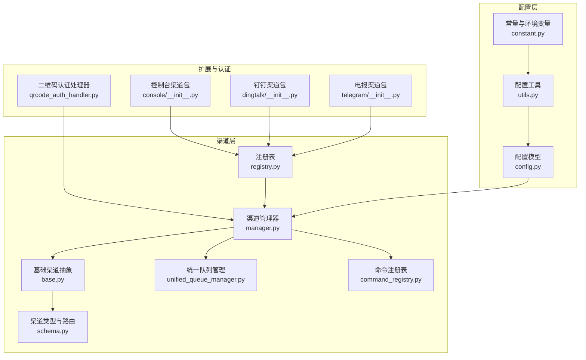
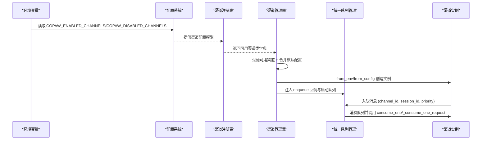
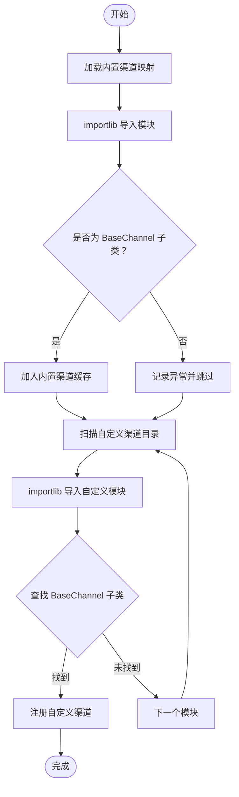
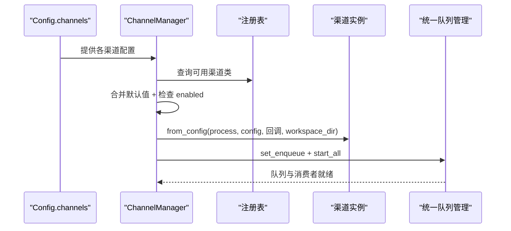
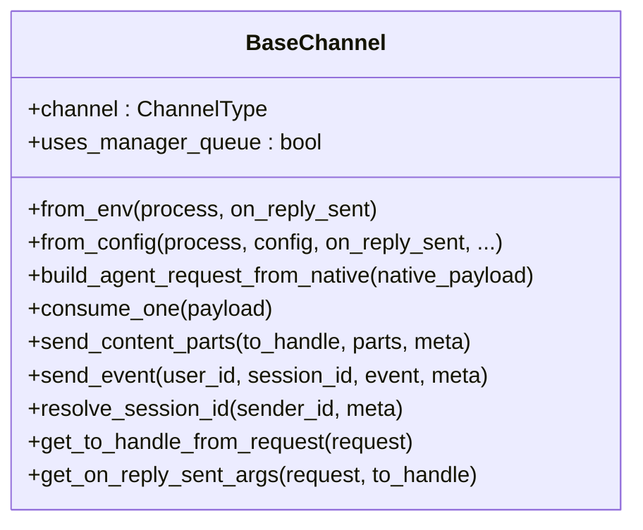
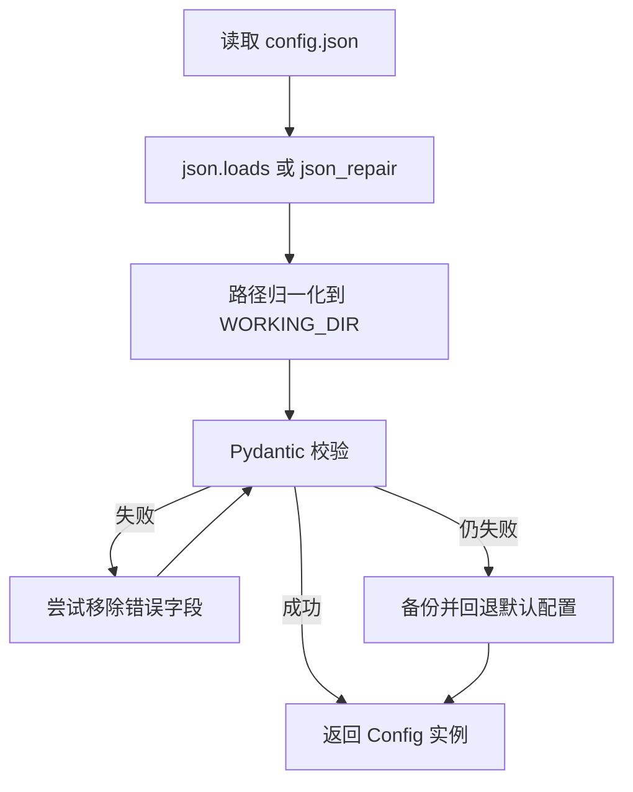
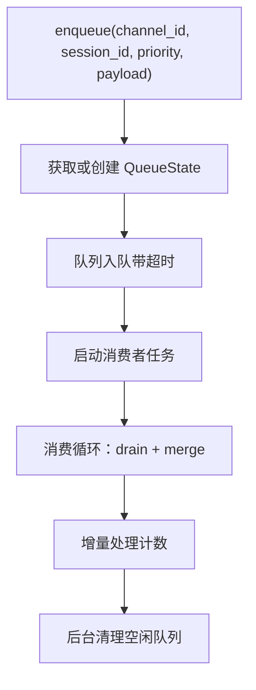
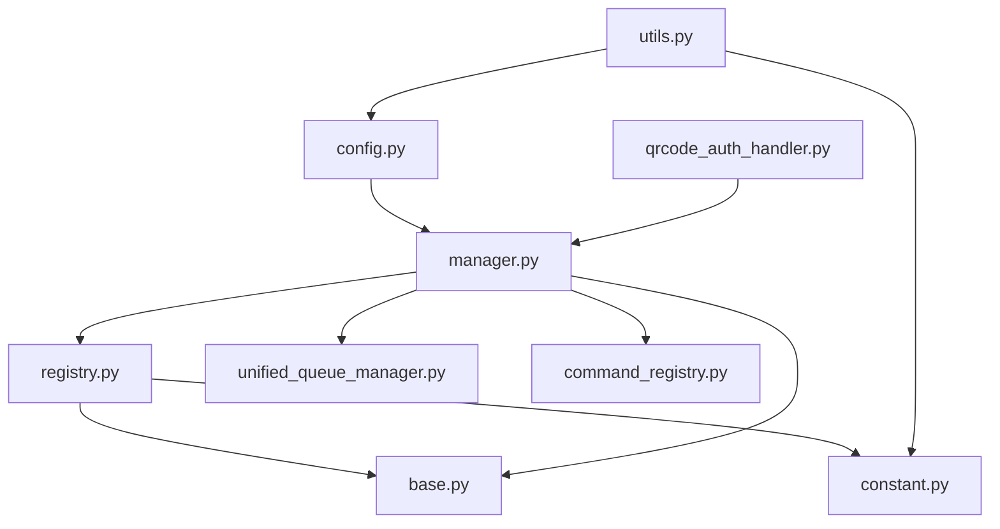

# 渠道配置系统

<cite>
**本文档引用的文件**
- [registry.py](file://src/copaw/app/channels/registry.py)
- [manager.py](file://src/copaw/app/channels/manager.py)
- [base.py](file://src/copaw/app/channels/base.py)
- [schema.py](file://src/copaw/app/channels/schema.py)
- [config.py](file://src/copaw/config/config.py)
- [constant.py](file://src/copaw/constant.py)
- [utils.py](file://src/copaw/config/utils.py)
- [unified_queue_manager.py](file://src/copaw/app/channels/unified_queue_manager.py)
- [command_registry.py](file://src/copaw/app/channels/command_registry.py)
- [__init__.py](file://src/copaw/app/channels/console/__init__.py)
- [__init__.py](file://src/copaw/app/channels/dingtalk/__init__.py)
- [__init__.py](file://src/copaw/app/channels/telegram/__init__.py)
- [qrcode_auth_handler.py](file://src/copaw/app/channels/qrcode_auth_handler.py)
</cite>

## 目录
1. [简介](#简介)
2. [项目结构](#项目结构)
3. [核心组件](#核心组件)
4. [架构总览](#架构总览)
5. [详细组件分析](#详细组件分析)
6. [依赖关系分析](#依赖关系分析)
7. [性能考虑](#性能考虑)
8. [故障排除指南](#故障排除指南)
9. [结论](#结论)
10. [附录](#附录)

## 简介
本技术文档深入解析 Copaw 的渠道配置系统，涵盖渠道注册表的工作原理（渠道发现、动态加载、配置验证）、从环境变量与配置文件读取渠道配置的流程（默认值处理、类型转换、字段验证）、渠道配置的继承关系与覆盖规则、扩展配置处理方式、自定义渠道配置、配置热更新与迁移策略，以及配置调试、错误排查与最佳实践。

## 项目结构
渠道配置系统主要由以下模块组成：
- 渠道注册与发现：通过注册表扫描内置渠道与自定义渠道模块，动态加载 BaseChannel 子类。
- 渠道管理器：根据配置或环境变量创建渠道实例，统一调度消息队列与消费逻辑。
- 配置系统：基于 Pydantic 的配置模型，支持从文件与环境变量读取、自动修复与校验。
- 统一队列管理：按会话与优先级隔离的消息队列，支持动态消费者创建与空闲清理。
- 命令路由：控制命令识别与优先级分配，确保紧急指令快速响应。
- 身份认证：通用二维码登录处理器，为特定渠道提供统一授权接口。

**图表来源**
- [registry.py:190-195](file://src/copaw/app/channels/registry.py#L190-L195)
- [manager.py:68-106](file://src/copaw/app/channels/manager.py#L68-L106)
- [base.py:70-127](file://src/copaw/app/channels/base.py#L70-L127)
- [schema.py:12-48](file://src/copaw/app/channels/schema.py#L12-L48)
- [config.py:92-281](file://src/copaw/config/config.py#L92-L281)
- [utils.py:487-527](file://src/copaw/config/utils.py#L487-L527)
- [constant.py:153-155](file://src/copaw/constant.py#L153-L155)
- [unified_queue_manager.py:60-118](file://src/copaw/app/channels/unified_queue_manager.py#L60-L118)
- [command_registry.py:23-62](file://src/copaw/app/channels/command_registry.py#L23-L62)
- [qrcode_auth_handler.py:48-71](file://src/copaw/app/channels/qrcode_auth_handler.py#L48-L71)

**章节来源**
- [registry.py:1-195](file://src/copaw/app/channels/registry.py#L1-L195)
- [manager.py:1-711](file://src/copaw/app/channels/manager.py#L1-L711)
- [base.py:1-800](file://src/copaw/app/channels/base.py#L1-L800)
- [schema.py:1-71](file://src/copaw/app/channels/schema.py#L1-L71)
- [config.py:1-800](file://src/copaw/config/config.py#L1-L800)
- [constant.py:1-274](file://src/copaw/constant.py#L1-L274)
- [utils.py:1-669](file://src/copaw/config/utils.py#L1-L669)
- [unified_queue_manager.py:1-498](file://src/copaw/app/channels/unified_queue_manager.py#L1-L498)
- [command_registry.py:1-267](file://src/copaw/app/channels/command_registry.py#L1-L267)
- [qrcode_auth_handler.py:1-271](file://src/copaw/app/channels/qrcode_auth_handler.py#L1-L271)

## 核心组件
- 渠道注册表：维护内置渠道映射，扫描自定义渠道目录，缓存已加载的渠道类，支持自定义渠道挂载 HTTP 路由。
- 渠道管理器：从环境变量或配置文件创建渠道实例，负责统一队列、批量合并、优先级路由与生命周期管理。
- 基础渠道抽象：定义渠道通用协议（from_env/from_config）、消息合并、去抖动、权限策略、渲染与发送等。
- 配置系统：提供 BaseChannelConfig 与各渠道具体配置模型，支持默认值、类型约束与字段校验；配置工具负责文件读取、自动修复与保存。
- 统一队列管理：以 (channel_id, session_id, priority_level) 为键的动态队列，按需创建消费者，空闲清理，提供监控指标。
- 命令注册表：将控制命令映射到优先级，支持快速匹配与扩展。
- 二维码认证处理器：为微信与企业微信等渠道提供统一的二维码登录与状态轮询接口。

**章节来源**
- [registry.py:190-195](file://src/copaw/app/channels/registry.py#L190-L195)
- [manager.py:68-213](file://src/copaw/app/channels/manager.py#L68-L213)
- [base.py:70-127](file://src/copaw/app/channels/base.py#L70-L127)
- [config.py:92-281](file://src/copaw/config/config.py#L92-L281)
- [utils.py:487-527](file://src/copaw/config/utils.py#L487-L527)
- [unified_queue_manager.py:60-118](file://src/copaw/app/channels/unified_queue_manager.py#L60-L118)
- [command_registry.py:23-62](file://src/copaw/app/channels/command_registry.py#L23-L62)
- [qrcode_auth_handler.py:48-71](file://src/copaw/app/channels/qrcode_auth_handler.py#L48-L71)

## 架构总览
渠道配置系统采用“注册表 + 管理器 + 抽象基类 + 配置模型”的分层设计。启动时通过注册表发现渠道，结合可用性过滤与配置对象生成渠道实例；消息通过统一队列按会话与优先级隔离处理；配置系统提供强类型校验与默认值，支持热更新与迁移。

**图表来源**
- [utils.py:342-367](file://src/copaw/config/utils.py#L342-L367)
- [config.py:92-281](file://src/copaw/config/config.py#L92-L281)
- [registry.py:190-195](file://src/copaw/app/channels/registry.py#L190-L195)
- [manager.py:86-106](file://src/copaw/app/channels/manager.py#L86-L106)
- [unified_queue_manager.py:119-164](file://src/copaw/app/channels/unified_queue_manager.py#L119-L164)

## 详细组件分析

### 渠道注册表与动态加载
- 内置渠道映射：通过 _BUILTIN_SPECS 将渠道键映射到模块名与类名，使用 importlib 动态导入，严格校验是否为 BaseChannel 子类。
- 可用性控制：_REQUIRED_CHANNEL_KEYS 中的渠道失败会抛出异常，其他渠道失败仅记录日志并跳过。
- 自定义渠道发现：扫描 CUSTOM_CHANNELS_DIR，支持单文件模块与包目录，遍历模块属性查找继承自 BaseChannel 的类，提取 channel 属性作为键。
- 路由注册：允许自定义渠道在模块级别提供 register_app_routes(app)，用于挂载 HTTP 路由；对非 /api/ 前缀的路由发出警告。
- 缓存机制：内置渠道类缓存避免重复导入，提供 clear_builtin_channel_cache 便于测试。

**图表来源**
- [registry.py:45-78](file://src/copaw/app/channels/registry.py#L45-L78)
- [registry.py:97-129](file://src/copaw/app/channels/registry.py#L97-L129)
- [registry.py:135-188](file://src/copaw/app/channels/registry.py#L135-L188)

**章节来源**
- [registry.py:19-78](file://src/copaw/app/channels/registry.py#L19-L78)
- [registry.py:97-129](file://src/copaw/app/channels/registry.py#L97-L129)
- [registry.py:135-188](file://src/copaw/app/channels/registry.py#L135-L188)
- [constant.py:153-155](file://src/copaw/constant.py#L153-L155)

### 渠道管理器：从配置创建与统一调度
- 从环境创建：get_available_channels 依据 COPAW_ENABLED_CHANNELS/COPAW_DISABLED_CHANNELS 过滤可用渠道，结合注册表创建实例。
- 从配置创建：从 Config.channels 读取各渠道配置，合并 BaseChannelConfig 默认值，支持 dict 与 Pydantic 对象两种形态；检查 enabled 字段决定是否初始化。
- 参数适配：通过 inspect 获取 from_config 签名，仅传递渠道接受的参数，避免不兼容错误。
- 统一队列：注入 enqueue 回调，启动 UnifiedQueueManager，按会话与优先级隔离处理；支持批量合并与去抖动。
- 生命周期：start_all/start/stop_all，优雅关闭与任务取消；支持替换单个渠道实例。

**图表来源**
- [manager.py:86-106](file://src/copaw/app/channels/manager.py#L86-L106)
- [manager.py:110-213](file://src/copaw/app/channels/manager.py#L110-L213)
- [manager.py:447-478](file://src/copaw/app/channels/manager.py#L447-L478)

**章节来源**
- [manager.py:86-213](file://src/copaw/app/channels/manager.py#L86-L213)
- [manager.py:447-526](file://src/copaw/app/channels/manager.py#L447-L526)

### 基础渠道抽象：协议与通用能力
- 协议方法：from_env/from_config 必须实现；消息转换 build_agent_request_from_native 必须实现；发送 send_content_parts/send_event 由子类实现。
- 会话与去抖动：get_debounce_key 生成会话键；merge_native_items/merge_requests 支持原生负载与请求的合并；_apply_no_text_debounce 处理无文本内容缓冲。
- 权限与策略：dm_policy/group_policy/allow_from/deny_message/requir_mention 控制消息进入策略。
- 渲染与发送：MessageRenderer 根据 show_tool_details/filter_tool_messages/filter_thinking 决定输出样式。
- 任务跟踪：_consume_with_tracker 与 TaskTracker 集成，支持 /stop 取消与事件流输出。

**图表来源**
- [base.py:70-127](file://src/copaw/app/channels/base.py#L70-L127)
- [base.py:538-555](file://src/copaw/app/channels/base.py#L538-L555)
- [base.py:604-618](file://src/copaw/app/channels/base.py#L604-L618)

**章节来源**
- [base.py:70-127](file://src/copaw/app/channels/base.py#L70-L127)
- [base.py:538-618](file://src/copaw/app/channels/base.py#L538-L618)

### 配置系统：模型、默认值与校验
- 渠道配置模型：BaseChannelConfig 定义通用字段（enabled/bot_prefix/filter_tool_messages/filter_thinking/dm_policy/group_policy/allow_from/deny_message/require_mention），各渠道子类扩展专属字段。
- 统一配置容器：ChannelConfig 包含所有内置渠道配置，默认值来自对应子类构造函数。
- 配置读取与修复：load_config 读取 config.json，使用 json_repair 修复常见语法问题，路径归一化至当前 WORKING_DIR，回退到默认配置并备份损坏文件。
- 环境变量与默认值：constant.py 中 EnvVarLoader 提供安全的布尔/整数/浮点/字符串读取，支持最小最大边界与无穷大处理；COPAW_ENABLED_CHANNELS/COPAW_DISABLED_CHANNELS 控制渠道可用性。

**图表来源**
- [utils.py:487-527](file://src/copaw/config/utils.py#L487-L527)
- [utils.py:452-484](file://src/copaw/config/utils.py#L452-L484)
- [config.py:92-281](file://src/copaw/config/config.py#L92-L281)
- [constant.py:18-70](file://src/copaw/constant.py#L18-L70)

**章节来源**
- [config.py:92-281](file://src/copaw/config/config.py#L92-L281)
- [utils.py:487-527](file://src/copaw/config/utils.py#L487-L527)
- [constant.py:18-70](file://src/copaw/constant.py#L18-L70)

### 统一队列管理：并发隔离与空闲清理
- 队列键：(channel_id, session_id, priority_level)，确保相同键严格串行，不同键并发处理。
- 动态消费者：首次入队时创建队列与消费者任务，按需增长。
- 空闲清理：定期扫描空队列，超过 idle_timeout 的队列取消消费者并释放资源。
- 指标监控：提供队列数量、大小、处理计数、存活时间与空闲时间等指标。

**图表来源**
- [unified_queue_manager.py:119-164](file://src/copaw/app/channels/unified_queue_manager.py#L119-L164)
- [unified_queue_manager.py:165-212](file://src/copaw/app/channels/unified_queue_manager.py#L165-L212)
- [unified_queue_manager.py:376-428](file://src/copaw/app/channels/unified_queue_manager.py#L376-L428)

**章节来源**
- [unified_queue_manager.py:60-118](file://src/copaw/app/channels/unified_queue_manager.py#L60-L118)
- [unified_queue_manager.py:119-212](file://src/copaw/app/channels/unified_queue_manager.py#L119-L212)
- [unified_queue_manager.py:376-428](file://src/copaw/app/channels/unified_queue_manager.py#L376-L428)

### 命令注册表：控制命令与优先级
- 预定义优先级：critical(0)/high(10)/normal(20)/low(30)，支持灵活扩展。
- 控制命令：默认注册 /stop、/daemon 系列短命令等，支持前缀匹配与空格断词。
- 查找策略：按命令长度降序匹配，避免部分匹配误判。

**章节来源**
- [command_registry.py:23-62](file://src/copaw/app/channels/command_registry.py#L23-L62)
- [command_registry.py:136-218](file://src/copaw/app/channels/command_registry.py#L136-L218)

### 渠道类型与路由标识
- ChannelType：字符串类型，内置渠道集合用于插件渠道扩展。
- ChannelAddress：统一路由标识（kind/id/extra），替代分散的元数据键，支持 to_handle 转换。

**章节来源**
- [schema.py:12-48](file://src/copaw/app/channels/schema.py#L12-L48)

### 自定义渠道配置与路由挂载
- 自定义渠道模块：位于 CUSTOM_CHANNELS_DIR，模块内导出继承自 BaseChannel 的类，类上需设置 channel 属性作为键。
- 路由挂载：模块可提供 register_app_routes(app) 钩子，注册 /api/ 前缀的端点；非 /api/ 前缀会被 SPA 捕获，启动时发出警告。
- 示例包：console/dingtalk/telegram 包均导出对应渠道类，展示标准实现模式。

**章节来源**
- [registry.py:135-188](file://src/copaw/app/channels/registry.py#L135-L188)
- [constant.py:153-155](file://src/copaw/constant.py#L153-L155)
- [__init__.py:1-6](file://src/copaw/app/channels/console/__init__.py#L1-L6)
- [__init__.py:1-6](file://src/copaw/app/channels/dingtalk/__init__.py#L1-L6)
- [__init__.py:1-6](file://src/copaw/app/channels/telegram/__init__.py#L1-L6)

### 配置热更新与迁移
- 热更新：ChannelManager.replace_channel 支持在运行时替换指定渠道实例，先启动新实例再交换并停止旧实例，保证服务连续性。
- 配置迁移：load_config 在校验失败时尝试移除导致错误的字段，若仍失败则备份原文件并回退到默认配置；路径归一化确保 WORKING_DIR 变更后仍有效。

**章节来源**
- [manager.py:571-630](file://src/copaw/app/channels/manager.py#L571-L630)
- [utils.py:487-527](file://src/copaw/config/utils.py#L487-L527)
- [utils.py:498-508](file://src/copaw/config/utils.py#L498-L508)

### 二维码认证与渠道授权
- 通用协议：QRCodeAuthHandler 定义 fetch_qrcode/poll_status 接口。
- 具体实现：WeixinQRCodeAuthHandler/WecomQRCodeAuthHandler 分别对接 iLink 与企业微信授权页面，生成二维码与轮询状态。
- 路由暴露：通过 qrcode_auth_handler 暴露通用端点，按渠道参数分发到对应处理器。

**章节来源**
- [qrcode_auth_handler.py:48-71](file://src/copaw/app/channels/qrcode_auth_handler.py#L48-L71)
- [qrcode_auth_handler.py:79-160](file://src/copaw/app/channels/qrcode_auth_handler.py#L79-L160)
- [qrcode_auth_handler.py:171-260](file://src/copaw/app/channels/qrcode_auth_handler.py#L171-L260)

## 依赖关系分析

**图表来源**
- [registry.py:12-13](file://src/copaw/app/channels/registry.py#L12-L13)
- [manager.py:21-25](file://src/copaw/app/channels/manager.py#L21-L25)
- [config.py:14-27](file://src/copaw/config/config.py#L14-L27)
- [utils.py:20-35](file://src/copaw/config/utils.py#L20-L35)
- [constant.py:2-9](file://src/copaw/constant.py#L2-L9)

**章节来源**
- [registry.py:1-195](file://src/copaw/app/channels/registry.py#L1-L195)
- [manager.py:1-711](file://src/copaw/app/channels/manager.py#L1-L711)
- [config.py:1-800](file://src/copaw/config/config.py#L1-L800)
- [utils.py:1-669](file://src/copaw/config/utils.py#L1-L669)
- [constant.py:1-274](file://src/copaw/constant.py#L1-L274)

## 性能考虑
- 队列隔离与并发：按会话与优先级隔离，避免高优先级阻塞低优先级；动态消费者减少固定开销。
- 批量合并：合并原生负载与请求，降低下游压力；去抖动处理无文本输入，提升用户体验。
- 超时与背压：入队与消费均设置超时，防止无限阻塞；队列满时快速失败并告警。
- 资源回收：空闲队列自动清理，避免内存泄漏；优雅关闭时等待消费者退出。

[本节为通用指导，无需特定文件分析]

## 故障排除指南
- 渠道无法加载
  - 检查内置渠道是否满足可选依赖；必要渠道失败会直接抛出异常。
  - 自定义渠道模块导入失败会在日志中记录异常，确认模块路径与类名正确。
- 渠道未启用
  - 确认 COPAW_ENABLED_CHANNELS/COPAW_DISABLED_CHANNELS 设置是否符合预期。
  - 检查 Config.channels 中对应渠道的 enabled 字段。
- 配置文件损坏
  - load_config 会尝试修复 JSON 语法问题；若仍失败，会备份原文件并回退默认配置。
  - 关注路径归一化提示，确保 WORKING_DIR 变更后配置仍有效。
- 队列积压或超时
  - 检查队列指标与空闲时间；适当调整队列容量与清理间隔。
  - 确认消费者是否正常运行，关注日志中的异常堆栈。
- 控制命令无效
  - 确认命令前缀与空格断词；使用 is_control_command 判断是否命中注册表。
- 二维码登录失败
  - 检查网络连通性与授权页面返回；查看 HTTP 异常详情与状态码。

**章节来源**
- [registry.py:64-76](file://src/copaw/app/channels/registry.py#L64-L76)
- [utils.py:432-450](file://src/copaw/config/utils.py#L432-L450)
- [unified_queue_manager.py:147-156](file://src/copaw/app/channels/unified_queue_manager.py#L147-L156)
- [command_registry.py:136-174](file://src/copaw/app/channels/command_registry.py#L136-L174)
- [qrcode_auth_handler.py:101-135](file://src/copaw/app/channels/qrcode_auth_handler.py#L101-L135)

## 结论
Copaw 的渠道配置系统通过注册表动态发现与加载、配置模型强类型校验与默认值、统一队列并发隔离与空闲清理、命令优先级路由与控制，实现了高扩展性与高可靠性的多渠道接入。配合热更新与迁移策略，可在不中断服务的情况下平滑演进。建议在生产环境中严格设置渠道白名单、完善监控指标与日志告警，并定期备份配置文件以保障可恢复性。

[本节为总结性内容，无需特定文件分析]

## 附录
- 最佳实践
  - 使用 ChannelConfig 作为统一入口，避免散落的元数据键。
  - 自定义渠道遵循 register_app_routes 约定，确保 /api/ 前缀。
  - 合理设置队列容量与清理间隔，平衡吞吐与资源占用。
  - 对外暴露的控制命令应保持简洁且前缀唯一，避免歧义。
  - 配置变更前先在测试环境验证，利用热更新进行灰度发布。

[本节为通用指导，无需特定文件分析]