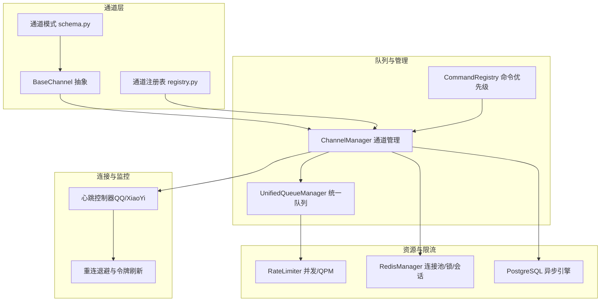
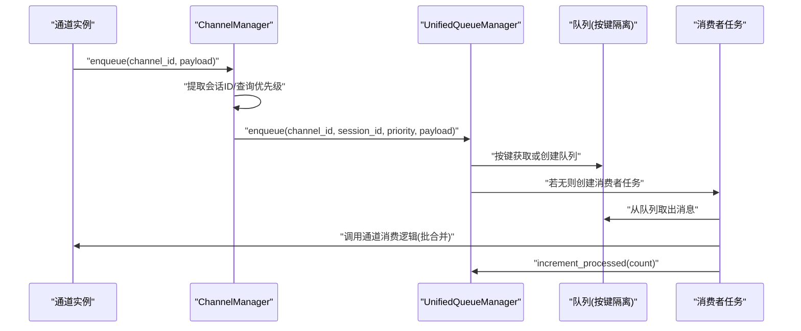
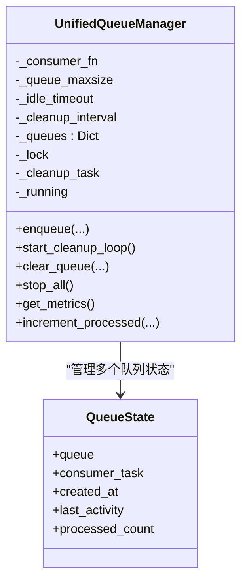
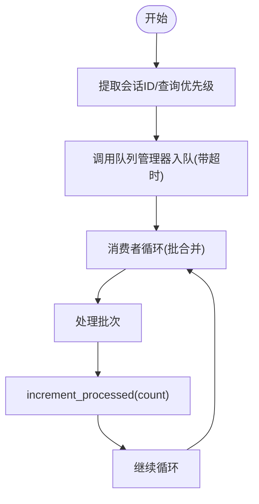
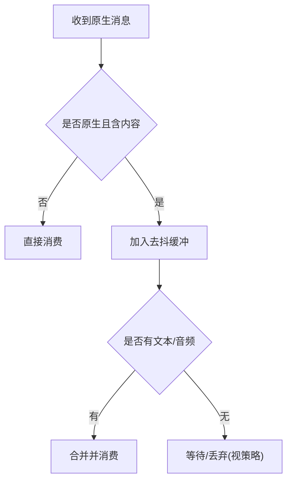
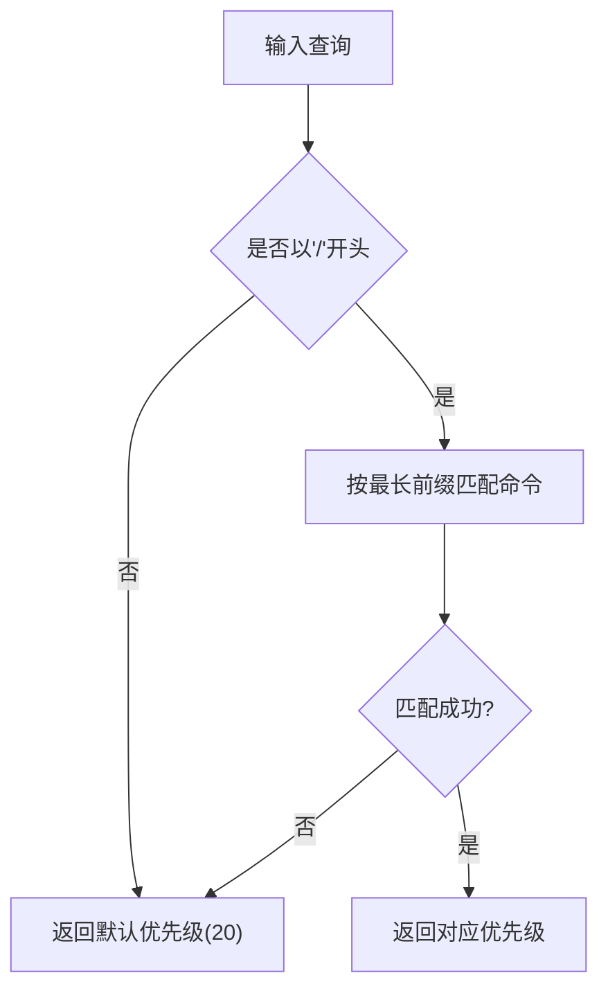
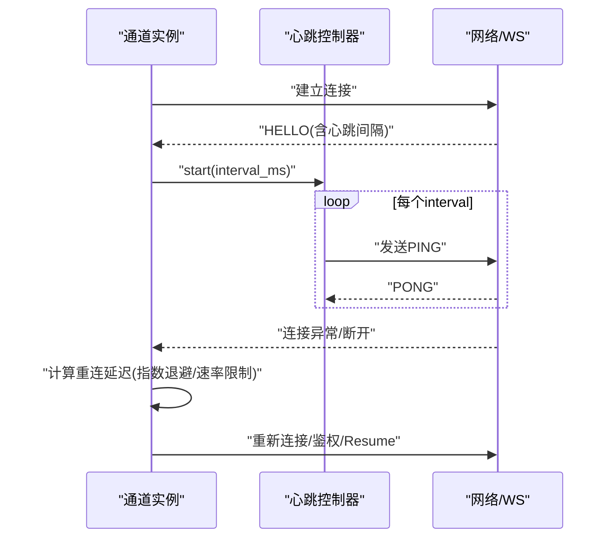
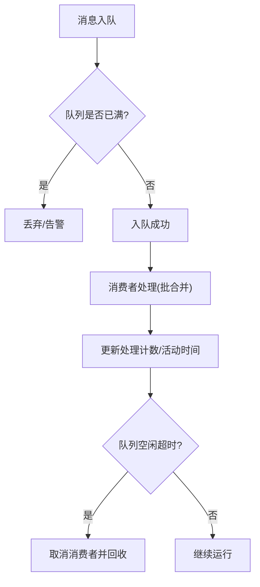
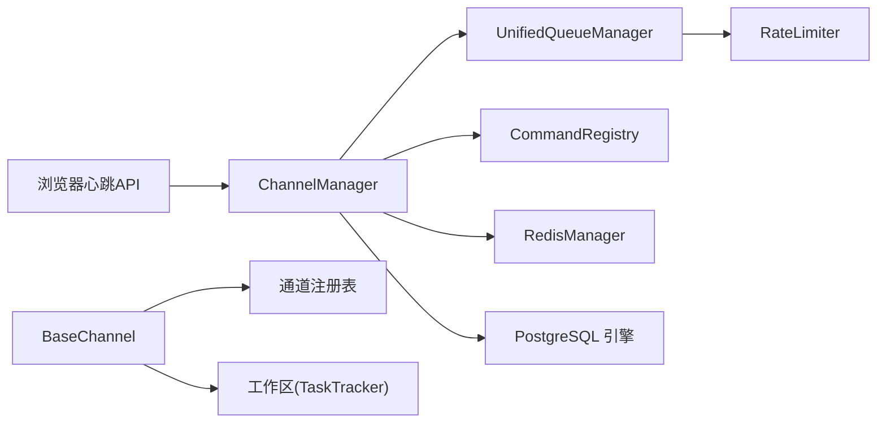

# 连接管理

<cite>
**本文引用的文件**
- [unified_queue_manager.py](file://src/copaw/app/channels/unified_queue_manager.py)
- [manager.py](file://src/copaw/app/channels/manager.py)
- [base.py](file://src/copaw/app/channels/base.py)
- [command_registry.py](file://src/copaw/app/channels/command_registry.py)
- [registry.py](file://src/copaw/app/channels/registry.py)
- [schema.py](file://src/copaw/app/channels/schema.py)
- [rate_limiter.py](file://src/copaw/providers/rate_limiter.py)
- [redis_client.py](file://src/copaw/db/redis_client.py)
- [postgresql.py](file://src/copaw/db/postgresql.py)
- [telemetry.py](file://src/copaw/utils/telemetry.py)
- [heartbeat.ts](file://console/src/api/modules/heartbeat.ts)
- [test_qq_channel.py](file://tests/unit/channels/test_qq_channel.py)
- [channel.py（QQ）](file://src/copaw/app/channels/qq/channel.py)
- [channel.py（XiaoYi）](file://src/copaw/app/channels/xiaoyi/channel.py)
</cite>

## 目录
1. [简介](#简介)
2. [项目结构](#项目结构)
3. [核心组件](#核心组件)
4. [架构总览](#架构总览)
5. [详细组件分析](#详细组件分析)
6. [依赖分析](#依赖分析)
7. [性能考虑](#性能考虑)
8. [故障排查指南](#故障排查指南)
9. [结论](#结论)
10. [附录](#附录)

## 简介
本技术文档围绕连接管理系统展开，重点阐述统一队列管理器的设计与实现，涵盖队列创建、任务调度、消费者管理；同时系统性解析连接状态监控、心跳检测与断线重连机制；并给出队列优先级管理、负载均衡与资源限制策略，以及连接池管理、并发控制与内存优化方案。最后提供性能监控、故障恢复与扩展性优化方法。

## 项目结构
连接管理相关模块主要位于应用层通道子系统中，采用“通道抽象 + 统一队列 + 消费者”的分层设计：
- 通道抽象：定义统一的消息收发协议与会话隔离规则
- 统一队列：按通道、会话、优先级三元组隔离的异步队列与消费者
- 通道管理：负责通道生命周期、队列注入与批量合并
- 优先级路由：基于命令前缀的优先级注册与查询
- 连接监控与重连：心跳控制器、断线退避与令牌刷新
- 资源与限流：并发信号量、QPM滑动窗口、连接池配置
- 可观测性：Redis会话存储、PostgreSQL连接池、遥测上报

图示来源
- [manager.py:68-120](file://src/copaw/app/channels/manager.py#L68-L120)
- [unified_queue_manager.py:60-118](file://src/copaw/app/channels/unified_queue_manager.py#L60-L118)
- [base.py:70-120](file://src/copaw/app/channels/base.py#L70-L120)
- [registry.py:190-195](file://src/copaw/app/channels/registry.py#L190-L195)
- [schema.py:12-48](file://src/copaw/app/channels/schema.py#L12-L48)
- [rate_limiter.py:43-69](file://src/copaw/providers/rate_limiter.py#L43-L69)
- [redis_client.py:22-50](file://src/copaw/db/redis_client.py#L22-L50)
- [postgresql.py:61-102](file://src/copaw/db/postgresql.py#L61-L102)

章节来源
- [manager.py:68-120](file://src/copaw/app/channels/manager.py#L68-L120)
- [unified_queue_manager.py:60-118](file://src/copaw/app/channels/unified_queue_manager.py#L60-L118)
- [base.py:70-120](file://src/copaw/app/channels/base.py#L70-L120)
- [registry.py:190-195](file://src/copaw/app/channels/registry.py#L190-L195)
- [schema.py:12-48](file://src/copaw/app/channels/schema.py#L12-L48)

## 核心组件
- 统一队列管理器（UnifiedQueueManager）
  - 以三元组键（通道ID、会话ID、优先级）隔离队列
  - 动态创建消费者任务，按需启动
  - 支持空闲清理、指标采集、批量处理与处理计数更新
- 通道管理器（ChannelManager）
  - 注入统一队列到各通道
  - 将消息路由至队列，支持超时保护与批合并
  - 提供停止、替换通道等生命周期管理
- 通道抽象（BaseChannel）
  - 定义消息转换、去抖、控制命令识别、发送流程
  - 会话隔离与时间去抖缓冲
- 命令优先级注册（CommandRegistry）
  - 命令前缀到优先级映射，支持默认级别与灵活扩展
- 连接监控与重连（QQ/XiaoYi）
  - 心跳定时器、断线退避、快速断开惩罚、令牌刷新
- 资源与限流（RateLimiter、RedisManager、PostgreSQL）
  - 并发信号量、QPM滑动窗口、Redis连接池与分布式锁、PostgreSQL异步引擎

章节来源
- [unified_queue_manager.py:60-118](file://src/copaw/app/channels/unified_queue_manager.py#L60-L118)
- [manager.py:215-361](file://src/copaw/app/channels/manager.py#L215-L361)
- [base.py:374-430](file://src/copaw/app/channels/base.py#L374-L430)
- [command_registry.py:23-62](file://src/copaw/app/channels/command_registry.py#L23-L62)
- [rate_limiter.py:43-69](file://src/copaw/providers/rate_limiter.py#L43-L69)
- [redis_client.py:22-50](file://src/copaw/db/redis_client.py#L22-L50)
- [postgresql.py:61-102](file://src/copaw/db/postgresql.py#L61-L102)

## 架构总览
统一队列管理器作为中枢，将来自不同通道的消息按“通道-会话-优先级”进行隔离排队，并为每个隔离单元动态创建消费者任务。通道管理器负责将外部事件注入队列，同时保留原有的批合并逻辑以提升吞吐。连接监控与重连在通道层实现，确保长连接稳定与自动恢复。

图示来源
- [manager.py:255-348](file://src/copaw/app/channels/manager.py#L255-L348)
- [unified_queue_manager.py:119-164](file://src/copaw/app/channels/unified_queue_manager.py#L119-L164)
- [unified_queue_manager.py:165-212](file://src/copaw/app/channels/unified_queue_manager.py#L165-L212)
- [unified_queue_manager.py:214-273](file://src/copaw/app/channels/unified_queue_manager.py#L214-L273)

章节来源
- [manager.py:255-348](file://src/copaw/app/channels/manager.py#L255-L348)
- [unified_queue_manager.py:119-273](file://src/copaw/app/channels/unified_queue_manager.py#L119-L273)

## 详细组件分析

### 统一队列管理器（队列创建、任务调度、消费者管理）
- 队列创建
  - 键结构：(channel_id, session_id, priority)
  - 按键查找或创建队列，设置最大长度
  - 创建消费者任务并命名，加入状态表
- 任务调度
  - 消费者循环从队列取消息，支持批合并
  - 处理完成后更新处理计数与活动时间
- 消费者管理
  - 后台清理：定期扫描空闲队列，超过阈值取消并回收
  - 停止：优雅取消所有消费者与清理任务
  - 指标：导出队列总数、每队列大小、处理计数、年龄与空闲时长

图示来源
- [unified_queue_manager.py:41-58](file://src/copaw/app/channels/unified_queue_manager.py#L41-L58)
- [unified_queue_manager.py:60-118](file://src/copaw/app/channels/unified_queue_manager.py#L60-L118)
- [unified_queue_manager.py:376-428](file://src/copaw/app/channels/unified_queue_manager.py#L376-L428)

章节来源
- [unified_queue_manager.py:119-273](file://src/copaw/app/channels/unified_queue_manager.py#L119-L273)
- [unified_queue_manager.py:376-471](file://src/copaw/app/channels/unified_queue_manager.py#L376-L471)

### 通道管理器（路由、批合并、生命周期）
- 路由与注入
  - 为启用队列的通道设置入队回调
  - 初始化统一队列管理器并启动清理循环
- 入队与超时
  - 从事件循环线程安全地调用入队
  - 入队带超时保护，避免阻塞
- 批合并
  - 在同一队列键下持续出队形成批次，再调用通道消费
  - 更新处理计数
- 生命周期
  - 停止：取消待处理入队任务、停止队列管理器、停止通道
  - 替换：新通道预启动后交换旧通道并停止旧通道

图示来源
- [manager.py:255-348](file://src/copaw/app/channels/manager.py#L255-L348)
- [manager.py:362-446](file://src/copaw/app/channels/manager.py#L362-L446)

章节来源
- [manager.py:215-361](file://src/copaw/app/channels/manager.py#L215-L361)
- [manager.py:362-446](file://src/copaw/app/channels/manager.py#L362-L446)
- [manager.py:479-525](file://src/copaw/app/channels/manager.py#L479-L525)

### 通道抽象（消息转换、去抖、控制命令）
- 消息转换
  - 将原生消息转为统一请求对象，构建消息内容
- 去抖与批合并
  - 时间去抖：同会话内无文本内容先缓冲，收到文本后再合并
  - 批合并：同一队列键下连续出队形成批次
- 控制命令
  - 通过命令注册表识别控制命令，绕过任务跟踪直接响应

图示来源
- [base.py:659-758](file://src/copaw/app/channels/base.py#L659-L758)
- [base.py:759-800](file://src/copaw/app/channels/base.py#L759-L800)

章节来源
- [base.py:659-800](file://src/copaw/app/channels/base.py#L659-L800)

### 命令优先级注册（队列优先级管理）
- 默认优先级：critical(0)/high(10)/normal(20)/low(30)
- 命令前缀匹配：按最长前缀优先匹配，支持空格分隔
- 自定义扩展：可插入中间级别（如5、15），保持有序

图示来源
- [command_registry.py:175-218](file://src/copaw/app/channels/command_registry.py#L175-L218)

章节来源
- [command_registry.py:23-62](file://src/copaw/app/channels/command_registry.py#L23-L62)
- [command_registry.py:175-218](file://src/copaw/app/channels/command_registry.py#L175-L218)

### 连接状态监控、心跳检测、断线重连
- 心跳控制器
  - 使用线程定时器周期发送心跳
  - 根据服务端返回的心跳间隔启动/调整心跳
- 断线重连
  - 快速断开计数触发速率限制与令牌刷新
  - 指数退避延迟，上限钳制
  - 支持会话续连（resume）与鉴权重试
- 会话复用
  - XiaoYi通道支持复用现有连接，避免重复握手

图示来源
- [test_qq_channel.py:316-368](file://tests/unit/channels/test_qq_channel.py#L316-L368)
- [channel.py（QQ）:145-178](file://src/copaw/app/channels/qq/channel.py#L145-L178)
- [channel.py（QQ）:1426-1445](file://src/copaw/app/channels/qq/channel.py#L1426-L1445)
- [channel.py（XiaoYi）:257-291](file://src/copaw/app/channels/xiaoyi/channel.py#L257-L291)

章节来源
- [test_qq_channel.py:254-368](file://tests/unit/channels/test_qq_channel.py#L254-L368)
- [channel.py（QQ）:145-178](file://src/copaw/app/channels/qq/channel.py#L145-L178)
- [channel.py（QQ）:1426-1445](file://src/copaw/app/channels/qq/channel.py#L1426-L1445)
- [channel.py（XiaoYi）:257-291](file://src/copaw/app/channels/xiaoyi/channel.py#L257-L291)

### 负载均衡与资源限制策略
- 队列隔离与并发
  - 通道×会话×优先级三元隔离，天然实现跨会话并发与跨优先级隔离
  - 同一隔离内严格串行，避免竞态
- 资源限制
  - 队列最大长度限制，防止无限增长
  - 空闲队列自动清理，释放消费者与内存
  - 并发信号量与QPM滑动窗口限制上游调用速率
- 连接池
  - Redis连接池上限与健康检查
  - PostgreSQL异步引擎连接池与预检

图示来源
- [unified_queue_manager.py:119-164](file://src/copaw/app/channels/unified_queue_manager.py#L119-L164)
- [unified_queue_manager.py:376-428](file://src/copaw/app/channels/unified_queue_manager.py#L376-L428)
- [rate_limiter.py:102-135](file://src/copaw/providers/rate_limiter.py#L102-L135)
- [redis_client.py:43-77](file://src/copaw/db/redis_client.py#L43-L77)
- [postgresql.py:61-102](file://src/copaw/db/postgresql.py#L61-L102)

章节来源
- [unified_queue_manager.py:119-164](file://src/copaw/app/channels/unified_queue_manager.py#L119-L164)
- [unified_queue_manager.py:376-428](file://src/copaw/app/channels/unified_queue_manager.py#L376-L428)
- [rate_limiter.py:102-135](file://src/copaw/providers/rate_limiter.py#L102-L135)
- [redis_client.py:43-77](file://src/copaw/db/redis_client.py#L43-L77)
- [postgresql.py:61-102](file://src/copaw/db/postgresql.py#L61-L102)

### 连接池管理、并发控制、内存优化
- 连接池
  - Redis：连接池上限、命名空间键前缀、健康检查
  - PostgreSQL：连接池大小、溢出、pre_ping、SSL模式
- 并发控制
  - 信号量限制并发请求数
  - QPM滑动窗口限制每分钟请求数
- 内存优化
  - 队列最大长度与空闲清理
  - 批合并减少上下文切换与对象创建
  - 会话去抖缓冲仅在必要时保留

章节来源
- [redis_client.py:43-85](file://src/copaw/db/redis_client.py#L43-L85)
- [postgresql.py:61-102](file://src/copaw/db/postgresql.py#L61-L102)
- [rate_limiter.py:43-69](file://src/copaw/providers/rate_limiter.py#L43-L69)
- [base.py:210-282](file://src/copaw/app/channels/base.py#L210-L282)

### 性能监控、故障恢复与扩展性优化
- 性能监控
  - 队列指标：队列总数、每队列大小、处理计数、年龄、空闲时长
  - Redis/PostgreSQL健康检查与连接池统计
  - 遥测上报：安装方式、系统信息、版本、GPU检测
- 故障恢复
  - 心跳失败自动重连，指数退避与速率限制
  - 快速断开触发令牌刷新与会话重置
  - 队列满/超时告警，避免阻塞
- 扩展性优化
  - 动态消费者：按需创建，避免固定工作池
  - 隔离粒度：通道×会话×优先级，支持水平扩展
  - 批合并与去抖：降低系统压力，提升吞吐

章节来源
- [unified_queue_manager.py:430-471](file://src/copaw/app/channels/unified_queue_manager.py#L430-L471)
- [redis_client.py:198-206](file://src/copaw/db/redis_client.py#L198-L206)
- [telemetry.py:48-75](file://src/copaw/utils/telemetry.py#L48-L75)
- [test_qq_channel.py:271-308](file://tests/unit/channels/test_qq_channel.py#L271-L308)

## 依赖分析
- 组件耦合
  - ChannelManager 依赖 UnifiedQueueManager 与 CommandRegistry
  - BaseChannel 依赖通道注册表与工作区（任务跟踪）
  - 统一队列管理器依赖 RateLimiter 进行上游限流
- 外部依赖
  - Redis/PostgreSQL：连接池与会话存储
  - 浏览器端心跳接口：配置读取与更新

图示来源
- [manager.py:68-120](file://src/copaw/app/channels/manager.py#L68-L120)
- [unified_queue_manager.py:60-118](file://src/copaw/app/channels/unified_queue_manager.py#L60-L118)
- [base.py:323-336](file://src/copaw/app/channels/base.py#L323-L336)
- [registry.py:190-195](file://src/copaw/app/channels/registry.py#L190-L195)
- [heartbeat.ts:1-12](file://console/src/api/modules/heartbeat.ts#L1-L12)

章节来源
- [manager.py:68-120](file://src/copaw/app/channels/manager.py#L68-L120)
- [unified_queue_manager.py:60-118](file://src/copaw/app/channels/unified_queue_manager.py#L60-L118)
- [base.py:323-336](file://src/copaw/app/channels/base.py#L323-L336)
- [registry.py:190-195](file://src/copaw/app/channels/registry.py#L190-L195)
- [heartbeat.ts:1-12](file://console/src/api/modules/heartbeat.ts#L1-L12)

## 性能考虑
- 队列与批处理
  - 批合并减少事件循环开销，提高吞吐
  - 队列最大长度与空闲清理避免内存膨胀
- 并发与限流
  - 信号量与QPM滑动窗口防止下游过载
  - 通道×会话×优先级隔离保证公平性与稳定性
- 连接池
  - Redis/PostgreSQL连接池上限与健康检查保障高可用
- I/O与CPU
  - 心跳线程定时器与异步消费者分离，避免阻塞
  - 会话去抖减少无效I/O

## 故障排查指南
- 队列相关
  - 队列满：检查入队超时日志，评估队列长度与消费者处理速度
  - 队列不清理：确认空闲超时与清理循环是否运行
  - 处理计数异常：核对消费者处理批次大小与增量
- 连接相关
  - 心跳失败：查看心跳控制器是否启动，服务端心跳间隔是否合理
  - 快速断开：检查快速断开计数与速率限制触发
  - 重连失败：确认令牌刷新逻辑与会话续连参数
- 资源相关
  - Redis/PostgreSQL不可达：检查连接池初始化与健康检查
  - 并发/限流：确认信号量与QPM配置是否合理

章节来源
- [unified_queue_manager.py:145-156](file://src/copaw/app/channels/unified_queue_manager.py#L145-L156)
- [unified_queue_manager.py:376-428](file://src/copaw/app/channels/unified_queue_manager.py#L376-L428)
- [test_qq_channel.py:271-308](file://tests/unit/channels/test_qq_channel.py#L271-L308)
- [redis_client.py:198-206](file://src/copaw/db/redis_client.py#L198-L206)
- [rate_limiter.py:102-135](file://src/copaw/providers/rate_limiter.py#L102-L135)

## 结论
统一队列管理器通过“通道×会话×优先级”三元隔离实现了高并发、低耦合的连接管理框架。配合通道层的批合并、去抖与控制命令识别，以及心跳与断线重连机制，系统在稳定性、可观测性与扩展性方面均具备良好表现。结合Redis/PostgreSQL连接池与并发/QPM限流，可在高负载场景下保持稳健运行。

## 附录
- 心跳配置接口（浏览器端）
  - 获取与更新心跳配置，便于运维侧动态调整心跳策略

章节来源
- [heartbeat.ts:1-12](file://console/src/api/modules/heartbeat.ts#L1-L12)