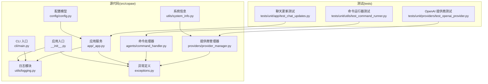
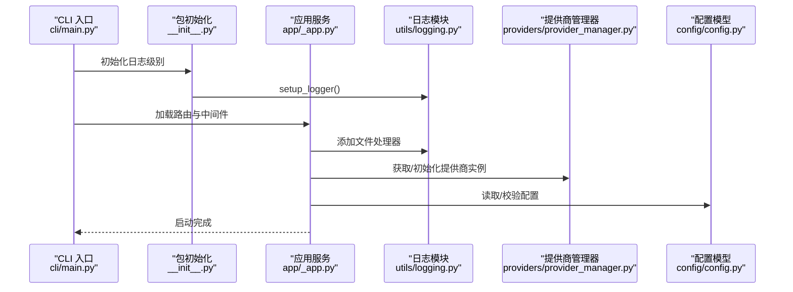
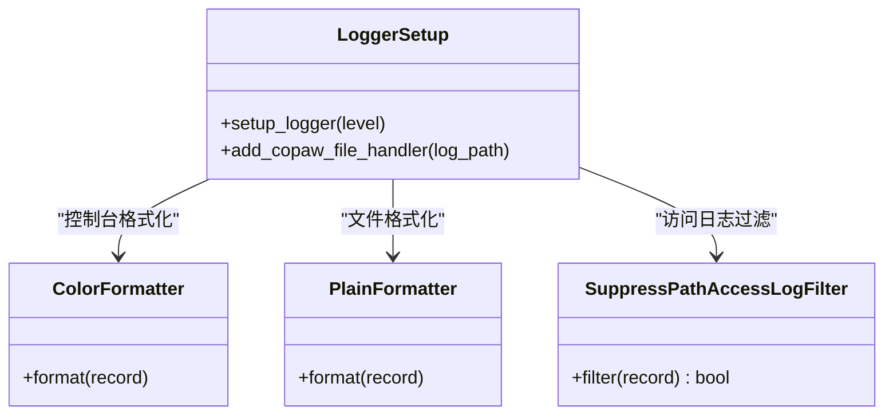
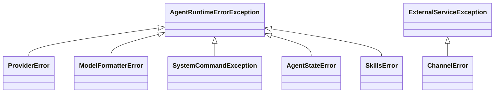
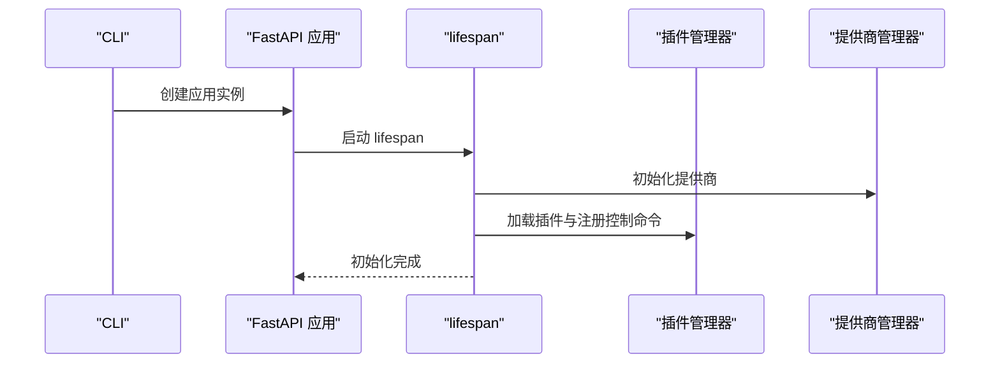
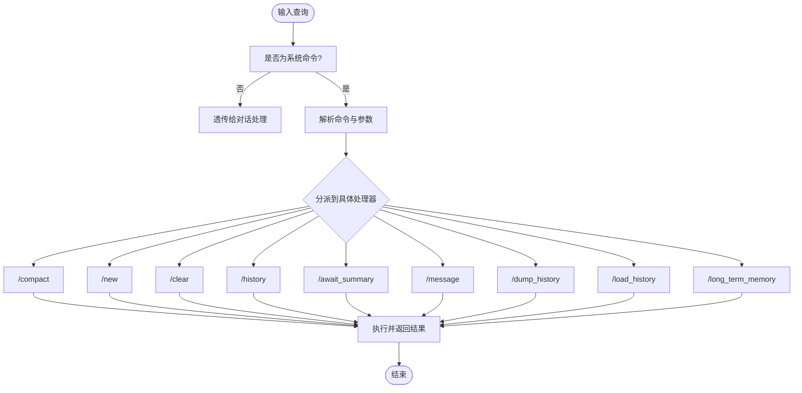
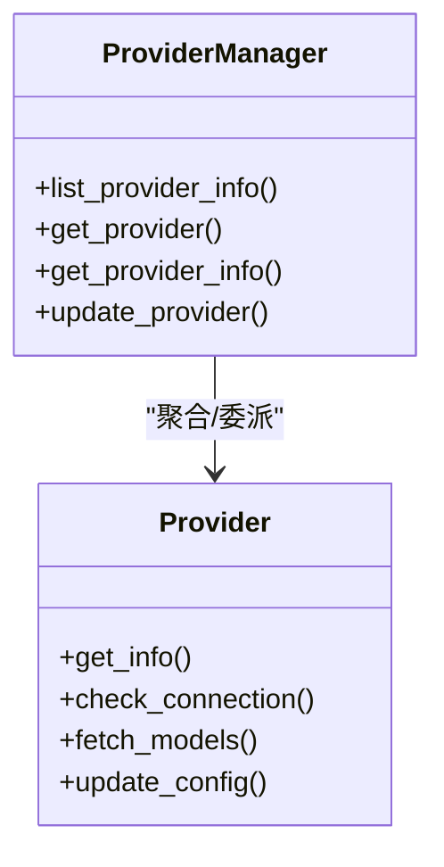
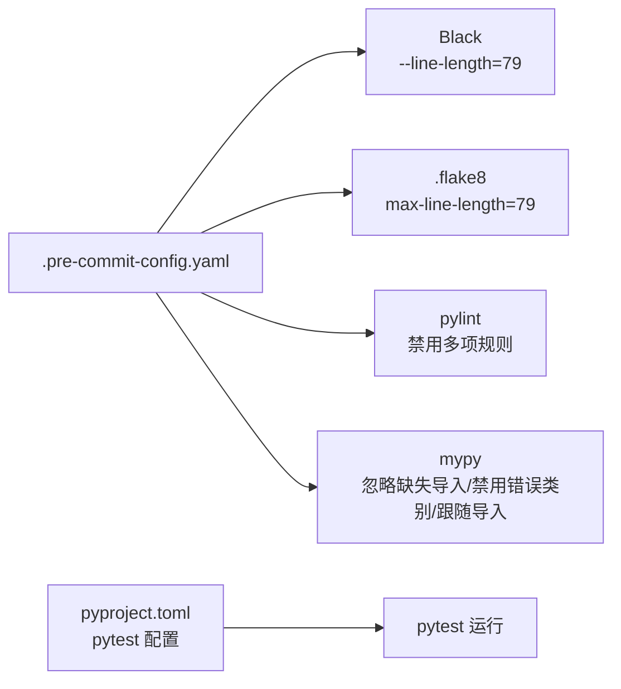

# Python 代码规范

<cite>
**本文引用的文件**
- [pyproject.toml](file://pyproject.toml)
- [.pre-commit-config.yaml](file://.pre-commit-config.yaml)
- [.flake8](file://.flake8)
- [src/copaw/__init__.py](file://src/copaw/__init__.py)
- [src/copaw/utils/logging.py](file://src/copaw/utils/logging.py)
- [src/copaw/exceptions.py](file://src/copaw/exceptions.py)
- [src/copaw/cli/main.py](file://src/copaw/cli/main.py)
- [src/copaw/app/_app.py](file://src/copaw/app/_app.py)
- [src/copaw/agents/command_handler.py](file://src/copaw/agents/command_handler.py)
- [src/copaw/providers/provider_manager.py](file://src/copaw/providers/provider_manager.py)
- [src/copaw/utils/system_info.py](file://src/copaw/utils/system_info.py)
- [src/copaw/config/config.py](file://src/copaw/config/config.py)
- [tests/unit/utils/test_command_runner.py](file://tests/unit/utils/test_command_runner.py)
- [tests/unit/providers/test_openai_provider.py](file://tests/unit/providers/test_openai_provider.py)
- [tests/unit/app/test_chat_updates.py](file://tests/unit/app/test_chat_updates.py)
</cite>

## 目录
1. [引言](#引言)
2. [项目结构](#项目结构)
3. [核心组件](#核心组件)
4. [架构总览](#架构总览)
5. [详细组件分析](#详细组件分析)
6. [依赖分析](#依赖分析)
7. [性能考虑](#性能考虑)
8. [故障排查指南](#故障排查指南)
9. [结论](#结论)
10. [附录](#附录)

## 引言
本规范面向 CoPaw 项目的 Python 代码，基于仓库中已有的配置与实践，系统性地制定 Python 编码标准与工具链规范。内容涵盖：
- PEP 8 风格指南的具体要求（缩进、空行、命名约定、导入顺序）
- 类型注解规范与函数/类的文档字符串标准
- 代码格式化工具 Black 的配置与使用（含 79 字符行长限制）
- 静态类型检查工具 mypy 的配置选项与忽略规则
- 代码质量检查工具 flake8 与 pylint 的配置与禁用项
- 实际代码示例路径（以源码片段路径代替具体代码内容），展示错误处理、异常抛出与日志记录的最佳实践

## 项目结构
CoPaw 采用“src 包 + tests 测试”组织方式，核心业务逻辑集中在 src/copaw 下，测试位于 tests。工具链通过 pyproject.toml、.pre-commit-config.yaml、.flake8 等文件统一管理。

图示来源
- [src/copaw/__init__.py:1-33](file://src/copaw/__init__.py#L1-L33)
- [src/copaw/utils/logging.py:1-199](file://src/copaw/utils/logging.py#L1-L199)
- [src/copaw/exceptions.py:1-254](file://src/copaw/exceptions.py#L1-L254)
- [src/copaw/cli/main.py:1-168](file://src/copaw/cli/main.py#L1-L168)
- [src/copaw/app/_app.py:1-685](file://src/copaw/app/_app.py#L1-L685)
- [src/copaw/agents/command_handler.py:1-530](file://src/copaw/agents/command_handler.py#L1-L530)
- [src/copaw/providers/provider_manager.py:1-800](file://src/copaw/providers/provider_manager.py#L1-L800)
- [src/copaw/utils/system_info.py:1-229](file://src/copaw/utils/system_info.py#L1-L229)
- [src/copaw/config/config.py:1-800](file://src/copaw/config/config.py#L1-L800)
- [tests/unit/utils/test_command_runner.py:1-600](file://tests/unit/utils/test_command_runner.py#L1-L600)
- [tests/unit/providers/test_openai_provider.py:1-269](file://tests/unit/providers/test_openai_provider.py#L1-L269)
- [tests/unit/app/test_chat_updates.py:1-142](file://tests/unit/app/test_chat_updates.py#L1-L142)

章节来源
- [pyproject.toml:1-124](file://pyproject.toml#L1-L124)
- [.pre-commit-config.yaml:1-121](file://.pre-commit-config.yaml#L1-L121)
- [.flake8:1-12](file://.flake8#L1-L12)

## 核心组件
- 日志系统：统一的日志初始化、着色输出、文件轮转与过滤策略，确保跨平台一致性与可维护性。
- 异常体系：围绕业务与外部服务抽象统一异常基类，并提供模型相关异常转换器，便于上层统一处理。
- CLI 与应用入口：延迟加载与计时统计，减少启动时间；应用生命周期管理与中间件注册。
- 命令处理器：对话系统命令解析与执行，包含历史、压缩、清理等能力。
- 提供商管理器：内置与插件提供商的统一管理、模型发现与连接校验。
- 配置模型：基于 Pydantic 的强类型配置，覆盖企业版数据库/缓存、通道、运行参数等。
- 测试实践：异步进程管理、提供商连接校验、聊天更新语义等，体现错误处理与断言风格。

章节来源
- [src/copaw/utils/logging.py:1-199](file://src/copaw/utils/logging.py#L1-L199)
- [src/copaw/exceptions.py:1-254](file://src/copaw/exceptions.py#L1-L254)
- [src/copaw/cli/main.py:1-168](file://src/copaw/cli/main.py#L1-L168)
- [src/copaw/app/_app.py:1-685](file://src/copaw/app/_app.py#L1-L685)
- [src/copaw/agents/command_handler.py:1-530](file://src/copaw/agents/command_handler.py#L1-L530)
- [src/copaw/providers/provider_manager.py:1-800](file://src/copaw/providers/provider_manager.py#L1-L800)
- [src/copaw/config/config.py:1-800](file://src/copaw/config/config.py#L1-L800)
- [tests/unit/utils/test_command_runner.py:1-600](file://tests/unit/utils/test_command_runner.py#L1-L600)
- [tests/unit/providers/test_openai_provider.py:1-269](file://tests/unit/providers/test_openai_provider.py#L1-L269)
- [tests/unit/app/test_chat_updates.py:1-142](file://tests/unit/app/test_chat_updates.py#L1-L142)

## 架构总览
下图展示了从 CLI 到应用服务、再到提供商与日志系统的调用关系与职责边界。

图示来源
- [src/copaw/cli/main.py:1-168](file://src/copaw/cli/main.py#L1-L168)
- [src/copaw/__init__.py:1-33](file://src/copaw/__init__.py#L1-L33)
- [src/copaw/app/_app.py:1-685](file://src/copaw/app/_app.py#L1-L685)
- [src/copaw/utils/logging.py:1-199](file://src/copaw/utils/logging.py#L1-L199)
- [src/copaw/providers/provider_manager.py:1-800](file://src/copaw/providers/provider_manager.py#L1-L800)
- [src/copaw/config/config.py:1-800](file://src/copaw/config/config.py#L1-L800)

## 详细组件分析

### 日志系统设计与最佳实践
- 统一日志命名空间与级别控制，避免第三方库污染输出。
- 控制台彩色输出与文件处理器分离，支持跨平台终端兼容。
- 访问日志过滤器按路径子串抑制噪声。
- 文件处理器在不同平台采用不同策略，避免锁冲突。

图示来源
- [src/copaw/utils/logging.py:1-199](file://src/copaw/utils/logging.py#L1-L199)

章节来源
- [src/copaw/utils/logging.py:1-199](file://src/copaw/utils/logging.py#L1-L199)
- [src/copaw/__init__.py:1-33](file://src/copaw/__init__.py#L1-L33)

### 异常体系与转换器
- 统一业务异常基类，便于上层捕获与分类处理。
- 模型相关异常转换器：根据状态码与关键字映射到统一异常类型，保留原始错误上下文。

图示来源
- [src/copaw/exceptions.py:1-254](file://src/copaw/exceptions.py#L1-L254)

章节来源
- [src/copaw/exceptions.py:1-254](file://src/copaw/exceptions.py#L1-L254)

### CLI 与应用生命周期
- CLI 使用 Click，延迟加载子命令，记录导入耗时，保证启动性能。
- 应用服务在 lifespan 中完成企业版基础设施初始化、插件系统加载、中间件注册与指标监控。

图示来源
- [src/copaw/cli/main.py:1-168](file://src/copaw/cli/main.py#L1-L168)
- [src/copaw/app/_app.py:1-685](file://src/copaw/app/_app.py#L1-L685)

章节来源
- [src/copaw/cli/main.py:1-168](file://src/copaw/cli/main.py#L1-L168)
- [src/copaw/app/_app.py:1-685](file://src/copaw/app/_app.py#L1-L685)

### 命令处理器与错误处理
- 对话系统命令解析与执行，包含历史查看、压缩、清理、长程记忆等。
- 错误处理遵循“抛出明确异常 + 记录日志 + 返回用户可读提示”的原则。

图示来源
- [src/copaw/agents/command_handler.py:1-530](file://src/copaw/agents/command_handler.py#L1-L530)

章节来源
- [src/copaw/agents/command_handler.py:1-530](file://src/copaw/agents/command_handler.py#L1-L530)

### 提供商管理器与模型发现
- 内置多家提供商与默认模型清单，支持本地与云端模型切换。
- 提供连接校验、模型列表获取与配置更新能力。

图示来源
- [src/copaw/providers/provider_manager.py:1-800](file://src/copaw/providers/provider_manager.py#L1-L800)

章节来源
- [src/copaw/providers/provider_manager.py:1-800](file://src/copaw/providers/provider_manager.py#L1-L800)

### 配置模型与企业功能
- 基于 Pydantic 的强类型配置，覆盖数据库、Redis、通道、运行参数等。
- 企业版功能开关与审计日志、任务管理、工作流引擎等配置项。

章节来源
- [src/copaw/config/config.py:1-800](file://src/copaw/config/config.py#L1-L800)

### 测试中的错误处理与断言
- 异步进程管理与优雅关闭流程，覆盖超时与强制终止场景。
- 提供商连接校验与模型发现的单元测试，验证错误路径与返回值。

章节来源
- [tests/unit/utils/test_command_runner.py:1-600](file://tests/unit/utils/test_command_runner.py#L1-L600)
- [tests/unit/providers/test_openai_provider.py:1-269](file://tests/unit/providers/test_openai_provider.py#L1-L269)
- [tests/unit/app/test_chat_updates.py:1-142](file://tests/unit/app/test_chat_updates.py#L1-L142)

## 依赖分析
- 工具链通过 pre-commit 钩子统一执行格式化、类型检查与质量检查。
- mypy 配置启用忽略缺失导入、禁用若干错误类别、跟随导入策略与显式包基础。
- Black 限制行长为 79，flake8 同样设置行长与忽略项，pylint 禁用多项规则以适配项目现状。
- 项目构建与脚本由 pyproject.toml 管理，pytest 配置用于异步模式与标记。

图示来源
- [.pre-commit-config.yaml:1-121](file://.pre-commit-config.yaml#L1-L121)
- [.flake8:1-12](file://.flake8#L1-L12)
- [pyproject.toml:118-124](file://pyproject.toml#L118-L124)

章节来源
- [.pre-commit-config.yaml:1-121](file://.pre-commit-config.yaml#L1-L121)
- [.flake8:1-12](file://..flake8#L1-L12)
- [pyproject.toml:118-124](file://pyproject.toml#L118-L124)

## 性能考虑
- CLI 延迟加载与导入计时，降低启动时间。
- 应用生命周期内仅在必要时初始化企业版基础设施，避免无谓开销。
- 日志与文件处理器分离，减少 IO 抖动；访问日志过滤降低噪音。
- 提供商管理器与模型发现采用异步与缓存策略，减少重复请求。

## 故障排查指南
- 日志级别与命名空间：确认日志命名空间为 copaw，避免被第三方库覆盖。
- 异常转换：若上游模型异常未被正确转换，检查转换器的关键字匹配与状态码映射。
- CLI 启动慢：关注导入计时日志，定位耗时模块并优化延迟加载。
- 应用关闭：确保插件关闭钩子与本地模型服务器优雅关闭，避免资源泄漏。

章节来源
- [src/copaw/utils/logging.py:1-199](file://src/copaw/utils/logging.py#L1-L199)
- [src/copaw/exceptions.py:1-254](file://src/copaw/exceptions.py#L1-L254)
- [src/copaw/cli/main.py:1-168](file://src/copaw/cli/main.py#L1-L168)
- [src/copaw/app/_app.py:1-685](file://src/copaw/app/_app.py#L1-L685)

## 结论
本规范结合 CoPaw 项目的现有配置与实现，给出了 Python 代码风格、类型注解、格式化与静态检查、质量检查工具的落地方案，并通过关键组件与测试用例展示了错误处理与日志记录的最佳实践。建议团队在开发过程中严格遵循本规范，配合 pre-commit 钩子与 CI 流水线，持续提升代码质量与可维护性。

## 附录

### PEP 8 风格指南要点（结合项目实践）
- 缩进：统一使用 4 空格缩进，避免混用制表符。
- 空行：模块级函数/类之间留两行空行；方法内部适当空行分隔逻辑块。
- 命名约定：
  - 模块名：小写、下划线
  - 类名：PascalCase
  - 函数/方法：snake_case
  - 常量：UPPER_CASE
  - 受保护成员：_single_leading_underscore
- 导入顺序：
  - 标准库
  - 第三方库
  - 项目内相对导入
  - 同一包内的相对导入
  - 在各组之间插入空行分隔

章节来源
- [src/copaw/agents/command_handler.py:1-530](file://src/copaw/agents/command_handler.py#L1-L530)
- [src/copaw/providers/provider_manager.py:1-800](file://src/copaw/providers/provider_manager.py#L1-L800)
- [src/copaw/utils/system_info.py:1-229](file://src/copaw/utils/system_info.py#L1-L229)

### 类型注解规范与文档字符串标准
- 函数/方法：
  - 参数与返回值均应添加类型注解
  - 复杂类型使用 typing 中的泛型（如 List、Dict、Optional 等）
  - 文档字符串使用三重引号，首行简述用途，后续段落描述参数、返回值、异常与示例
- 类：
  - 字段注解与构造函数参数保持一致
  - 文档字符串描述类职责与关键行为
- Pydantic 模型：
  - 字段使用类型注解与默认值
  - 使用 Field() 明确字段约束与描述
  - 复杂校验使用 model_validator

章节来源
- [src/copaw/config/config.py:1-800](file://src/copaw/config/config.py#L1-L800)
- [src/copaw/providers/provider_manager.py:1-800](file://src/copaw/providers/provider_manager.py#L1-L800)

### Black 配置与使用
- 行长限制：79 字符
- 排除目录：技能脚本与打包脚本目录
- 使用方式：通过 pre-commit 钩子自动执行，或手动运行 black src/ tests/

章节来源
- [.pre-commit-config.yaml:54-59](file://.pre-commit-config.yaml#L54-L59)

### mypy 配置选项与忽略规则
- 忽略缺失导入：--ignore-missing-imports
- 禁用错误类别：var-annotated、union-attr、assignment、attr-defined、import-untyped、truthy-function
- 跟随导入策略：--follow-imports=skip
- 显式包基础：--explicit-package-bases
- 排除范围：文档、HTML、技能相关文件与特定生成文件

章节来源
- [.pre-commit-config.yaml:31-53](file://.pre-commit-config.yaml#L31-L53)

### flake8 配置
- 行长：79
- 忽略项：F401（未使用导入）、F403（from 模块导入所有）、W503（换行操作符）、E731（lambda 赋值）

章节来源
- [.flake8:1-12](file://.flake8#L1-L12)

### pylint 配置
- 禁用规则：W0511、W0718、W0122、C0103、R0913、E0401、E1101、C0415、W0603、R1705、R0914、E0601、W0602、W0604、R0801、R0902、R0903、C0123、W0231、W1113、W0221、R0401、W0632、W0123、C3001、W0201、C0302、W1203、C2801、C0114、C0115、C0116
- 排除范围：文档、pb2/ grpc、演示与 Markdown 文件、技能相关文件

章节来源
- [.pre-commit-config.yaml:66-113](file://.pre-commit-config.yaml#L66-L113)

### 实际代码示例（以路径代替代码）
- 错误处理与异常抛出
  - [抛出业务异常的示例路径:520-525](file://src/copaw/agents/command_handler.py#L520-L525)
  - [模型异常转换器示例路径:165-254](file://src/copaw/exceptions.py#L165-L254)
- 日志记录最佳实践
  - [包初始化日志与调试计时:22-32](file://src/copaw/__init__.py#L22-L32)
  - [应用生命周期日志与文件处理器:167-168](file://src/copaw/app/_app.py#L167-L168)
  - [日志格式化与过滤器:119-154](file://src/copaw/utils/logging.py#L119-L154)
- 测试中的错误处理
  - [命令运行器异常与进程关闭:53-91](file://tests/unit/utils/test_command_runner.py#L53-L91)
  - [提供商连接校验失败路径:40-54](file://tests/unit/providers/test_openai_provider.py#L40-L54)