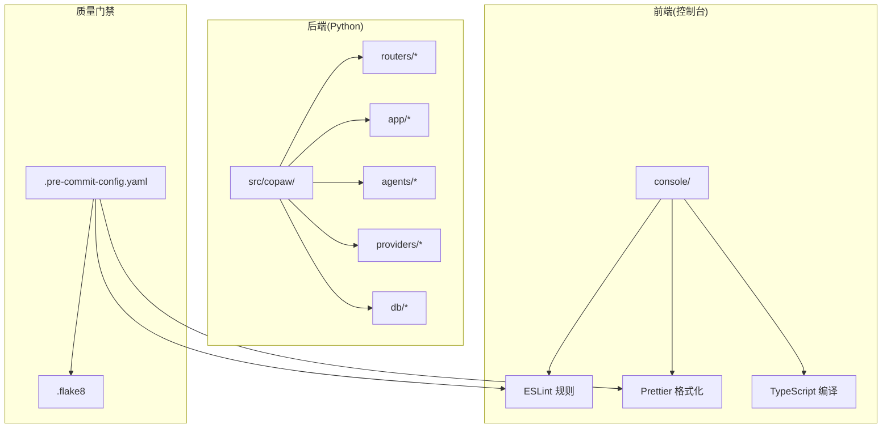
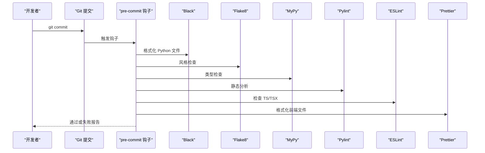
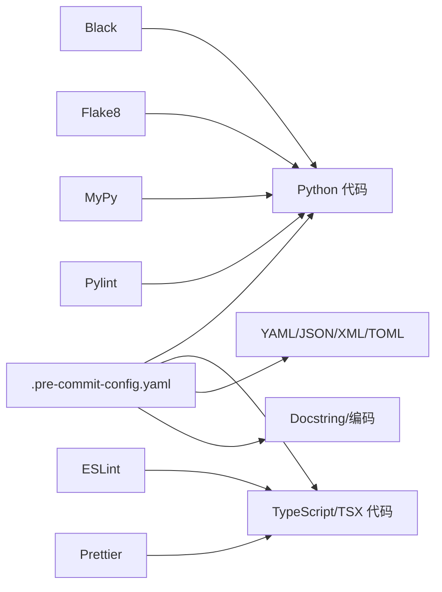

# 代码规范

<cite>
**本文引用的文件**
- [.pre-commit-config.yaml](file://.pre-commit-config.yaml)
- [.flake8](file://.flake8)
- [pyproject.toml](file://pyproject.toml)
- [console/eslint.config.js](file://console/eslint.config.js)
- [console/package.json](file://console/package.json)
- [CONTRIBUTING.md](file://CONTRIBUTING.md)
- [src/copaw/__init__.py](file://src/copaw/__init__.py)
- [src/copaw/agents/command_handler.py](file://src/copaw/agents/command_handler.py)
- [src/copaw/app/channels/base.py](file://src/copaw/app/channels/base.py)
- [src/copaw/providers/provider.py](file://src/copaw/providers/provider.py)
- [console/src/components/AgentSelector/index.tsx](file://console/src/components/AgentSelector/index.tsx)
- [console/src/api/modules/agent.ts](file://console/src/api/modules/agent.ts)
</cite>

## 目录
1. [引言](#引言)
2. [项目结构](#项目结构)
3. [核心组件](#核心组件)
4. [架构总览](#架构总览)
5. [详细组件分析](#详细组件分析)
6. [依赖关系分析](#依赖关系分析)
7. [性能考量](#性能考量)
8. [故障排查指南](#故障排查指南)
9. [结论](#结论)
10. [附录](#附录)

## 引言
本文件为 CoPaw 项目的统一代码规范与最佳实践指南，覆盖后端 Python 与前端 TypeScript/JavaScript 的风格、命名、注释与组织原则，并结合仓库已有的 pre-commit、ESLint、Flake8、Black、Pylint 等工具链，给出可落地的质量门禁与自动化流程。同时提供代码审查清单、重构指导与性能优化建议，帮助团队在功能演进中保持一致性与可维护性。

## 项目结构
CoPaw 采用“多语言混合工程”组织方式：
- 后端 Python 包位于 src/copaw，包含应用模块、路由、通道、技能、工具等。
- 前端控制台位于 console，使用 Vite + React + TypeScript，通过 ESLint、Prettier、TypeScript 编译器进行质量保障。
- 质量门禁通过 pre-commit 集成多个检查器，覆盖 Python 与前端代码。

图表来源
- [.pre-commit-config.yaml:1-121](file://.pre-commit-config.yaml#L1-L121)
- [console/eslint.config.js:1-29](file://console/eslint.config.js#L1-L29)
- [console/package.json:1-63](file://console/package.json#L1-L63)

章节来源
- [.pre-commit-config.yaml:1-121](file://.pre-commit-config.yaml#L1-L121)
- [console/eslint.config.js:1-29](file://console/eslint.config.js#L1-L29)
- [console/package.json:1-63](file://console/package.json#L1-L63)

## 核心组件
- Python 工程与包管理：通过 pyproject.toml 定义项目元数据、依赖与可选特性；pytest 配置用于测试执行。
- 前端工程：Vite + React + TypeScript，ESLint 使用 typescript-eslint 推荐规则集，Prettier 作为统一格式化工具。
- 质量门禁：pre-commit 集成 AST 检查、YAML/JSON/XML/TOML 校验、docstring 顺序、编码、私钥检测、尾随空白、类型检查（mypy）、格式化（black）、风格检查（flake8）、静态分析（pylint）、以及前端格式化（prettier）。

章节来源
- [pyproject.toml:1-124](file://pyproject.toml#L1-L124)
- [CONTRIBUTING.md:68-86](file://CONTRIBUTING.md#L68-L86)
- [.pre-commit-config.yaml:1-121](file://.pre-commit-config.yaml#L1-L121)
- [console/eslint.config.js:1-29](file://console/eslint.config.js#L1-L29)
- [console/package.json:1-63](file://console/package.json#L1-L63)

## 架构总览
下图展示质量门禁在提交流程中的作用：开发者本地运行 pre-commit，确保 Python 与前端代码满足格式、类型、风格与静态分析要求；CI 将复用相同规则以保证合并分支的一致性。

图表来源
- [.pre-commit-config.yaml:1-121](file://.pre-commit-config.yaml#L1-L121)
- [console/eslint.config.js:1-29](file://console/eslint.config.js#L1-L29)
- [console/package.json:12-17](file://console/package.json#L12-L17)

章节来源
- [.pre-commit-config.yaml:1-121](file://.pre-commit-config.yaml#L1-L121)
- [CONTRIBUTING.md:68-86](file://CONTRIBUTING.md#L68-L86)

## 详细组件分析

### Python 代码风格与命名规范
- 文件与模块
  - 文件编码：统一 UTF-8，首行声明编码。
  - 模块导入：遵循分层与清晰依赖，避免循环导入；第三方库与标准库之间留空行分隔。
  - 包初始化：在包级 __init__.py 中进行日志初始化与环境变量加载，确保模块导入时的可观测性。
- 函数与类
  - 函数命名：使用小驼峰或下划线分隔，语义明确；参数与返回值类型标注完整。
  - 类命名：采用 PascalCase；抽象基类以 Base 前缀区分。
  - 方法组织：公共方法在前，受保护方法在后；私有方法置于末尾，便于阅读。
- 命名约定
  - 常量：全大写 + 下划线分隔。
  - 变量：小写 + 下划线分隔；避免缩写，除非是广泛接受的缩写。
  - 类型别名：使用 typing 中的泛型与联合类型，提升可读性。
- 注释与文档字符串
  - 模块级文档字符串：简述模块职责与边界。
  - 类与函数：使用三重引号文档字符串，描述用途、参数、返回值与异常；必要时提供示例路径。
  - 行内注释：仅在复杂逻辑处解释“为什么”，而非“做什么”。
- 错误处理
  - 明确抛出具体异常类型，携带上下文信息；避免裸 pass 或忽略错误。
- 代码组织
  - 将业务逻辑与基础设施解耦；将配置与常量集中管理。
  - 对外暴露稳定的接口，内部实现细节封装在模块内。

章节来源
- [src/copaw/__init__.py:1-33](file://src/copaw/__init__.py#L1-L33)
- [src/copaw/agents/command_handler.py:1-530](file://src/copaw/agents/command_handler.py#L1-L530)
- [src/copaw/app/channels/base.py:1-800](file://src/copaw/app/channels/base.py#L1-L800)
- [src/copaw/providers/provider.py:1-314](file://src/copaw/providers/provider.py#L1-L314)

### Python 代码质量与格式化
- Black
  - 行宽限制：79 字符；统一缩进与空格策略。
  - 适用范围：排除 skills 与打包脚本目录，避免对生成内容与第三方脚本格式化。
- Flake8
  - 行宽：79；忽略部分 W503、F401、F403、E731 等规则，聚焦关键问题。
  - 排除：scripts 与特定 RPC 目录。
- MyPy
  - 忽略缺失导入与若干类型错误码，启用 follow-imports=skip 与显式包基础，减少噪声。
  - 排除：pb2.py、grpc.py、docs、*.html、skills 目录。
- Pylint
  - 屏蔽若干开发期规则（如命名规范、过长参数列表、未使用导入等），保留关键安全与结构性检查。
  - 排除：docs、pb2.py、grpc.py、demo、md、html、skills 目录。

章节来源
- [.pre-commit-config.yaml:54-113](file://.pre-commit-config.yaml#L54-L113)
- [.flake8:1-12](file://.flake8#L1-L12)

### TypeScript/JavaScript 前端代码规范
- ESLint 配置
  - 使用 typescript-eslint 推荐规则集，扩展 React Hooks 与 React Refresh 插件。
  - 语言选项启用 ECMAScript 2020，浏览器全局变量可见。
  - React Refresh 仅导出组件警告，允许常量导出。
- 格式化与类型检查
  - Prettier 版本固定为 3.0.0，统一前端格式化。
  - TypeScript 编译器参与格式化检查（tsc -b --noEmit && prettier --check .）。
- 组件与状态
  - React 组件使用函数式与 hooks；避免在渲染阶段进行重型计算。
  - 状态管理集中在 Zustand 等轻量方案，避免过度拆分。
- API 调用
  - 统一通过 request 封装，集中处理错误与超时；对外暴露清晰的 API 模块化接口。
- 样式与主题
  - 使用 Less 模块化样式，组件样式与逻辑分离；主题切换通过上下文管理。

章节来源
- [console/eslint.config.js:1-29](file://console/eslint.config.js#L1-L29)
- [console/package.json:1-63](file://console/package.json#L1-L63)
- [console/src/components/AgentSelector/index.tsx:1-197](file://console/src/components/AgentSelector/index.tsx#L1-L197)
- [console/src/api/modules/agent.ts:1-86](file://console/src/api/modules/agent.ts#L1-L86)

### 文档字符串规范与注释标准
- Python
  - 模块：简述职责与边界。
  - 类：描述用途、构造参数与关键行为。
  - 函数：参数、返回值、异常、副作用与性能注意事项。
  - 示例路径：在文档字符串中提供调用示例或参考路径，便于集成与测试。
- 前端
  - 复杂组件与工具函数：提供用途、输入输出与注意事项。
  - API 模块：统一注释风格，便于自动生成文档。

章节来源
- [src/copaw/agents/command_handler.py:1-530](file://src/copaw/agents/command_handler.py#L1-L530)
- [console/src/components/AgentSelector/index.tsx:1-197](file://console/src/components/AgentSelector/index.tsx#L1-L197)

### 代码组织原则
- 分层与职责
  - 应用层：路由与控制器，负责请求入口与响应封装。
  - 业务层：领域模型与服务，承载核心业务规则。
  - 基础设施层：数据库、缓存、外部服务客户端。
- 模块化
  - 每个功能域独立模块，避免跨域直接耦合；通过接口与协议解耦。
- 可测试性
  - 优先使用纯函数与可注入依赖；对外部依赖进行抽象与模拟。

章节来源
- [src/copaw/app/channels/base.py:1-800](file://src/copaw/app/channels/base.py#L1-L800)
- [src/copaw/providers/provider.py:1-314](file://src/copaw/providers/provider.py#L1-L314)

### pre-commit 钩子与自动化流程
- 钩子清单
  - AST/文档/编码/敏感信息/空白：基础质量与安全检查。
  - 追加尾随逗号：统一集合字面量格式。
  - MyPy：类型检查，排除生成与文档文件。
  - Black：Python 格式化，行宽 79。
  - Flake8：风格检查，忽略若干规则。
  - Pylint：静态分析，屏蔽若干开发期规则。
  - Prettier：前端格式化，限定 ts/tsx 文件。
- 运行策略
  - 本地安装钩子后，提交前自动运行；若失败需修复并重新提交。
  - CI 复用相同规则，确保合并分支一致。

章节来源
- [.pre-commit-config.yaml:1-121](file://.pre-commit-config.yaml#L1-L121)
- [CONTRIBUTING.md:68-86](file://CONTRIBUTING.md#L68-L86)

### 代码审查清单
- 功能正确性
  - 是否覆盖边界条件与异常路径？
  - 是否提供最小可验证示例或测试用例路径？
- 可读性与一致性
  - 命名是否清晰且符合约定？
  - 文档字符串是否完整、示例是否准确？
  - 格式是否符合 Black/ESLint/Prettier 规则？
- 性能与资源
  - 是否存在不必要的同步阻塞或重复计算？
  - 是否合理使用缓存与异步任务？
- 安全与健壮性
  - 是否处理了空值、越界与异常输入？
  - 是否避免硬编码密钥与敏感信息？
- 变更影响
  - 是否破坏现有 API 或行为？
  - 是否需要更新文档或迁移说明？

章节来源
- [CONTRIBUTING.md:208-226](file://CONTRIBUTING.md#L208-L226)

### 重构指导
- 渐进式改进
  - 先做小步重构，确保每次提交通过 pre-commit 与测试。
  - 优先消除重复代码与深层嵌套。
- 抽象与解耦
  - 将复杂表达式抽取为函数或变量；将跨模块逻辑抽取为服务。
  - 使用策略模式或工厂模式替换大量 if/else。
- 测试驱动
  - 在重构前后均运行相关测试，确保行为不变。
- 文档同步
  - 更新涉及的文档字符串与用户文档，保持内外一致。

章节来源
- [src/copaw/agents/command_handler.py:1-530](file://src/copaw/agents/command_handler.py#L1-L530)
- [src/copaw/app/channels/base.py:1-800](file://src/copaw/app/channels/base.py#L1-L800)

### 性能优化建议
- Python
  - 使用类型注解与 MyPy 提前发现潜在性能问题。
  - 避免在热路径上进行昂贵的字符串拼接与正则匹配；使用 join 或编译后的正则对象。
  - 利用异步 I/O 与并发，减少阻塞；对长耗时任务使用队列与后台任务。
- 前端
  - 控制组件渲染次数，使用 memo 与浅比较；避免在渲染中创建新对象。
  - 图片与媒体资源懒加载；合理拆分包体，使用动态导入。
  - 使用 React DevTools Profiler 定位热点组件。

章节来源
- [.pre-commit-config.yaml:31-53](file://.pre-commit-config.yaml#L31-L53)
- [console/package.json:12-17](file://console/package.json#L12-L17)

## 依赖关系分析
下图展示质量工具与项目文件之间的依赖关系，强调 pre-commit 对 Python 与前端的统一约束。

图表来源
- [.pre-commit-config.yaml:1-121](file://.pre-commit-config.yaml#L1-L121)
- [console/eslint.config.js:1-29](file://console/eslint.config.js#L1-L29)
- [console/package.json:12-17](file://console/package.json#L12-L17)

章节来源
- [.pre-commit-config.yaml:1-121](file://.pre-commit-config.yaml#L1-L121)

## 性能考量
- 代码层面
  - 优先使用生成器与迭代器，降低内存占用。
  - 避免在循环中进行重复的 I/O 或网络请求。
- 前端层面
  - 合理使用虚拟滚动与分页；对高频事件进行节流/防抖。
  - 将非关键逻辑移至 Web Worker 或后台任务。
- 工具层面
  - 利用 mypy 的类型推断减少运行时错误与调试成本。
  - ESLint 与 Prettier 在提交前拦截低级问题，降低回归风险。

章节来源
- [.pre-commit-config.yaml:31-113](file://.pre-commit-config.yaml#L31-L113)
- [console/eslint.config.js:1-29](file://console/eslint.config.js#L1-L29)
- [console/package.json:12-17](file://console/package.json#L12-L17)

## 故障排查指南
- pre-commit 失败
  - 检查 Black/Flake8/MyPy/Pylint/ESLint/Prettier 的报错信息，逐项修复。
  - 若修改被自动格式化，提交变更后再运行一次钩子直至通过。
- Python 类型与风格问题
  - 关注 MyPy 的缺失导入与类型不匹配；根据 Flake8 规则调整格式。
- 前端格式化与类型检查
  - 使用 npm run format:check 与 tsc -b --noEmit 验证；修复 Prettier 冲突。
- 提交与 PR
  - 遵循 Conventional Commits 规范；PR 标题与描述清晰、可追溯。

章节来源
- [CONTRIBUTING.md:23-66](file://CONTRIBUTING.md#L23-L66)
- [CONTRIBUTING.md:68-86](file://CONTRIBUTING.md#L68-L86)
- [.pre-commit-config.yaml:1-121](file://.pre-commit-config.yaml#L1-L121)
- [console/package.json:12-17](file://console/package.json#L12-L17)

## 结论
通过统一的 Python 与前端代码规范、完善的 pre-commit 工具链与清晰的代码审查流程，CoPaw 能够在快速迭代的同时保持高质量与可维护性。建议团队在日常开发中严格遵循本文规范，并持续优化工具链与测试覆盖，以支撑更大规模的功能演进。

## 附录
- 质量门禁命令
  - 安装钩子：pip install -e ".[dev,full]" && pre-commit install
  - 全量检查：pre-commit run --all-files
  - 前端格式化：cd console && npm run format
- 参考贡献指南
  - 提交消息与 PR 标题格式、平台支持与文档更新要求详见贡献指南。

章节来源
- [CONTRIBUTING.md:23-66](file://CONTRIBUTING.md#L23-L66)
- [CONTRIBUTING.md:68-86](file://CONTRIBUTING.md#L68-L86)