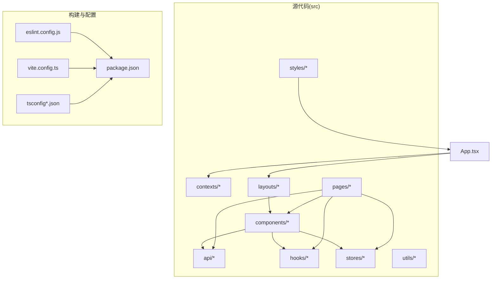
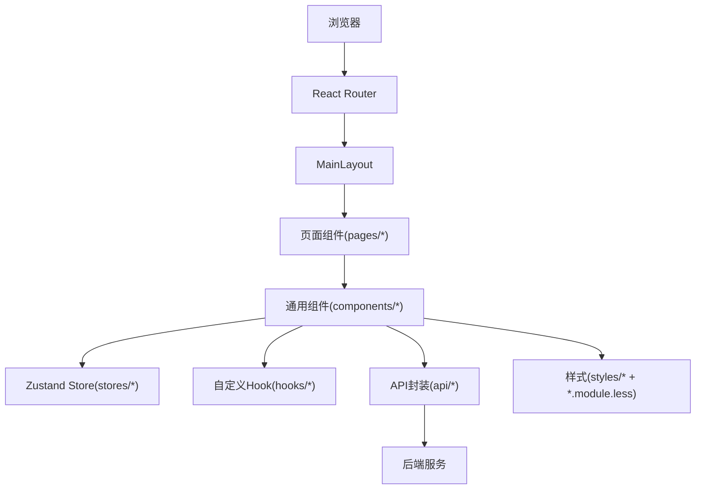
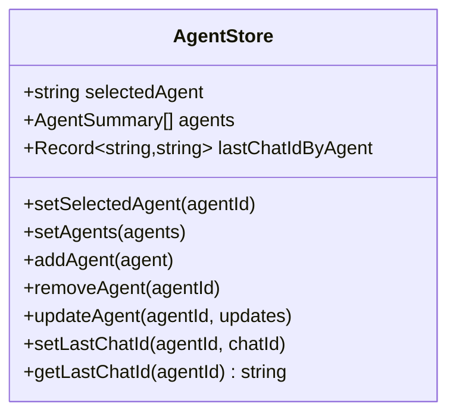
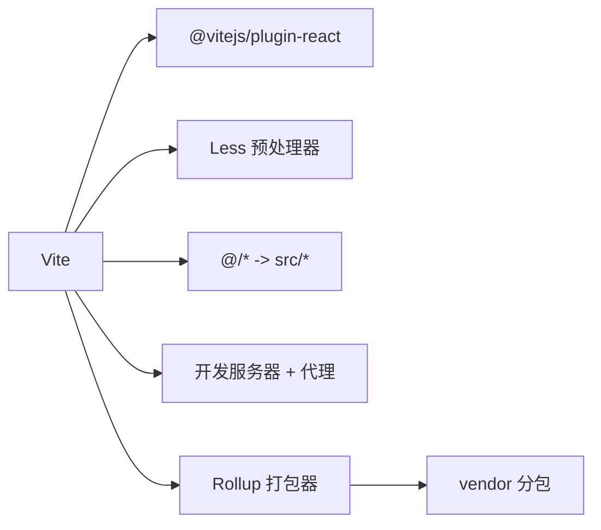

# 前端代码规范

<cite>
**本文引用的文件**
- [eslint.config.js](file://console/eslint.config.js)
- [package.json](file://console/package.json)
- [tsconfig.json](file://console/tsconfig.json)
- [tsconfig.app.json](file://console/tsconfig.app.json)
- [vite.config.ts](file://console/vite.config.ts)
- [main.tsx](file://console/src/main.tsx)
- [App.tsx](file://console/src/App.tsx)
- [AgentSelector/index.tsx](file://console/src/components/AgentSelector/index.tsx)
- [PageHeader/index.tsx](file://console/src/components/PageHeader/index.tsx)
- [useAppMessage.ts](file://console/src/hooks/useAppMessage.ts)
- [agentStore.ts](file://console/src/stores/agentStore.ts)
- [ThemeContext.tsx](file://console/src/contexts/ThemeContext.tsx)
- [layout.css](file://console/src/styles/layout.css)
</cite>

## 目录
1. [引言](#引言)
2. [项目结构](#项目结构)
3. [核心组件](#核心组件)
4. [架构总览](#架构总览)
5. [详细组件分析](#详细组件分析)
6. [依赖分析](#依赖分析)
7. [性能考虑](#性能考虑)
8. [故障排查指南](#故障排查指南)
9. [结论](#结论)
10. [附录](#附录)

## 引言
本规范面向 CoPaw 控制台前端（React + TypeScript）团队，旨在统一编码风格、提升可维护性与一致性，并建立可执行的质量门槛。内容覆盖 TypeScript 类型设计、ESLint 规则、Prettier 格式化、React 组件开发规范、CSS 模块化与主题定制、文件组织与命名约定、代码审查清单以及常见问题处理。

## 项目结构
控制台前端位于 console 目录，采用 Vite + React + TypeScript 技术栈，配合 Ant Design 与自研设计体系、Zustand 状态管理、i18n 国际化与 Less 样式。核心目录与职责概览：
- src/api：后端接口封装与类型导出
- src/components：可复用 UI 组件（含样式模块）
- src/contexts：全局上下文（如主题）
- src/hooks：自定义 Hook
- src/layouts：布局组件
- src/pages：页面级路由组件
- src/stores：轻量状态管理（Zustand）
- src/styles：全局样式与覆盖
- src/utils：工具方法
- 配置：eslint.config.js、tsconfig.*.json、vite.config.ts、package.json

图表来源
- [App.tsx:1-228](file://console/src/App.tsx#L1-L228)
- [vite.config.ts:1-118](file://console/vite.config.ts#L1-L118)
- [package.json:1-63](file://console/package.json#L1-L63)

章节来源
- [vite.config.ts:1-118](file://console/vite.config.ts#L1-L118)
- [package.json:1-63](file://console/package.json#L1-L63)
- [tsconfig.json:1-8](file://console/tsconfig.json#L1-L8)

## 核心组件
- 应用入口与全局配置：应用根组件负责国际化、主题、路由与鉴权守卫；入口文件对控制台特定警告进行过滤以降低噪音。
- 主题系统：通过上下文提供深浅/系统主题切换与持久化，自动在 html 上添加 dark-mode 类名以便全局样式生效。
- 状态管理：Zustand 轻量存储，支持持久化到 sessionStorage，用于代理选择等场景。
- 自定义 Hook：useAppMessage 从 Ant Design 的 App 组件中获取消息实例，确保与 ConfigProvider 前缀一致。
- 全局样式：通过 CSS 变量与暗色模式类名覆盖 Ant Design 组件库样式，保证统一视觉。

章节来源
- [main.tsx:1-31](file://console/src/main.tsx#L1-L31)
- [App.tsx:1-228](file://console/src/App.tsx#L1-L228)
- [ThemeContext.tsx:1-105](file://console/src/contexts/ThemeContext.tsx#L1-L105)
- [agentStore.ts:1-89](file://console/src/stores/agentStore.ts#L1-L89)
- [useAppMessage.ts:1-16](file://console/src/hooks/useAppMessage.ts#L1-L16)
- [layout.css:1-800](file://console/src/styles/layout.css#L1-L800)

## 架构总览
前端采用“路由驱动 + 组件化 + 状态管理”的分层架构。路由在 App 内部集中配置，主布局包裹各页面；组件通过 props、context、store 解耦；API 层统一管理请求与类型；样式采用 CSS Modules 与全局覆盖结合。

图表来源
- [App.tsx:200-216](file://console/src/App.tsx#L200-L216)
- [AgentSelector/index.tsx:1-197](file://console/src/components/AgentSelector/index.tsx#L1-L197)
- [agentStore.ts:19-88](file://console/src/stores/agentStore.ts#L19-L88)

## 详细组件分析

### TypeScript 编码规范
- 严格编译选项：启用严格模式、未使用局部变量与参数检查、无副作用导入检查等，确保类型安全与最小化冗余。
- 路径别名：通过 tsconfig 配置 @/* 到 src，简化导入路径。
- 接口与类型设计：优先使用只读、联合类型与字面量类型，避免 any；对外暴露稳定的类型导出，便于 API 层消费。
- 泛型使用：在通用容器或工具函数中谨慎使用，保持约束明确，避免过度抽象导致可读性下降。

章节来源
- [tsconfig.app.json:1-31](file://console/tsconfig.app.json#L1-L31)
- [tsconfig.json:1-8](file://console/tsconfig.json#L1-L8)

### ESLint 配置与代码质量
- 规则集：基于官方推荐与 TypeScript ESLint 扩展，启用 React Hooks 插件与 React Refresh 插件。
- 关键规则：推荐使用 React Hooks 规则集；对仅导出组件进行宽松警告，允许常量导出。
- 忽略项：忽略 dist 输出目录，减少无关扫描。
- 运行方式：通过 npm 脚本统一执行，建议在 CI 中强制校验。

章节来源
- [eslint.config.js:1-29](file://console/eslint.config.js#L1-L29)
- [package.json:6-17](file://console/package.json#L6-L17)

### Prettier 格式化规范
- 工具：使用 Prettier 3.0.0，统一代码风格。
- 命令：提供 format 与 format:check 两个脚本，分别用于写入与检查格式。
- 集成：建议在提交前运行 format:check 或在 IDE 中启用保存时格式化。

章节来源
- [package.json:12-13](file://console/package.json#L12-L13)

### React 组件开发规范
- 函数组件优先：统一使用函数组件与 Hooks，避免类组件。
- Props 设计：使用接口描述输入，区分必需与可选字段；默认值通过函数参数设置。
- 状态管理：
  - 本地状态：useState 管理组件内简单状态。
  - 全局状态：Zustand 管理跨页面共享状态（如代理选择），支持持久化。
- 事件与副作用：useEffect 中处理异步加载与监听器注册，注意清理副作用。
- 受控组件：Select、Input 等表单组件使用受控模式，避免非确定性行为。
- 错误边界：在顶层使用错误边界组件捕获渲染异常，避免整页崩溃。

章节来源
- [AgentSelector/index.tsx:13-197](file://console/src/components/AgentSelector/index.tsx#L13-L197)
- [agentStore.ts:5-89](file://console/src/stores/agentStore.ts#L5-L89)
- [useAppMessage.ts:12-16](file://console/src/hooks/useAppMessage.ts#L12-L16)

### Hook 使用规范
- 自定义 Hook：以 use 开头，内部封装状态、副作用与逻辑复用；返回值为纯数据或回调。
- 依赖管理：useEffect 的依赖数组必须完整，避免闭包陷阱。
- 与第三方库：通过 useAppMessage 获取 Ant Design 的消息实例，确保与 ConfigProvider 前缀一致。

章节来源
- [useAppMessage.ts:12-16](file://console/src/hooks/useAppMessage.ts#L12-L16)

### 状态管理模式
- Zustand：用于跨组件共享的状态（如代理列表、当前选中代理、聊天会话 ID 映射）。
- 持久化：使用 persist 中间件将状态存入 sessionStorage，避免刷新丢失。
- 访问方式：通过 store 实例直接调用，避免深层传递 props。

图表来源
- [agentStore.ts:5-89](file://console/src/stores/agentStore.ts#L5-L89)

章节来源
- [agentStore.ts:19-88](file://console/src/stores/agentStore.ts#L19-L88)

### CSS 与样式编写规范
- CSS Modules：组件样式使用 .module.less，开启驼峰命名与哈希生成，避免全局污染。
- 全局样式：通过全局 CSS 覆盖 Ant Design 组件库，配合 html.dark-mode 类名实现暗色模式。
- 前缀与命名：Ant Design 组件使用 copaw 前缀，确保样式隔离与可维护性。
- 性能：按需引入样式，避免大体积全局样式影响首屏。

章节来源
- [vite.config.ts:18-28](file://console/vite.config.ts#L18-L28)
- [App.tsx:186-200](file://console/src/App.tsx#L186-L200)
- [layout.css:14-800](file://console/src/styles/layout.css#L14-L800)

### 组件设计原则
- 单一职责：每个组件聚焦一个功能点，复杂 UI 拆分为子组件。
- 可复用性：通过 props 与 children 扩展能力，避免硬编码。
- 可测试性：尽量无副作用或将副作用集中在 Hooks 中，便于单元测试。
- 可访问性：为交互元素提供语义化标签与键盘导航支持。

### 文件组织与命名约定
- 组件：文件夹命名采用 PascalCase，index.tsx 作为入口；样式文件 index.module.less。
- 类型：类型文件与对应模块同名，统一导出至 index.ts。
- 脚本：npm scripts 统一以 dev/build/lint/format/preview 命名，区分环境模式。

章节来源
- [AgentSelector/index.tsx:1-197](file://console/src/components/AgentSelector/index.tsx#L1-L197)
- [PageHeader/index.tsx:1-77](file://console/src/components/PageHeader/index.tsx#L1-L77)
- [package.json:6-17](file://console/package.json#L6-L17)

## 依赖分析
- 构建与打包：Vite 提供快速开发体验与产物优化，Rollup 分包策略按依赖类别拆分 vendor chunk。
- 样式：Less 预处理器启用 JavaScript 支持，CSS Modules 作用域化。
- 依赖管理：通过 package.json 管理依赖与脚本，确保版本一致性。

图表来源
- [vite.config.ts:1-118](file://console/vite.config.ts#L1-L118)

章节来源
- [vite.config.ts:50-117](file://console/vite.config.ts#L50-L117)

## 性能考虑
- 代码分割：按依赖类别手动拆分 vendor chunk，减少重复与首屏体积。
- 懒加载：路由与页面组件采用动态导入，按需加载。
- 样式：CSS Modules 与按需引入，避免全局样式膨胀。
- 图标与媒体：按需引入图标与媒体资源，避免打包冗余。

## 故障排查指南
- 控制台告警噪音：入口文件对特定伪类与潜在不安全提示进行过滤，避免干扰开发。
- 主题切换无效：确认 html 上已正确添加/移除 dark-mode 类，且全局样式覆盖生效。
- 暗色模式样式异常：检查 Ant Design 组件是否使用 copaw 前缀，确认全局样式中对应选择器存在。
- 状态持久化失败：检查 sessionStorage 权限与 JSON 序列化异常处理逻辑。
- ESLint/Prettier 失败：在本地先执行 lint 与 format:check，修复后再提交。

章节来源
- [main.tsx:5-28](file://console/src/main.tsx#L5-L28)
- [ThemeContext.tsx:57-65](file://console/src/contexts/ThemeContext.tsx#L57-L65)
- [layout.css:14-800](file://console/src/styles/layout.css#L14-L800)
- [agentStore.ts:61-86](file://console/src/stores/agentStore.ts#L61-L86)

## 结论
本规范以 TypeScript 严格性为基础，结合 ESLint 与 Prettier 形成统一的代码质量保障；通过 React Hooks 与 Zustand 实现清晰的状态管理；借助 CSS Modules 与全局覆盖实现一致的主题与样式体系。遵循上述规范可显著提升代码可读性、可维护性与团队协作效率。

## 附录

### 代码审查检查清单
- 类型安全：是否使用严格编译选项？是否存在 any 或隐式类型？
- 组件设计：是否单一职责？Props 是否有明确接口与默认值？
- 状态管理：是否合理使用本地状态与全局状态？副作用是否清理？
- 样式：是否使用 CSS Modules？是否避免全局污染？暗色模式覆盖是否完整？
- 性能：是否进行代码分割与懒加载？是否存在不必要的重渲染？
- 可测试性：是否易于单元测试？副作用是否可注入或可模拟？

### 常见问题与解决方案
- 代理选择器无法切换禁用代理：组件内已阻止切换，应提示用户并回退到默认代理。
- 语言切换后 Ant Design 组件未更新：确保在语言变更时同步更新 Ant Design 语言包与 dayjs 语言。
- 消息通知不显示：使用 useAppMessage 获取实例，确保在 ConfigProvider 下渲染。

章节来源
- [AgentSelector/index.tsx:53-78](file://console/src/components/AgentSelector/index.tsx#L53-L78)
- [App.tsx:147-181](file://console/src/App.tsx#L147-L181)
- [useAppMessage.ts:12-16](file://console/src/hooks/useAppMessage.ts#L12-L16)