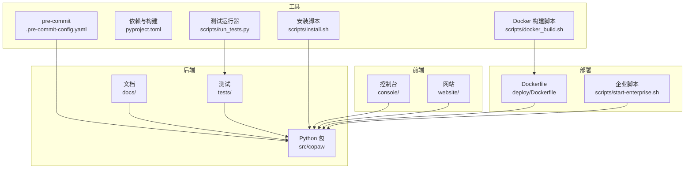
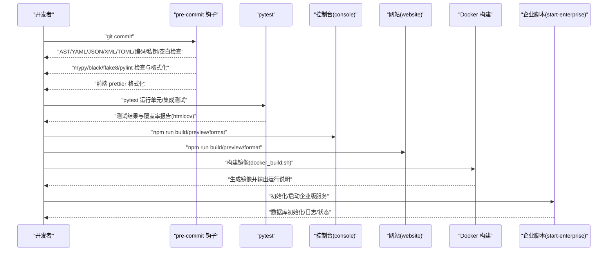
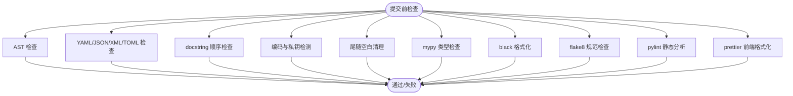
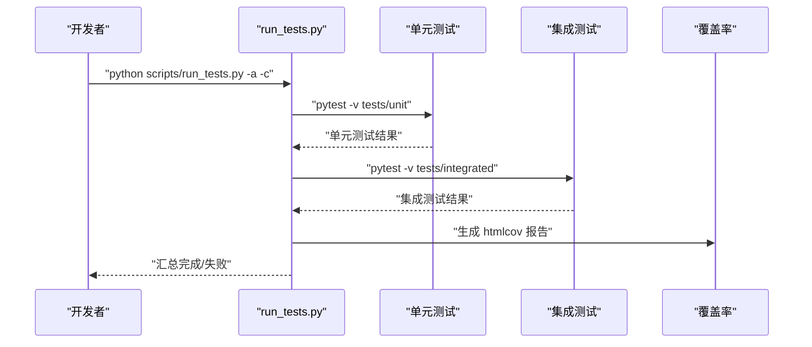
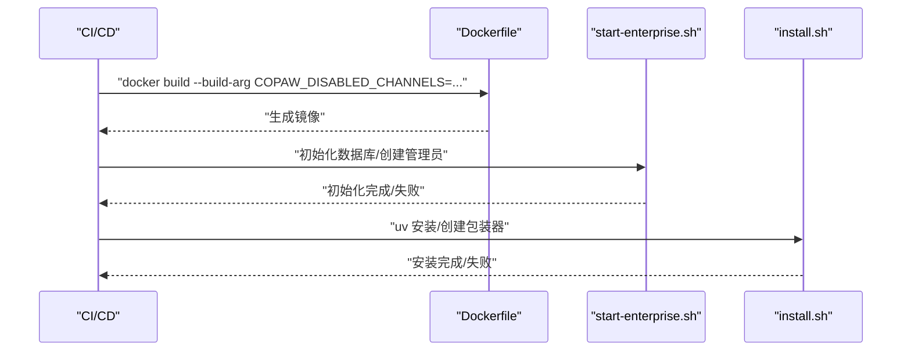
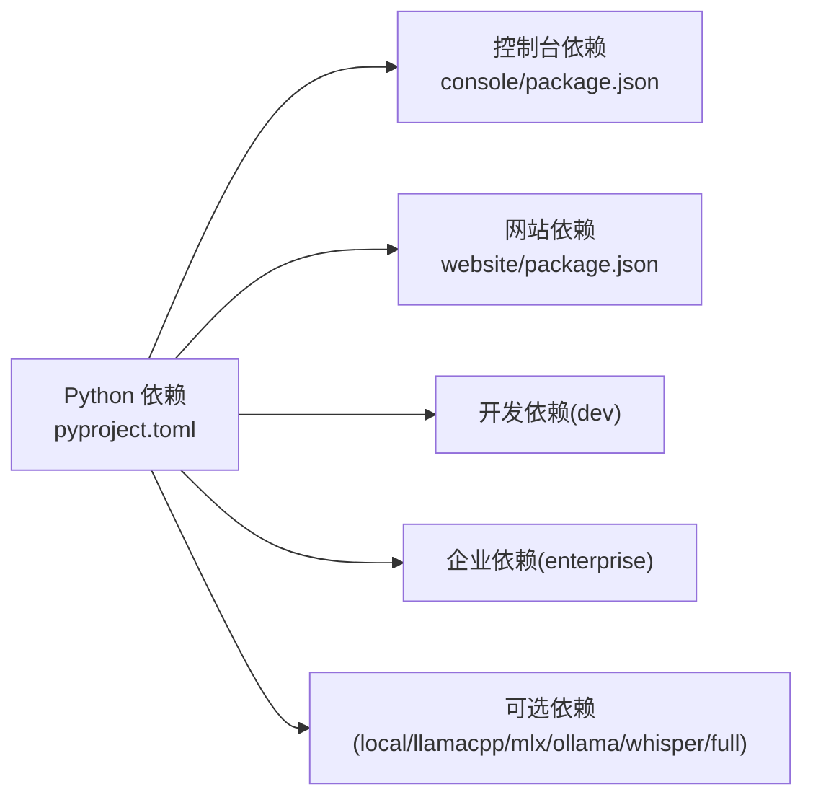

# 开发工作流程

<cite>
**本文引用的文件**
- [.pre-commit-config.yaml](file://.pre-commit-config.yaml)
- [pyproject.toml](file://pyproject.toml)
- [CONTRIBUTING.md](file://CONTRIBUTING.md)
- [CONTRIBUTING_zh.md](file://CONTRIBUTING_zh.md)
- [scripts/run_tests.py](file://scripts/run_tests.py)
- [console/package.json](file://console/package.json)
- [website/package.json](file://website/package.json)
- [deploy/Dockerfile](file://deploy/Dockerfile)
- [scripts/install.sh](file://scripts/install.sh)
- [scripts/start-enterprise.sh](file://scripts/start-enterprise.sh)
- [scripts/docker_build.sh](file://scripts/docker_build.sh)
- [docs/QUICK-START.md](file://docs/QUICK-START.md)
</cite>

## 目录
1. [简介](#简介)
2. [项目结构](#项目结构)
3. [核心组件](#核心组件)
4. [架构总览](#架构总览)
5. [详细组件分析](#详细组件分析)
6. [依赖分析](#依赖分析)
7. [性能考虑](#性能考虑)
8. [故障排查指南](#故障排查指南)
9. [结论](#结论)
10. [附录](#附录)

## 简介
本文件面向 CoPaw 项目的开发者，建立标准化的开发工作流程，覆盖以下方面：
- pre-commit 钩子的配置与使用：代码检查、格式化与质量验证
- Git 提交规范与分支管理策略
- 自动化测试流程：单元测试、集成测试与覆盖率
- 持续集成与持续部署（CI/CD）最佳实践
- 代码审查流程与标准
- 版本控制、标签与发布流程
- 开发环境设置、依赖管理与构建流程

## 项目结构
CoPaw 采用多语言混合架构：后端基于 Python，前端包含 React 控制台与网站，容器化部署，测试与脚本工具齐全。关键目录与职责概览：
- 后端核心：src/copaw
- 前端控制台：console
- 网站文档：website
- 测试：tests（unit 与 integrated）
- 部署：deploy（Dockerfile、入口脚本）
- 脚本：scripts（安装、测试、企业版管理、Docker 构建）
- 文档：docs（快速入门、Wiki）



**图表来源**
- [deploy/Dockerfile:1-103](file://deploy/Dockerfile#L1-L103)
- [scripts/start-enterprise.sh:1-510](file://scripts/start-enterprise.sh#L1-L510)
- [scripts/run_tests.py:1-282](file://scripts/run_tests.py#L1-L282)
- [scripts/install.sh:1-340](file://scripts/install.sh#L1-L340)
- [scripts/docker_build.sh:1-32](file://scripts/docker_build.sh#L1-L32)
- [console/package.json:1-63](file://console/package.json#L1-L63)
- [website/package.json:1-51](file://website/package.json#L1-L51)
- [.pre-commit-config.yaml:1-121](file://.pre-commit-config.yaml#L1-L121)
- [pyproject.toml:1-124](file://pyproject.toml#L1-L124)

**章节来源**
- [deploy/Dockerfile:1-103](file://deploy/Dockerfile#L1-L103)
- [scripts/start-enterprise.sh:1-510](file://scripts/start-enterprise.sh#L1-L510)
- [scripts/run_tests.py:1-282](file://scripts/run_tests.py#L1-L282)
- [scripts/install.sh:1-340](file://scripts/install.sh#L1-L340)
- [scripts/docker_build.sh:1-32](file://scripts/docker_build.sh#L1-L32)
- [console/package.json:1-63](file://console/package.json#L1-L63)
- [website/package.json:1-51](file://website/package.json#L1-L51)
- [.pre-commit-config.yaml:1-121](file://.pre-commit-config.yaml#L1-L121)
- [pyproject.toml:1-124](file://pyproject.toml#L1-L124)

## 核心组件
- 代码质量门禁：pre-commit 配置涵盖 AST、YAML/JSON/XML/TOML 检查、docstring、编码、私钥检测、空白清理、类型检查（mypy）、格式化（black、flake8、pylint）与前端格式化（prettier）
- 测试体系：pytest 配置与脚本，支持单元测试、集成测试与覆盖率报告
- 构建与分发：pyproject.toml 定义包元数据、可选依赖与脚本入口；Dockerfile 多阶段构建控制台与应用
- 安装与运行：多平台安装脚本、企业版初始化与数据库迁移、Docker 镜像构建与运行
- 文档与规范：贡献指南（含 Conventional Commits）、PR 标准、代码与质量要求

**章节来源**
- [.pre-commit-config.yaml:1-121](file://.pre-commit-config.yaml#L1-L121)
- [pyproject.toml:1-124](file://pyproject.toml#L1-L124)
- [CONTRIBUTING.md:68-86](file://CONTRIBUTING.md#L68-L86)
- [CONTRIBUTING_zh.md:68-86](file://CONTRIBUTING_zh.md#L68-L86)

## 架构总览
下图展示从本地开发到容器化部署的关键流程，包括 pre-commit、测试、构建与运行。



**图表来源**
- [.pre-commit-config.yaml:1-121](file://.pre-commit-config.yaml#L1-L121)
- [scripts/run_tests.py:1-282](file://scripts/run_tests.py#L1-L282)
- [console/package.json:1-63](file://console/package.json#L1-L63)
- [website/package.json:1-51](file://website/package.json#L1-L51)
- [scripts/docker_build.sh:1-32](file://scripts/docker_build.sh#L1-L32)
- [scripts/start-enterprise.sh:1-510](file://scripts/start-enterprise.sh#L1-L510)

## 详细组件分析

### pre-commit 钩子配置与使用
- 钩子仓库与版本：官方钩子、mypy、black、flake8、pylint、prettier
- 排除规则：skills 目录与 scripts/pack 目录、特定文件类型与路径
- 参数与开关：mypy、black、flake8、pylint 的参数与禁用规则
- 前端格式化：仅对 TSX 文件生效，排除 web/console/dist 与 skills 目录



**图表来源**
- [.pre-commit-config.yaml:1-121](file://.pre-commit-config.yaml#L1-L121)

**章节来源**
- [.pre-commit-config.yaml:1-121](file://.pre-commit-config.yaml#L1-L121)

### Git 提交规范与分支管理
- 提交信息格式：遵循 Conventional Commits，包含 type(scope): subject
- PR 标题格式：与提交信息一致，使用小写 scope
- 本地门禁：安装 pre-commit、全量运行、pytest 通过
- 前端格式化：变更涉及 console/website 目录需先格式化

```mermaid
flowchart TD
A["准备提交"] --> B["pip install -e \".[dev,full]\""]
B --> C["pre-commit install"]
C --> D["pre-commit run --all-files"]
D --> E{"通过？"}
E --> |否| F["修复并再次运行"]
E --> |是| G["pytest 运行"]
G --> H{"通过？"}
H --> |否| I["修复测试"]
H --> |是| J["推送/发起 PR"]
F --> D
I --> G
```

**图表来源**
- [CONTRIBUTING.md:68-86](file://CONTRIBUTING.md#L68-L86)
- [CONTRIBUTING_zh.md:68-86](file://CONTRIBUTING_zh.md#L68-L86)

**章节来源**
- [CONTRIBUTING.md:23-86](file://CONTRIBUTING.md#L23-L86)
- [CONTRIBUTING_zh.md:23-86](file://CONTRIBUTING_zh.md#L23-L86)

### 自动化测试流程
- 测试运行器：scripts/run_tests.py 支持按模块运行、并行、覆盖率
- pytest 配置：异步模式、标记 slow、默认 fixture 循环作用域
- 测试组织：tests/unit 与 tests/integrated
- 覆盖率：生成 HTML 与缺失行报告



**图表来源**
- [scripts/run_tests.py:1-282](file://scripts/run_tests.py#L1-L282)
- [pyproject.toml:118-124](file://pyproject.toml#L118-L124)

**章节来源**
- [scripts/run_tests.py:1-282](file://scripts/run_tests.py#L1-L282)
- [pyproject.toml:118-124](file://pyproject.toml#L118-L124)

### 持续集成与持续部署
- Docker 多阶段构建：前端控制台在独立阶段构建，注入到最终镜像
- 构建参数：通道过滤（启用/禁用）、Playwright 使用系统 Chromium、容器运行标志
- 企业版初始化：数据库连接测试、Alembic 迁移、管理员账户创建
- 安装脚本：uv 管理虚拟环境、自动选择 PyPI 镜像、包装器脚本与 PATH 注入



**图表来源**
- [deploy/Dockerfile:1-103](file://deploy/Dockerfile#L1-L103)
- [scripts/start-enterprise.sh:1-510](file://scripts/start-enterprise.sh#L1-L510)
- [scripts/install.sh:1-340](file://scripts/install.sh#L1-L340)

**章节来源**
- [deploy/Dockerfile:1-103](file://deploy/Dockerfile#L1-L103)
- [scripts/start-enterprise.sh:1-510](file://scripts/start-enterprise.sh#L1-L510)
- [scripts/install.sh:1-340](file://scripts/install.sh#L1-L340)

### 代码审查流程与标准
- 审查清单（建议）：
  - 是否通过 pre-commit 与 pytest
  - 是否更新相关文档与 README
  - 是否新增/更新测试用例
  - 是否遵循 Conventional Commits
  - 是否避免大而杂的 PR
- 反馈处理：根据审查意见迭代修改，必要时重新运行门禁

**章节来源**
- [CONTRIBUTING.md:208-227](file://CONTRIBUTING.md#L208-L227)
- [CONTRIBUTING_zh.md:210-228](file://CONTRIBUTING_zh.md#L210-L228)

### 版本控制、标签与发布流程
- 标签与发布：仓库未提供专用发布脚本，建议遵循语义化版本并结合 Conventional Commits 自动生成变更日志
- 发布渠道：PyPI（pip 安装）、Docker Hub（容器镜像）、GitHub Releases（桌面应用）

**章节来源**
- [docs/QUICK-START.md:155-218](file://docs/QUICK-START.md#L155-L218)

### 开发环境设置、依赖管理与构建流程
- 依赖管理：pyproject.toml 定义核心依赖、可选依赖（dev、enterprise、local、llamacpp、mlx、ollama、whisper、full）
- 构建流程：setuptools 后端，包数据包含 console、agents/skills、tokenizer、安全规则等
- 前端构建：console 与 website 使用 npm scripts（dev、build、format、lint 等）
- 安装脚本：install.sh 使用 uv 创建隔离环境、自动选择镜像、包装器脚本与 PATH 注入

```mermaid
flowchart TD
A["克隆仓库"] --> B["pip install -e \".[dev,full]\""]
B --> C["pre-commit install"]
C --> D["npm ci && npm run build (console/website)"]
D --> E["pytest 运行"]
E --> F["docker build (可选)"]
F --> G["copaw init/app 运行"]
```

**图表来源**
- [pyproject.toml:73-116](file://pyproject.toml#L73-L116)
- [console/package.json:6-18](file://console/package.json#L6-L18)
- [website/package.json:5-11](file://website/package.json#L5-L11)
- [scripts/install.sh:1-340](file://scripts/install.sh#L1-L340)

**章节来源**
- [pyproject.toml:1-124](file://pyproject.toml#L1-L124)
- [console/package.json:1-63](file://console/package.json#L1-L63)
- [website/package.json:1-51](file://website/package.json#L1-L51)
- [scripts/install.sh:1-340](file://scripts/install.sh#L1-L340)

## 依赖分析
- 后端依赖：agentscope、httpx、playwright、discord-py、dingtalk-stream、uvicorn、apscheduler、transformers、pyyaml、cryptography、keyring、pillow、onnxruntime、matrix-nio、wecom-aibot-python-sdk、paho-mqtt、google-genai、huggingface_hub、modelscope 等
- 可选依赖：enterprise（SQLAlchemy、asyncpg、alembic、redis、authlib、bcrypt、metrics）、local/llamacpp/mlx/ollama/whisper/full
- 前端依赖：React、Ant Design、Vite、ESLint、TypeScript、Prettier 等



**图表来源**
- [pyproject.toml:7-116](file://pyproject.toml#L7-L116)
- [console/package.json:19-60](file://console/package.json#L19-L60)
- [website/package.json:12-49](file://website/package.json#L12-L49)

**章节来源**
- [pyproject.toml:1-124](file://pyproject.toml#L1-L124)
- [console/package.json:1-63](file://console/package.json#L1-L63)
- [website/package.json:1-51](file://website/package.json#L1-L51)

## 性能考虑
- 测试并行：run_tests.py 支持并行执行（pytest-xdist），缩短回归时间
- 前端格式化：pre-commit 对 TSX 使用 prettier，避免大文件格式化耗时
- Docker 构建：多阶段构建分离前端构建与运行时，减小最终镜像体积
- 依赖精简：通过可选依赖按需安装，降低安装与运行时开销

**章节来源**
- [scripts/run_tests.py:165-167](file://scripts/run_tests.py#L165-L167)
- [.pre-commit-config.yaml:114-121](file://.pre-commit-config.yaml#L114-L121)
- [deploy/Dockerfile:1-103](file://deploy/Dockerfile#L1-L103)

## 故障排查指南
- pre-commit 失败：根据提示修复 AST、YAML、JSON、XML、TOML、docstring、编码、私钥、空白等问题；若被自动修改，提交后再运行直至通过
- pytest 失败：定位失败用例，补充或修正测试；必要时使用 -m "not slow" 跳过慢测试
- Docker 构建失败：检查通道参数、网络与镜像源；确认前端 dist 已注入
- 企业版初始化失败：检查 PostgreSQL/Redis 连接、数据库迁移与管理员账户创建；查看日志文件
- 安装失败：确认 uv 可用、PyPI 镜像可用、PATH 注入成功

**章节来源**
- [CONTRIBUTING.md:68-86](file://CONTRIBUTING.md#L68-L86)
- [scripts/run_tests.py:1-282](file://scripts/run_tests.py#L1-L282)
- [scripts/docker_build.sh:1-32](file://scripts/docker_build.sh#L1-L32)
- [scripts/start-enterprise.sh:1-510](file://scripts/start-enterprise.sh#L1-L510)
- [scripts/install.sh:1-340](file://scripts/install.sh#L1-L340)

## 结论
通过标准化的 pre-commit 钩子、严格的提交规范、完善的测试与覆盖率、容器化部署与自动化安装脚本，CoPaw 形成了可靠的开发工作流程。建议团队在日常开发中坚持本地门禁、及时格式化、充分测试与审阅，确保代码质量与交付效率。

## 附录
- 快速开始与多平台安装：参见快速入门文档
- 企业版初始化与运行：参见企业脚本与快速入门

**章节来源**
- [docs/QUICK-START.md:1-356](file://docs/QUICK-START.md#L1-L356)
- [scripts/start-enterprise.sh:1-510](file://scripts/start-enterprise.sh#L1-L510)