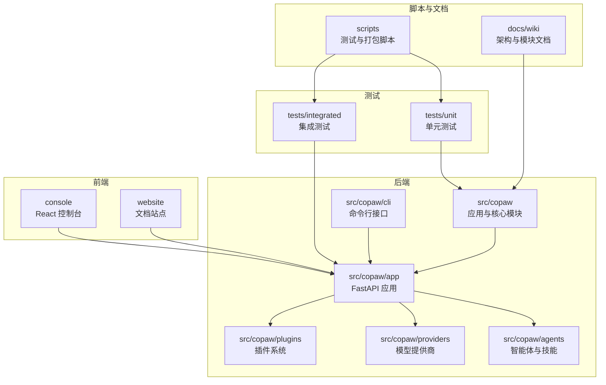
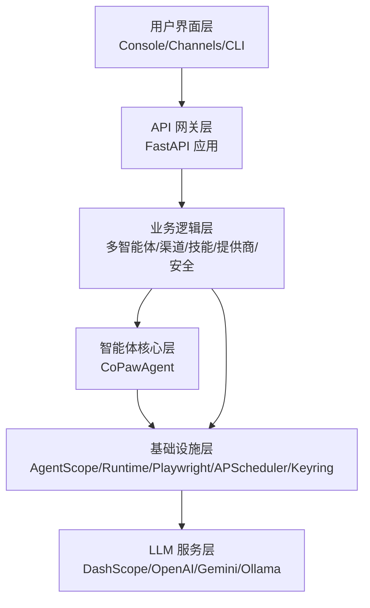
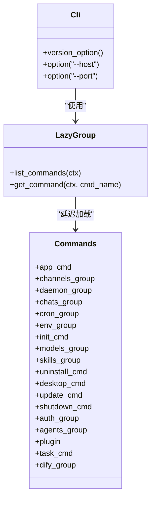
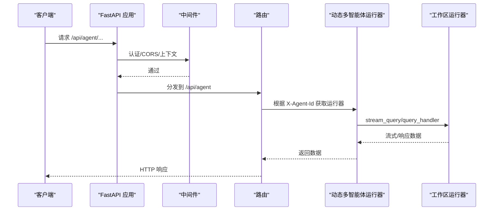
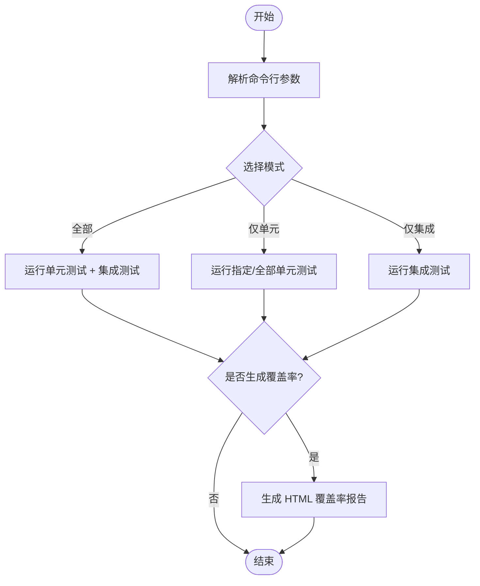
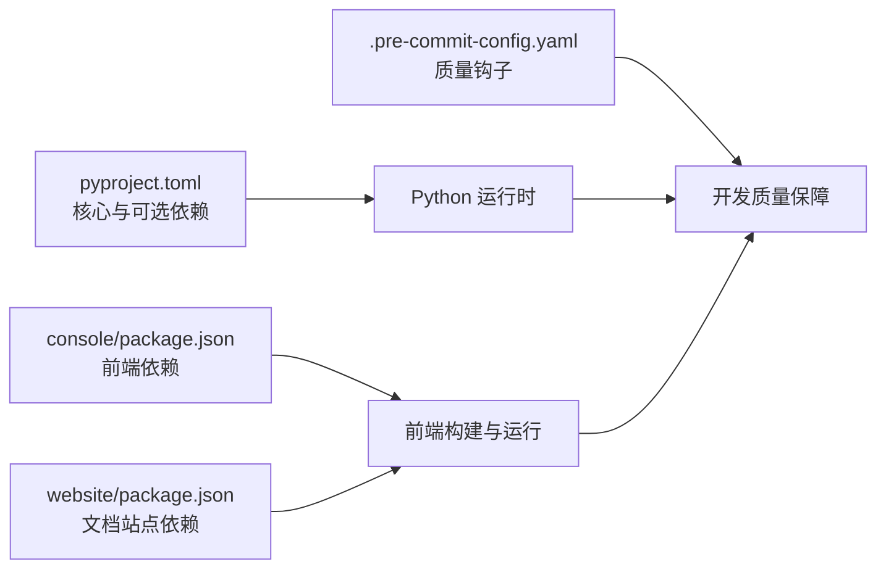

# 开发指南

<cite>
**本文引用的文件**
- [README.md](file://README.md)
- [CONTRIBUTING.md](file://CONTRIBUTING.md)
- [pyproject.toml](file://pyproject.toml)
- [.pre-commit-config.yaml](file://.pre-commit-config.yaml)
- [console/package.json](file://console/package.json)
- [console/eslint.config.js](file://console/eslint.config.js)
- [console/tsconfig.json](file://console/tsconfig.json)
- [scripts/run_tests.py](file://scripts/run_tests.py)
- [docs/wiki/Development-Setup.md](file://docs/wiki/Development-Setup.md)
- [docs/wiki/Architecture.md](file://docs/wiki/Architecture.md)
- [docs/wiki/Core-Modules.md](file://docs/wiki/Core-Modules.md)
- [src/copaw/__init__.py](file://src/copaw/__init__.py)
- [src/copaw/cli/main.py](file://src/copaw/cli/main.py)
- [src/copaw/app/_app.py](file://src/copaw/app/_app.py)
- [tests/unit/providers/test_openai_provider.py](file://tests/unit/providers/test_openai_provider.py)
- [tests/integrated/test_app_startup.py](file://tests/integrated/test_app_startup.py)
</cite>

## 目录
1. [简介](#简介)
2. [项目结构](#项目结构)
3. [核心组件](#核心组件)
4. [架构总览](#架构总览)
5. [详细组件分析](#详细组件分析)
6. [依赖分析](#依赖分析)
7. [性能考虑](#性能考虑)
8. [故障排查指南](#故障排查指南)
9. [结论](#结论)
10. [附录](#附录)

## 简介
本开发指南面向希望参与 CoPaw 项目的开发者，覆盖开发环境搭建、代码规范与质量门禁、测试策略、目录结构与模块划分、依赖关系、贡献流程（分支管理、提交规范、代码审查与合并）、测试框架使用方法（单元测试与集成测试）、调试技巧、性能分析与问题定位，以及插件开发、功能扩展与 bug 修复的实践指导。文档同时提供面向非技术读者的概览说明，并通过可视化图表帮助理解系统架构与数据流。

## 项目结构
CoPaw 采用前后端分离与多模块组织方式：
- 后端：Python 包结构位于 src/copaw，包含应用入口、CLI、FastAPI 应用、多智能体管理、渠道系统、提供商管理、本地模型、安全机制、插件系统等。
- 前端：console 为 React/Vite 控制台，website 为文档站点；两者均通过独立的 package.json 管理依赖与脚本。
- 测试：tests 下分为 unit 与 integrated 两层，分别对应单元测试与集成测试。
- 文档：docs/wiki 提供架构、模块、开发设置等文档。
- 脚本：scripts 提供测试运行器与打包脚本等。

**图表来源**
- [src/copaw/app/_app.py:475-685](file://src/copaw/app/_app.py#L475-L685)
- [src/copaw/cli/main.py:95-168](file://src/copaw/cli/main.py#L95-L168)
- [console/package.json:1-63](file://console/package.json#L1-L63)
- [scripts/run_tests.py:1-282](file://scripts/run_tests.py#L1-L282)

**章节来源**
- [docs/wiki/Development-Setup.md:1-457](file://docs/wiki/Development-Setup.md#L1-L457)
- [docs/wiki/Architecture.md:1-447](file://docs/wiki/Architecture.md#L1-L447)
- [docs/wiki/Core-Modules.md:1-588](file://docs/wiki/Core-Modules.md#L1-L588)

## 核心组件
- 应用入口与初始化：包初始化负责日志与环境变量加载，确保模块导入时具备正确的运行上下文。
- CLI：基于 Click 的分组命令，支持延迟加载子命令，提升启动性能；提供 app、channels、daemon、skills、agents 等常用命令。
- FastAPI 应用：统一 API 路由、中间件（认证、CORS、代理）、静态资源与 SPA 路由回退；支持 Prometheus 监控埋点。
- 多智能体管理：动态根据请求头选择工作区运行器，实现多租户或多智能体隔离。
- 提供商与本地模型：ProviderManager 管理多家 LLM 提供商，LocalModelManager 支持 llama.cpp、Ollama 等本地推理后端。
- 安全机制：工具守卫、文件守卫、技能安全扫描与凭据加密存储。
- 插件系统：插件发现、加载与注册，支持插件提供者、控制命令与启动/关闭钩子。

**章节来源**
- [src/copaw/__init__.py:1-33](file://src/copaw/__init__.py#L1-L33)
- [src/copaw/cli/main.py:58-168](file://src/copaw/cli/main.py#L58-L168)
- [src/copaw/app/_app.py:59-150](file://src/copaw/app/_app.py#L59-L150)
- [docs/wiki/Core-Modules.md:1-588](file://docs/wiki/Core-Modules.md#L1-L588)

## 架构总览
下图展示 CoPaw 的分层架构：用户界面层（Console/Channels/CLI）、API 网关层（FastAPI）、业务逻辑层（多智能体/渠道/技能/提供商/安全）、智能体核心层（CoPawAgent）、基础设施层（AgentScope/Runtime、Playwright、APScheduler、Keyring 等），以及 LLM 服务层（DashScope/OpenAI/Gemini/Ollama 等）。

**图表来源**
- [docs/wiki/Architecture.md:7-74](file://docs/wiki/Architecture.md#L7-L74)
- [src/copaw/app/_app.py:475-685](file://src/copaw/app/_app.py#L475-L685)
- [docs/wiki/Core-Modules.md:115-171](file://docs/wiki/Core-Modules.md#L115-L171)

**章节来源**
- [docs/wiki/Architecture.md:1-447](file://docs/wiki/Architecture.md#L1-L447)

## 详细组件分析

### CLI 组件分析
- 延迟加载：通过 LazyGroup 按需加载子命令，减少启动时间。
- 版本选项与默认主机/端口解析：从上次运行记录或环境变量中恢复默认值。
- 平台适配：Windows 下强制 UTF-8 标准输出，保证中文与非 ASCII 字符显示正常。

**图表来源**
- [src/copaw/cli/main.py:58-168](file://src/copaw/cli/main.py#L58-L168)

**章节来源**
- [src/copaw/cli/main.py:1-168](file://src/copaw/cli/main.py#L1-L168)

### FastAPI 应用与路由分析
- 生命周期：lifespan 中完成企业版数据库/缓存初始化、迁移、多智能体管理器启动、插件系统初始化与钩子执行。
- 中间件：认证中间件（单用户或企业版）、CORS、代理指标埋点。
- 路由：统一 API 前缀 /api，包含 agents、agent、chat、channel、cronjob、providers、local-models、skills、envs、security、token-usage、files 等。
- 静态资源与 SPA：控制台静态文件挂载与回退路由，确保前端路由正常工作。

**图表来源**
- [src/copaw/app/_app.py:59-150](file://src/copaw/app/_app.py#L59-L150)
- [src/copaw/app/_app.py:600-611](file://src/copaw/app/_app.py#L600-L611)

**章节来源**
- [src/copaw/app/_app.py:162-473](file://src/copaw/app/_app.py#L162-L473)

### 测试框架与策略
- 测试运行器：scripts/run_tests.py 支持运行单元测试、集成测试、覆盖率与并行执行。
- 单元测试：按模块分目录组织，如 providers、agents、channels 等，便于针对性测试。
- 集成测试：如应用启动与控制台可用性测试，验证端到端流程。
- 覆盖率：pytest-cov 生成 HTML 报告，便于定位未覆盖路径。

**图表来源**
- [scripts/run_tests.py:175-282](file://scripts/run_tests.py#L175-L282)

**章节来源**
- [scripts/run_tests.py:1-282](file://scripts/run_tests.py#L1-L282)
- [tests/integrated/test_app_startup.py:1-133](file://tests/integrated/test_app_startup.py#L1-L133)
- [tests/unit/providers/test_openai_provider.py:1-269](file://tests/unit/providers/test_openai_provider.py#L1-L269)

### 贡献流程与代码规范
- Issue 与 PR：先查看现有 Issue 与计划，避免重复；无相关 Issue 时先开讨论。
- 提交信息：遵循 Conventional Commits 规范，类型包括 feat、fix、docs、test、refactor、chore、perf、style、build、revert。
- PR 标题：与提交信息一致，scope 小写，描述简洁。
- 本地门禁：安装 dev 与 full 依赖，安装 pre-commit，运行 pre-commit 全量检查与 pytest，前端变更需格式化。
- 文档更新：新增或变更用户可见行为时同步更新 docs 与 README。
- 平台支持：跨平台兼容性修复与安装脚本改进欢迎贡献。

**章节来源**
- [CONTRIBUTING.md:11-236](file://CONTRIBUTING.md#L11-L236)
- [docs/wiki/Development-Setup.md:418-457](file://docs/wiki/Development-Setup.md#L418-L457)

## 依赖分析
- Python 依赖：通过 pyproject.toml 管理，核心依赖包括 AgentScope、FastAPI、Uvicorn、APScheduler、Playwright、Keyring、Cryptography、PyYAML、httpx 等。
- 可选依赖：dev（测试与质量工具）、local（本地模型）、llamacpp、ollama、whisper、full（组合）、enterprise（数据库、缓存、鉴权与监控）。
- 前端依赖：console 与 website 通过各自 package.json 管理 React、Ant Design、Vite、TypeScript、ESLint、Prettier 等。
- 质量工具：pre-commit 配置包含 AST 检查、YAML/JSON/XML/TOML 校验、mypy、black、flake8、pylint、prettier 等。

**图表来源**
- [pyproject.toml:1-124](file://pyproject.toml#L1-L124)
- [console/package.json:1-63](file://console/package.json#L1-L63)
- [.pre-commit-config.yaml:1-121](file://.pre-commit-config.yaml#L1-L121)

**章节来源**
- [pyproject.toml:1-124](file://pyproject.toml#L1-L124)
- [.pre-commit-config.yaml:1-121](file://.pre-commit-config.yaml#L1-L121)

## 性能考虑
- 模型调用优化：速率限制（滑动窗口 QPM）、指数退避重试、流式响应、模型路由。
- 记忆优化：自动压缩、语义检索（ReMe）、分层存储（短期/长期）。
- 并发处理：全异步架构、HTTP 连接池、任务队列优先级。
- 启动与延迟：CLI 延迟加载、FastAPI lifespan 中异步初始化、静态资源 MIME 类型修正。
- 监控：Prometheus 指标埋点，自定义租户用量计数器。

**章节来源**
- [docs/wiki/Architecture.md:315-335](file://docs/wiki/Architecture.md#L315-L335)
- [src/copaw/app/_app.py:482-511](file://src/copaw/app/_app.py#L482-L511)

## 故障排查指南
- 开发环境问题：
  - Python 版本不兼容：使用 pyenv 切换至 3.10–3.13。
  - 前端构建失败：清理 node_modules 或改用 yarn；确认 Node.js ≥ 18。
  - 依赖冲突：使用 pip-compile 或 uv 锁定依赖。
  - 端口占用：检查 lsof/netstat，更换端口。
  - 权限问题：macOS/Linux 添加执行权限，Windows 以管理员运行。
- 调试技巧：
  - 后端：设置 COPAW_LOG_LEVEL=debug，或在代码中配置 logging。
  - 前端：浏览器控制台设置 localStorage.debug=true。
  - API：使用 httpie/curl 直连 /api/version 与 /api/agents 验证服务状态。
- 集成测试失败：
  - 关注进程提前退出与 ImportError/ModuleNotFoundError 日志，定位依赖缺失。
  - 控制台 HTML 内容校验，确保静态资源可访问且为有效 HTML。

**章节来源**
- [docs/wiki/Development-Setup.md:331-457](file://docs/wiki/Development-Setup.md#L331-L457)
- [tests/integrated/test_app_startup.py:33-133](file://tests/integrated/test_app_startup.py#L33-L133)

## 结论
本指南提供了 CoPaw 从开发环境到贡献流程、从架构理解到测试与调试的完整路径。建议在贡献前先通读开发设置与架构文档，再结合测试运行器与质量门禁确保代码质量与一致性。对于插件开发与功能扩展，优先参考核心模块文档与 CLI/FastAPI 应用的扩展点，确保与现有中间件、路由与安全机制协同工作。

## 附录

### 开发环境搭建步骤
- 系统要求：macOS/Linux/Windows 10+，Python 3.10–3.13，Node.js 18+，建议内存 8GB+，磁盘 10GB+。
- 后端：克隆仓库 → 创建虚拟环境 → 安装基础与开发依赖 → 构建前端 → 初始化配置 → 启动服务。
- 前端：console 与 website 分别安装依赖、开发模式与构建。
- IDE：VS Code/PyCharm 推荐扩展与配置项。
- Docker：可选容器化开发与调试。
- 测试：使用 scripts/run_tests.py 运行单元/集成测试，生成覆盖率报告。

**章节来源**
- [docs/wiki/Development-Setup.md:7-282](file://docs/wiki/Development-Setup.md#L7-L282)

### 测试框架使用方法
- 单元测试：按模块目录组织，如 tests/unit/providers，使用 pytest 异步模式。
- 集成测试：如应用启动与控制台可用性测试，验证 API 与静态资源。
- 覆盖率：pytest --cov=src/copaw 生成 HTML 报告。
- 并行：pytest-xdist 支持 -n auto 并行执行。

**章节来源**
- [scripts/run_tests.py:76-173](file://scripts/run_tests.py#L76-L173)
- [tests/integrated/test_app_startup.py:1-133](file://tests/integrated/test_app_startup.py#L1-L133)
- [tests/unit/providers/test_openai_provider.py:1-269](file://tests/unit/providers/test_openai_provider.py#L1-L269)

### 插件开发与功能扩展
- 插件系统：插件发现、加载与注册，支持插件提供者、控制命令与启动/关闭钩子。
- MCP 集成：支持 Model Context Protocol 客户端配置与热插拔。
- 自定义渠道：继承 BaseChannel，实现生命周期与消息处理，注册到渠道注册表。
- 技能扩展：遵循 SKILL.md 格式与工作区技能副本机制，注意冲突处理与依赖声明。

**章节来源**
- [docs/wiki/Architecture.md:265-312](file://docs/wiki/Architecture.md#L265-L312)
- [docs/wiki/Core-Modules.md:464-588](file://docs/wiki/Core-Modules.md#L464-L588)