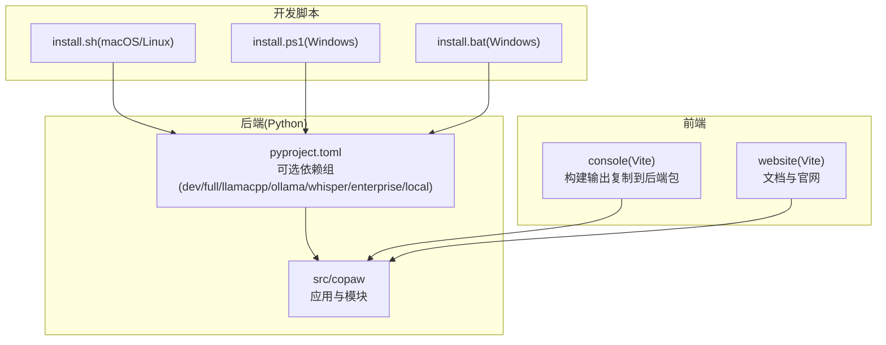
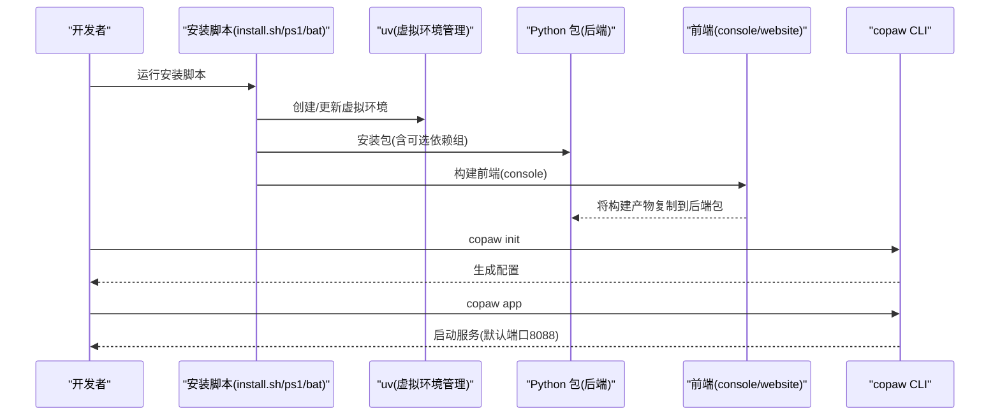
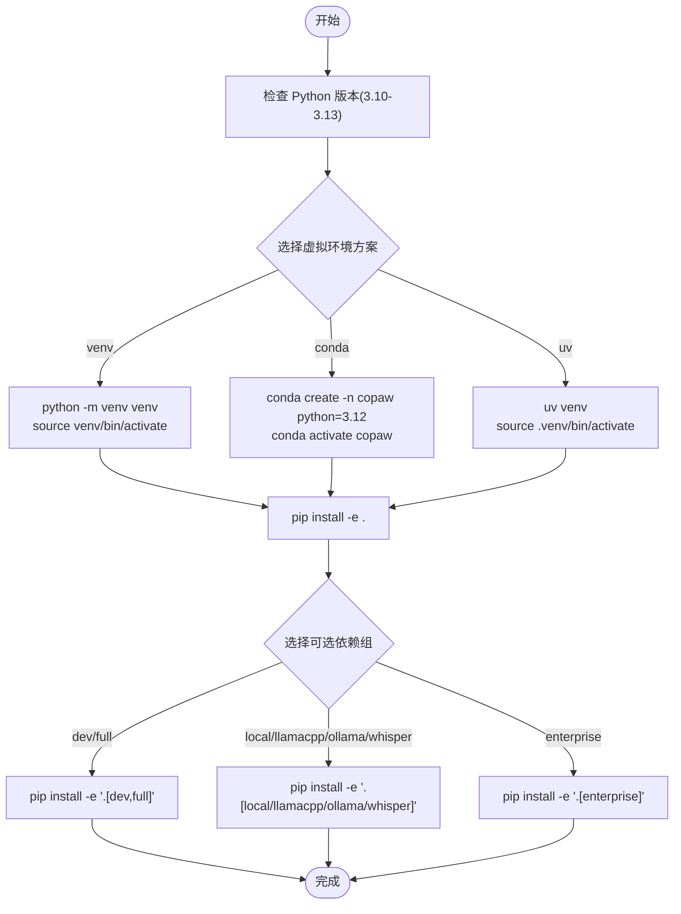
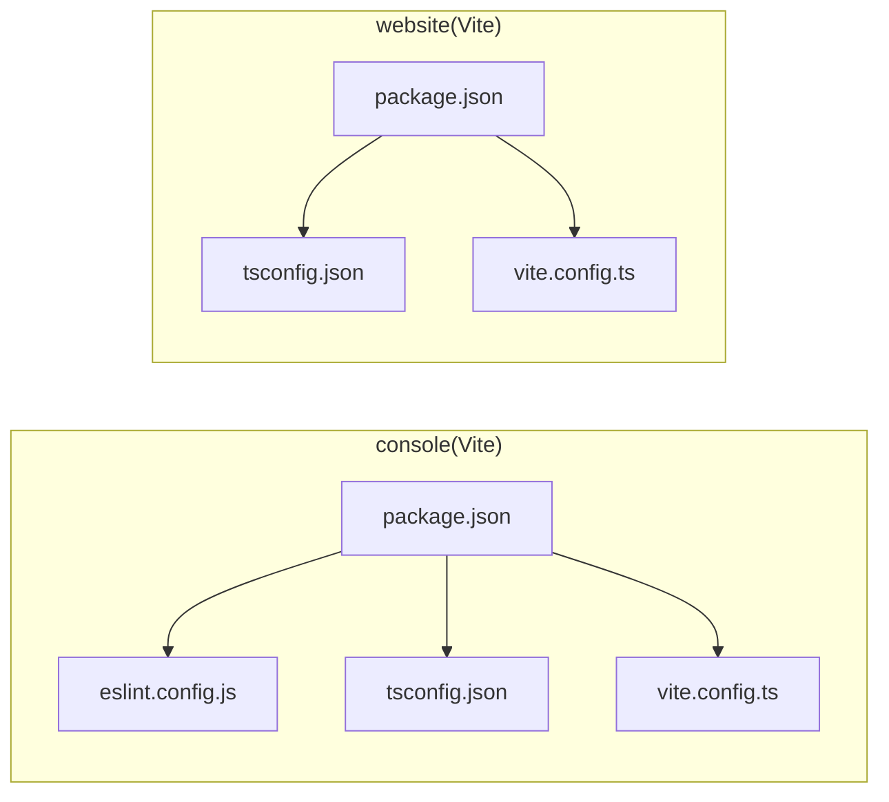
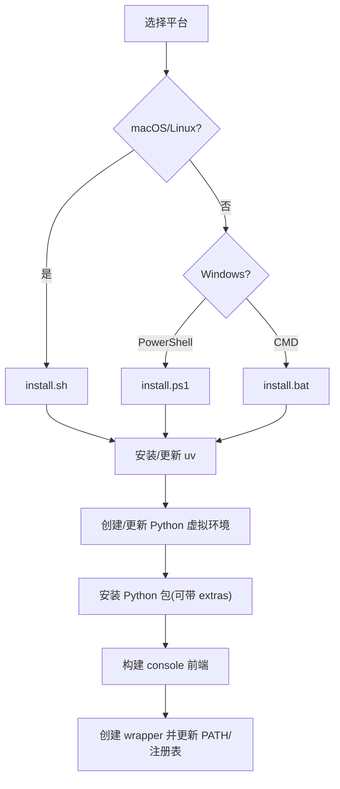
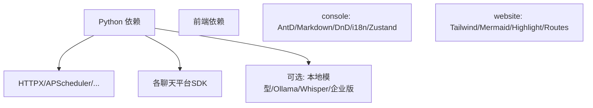

# 开发环境搭建

<cite>
**本文引用的文件**
- [README.md](file://README.md)
- [docs/wiki/Development-Setup.md](file://docs/wiki/Development-Setup.md)
- [docs/QUICK-START.md](file://docs/QUICK-START.md)
- [pyproject.toml](file://pyproject.toml)
- [.pre-commit-config.yaml](file://.pre-commit-config.yaml)
- [console/package.json](file://console/package.json)
- [console/eslint.config.js](file://console/eslint.config.js)
- [console/tsconfig.json](file://console/tsconfig.json)
- [console/vite.config.ts](file://console/vite.config.ts)
- [website/package.json](file://website/package.json)
- [website/tsconfig.json](file://website/tsconfig.json)
- [website/vite.config.ts](file://website/vite.config.ts)
- [scripts/install.sh](file://scripts/install.sh)
- [scripts/install.ps1](file://scripts/install.ps1)
- [scripts/install.bat](file://scripts/install.bat)
- [scripts/run_tests.py](file://scripts/run_tests.py)
- [CONTRIBUTING.md](file://CONTRIBUTING.md)
</cite>

## 目录
1. [简介](#简介)
2. [项目结构](#项目结构)
3. [核心组件](#核心组件)
4. [架构总览](#架构总览)
5. [详细组件分析](#详细组件分析)
6. [依赖分析](#依赖分析)
7. [性能考虑](#性能考虑)
8. [故障排除指南](#故障排除指南)
9. [结论](#结论)
10. [附录](#附录)

## 简介
本指南面向希望在本地进行 CoPaw 开发与贡献的工程师，覆盖 Python 后端、Node.js/前端（Console 与 Website）、虚拟环境与依赖管理、IDE 配置、调试与开发服务器启动、跨平台安装脚本以及常见问题处理。内容基于仓库中的官方文档与脚本，确保与项目实际实现保持一致。

## 项目结构
CoPaw 采用“后端 Python 包 + 前端 Vite 应用”的双栈架构：
- 后端：Python 包，通过可选依赖组支持本地模型、Ollama、Whisper、企业版数据库等能力
- 前端：两个独立的 Vite 项目
  - console：控制台前端，构建产物复制到后端包内分发
  - website：文档与官网前端
- 开发脚本：提供 macOS/Linux/Windows 一键安装与开发环境准备

**图表来源**
- [pyproject.toml:73-116](file://pyproject.toml#L73-L116)
- [console/vite.config.ts:1-118](file://console/vite.config.ts#L1-L118)
- [website/vite.config.ts:1-48](file://website/vite.config.ts#L1-L48)
- [scripts/install.sh:1-340](file://scripts/install.sh#L1-L340)
- [scripts/install.ps1:1-477](file://scripts/install.ps1#L1-L477)
- [scripts/install.bat:1-557](file://scripts/install.bat#L1-L557)

**章节来源**
- [README.md:340-360](file://README.md#L340-L360)
- [docs/wiki/Development-Setup.md:27-119](file://docs/wiki/Development-Setup.md#L27-L119)

## 核心组件
- Python 依赖与可选特性
  - 基础依赖：HTTP 客户端、调度器、多通道 SDK、UI 与多媒体库等
  - 可选依赖组：dev、local、llamacpp、mlx、ollama、whisper、full、enterprise
- 前端工具链
  - console：React + TypeScript + Vite + ESLint + Prettier + Less
  - website：React + TypeScript + Vite + TailwindCSS
- 开发脚本
  - macOS/Linux：install.sh，自动安装 uv、创建虚拟环境、安装包与前端构建
  - Windows：install.ps1 与 install.bat，支持 PowerShell 与 CMD，自动处理 PATH 与包装器

**章节来源**
- [pyproject.toml:1-45](file://pyproject.toml#L1-L45)
- [pyproject.toml:73-116](file://pyproject.toml#L73-L116)
- [console/package.json:1-63](file://console/package.json#L1-L63)
- [website/package.json:1-51](file://website/package.json#L1-L51)
- [scripts/install.sh:104-134](file://scripts/install.sh#L104-L134)
- [scripts/install.ps1:121-191](file://scripts/install.ps1#L121-L191)
- [scripts/install.bat:163-225](file://scripts/install.bat#L163-L225)

## 架构总览
下图展示开发环境的典型启动流程：安装脚本创建 uv 虚拟环境并安装 Python 包；前端项目构建并将产物复制到后端包中；随后通过 CLI 初始化配置并启动应用。

**图表来源**
- [scripts/install.sh:149-241](file://scripts/install.sh#L149-L241)
- [scripts/install.ps1:211-320](file://scripts/install.ps1#L211-L320)
- [scripts/install.bat:331-450](file://scripts/install.bat#L331-L450)
- [docs/wiki/Development-Setup.md:105-116](file://docs/wiki/Development-Setup.md#L105-L116)

## 详细组件分析

### Python 环境与依赖管理
- Python 版本要求：3.10 ≤ 版本 < 3.14
- 虚拟环境方案
  - venv：标准库方式创建与激活
  - conda：创建并激活环境
  - uv：推荐，快速创建与管理
- 依赖安装
  - 基础安装：pip 安装可编辑模式
  - 开发依赖：可选组 dev、full
  - 可选功能：local、llamacpp、mlx、ollama、whisper、enterprise
- 包打包与资源
  - 包含 console 前端静态资源，构建时复制到后端包路径

**图表来源**
- [docs/wiki/Development-Setup.md:36-90](file://docs/wiki/Development-Setup.md#L36-L90)
- [pyproject.toml:6,73-116](file://pyproject.toml#L6,L73-L116)

**章节来源**
- [docs/wiki/Development-Setup.md:36-90](file://docs/wiki/Development-Setup.md#L36-L90)
- [pyproject.toml:6,73-116](file://pyproject.toml#L6,L73-L116)

### 前端开发环境（Node.js 与 npm）
- Node.js 版本：18+（用于前端构建）
- console 前端
  - 依赖：React、Ant Design、Vite、ESLint、Prettier、Less、TypeScript
  - 开发：npm run dev（Vite 默认端口 5173）
  - 构建：npm run build
  - 代码检查：npm run lint、npm run format:check
- website 前端
  - 依赖：React、TailwindCSS、Mermaid、Vite、TypeScript
  - 开发：npm run dev
  - 构建：npm run build（包含搜索索引与 SPA 回退页面）

**图表来源**
- [console/package.json:1-63](file://console/package.json#L1-L63)
- [console/eslint.config.js:1-29](file://console/eslint.config.js#L1-L29)
- [console/tsconfig.json:1-8](file://console/tsconfig.json#L1-L8)
- [console/vite.config.ts:1-118](file://console/vite.config.ts#L1-L118)
- [website/package.json:1-51](file://website/package.json#L1-L51)
- [website/tsconfig.json:1-26](file://website/tsconfig.json#L1-L26)
- [website/vite.config.ts:1-48](file://website/vite.config.ts#L1-L48)

**章节来源**
- [docs/wiki/Development-Setup.md:121-174](file://docs/wiki/Development-Setup.md#L121-L174)
- [console/package.json:1-63](file://console/package.json#L1-L63)
- [website/package.json:1-51](file://website/package.json#L1-L51)

### 跨平台安装脚本
- macOS/Linux：install.sh
  - 自动检测并安装 uv
  - 创建/更新 Python 3.12 虚拟环境
  - 可选 extras 参数安装 llamacpp、mlx 等
  - 自动构建 console 前端并复制到后端包
  - 创建 wrapper 并更新 PATH
- Windows：install.ps1 与 install.bat
  - 自动处理执行策略与 PATH 注册表
  - 支持从源码或 PyPI 安装
  - 自动构建 console 前端并创建 .ps1/.cmd 包装器

**图表来源**
- [scripts/install.sh:104-134](file://scripts/install.sh#L104-L134)
- [scripts/install.ps1:121-191](file://scripts/install.ps1#L121-L191)
- [scripts/install.bat:163-225](file://scripts/install.bat#L163-L225)

**章节来源**
- [scripts/install.sh:1-340](file://scripts/install.sh#L1-L340)
- [scripts/install.ps1:1-477](file://scripts/install.ps1#L1-L477)
- [scripts/install.bat:1-557](file://scripts/install.bat#L1-L557)

### IDE 配置与调试
- VS Code 推荐扩展：Python、Pylance、ES7+ React/Redux、TypeScript Importer、Tailwind CSS IntelliSense 等
- settings.json 关键项：解释器路径、Flake8 启用、Black 格式化、保存时自动格式化与导入整理
- PyCharm：设置源根目录为 src/copaw，启用 Flake8 与 Black
- 前端调试：Vite 代理到后端 API（默认 8088），可在开发模式下通过环境变量调整
- 后端调试：通过环境变量 COPAW_LOG_LEVEL=debug 或在代码中设置日志级别

**章节来源**
- [docs/wiki/Development-Setup.md:176-212](file://docs/wiki/Development-Setup.md#L176-L212)
- [console/vite.config.ts:34-46](file://console/vite.config.ts#L34-L46)

### 测试与质量门禁
- 测试运行：scripts/run_tests.py 支持全部、单元、集成、覆盖率、并行等模式
- 本地质量门禁：pip install -e ".[dev,full]"，安装 pre-commit，运行 pre-commit run --all-files，pytest
- 前端格式化：console 与 website 目录分别执行 npm run format

**章节来源**
- [docs/wiki/Development-Setup.md:214-247](file://docs/wiki/Development-Setup.md#L214-L247)
- [CONTRIBUTING.md:70-85](file://CONTRIBUTING.md#L70-L85)
- [.pre-commit-config.yaml:1-121](file://.pre-commit-config.yaml#L1-L121)

## 依赖分析
- Python 依赖分层
  - 基础层：HTTPX、APScheduler、Playwright、dotenv、加密与认证相关库
  - 通道层：各聊天平台 SDK（如钉钉、飞书、Telegram、Discord 等）
  - 可选层：本地模型（llama.cpp、mlx）、Ollama、Whisper、企业版数据库与监控
- 前端依赖分层
  - console：Ant Design 生态、Markdown 渲染、拖拽、国际化、状态管理
  - website：TailwindCSS、Mermaid、语法高亮、路由与国际化

**图表来源**
- [pyproject.toml:7-45](file://pyproject.toml#L7-L45)
- [pyproject.toml:84-101](file://pyproject.toml#L84-L101)
- [console/package.json:19-43](file://console/package.json#L19-L43)
- [website/package.json:12-37](file://website/package.json#L12-L37)

**章节来源**
- [pyproject.toml:1-124](file://pyproject.toml#L1-L124)
- [console/package.json:1-63](file://console/package.json#L1-L63)
- [website/package.json:1-51](file://website/package.json#L1-L51)

## 性能考虑
- 前端构建优化
  - console：手动拆分 vendor chunk（react、AntD、Markdown、DnD、工具库），减少首屏体积
  - website：按功能拆分 chunk（markdown、mermaid、router、i18n）
- 本地模型性能
  - 可选 llamacpp、mlx、Ollama，按平台与硬件选择
- 依赖锁定与缓存
  - 使用 uv 快速创建与复用虚拟环境，提升安装速度

[本节为通用指导，无需引用具体文件]

## 故障排除指南
- Python 版本不兼容
  - 使用 pyenv 或安装脚本指定版本
- 前端构建失败
  - 清理 node_modules 并重新安装；或改用 yarn
- 依赖冲突
  - 使用 pip-tools 或 uv pip compile 锁定版本
- 端口占用
  - 更换端口：copaw app --port 新端口
- 权限问题（macOS/Linux）
  - 赋予脚本执行权限
- Windows 执行策略
  - 安装脚本会尝试设置执行策略，必要时手动设置

**章节来源**
- [docs/wiki/Development-Setup.md:331-387](file://docs/wiki/Development-Setup.md#L331-L387)

## 结论
通过本指南，您可以在 Windows、Linux、macOS 上快速搭建 CoPaw 开发环境：使用安装脚本自动完成 uv 虚拟环境、Python 包与前端构建；在 VS Code/PyCharm 中配置开发工具链；利用预提交钩子与测试脚本保证代码质量；最后通过 copaw CLI 启动服务并访问控制台。

[本节为总结，无需引用具体文件]

## 附录

### 开发服务器启动与常用命令
- 后端初始化与启动
  - copaw init --defaults
  - copaw app
- 前端开发
  - console：npm run dev（默认 5173 端口）
  - website：npm run dev
- 测试
  - scripts/run_tests.py（支持 -u/-i/-a/-c/-p 等参数）

**章节来源**
- [docs/wiki/Development-Setup.md:105-116](file://docs/wiki/Development-Setup.md#L105-L116)
- [docs/wiki/Development-Setup.md:121-174](file://docs/wiki/Development-Setup.md#L121-L174)
- [docs/wiki/Development-Setup.md:214-236](file://docs/wiki/Development-Setup.md#L214-L236)