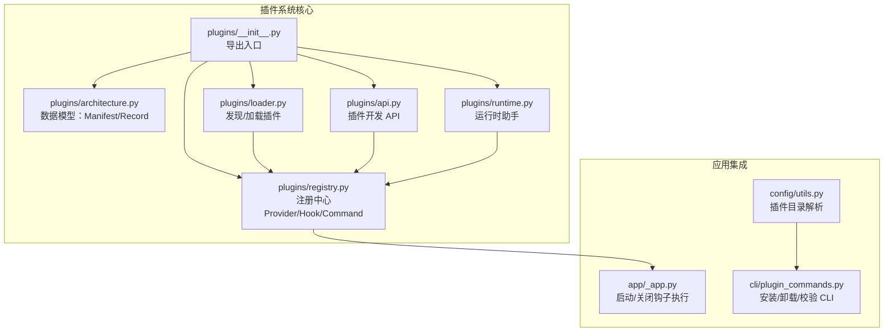
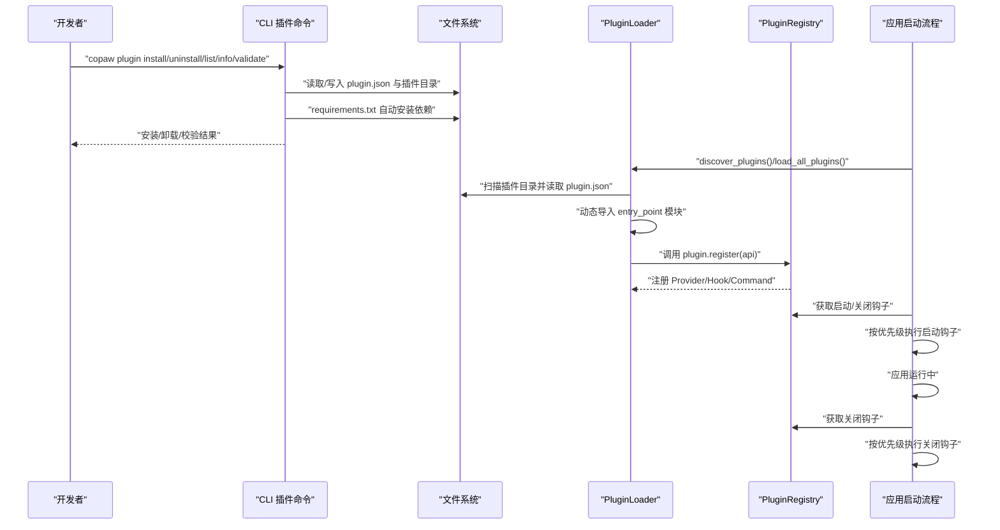
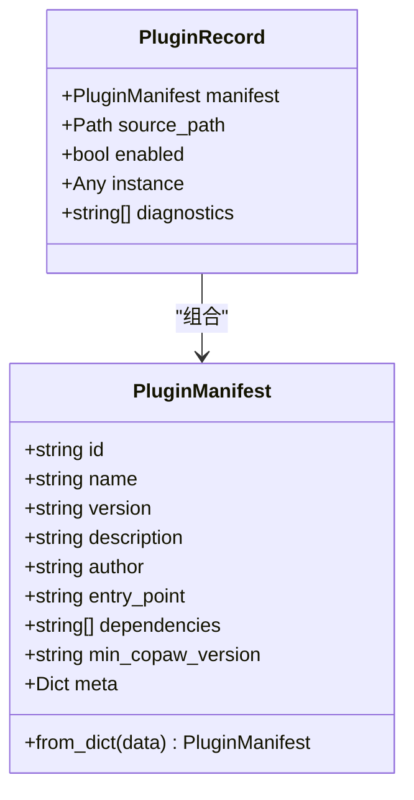
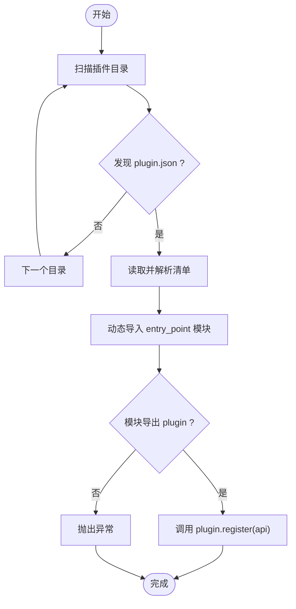
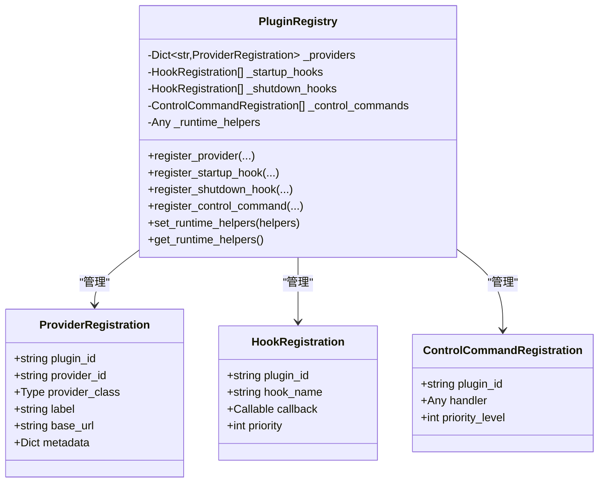
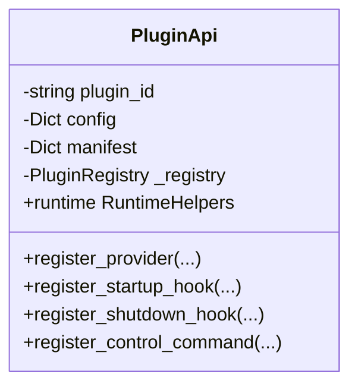
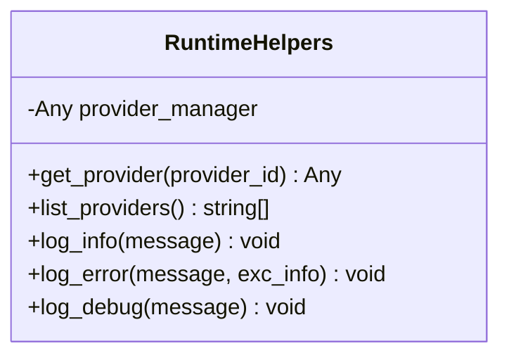
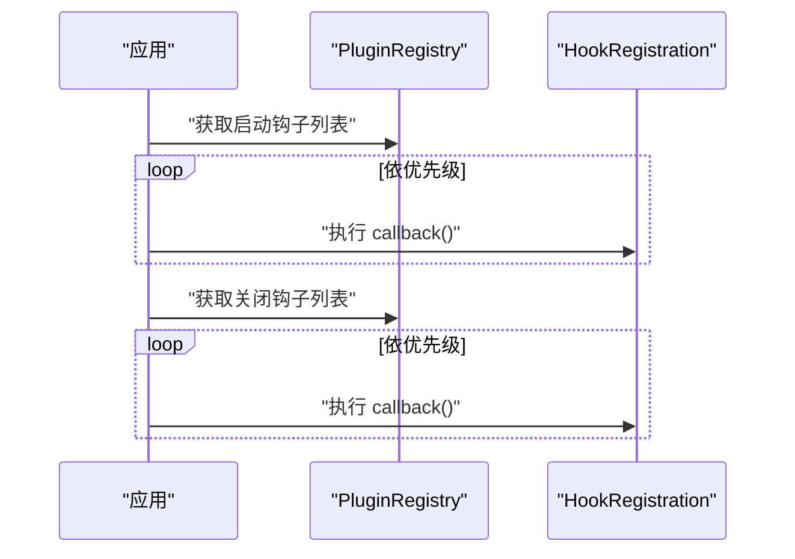
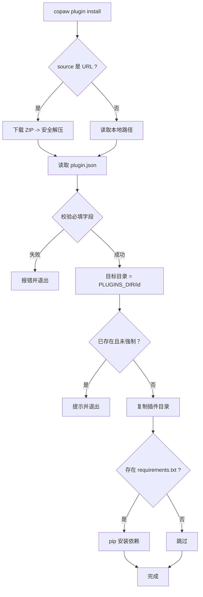
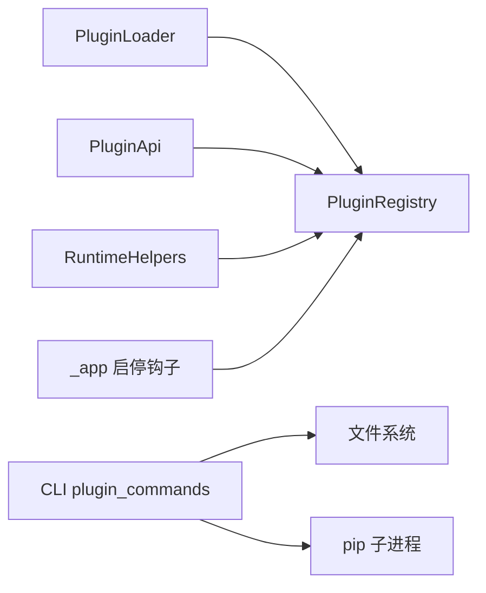

# 插件开发

<cite>
**本文引用的文件**
- [plugins/__init__.py](file://src/copaw/plugins/__init__.py)
- [plugins/architecture.py](file://src/copaw/plugins/architecture.py)
- [plugins/loader.py](file://src/copaw/plugins/loader.py)
- [plugins/registry.py](file://src/copaw/plugins/registry.py)
- [plugins/runtime.py](file://src/copaw/plugins/runtime.py)
- [plugins/api.py](file://src/copaw/plugins/api.py)
- [cli/plugin_commands.py](file://src/copaw/cli/plugin_commands.py)
- [config/utils.py](file://src/copaw/config/utils.py)
- [app/_app.py](file://src/copaw/app/_app.py)
- [plugins.zh.md](file://website/public/docs/plugins.zh.md)
</cite>

## 目录
1. [简介](#简介)
2. [项目结构](#项目结构)
3. [核心组件](#核心组件)
4. [架构总览](#架构总览)
5. [详细组件分析](#详细组件分析)
6. [依赖分析](#依赖分析)
7. [性能考量](#性能考量)
8. [故障排查指南](#故障排查指南)
9. [结论](#结论)
10. [附录](#附录)

## 简介
本指南面向希望为 CoPaw 开发插件的开发者，系统阐述插件架构设计、生命周期管理、扩展点识别、注册机制、钩子系统与 API 扩展方法，并提供插件开发模板、配置与依赖处理、打包发布、版本与兼容性保障、最佳实践、安全与性能优化建议。读者无需深入底层即可基于现有 API 快速构建稳定、可维护的插件。

## 项目结构
CoPaw 插件系统位于 src/copaw/plugins 目录，围绕“清单（manifest）—加载器（loader）—注册表（registry）—API（PluginApi）—运行时助手（RuntimeHelpers）”五大部分协作，配合 CLI 的安装/卸载/校验能力，形成完整的插件生态闭环。

图示来源
- [plugins/__init__.py:1-16](file://src/copaw/plugins/__init__.py#L1-L16)
- [plugins/architecture.py:1-55](file://src/copaw/plugins/architecture.py#L1-L55)
- [plugins/loader.py:1-241](file://src/copaw/plugins/loader.py#L1-L241)
- [plugins/registry.py:1-254](file://src/copaw/plugins/registry.py#L1-L254)
- [plugins/api.py:1-186](file://src/copaw/plugins/api.py#L1-L186)
- [plugins/runtime.py:1-68](file://src/copaw/plugins/runtime.py#L1-L68)
- [app/_app.py:372-407](file://src/copaw/app/_app.py#L372-L407)
- [config/utils.py:634-638](file://src/copaw/config/utils.py#L634-L638)
- [cli/plugin_commands.py:1-411](file://src/copaw/cli/plugin_commands.py#L1-L411)

章节来源
- [plugins/__init__.py:1-16](file://src/copaw/plugins/__init__.py#L1-L16)
- [plugins/architecture.py:1-55](file://src/copaw/plugins/architecture.py#L1-L55)
- [plugins/loader.py:1-241](file://src/copaw/plugins/loader.py#L1-L241)
- [plugins/registry.py:1-254](file://src/copaw/plugins/registry.py#L1-L254)
- [plugins/api.py:1-186](file://src/copaw/plugins/api.py#L1-L186)
- [plugins/runtime.py:1-68](file://src/copaw/plugins/runtime.py#L1-L68)
- [app/_app.py:372-407](file://src/copaw/app/_app.py#L372-L407)
- [config/utils.py:634-638](file://src/copaw/config/utils.py#L634-L638)
- [cli/plugin_commands.py:1-411](file://src/copaw/cli/plugin_commands.py#L1-L411)

## 核心组件
- 插件清单与记录
  - PluginManifest：描述插件元数据（id/name/version/description/author/entry_point/dependencies/min_copaw_version/meta），支持从字典构造。
  - PluginRecord：记录已加载插件的清单、源路径、启用状态、实例与诊断信息。
- 插件加载器
  - 发现插件：遍历插件目录，查找 plugin.json 并加载清单。
  - 动态导入：根据 entry_point 加载模块，要求导出名为 plugin 的对象；调用其 register(api) 方法完成注册；支持同步/异步回调。
  - 统一注册：将插件注册到 PluginRegistry，并记录到内存缓存。
- 中央注册表
  - Provider 注册：防止重复注册，提供查询与列表能力。
  - 启动/关闭钩子：按优先级排序执行，支持同步/异步回调。
  - 控制命令：注册命令处理器，统一调度。
  - 运行时助手：提供 provider_manager 访问、日志等辅助能力。
- 插件 API
  - 提供 register_provider/register_startup_hook/register_shutdown_hook/register_control_command/runtime 访问接口。
- 运行时助手
  - 提供 provider 获取、列表、日志记录等便捷方法。
- CLI 插件管理
  - 安装/卸载/列出/信息/校验，支持本地路径、URL 下载与 requirements.txt 自动安装，具备 Zip Slip 防护与权限检查。

章节来源
- [plugins/architecture.py:9-55](file://src/copaw/plugins/architecture.py#L9-L55)
- [plugins/loader.py:32-241](file://src/copaw/plugins/loader.py#L32-L241)
- [plugins/registry.py:42-254](file://src/copaw/plugins/registry.py#L42-L254)
- [plugins/api.py:10-186](file://src/copaw/plugins/api.py#L10-L186)
- [plugins/runtime.py:10-68](file://src/copaw/plugins/runtime.py#L10-L68)
- [cli/plugin_commands.py:104-411](file://src/copaw/cli/plugin_commands.py#L104-L411)

## 架构总览
下图展示从 CLI 到应用启动阶段的插件生命周期与交互：

图示来源
- [cli/plugin_commands.py:104-411](file://src/copaw/cli/plugin_commands.py#L104-L411)
- [plugins/loader.py:32-241](file://src/copaw/plugins/loader.py#L32-L241)
- [plugins/registry.py:149-253](file://src/copaw/plugins/registry.py#L149-L253)
- [app/_app.py:372-407](file://src/copaw/app/_app.py#L372-L407)

## 详细组件分析

### 插件清单与记录（Manifest/Record）
- 清单字段
  - id/name/version/description/author/entry_point/dependencies/min_copaw_version/meta
  - entry_point 默认为 plugin.py，可通过清单覆盖
- 记录结构
  - 包含 manifest/source_path/enabled/instance/diagnostics
- 复杂度
  - 清单解析 O(1)，记录存储 O(1) 查询

图示来源
- [plugins/architecture.py:9-55](file://src/copaw/plugins/architecture.py#L9-L55)

章节来源
- [plugins/architecture.py:9-55](file://src/copaw/plugins/architecture.py#L9-L55)

### 插件加载器（PluginLoader）
- 发现策略
  - 遍历配置的插件目录，逐项扫描 plugin.json
- 动态导入
  - 生成唯一模块名，设置 __package__/__path__ 以支持相对导入
  - 要求模块导出 plugin 对象，调用其 register(api)
- 注册与回退
  - 已加载插件去重
  - 异常记录并抛出，便于上层处理

图示来源
- [plugins/loader.py:32-197](file://src/copaw/plugins/loader.py#L32-L197)

章节来源
- [plugins/loader.py:19-241](file://src/copaw/plugins/loader.py#L19-L241)

### 中央注册表（PluginRegistry）
- Provider 注册
  - 防止重复注册，提供查询与全量列表
- Hook 注册
  - 启动/关闭钩子按优先级排序（数值越小越早）
- 控制命令注册
  - 统一调度命令处理器
- 运行时助手
  - 保存/获取 RuntimeHelpers，供插件通过 api.runtime 访问

图示来源
- [plugins/registry.py:42-254](file://src/copaw/plugins/registry.py#L42-L254)

章节来源
- [plugins/registry.py:42-254](file://src/copaw/plugins/registry.py#L42-L254)

### 插件 API（PluginApi）
- Provider 注册
  - 合并 manifest.meta 与自定义 metadata
- Hook 注册
  - 启动/关闭钩子，支持同步/异步回调
- 控制命令注册
  - 注册命令处理器，设定优先级
- 运行时访问
  - 通过 api.runtime 获取 RuntimeHelpers

图示来源
- [plugins/api.py:10-186](file://src/copaw/plugins/api.py#L10-L186)

章节来源
- [plugins/api.py:10-186](file://src/copaw/plugins/api.py#L10-L186)

### 运行时助手（RuntimeHelpers）
- 提供 provider_manager 访问、列出可用 provider、日志记录等

图示来源
- [plugins/runtime.py:10-68](file://src/copaw/plugins/runtime.py#L10-L68)

章节来源
- [plugins/runtime.py:10-68](file://src/copaw/plugins/runtime.py#L10-L68)

### 应用启动/关闭钩子执行
- 启动阶段：按优先级顺序执行所有启动钩子
- 关闭阶段：按优先级顺序执行所有关闭钩子

图示来源
- [app/_app.py:372-407](file://src/copaw/app/_app.py#L372-L407)
- [plugins/registry.py:207-221](file://src/copaw/plugins/registry.py#L207-L221)

章节来源
- [app/_app.py:372-407](file://src/copaw/app/_app.py#L372-L407)
- [plugins/registry.py:207-221](file://src/copaw/plugins/registry.py#L207-L221)

### CLI 插件管理
- 安装
  - 支持本地路径/URL，下载并解压（Zip Slip 防护），复制到插件目录，自动安装 requirements.txt
- 卸载
  - 停止 CoPaw 后删除插件目录
- 列表/信息/校验
  - 读取 plugin.json，输出插件元信息与依赖

图示来源
- [cli/plugin_commands.py:104-247](file://src/copaw/cli/plugin_commands.py#L104-L247)
- [config/utils.py:634-638](file://src/copaw/config/utils.py#L634-L638)

章节来源
- [cli/plugin_commands.py:104-411](file://src/copaw/cli/plugin_commands.py#L104-L411)
- [config/utils.py:634-638](file://src/copaw/config/utils.py#L634-L638)

## 依赖分析
- 组件内聚与耦合
  - PluginLoader 与 PluginRegistry 强耦合（通过 set_registry 注入），但职责清晰：前者负责发现/加载，后者集中管理注册项
  - PluginApi 作为门面，隔离插件与注册表细节
  - RuntimeHelpers 与 ProviderManager 解耦，通过 Registry.get_runtime_helpers() 间接访问
- 外部依赖
  - CLI 依赖系统 pip 与网络下载（安装依赖）
  - 插件自身可依赖 requirements.txt 中的第三方包
- 循环依赖
  - 未发现循环依赖，模块间单向依赖链路清晰

图示来源
- [plugins/loader.py:19-31](file://src/copaw/plugins/loader.py#L19-L31)
- [plugins/registry.py:42-71](file://src/copaw/plugins/registry.py#L42-L71)
- [plugins/api.py:35-42](file://src/copaw/plugins/api.py#L35-L42)
- [plugins/runtime.py:13-19](file://src/copaw/plugins/runtime.py#L13-L19)
- [cli/plugin_commands.py:199-214](file://src/copaw/cli/plugin_commands.py#L199-L214)
- [app/_app.py:372-407](file://src/copaw/app/_app.py#L372-L407)

章节来源
- [plugins/loader.py:19-31](file://src/copaw/plugins/loader.py#L19-L31)
- [plugins/registry.py:42-71](file://src/copaw/plugins/registry.py#L42-L71)
- [plugins/api.py:35-42](file://src/copaw/plugins/api.py#L35-L42)
- [plugins/runtime.py:13-19](file://src/copaw/plugins/runtime.py#L13-L19)
- [cli/plugin_commands.py:199-214](file://src/copaw/cli/plugin_commands.py#L199-L214)
- [app/_app.py:372-407](file://src/copaw/app/_app.py#L372-L407)

## 性能考量
- 加载性能
  - 动态导入模块成本主要取决于插件规模与依赖数量；建议拆分插件逻辑、延迟初始化非必要资源
- 钩子执行
  - 启停钩子按优先级排序，避免阻塞主流程；建议将耗时操作放入后台线程或异步任务
- 依赖安装
  - requirements.txt 安装在离线环境可能较慢，建议预构建或使用缓存镜像源
- 日志与诊断
  - 使用 RuntimeHelpers.log_* 输出，避免阻塞主线程

## 故障排查指南
- 常见问题
  - 插件未被发现：确认 plugin.json 存在且字段完整，entry_point 正确
  - 动态导入失败：检查模块是否导出 plugin 对象，相对导入路径是否正确
  - Provider 冲突：多个插件注册相同 provider_id 会触发冲突，后注册覆盖先注册
  - 启停钩子异常：钩子应捕获异常并记录日志，避免影响应用启动/关闭
- CLI 相关
  - 安装失败：检查 requirements.txt 语法与网络可达性；必要时手动安装依赖
  - 卸载失败：确保 CoPaw 已停止后再执行卸载

章节来源
- [plugins/loader.py:111-197](file://src/copaw/plugins/loader.py#L111-L197)
- [plugins/registry.py:95-112](file://src/copaw/plugins/registry.py#L95-L112)
- [cli/plugin_commands.py:199-232](file://src/copaw/cli/plugin_commands.py#L199-L232)
- [app/_app.py:372-407](file://src/copaw/app/_app.py#L372-L407)

## 结论
CoPaw 插件系统以清单驱动、动态加载为核心，结合注册表集中管理扩展点，形成稳定、可扩展的插件生态。通过 CLI 的安装/卸载/校验能力与应用层的启停钩子执行机制，开发者可以快速构建并维护高质量插件。遵循本文的最佳实践与安全建议，可在保证稳定性的同时提升开发效率与用户体验。

## 附录

### 插件开发模板与步骤
- 目录结构
  - plugin.json（必需）
  - plugin.py（必需）
  - README.md（推荐）
- plugin.json 字段
  - id/name/version/description/author/entry_point/dependencies/min_copaw_version/meta
- plugin.py 入口
  - 导出名为 plugin 的类实例，实现 register(api) 方法
- 注册扩展点
  - Provider：api.register_provider(...)
  - 启动钩子：api.register_startup_hook(...)
  - 关闭钩子：api.register_shutdown_hook(...)
  - 控制命令：api.register_control_command(...)

章节来源
- [plugins/architecture.py:9-55](file://src/copaw/plugins/architecture.py#L9-L55)
- [plugins/api.py:43-174](file://src/copaw/plugins/api.py#L43-L174)
- [plugins.zh.md:135-195](file://website/public/docs/plugins.zh.md#L135-L195)

### 配置与依赖管理
- 插件目录
  - 由 config.utils.get_plugins_dir() 提供
- 依赖安装
  - CLI 自动读取 requirements.txt 并通过 pip 安装
- 版本与兼容性
  - 通过 min_copaw_version 与 manifest.meta 辅助兼容性判断

章节来源
- [config/utils.py:634-638](file://src/copaw/config/utils.py#L634-L638)
- [cli/plugin_commands.py:194-232](file://src/copaw/cli/plugin_commands.py#L194-L232)
- [plugins/architecture.py:18-21](file://src/copaw/plugins/architecture.py#L18-L21)

### 打包发布与版本管理
- 发布渠道
  - 支持本地路径与 URL 下载两种安装方式
- 版本策略
  - 建议遵循语义化版本（1.0.0、1.1.0、2.0.0）
- 兼容性
  - 通过 min_copaw_version 与 meta 字段提示 API Key 来源与使用指引

章节来源
- [cli/plugin_commands.py:60-97](file://src/copaw/cli/plugin_commands.py#L60-L97)
- [plugins/architecture.py:18-21](file://src/copaw/plugins/architecture.py#L18-L21)
- [plugins.zh.md:562-581](file://website/public/docs/plugins.zh.md#L562-L581)

### 最佳实践与安全建议
- 命名规范
  - 插件 ID 使用小写字母与连字符，版本号遵循语义化版本
- 错误处理
  - 启停钩子应捕获异常并记录日志，避免阻塞应用启动/关闭
- 日志记录
  - 使用 Python logging，区分 info/debug/error
- 文档
  - 提供 README.md，包含功能说明、安装步骤、使用示例、配置说明与故障排查
- 安全
  - CLI 安装具备 Zip Slip 防护；避免在插件中执行不受信任的命令

章节来源
- [plugins.zh.md:582-626](file://website/public/docs/plugins.zh.md#L582-L626)
- [cli/plugin_commands.py:37-58](file://src/copaw/cli/plugin_commands.py#L37-L58)