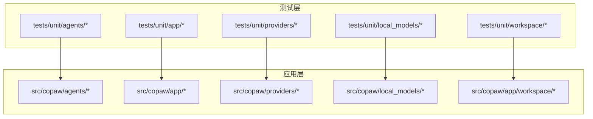
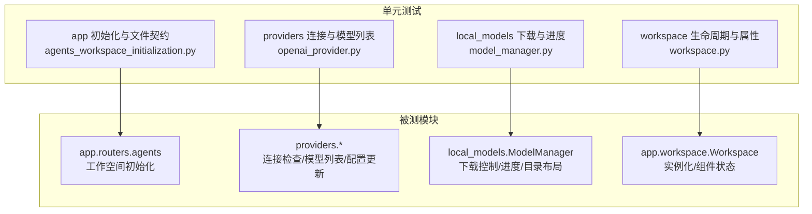
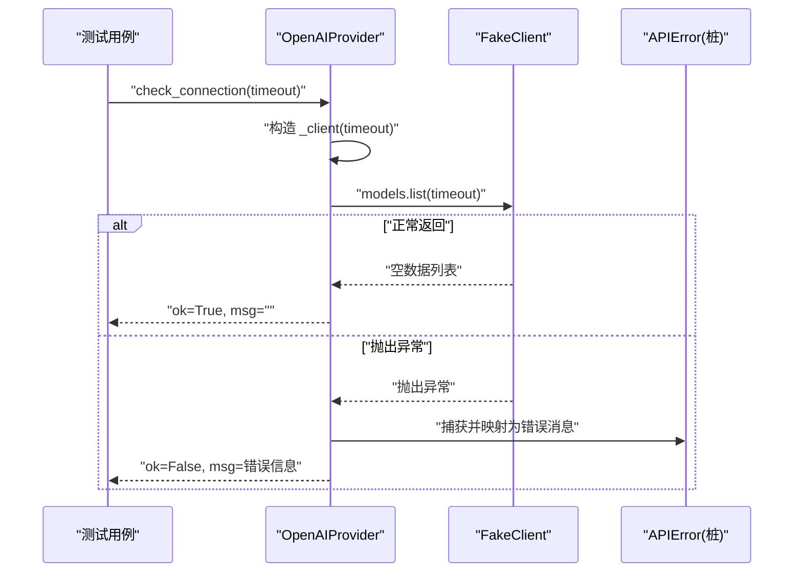
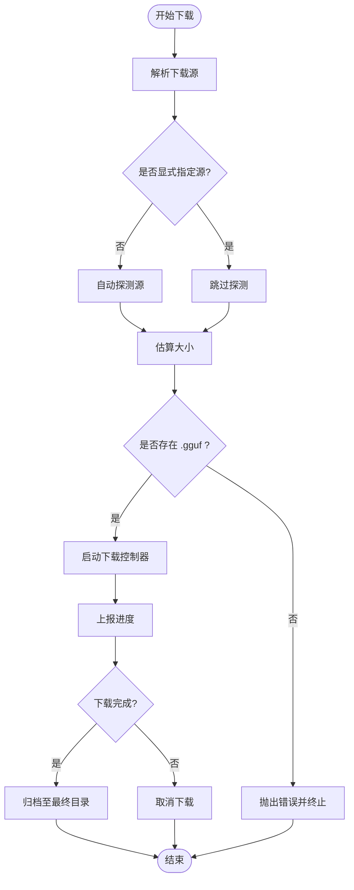
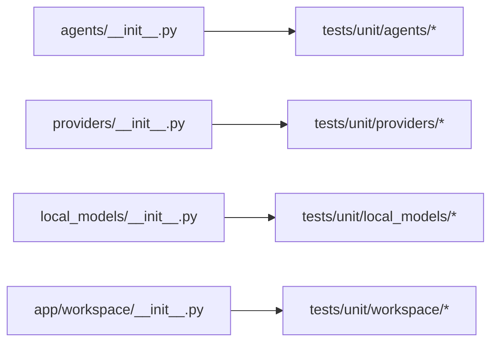

# 单元测试

<cite>
**本文引用的文件**
- [tests/unit/app/test_agents_workspace_initialization.py](file://tests/unit/app/test_agents_workspace_initialization.py)
- [tests/unit/providers/test_openai_provider.py](file://tests/unit/providers/test_openai_provider.py)
- [tests/unit/local_models/test_model_manager.py](file://tests/unit/local_models/test_model_manager.py)
- [tests/unit/workspace/test_workspace.py](file://tests/unit/workspace/test_workspace.py)
- [src/copaw/agents/__init__.py](file://src/copaw/agents/__init__.py)
- [src/copaw/providers/__init__.py](file://src/copaw/providers/__init__.py)
- [src/copaw/local_models/__init__.py](file://src/copaw/local_models/__init__.py)
- [src/copaw/app/workspace/__init__.py](file://src/copaw/app/workspace/__init__.py)
- [scripts/run_tests.py](file://scripts/run_tests.py)
- [pyproject.toml](file://pyproject.toml)
</cite>

## 目录
1. [引言](#引言)
2. [项目结构](#项目结构)
3. [核心组件](#核心组件)
4. [架构总览](#架构总览)
5. [详细组件分析](#详细组件分析)
6. [依赖关系分析](#依赖关系分析)
7. [性能考量](#性能考量)
8. [故障排查指南](#故障排查指南)
9. [结论](#结论)
10. [附录](#附录)

## 引言
本指南面向 CoPaw 项目的单元测试实践，系统阐述测试金字塔理念与设计原则，并结合现有测试样例，给出 agents、app、providers、local_models、workspace 等模块的测试用例编写方法。内容涵盖测试数据准备、Mock 对象使用、断言策略、测试覆盖率提升路径，以及测试命名规范、组织结构与执行最佳实践。

## 项目结构
- 测试目录采用按功能域分层组织：tests/unit 下按模块划分子目录（如 agents、app、providers、local_models、workspace），便于定位与维护。
- 核心模块通过 __init__.py 暴露公共接口，测试中直接从 copaw.<module> 导入被测对象，确保测试与实现边界清晰。
- 执行入口位于 scripts/run_tests.py，可作为统一的测试运行脚本；pyproject.toml 提供工具链配置（如 pytest 插件、覆盖统计等）。

图表来源
- [tests/unit/app/test_agents_workspace_initialization.py:1-109](file://tests/unit/app/test_agents_workspace_initialization.py#L1-L109)
- [tests/unit/providers/test_openai_provider.py:1-269](file://tests/unit/providers/test_openai_provider.py#L1-L269)
- [tests/unit/local_models/test_model_manager.py:1-369](file://tests/unit/local_models/test_model_manager.py#L1-L369)
- [tests/unit/workspace/test_workspace.py:1-97](file://tests/unit/workspace/test_workspace.py#L1-L97)
- [src/copaw/agents/__init__.py:1-35](file://src/copaw/agents/__init__.py#L1-L35)
- [src/copaw/providers/__init__.py:1-14](file://src/copaw/providers/__init__.py#L1-L14)
- [src/copaw/local_models/__init__.py:1-17](file://src/copaw/local_models/__init__.py#L1-L17)
- [src/copaw/app/workspace/__init__.py:1-14](file://src/copaw/app/workspace/__init__.py#L1-L14)

章节来源
- [pyproject.toml](file://pyproject.toml)
- [scripts/run_tests.py](file://scripts/run_tests.py)

## 核心组件
- 测试金字塔理念
  - 基础层：单元测试（快速、稳定、可重复），覆盖纯函数、工具类、小规模业务逻辑。
  - 中间层：集成测试（模块间交互），验证路由、服务管理器、工作空间生命周期等。
  - 顶层：端到端测试（完整流程），验证真实场景下的用户路径。
- 设计原则
  - 单一职责：每个测试聚焦一个行为或边界条件。
  - 可预测性：通过 Mock/Stub 控制外部依赖，保证输入输出确定。
  - 可读性：清晰的命名、明确的断言点、最小化的样板代码。
  - 可维护性：避免过度耦合具体实现细节，优先断言行为与契约。

章节来源
- [tests/unit/app/test_agents_workspace_initialization.py:1-109](file://tests/unit/app/test_agents_workspace_initialization.py#L1-L109)
- [tests/unit/providers/test_openai_provider.py:1-269](file://tests/unit/providers/test_openai_provider.py#L1-L269)
- [tests/unit/local_models/test_model_manager.py:1-369](file://tests/unit/local_models/test_model_manager.py#L1-L369)
- [tests/unit/workspace/test_workspace.py:1-97](file://tests/unit/workspace/test_workspace.py#L1-L97)

## 架构总览
下图展示测试与被测模块的映射关系，体现测试金字塔在各模块中的分布与职责分工。

图表来源
- [tests/unit/app/test_agents_workspace_initialization.py:1-109](file://tests/unit/app/test_agents_workspace_initialization.py#L1-L109)
- [tests/unit/providers/test_openai_provider.py:1-269](file://tests/unit/providers/test_openai_provider.py#L1-L269)
- [tests/unit/local_models/test_model_manager.py:1-369](file://tests/unit/local_models/test_model_manager.py#L1-L369)
- [tests/unit/workspace/test_workspace.py:1-97](file://tests/unit/workspace/test_workspace.py#L1-L97)

## 详细组件分析

### agents 模块的代理测试
- 目标与范围
  - 验证代理相关工具与内存管理的行为，确保技能复制、QA 文档种子、会话/记忆目录结构符合运行时契约。
- 关键测试要点
  - 使用 monkeypatch 替换 shutil.copytree 与内置 QA 种子函数，记录调用参数与目标目录，断言路径归属与语言参数传递顺序。
  - 断言新建工作空间的目录结构与初始文件内容（版本号、空数组等）。
- 实践建议
  - 将“复制/安装”步骤替换为无副作用的桩函数，集中断言副作用（目录存在性、文件内容）。
  - 对多语言种子流程，断言参数顺序与来源（语言优先于工作空间目录）。
- 参考路径
  - [tests/unit/app/test_agents_workspace_initialization.py:1-109](file://tests/unit/app/test_agents_workspace_initialization.py#L1-L109)

章节来源
- [tests/unit/app/test_agents_workspace_initialization.py:1-109](file://tests/unit/app/test_agents_workspace_initialization.py#L1-L109)

### app 模块的应用程序测试
- 目标与范围
  - 覆盖应用启动、路由初始化、工作空间构建等流程，确保文件契约与初始化顺序正确。
- 关键测试要点
  - 通过 monkeypatch 注入自定义配置加载器与桩函数，验证目录创建、初始 JSON 结构。
  - 断言 QA 文档种子函数被调用且参数顺序正确。
- 实践建议
  - 将外部依赖（文件系统、配置加载）全部 Mock，避免真实磁盘 IO。
  - 使用临时目录（tmp_path）隔离测试，结束后自动清理。
- 参考路径
  - [tests/unit/app/test_agents_workspace_initialization.py:1-109](file://tests/unit/app/test_agents_workspace_initialization.py#L1-L109)

章节来源
- [tests/unit/app/test_agents_workspace_initialization.py:1-109](file://tests/unit/app/test_agents_workspace_initialization.py#L1-L109)

### providers 模块的提供者测试
- 目标与范围
  - 验证提供者的连接检查、模型列表拉取、模型连通性检查、配置更新与信息查询等行为。
- 关键测试要点
  - 使用异步桩对象模拟客户端响应，断言超时参数、请求体字段、返回值结构。
  - 对异常场景（APIError）进行断言，确保错误消息与返回布尔值符合预期。
  - 配置更新测试覆盖：非 None 值更新、None 值跳过、冻结 URL 不更新、自定义提供者允许更新 chat_model 等。
- 实践建议
  - 为每个异步调用构造独立的 Fake 类型，确保迭代器/异步生成器语义正确。
  - 使用 pytest 的 monkeypatch.setattr 动态替换内部属性或模块常量，避免真实网络请求。
- 参考路径
  - [tests/unit/providers/test_openai_provider.py:1-269](file://tests/unit/providers/test_openai_provider.py#L1-L269)

图表来源
- [tests/unit/providers/test_openai_provider.py:21-55](file://tests/unit/providers/test_openai_provider.py#L21-L55)

章节来源
- [tests/unit/providers/test_openai_provider.py:1-269](file://tests/unit/providers/test_openai_provider.py#L1-L269)

### local_models 模块的本地模型测试
- 目标与范围
  - 验证 ModelManager 的下载启动、进度查询、目录布局、取消下载、结果归档等行为。
- 关键测试要点
  - 通过 _FakeController 桩对象验证命令行参数、任务负载、总大小与阶段目录位置。
  - 断言拒绝不含 .gguf 的仓库、校验 GGUF 存在性与错误提示。
  - 归档流程断言最终目录存在、临时目录移除、字节计数正确。
  - 列表与删除操作断言仓库目录布局与过滤临时下载目录。
  - 下载工作线程断言标准流清理与结果消息类型。
- 实践建议
  - 使用 tmp_path 构造真实文件系统上下文，验证文件存在性与内容。
  - 对 _resolve_download_source、_estimate_download_size 等探测逻辑进行显式或隐式 Mock，确保可控性。
- 参考路径
  - [tests/unit/local_models/test_model_manager.py:1-369](file://tests/unit/local_models/test_model_manager.py#L1-L369)

图表来源
- [tests/unit/local_models/test_model_manager.py:48-255](file://tests/unit/local_models/test_model_manager.py#L48-L255)

章节来源
- [tests/unit/local_models/test_model_manager.py:1-369](file://tests/unit/local_models/test_model_manager.py#L1-L369)

### workspace 模块的工作空间测试
- 目标与范围
  - 验证 Workspace 实例化、默认/短 ID 行为、字符串表示、组件在未启动前的状态等。
- 关键测试要点
  - 断言 agent_id、workspace_dir、目录存在性、未启动状态。
  - 断言组件属性在未启动前为 None。
  - 断言默认 agent_id 与短 UUID 生成后的长度与目录名一致性。
- 实践建议
  - 使用 pytest.mark.asyncio 标注异步测试；对需要短 ID 的场景，直接调用配置模块的生成函数。
  - 保持测试最小化，仅断言公开契约与可见状态。
- 参考路径
  - [tests/unit/workspace/test_workspace.py:1-97](file://tests/unit/workspace/test_workspace.py#L1-L97)

章节来源
- [tests/unit/workspace/test_workspace.py:1-97](file://tests/unit/workspace/test_workspace.py#L1-L97)

## 依赖关系分析
- 模块导出与测试映射
  - agents 通过 __init__.py 暴露 CoPawAgent 与工厂方法，测试中直接导入以验证延迟加载与公共 API。
  - providers、local_models、app/workspace 的 __init__.py 明确导出公共类与类型，测试通过 copaw.<module> 直接访问。
- 外部依赖与 Mock
  - providers 测试广泛使用 monkeypatch.setattr 替换内部属性与模块常量，避免真实网络与密钥泄露。
  - local_models 测试通过 _FakeController 与临时目录，隔离外部进程与文件系统。
- 可能的循环依赖风险
  - 当前测试未发现直接循环导入；若后续扩展，应避免在测试中引入跨模块的深层实现耦合。

图表来源
- [src/copaw/agents/__init__.py:1-35](file://src/copaw/agents/__init__.py#L1-L35)
- [src/copaw/providers/__init__.py:1-14](file://src/copaw/providers/__init__.py#L1-L14)
- [src/copaw/local_models/__init__.py:1-17](file://src/copaw/local_models/__init__.py#L1-L17)
- [src/copaw/app/workspace/__init__.py:1-14](file://src/copaw/app/workspace/__init__.py#L1-L14)

章节来源
- [src/copaw/agents/__init__.py:1-35](file://src/copaw/agents/__init__.py#L1-L35)
- [src/copaw/providers/__init__.py:1-14](file://src/copaw/providers/__init__.py#L1-L14)
- [src/copaw/local_models/__init__.py:1-17](file://src/copaw/local_models/__init__.py#L1-L17)
- [src/copaw/app/workspace/__init__.py:1-14](file://src/copaw/app/workspace/__init__.py#L1-L14)

## 性能考量
- 测试执行速度
  - 优先使用 Mock 与内存数据，避免磁盘与网络 IO；对异步测试使用事件循环的轻量级桩对象。
- 资源管理
  - 使用 tmp_path 自动清理临时目录；对长生命周期对象（如下载控制器）在测试后及时释放。
- 并发与隔离
  - 避免多个测试并发写同一目录；必要时使用互斥锁或独立工作区。
- 覆盖率与回归
  - 为关键分支与异常路径补充测试；对公共 API 保持高覆盖率，减少回归风险。

## 故障排查指南
- 常见问题
  - Mock 未生效：确认 monkeypatch.setattr 的目标对象与属性名正确，避免替换到不同作用域的同名变量。
  - 临时目录权限：在 Windows 上注意路径权限与防杀软干扰；必要时关闭实时保护或调整扫描策略。
  - 异步测试失败：确保使用 pytest.mark.asyncio，并在被测方法中正确 await。
- 定位手段
  - 在桩对象中注入日志或状态字段，记录调用序列与参数。
  - 对断言失败的分支增加更细粒度的断言点，缩小问题范围。
- 修复建议
  - 将外部依赖替换为可控的桩对象；对异常路径增加明确的异常类型与消息断言。

## 结论
通过遵循测试金字塔理念与现有测试样例的模式，CoPaw 的单元测试能够高效覆盖关键行为与边界条件。建议持续完善 providers、local_models 的异步与异常场景测试，扩展 agents 与 workspace 的生命周期与契约测试，配合脚本化执行与覆盖率统计，形成稳定的质量保障体系。

## 附录

### 测试命名规范
- 文件命名：test_<模块或类名>_<方法或场景>.py
- 函数命名：test_<动词短语>_<条件> 或 test_<场景描述>
- 示例参考
  - [tests/unit/providers/test_openai_provider.py:1-269](file://tests/unit/providers/test_openai_provider.py#L1-L269)
  - [tests/unit/local_models/test_model_manager.py:1-369](file://tests/unit/local_models/test_model_manager.py#L1-L369)

### 测试组织结构
- tests/unit/<模块>/test_<子模块或功能>.py
- 每个测试文件聚焦单一功能面，避免交叉验证导致的测试耦合。
- 示例参考
  - [tests/unit/app/test_agents_workspace_initialization.py:1-109](file://tests/unit/app/test_agents_workspace_initialization.py#L1-L109)
  - [tests/unit/workspace/test_workspace.py:1-97](file://tests/unit/workspace/test_workspace.py#L1-L97)

### 测试数据准备与 Mock 使用
- 使用 monkeypatch.setattr 替换内部属性或模块常量，避免真实网络与文件系统。
- 使用 tmp_path 提供隔离的临时目录，测试结束后自动清理。
- 示例参考
  - [tests/unit/providers/test_openai_provider.py:21-55](file://tests/unit/providers/test_openai_provider.py#L21-L55)
  - [tests/unit/local_models/test_model_manager.py:48-112](file://tests/unit/local_models/test_model_manager.py#L48-L112)

### 断言编写与覆盖率提升
- 行为断言优先：断言公开行为与结果，而非内部实现细节。
- 边界与异常：为异常路径、空值、非法输入补充测试。
- 覆盖率工具：结合 pyproject.toml 中的覆盖统计配置，定期评估并补齐薄弱环节。
- 示例参考
  - [tests/unit/app/test_agents_workspace_initialization.py:18-33](file://tests/unit/app/test_agents_workspace_initialization.py#L18-L33)
  - [tests/unit/workspace/test_workspace.py:82-97](file://tests/unit/workspace/test_workspace.py#L82-L97)

### 测试执行最佳实践
- 统一入口：使用 scripts/run_tests.py 作为测试执行入口，便于 CI/CD 集成。
- 并行与隔离：避免并发写同一资源；必要时拆分测试集或使用独立工作区。
- 日志与报告：开启详细日志与失败重试，便于定位问题。
- 示例参考
  - [scripts/run_tests.py](file://scripts/run_tests.py)
  - [pyproject.toml](file://pyproject.toml)