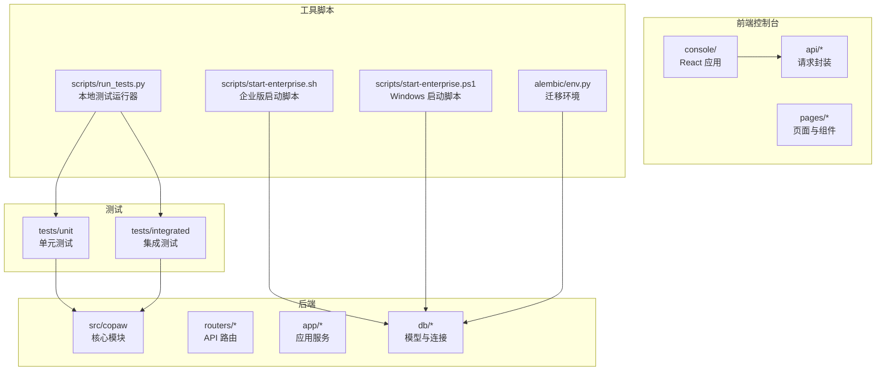
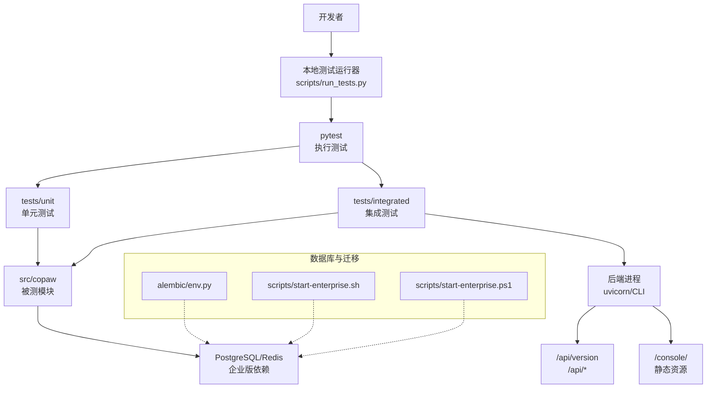
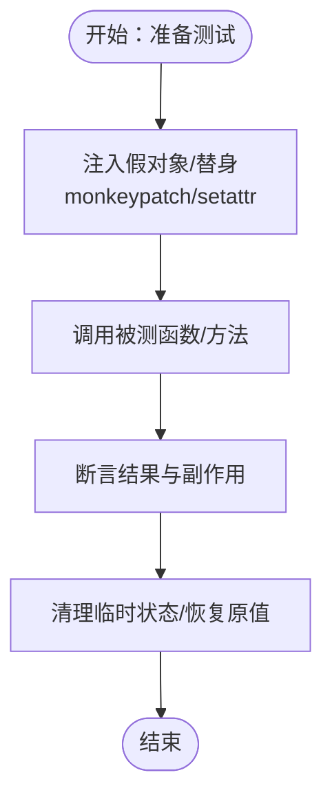
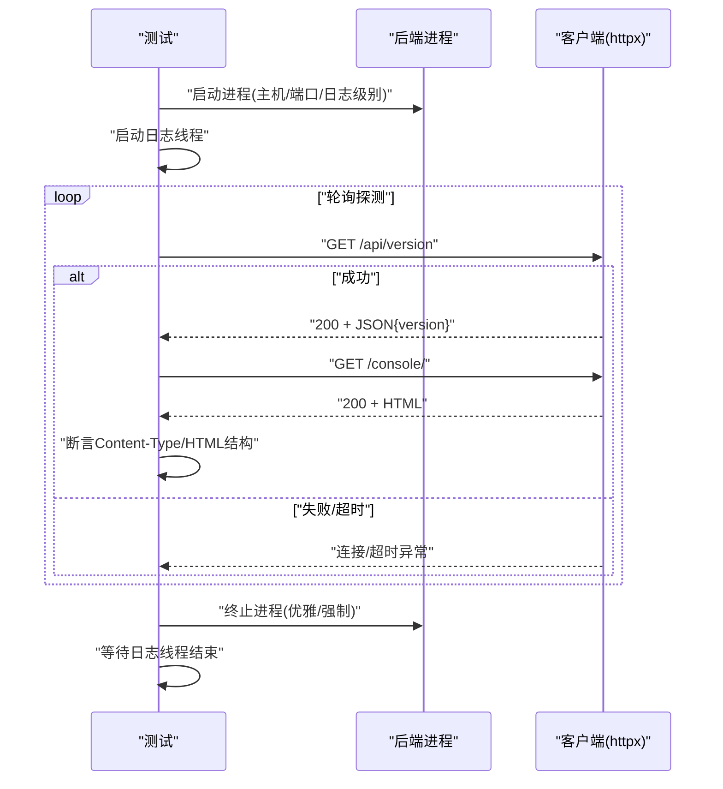
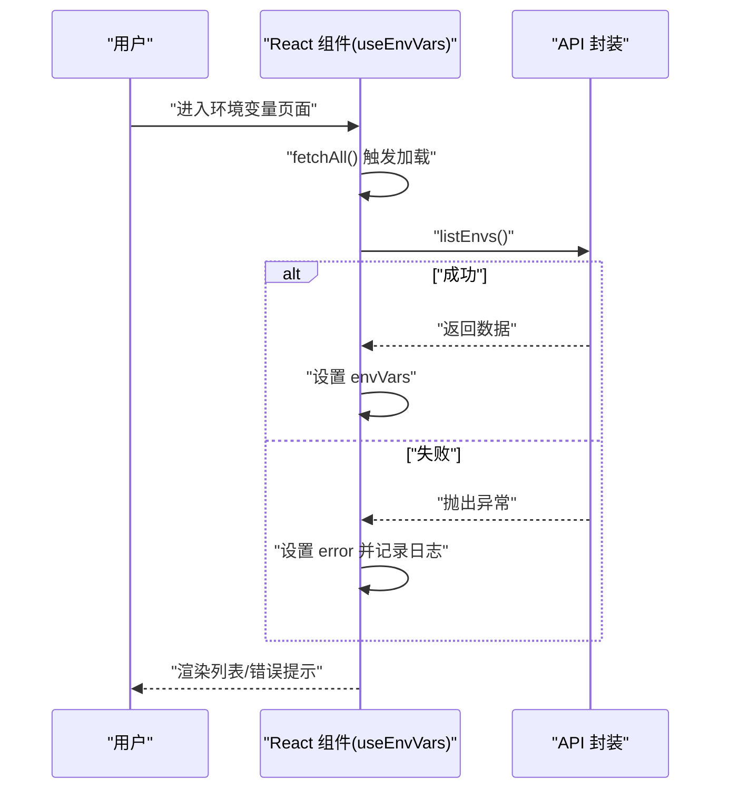
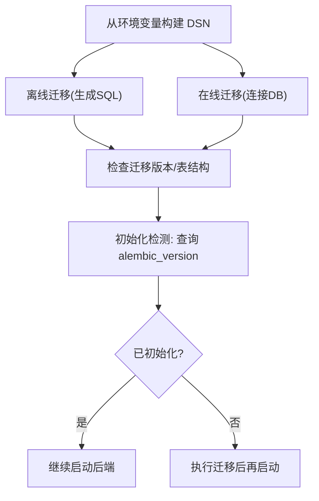
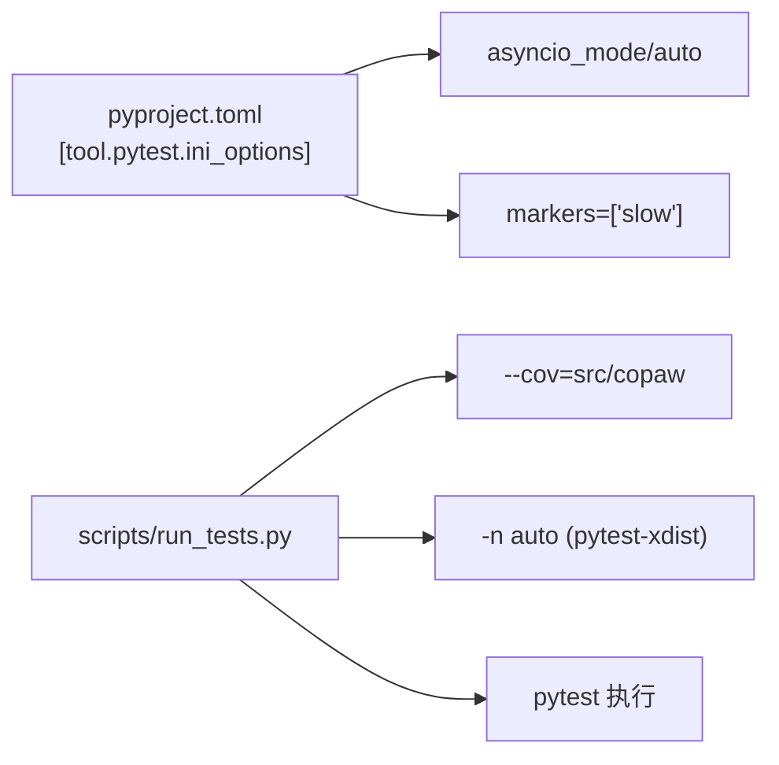

# 测试策略

<cite>
**本文引用的文件**
- [pyproject.toml](file://pyproject.toml)
- [run_tests.py](file://scripts/run_tests.py)
- [test_app_startup.py](file://tests/integrated/test_app_startup.py)
- [test_agents_workspace_initialization.py](file://tests/unit/app/test_agents_workspace_initialization.py)
- [test_openai_provider.py](file://tests/unit/providers/test_openai_provider.py)
- [alembic/env.py](file://alembic/env.py)
- [start-enterprise.sh](file://scripts/start-enterprise.sh)
- [start-enterprise.ps1](file://scripts/start-enterprise.ps1)
- [vite.config.ts](file://console/vite.config.ts)
- [main.tsx](file://console/src/main.tsx)
- [useEnvVars.ts](file://console/src/pages/Settings/Environments/useEnvVars.ts)
- [index.tsx](file://console/src/pages/Settings/Environments/index.tsx)
</cite>

## 目录
1. [引言](#引言)
2. [项目结构](#项目结构)
3. [核心组件](#核心组件)
4. [架构总览](#架构总览)
5. [详细组件分析](#详细组件分析)
6. [依赖分析](#依赖分析)
7. [性能考虑](#性能考虑)
8. [故障排查指南](#故障排查指南)
9. [结论](#结论)
10. [附录](#附录)

## 引言
本文件为 CoPaw 项目建立完整的测试策略体系，覆盖单元测试、集成测试与端到端测试的设计原则与实施方法；明确测试框架选择（pytest）、测试用例编写规范与测试数据管理；给出后端 API 测试、前端组件测试与数据库测试的具体实现建议；包含测试覆盖率要求、持续集成测试流程与自动化测试配置；并提供测试调试技巧、性能测试与压力测试指导。

## 项目结构
CoPaw 采用“后端 Python 包 + 前端 React 控制台 + 集成/单元测试”的分层组织方式：
- 后端包：src/copaw（核心业务逻辑、路由、服务）
- 前端控制台：console（React 应用，提供设置、工作区、技能等页面）
- 测试：tests/unit 与 tests/integrated
- 工具脚本：scripts（本地测试运行器、企业版启动脚本）

图表来源
- [run_tests.py:175-277](file://scripts/run_tests.py#L175-L277)
- [test_app_startup.py:33-133](file://tests/integrated/test_app_startup.py#L33-L133)
- [alembic/env.py:1-94](file://alembic/env.py#L1-L94)

章节来源
- [pyproject.toml:118-124](file://pyproject.toml#L118-L124)
- [run_tests.py:175-277](file://scripts/run_tests.py#L175-L277)

## 核心组件
- 测试框架与配置
  - 框架：pytest（支持异步、标记、并行）
  - 配置：在 pyproject.toml 中启用 asyncio 模式与自定义标记
- 本地测试运行器
  - 支持按子目录运行单元测试、运行集成测试、覆盖率生成、并行执行
- 集成测试
  - 启动后端进程，探测 /api/version 与控制台 /console/ 可达性，校验返回内容类型与 HTML 结构
- 单元测试示例
  - 应用工作区初始化：验证目录结构与种子文件
  - 提供商连接检查与模型列表处理：模拟外部 API，断言行为与错误路径
- 数据库与迁移
  - 使用 Alembic 管理企业版数据库迁移，提供离线/在线迁移环境
  - 企业版启动脚本检测数据库是否已初始化

章节来源
- [pyproject.toml:118-124](file://pyproject.toml#L118-L124)
- [run_tests.py:76-173](file://scripts/run_tests.py#L76-L173)
- [test_app_startup.py:33-133](file://tests/integrated/test_app_startup.py#L33-L133)
- [test_agents_workspace_initialization.py:18-109](file://tests/unit/app/test_agents_workspace_initialization.py#L18-L109)
- [test_openai_provider.py:21-269](file://tests/unit/providers/test_openai_provider.py#L21-L269)
- [alembic/env.py:44-94](file://alembic/env.py#L44-L94)
- [start-enterprise.sh:143-178](file://scripts/start-enterprise.sh#L143-L178)
- [start-enterprise.ps1:209-245](file://scripts/start-enterprise.ps1#L209-L245)

## 架构总览
下图展示测试策略在系统中的位置与交互：

图表来源
- [run_tests.py:148-173](file://scripts/run_tests.py#L148-L173)
- [test_app_startup.py:33-133](file://tests/integrated/test_app_startup.py#L33-L133)
- [alembic/env.py:44-94](file://alembic/env.py#L44-L94)
- [start-enterprise.sh:143-178](file://scripts/start-enterprise.sh#L143-L178)
- [start-enterprise.ps1:209-245](file://scripts/start-enterprise.ps1#L209-L245)

## 详细组件分析

### 单元测试设计与实施
- 设计原则
  - 隔离外部依赖：使用 monkeypatch 注入假对象或替换模块属性
  - 行为驱动：针对函数输入输出与异常路径进行断言
  - 可重复性：使用 tmp_path 等临时目录，避免状态污染
- 实施要点
  - 使用 pytest fixtures（如 tmp_path、monkeypatch）管理测试上下文
  - 对异步函数使用 asyncio 模式，确保正确协程调度
- 示例分析
  - 应用工作区初始化：断言目录结构、种子文件复制目标、语言参数传递顺序
  - OpenAI 提供商：连接检查、模型列表去重与规范化、错误捕获、配置更新与冻结字段保护

图表来源
- [test_agents_workspace_initialization.py:18-109](file://tests/unit/app/test_agents_workspace_initialization.py#L18-L109)
- [test_openai_provider.py:21-269](file://tests/unit/providers/test_openai_provider.py#L21-L269)

章节来源
- [test_agents_workspace_initialization.py:18-109](file://tests/unit/app/test_agents_workspace_initialization.py#L18-L109)
- [test_openai_provider.py:21-269](file://tests/unit/providers/test_openai_provider.py#L21-L269)
- [pyproject.toml:118-124](file://pyproject.toml#L118-L124)

### 集成测试设计与实施
- 设计原则
  - 端到端验证：启动后端进程，验证 API 与控制台可用性
  - 超时与错误处理：对连接失败、进程提前退出、依赖缺失进行诊断
  - 内容校验：校验响应状态码、Content-Type、HTML 结构
- 实施要点
  - 动态找端口、子进程日志实时输出缓冲
  - 使用 httpx 客户端轮询探测 /api/version
  - 终止进程与线程安全回收

图表来源
- [test_app_startup.py:33-133](file://tests/integrated/test_app_startup.py#L33-L133)

章节来源
- [test_app_startup.py:33-133](file://tests/integrated/test_app_startup.py#L33-L133)

### 端到端测试设计与实施（前端）
- 设计原则
  - 页面行为验证：组件挂载、数据加载、错误处理、用户交互
  - 环境变量页面：列表加载、错误提示、状态切换
- 实施要点
  - React Hooks 测试：使用自定义 Hook 返回值与副作用断言
  - 开发代理：Vite 代理将 /api 请求转发至后端，避免跨域问题
  - 控制台入口：屏蔽特定控制台警告以减少噪音

图表来源
- [useEnvVars.ts:10-32](file://console/src/pages/Settings/Environments/useEnvVars.ts#L10-L32)
- [index.tsx:30-33](file://console/src/pages/Settings/Environments/index.tsx#L30-L33)
- [vite.config.ts:34-46](file://console/vite.config.ts#L34-L46)
- [main.tsx:5-28](file://console/src/main.tsx#L5-L28)

章节来源
- [useEnvVars.ts:10-32](file://console/src/pages/Settings/Environments/useEnvVars.ts#L10-L32)
- [index.tsx:30-33](file://console/src/pages/Settings/Environments/index.tsx#L30-L33)
- [vite.config.ts:34-46](file://console/vite.config.ts#L34-L46)
- [main.tsx:5-28](file://console/src/main.tsx#L5-L28)

### 数据库测试与迁移验证
- 设计原则
  - 迁移一致性：通过 Alembic 在离线/在线模式生成/应用迁移
  - 初始化检测：启动脚本查询 alembic_version 判断数据库是否已初始化
- 实施要点
  - 环境变量构建 DSN，支持同步/异步引擎
  - 在 CI 或本地开发中，先迁移再启动后端

图表来源
- [alembic/env.py:44-94](file://alembic/env.py#L44-L94)
- [start-enterprise.sh:143-178](file://scripts/start-enterprise.sh#L143-L178)
- [start-enterprise.ps1:209-245](file://scripts/start-enterprise.ps1#L209-L245)

章节来源
- [alembic/env.py:44-94](file://alembic/env.py#L44-L94)
- [start-enterprise.sh:143-178](file://scripts/start-enterprise.sh#L143-L178)
- [start-enterprise.ps1:209-245](file://scripts/start-enterprise.ps1#L209-L245)

## 依赖分析
- 测试框架与插件
  - pytest、pytest-asyncio、pytest-cov、pytest-xdist（并行）
- 项目依赖与可选依赖
  - dev：开发与测试所需依赖
  - enterprise：企业版数据库与认证相关依赖
- 测试运行器与配置
  - run_tests.py 解析命令行参数，调用 pytest，并根据选项开启覆盖率与并行

图表来源
- [pyproject.toml:118-124](file://pyproject.toml#L118-L124)
- [run_tests.py:148-173](file://scripts/run_tests.py#L148-L173)

章节来源
- [pyproject.toml:74-124](file://pyproject.toml#L74-L124)
- [run_tests.py:148-173](file://scripts/run_tests.py#L148-L173)

## 性能考虑
- 单元测试
  - 使用 monkeypatch 替换外部调用，避免真实网络/磁盘 IO
  - 对耗时操作（如模型列表）进行超时参数化
- 集成测试
  - 合理设置探测超时与重试间隔，避免长时间阻塞
  - 并行执行需谨慎，注意端口冲突与资源竞争
- 前端测试
  - 使用代理避免跨域带来的额外握手开销
  - 屏蔽非关键控制台告警，聚焦业务断言

## 故障排查指南
- pytest 未安装
  - 本地运行器会检测并提示安装命令
- 集成测试失败
  - 检查后端进程是否提前退出、依赖导入错误
  - 查看实时日志缓冲，定位 ImportError/ModuleNotFoundError
- 数据库初始化问题
  - 通过企业版启动脚本检测 alembic_version 是否存在
  - 确认 DSN 环境变量配置正确
- 前端页面加载失败
  - 检查 Vite 代理配置是否指向正确的后端地址
  - 关注控制台错误与警告，确认 API 返回格式

章节来源
- [run_tests.py:63-74](file://scripts/run_tests.py#L63-L74)
- [test_app_startup.py:76-104](file://tests/integrated/test_app_startup.py#L76-L104)
- [start-enterprise.sh:143-178](file://scripts/start-enterprise.sh#L143-L178)
- [vite.config.ts:34-46](file://console/vite.config.ts#L34-L46)
- [main.tsx:5-28](file://console/src/main.tsx#L5-L28)

## 结论
本测试策略以 pytest 为核心，结合本地测试运行器与企业版数据库迁移工具，形成“单元-集成-端到端”三层测试体系。通过隔离外部依赖、统一配置与并行执行，既能保证开发效率，又能覆盖关键业务路径。建议在 CI 中引入覆盖率阈值与慢测试标记，持续完善测试矩阵。

## 附录

### 测试用例编写规范
- 命名规范
  - 使用 test_xxx 的函数命名，描述具体行为或场景
- 断言规范
  - 明确断言点与失败消息，便于定位问题
- Fixtures 使用
  - 优先使用 tmp_path、monkeypatch 等标准 fixtures
- 异步测试
  - 使用 asyncio 模式，确保协程正确调度

章节来源
- [pyproject.toml:118-124](file://pyproject.toml#L118-L124)

### 测试覆盖率要求
- 建议
  - 语句覆盖率不低于 80%，分支覆盖率不低于 60%
  - 关键路径（API、核心算法、数据库访问）覆盖率不低于 90%
- 生成报告
  - 使用本地测试运行器生成 HTML 与终端缺失报告

章节来源
- [run_tests.py:156-163](file://scripts/run_tests.py#L156-L163)

### 持续集成测试流程与自动化配置
- 流程建议
  - 安装开发依赖 → 运行单元测试（含覆盖率）→ 运行集成测试 → 生成覆盖率报告
- 自动化配置
  - 使用本地测试运行器作为 CI 步骤入口，支持并行与覆盖率参数

章节来源
- [run_tests.py:175-277](file://scripts/run_tests.py#L175-L277)

### 性能测试与压力测试指导
- 单元测试
  - 对耗时函数增加超时参数化，验证错误路径与降级策略
- 集成测试
  - 在稳定环境中多次运行 /api/version 与控制台访问，统计成功率与延迟
- 前端测试
  - 使用代理与缓存策略，减少网络抖动影响，关注首屏渲染时间

[本节为通用指导，无需列出章节来源]