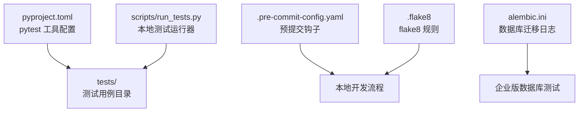
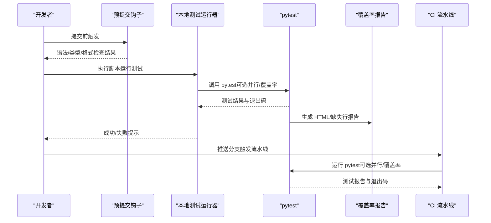
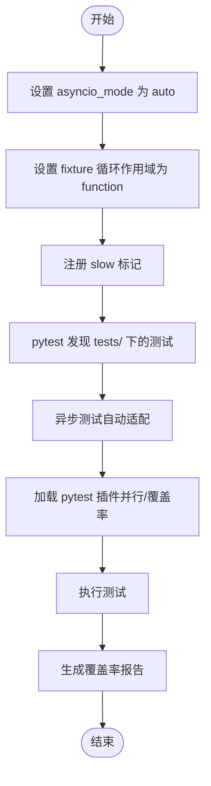
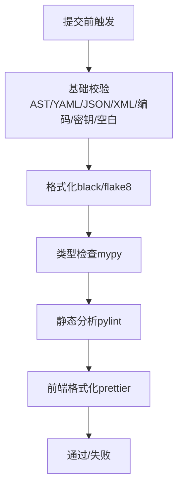
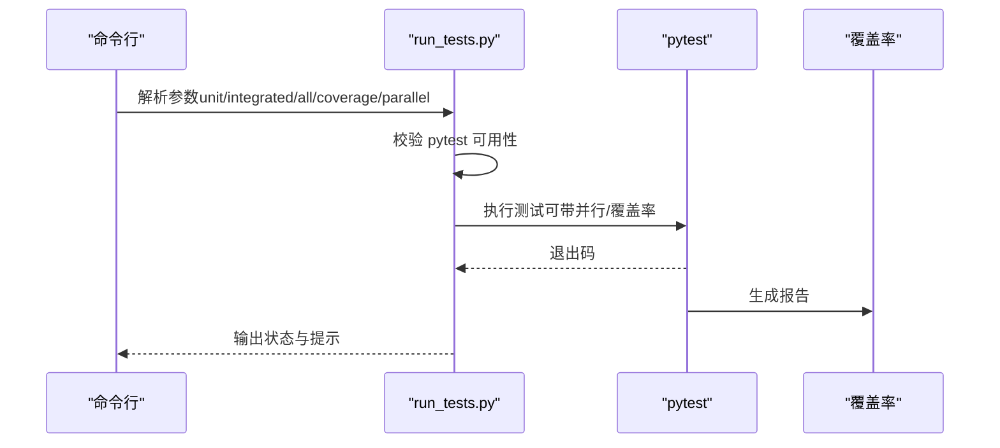
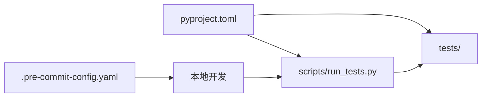

# 测试配置

<cite>
**本文引用的文件**
- [pyproject.toml](file://pyproject.toml)
- [.pre-commit-config.yaml](file://.pre-commit-config.yaml)
- [scripts/run_tests.py](file://scripts/run_tests.py)
- [.flake8](file://.flake8)
- [alembic.ini](file://alembic.ini)
- [tests/integrated/test_app_startup.py](file://tests/integrated/test_app_startup.py)
- [tests/integrated/test_version.py](file://tests/integrated/test_version.py)
- [tests/unit/app/test_agents_workspace_initialization.py](file://tests/unit/app/test_agents_workspace_initialization.py)
- [tests/unit/cli/test_cli_version.py](file://tests/unit/cli/test_cli_version.py)
</cite>

## 目录
1. [简介](#简介)
2. [项目结构](#项目结构)
3. [核心组件](#核心组件)
4. [架构总览](#架构总览)
5. [详细组件分析](#详细组件分析)
6. [依赖关系分析](#依赖关系分析)
7. [性能考虑](#性能考虑)
8. [故障排查指南](#故障排查指南)
9. [结论](#结论)
10. [附录](#附录)

## 简介
本文件为 CoPaw 项目建立标准化的测试配置体系，覆盖 pytest 配置与参数优化（测试发现规则、插件配置、输出格式）、预提交钩子（代码格式检查、静态分析、测试自动执行）、测试环境变量与数据库隔离、并发测试管理，以及在持续集成中如何配置测试、生成测试报告与分析测试结果的完整流程。目标是帮助开发者快速上手、稳定运行测试，并在团队协作中保持一致的测试质量标准。

## 项目结构
CoPaw 的测试相关配置主要分布在以下位置：
- 根级 pytest 配置：通过 pyproject.toml 的工具配置段集中管理
- 预提交钩子：.pre-commit-config.yaml 统一定义各类静态检查与格式化
- 本地测试运行器：scripts/run_tests.py 提供统一入口，支持单元/集成测试、覆盖率与并行执行
- 代码风格与静态检查：.flake8 控制 flake8 行为
- 数据库迁移配置：alembic.ini 用于企业版数据库迁移日志级别控制

**图示来源**
- [pyproject.toml:118-124](file://pyproject.toml#L118-L124)
- [.pre-commit-config.yaml:1-121](file://.pre-commit-config.yaml#L1-121)
- [scripts/run_tests.py:148-173](file://scripts/run_tests.py#L148-L173)
- [.flake8:1-12](file://.flake8#L1-L12)
- [alembic.ini:1-44](file://alembic.ini#L1-L44)

**章节来源**
- [pyproject.toml:118-124](file://pyproject.toml#L118-L124)
- [.pre-commit-config.yaml:1-121](file://.pre-commit-config.yaml#L1-L121)
- [scripts/run_tests.py:148-173](file://scripts/run_tests.py#L148-L173)
- [.flake8:1-12](file://.flake8#L1-L12)
- [alembic.ini:1-44](file://alembic.ini#L1-L44)

## 核心组件
- pytest 工具配置与标记
  - asyncio 模式与默认 fixture 循环作用域
  - 自定义标记 slow，便于选择性跳过耗时测试
- 预提交钩子生态
  - AST/语法检查、YAML/JSON/XML/TOML 校验、编码与换行处理
  - 类型检查（mypy）与代码格式（black、flake8、pylint）
  - 前端格式化（prettier，限定 TS/TSX）
- 本地测试运行器
  - 支持按模块运行单元测试、运行集成测试、覆盖率与并行执行
  - 统一输出颜色提示与错误码返回
- 代码风格与静态检查
  - flake8 行长、忽略规则等
- 数据库迁移日志
  - alembic 日志级别控制，避免迁移阶段噪声干扰

**章节来源**
- [pyproject.toml:118-124](file://pyproject.toml#L118-L124)
- [.pre-commit-config.yaml:1-121](file://.pre-commit-config.yaml#L1-L121)
- [scripts/run_tests.py:76-173](file://scripts/run_tests.py#L76-L173)
- [.flake8:1-12](file://.flake8#L1-L12)
- [alembic.ini:1-44](file://alembic.ini#L1-L44)

## 架构总览
下图展示了从本地开发到 CI 的测试配置链路：开发者通过预提交钩子保证代码质量；本地使用 run_tests.py 运行测试并生成覆盖率；pytest 配置确保异步测试与标记策略生效；企业版数据库迁移日志由 alembic.ini 控制。

**图示来源**
- [.pre-commit-config.yaml:1-121](file://.pre-commit-config.yaml#L1-L121)
- [scripts/run_tests.py:175-277](file://scripts/run_tests.py#L175-L277)
- [pyproject.toml:118-124](file://pyproject.toml#L118-L124)

## 详细组件分析

### pytest 配置与参数优化
- 测试发现与组织
  - 测试目录位于 tests/，分为 unit 与 integrated 两大类，分别对应功能单元测试与端到端/集成测试
  - 使用 pytest 默认发现规则，无需额外配置即可识别以 test_ 开头的函数与类
- 异步测试支持
  - asyncio_mode 设置为 auto，配合 asyncio_default_fixture_loop_scope=function，确保每个测试函数拥有独立事件循环
- 标记系统
  - 定义 slow 标记，可通过命令行 -m "not slow" 跳过耗时测试，便于本地快速验证
- 插件与输出
  - 通过 optional-dependencies 中的 pytest、pytest-asyncio、pytest-cov 等插件启用并行与覆盖率
  - 本地运行器 scripts/run_tests.py 可传入 -n auto 启用并行（需 pytest-xdist），并生成 HTML 与 term-missing 报告

**图示来源**
- [pyproject.toml:118-124](file://pyproject.toml#L118-L124)
- [scripts/run_tests.py:148-173](file://scripts/run_tests.py#L148-L173)

**章节来源**
- [pyproject.toml:118-124](file://pyproject.toml#L118-L124)
- [scripts/run_tests.py:148-173](file://scripts/run_tests.py#L148-L173)

### 预提交钩子配置
- 基础校验
  - AST/语法检查、YAML/JSON/XML/TOML 校验、docstring 顺序、编码与私钥检测、尾随空白清理
- 代码格式与类型检查
  - black（行宽 79）、flake8（忽略 E203）、mypy（忽略若干错误类型，跳过特定路径）
  - pylint（大量禁用项，聚焦关键问题）
- 前端格式化
  - prettier 仅对 TS/TSX 文件生效，排除 web/console/dist 与 skills 目录
- 排除规则
  - 大量 exclude 正则屏蔽 skills 与 scripts/pack 等目录，避免误报与性能开销

**图示来源**
- [.pre-commit-config.yaml:1-121](file://.pre-commit-config.yaml#L1-L121)

**章节来源**
- [.pre-commit-config.yaml:1-121](file://.pre-commit-config.yaml#L1-L121)

### 本地测试运行器（scripts/run_tests.py）
- 功能特性
  - 支持 -u/--unit（可指定子目录）、-i/--integrated、-a/--all、-c/--coverage、-p/--parallel
  - 自动检测 pytest 是否安装，未安装时给出安装建议
  - 并行执行通过 -n auto 实现（需 pytest-xdist）
  - 覆盖率报告生成至 htmlcov/index.html
- 输出与错误码
  - 彩色终端输出（信息/成功/警告/错误）
  - 返回码遵循 pytest 退出码，便于 CI 判定

**图示来源**
- [scripts/run_tests.py:175-277](file://scripts/run_tests.py#L175-L277)
- [scripts/run_tests.py:148-173](file://scripts/run_tests.py#L148-L173)

**章节来源**
- [scripts/run_tests.py:76-173](file://scripts/run_tests.py#L76-L173)
- [scripts/run_tests.py:175-277](file://scripts/run_tests.py#L175-L277)

### 代码风格与静态检查（.flake8）
- 行长限制与忽略规则
  - max-line-length=79，忽略 F401/F403/W503/E731 等常见规则
- 适用范围
  - 主要面向后端 Python 代码，前端由 pre-commit 的 flake8/black 与 prettier 共同保障

**章节来源**
- [.flake8:1-12](file://.flake8#L1-L12)

### 数据库迁移日志（alembic.ini）
- 日志级别控制
  - root/sqlalchemy/alembic 分别设置不同级别，减少迁移过程中的噪声输出
- 用途
  - 在企业版数据库迁移场景下，降低日志干扰，提升可观测性

**章节来源**
- [alembic.ini:1-44](file://alembic.ini#L1-L44)

## 依赖关系分析
- pytest 配置与运行器
  - pyproject.toml 提供 pytest 工具配置，scripts/run_tests.py 作为统一入口调用 pytest
- 预提交与测试
  - 预提交钩子在本地拦截低质量变更，减少 pytest 失败概率
- 覆盖率与并行
  - 通过 optional-dependencies 引入 pytest-cov 与 pytest-xdist，本地运行器按需启用

**图示来源**
- [pyproject.toml:118-124](file://pyproject.toml#L118-L124)
- [scripts/run_tests.py:175-277](file://scripts/run_tests.py#L175-L277)

**章节来源**
- [pyproject.toml:118-124](file://pyproject.toml#L118-L124)
- [scripts/run_tests.py:175-277](file://scripts/run_tests.py#L175-L277)

## 性能考虑
- 并发测试
  - 使用 -n auto 启用并行，显著缩短测试时间；注意避免共享资源竞争
- 覆盖率生成
  - 仅对 src/copaw 包生成覆盖率，缩小扫描范围；HTML 与 term-missing 报告便于定位缺失行
- 预提交过滤
  - 大量 exclude 正则减少无关文件检查，提高本地提交速度
- 异步测试
  - auto 模式与 function 作用域减少事件循环切换成本，提升异步用例稳定性

[本节为通用指导，不直接分析具体文件]

## 故障排查指南
- pytest 未安装
  - 现象：本地运行器提示未安装 pytest
  - 处理：根据提示安装 dev 与 full 依赖
- 测试目录不存在或为空
  - 现象：提示未找到 tests/unit 或 tests/integrated
  - 处理：确认 tests 子目录存在且包含 .py 文件
- 并行执行失败
  - 现象：传入 -p 但无 pytest-xdist
  - 处理：安装 pytest-xdist 或移除 -p
- 覆盖率报告未生成
  - 现象：未生成 htmlcov 目录
  - 处理：确认传入 -c；检查 pytest-cov 版本与配置
- 预提交失败
  - 现象：black/flake8/mypy/pylint 报错
  - 处理：按提示修复格式/类型/命名/复杂度等问题；必要时调整 exclude 规则

**章节来源**
- [scripts/run_tests.py:221-227](file://scripts/run_tests.py#L221-L227)
- [scripts/run_tests.py:100-107](file://scripts/run_tests.py#L100-L107)
- [scripts/run_tests.py:132-140](file://scripts/run_tests.py#L132-L140)

## 结论
通过集中化的 pytest 配置、完善的预提交钩子、统一的本地测试运行器与清晰的覆盖率/并行策略，CoPaw 已形成一套可复用、可扩展的测试配置体系。建议在 CI 中沿用相同配置，结合企业版数据库迁移日志控制，确保测试稳定性与可维护性。

[本节为总结性内容，不直接分析具体文件]

## 附录

### 测试发现与组织示例
- 单元测试示例：tests/unit/app/test_agents_workspace_initialization.py
- CLI 测试示例：tests/unit/cli/test_cli_version.py
- 集成测试示例：tests/integrated/test_app_startup.py、tests/integrated/test_version.py

**章节来源**
- [tests/unit/app/test_agents_workspace_initialization.py](file://tests/unit/app/test_agents_workspace_initialization.py)
- [tests/unit/cli/test_cli_version.py](file://tests/unit/cli/test_cli_version.py)
- [tests/integrated/test_app_startup.py](file://tests/integrated/test_app_startup.py)
- [tests/integrated/test_version.py](file://tests/integrated/test_version.py)