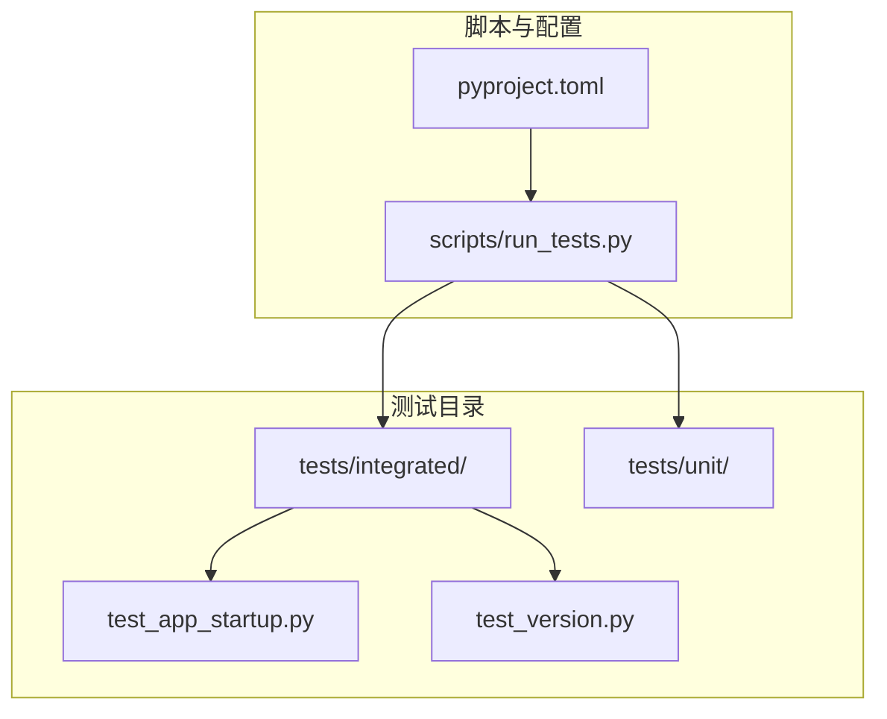
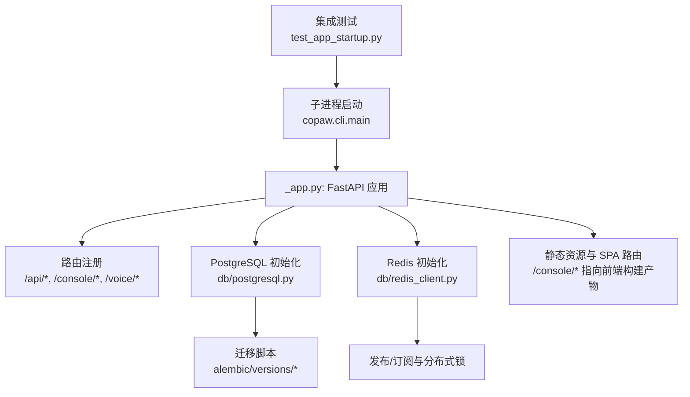
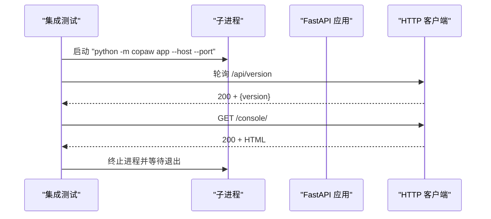
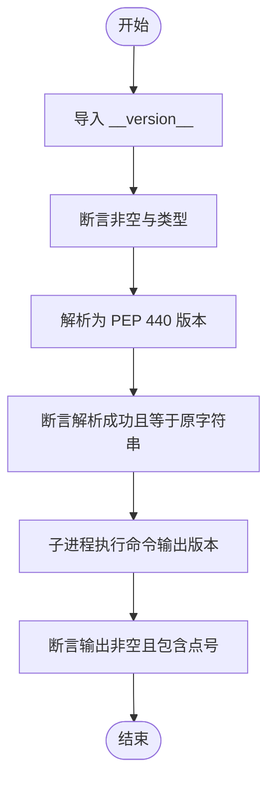
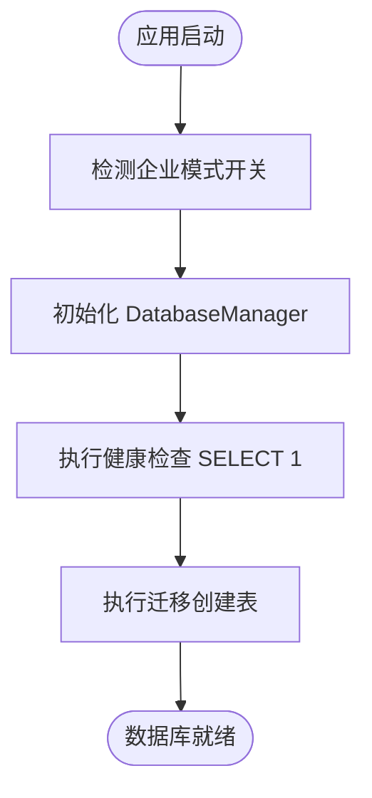
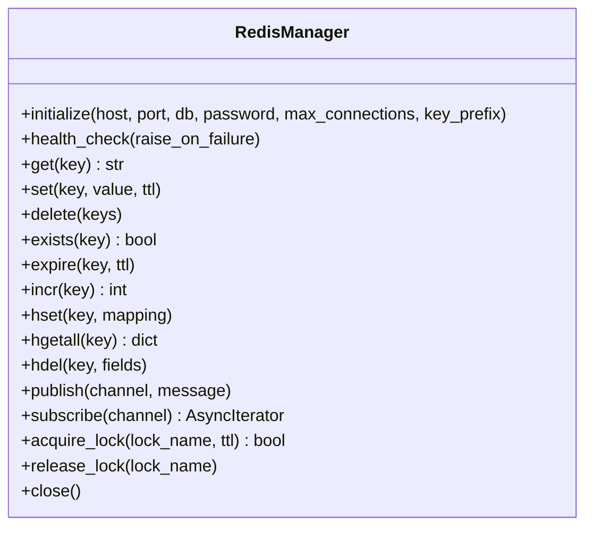
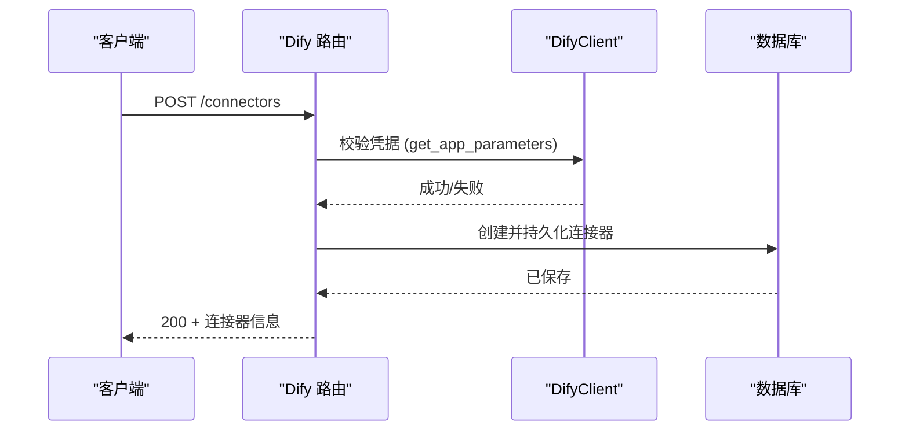
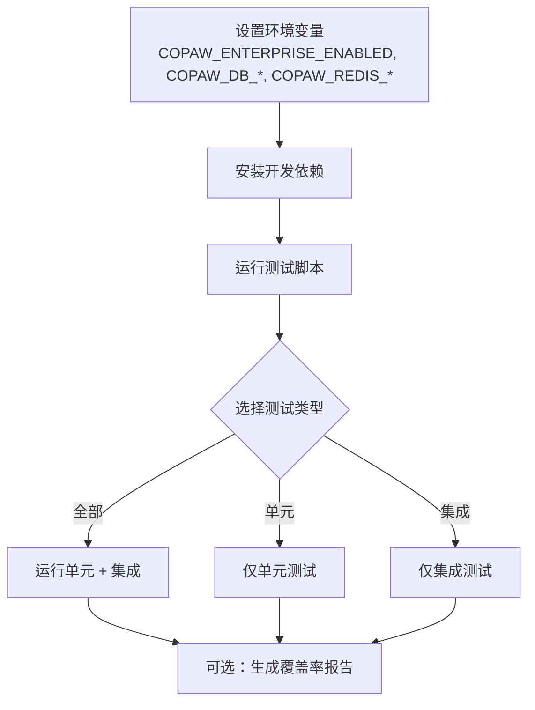
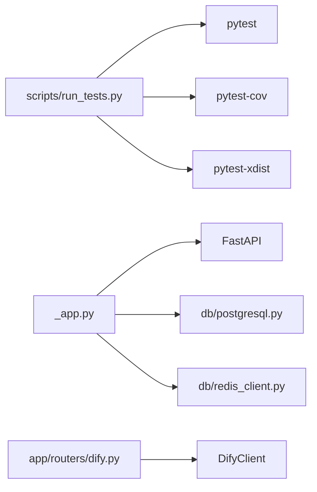

# 集成测试

<cite>
**本文引用的文件**   
- [tests/integrated/test_app_startup.py](file://tests/integrated/test_app_startup.py)
- [tests/integrated/test_version.py](file://tests/integrated/test_version.py)
- [scripts/run_tests.py](file://scripts/run_tests.py)
- [pyproject.toml](file://pyproject.toml)
- [src/copaw/__version__.py](file://src/copaw/__version__.py)
- [src/copaw/__main__.py](file://src/copaw/__main__.py)
- [src/copaw/cli/main.py](file://src/copaw/cli/main.py)
- [src/copaw/app/_app.py](file://src/copaw/app/_app.py)
- [src/copaw/db/postgresql.py](file://src/copaw/db/postgresql.py)
- [src/copaw/db/redis_client.py](file://src/copaw/db/redis_client.py)
- [src/copaw/config/config.py](file://src/copaw/config/config.py)
- [src/copaw/app/routers/dify.py](file://src/copaw/app/routers/dify.py)
- [scripts/start-enterprise.ps1](file://scripts/start-enterprise.ps1)
- [alembic/versions/002_enterprise_phase_a.py](file://alembic/versions/002_enterprise_phase_a.py)
</cite>

## 目录
1. [简介](#简介)
2. [项目结构](#项目结构)
3. [核心组件](#核心组件)
4. [架构总览](#架构总览)
5. [详细组件分析](#详细组件分析)
6. [依赖分析](#依赖分析)
7. [性能考虑](#性能考虑)
8. [故障排查指南](#故障排查指南)
9. [结论](#结论)
10. [附录](#附录)

## 简介
本文件为 CoPaw 项目建立完整的集成测试体系文档，覆盖组件间交互测试、API 接口测试与端到端流程测试。重点包括：
- 应用程序启动测试：验证后端进程启动、健康检查、控制台页面可用性与内容校验。
- 版本验证测试：确保版本号可导入、遵循 PEP 440 格式，并可通过子进程正确输出。
- 数据库连接测试：验证 PostgreSQL 连接池初始化、健康检查与迁移表存在性。
- 外部服务集成测试：验证 Redis 连接、发布订阅与分布式锁能力。
- 第三方 API 测试：验证与 Dify 等外部系统的连接与鉴权校验流程。
- 测试环境搭建、测试数据准备与测试结果验证的标准流程。

## 项目结构
集成测试位于 tests/integrated 目录，当前包含两条关键用例：应用启动与控制台访问、版本号验证；测试运行器位于 scripts/run_tests.py，支持按模块选择运行单元或集成测试，并可生成覆盖率报告。

**图表来源**
- [tests/integrated/test_app_startup.py:1-133](file://tests/integrated/test_app_startup.py#L1-L133)
- [tests/integrated/test_version.py:1-49](file://tests/integrated/test_version.py#L1-L49)
- [scripts/run_tests.py:1-282](file://scripts/run_tests.py#L1-L282)
- [pyproject.toml:118-124](file://pyproject.toml#L118-L124)

**章节来源**
- [tests/integrated/test_app_startup.py:1-133](file://tests/integrated/test_app_startup.py#L1-L133)
- [tests/integrated/test_version.py:1-49](file://tests/integrated/test_version.py#L1-L49)
- [scripts/run_tests.py:1-282](file://scripts/run_tests.py#L1-L282)
- [pyproject.toml:118-124](file://pyproject.toml#L118-L124)

## 核心组件
- 应用启动与控制台测试：通过子进程启动后端，轮询 /api/version 健康检查，随后访问 /console/ 并断言返回 HTML 内容。
- 版本测试：验证版本字符串可导入、符合 PEP 440 规范，并能通过子进程命令输出。
- 测试运行器：统一入口，支持运行全部、单元或集成测试，支持并行与覆盖率。

**章节来源**
- [tests/integrated/test_app_startup.py:33-133](file://tests/integrated/test_app_startup.py#L33-L133)
- [tests/integrated/test_version.py:12-49](file://tests/integrated/test_version.py#L12-L49)
- [scripts/run_tests.py:123-173](file://scripts/run_tests.py#L123-L173)

## 架构总览
下图展示从测试到应用启动、路由注册与静态资源服务的整体链路，以及数据库与 Redis 的初始化路径。

**图表来源**
- [tests/integrated/test_app_startup.py:33-133](file://tests/integrated/test_app_startup.py#L33-L133)
- [src/copaw/app/_app.py:475-685](file://src/copaw/app/_app.py#L475-L685)
- [src/copaw/db/postgresql.py:41-187](file://src/copaw/db/postgresql.py#L41-L187)
- [src/copaw/db/redis_client.py:22-218](file://src/copaw/db/redis_client.py#L22-L218)
- [alembic/versions/002_enterprise_phase_a.py:72-95](file://alembic/versions/002_enterprise_phase_a.py#L72-L95)

## 详细组件分析

### 组件一：应用程序启动与控制台访问测试
目标
- 验证后端进程成功启动并在指定主机与端口监听。
- 通过 /api/version 获取版本信息并断言格式正确。
- 访问 /console/ 返回 HTML 内容且包含基本标记。

设计要点
- 动态寻找空闲端口避免冲突。
- 子进程输出实时打印并缓存，便于失败时定位问题。
- 使用超时与重试策略轮询健康检查接口。
- 控制台页面断言 HTML 结构与内容长度。

**图表来源**
- [tests/integrated/test_app_startup.py:33-133](file://tests/integrated/test_app_startup.py#L33-L133)
- [src/copaw/app/_app.py:594-598](file://src/copaw/app/_app.py#L594-L598)
- [src/copaw/app/_app.py:667-685](file://src/copaw/app/_app.py#L667-L685)

**章节来源**
- [tests/integrated/test_app_startup.py:33-133](file://tests/integrated/test_app_startup.py#L33-L133)
- [src/copaw/app/_app.py:594-598](file://src/copaw/app/_app.py#L594-L598)
- [src/copaw/app/_app.py:667-685](file://src/copaw/app/_app.py#L667-L685)

### 组件二：版本验证测试
目标
- 验证版本字符串可从模块导入且非空。
- 验证版本遵循 PEP 440 格式。
- 验证通过子进程命令输出版本号。

设计要点
- 使用 packaging.version 解析版本并回退为字符串进行断言。
- 子进程执行一行命令获取版本号，断言非空且包含点号。

**图表来源**
- [tests/integrated/test_version.py:12-49](file://tests/integrated/test_version.py#L12-L49)
- [src/copaw/__version__.py:1-5](file://src/copaw/__version__.py#L1-L5)

**章节来源**
- [tests/integrated/test_version.py:12-49](file://tests/integrated/test_version.py#L12-L49)
- [src/copaw/__version__.py:1-5](file://src/copaw/__version__.py#L1-L5)

### 组件三：数据库连接测试（PostgreSQL）
目标
- 验证企业模式下 PostgreSQL 初始化成功。
- 验证连接池健康检查通过。
- 验证迁移脚本创建的关键表存在。

设计要点
- 通过环境变量或配置注入数据库参数。
- 初始化时立即执行健康检查以快速失败。
- 迁移脚本中包含企业功能相关的表定义。

**图表来源**
- [src/copaw/app/_app.py:188-209](file://src/copaw/app/_app.py#L188-L209)
- [src/copaw/db/postgresql.py:61-114](file://src/copaw/db/postgresql.py#L61-L114)
- [alembic/versions/002_enterprise_phase_a.py:72-95](file://alembic/versions/002_enterprise_phase_a.py#L72-L95)

**章节来源**
- [src/copaw/app/_app.py:188-209](file://src/copaw/app/_app.py#L188-L209)
- [src/copaw/db/postgresql.py:61-114](file://src/copaw/db/postgresql.py#L61-L114)
- [alembic/versions/002_enterprise_phase_a.py:72-95](file://alembic/versions/002_enterprise_phase_a.py#L72-L95)

### 组件四：外部服务集成测试（Redis）
目标
- 验证 Redis 初始化成功并可连通。
- 验证常用操作：缓存读写、哈希存储、发布订阅、分布式锁。

设计要点
- 通过环境变量或配置注入 Redis 参数。
- 初始化时执行健康检查 ping。
- 提供键前缀命名空间管理。

**图表来源**
- [src/copaw/db/redis_client.py:22-218](file://src/copaw/db/redis_client.py#L22-L218)

**章节来源**
- [src/copaw/db/redis_client.py:22-218](file://src/copaw/db/redis_client.py#L22-L218)

### 组件五：第三方 API 测试（Dify 连接器）
目标
- 验证创建/更新连接器时对第三方 API 的鉴权与连通性校验。
- 验证保存连接器记录并返回响应。

设计要点
- 在保存前使用 DifyClient 尝试调用受保护接口以验证凭据。
- 对异常进行捕获并转换为 HTTP 400 错误。

**图表来源**
- [src/copaw/app/routers/dify.py:42-66](file://src/copaw/app/routers/dify.py#L42-L66)

**章节来源**
- [src/copaw/app/routers/dify.py:42-66](file://src/copaw/app/routers/dify.py#L42-L66)

### 组件六：测试环境搭建与数据准备
- 测试运行器：支持运行全部、单元或集成测试，支持并行与覆盖率。
- 依赖安装：开发依赖在 pyproject.toml 中定义，需安装以支持 pytest 与覆盖率。
- 企业模式：可通过环境变量启用企业功能，从而触发数据库与 Redis 初始化。

**图表来源**
- [scripts/run_tests.py:175-282](file://scripts/run_tests.py#L175-L282)
- [pyproject.toml:73-116](file://pyproject.toml#L73-L116)

**章节来源**
- [scripts/run_tests.py:175-282](file://scripts/run_tests.py#L175-L282)
- [pyproject.toml:73-116](file://pyproject.toml#L73-L116)

## 依赖分析
- 测试运行器依赖 pytest 与可选的并行插件、覆盖率工具。
- 应用启动测试依赖 FastAPI 路由与静态资源服务。
- 数据库与 Redis 初始化依赖环境变量或配置对象。
- 第三方 API 测试依赖企业功能路由与外部客户端封装。

**图表来源**
- [scripts/run_tests.py:148-173](file://scripts/run_tests.py#L148-L173)
- [src/copaw/app/_app.py:475-685](file://src/copaw/app/_app.py#L475-L685)
- [src/copaw/db/postgresql.py:41-187](file://src/copaw/db/postgresql.py#L41-L187)
- [src/copaw/db/redis_client.py:22-218](file://src/copaw/db/redis_client.py#L22-L218)
- [src/copaw/app/routers/dify.py:42-66](file://src/copaw/app/routers/dify.py#L42-L66)

**章节来源**
- [scripts/run_tests.py:148-173](file://scripts/run_tests.py#L148-L173)
- [src/copaw/app/_app.py:475-685](file://src/copaw/app/_app.py#L475-L685)
- [src/copaw/db/postgresql.py:41-187](file://src/copaw/db/postgresql.py#L41-L187)
- [src/copaw/db/redis_client.py:22-218](file://src/copaw/db/redis_client.py#L22-L218)
- [src/copaw/app/routers/dify.py:42-66](file://src/copaw/app/routers/dify.py#L42-L66)

## 性能考虑
- 启动测试采用轮询与超时机制，避免长时间阻塞。
- 数据库与 Redis 初始化在应用生命周期早期完成，减少后续请求延迟。
- 静态资源服务与 SPA 回退路由优先级明确，避免 API 路由冲突。
- 可选并行运行与覆盖率收集，平衡测试完整性与执行时间。

## 故障排查指南
常见问题与定位方法
- 后端未启动或提前退出：检查子进程日志缓存，关注 ImportError 或 ModuleNotFoundError。
- 健康检查失败：确认主机与端口配置、防火墙与端口占用情况。
- 控制台页面为空或非 HTML：检查前端构建产物路径与静态文件挂载。
- 数据库连接失败：核对环境变量或配置文件中的主机、端口、数据库名与密码。
- Redis 连接失败：核对主机、端口、数据库编号与密码。
- Dify 凭据错误：确认 API URL 与 API Key 正确性，查看 400 错误详情。

**章节来源**
- [tests/integrated/test_app_startup.py:73-104](file://tests/integrated/test_app_startup.py#L73-L104)
- [src/copaw/db/postgresql.py:144-156](file://src/copaw/db/postgresql.py#L144-L156)
- [src/copaw/db/redis_client.py:198-200](file://src/copaw/db/redis_client.py#L198-L200)
- [src/copaw/app/routers/dify.py:42-50](file://src/copaw/app/routers/dify.py#L42-L50)

## 结论
本集成测试体系围绕应用启动、版本验证、数据库与 Redis 连接、以及第三方 API 集成展开，结合测试运行器与标准流程，能够有效保障 CoPaw 在不同部署场景下的稳定性与一致性。建议持续扩展测试覆盖面，补充更多业务流程与边界条件的端到端验证。

## 附录
- 测试运行示例与选项参见测试运行器帮助信息与参数说明。
- 企业模式启用方式与环境变量参考配置与启动脚本。

**章节来源**
- [scripts/run_tests.py:1-282](file://scripts/run_tests.py#L1-L282)
- [pyproject.toml:118-124](file://pyproject.toml#L118-L124)
- [scripts/start-enterprise.ps1:87-125](file://scripts/start-enterprise.ps1#L87-L125)