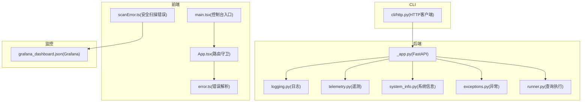
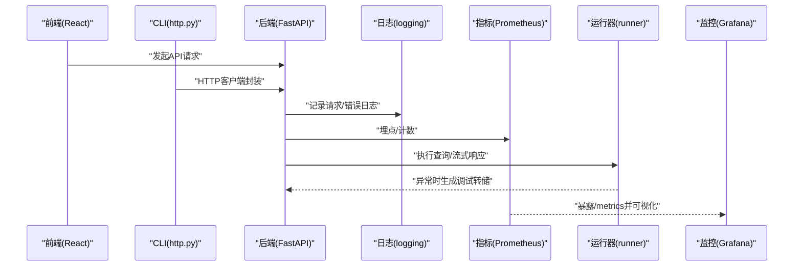
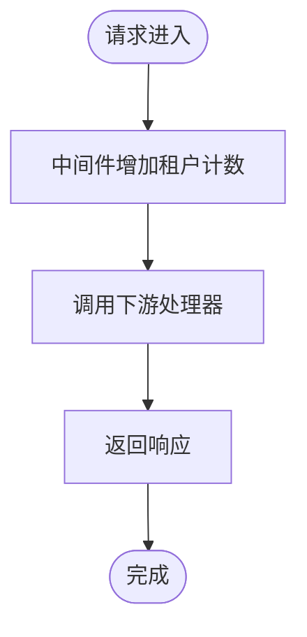
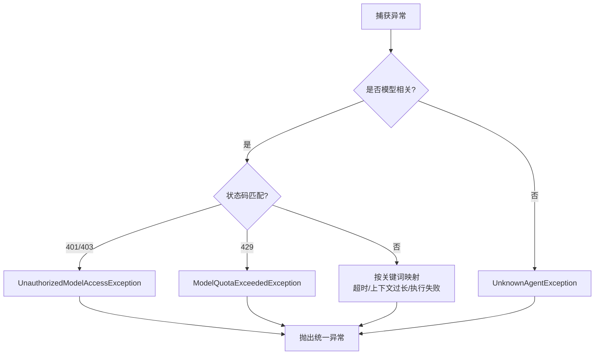
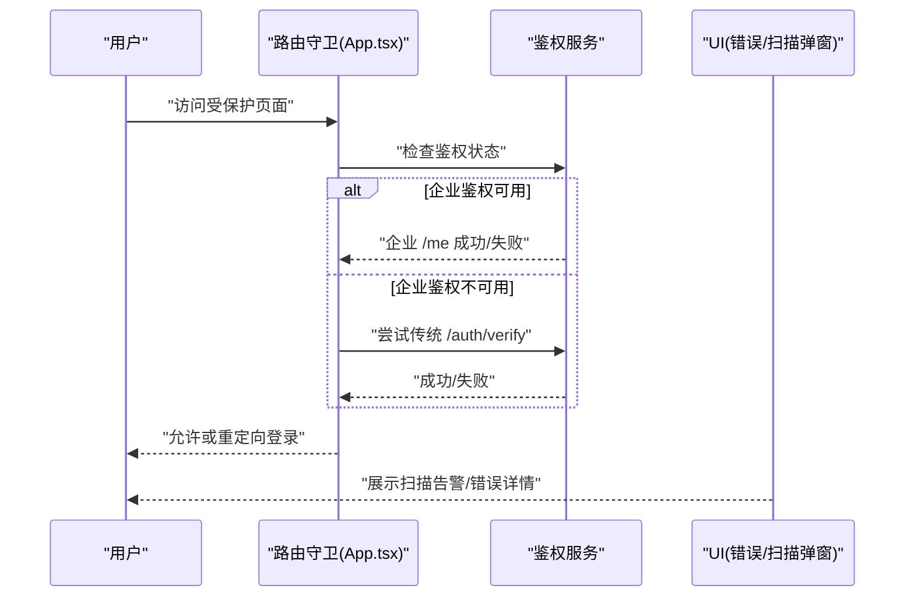
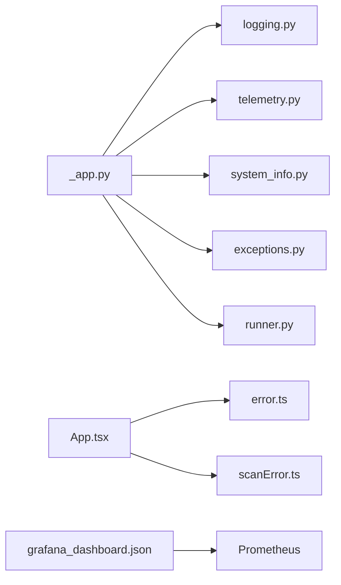

# 调试与性能分析

<cite>
**本文引用的文件**
- [src/copaw/utils/logging.py](file://src/copaw/utils/logging.py)
- [src/copaw/utils/telemetry.py](file://src/copaw/utils/telemetry.py)
- [src/copaw/app/_app.py](file://src/copaw/app/_app.py)
- [src/copaw/utils/system_info.py](file://src/copaw/utils/system_info.py)
- [src/copaw/cli/http.py](file://src/copaw/cli/http.py)
- [console/src/App.tsx](file://console/src/App.tsx)
- [console/src/main.tsx](file://console/src/main.tsx)
- [console/src/utils/error.ts](file://console/src/utils/error.ts)
- [console/src/utils/scanError.ts](file://console/src/utils/scanError.ts)
- [deploy/monitoring/grafana_dashboard.json](file://deploy/monitoring/grafana_dashboard.json)
- [src/copaw/exceptions.py](file://src/copaw/exceptions.py)
- [src/copaw/app/runner/runner.py](file://src/copaw/app/runner/runner.py)
</cite>

## 目录
1. [简介](#简介)
2. [项目结构](#项目结构)
3. [核心组件](#核心组件)
4. [架构总览](#架构总览)
5. [详细组件分析](#详细组件分析)
6. [依赖分析](#依赖分析)
7. [性能考虑](#性能考虑)
8. [故障排查指南](#故障排查指南)
9. [结论](#结论)
10. [附录](#附录)

## 简介
本文件面向 CoPaw 项目的开发者与运维人员，提供系统化的调试与性能分析指导。内容覆盖：
- 日志系统使用与输出格式、级别控制与文件落盘策略
- 错误追踪与异常转换、错误转储与定位
- 性能监控与指标采集（Prometheus）、Grafana 可视化
- 内存与 CPU 性能分析方法与优化建议
- 前端调试技巧、网络请求分析与状态管理调试
- 生产环境问题诊断流程、常见瓶颈识别与解决思路
- 常用调试命令与工具推荐

## 项目结构
CoPaw 采用前后端分离与多语言混合架构：后端基于 FastAPI，前端基于 React；同时包含本地模型、技能与通道等运行时组件。调试与性能分析涉及以下关键路径：
- 后端日志与指标：FastAPI 应用、日志模块、指标中间件
- 前端调试：路由守卫、错误解析、扫描告警弹窗
- 监控可视化：Grafana 面板配置
- CLI 与网络：HTTP 客户端封装、基础地址解析
- 异常体系：统一异常定义与模型错误转换

**图表来源**
- [src/copaw/app/_app.py:475-685](file://src/copaw/app/_app.py#L475-L685)
- [src/copaw/utils/logging.py:119-154](file://src/copaw/utils/logging.py#L119-L154)
- [src/copaw/utils/telemetry.py:292-311](file://src/copaw/utils/telemetry.py#L292-L311)
- [src/copaw/utils/system_info.py:111-121](file://src/copaw/utils/system_info.py#L111-L121)
- [src/copaw/exceptions.py:165-254](file://src/copaw/exceptions.py#L165-L254)
- [src/copaw/app/runner/runner.py:544-577](file://src/copaw/app/runner/runner.py#L544-L577)
- [console/src/App.tsx:49-136](file://console/src/App.tsx#L49-L136)
- [console/src/main.tsx:5-31](file://console/src/main.tsx#L5-L31)
- [console/src/utils/error.ts:1-12](file://console/src/utils/error.ts#L1-L12)
- [console/src/utils/scanError.ts:11-27](file://console/src/utils/scanError.ts#L11-L27)
- [deploy/monitoring/grafana_dashboard.json:1-146](file://deploy/monitoring/grafana_dashboard.json#L1-L146)
- [src/copaw/cli/http.py:14-44](file://src/copaw/cli/http.py#L14-L44)

**章节来源**
- [src/copaw/app/_app.py:475-685](file://src/copaw/app/_app.py#L475-L685)
- [src/copaw/utils/logging.py:119-154](file://src/copaw/utils/logging.py#L119-L154)
- [deploy/monitoring/grafana_dashboard.json:1-146](file://deploy/monitoring/grafana_dashboard.json#L1-L146)

## 核心组件
- 日志系统：彩色终端输出、可选文件落盘、访问日志过滤、级别映射
- 性能监控：Prometheus 指标采集、自定义租户计数器、中间件暴露 /metrics
- 异常体系：模型错误分类与转换、统一业务异常类型
- 前端调试：路由守卫鉴权、错误解析与扫描告警弹窗
- CLI 网络：HTTP 客户端封装、基础地址解析
- 系统信息：跨平台内存与显存检测、CUDA 版本探测

**章节来源**
- [src/copaw/utils/logging.py:119-199](file://src/copaw/utils/logging.py#L119-L199)
- [src/copaw/app/_app.py:482-511](file://src/copaw/app/_app.py#L482-L511)
- [src/copaw/exceptions.py:165-254](file://src/copaw/exceptions.py#L165-L254)
- [console/src/App.tsx:49-136](file://console/src/App.tsx#L49-L136)
- [console/src/utils/error.ts:1-12](file://console/src/utils/error.ts#L1-L12)
- [console/src/utils/scanError.ts:11-27](file://console/src/utils/scanError.ts#L11-L27)
- [src/copaw/cli/http.py:14-44](file://src/copaw/cli/http.py#L14-L44)
- [src/copaw/utils/system_info.py:111-121](file://src/copaw/utils/system_info.py#L111-L121)

## 架构总览
下图展示调试与性能分析在系统中的交互关系：前端通过 HTTP 客户端与后端 API 通信；后端应用初始化日志与指标；异常在运行器中捕获并生成调试转储；监控数据经由 Prometheus 与 Grafana 展示。

**图表来源**
- [src/copaw/cli/http.py:14-44](file://src/copaw/cli/http.py#L14-L44)
- [src/copaw/app/_app.py:482-511](file://src/copaw/app/_app.py#L482-L511)
- [src/copaw/app/runner/runner.py:544-577](file://src/copaw/app/runner/runner.py#L544-L577)
- [deploy/monitoring/grafana_dashboard.json:104-117](file://deploy/monitoring/grafana_dashboard.json#L104-L117)

## 详细组件分析

### 日志系统
- 输出格式：终端彩色日志与纯文本文件日志；自动去除路径前缀以提升可读性
- 级别控制：字符串到数值映射；默认 INFO，可通过环境变量调整
- 文件落盘：按平台选择 FileHandler 或 RotatingFileHandler；去重添加避免重复句柄
- 访问日志过滤：可抑制特定路径的 uvicorn 访问日志，降低噪声
- 使用建议：
  - 开发阶段：INFO/DEBUG；生产阶段：INFO；严重问题：ERROR/CRITICAL
  - 在守护进程场景启用 add_copaw_file_handler 将日志写入工作目录
  - 结合 exc_info=True 输出堆栈，便于快速定位

**章节来源**
- [src/copaw/utils/logging.py:119-199](file://src/copaw/utils/logging.py#L119-L199)

### 性能监控与指标
- 初始化：Instrumentator 注册 FastAPI 指标；暴露 /metrics；可按环境变量开关
- 自定义指标：租户维度计数器 copaw_tenant_usage_total，按方法与端点聚合
- 中间件：HTTP 中间件统计每个请求的租户标签并递增计数
- 可视化：Grafana 面板包含“每租户请求数”和“技能使用分布”等面板表达式

**图表来源**
- [src/copaw/app/_app.py:499-509](file://src/copaw/app/_app.py#L499-L509)
- [deploy/monitoring/grafana_dashboard.json:104-127](file://deploy/monitoring/grafana_dashboard.json#L104-L127)

**章节来源**
- [src/copaw/app/_app.py:482-511](file://src/copaw/app/_app.py#L482-L511)
- [deploy/monitoring/grafana_dashboard.json:1-146](file://deploy/monitoring/grafana_dashboard.json#L1-L146)

### 异常体系与错误追踪
- 统一异常：ProviderError、ModelFormatterError、ChannelError、AgentStateError、SkillsError 等
- 模型错误转换：convert_model_exception 将第三方模型错误映射为统一异常类型，保留原始错误详情
- 查询执行错误转储：运行器捕获异常后写入调试转储文件，并在日志中附带路径提示
- 建议：
  - 对模型类错误优先使用转换函数，便于统一上报与告警
  - 出错时查看日志中的调试转储路径，结合转储文件定位上下文

**图表来源**
- [src/copaw/exceptions.py:165-254](file://src/copaw/exceptions.py#L165-L254)
- [src/copaw/app/runner/runner.py:544-577](file://src/copaw/app/runner/runner.py#L544-L577)

**章节来源**
- [src/copaw/exceptions.py:1-254](file://src/copaw/exceptions.py#L1-L254)
- [src/copaw/app/runner/runner.py:544-577](file://src/copaw/app/runner/runner.py#L544-L577)

### 前端调试与网络分析
- 路由守卫：登录态检查、企业与传统鉴权双通道回退、鉴权失败清理令牌并重定向
- 控制台入口：对特定控制台警告进行静默，避免干扰用户
- 错误解析：从错误消息中提取 JSON 包装的详细信息，用于 UI 展示
- 安全扫描错误：解析扫描失败响应，弹窗展示前若干条告警，支持“更多”提示
- 建议：
  - 使用浏览器 Network 面板观察鉴权与资源加载路径
  - 在 Console 中开启 DEBUG 级别日志，结合后端日志交叉比对
  - 对扫描告警，优先修复高风险项并更新白名单

**图表来源**
- [console/src/App.tsx:49-136](file://console/src/App.tsx#L49-L136)
- [console/src/utils/error.ts:1-12](file://console/src/utils/error.ts#L1-L12)
- [console/src/utils/scanError.ts:87-106](file://console/src/utils/scanError.ts#L87-L106)

**章节来源**
- [console/src/App.tsx:49-136](file://console/src/App.tsx#L49-L136)
- [console/src/main.tsx:5-31](file://console/src/main.tsx#L5-L31)
- [console/src/utils/error.ts:1-12](file://console/src/utils/error.ts#L1-L12)
- [console/src/utils/scanError.ts:11-27](file://console/src/utils/scanError.ts#L11-L27)

### CLI 与网络请求
- HTTP 客户端：自动补全 /api 前缀、统一超时、支持命令行 host/port 解析
- 使用建议：
  - 通过 --base-url 或全局 host/port 覆盖默认地址
  - 对慢接口设置更大超时，避免误判

**章节来源**
- [src/copaw/cli/http.py:14-44](file://src/copaw/cli/http.py#L14-L44)

### 系统信息与硬件检测
- 跨平台内存检测：sysconf/sysctl/proc_meminfo/Windows API 多路回退
- CUDA 版本与显存检测：nvidia-smi/nvcc/lspci/wmic 多路探测
- 用途：本地模型推理与资源规划

**章节来源**
- [src/copaw/utils/system_info.py:111-121](file://src/copaw/utils/system_info.py#L111-L121)
- [src/copaw/utils/system_info.py:123-229](file://src/copaw/utils/system_info.py#L123-L229)

## 依赖分析
- 后端依赖关系：_app.py 依赖 logging、telemetry、system_info、exceptions、runner；Prometheus 中间件与指标计数器在应用层注册
- 前端依赖关系：App.tsx 依赖鉴权 API 与语言偏好；main.tsx 对控制台入口进行日志静默；scanError.ts 依赖设计系统的 Modal 组件
- 监控依赖：Grafana 面板依赖 Prometheus 数据源与表达式

**图表来源**
- [src/copaw/app/_app.py:475-685](file://src/copaw/app/_app.py#L475-L685)
- [src/copaw/utils/logging.py:119-154](file://src/copaw/utils/logging.py#L119-L154)
- [src/copaw/utils/telemetry.py:292-311](file://src/copaw/utils/telemetry.py#L292-L311)
- [src/copaw/utils/system_info.py:111-121](file://src/copaw/utils/system_info.py#L111-L121)
- [src/copaw/exceptions.py:165-254](file://src/copaw/exceptions.py#L165-L254)
- [src/copaw/app/runner/runner.py:544-577](file://src/copaw/app/runner/runner.py#L544-L577)
- [console/src/App.tsx:49-136](file://console/src/App.tsx#L49-L136)
- [console/src/utils/error.ts:1-12](file://console/src/utils/error.ts#L1-L12)
- [console/src/utils/scanError.ts:11-27](file://console/src/utils/scanError.ts#L11-L27)
- [deploy/monitoring/grafana_dashboard.json:104-127](file://deploy/monitoring/grafana_dashboard.json#L104-L127)

**章节来源**
- [src/copaw/app/_app.py:475-685](file://src/copaw/app/_app.py#L475-L685)
- [console/src/App.tsx:49-136](file://console/src/App.tsx#L49-L136)
- [deploy/monitoring/grafana_dashboard.json:1-146](file://deploy/monitoring/grafana_dashboard.json#L1-L146)

## 性能考虑
- 日志开销：在高并发场景建议使用 INFO 级别，必要时启用文件落盘；避免在热路径频繁格式化复杂消息
- 指标采集：/metrics 暴露应限制访问范围（如仅内网），避免成为攻击面
- 内存与显存：通过 system_info 获取系统与显存信息，合理规划本地模型占用
- 前端渲染：减少不必要的重渲染，使用 React DevTools Profiler 分析组件渲染时间
- 网络请求：合并请求、缓存响应、避免阻塞主线程；使用浏览器 Network 面板分析耗时

[本节为通用指导，无需列出具体文件来源]

## 故障排查指南
- 启动与初始化
  - 检查日志级别与文件落盘是否生效
  - 确认企业模式下的数据库与 Redis 初始化是否成功
- 鉴权与前端
  - 路由守卫失败时，检查企业与传统鉴权接口返回；清理无效令牌
  - 控制台入口静默规则导致的告警缺失，临时关闭静默以复现
- 模型与技能
  - 使用 convert_model_exception 统一异常类型，便于告警与降级
  - 查询执行异常会生成调试转储，结合日志路径定位上下文
- 监控与可视化
  - 访问 /metrics 确认指标是否暴露；Grafana 面板表达式是否正确
  - 关注租户维度计数与技能使用分布，识别异常峰值
- CLI 与网络
  - 使用 http.py 的客户端封装进行手动验证，确认基础地址与超时设置

**章节来源**
- [src/copaw/app/_app.py:162-473](file://src/copaw/app/_app.py#L162-L473)
- [console/src/App.tsx:49-136](file://console/src/App.tsx#L49-L136)
- [console/src/main.tsx:5-31](file://console/src/main.tsx#L5-L31)
- [src/copaw/exceptions.py:165-254](file://src/copaw/exceptions.py#L165-L254)
- [src/copaw/app/runner/runner.py:544-577](file://src/copaw/app/runner/runner.py#L544-L577)
- [src/copaw/cli/http.py:14-44](file://src/copaw/cli/http.py#L14-L44)

## 结论
通过规范的日志与指标体系、完善的异常转换与调试转储、以及前端与 CLI 的协同调试手段，CoPaw 能够在开发与生产环境中高效定位问题、评估性能瓶颈并持续优化用户体验。建议在团队内推广统一的调试流程与监控看板，形成闭环的问题发现与解决机制。

[本节为总结性内容，无需列出具体文件来源]

## 附录

### 常用调试命令与工具
- 后端
  - 设置日志级别：通过环境变量调整
  - 查看指标：访问 /metrics（生产环境建议限制访问）
  - Grafana：导入 grafana_dashboard.json，配置 Prometheus 数据源
- 前端
  - 浏览器 Network 面板：分析鉴权与资源加载
  - React DevTools：Profiler 分析组件渲染
- CLI
  - 使用 http.py 客户端封装进行手动验证
- 系统
  - 通过 system_info 获取内存与显存信息，辅助资源规划

**章节来源**
- [src/copaw/app/_app.py:482-511](file://src/copaw/app/_app.py#L482-L511)
- [deploy/monitoring/grafana_dashboard.json:1-146](file://deploy/monitoring/grafana_dashboard.json#L1-L146)
- [src/copaw/cli/http.py:14-44](file://src/copaw/cli/http.py#L14-L44)
- [src/copaw/utils/system_info.py:111-121](file://src/copaw/utils/system_info.py#L111-L121)