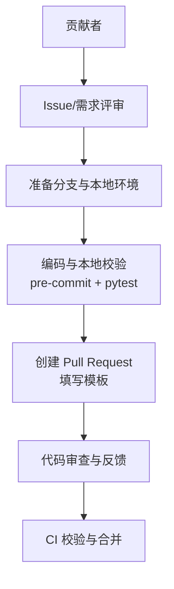
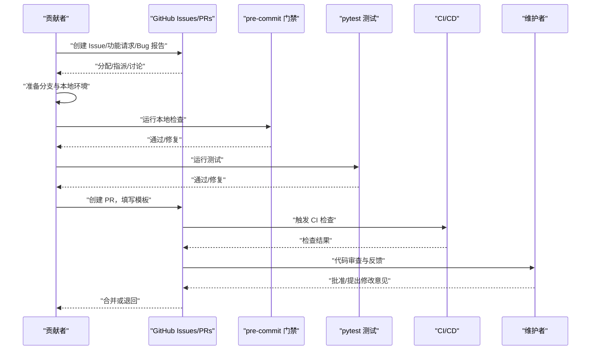
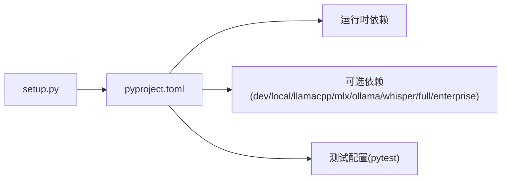

# 贡献流程

<cite>
**本文引用的文件**
- [CONTRIBUTING.md](file://CONTRIBUTING.md)
- [CONTRIBUTING_zh.md](file://CONTRIBUTING_zh.md)
- [.pre-commit-config.yaml](file://.pre-commit-config.yaml)
- [pyproject.toml](file://pyproject.toml)
- [SECURITY.md](file://SECURITY.md)
- [.github/PULL_REQUEST_TEMPLATE.md](file://.github/PULL_REQUEST_TEMPLATE.md)
- [README.md](file://README.md)
- [README_zh.md](file://README_zh.md)
- [docker-compose.yml](file://docker-compose.yml)
- [setup.py](file://setup.py)
</cite>

## 目录
1. [简介](#简介)
2. [项目结构](#项目结构)
3. [核心组件](#核心组件)
4. [架构总览](#架构总览)
5. [详细组件分析](#详细组件分析)
6. [依赖分析](#依赖分析)
7. [性能考虑](#性能考虑)
8. [故障排查指南](#故障排查指南)
9. [结论](#结论)
10. [附录](#附录)

## 简介
本文件为 CoPaw 项目的标准化贡献流程规范，覆盖 Issue 提交、功能请求与 Bug 报告流程，分支管理策略与 Git 提交规范，Pull Request 模板使用，代码审查流程、CI/CD 集成与合并条件，贡献者协议与许可证要求，社区行为准则，以及新贡献者入门指导、常见贡献场景与问题解决方法。目标是帮助贡献者高效、规范地参与项目开发，同时保障代码质量与安全性。

## 项目结构
CoPaw 采用多语言混合架构：后端基于 Python，前端包含 Console 与网站两套 UI，另有企业版与部署相关脚本与配置。贡献流程围绕以下关键要素展开：
- 贡献指南与规范：CONTRIBUTING.md 与 CONTRIBUTING_zh.md
- 代码质量门禁：pre-commit 配置与 pytest 测试
- 提交与 PR 规范：Conventional Commits、PR 模板
- 安全策略：安全披露政策与信任边界
- 开发与构建：pyproject.toml、setup.py、docker-compose.yml

**章节来源**
- [CONTRIBUTING.md:11-236](file://CONTRIBUTING.md#L11-L236)
- [CONTRIBUTING_zh.md:11-238](file://CONTRIBUTING_zh.md#L11-L238)

## 核心组件
- 贡献指南与规范
  - Issue/PR 流程、Conventional Commits、PR 模板、本地门禁与 CI 策略、文档更新要求、平台支持与贡献类型等。
- 代码质量门禁
  - pre-commit 钩子集合（语法检查、格式化、静态类型与 Lint 等），pytest 测试运行。
- 安全策略
  - 私密漏洞披露渠道、报告清单、接受门槛、信任模型与边界、运营建议。
- 开发与构建
  - Python 版本要求、可选依赖、测试标记、脚本入口、打包与分发。

**章节来源**
- [CONTRIBUTING.md:23-86](file://CONTRIBUTING.md#L23-L86)
- [CONTRIBUTING_zh.md:23-86](file://CONTRIBUTING_zh.md#L23-L86)
- [.pre-commit-config.yaml:1-121](file://.pre-commit-config.yaml#L1-L121)
- [pyproject.toml:1-124](file://pyproject.toml#L1-L124)

## 架构总览
下图展示贡献流程的关键节点与交互关系，强调从 Issue 到 PR 合入的闭环。

**图表来源**
- [CONTRIBUTING.md:23-86](file://CONTRIBUTING.md#L23-L86)
- [.pre-commit-config.yaml:1-121](file://.pre-commit-config.yaml#L1-L121)
- [pyproject.toml:118-124](file://pyproject.toml#L118-L124)

## 详细组件分析

### Issue 提交流程（功能请求与 Bug 报告）
- 基本步骤
  - 搜索现有 Issue 与项目看板，确认无重复或未分配；
  - 若无对应 Issue，创建新 Issue 描述需求或问题；
  - 维护者将评估并给出方向与优先级。
- 关键要点
  - 明确问题背景、复现步骤、期望行为与实际行为；
  - 提供环境信息（Python 版本、操作系统、运行方式等）；
  - 便于复现的最小化示例与日志片段更易被采纳。

**章节来源**
- [CONTRIBUTING.md:15-22](file://CONTRIBUTING.md#L15-L22)
- [CONTRIBUTING_zh.md:15-22](file://CONTRIBUTING_zh.md#L15-L22)

### 分支管理策略
- 建议采用功能分支模型
  - 从主分支创建特性分支，命名清晰（如 feat/xxx、fix/xxx、docs/xxx）；
  - 保持分支短期迭代，避免长期分支；
  - 合并前确保分支与上游同步，必要时 rebase。
- 合并与提交
  - 合并前需通过本地门禁与 CI；
  - 提交信息遵循 Conventional Commits 规范。

**章节来源**
- [CONTRIBUTING.md:23-67](file://CONTRIBUTING.md#L23-L67)
- [CONTRIBUTING_zh.md:23-67](file://CONTRIBUTING_zh.md#L23-L67)

### Git 提交规范（Conventional Commits）
- 格式
  - <type>(<scope>): <subject>
- 类型
  - feat、fix、docs、style、refactor、perf、test、chore 等。
- 示例
  - feat(channels): 添加 Telegram 频道桩
  - fix(skills): 修正 SKILL.md front matter 解析
  - docs(readme): 更新 Docker 快速开始
  - refactor(providers): 简化自定义提供商校验
  - test(agents): 为技能加载添加测试
- PR 标题
  - 与提交信息保持一致格式与风格。

**章节来源**
- [CONTRIBUTING.md:27-67](file://CONTRIBUTING.md#L27-L67)
- [CONTRIBUTING_zh.md:27-67](file://CONTRIBUTING_zh.md#L27-L67)

### Pull Request 模板使用
- 模板字段
  - 描述变更目的与影响、关联 Issue、安全注意事项、组件影响范围、本地验证证据、测试方法与补充说明。
- 本地验证
  - 运行 pre-commit 全量检查与 pytest；
  - 文档更新与前端格式化（如涉及 console/website）。
- 合并条件
  - 本地门禁与 CI 均通过；
  - 代码审查通过；
  - 无阻塞性冲突。

**章节来源**
- [.github/PULL_REQUEST_TEMPLATE.md:1-54](file://.github/PULL_REQUEST_TEMPLATE.md#L1-L54)
- [CONTRIBUTING.md:68-86](file://CONTRIBUTING.md#L68-L86)
- [CONTRIBUTING_zh.md:68-86](file://CONTRIBUTING_zh.md#L68-L86)

### 代码审查流程
- 审查要点
  - 功能正确性与边界处理；
  - 代码风格与一致性（遵循 pre-commit 规则）；
  - 测试覆盖与可验证性；
  - 文档更新与用户可见行为变更；
  - 安全与隐私（尤其是通道、凭据、工作目录与技能权限）。
- 审查反馈
  - 明确修改建议与验证清单；
  - 必要时要求补充测试或文档。

**章节来源**
- [CONTRIBUTING.md:68-86](file://CONTRIBUTING.md#L68-L86)
- [SECURITY.md:57-158](file://SECURITY.md#L57-L158)

### CI/CD 集成与合并条件
- 本地门禁（提交前必须通过）
  - 安装开发依赖与预装 pre-commit；
  - 运行全量检查；
  - 运行 pytest；
  - 如 pre-commit 修改文件，需再次运行直至通过。
- CI 策略
  - PR 中若 pre-commit 检查失败，则视为未就绪（not merge-ready）。
- 前端格式化
  - 涉及 console/website 的改动需在提交前运行格式化命令。

**章节来源**
- [CONTRIBUTING.md:70-86](file://CONTRIBUTING.md#L70-L86)
- [CONTRIBUTING_zh.md:70-86](file://CONTRIBUTING_zh.md#L70-L86)
- [.pre-commit-config.yaml:1-121](file://.pre-commit-config.yaml#L1-L121)
- [pyproject.toml:118-124](file://pyproject.toml#L118-L124)

### 贡献类型与场景
- 新增模型/模型提供商
  - 兼容 OpenAI chat.completions 或 Anthropic messages API；
  - 推荐支持 /model/list 自动获取模型列表；
  - 提供测试模型、连接测试与聊天截图；
  - 更新网站文档中的提供商列表与能力标签。
- 新增频道
  - 实现 BaseChannel 子类，遵循统一 payload → content_parts 协议；
  - 注册内置频道，支持 CLI 安装/添加/移除/配置；
  - 更新频道文档（认证、Webhook 等）。
- 基础 Skills
  - 目录结构包含 SKILL.md、references/、scripts/；
  - 清晰的任务导向描述与触发关键词；
  - 同步至工作目录并更新文档。
- 平台支持（Windows/Linux/macOS）
  - 兼容性修复、安装与启动脚本、平台特定功能与文档说明。

**章节来源**
- [CONTRIBUTING.md:95-206](file://CONTRIBUTING.md#L95-L206)
- [CONTRIBUTING_zh.md:95-206](file://CONTRIBUTING_zh.md#L95-L206)

### 安全与合规
- 漏洞披露
  - 通过阿里巴巴安全响应中心（ASRC）私密报告；
  - 报告需包含标题、严重性评估、影响、受影响组件、技术复现步骤、演示影响、环境、修复建议等。
- 信任模型与边界
  - 单操作员边界、共享委托授权、通道与用户白名单、最小权限与沙箱、凭据隔离；
  - 技能被视为受信计算基的一部分，具备与进程同等权限。
- 运营建议
  - 限制通道与用户、最小权限、隔离凭据、定期审查配置与技能、容器运行时非 root、只读挂载与能力最小化。

**章节来源**
- [SECURITY.md:5-158](file://SECURITY.md#L5-L158)

### 许可证与贡献者协议
- 许可证
  - 项目采用 Apache License 2.0。
- 贡献者协议
  - 通过提交 PR 表示同意遵守项目许可证与贡献流程规范。

**章节来源**
- [CONTRIBUTING.md:7](file://CONTRIBUTING.md#L7)
- [CONTRIBUTING_zh.md:7](file://CONTRIBUTING_zh.md#L7)

### 社区行为准则
- 基本原则
  - 尊重与建设性沟通；
  - 遵循友好、包容的社区文化；
  - 讨论大型或设计敏感变更前先在 Issue 中沟通。
- 不可接受行为
  - 大而无当的 PR、忽视 CI 或 pre-commit 失败、混杂无关变更、破坏现有 API 且无迁移说明、未经讨论添加重型可选依赖。

**章节来源**
- [CONTRIBUTING.md:208-227](file://CONTRIBUTING.md#L208-L227)
- [CONTRIBUTING_zh.md:210-228](file://CONTRIBUTING_zh.md#L210-L228)

### 新贡献者入门指导
- 准备工作
  - 阅读贡献指南与安全策略；
  - 搭建本地开发环境（Python 版本、可选依赖、脚本入口）。
- 本地门禁
  - 安装开发依赖与预装 pre-commit；
  - 运行全量检查与 pytest；
  - 如涉及前端，先格式化 console/website。
- 提交与 PR
  - 使用 Conventional Commits；
  - 填写 PR 模板并附带本地验证证据；
  - 等待审查与 CI 结果。

**章节来源**
- [CONTRIBUTING.md:68-86](file://CONTRIBUTING.md#L68-L86)
- [pyproject.toml:6,73-116](file://pyproject.toml#L6,L73-L116)
- [setup.py:1-5](file://setup.py#L1-L5)
- [README.md](file://README.md)
- [README_zh.md](file://README_zh.md)

## 依赖分析
- Python 版本与依赖
  - Python >=3.10 且 <3.14；
  - 可选依赖涵盖本地模型、Ollama、Whisper、企业版数据库与监控等。
- 测试与标记
  - pytest 异步模式与自定义标记（如 slow）。
- 打包与分发
  - setuptools 动态版本与包数据包含前端构建产物与技能资源。

**图表来源**
- [pyproject.toml:1-124](file://pyproject.toml#L1-L124)
- [setup.py:1-5](file://setup.py#L1-L5)

**章节来源**
- [pyproject.toml:6,73-116,118-124](file://pyproject.toml#L6,L73-L116,L118-L124)
- [setup.py:1-5](file://setup.py#L1-L5)

## 性能考虑
- 本地门禁与 CI 检查
  - pre-commit 钩子与 pytest 有助于早期发现问题，减少回归风险；
  - 建议在本地先行优化，降低 CI 时间与资源消耗。
- 前端格式化
  - 涉及 console/website 的改动需格式化，避免 CI 因格式问题失败。

**章节来源**
- [CONTRIBUTING.md:70-86](file://CONTRIBUTING.md#L70-L86)
- [CONTRIBUTING_zh.md:70-86](file://CONTRIBUTING_zh.md#L70-L86)

## 故障排查指南
- pre-commit 检查失败
  - 逐项修复提示的问题；
  - 若自动修复文件，提交后再运行直至通过。
- pytest 失败
  - 定位失败用例，补充或修正测试；
  - 使用 -m "not slow" 选择性运行测试。
- PR 未就绪
  - CI 未通过或本地门禁未通过；
  - 按模板补充本地验证证据与说明。
- 安全相关问题
  - 严格按安全策略私密披露，提供完整复现与影响说明。

**章节来源**
- [.pre-commit-config.yaml:1-121](file://.pre-commit-config.yaml#L1-L121)
- [pyproject.toml:118-124](file://pyproject.toml#L118-L124)
- [SECURITY.md:5-158](file://SECURITY.md#L5-L158)

## 结论
通过标准化的 Issue/PR 流程、严格的本地门禁与 CI 策略、清晰的提交与审查规范，以及完善的安全部署与信任模型，CoPaw 能够持续高质量地演进。新贡献者可依据本文档快速上手，团队协作更加高效、透明与安全。

## 附录
- 常用命令与入口
  - 本地门禁：安装开发依赖、预装并运行全量检查、pytest；
  - 前端格式化：console 与 website 目录分别运行格式化命令；
  - CLI 入口：copaw 命令由 pyproject.toml 中的脚本入口定义；
  - 容器化：docker-compose.yml 提供编排参考。

**章节来源**
- [CONTRIBUTING.md:70-86](file://CONTRIBUTING.md#L70-L86)
- [pyproject.toml:70,118-124](file://pyproject.toml#L70,L118-L124)
- [docker-compose.yml](file://docker-compose.yml)