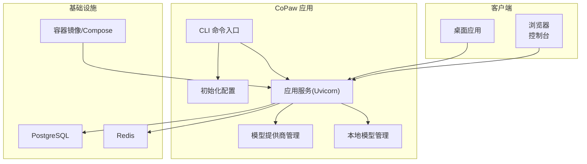
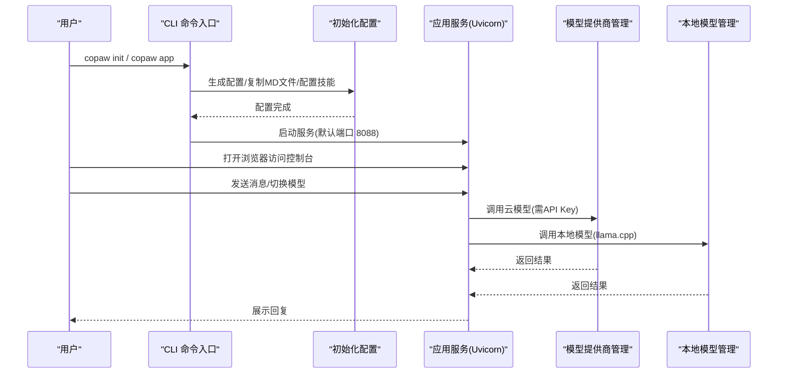
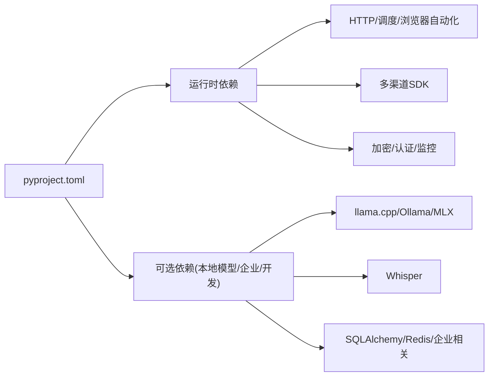

# 快速开始

<cite>
**本文引用的文件**
- [README.md](file://README.md)
- [docs/QUICK-START.zh.md](file://docs/QUICK-START.zh.md)
- [scripts/install.sh](file://scripts/install.sh)
- [scripts/install.ps1](file://scripts/install.ps1)
- [deploy/Dockerfile](file://deploy/Dockerfile)
- [docker-compose.yml](file://docker-compose.yml)
- [scripts/start-enterprise.sh](file://scripts/start-enterprise.sh)
- [scripts/start-enterprise.ps1](file://scripts/start-enterprise.ps1)
- [src/copaw/cli/main.py](file://src/copaw/cli/main.py)
- [src/copaw/cli/init_cmd.py](file://src/copaw/cli/init_cmd.py)
- [src/copaw/local_models/manager.py](file://src/copaw/local_models/manager.py)
- [src/copaw/providers/provider_manager.py](file://src/copaw/providers/provider_manager.py)
- [src/copaw/__version__.py](file://src/copaw/__version__.py)
- [pyproject.toml](file://pyproject.toml)
</cite>

## 目录
1. [简介](#简介)
2. [项目结构](#项目结构)
3. [核心组件](#核心组件)
4. [架构总览](#架构总览)
5. [详细组件分析](#详细组件分析)
6. [依赖分析](#依赖分析)
7. [性能考虑](#性能考虑)
8. [故障排除指南](#故障排除指南)
9. [结论](#结论)
10. [附录](#附录)

## 简介
本指南面向首次接触 CoPaw 的用户，目标是在约 10 分钟内完成从环境准备到首次使用的全流程。内容覆盖多种安装方式（pip、Docker、桌面应用、脚本安装、源码安装）、初始配置步骤（API 密钥、本地模型、基础使用）、部署方式选择建议与注意事项，并提供常见问题的解决方案。

## 项目结构
CoPaw 是一个可同时用于个人与企业场景的智能体助手平台，支持多通道接入、多智能体协作、技能扩展与安全控制。其核心由 Python 后端、Web 控制台前端、本地模型管理器、多提供商模型适配层以及企业级数据库与缓存组成。

图示来源
- [src/copaw/cli/main.py:152-168](file://src/copaw/cli/main.py#L152-L168)
- [src/copaw/cli/init_cmd.py:138-523](file://src/copaw/cli/init_cmd.py#L138-L523)
- [src/copaw/providers/provider_manager.py:1-200](file://src/copaw/providers/provider_manager.py#L1-L200)
- [src/copaw/local_models/manager.py:1-229](file://src/copaw/local_models/manager.py#L1-L229)
- [docker-compose.yml:1-92](file://docker-compose.yml#L1-L92)

章节来源
- [README.md:113-174](file://README.md#L113-L174)
- [docs/QUICK-START.zh.md:1-361](file://docs/QUICK-START.zh.md#L1-L361)

## 核心组件
- CLI 与初始化：通过命令行进行初始化、启动应用、管理技能与模型。
- 模型提供商管理：统一接入多家云厂商模型（如 DashScope、OpenAI、Gemini、Anthropic、SiliconFlow 等）。
- 本地模型管理：内置 llama.cpp 服务器控制、模型下载与上下文长度配置。
- 企业能力：PostgreSQL、Redis、审计日志、任务与工作流等。
- 部署方式：pip 安装、Docker 镜像、桌面应用、脚本安装、源码安装。

章节来源
- [src/copaw/cli/main.py:95-168](file://src/copaw/cli/main.py#L95-L168)
- [src/copaw/cli/init_cmd.py:119-523](file://src/copaw/cli/init_cmd.py#L119-L523)
- [src/copaw/providers/provider_manager.py:1-200](file://src/copaw/providers/provider_manager.py#L1-L200)
- [src/copaw/local_models/manager.py:33-229](file://src/copaw/local_models/manager.py#L33-L229)
- [docker-compose.yml:1-92](file://docker-compose.yml#L1-L92)

## 架构总览
下图展示从用户操作到模型推理与本地模型服务的关键调用链路。

图示来源
- [src/copaw/cli/main.py:152-168](file://src/copaw/cli/main.py#L152-L168)
- [src/copaw/cli/init_cmd.py:138-523](file://src/copaw/cli/init_cmd.py#L138-L523)
- [src/copaw/providers/provider_manager.py:1-200](file://src/copaw/providers/provider_manager.py#L1-L200)
- [src/copaw/local_models/manager.py:200-229](file://src/copaw/local_models/manager.py#L200-L229)

## 详细组件分析

### 安装与部署方式对比与选择建议
- pip 安装（个人使用）
  - 适合已有 Python 环境且希望最小化依赖的用户。
  - 步骤：安装包 → 初始化配置 → 启动应用 → 浏览器访问控制台。
- Docker 部署（快速体验/容器化）
  - 适合希望快速试用或在隔离环境中运行的用户。
  - 提供单机镜像与企业版 Compose 两种模式。
- 桌面应用（Beta）
  - 适合不熟悉命令行的用户，一键安装与启动。
- 脚本安装（自动化/国内网络优化）
  - 自动处理 uv、Python 环境与前端资源构建，支持指定版本与额外特性。
- 源码安装（开发/定制）
  - 适合需要深度定制或参与贡献的用户，需自行构建前端并安装依赖。

章节来源
- [README.md:115-174](file://README.md#L115-L174)
- [docs/QUICK-START.zh.md:19-223](file://docs/QUICK-START.zh.md#L19-L223)
- [scripts/install.sh:1-340](file://scripts/install.sh#L1-L340)
- [scripts/install.ps1:1-477](file://scripts/install.ps1#L1-L477)
- [deploy/Dockerfile:1-103](file://deploy/Dockerfile#L1-L103)
- [docker-compose.yml:1-92](file://docker-compose.yml#L1-L92)

### API 密钥配置
- 控制台配置：访问 http://127.0.0.1:8088/ → 设置 → 模型，按提示填写对应提供商密钥。
- CLI 初始化：运行初始化命令，按提示输入密钥。
- 环境变量：可将密钥写入环境变量或 .env 文件，便于自动化部署。

章节来源
- [README.md:255-266](file://README.md#L255-L266)
- [docs/QUICK-START.zh.md:225-248](file://docs/QUICK-START.zh.md#L225-L248)
- [src/copaw/cli/init_cmd.py:335-360](file://src/copaw/cli/init_cmd.py#L335-L360)

### 本地模型设置
- llama.cpp 服务器控制：支持下载、启动、停止与状态查询；可配置最大上下文长度。
- 推荐模型：根据硬件条件自动推荐，支持下载与删除。
- 无需 API Key：适合隐私敏感或离线场景。

章节来源
- [src/copaw/local_models/manager.py:33-229](file://src/copaw/local_models/manager.py#L33-L229)
- [README.md:269-279](file://README.md#L269-L279)

### 基本使用示例
- 在控制台发起对话，输入问题后查看回复。
- 常用命令：/new 新建会话、/compact 压缩历史、/skills 列出技能、/<技能名> 指定技能执行、/model 切换模型。
- 连接社交渠道：完成模型配置后，参考渠道配置文档接入钉钉、飞书、微信等。

章节来源
- [docs/QUICK-START.zh.md:251-278](file://docs/QUICK-START.zh.md#L251-L278)
- [README.md:93-95](file://README.md#L93-L95)

### 企业部署与管理脚本
- 企业版依赖 PostgreSQL 与 Redis，提供 Compose 文件与跨平台管理脚本。
- 管理脚本功能：前置检查（数据库/Redis 连通性）、数据库迁移、管理员账户创建、服务启停与状态查询。

章节来源
- [docker-compose.yml:1-92](file://docker-compose.yml#L1-L92)
- [scripts/start-enterprise.sh:1-510](file://scripts/start-enterprise.sh#L1-L510)
- [scripts/start-enterprise.ps1:1-718](file://scripts/start-enterprise.ps1#L1-L718)

## 依赖分析
- Python 版本要求：3.10 ≤ Python < 3.14。
- 关键依赖：HTTP 客户端、调度器、浏览器自动化、多渠道 SDK、加密与认证、监控等。
- 可选依赖：本地模型（llama.cpp、Ollama、MLX）、Whisper 语音识别、企业版数据库与缓存驱动等。

图示来源
- [pyproject.toml:1-124](file://pyproject.toml#L1-L124)

章节来源
- [pyproject.toml:6-45](file://pyproject.toml#L6-L45)
- [pyproject.toml:73-116](file://pyproject.toml#L73-L116)

## 性能考虑
- 本地模型上下文长度与显存占用呈正相关，可根据硬件调整最大上下文长度。
- 企业版建议为数据库与缓存分配足够资源，合理设置连接池大小与超时参数。
- 使用容器部署时，注意将工作目录与密钥目录映射为持久卷，避免重启丢失数据。

## 故障排除指南
- 端口被占用：通过命令行参数更换端口或在初始化后修改配置。
- 数据库连接失败：确认 PostgreSQL/Redis 服务正常、凭据正确、网络可达。
- Redis 连接失败：检查密码、端口与健康检查状态。
- 无法访问控制台：确认应用已启动且监听地址为 127.0.0.1:8088。
- 本地模型启动异常：检查系统依赖（如沙箱、字体、Chromium）与下载进度。

章节来源
- [docs/QUICK-START.zh.md:313-341](file://docs/QUICK-START.zh.md#L313-L341)
- [scripts/start-enterprise.sh:59-141](file://scripts/start-enterprise.sh#L59-L141)
- [scripts/start-enterprise.ps1:60-193](file://scripts/start-enterprise.ps1#L60-L193)

## 结论
通过本快速开始指南，您可以在 10 分钟内完成 CoPaw 的安装与首次使用。建议优先尝试 Docker 或脚本安装以降低环境门槛；个人使用可直接配置云模型密钥，企业部署请参考 Compose 与管理脚本。遇到问题时，优先检查端口、数据库与 Redis 连通性，并结合控制台与日志定位。

## 附录

### 选择建议与注意事项
- 个人使用（无企业需求）：优先 Docker 或脚本安装，快速体验后再按需切换 pip。
- 企业部署：使用 Compose 启动 PostgreSQL 与 Redis，配合管理脚本完成初始化与启停。
- 网络受限地区：脚本安装会自动选择镜像源并处理 uv 安装，减少网络问题影响。
- 安全与合规：企业版提供审计日志、RBAC、DLP 等能力，请在生产环境妥善配置密钥与访问控制。

章节来源
- [README.md:176-253](file://README.md#L176-L253)
- [docs/QUICK-START.zh.md:7-16](file://docs/QUICK-START.zh.md#L7-L16)