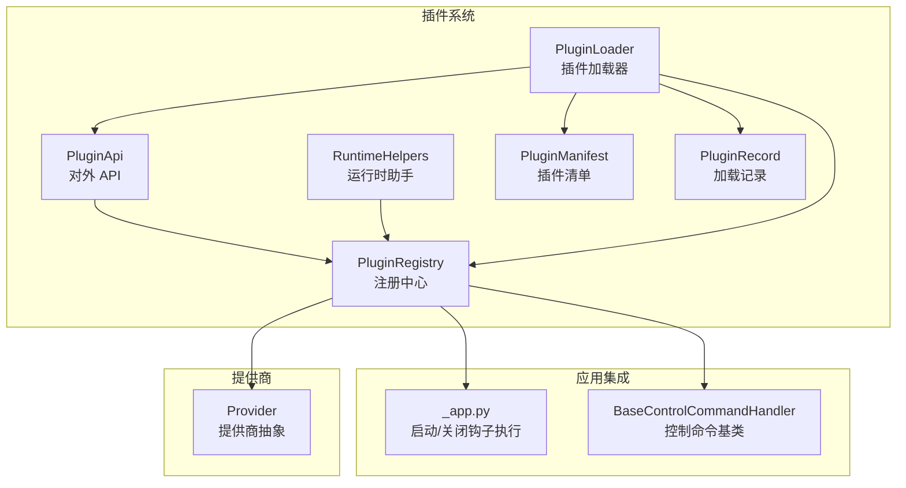
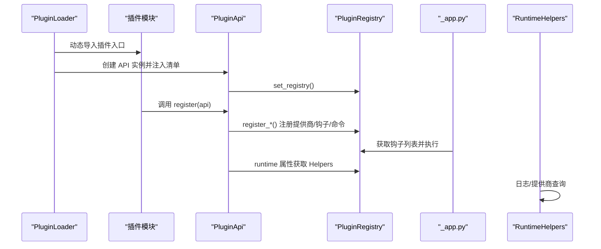
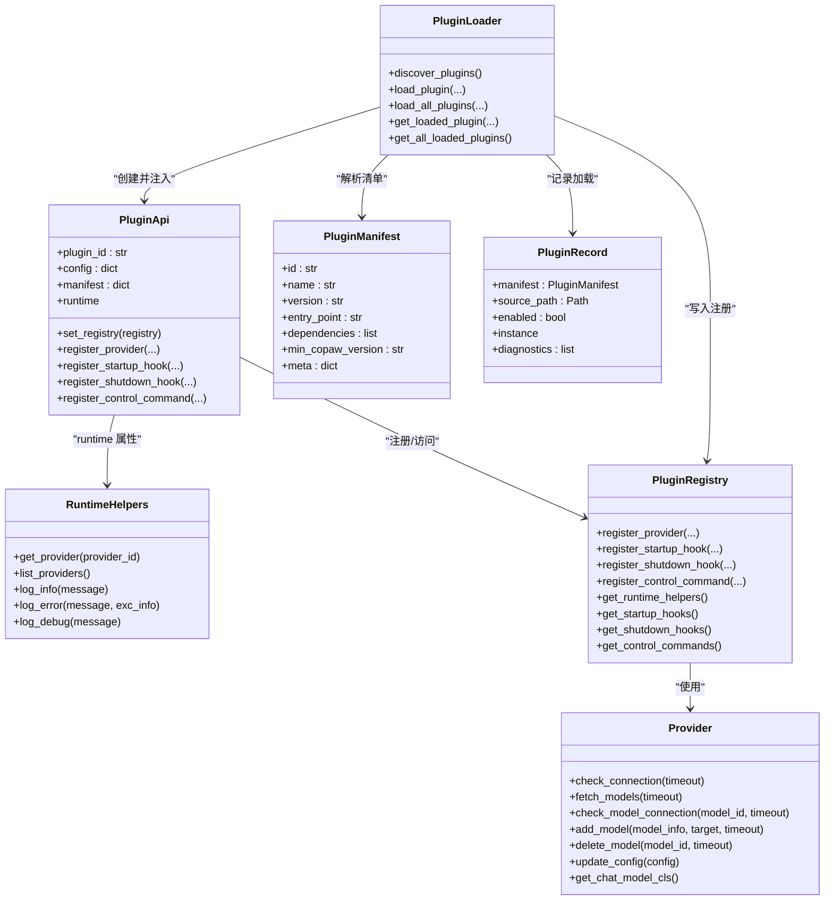

# 插件 API 参考

<cite>
**本文引用的文件**
- [api.py](file://src/copaw/plugins/api.py)
- [runtime.py](file://src/copaw/plugins/runtime.py)
- [registry.py](file://src/copaw/plugins/registry.py)
- [loader.py](file://src/copaw/plugins/loader.py)
- [architecture.py](file://src/copaw/plugins/architecture.py)
- [provider.py](file://src/copaw/providers/provider.py)
- [_app.py](file://src/copaw/app/_app.py)
- [base.py](file://src/copaw/app/runner/control_commands/base.py)
- [plugins.en.md](file://website/public/docs/plugins.en.md)
- [plugins.zh.md](file://website/public/docs/plugins.zh.md)
</cite>

## 目录
1. [简介](#简介)
2. [项目结构](#项目结构)
3. [核心组件](#核心组件)
4. [架构总览](#架构总览)
5. [详细组件分析](#详细组件分析)
6. [依赖关系分析](#依赖关系分析)
7. [性能考虑](#性能考虑)
8. [故障排除指南](#故障排除指南)
9. [结论](#结论)
10. [附录](#附录)

## 简介
本文档为 CoPaw 插件系统的完整 API 参考，重点覆盖 PluginApi 类及其运行时能力，帮助开发者快速掌握插件开发所需的接口与最佳实践。内容涵盖：
- PluginApi 类的所有公共方法与属性说明（含参数、返回值与使用要点）
- 插件运行时可访问的服务与工具（日志、配置、事件、提供商访问等）
- 注册机制（提供商、启动/关闭钩子、控制命令）的工作流程与示例路径
- 常见用法模式与故障排除建议

## 项目结构
围绕插件 API 的关键模块如下：
- 插件 API 核心：PluginApi（对外暴露的插件接口）
- 运行时助手：RuntimeHelpers（日志、提供商查询等）
- 中央注册表：PluginRegistry（集中管理提供商、钩子、控制命令）
- 插件加载器：PluginLoader（发现、加载、调用插件入口）
- 架构定义：PluginManifest、PluginRecord（清单与加载记录）
- 提供商基类：Provider（统一提供商接口）
- 应用集成：启动/关闭钩子执行、控制命令注册与执行

**图表来源**
- [api.py:10-186](file://src/copaw/plugins/api.py#L10-L186)
- [runtime.py:10-68](file://src/copaw/plugins/runtime.py#L10-L68)
- [registry.py:42-254](file://src/copaw/plugins/registry.py#L42-L254)
- [loader.py:19-241](file://src/copaw/plugins/loader.py#L19-L241)
- [architecture.py:9-55](file://src/copaw/plugins/architecture.py#L9-L55)
- [_app.py:337-374](file://src/copaw/app/_app.py#L337-L374)
- [base.py:44-69](file://src/copaw/app/runner/control_commands/base.py#L44-L69)
- [provider.py:111-200](file://src/copaw/providers/provider.py#L111-L200)

**章节来源**
- [api.py:10-186](file://src/copaw/plugins/api.py#L10-L186)
- [runtime.py:10-68](file://src/copaw/plugins/runtime.py#L10-L68)
- [registry.py:42-254](file://src/copaw/plugins/registry.py#L42-L254)
- [loader.py:19-241](file://src/copaw/plugins/loader.py#L19-L241)
- [architecture.py:9-55](file://src/copaw/plugins/architecture.py#L9-L55)

## 核心组件
- PluginApi：插件开发者直接使用的 API，负责注册提供商、钩子与控制命令，并访问运行时助手。
- RuntimeHelpers：提供日志记录、提供商查询、列表枚举等运行时能力。
- PluginRegistry：单例注册中心，维护提供商、钩子、控制命令的注册信息与执行顺序。
- PluginLoader：扫描插件目录、解析清单、动态加载插件模块并调用其注册函数。
- PluginManifest/PluginRecord：描述插件元数据与加载状态。
- Provider：统一的提供商抽象，支持连接检查、模型拉取、模型增删等。

**章节来源**
- [api.py:10-186](file://src/copaw/plugins/api.py#L10-L186)
- [runtime.py:10-68](file://src/copaw/plugins/runtime.py#L10-L68)
- [registry.py:42-254](file://src/copaw/plugins/registry.py#L42-L254)
- [loader.py:19-241](file://src/copaw/plugins/loader.py#L19-L241)
- [architecture.py:9-55](file://src/copaw/plugins/architecture.py#L9-L55)
- [provider.py:111-200](file://src/copaw/providers/provider.py#L111-L200)

## 架构总览
下图展示从插件加载到运行时钩子执行的关键交互：

**图表来源**
- [loader.py:118-176](file://src/copaw/plugins/loader.py#L118-L176)
- [api.py:35-41](file://src/copaw/plugins/api.py#L35-L41)
- [registry.py:73-147](file://src/copaw/plugins/registry.py#L73-L147)
- [_app.py:354-374](file://src/copaw/app/_app.py#L354-L374)
- [runtime.py:10-68](file://src/copaw/plugins/runtime.py#L10-L68)

## 详细组件分析

### PluginApi 类参考
PluginApi 是插件开发的核心入口，提供以下公共方法与属性：

- 初始化
  - 参数
    - plugin_id: 字符串，唯一标识插件
    - config: 字典，插件配置
    - manifest: 字典（可选），来自 plugin.json 的清单
  - 行为：保存传入参数，初始化内部注册表引用为空

- set_registry(registry)
  - 作用：设置注册中心实例（由加载器调用）
  - 参数：registry: PluginRegistry 实例
  - 返回：无

- register_provider(provider_id, provider_class, label="", base_url="", **metadata)
  - 作用：注册自定义 LLM 提供商
  - 参数
    - provider_id: 字符串，提供商唯一标识
    - provider_class: 继承自 Provider 的类
    - label: 显示名称（默认使用 provider_id）
    - base_url: API 基础地址
    - **metadata: 元数据（如 chat_model、require_api_key 等）
  - 返回：无
  - 注意：会将插件清单中的 meta 与传入 metadata 合并后提交给注册中心

- register_startup_hook(hook_name, callback, priority=100)
  - 作用：注册启动钩子
  - 参数
    - hook_name: 字符串，钩子唯一标识
    - callback: 同步或异步回调函数
    - priority: 整数，数值越小优先级越高（默认 100）
  - 返回：无

- register_shutdown_hook(hook_name, callback, priority=100)
  - 作用：注册关闭钩子
  - 参数
    - hook_name: 字符串，钩子唯一标识
    - callback: 同步或异步回调函数
    - priority: 整数，数值越小优先级越高（默认 100）
  - 返回：无

- register_control_command(handler, priority_level=10)
  - 作用：注册控制命令处理器
  - 参数
    - handler: 继承自 BaseControlCommandHandler 的实例
    - priority_level: 整数，数值越小优先级越高（默认 10）
  - 返回：无

- runtime 属性
  - 作用：访问运行时助手
  - 返回：RuntimeHelpers 实例或 None（当未设置注册中心时）

使用示例与参考路径（不包含具体代码内容）：
- 启动钩子注册示例：[plugins.en.md:101-117](file://website/public/docs/plugins.en.md#L101-L117)、[plugins.zh.md:101-117](file://website/public/docs/plugins.zh.md#L101-L117)
- 控制命令注册示例：[plugins.en.md:119-132](file://website/public/docs/plugins.en.md#L119-L132)、[plugins.zh.md:119-131](file://website/public/docs/plugins.zh.md#L119-L131)

**章节来源**
- [api.py:17-33](file://src/copaw/plugins/api.py#L17-L33)
- [api.py:35-41](file://src/copaw/plugins/api.py#L35-L41)
- [api.py:43-87](file://src/copaw/plugins/api.py#L43-L87)
- [api.py:89-119](file://src/copaw/plugins/api.py#L89-L119)
- [api.py:121-151](file://src/copaw/plugins/api.py#L121-L151)
- [api.py:153-174](file://src/copaw/plugins/api.py#L153-L174)
- [api.py:176-185](file://src/copaw/plugins/api.py#L176-L185)

### RuntimeHelpers 运行时助手
通过 PluginApi.runtime 访问，提供以下能力：
- get_provider(provider_id): 获取指定提供商实例（若可用）
- list_providers(): 列出所有可用提供商 ID
- log_info(message): 记录信息日志
- log_error(message, exc_info=False): 记录错误日志（可包含异常信息）
- log_debug(message): 记录调试日志

这些方法为插件在运行期进行诊断、日志输出与提供商查询提供了统一入口。

**章节来源**
- [runtime.py:21-32](file://src/copaw/plugins/runtime.py#L21-L32)
- [runtime.py:34-42](file://src/copaw/plugins/runtime.py#L34-L42)
- [runtime.py:44-59](file://src/copaw/plugins/runtime.py#L44-L59)
- [runtime.py:61-67](file://src/copaw/plugins/runtime.py#L61-L67)

### PluginRegistry 注册中心
作为单例，集中管理三类注册项：
- 提供商注册：ProviderRegistration（包含插件 ID、提供商 ID、类、标签、基础 URL、元数据）
- 钩子注册：HookRegistration（包含插件 ID、钩子名、回调、优先级）
- 控制命令注册：ControlCommandRegistration（包含插件 ID、处理器实例、优先级）

关键方法：
- register_provider(...)：注册提供商，重复 ID 将抛出异常
- register_startup_hook(...) / register_shutdown_hook(...)：注册钩子并按优先级排序
- register_control_command(...)：注册控制命令处理器
- get_runtime_helpers() / set_runtime_helpers()：运行时助手的存取
- get_startup_hooks() / get_shutdown_hooks() / get_control_commands()：获取已注册项列表

**章节来源**
- [registry.py:11-21](file://src/copaw/plugins/registry.py#L11-L21)
- [registry.py:23-40](file://src/copaw/plugins/registry.py#L23-L40)
- [registry.py:73-131](file://src/copaw/plugins/registry.py#L73-L131)
- [registry.py:149-221](file://src/copaw/plugins/registry.py#L149-L221)
- [registry.py:223-253](file://src/copaw/plugins/registry.py#L223-L253)

### PluginLoader 插件加载器
职责：
- 扫描插件目录，发现并加载插件清单（plugin.json）
- 动态导入插件入口模块，要求导出名为 plugin 的对象
- 创建 PluginApi 实例并注入清单，调用插件的 register(api) 方法
- 将插件注册信息写入 PluginRegistry，并记录加载结果

关键流程参考：
- 发现与加载：[loader.py:32-65](file://src/copaw/plugins/loader.py#L32-L65)、[loader.py:84-197](file://src/copaw/plugins/loader.py#L84-L197)
- 注册调用与异步支持：[loader.py:168-176](file://src/copaw/plugins/loader.py#L168-L176)

**章节来源**
- [loader.py:32-65](file://src/copaw/plugins/loader.py#L32-L65)
- [loader.py:84-197](file://src/copaw/plugins/loader.py#L84-L197)
- [loader.py:168-176](file://src/copaw/plugins/loader.py#L168-L176)

### 插件清单与记录
- PluginManifest：描述插件的基本信息（id、name、version、entry_point、dependencies、min_copaw_version、meta 等）
- PluginRecord：记录已加载插件的清单、源路径、启用状态、实例与诊断信息

**章节来源**
- [architecture.py:9-43](file://src/copaw/plugins/architecture.py#L9-L43)
- [architecture.py:46-55](file://src/copaw/plugins/architecture.py#L46-L55)

### 提供商抽象（Provider）
- 统一接口：check_connection、fetch_models、check_model_connection
- 辅助能力：add_model、delete_model、update_config、get_chat_model_cls
- 数据模型：ProviderInfo、ModelInfo（用于描述提供商与模型能力）

**章节来源**
- [provider.py:111-200](file://src/copaw/providers/provider.py#L111-L200)

### 控制命令处理器
- BaseControlCommandHandler：定义 command_name 与 handle(context) 抽象方法
- 插件通过 PluginApi.register_control_command(handler, priority_level) 注册命令处理器
- 应用层在启动时读取注册表并执行命令处理逻辑

**章节来源**
- [base.py:44-69](file://src/copaw/app/runner/control_commands/base.py#L44-L69)
- [api.py:153-174](file://src/copaw/plugins/api.py#L153-L174)
- [registry.py:223-253](file://src/copaw/plugins/registry.py#L223-L253)
- [_app.py:337-374](file://src/copaw/app/_app.py#L337-L374)

## 依赖关系分析

**图表来源**
- [api.py:10-186](file://src/copaw/plugins/api.py#L10-L186)
- [runtime.py:10-68](file://src/copaw/plugins/runtime.py#L10-L68)
- [registry.py:42-254](file://src/copaw/plugins/registry.py#L42-L254)
- [loader.py:19-241](file://src/copaw/plugins/loader.py#L19-L241)
- [architecture.py:9-55](file://src/copaw/plugins/architecture.py#L9-L55)
- [provider.py:111-200](file://src/copaw/providers/provider.py#L111-L200)

**章节来源**
- [api.py:10-186](file://src/copaw/plugins/api.py#L10-L186)
- [runtime.py:10-68](file://src/copaw/plugins/runtime.py#L10-L68)
- [registry.py:42-254](file://src/copaw/plugins/registry.py#L42-L254)
- [loader.py:19-241](file://src/copaw/plugins/loader.py#L19-L241)
- [architecture.py:9-55](file://src/copaw/plugins/architecture.py#L9-L55)
- [provider.py:111-200](file://src/copaw/providers/provider.py#L111-L200)

## 性能考虑
- 钩子优先级排序：注册时按优先级排序，执行时按顺序进行，避免不必要的等待链路。
- 异步支持：PluginLoader 在调用插件 register 时支持异步，确保耗时初始化不会阻塞主流程。
- 日志开销：RuntimeHelpers 的日志方法应按需使用，避免在高频路径中产生过多 I/O。
- 提供商查询：list_providers 与 get_provider 依赖 ProviderManager，建议缓存常用结果以减少重复查询。

[本节为通用指导，无需特定文件引用]

## 故障排除指南
- 插件未被加载
  - 检查插件目录是否存在且包含有效的 plugin.json
  - 确认插件入口文件存在且导出 plugin 对象
  - 参考：[loader.py:32-65](file://src/copaw/plugins/loader.py#L32-L65)、[loader.py:118-176](file://src/copaw/plugins/loader.py#L118-L176)
- 提供商 ID 冲突
  - 若提示提供商已被注册，检查是否重复注册相同 ID
  - 参考：[registry.py:95-100](file://src/copaw/plugins/registry.py#L95-L100)
- 钩子执行失败
  - 确保钩子回调具备正确的签名；应用层对异常进行捕获并记录
  - 参考：[_app.py:354-374](file://src/copaw/app/_app.py#L354-L374)
- 控制命令未生效
  - 确认命令处理器实现了 command_name 并正确注册
  - 参考：[base.py:44-69](file://src/copaw/app/runner/control_commands/base.py#L44-L69)、[api.py:153-174](file://src/copaw/plugins/api.py#L153-L174)

**章节来源**
- [loader.py:32-65](file://src/copaw/plugins/loader.py#L32-L65)
- [loader.py:118-176](file://src/copaw/plugins/loader.py#L118-L176)
- [registry.py:95-100](file://src/copaw/plugins/registry.py#L95-L100)
- [_app.py:354-374](file://src/copaw/app/_app.py#L354-L374)
- [base.py:44-69](file://src/copaw/app/runner/control_commands/base.py#L44-L69)
- [api.py:153-174](file://src/copaw/plugins/api.py#L153-L174)

## 结论
PluginApi 为插件开发者提供了简洁而强大的接口，结合 PluginRegistry 的集中管理与 PluginLoader 的自动化加载机制，形成了完整的插件生态。通过合理使用提供商注册、钩子与控制命令，开发者可以扩展 CoPaw 的能力并在运行时获得一致的日志与诊断体验。

[本节为总结性内容，无需特定文件引用]

## 附录

### 常用 API 使用模式
- 注册提供商
  - 步骤：在插件入口中创建 Provider 子类，随后调用 api.register_provider(...)
  - 参考：[api.py:43-87](file://src/copaw/plugins/api.py#L43-L87)
- 注册启动/关闭钩子
  - 步骤：定义回调函数，调用 api.register_startup_hook(...) 或 api.register_shutdown_hook(...)
  - 参考：[api.py:89-151](file://src/copaw/plugins/api.py#L89-L151)
- 注册控制命令
  - 步骤：实现 BaseControlCommandHandler 子类，调用 api.register_control_command(...)
  - 参考：[api.py:153-174](file://src/copaw/plugins/api.py#L153-L174)、[base.py:44-69](file://src/copaw/app/runner/control_commands/base.py#L44-L69)
- 运行时日志与诊断
  - 步骤：通过 api.runtime.log_* 输出日志；必要时使用 api.runtime.get_provider()/list_providers()
  - 参考：[runtime.py:44-67](file://src/copaw/plugins/runtime.py#L44-L67)

**章节来源**
- [api.py:43-174](file://src/copaw/plugins/api.py#L43-L174)
- [runtime.py:44-67](file://src/copaw/plugins/runtime.py#L44-L67)
- [base.py:44-69](file://src/copaw/app/runner/control_commands/base.py#L44-L69)