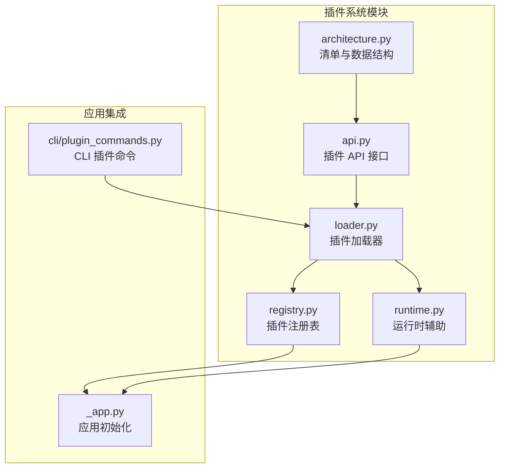
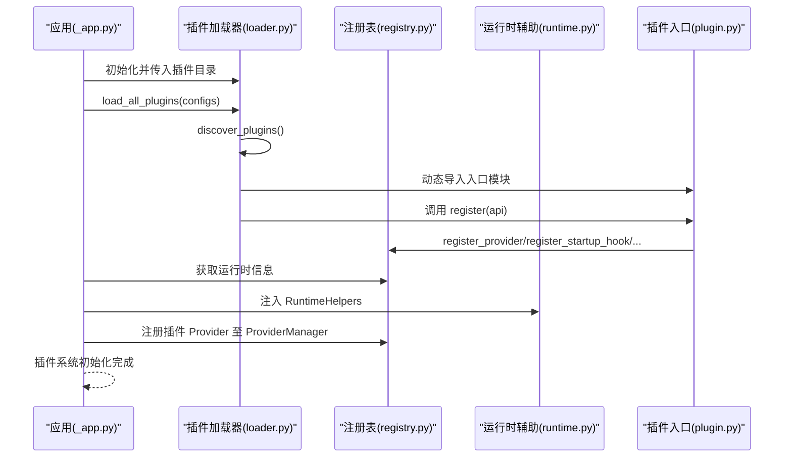
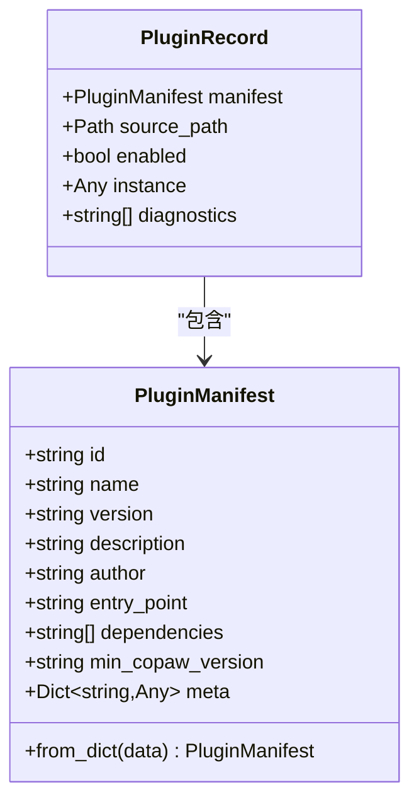
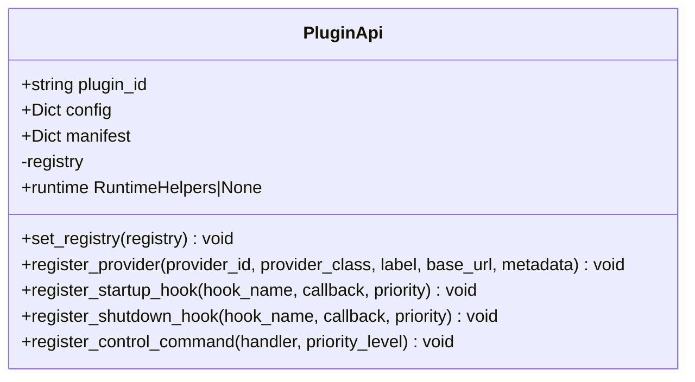
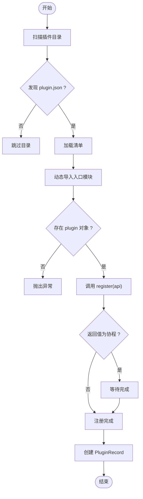
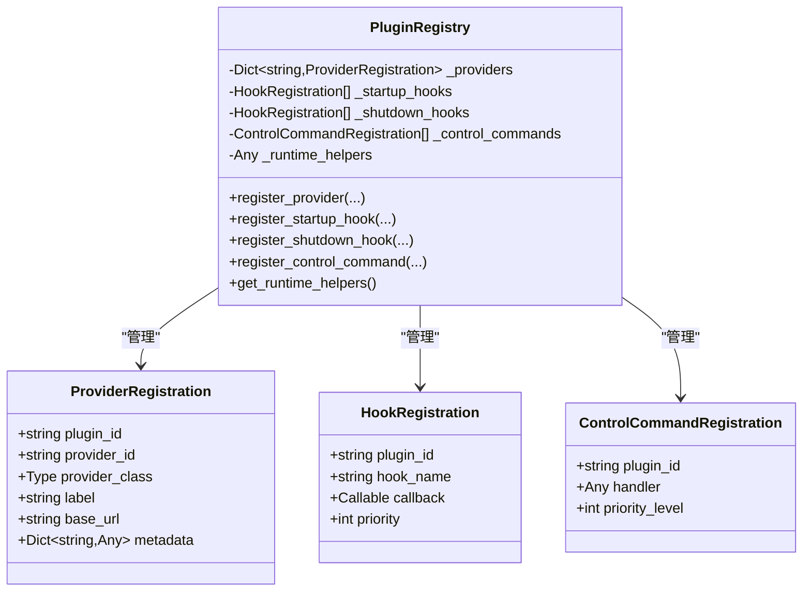
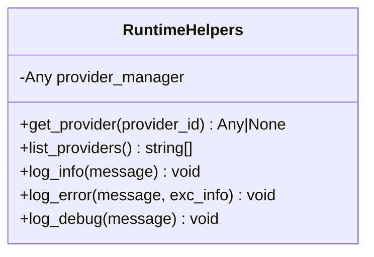
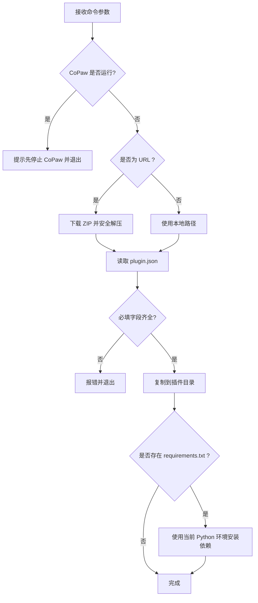
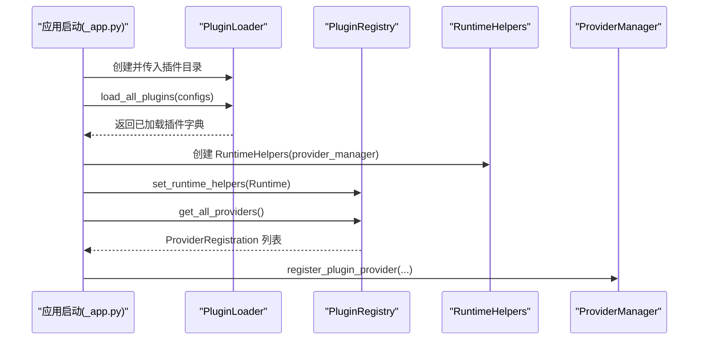
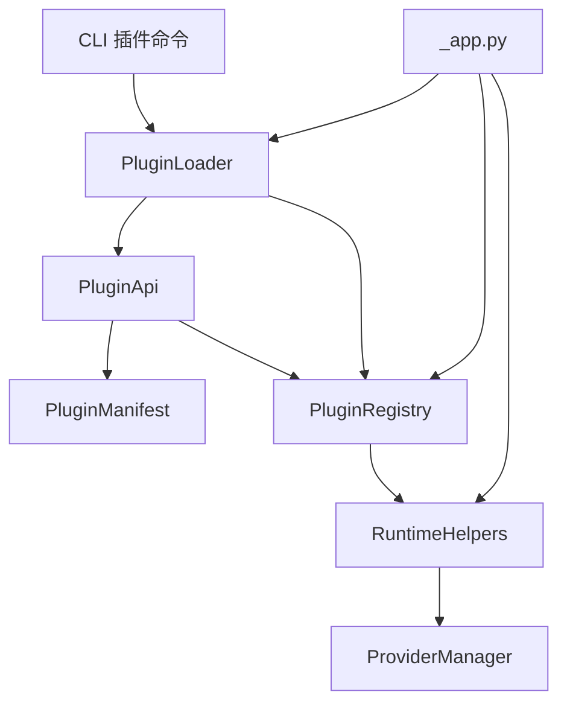

# 插件开发指南

<cite>
**本文引用的文件**
- [src/coproaw/plugins/__init__.py](file://src/coproaw/plugins/__init__.py)
- [src/coproaw/plugins/api.py](file://src/coproaw/plugins/api.py)
- [src/coproaw/plugins/architecture.py](file://src/coproaw/plugins/architecture.py)
- [src/coproaw/plugins/loader.py](file://src/coproaw/plugins/loader.py)
- [src/coproaw/plugins/registry.py](file://src/coproaw/plugins/registry.py)
- [src/coproaw/plugins/runtime.py](file://src/coproaw/plugins/runtime.py)
- [src/coproaw/cli/plugin_commands.py](file://src/coproaw/cli/plugin_commands.py)
- [src/coproaw/app/_app.py](file://src/coproaw/app/_app.py)
- [website/public/docs/plugins.zh.md](file://website/public/docs/plugins.zh.md)
</cite>

## 目录
1. [简介](#简介)
2. [项目结构](#项目结构)
3. [核心组件](#核心组件)
4. [架构总览](#架构总览)
5. [详细组件分析](#详细组件分析)
6. [依赖分析](#依赖分析)
7. [性能考虑](#性能考虑)
8. [故障排查指南](#故障排查指南)
9. [结论](#结论)
10. [附录](#附录)

## 简介
本指南面向希望为 CoPaw 开发插件的开发者，系统讲解插件系统的标准结构、清单文件 plugin.json 的编写规范、入口文件的实现要求，以及从项目初始化到测试、打包与发布的完整流程。同时提供插件 API 的使用方法与最佳实践，包括 register 方法的实现、异步操作与错误处理策略，并给出多种实际插件开发示例，覆盖自定义 Provider、生命周期钩子与魔法命令等不同功能扩展需求。

## 项目结构
CoPaw 插件系统位于 src/coproaw/plugins 目录下，核心由以下模块组成：
- 插件清单与数据结构：architecture.py
- 插件 API 接口：api.py
- 插件加载器：loader.py
- 插件注册表：registry.py
- 运行时辅助：runtime.py
- CLI 插件管理命令：cli/plugin_commands.py
- 应用初始化集成：app/_app.py
- 官方中文文档：website/public/docs/plugins.zh.md

**图表来源**
- [src/coproaw/plugins/architecture.py:9-55](file://src/coproaw/plugins/architecture.py#L9-L55)
- [src/coproaw/plugins/api.py:10-186](file://src/coproaw/plugins/api.py#L10-L186)
- [src/coproaw/plugins/loader.py:19-241](file://src/coproaw/plugins/loader.py#L19-L241)
- [src/coproaw/plugins/registry.py:42-254](file://src/coproaw/plugins/registry.py#L42-L254)
- [src/coproaw/plugins/runtime.py:10-68](file://src/coproaw/plugins/runtime.py#L10-L68)
- [src/coproaw/app/_app.py:270-307](file://src/coproaw/app/_app.py#L270-L307)
- [src/coproaw/cli/plugin_commands.py:99-411](file://src/coproaw/cli/plugin_commands.py#L99-L411)

**章节来源**
- [src/coproaw/plugins/__init__.py:1-16](file://src/coproaw/plugins/__init__.py#L1-L16)
- [src/coproaw/plugins/architecture.py:9-55](file://src/coproaw/plugins/architecture.py#L9-L55)
- [src/coproaw/plugins/api.py:10-186](file://src/coproaw/plugins/api.py#L10-L186)
- [src/coproaw/plugins/loader.py:19-241](file://src/coproaw/plugins/loader.py#L19-L241)
- [src/coproaw/plugins/registry.py:42-254](file://src/coproaw/plugins/registry.py#L42-L254)
- [src/coproaw/plugins/runtime.py:10-68](file://src/coproaw/plugins/runtime.py#L10-L68)
- [src/coproaw/cli/plugin_commands.py:99-411](file://src/coproaw/cli/plugin_commands.py#L99-L411)
- [src/coproaw/app/_app.py:270-307](file://src/coproaw/app/_app.py#L270-L307)
- [website/public/docs/plugins.zh.md:1-809](file://website/public/docs/plugins.zh.md#L1-L809)

## 核心组件
- 插件清单与数据结构：定义插件清单字段与序列化/反序列化方法，用于描述插件的基本信息、入口点、依赖与元数据。
- 插件 API：为插件提供注册接口，包括 Provider 注册、启动/关闭钩子注册、控制命令注册与运行时辅助访问。
- 插件加载器：扫描插件目录、解析清单、动态导入入口模块、调用 register 并支持同步/异步注册。
- 插件注册表：集中管理 Provider、钩子与控制命令的注册项，维护优先级排序与运行时查询。
- 运行时辅助：向插件暴露运行时能力，如 Provider 管理器访问、日志记录等。
- CLI 插件命令：提供安装、列出、信息查询、卸载与验证插件的能力，支持本地路径与远程 ZIP 安装。
- 应用初始化集成：在应用启动阶段初始化插件系统，加载用户插件目录中的插件并注入运行时辅助。

**章节来源**
- [src/coproaw/plugins/architecture.py:9-55](file://src/coproaw/plugins/architecture.py#L9-L55)
- [src/coproaw/plugins/api.py:10-186](file://src/coproaw/plugins/api.py#L10-L186)
- [src/coproaw/plugins/loader.py:19-241](file://src/coproaw/plugins/loader.py#L19-L241)
- [src/coproaw/plugins/registry.py:42-254](file://src/coproaw/plugins/registry.py#L42-L254)
- [src/coproaw/plugins/runtime.py:10-68](file://src/coproaw/plugins/runtime.py#L10-L68)
- [src/coproaw/cli/plugin_commands.py:99-411](file://src/coproaw/cli/plugin_commands.py#L99-L411)
- [src/coproaw/app/_app.py:270-307](file://src/coproaw/app/_app.py#L270-L307)

## 架构总览
下面的时序图展示了从应用启动到插件加载与注册的完整流程：

**图表来源**
- [src/coproaw/app/_app.py:270-307](file://src/coproaw/app/_app.py#L270-L307)
- [src/coproaw/plugins/loader.py:199-221](file://src/coproaw/plugins/loader.py#L199-L221)
- [src/coproaw/plugins/registry.py:42-254](file://src/coproaw/plugins/registry.py#L42-L254)
- [src/coproaw/plugins/runtime.py:10-68](file://src/coproaw/plugins/runtime.py#L10-L68)

## 详细组件分析

### 插件清单与数据结构（architecture.py）
- 数据类 PluginManifest：定义插件清单字段（id、name、version、description、author、entry_point、dependencies、min_copaw_version、meta），并提供 from_dict 工厂方法。
- 数据类 PluginRecord：记录已加载插件的清单、源路径、启用状态、实例与诊断信息。

**图表来源**
- [src/coproaw/plugins/architecture.py:9-55](file://src/coproaw/plugins/architecture.py#L9-L55)

**章节来源**
- [src/coproaw/plugins/architecture.py:9-55](file://src/coproaw/plugins/architecture.py#L9-L55)

### 插件 API（api.py）
- PluginApi：为插件提供统一的注册接口，包括：
  - register_provider：注册自定义 Provider，合并清单 meta 与元数据。
  - register_startup_hook / register_shutdown_hook：注册生命周期钩子，支持优先级排序。
  - register_control_command：注册控制命令处理器。
  - runtime 属性：访问运行时辅助（需在加载器设置 registry 后可用）。

**图表来源**
- [src/coproaw/plugins/api.py:10-186](file://src/coproaw/plugins/api.py#L10-L186)

**章节来源**
- [src/coproaw/plugins/api.py:10-186](file://src/coproaw/plugins/api.py#L10-L186)

### 插件加载器（loader.py）
- 职责：发现插件、加载清单、动态导入入口模块、调用 register（支持同步/异步）、构建 PluginRecord。
- 关键流程：
  - discover_plugins：遍历插件目录，查找 plugin.json 并解析为 PluginManifest。
  - load_plugin：校验入口点存在性，动态导入模块，导出 plugin 对象并调用其 register。
  - load_all_plugins：批量加载并收集结果。

**图表来源**
- [src/coproaw/plugins/loader.py:32-198](file://src/coproaw/plugins/loader.py#L32-L198)

**章节来源**
- [src/coproaw/plugins/loader.py:19-241](file://src/coproaw/plugins/loader.py#L19-L241)

### 插件注册表（registry.py）
- 职责：集中管理 Provider、启动/关闭钩子、控制命令；维护优先级排序；提供运行时辅助访问。
- 关键能力：
  - register_provider：去重校验，防止重复注册。
  - register_startup_hook / register_shutdown_hook：按优先级排序。
  - register_control_command：注册命令处理器。
  - get_runtime_helpers：供插件访问运行时信息。

**图表来源**
- [src/coproaw/plugins/registry.py:11-254](file://src/coproaw/plugins/registry.py#L11-L254)

**章节来源**
- [src/coproaw/plugins/registry.py:42-254](file://src/coproaw/plugins/registry.py#L42-L254)

### 运行时辅助（runtime.py）
- RuntimeHelpers：向插件暴露运行时能力，如获取 Provider、列举 Provider、日志记录等。

**图表来源**
- [src/coproaw/plugins/runtime.py:10-68](file://src/coproaw/plugins/runtime.py#L10-L68)

**章节来源**
- [src/coproaw/plugins/runtime.py:10-68](file://src/coproaw/plugins/runtime.py#L10-L68)

### CLI 插件命令（plugin_commands.py）
- 支持安装、列出、信息查询、卸载与验证插件：
  - install：支持本地路径与远程 ZIP，自动下载与解压，安全校验，安装 requirements.txt。
  - list/info/uninstall：查询与管理已安装插件。
  - validate：校验清单字段与入口点存在性。

**图表来源**
- [src/coproaw/cli/plugin_commands.py:104-411](file://src/coproaw/cli/plugin_commands.py#L104-L411)

**章节来源**
- [src/coproaw/cli/plugin_commands.py:99-411](file://src/coproaw/cli/plugin_commands.py#L99-L411)

### 应用初始化集成（_app.py）
- 在应用启动阶段：
  - 初始化插件目录列表（用户插件目录）。
  - 创建 PluginLoader，加载插件并传入配置。
  - 设置 RuntimeHelpers 并注入 ProviderManager。
  - 将注册表中的 Provider 注册到 ProviderManager。

**图表来源**
- [src/coproaw/app/_app.py:270-307](file://src/coproaw/app/_app.py#L270-L307)

**章节来源**
- [src/coproaw/app/_app.py:270-307](file://src/coproaw/app/_app.py#L270-L307)

## 依赖分析
- 组件内聚与耦合：
  - PluginApi 依赖 PluginManifest 与 PluginRegistry，负责对外暴露注册接口。
  - PluginLoader 依赖 architecture、api、registry，负责加载与注册。
  - PluginRegistry 作为中央存储，被 PluginApi 与 RuntimeHelpers 间接使用。
  - RuntimeHelpers 依赖 ProviderManager，为插件提供运行时能力。
  - CLI 与应用层通过 PluginLoader 与 Registry 交互。
- 外部依赖：
  - CLI 使用 Python 标准库与 click，支持 ZIP 下载与安全解压。
  - 应用层在启动时注入运行时辅助并注册 Provider。

**图表来源**
- [src/coproaw/plugins/api.py:10-186](file://src/coproaw/plugins/api.py#L10-L186)
- [src/coproaw/plugins/loader.py:19-241](file://src/coproaw/plugins/loader.py#L19-L241)
- [src/coproaw/plugins/registry.py:42-254](file://src/coproaw/plugins/registry.py#L42-L254)
- [src/coproaw/plugins/runtime.py:10-68](file://src/coproaw/plugins/runtime.py#L10-L68)
- [src/coproaw/cli/plugin_commands.py:99-411](file://src/coproaw/cli/plugin_commands.py#L99-L411)
- [src/coproaw/app/_app.py:270-307](file://src/coproaw/app/_app.py#L270-L307)

**章节来源**
- [src/coproaw/plugins/api.py:10-186](file://src/coproaw/plugins/api.py#L10-L186)
- [src/coproaw/plugins/loader.py:19-241](file://src/coproaw/plugins/loader.py#L19-L241)
- [src/coproaw/plugins/registry.py:42-254](file://src/coproaw/plugins/registry.py#L42-L254)
- [src/coproaw/plugins/runtime.py:10-68](file://src/coproaw/plugins/runtime.py#L10-L68)
- [src/coproaw/cli/plugin_commands.py:99-411](file://src/coproaw/cli/plugin_commands.py#L99-L411)
- [src/coproaw/app/_app.py:270-307](file://src/coproaw/app/_app.py#L270-L307)

## 性能考虑
- 异步注册：插件入口的 register 可返回协程，加载器会自动等待完成，避免阻塞主流程。
- 优先级排序：启动/关闭钩子按优先级升序执行，避免不必要的延迟。
- 动态导入：使用唯一模块名与子包搜索路径，减少全局污染与循环导入风险。
- 运行时辅助：仅在需要时通过 api.runtime 访问，避免频繁查询开销。

[本节为通用指导，不直接分析具体文件]

## 故障排查指南
- 插件未加载
  - 检查插件是否已安装与清单格式是否正确。
  - 查看应用日志中插件加载信息。
- 依赖安装失败
  - 检查 requirements.txt 格式，手动测试安装。
  - 使用 --force 重新安装插件。
- Provider 未显示
  - 确认插件已安装并重启应用。
  - 检查日志中的 Provider 注册信息。
- 命令未响应
  - 确认插件已安装且启动钩子执行成功。
  - 查看日志中的 patch 信息。

**章节来源**
- [website/public/docs/plugins.zh.md:651-692](file://website/public/docs/plugins.zh.md#L651-L692)

## 结论
CoPaw 插件系统通过清晰的数据结构、简洁的 API 接口与完善的加载/注册机制，为开发者提供了灵活的功能扩展能力。遵循本文档的结构规范、清单编写与实现要求，结合 CLI 的安装与管理流程，可高效地完成从开发到发布的全流程。建议在开发过程中重视错误处理、日志记录与依赖管理，并充分利用运行时辅助与钩子机制实现稳定可靠的插件功能。

[本节为总结性内容，不直接分析具体文件]

## 附录

### 插件开发流程（从零到发布）
- 项目初始化
  - 创建插件目录，准备 plugin.json 与 plugin.py。
  - 编写清单字段：id、name、version、entry_point、dependencies、min_copaw_version、meta。
- 实现入口文件
  - 在入口模块中导出 plugin 对象，实现 register 方法，调用 PluginApi 注册能力。
- 测试
  - 使用 copaw plugin validate 校验清单与入口点。
  - 使用 copaw plugin install 安装并在应用中验证功能。
- 打包与分发
  - 将插件目录打包为 ZIP，支持通过 URL 安装。
- 发布与维护
  - 更新版本号与依赖，重新打包并发布。

**章节来源**
- [website/public/docs/plugins.zh.md:133-196](file://website/public/docs/plugins.zh.md#L133-L196)
- [src/coproaw/cli/plugin_commands.py:367-411](file://src/coproaw/cli/plugin_commands.py#L367-L411)

### plugin.json 清单字段说明
- id：插件唯一标识（建议小写字母与连字符）。
- name：插件名称。
- version：语义化版本。
- description：简要描述。
- author：作者信息。
- entry_point：入口文件，默认 plugin.py。
- dependencies：Python 依赖列表。
- min_copaw_version：最低兼容版本。
- meta：扩展元数据（如 API Key 获取链接与提示）。

**章节来源**
- [src/coproaw/plugins/architecture.py:23-43](file://src/coproaw/plugins/architecture.py#L23-L43)
- [website/public/docs/plugins.zh.md:146-160](file://website/public/docs/plugins.zh.md#L146-L160)

### 入口文件实现要求
- 导出 plugin 对象：模块顶层必须导出名为 plugin 的实例。
- 实现 register 方法：接收 PluginApi 参数，完成 Provider/钩子/命令等注册。
- 支持异步：register 可返回协程，加载器会自动等待。
- 错误处理：在 register 中捕获异常并记录日志，避免中断应用启动。

**章节来源**
- [src/coproaw/plugins/loader.py:168-176](file://src/coproaw/plugins/loader.py#L168-L176)
- [website/public/docs/plugins.zh.md:162-196](file://website/public/docs/plugins.zh.md#L162-L196)

### 插件 API 使用方法与最佳实践
- Provider 注册
  - 使用 register_provider 注册自定义 Provider，合并清单 meta 与元数据。
- 生命周期钩子
  - 使用 register_startup_hook/register_shutdown_hook 注册钩子，合理设置优先级。
  - 钩子回调应优雅处理异常，避免阻塞应用启动。
- 控制命令
  - 使用 register_control_command 注册命令处理器。
- 运行时辅助
  - 通过 api.runtime 访问 ProviderManager 与日志工具。
- 文档与命名
  - 提供清晰的 README，遵循命名规范与版本管理。

**章节来源**
- [src/coproaw/plugins/api.py:43-186](file://src/coproaw/plugins/api.py#L43-L186)
- [website/public/docs/plugins.zh.md:582-626](file://website/public/docs/plugins.zh.md#L582-L626)

### 实际插件开发示例（概览）
- 自定义 Provider 插件
  - 在入口中动态导入 Provider 模块并通过 api.register_provider 注册。
- 启动钩子插件
  - 在 register 中注册启动钩子，初始化第三方服务或加载配置。
- 魔法命令插件
  - 通过猴子补丁改写查询处理器，将特定命令转换为 Agent 提示词。

**章节来源**
- [website/public/docs/plugins.zh.md:197-560](file://website/public/docs/plugins.zh.md#L197-L560)