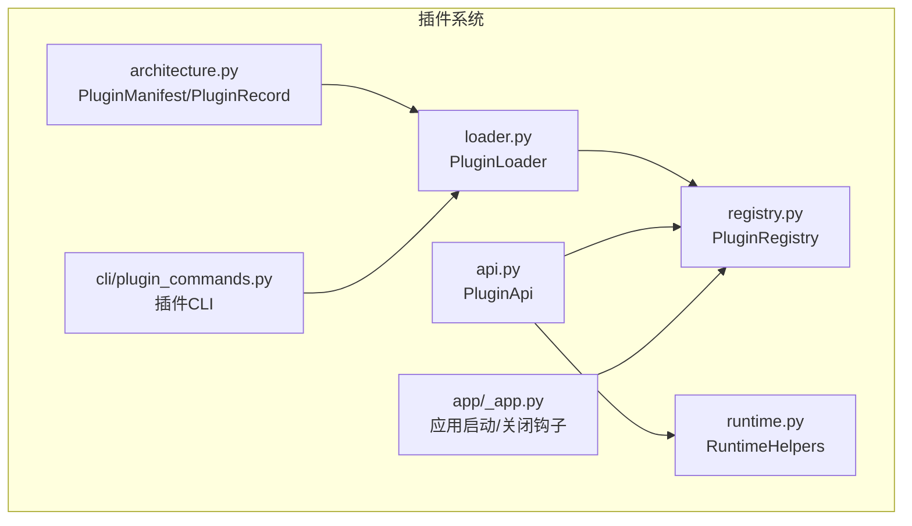
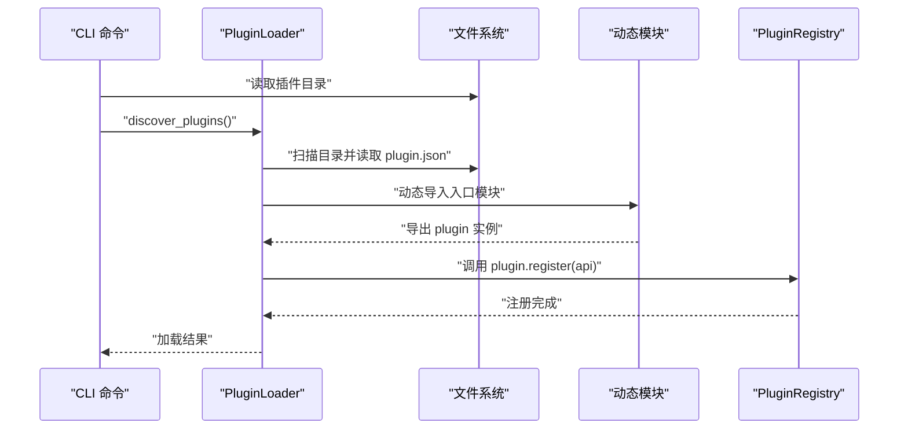
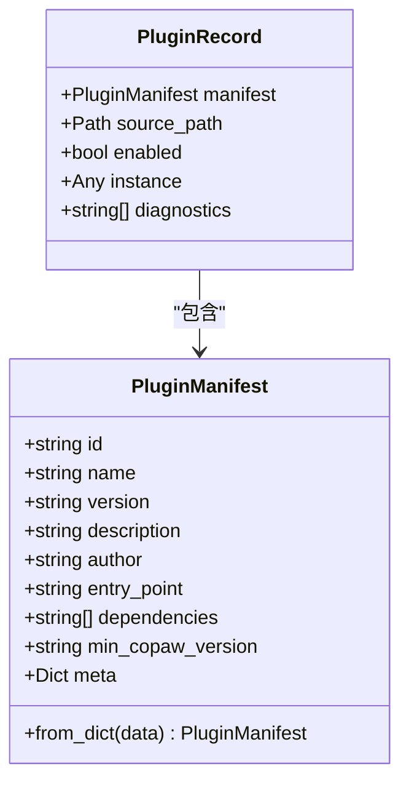
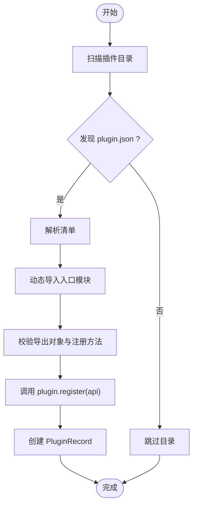
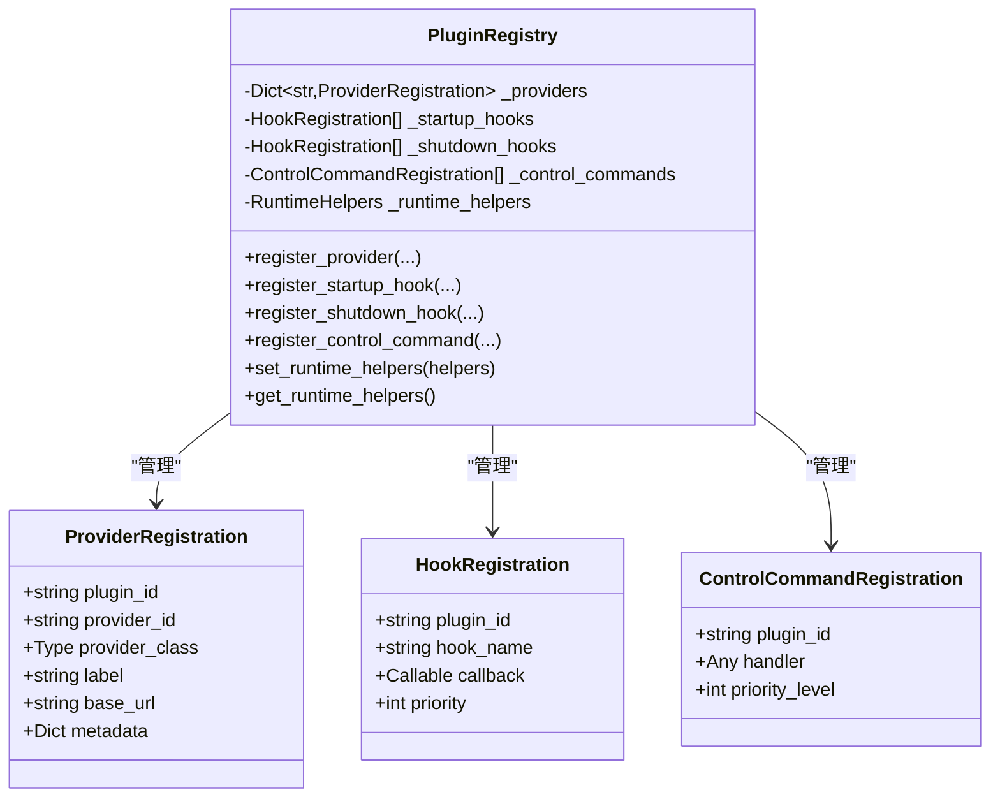
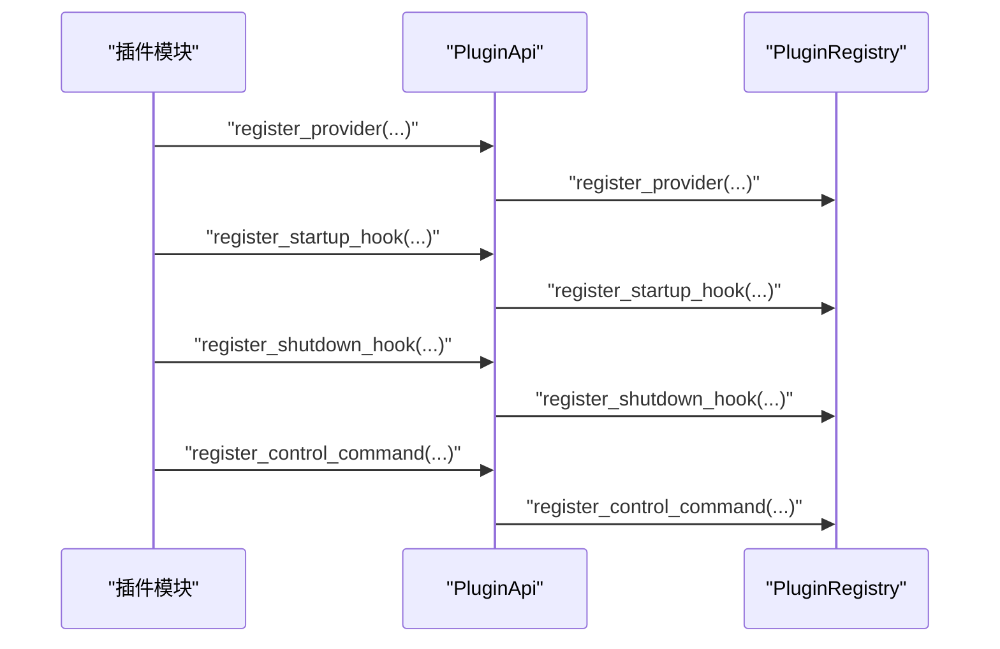
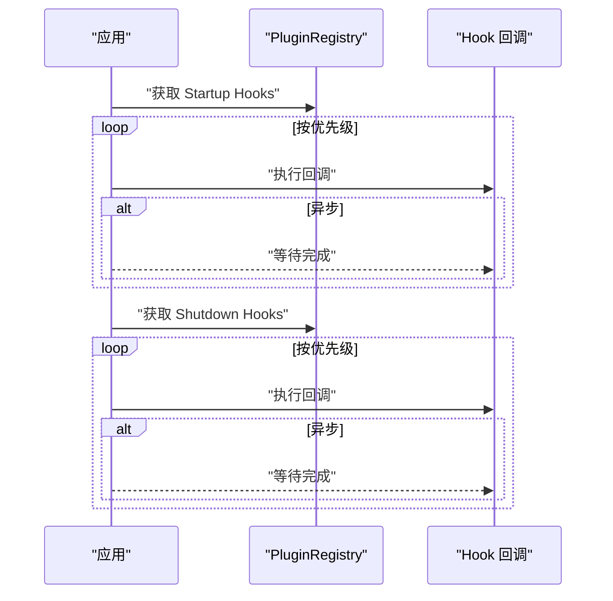
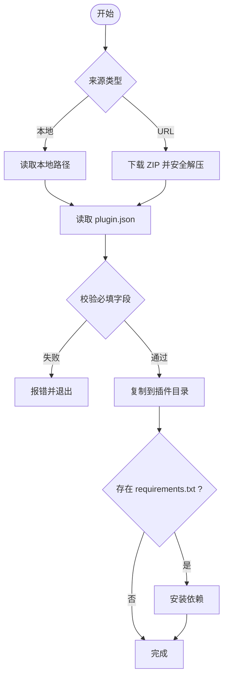
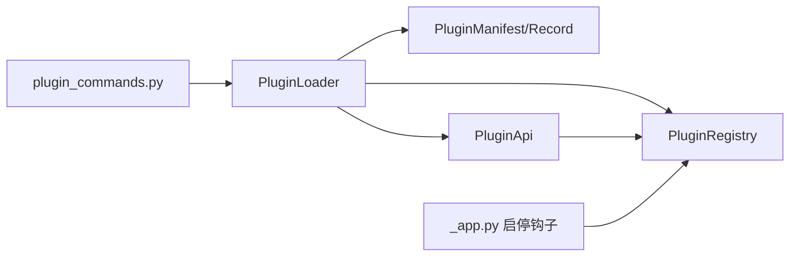

# 插件架构设计

<cite>
**本文引用的文件**
- [src\copaw\plugins\__init__.py](file://src\copaw\plugins\__init__.py)
- [src\copaw\plugins\architecture.py](file://src\copaw\plugins\architecture.py)
- [src\copaw\plugins\loader.py](file://src\copaw\plugins\loader.py)
- [src\copaw\plugins\registry.py](file://src\copaw\plugins\registry.py)
- [src\copaw\plugins\runtime.py](file://src\copaw\plugins\runtime.py)
- [src\copaw\plugins\api.py](file://src\copaw\plugins\api.py)
- [src\copaw\cli\plugin_commands.py](file://src\copaw\cli\plugin_commands.py)
- [src\copaw\app\_app.py](file://src\copaw\app\_app.py)
- [website\public\docs\plugins.zh.md](file://website\public\docs\plugins.zh.md)
</cite>

## 目录
1. [简介](#简介)
2. [项目结构](#项目结构)
3. [核心组件](#核心组件)
4. [架构总览](#架构总览)
5. [详细组件分析](#详细组件分析)
6. [依赖分析](#依赖分析)
7. [性能考虑](#性能考虑)
8. [故障排查指南](#故障排查指南)
9. [结论](#结论)
10. [附录](#附录)

## 简介
本文件面向开发者，系统性阐述 CoPaw 插件架构的设计理念与实现细节，重点覆盖以下方面：
- 插件系统整体架构与职责边界
- 核心数据结构 PluginManifest、PluginRecord 的设计与用途
- 插件生命周期管理（发现、加载、注册、钩子执行、卸载）
- 插件目录扫描、清单文件解析与动态模块加载技术
- 依赖解析与注册中心（PluginRegistry）的工作机制
- 插件开发最佳实践与设计模式

## 项目结构
CoPaw 插件系统位于 src/copaw/plugins 目录下，围绕“清单驱动 + 动态加载 + 注册中心”的模式组织：
- architecture.py：定义插件清单与记录的数据结构
- loader.py：负责插件目录扫描、清单解析、动态模块导入与加载
- registry.py：集中式注册中心，管理 Provider、Hook、控制命令等注册项
- api.py：插件开发者使用的 API 封装，屏蔽注册中心细节
- runtime.py：运行时辅助函数，向插件暴露有限的运行期能力
- cli/plugin_commands.py：插件安装/卸载/校验等 CLI 命令
- app/_app.py：应用启动/关闭阶段执行插件钩子

**图表来源**
- [src\copaw\plugins\architecture.py:9-55](file://src\copaw\plugins\architecture.py#L9-L55)
- [src\copaw\plugins\loader.py:19-241](file://src\copaw\plugins\loader.py#L19-L241)
- [src\copaw\plugins\registry.py:42-254](file://src\copaw\plugins\registry.py#L42-L254)
- [src\copaw\plugins\api.py:10-186](file://src\copaw\plugins\api.py#L10-L186)
- [src\copaw\plugins\runtime.py:10-68](file://src\copaw\plugins\runtime.py#L10-L68)
- [src\copaw\cli\plugin_commands.py:104-411](file://src\copaw\cli\plugin_commands.py#L104-L411)
- [src\copaw\app\_app.py:337-407](file://src\copaw\app\_app.py#L337-L407)

**章节来源**
- [src\copaw\plugins\__init__.py:1-16](file://src\copaw\plugins\__init__.py#L1-L16)
- [src\copaw\plugins\architecture.py:9-55](file://src\copaw\plugins\architecture.py#L9-L55)
- [src\copaw\plugins\loader.py:19-241](file://src\copaw\plugins\loader.py#L19-L241)
- [src\copaw\plugins\registry.py:42-254](file://src\copaw\plugins\registry.py#L42-L254)
- [src\copaw\plugins\api.py:10-186](file://src\copaw\plugins\api.py#L10-L186)
- [src\copaw\plugins\runtime.py:10-68](file://src\copaw\plugins\runtime.py#L10-L68)
- [src\copaw\cli\plugin_commands.py:104-411](file://src\copaw\cli\plugin_commands.py#L104-L411)
- [src\copaw\app\_app.py:337-407](file://src\copaw\app\_app.py#L337-L407)

## 核心组件
- PluginManifest：描述插件元数据与运行参数，来源于 plugin.json 的字典映射
- PluginRecord：记录已加载插件的完整上下文（清单、源路径、启用状态、实例、诊断信息）
- PluginLoader：扫描插件目录、解析清单、动态导入入口模块、调用插件注册方法
- PluginRegistry：单例注册中心，统一管理 Provider、Startup/Shutdown Hook、控制命令
- PluginApi：面向插件开发者的 API 封装，提供注册接口与运行时访问
- RuntimeHelpers：运行时辅助能力（日志、Provider 查询等）
- CLI 插件命令：安装/卸载/校验插件，支持从本地路径或 URL 下载 ZIP 并安全解压

**章节来源**
- [src\copaw\plugins\architecture.py:9-55](file://src\copaw\plugins\architecture.py#L9-L55)
- [src\copaw\plugins\loader.py:19-241](file://src\copaw\plugins\loader.py#L19-L241)
- [src\copaw\plugins\registry.py:42-254](file://src\copaw\plugins\registry.py#L42-L254)
- [src\copaw\plugins\api.py:10-186](file://src\copaw\plugins\api.py#L10-L186)
- [src\copaw\plugins\runtime.py:10-68](file://src\copaw\plugins\runtime.py#L10-L68)
- [src\copaw\cli\plugin_commands.py:104-411](file://src\copaw\cli\plugin_commands.py#L104-L411)

## 架构总览
插件系统采用“清单驱动 + 动态模块加载 + 中央注册”的分层架构：
- 清单层：plugin.json 定义插件标识、版本、入口点、依赖与最小 CoPaw 版本
- 扫描层：遍历插件目录，定位包含 plugin.json 的子目录
- 加载层：基于清单动态导入入口模块，调用插件的 register(api) 方法
- 注册层：插件通过 PluginApi 将能力注册到 PluginRegistry
- 生命周期层：应用启动/关闭阶段按优先级执行插件 Hook

**图表来源**
- [src\copaw\cli\plugin_commands.py:104-247](file://src\copaw\cli\plugin_commands.py#L104-L247)
- [src\copaw\plugins\loader.py:32-198](file://src\copaw\plugins\loader.py#L32-L198)
- [src\copaw\plugins\registry.py:42-254](file://src\copaw\plugins\registry.py#L42-L254)

**章节来源**
- [src\copaw\plugins\loader.py:32-198](file://src\copaw\plugins\loader.py#L32-L198)
- [src\copaw\plugins\registry.py:42-254](file://src\copaw\plugins\registry.py#L42-L254)
- [src\copaw\cli\plugin_commands.py:104-247](file://src\copaw\cli\plugin_commands.py#L104-L247)

## 详细组件分析

### 数据结构：PluginManifest 与 PluginRecord
- PluginManifest
  - 字段：id、name、version、description、author、entry_point、dependencies、min_copaw_version、meta
  - from_dict：从 JSON 字典构造，兼容缺失字段的默认值
- PluginRecord
  - 字段：manifest、source_path、enabled、instance、diagnostics
  - 作用：承载已加载插件的完整状态，便于查询与诊断

**图表来源**
- [src\copaw\plugins\architecture.py:9-55](file://src\copaw\plugins\architecture.py#L9-L55)

**章节来源**
- [src\copaw\plugins\architecture.py:9-55](file://src\copaw\plugins\architecture.py#L9-L55)

### 插件加载器：PluginLoader
- discover_plugins：遍历插件目录，定位包含 plugin.json 的子目录并解析清单
- _load_manifest：读取 plugin.json 并构造 PluginManifest
- load_plugin：动态导入入口模块，校验导出对象与注册方法，创建 PluginRecord
- load_all_plugins：批量加载并收集结果
- get_*：查询已加载插件

**图表来源**
- [src\copaw\plugins\loader.py:32-198](file://src\copaw\plugins\loader.py#L32-L198)

**章节来源**
- [src\copaw\plugins\loader.py:19-241](file://src\copaw\plugins\loader.py#L19-L241)

### 注册中心：PluginRegistry
- Provider 注册：防止重复注册，记录插件来源与元数据
- Hook 注册：支持启动/关闭钩子，按优先级排序
- 控制命令注册：注册命令处理器，支持优先级
- 运行时助手：设置/获取 RuntimeHelpers

**图表来源**
- [src\copaw\plugins\registry.py:42-254](file://src\copaw\plugins\registry.py#L42-L254)

**章节来源**
- [src\copaw\plugins\registry.py:42-254](file://src\copaw\plugins\registry.py#L42-L254)

### 插件 API：PluginApi
- register_provider：注册自定义 Provider，合并 manifest.meta 与传入元数据
- register_startup_hook/register_shutdown_hook：注册生命周期钩子，支持优先级
- register_control_command：注册控制命令处理器
- runtime：访问运行时助手

**图表来源**
- [src\copaw\plugins\api.py:43-175](file://src\copaw\plugins\api.py#L43-L175)
- [src\copaw\plugins\registry.py:73-253](file://src\copaw\plugins\registry.py#L73-L253)

**章节来源**
- [src\copaw\plugins\api.py:10-186](file://src\copaw\plugins\api.py#L10-L186)
- [src\copaw\plugins\registry.py:73-253](file://src\copaw\plugins\registry.py#L73-L253)

### 运行时助手：RuntimeHelpers
- 提供 Provider 查询、列表、日志等能力
- 通过 PluginRegistry.get_runtime_helpers() 暴露给插件

**章节来源**
- [src\copaw\plugins\runtime.py:10-68](file://src\copaw\plugins\runtime.py#L10-L68)
- [src\copaw\plugins\api.py:176-186](file://src\copaw\plugins\api.py#L176-L186)

### 应用生命周期钩子执行
- 应用启动：按优先级顺序执行 Startup Hook
- 应用关闭：按优先级顺序执行 Shutdown Hook
- 支持同步与异步回调

**图表来源**
- [src\copaw\app\_app.py:354-407](file://src\copaw\app\_app.py#L354-L407)
- [src\copaw\plugins\registry.py:207-221](file://src\copaw\plugins\registry.py#L207-L221)

**章节来源**
- [src\copaw\app\_app.py:337-407](file://src\copaw\app\_app.py#L337-L407)
- [src\copaw\plugins\registry.py:149-221](file://src\copaw\plugins\registry.py#L149-L221)

### 插件 CLI 管理
- install：支持本地路径与 URL（ZIP），安全解压，校验 plugin.json，安装 requirements.txt
- list/info/uninstall：列出、查看、卸载插件
- validate：校验插件结构与入口点存在性

**图表来源**
- [src\copaw\cli\plugin_commands.py:104-247](file://src\copaw\cli\plugin_commands.py#L104-L247)

**章节来源**
- [src\copaw\cli\plugin_commands.py:104-411](file://src\copaw\cli\plugin_commands.py#L104-L411)

## 依赖分析
- 组件内聚与耦合
  - PluginLoader 依赖 architecture、api、registry，承担“发现+加载”职责
  - PluginRegistry 作为单例，被 PluginApi 与应用生命周期使用
  - PluginApi 屏蔽注册中心细节，降低插件开发复杂度
- 外部依赖
  - Python 标准库（importlib、json、inspect、logging、pathlib）
  - CLI 依赖 click、urllib、subprocess、zipfile 等
- 循环依赖
  - 通过模块导入顺序与延迟调用避免循环依赖

**图表来源**
- [src\copaw\plugins\loader.py:12-14](file://src\copaw\plugins\loader.py#L12-L14)
- [src\copaw\plugins\api.py:35-41](file://src\copaw\plugins\api.py#L35-L41)
- [src\copaw\app\_app.py:355-401](file://src\copaw\app\_app.py#L355-L401)
- [src\copaw\cli\plugin_commands.py:119-122](file://src\copaw\cli\plugin_commands.py#L119-L122)

**章节来源**
- [src\copaw\plugins\loader.py:12-14](file://src\copaw\plugins\loader.py#L12-L14)
- [src\copaw\plugins\api.py:35-41](file://src\copaw\plugins\api.py#L35-L41)
- [src\copaw\app\_app.py:355-401](file://src\copaw\app\_app.py#L355-L401)
- [src\copaw\cli\plugin_commands.py:119-122](file://src\copaw\cli\plugin_commands.py#L119-L122)

## 性能考虑
- 动态导入与模块缓存：通过 sys.modules 缓存模块，避免重复导入
- 异步钩子：支持异步回调，减少阻塞
- 优先级排序：启动/关闭钩子按优先级排序，避免不必要的等待
- 清单解析：仅在发现目录时解析 plugin.json，减少 IO 开销

[本节为通用指导，无需具体文件分析]

## 故障排查指南
- 插件未被发现
  - 检查插件目录是否存在 plugin.json
  - 确认清单字段完整（id、name、version、entry_point）
- 动态导入失败
  - 确认 entry_point 文件存在且可执行
  - 检查插件模块是否导出 plugin 实例与 register 方法
- 注册冲突
  - Provider ID 重复：后注册覆盖先注册
  - 控制命令名称冲突：后注册覆盖先注册
- 依赖安装失败
  - requirements.txt 语法错误或网络异常
  - 使用自定义 PyPI 源时需正确配置索引地址
- 钩子执行异常
  - 确保钩子回调具备幂等性与异常处理
  - 启动/关闭钩子应避免长时间阻塞

**章节来源**
- [src\copaw\cli\plugin_commands.py:370-411](file://src\copaw\cli\plugin_commands.py#L370-L411)
- [src\copaw\plugins\registry.py:95-100](file://src\copaw\plugins\registry.py#L95-L100)
- [src\copaw\plugins\api.py:50-83](file://src\copaw\plugins\api.py#L50-L83)
- [website\public\docs\plugins.zh.md:792-808](file://website\public\docs\plugins.zh.md#L792-L808)

## 结论
CoPaw 插件系统以“清单驱动 + 动态加载 + 注册中心”为核心，提供了清晰的扩展点与稳定的生命周期管理。通过 PluginManifest/PluginRecord 明确数据契约，PluginLoader/PluginRegistry 解耦发现与注册逻辑，PluginApi 降低插件开发门槛，CLI 工具链保障插件全生命周期管理。遵循本文最佳实践，可构建高质量、可维护的插件生态。

[本节为总结性内容，无需具体文件分析]

## 附录

### 插件开发最佳实践
- 清单字段：严格填写 id、name、version、entry_point、dependencies、min_copaw_version
- 入口模块：导出 plugin 实例，实现 register(api) 方法
- Provider 注册：提供唯一 provider_id，合理设置 label/base_url/metadata
- Hook 设计：优先级越低执行越早；启动钩子需健壮，避免阻塞
- 依赖管理：使用 requirements.txt，必要时配置自定义 PyPI 源
- 日志记录：使用标准 logging 输出插件行为
- 文档与示例：提供 README.md 与最小可运行示例

**章节来源**
- [website\public\docs\plugins.zh.md:133-200](file://website\public\docs\plugins.zh.md#L133-L200)
- [website\public\docs\plugins.zh.md:582-626](file://website\public\docs\plugins.zh.md#L582-L626)
- [website\public\docs\plugins.zh.md:627-636](file://website\public\docs\plugins.zh.md#L627-L636)